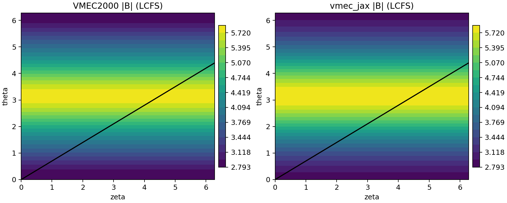
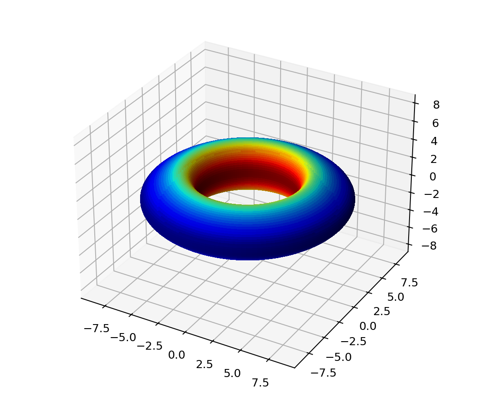
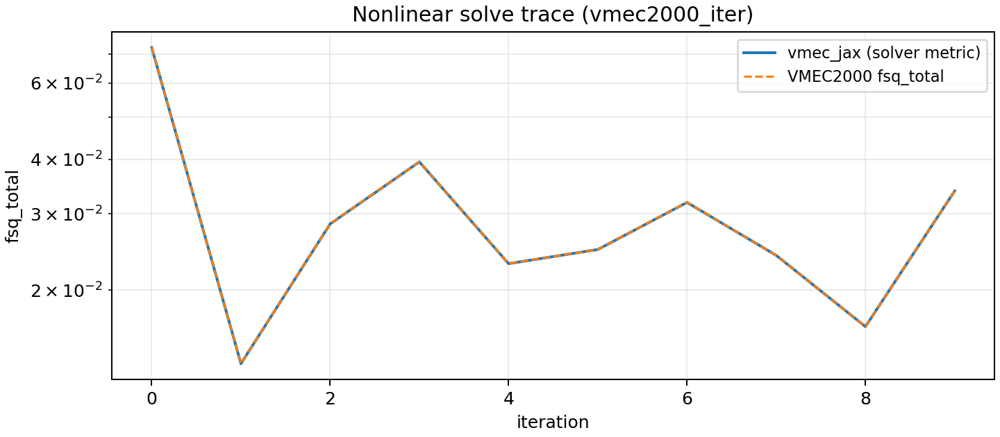
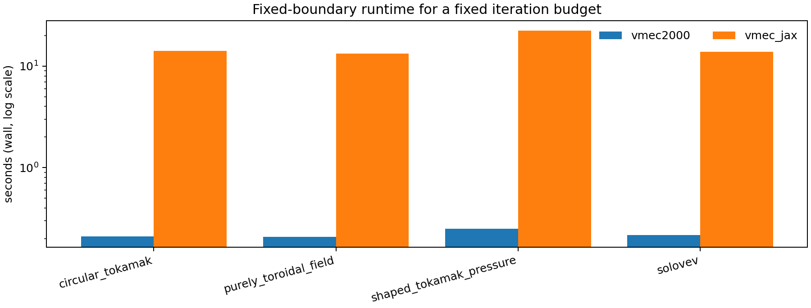
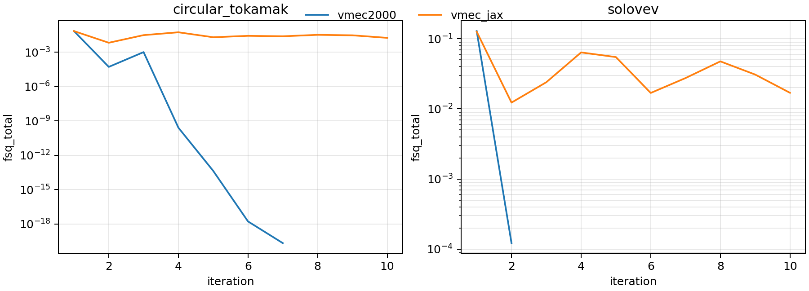
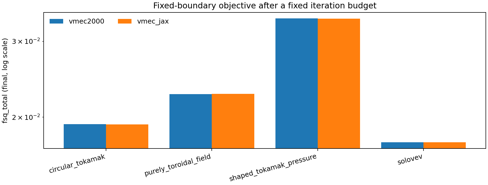

# vmec-jax

Laptop-friendly, end-to-end differentiable (JAX) rewrite of **VMEC2000**, focusing on **fixed-boundary** first.

## Scope (current)

- Fixed boundary only (free boundary deferred).
- Axisymmetric focus for end-to-end parity: `ntor=0`, `nfp=1`, `lasym=False`.
- Non-axisymmetric and `lasym=True` end-to-end parity are deferred, though many kernels are exercised on bundled 3D reference `wout` files.

## Quickstart

Run the end-to-end showcase (recommended):

```bash
python examples/showcase_axisym_input_to_wout.py --suite
```

Legacy `vmecPlot2.py` compatibility (NetCDF3 `wout` output):

```bash
python examples/showcase_axisym_input_to_wout.py --case circular_tokamak --max-iter 5 --no-vmec2000-trace
python vmecPlot2.py examples/outputs/showcase/circular_tokamak/wout_circular_tokamak_vmec_jax.nc /tmp/vmecplot2_jax
```

Run tests:

```bash
pytest -q
```

## Snapshot figures

Generated from the bundled `shaped_tokamak_pressure` case (short multigrid run to stay under ~1 minute):

```bash
python examples/showcase_axisym_input_to_wout.py \
  --case shaped_tokamak_pressure \
  --max-iter 10 \
  --emit-readme-figures \
  --vmec2000-timeout 60 \
  --vmec2000-nstep 1
```

<table>
  <tr>
    <td colspan="2"></td>
  </tr>
  <tr>
    <td colspan="2"></td>
  </tr>
  <tr>
    <td colspan="2"></td>
  </tr>
  <tr>
    <td colspan="2"></td>
  </tr>
</table>

Interpretation of the snapshot figures:

- The residual trace overlay is a **per-iteration VMEC2000 executable trace** (dashed) from `threed1.*`. The multigrid run (ns=13→25→51, total 10 iterations) matches vmec_jax at ~1e-3 rtol and typically much tighter.
- The LCFS `|B|` panel now uses **vmecPlot2-style grids** (theta/zeta resolution and toroidal-angle conventions) for both VMEC2000 and vmec_jax. Differences here reflect solver parity, not plotting.

## Parity status (VMEC2000)

Parity work is tracked in two layers:

- **Kernel parity on reference states (solver-free):** reconstruct intermediate quantities from a *reference* `wout` state and compare to the quantities stored in that same `wout`. This isolates conventions and avoids solver noise.
- **End-to-end solve parity:** run a nonlinear fixed-boundary solve from `input.*` and compare the final `wout` to the VMEC2000 reference. This depends on the update loop (preconditioning, time-step control, triggers), and is still in progress.

Reproduce the current kernel-parity snapshot table:

```bash
python examples/validation/pipeline_parity_summary.py
```

Current kernel-parity snapshot (solver-free, bundled reference states):

| Variable | circular_tokamak | shaped_tokamak_pressure | solovev | li383_low_res |
|---| :--: | :--: | :--: | :--: |
| sqrtg | 3.10e-15 | 1.24e-14 | 2.19e-15 | 2.10e-14 |
| bsupu | 2.46e-15 | 1.13e-14 | 2.18e-15 | 2.25e-14 |
| bsupv | 3.06e-15 | 1.32e-14 | 2.27e-15 | 2.09e-14 |
| bsubu | 7.20e-07 | 4.57e-05 | 2.41e-05 | 7.55e-02 |
| bsubv | 1.24e-05 | 2.59e-05 | 3.11e-05 | 1.13e-02 |
| abs(B) | 3.09e-15 | 1.25e-14 | 2.20e-15 | 2.16e-14 |
| bsq = 0.5*B^2 + p | 6.17e-15 | 2.64e-14 | 4.57e-15 | 4.23e-14 |
| fsqr | 4.05e-09 | 3.51e-08 | 3.64e-07 | 4.34e+03 |
| fsqz | 5.78e-10 | 2.73e-08 | 2.69e-07 | 8.31e+03 |
| fsql | 1.93e-10 | 6.14e-11 | 6.42e-07 | 1.11e+05 |
| fsq_total | 4.82e-09 | 7.88e-09 | 2.56e-07 | 6.70e+03 |

Interpretation:
- Axisymmetric cases are at floating-point parity for geometry, ``bsup*``, and ``abs(B)``.
- Axisymmetric tomnsps/gc blocks (including lambda-force ``blmn/clmn``) match VMEC2000 to ~1e-11 abs on reduced grids; scalar residuals now match VMEC2000 at machine precision in single-grid parity runs.
- The VMEC-style update loop uses scalxc-weighted forces, and ``xc``/``v`` dumps match VMEC2000 at iter 1 in reduced-grid parity runs.
- Remaining known gap: 3D ``bsub*`` (and the resulting scalar residuals) on some ``nfp>1`` cases.

Iteration trace parity (VMEC2000 executable, reduced grid):

- Single-grid axisym cases match ``fsq*`` and preconditioned scalars at machine precision for the first **15 iterations** at `--single-ns 13`. When split into two 15-iter phases with warm starts, the restart resets the time-step/momentum state, and the first mismatch appears at iteration 16. Full continuous 30-iter parity at `--single-ns 13` remains pending under the 60s cap.
- ``purely_toroidal_field`` multigrid trace matches through stage 4 iter 6, but ``r00``/``w`` diagnostics become ``NaN`` from iter 7 onward (state divergence still under investigation).
- ``up_down_asymmetric_tokamak`` (``lasym=True``) shows large bcovar/force-kernel mismatches at iter 1; nonlinear trace diverges. This is the current top lasym parity blocker.

Notes on the snapshot figures:

- The residual trace overlay uses the **VMEC2000 executable** (`xvmec2000`) per-iteration `threed1.*` table (dashed line). If the executable is not available, the plot falls back to a flat reference line at final `fsq_total`.
- The `|B|` LCFS panel uses the *same* vmecPlot2-style evaluation path for VMEC2000 and vmec_jax. Differences here reflect end-to-end solve mismatch (not a plotting artifact). For a fast single-grid parity check, use `--single-ns 13`.

Reproduce scalar residual parity (`fsqr/fsqz/fsql`) on reference states:

```bash
python examples/validation/getfsq_parity_cases.py --solve-metric
```

Reproduce the short end-to-end solve snapshot:

```bash
python examples/validation/end_to_end_solve_parity_summary.py --use-input-niter --fast
```

This is a quick sanity run (reduced cases and resolution). For a full parity snapshot, drop `--fast` and increase `--max-iter`, but expect longer runtimes.

## Benchmark (runtime + residual traces)

This script compares a *fixed iteration budget* across `vmec_jax` and (optionally) the **VMEC2000 executable** (`xvmec2000`). The current README figures were generated with a reduced grid (`ns=17`) and a 20-iteration budget to keep the total run under a few minutes:

```bash
python examples/validation/benchmark_fixed_boundary_runtime_and_residuals.py \
  --iters 20 \
  --cases circular_tokamak shaped_tokamak_pressure solovev purely_toroidal_field \
  --ns-override 17 \
  --run-vmec2000 --vmec2000-ns-override 17 --vmec2000-timeout 60 \
  --no-vmec2000-use-input-niter
```

The quick settings above keep runs under ~60s per case. Drop `--ns-override/--vmec2000-ns-override` to use the full input resolution and increase `--iters` for longer traces.

<table>
  <tr>
    <td></td>
    <td></td>
    <td></td>
  </tr>
</table>

## External VMEC2000 runs (optional)

If you have the VMEC2000 Python extension installed (`vmec` + `mpi4py` + `netCDF4`), you can run VMEC2000 on an input and compare against bundled references:

```bash
python tools/diagnostics/external_vmec_driver_compare.py --case circular_tokamak
```

For per-iteration trace parity against the VMEC2000 executable (single grid, quick run):

```bash
python tools/diagnostics/vmec2000_exec_stage_trace_compare.py --case circular_tokamak --max-iter 30 --vmec-nstep 1 --single-ns 13 --dump-level lite --vmec-timeout 60
```

This uses a reduced grid to stay under ~1 minute; increase `--max-iter`/`--single-ns` for deeper parity checks.

To scan internal force-block parity (tomnsps + gc) and stop at the first mismatch:

```bash
python tools/diagnostics/vmec2000_exec_internal_scan.py --case circular_tokamak --single-ns 17 --iter-start 1 --iter-stop 5
```

## Installation

Create an environment with Python >= 3.10.

Regular users (non-editable install):

```bash
python -m pip install -U pip
python -m pip install .
```

Developers (editable install):

```bash
python -m pip install -e .
```

Recommended extras:

```bash
# JAX runtime (CPU)
python -m pip install ".[jax]"

# Read VMEC2000 `wout_*.nc` reference files
python -m pip install ".[netcdf]"

# Publication-ready figures in examples
python -m pip install ".[plots]"

# Build docs locally
python -m pip install ".[docs]"

# Dev tools
python -m pip install -e ".[dev]"
```

VMEC is typically run in float64. Enable x64 for JAX:

```bash
export JAX_ENABLE_X64=1
```

## Documentation

Sphinx docs live in `docs/`. Build locally:

```bash
LANG=C LC_ALL=C python -m sphinx -b html docs docs/_build/html
```
