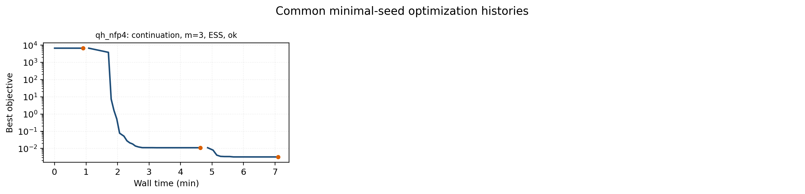

# vmec-jax

[](https://pypi.org/project/vmec-jax/)
[](https://github.com/conda-forge/vmec-jax-feedstock)
[](https://github.com/uwplasma/vmec_jax/blob/main/pyproject.toml)
[](https://github.com/uwplasma/vmec_jax/blob/main/LICENSE)
[](https://github.com/uwplasma/vmec_jax/actions/workflows/ci.yml)
[](https://codecov.io/gh/uwplasma/vmec_jax?branch=main)
[](https://vmec-jax.readthedocs.io/en/latest/)
[](https://pypi.org/project/vmec-jax/)

End-to-end differentiable JAX implementation of **VMEC2000** for fixed-boundary
and free-boundary ideal-MHD equilibria.

## Install

From PyPI:

```bash
pip install vmec-jax
```

PyPI and conda-forge can lag the repository tags. If you need an exact release,
check the package-index version before installing or pinning it.

The plain package includes plotting support (`matplotlib`) and the differentiable
Boozer transform dependency (`booz_xform_jax`), so no separate extra is needed.

From conda-forge:

```bash
pixi add vmec-jax
conda install --channel conda-forge vmec-jax
```

Developer install from source:

```bash
git clone https://github.com/uwplasma/vmec_jax
cd vmec_jax
pip install -e .
```

Generated WOUT fixtures and large optional validation assets stay out of git.
Run bundled inputs to generate new `wout_*.nc` files, or fetch the released
reference bundle for CI-style validation and docs regeneration:

```bash
python tools/fetch_assets.py --list
python tools/fetch_assets.py
```

## Quick Start

For a first run after `pip install vmec-jax`, use the bundled test case:

```bash
vmec_jax --test
```

This copies the packaged `input.nfp4_QH_warm_start` into `vmec_jax_test/`,
runs the solver, writes `wout_nfp4_QH_warm_start.nc`, and automatically plots
the WOUT file into `vmec_jax_test/figures/`. The terminal output also prints the
equivalent manual commands so new users can repeat each step themselves.

To run the same workflow manually with an input downloaded from the repository:

```bash
curl -L -O https://raw.githubusercontent.com/uwplasma/vmec_jax/main/examples/data/input.nfp4_QH_warm_start
vmec_jax input.nfp4_QH_warm_start
```

Plot the `wout_*.nc` file produced by that run:

```bash
vmec_jax --plot wout_nfp4_QH_warm_start.nc
vmec_jax --plot wout_nfp4_QH_warm_start.nc --outdir figures/
```

Run Boozer coordinates with the bundled `booz_xform_jax` dependency:

```bash
vmec_jax --booz input.nfp4_QH_warm_start
vmec_jax --booz --plot input.nfp4_QH_warm_start
vmec_jax --booz wout_nfp4_QH_warm_start.nc
vmec_jax --plot boozmn_nfp4_QH_warm_start.nc
```

`--booz --plot` writes the usual WOUT, Boozer `boozmn_*.nc`, and
Boozer-coordinate `|B|` contour and spectrum plots.

Use the Python API:

```python
import vmec_jax as vj

run = vj.run_fixed_boundary("input.nfp4_QH_warm_start")
wout_path = "wout_nfp4_QH_warm_start.nc"
vj.write_wout_from_fixed_boundary_run(wout_path, run, include_fsq=True)
vj.plot_wout(wout_path, outdir="figures/")
boozmn = vj.run_booz_xform(wout_path, mbooz=32, nbooz=32)
vj.plot_boozmn(boozmn, outdir="figures/")
```

For the bundled small free-boundary example, download both the input deck and
its magnetic grid into the same folder:

```bash
curl -L -O https://raw.githubusercontent.com/uwplasma/vmec_jax/main/examples/data/input.cth_like_free_bdy_lasym_small
curl -L -O https://raw.githubusercontent.com/uwplasma/vmec_jax/main/examples/data/mgrid_cth_like_lasym_small.nc
vmec_jax input.cth_like_free_bdy_lasym_small
```

### Direct-Coil Free-Boundary Research Lane

The direct-coil free-boundary research lane adds a JAX-native external-field
provider so free-boundary solves can sample differentiable Biot-Savart coils
directly, while the existing `mgrid` path remains the VMEC2000-compatibility
backend. Generated WOUTs and magnetic grids stay out of git; only compressed
summary panels are committed.

```bash
python examples/free_boundary_direct_coils_forward.py \
  --max-iter 4 \
  --outdir results/free_boundary_direct_coils_forward
```

With ESSOS on `PYTHONPATH`, `examples/free_boundary_essos_coils_beta_scan.py`
runs finite-pressure coil beta scans. The default pressure model is the
SIMSOPT/Landreman-style `e*(ne*Te+ni*Ti)` polynomial profile used by the
self-consistent bootstrap-current examples. Use `--resume-existing` to reuse
completed `wout_*_beta_*.nc` pressure-continuation seeds.

The DIII-D reference scan reaches final `ns=101`, `FTOL=1e-12`, and actual WOUT
betas through 3.33%; the LP-QA direct-coil lane promotes strict rows through
1.93%. The panels annotate LCFS RMS shifts and relative LCFS `|B|` changes
against vacuum; full nonlinear exact-adjoint gradients remain phase-2 work.
See `docs/free_boundary_coil_optimization.rst`.


## Backend Selection

`vmec_jax` follows the selected JAX backend. If CPU-only JAX is installed, runs
use CPU. If GPU-enabled JAX is installed and selected, runs use the accelerator;
`vmec_jax` does not silently force those runs back to CPU.

```bash
python -c "import jax; print(jax.default_backend()); print(jax.devices())"
JAX_PLATFORMS=cpu vmec_jax input.nfp4_QH_warm_start
JAX_PLATFORM_NAME=gpu vmec_jax input.nfp4_QH_warm_start
JAX_PLATFORMS=cuda vmec_jax input.nfp4_QH_warm_start
```

From Python, leave `solver_device` unset to inherit JAX's default backend, or
pass `solver_device="cpu"` / `solver_device="gpu"` explicitly.

## Optimization Examples

Editable optimization examples live in `examples/optimization/`. Start with
`examples/optimization/README.md`, then use `docs/optimization.rst`,
`docs/optimization_sweep_results.rst`, and `docs/piecewise_omnigenous_plan.rst`.

The current README snapshot separates two evidence types. The QA/QH/QP rows
below are synced common-minimal-seed GPU runs with aspect target 5,
continuation, ESS, and `max_mode=5`. The QI rows are reviewed case-gated NFP
coverage from the staged QI workflow; they are case-specific artifacts, not
aspect-5 README best-row promotion evidence. Extended policy discussion, LASYM
panels, finite-beta examples, failure modes, and artifact-promotion rules live
in the docs.

| Target | NFP | Evidence | Backend | Policy | max_mode | ESS | Final J | QI legacy | Mirror | Aspect | Iota | Wall time |
|---|---:|---|---|---|---:|---|---:|---:|---:|---:|---:|---:|
| QA | 2 | common minimal seed | GPU | continuation | 5 | yes | 1.09e-04 |  |  | 5.000 | 0.4200 | 25.3 min |
| QA | 3 | common minimal seed | GPU | continuation | 5 | yes | 4.21e-03 |  |  | 5.004 | 0.4201 | 17.3 min |
| QH | 3 | common minimal seed | GPU | continuation | 5 | yes | 9.14e-04 |  |  | 5.000 | -1.0474 | 17.4 min |
| QH | 4 | common minimal seed | GPU | continuation | 5 | yes | 2.08e-03 |  |  | 5.000 | -1.6951 | 24.6 min |
| QP | 2 | common minimal seed | GPU | continuation | 5 | yes | 2.34e-02 |  |  | 5.001 | -0.4177 | 16.7 min |
| QP | 3 | common minimal seed | GPU | continuation | 5 | yes | 9.80e-02 |  |  | 5.024 | -0.4144 | 14.7 min |
| QP | 4 | stress row, not promoted | GPU | continuation | 5 | yes | 7.45e+00 |  |  | 6.614 | -0.9373 | 9.4 min |
| QI | 1 | case-gated staged QI | CPU | staged | case | case | 1.56e-02 | 7.75e-04 | 0.242 | 9.999 | 0.5369 | 15.8 min |
| QI | 2 | case-gated staged QI | CPU | staged | case | case | 1.61e-02 | 5.25e-04 | 0.240 | 6.006 | -0.5994 | 28.7 min |
| QI | 3 | case-gated staged QI | CPU | staged | case | case | 9.33e-02 | 1.01e-03 | 0.304 | 3.541 | -1.0401 | 4.6 min |
| QI | 4 | case-gated staged QI | CPU | staged | case | case | 2.52e-02 | 2.54e-04 | 0.287 | 6.011 | -1.2930 | 0.4 min |

The QP NFP=4 row is intentionally visible as a current weak/stress row. The
uniform aspect-5 QI common-minimal matrix remains an open promotion target; the
case-gated QI panel shows the current reviewed NFP coverage.




Reproduce the common-minimal QA/QH/QP rows with:

```bash
PYTHONPATH=. JAX_PLATFORMS=cuda python3 examples/optimization/generate_minimal_seed_showcase.py \
  --cases qa_nfp2,qa_nfp3,qh_nfp3,qh_nfp4,qp_nfp2,qp_nfp3,qp_nfp4 --backend-label gpu \
  --solver-device gpu --worker-jax-platforms cuda --policy continuation --max-mode 5 --ess on \
  --max-nfev 60 --continuation-nfev 20 --inner-max-iter 550 --inner-ftol 1e-10 \
  --trial-max-iter 550 --trial-ftol 1e-10 \
  --ess-alpha 1.2 --case-timeout-s 7200 --rerun
PYTHONPATH=. python examples/optimization/render_minimal_seed_showcase.py --publication-matrix
```
Run individual editable examples with `python examples/optimization/QA_optimization.py`,
`QH_optimization.py`, `QP_optimization.py`, or `QI_optimization.py`. Full
provenance and artifact rules are in `docs/optimization.rst` and
`docs/optimization_sweep_results.rst`. Historical panels remain documented as
`readme_best_optimization_qa.png`, `readme_best_optimization_qh.png`,
`readme_best_optimization_qp.png`, and `readme_best_optimization_qi.png`.

## Performance, Validation, Release

- Performance notes: `docs/performance.rst`; validation and VMEC2000 parity:
  `docs/validation.rst`; coverage strategy: `docs/testing_strategy.rst`.
- Release checklist and CI gates: `docs/release_checklist.rst`; latest local
  rerun snapshot: `outputs/rerun_20260525_123334`.
- Latest repository release tag:
  [`v0.0.13`](https://github.com/uwplasma/vmec_jax/releases/tag/v0.0.13).
- Before tagging, re-check green CI with
  `gh run list --repo uwplasma/vmec_jax --branch main --workflow CI --limit 5`.

## CLI Reference

```text
vmec_jax input.*           run the equilibrium solver and write wout_*.nc
vmec_jax --plot wout.nc    generate VMEC diagnostic plots from a WOUT file
vmec_jax --booz wout.nc    run booz_xform_jax and write boozmn_*.nc
vmec_jax --plot boozmn.nc  generate Boozer contour and spectrum plots
vmec_jax --parity input.*  force the conservative VMEC2000-style loop
vmec_jax --help            show the full option list
```
