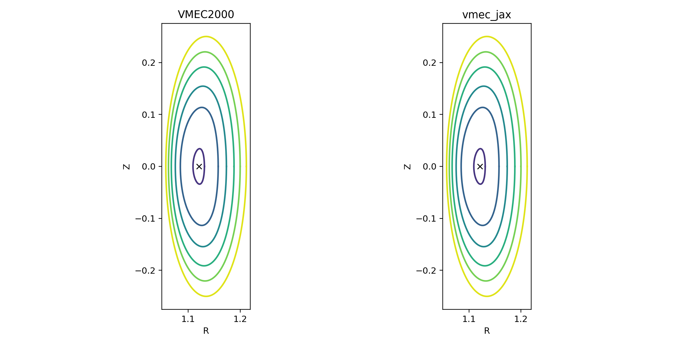
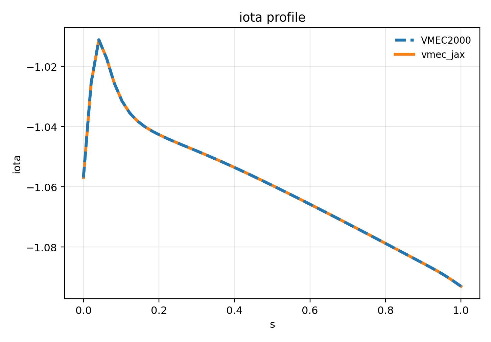

# vmec-jax

Laptop-friendly, end-to-end differentiable (JAX) rewrite of **VMEC2000**, focusing on **fixed-boundary** first.

<table>
  <tr>
    <td></td>
    <td></td>
  </tr>
  <tr>
    <td align="center">Axisymmetric: cross-section (VMEC2000 vs vmec_jax)</td>
    <td align="center">QH: cross-section (VMEC2000 vs vmec_jax)</td>
  </tr>
  <tr>
    <td></td>
    <td></td>
  </tr>
  <tr>
    <td align="center">Axisymmetric: 3D LCFS (VMEC2000 vs vmec_jax)</td>
    <td align="center">QH: 3D LCFS (VMEC2000 vs vmec_jax)</td>
  </tr>
  <tr>
    <td></td>
    <td></td>
  </tr>
  <tr>
    <td align="center">Axisymmetric: |B| on LCFS (VMEC2000 vs vmec_jax)</td>
    <td align="center">QH: |B| on LCFS (VMEC2000 vs vmec_jax)</td>
  </tr>
  <tr>
    <td></td>
    <td></td>
  </tr>
  <tr>
    <td align="center">Axisymmetric: iota (VMEC2000 vs vmec_jax)</td>
    <td align="center">QH: iota (VMEC2000 vs vmec_jax)</td>
  </tr>
  <tr>
    <td colspan="2"></td>
  </tr>
  <tr>
    <td align="center" colspan="2">fsq_total trace (VMEC2000 vs vmec_jax) for axisymmetric + QH cases</td>
  </tr>
</table>

## Scope (current)

- Fixed boundary only (free boundary deferred).
- Axisymmetric end-to-end parity is stable (`ntor=0`, `nfp=1`, `lasym=False`).
- Non-axisymmetric parity: QA/QH fixed-boundary sweeps pass at `rtol=1e-4`, `atol=1e-12` on 100-iteration full-grid runs. Use the comparator in `tools/diagnostics/` to regenerate the per-iteration traces and `wout` parity for additional 3D cases.

## Quickstart

Run the end-to-end showcase (recommended):

```bash
python examples/showcase_axisym_input_to_wout.py --suite
```

CLI (VMEC2000-style executable):

```bash
vmec_jax examples/data/input.circular_tokamak
```

This writes `wout_circular_tokamak.nc` next to the input file and prints the
VMEC2000-style screen table by default. Use `--quiet` to silence output, or
`--outdir` / `--output` to control where the `wout_*.nc` file is written. For
short debug runs, pass `--max-iter` and `--no-multigrid` (single grid).

By default the solver prints the VMEC2000-style per-iteration **screen** table
(FSQR/FSQZ/FSQL, RAX, DELT, WMHD). Pass ``--no-verbose`` to silence it.

Legacy `vmecPlot2.py` compatibility (NetCDF3 `wout` output):

```bash
python examples/showcase_axisym_input_to_wout.py --case circular_tokamak --max-iter 5 --no-vmec2000-trace
python vmecPlot2.py examples/outputs/showcase/circular_tokamak/wout_circular_tokamak_vmec_jax.nc /tmp/vmecplot2_jax
```

Run tests:

```bash
pytest -q
```

Profiling (fixed-boundary iterations):

```bash
python tools/diagnostics/profile_fixed_boundary.py --input examples/data/input.ITERModel --iters 3 --use-scan
python tools/diagnostics/profile_fixed_boundary.py --input examples/data/input.ITERModel --iters 3 --use-scan --simple-profile
```

The first command attempts a TensorBoard trace (requires a compatible TensorFlow install). Use `--simple-profile` to fall back to a timing-only run without TensorBoard.
`--use-scan` enables the fast ``lax.scan`` iteration path (no VMEC2000 control logic), which is ideal for performance profiling but not for per-iteration parity.
You can also select the scan path directly via solver `vmec2000_iter_fast` (alias `vmec2000_scan`).
Set `VMEC_JAX_USE_SCAN=1` to force scan mode for VMEC-style runs without changing code.
For a one-line opt-in to the fast path, pass `performance_mode=True` to `run_fixed_boundary(...)`.

VMEC2000 integration parity (requires the VMEC2000 executable):

```bash
VMEC2000_INTEGRATION=1 pytest -k vmec2000_exec_qa_regression
```

Note: `vmec_jax` enables JAX 64-bit in the fixed-boundary driver for parity. Set `JAX_ENABLE_X64=0` to prioritize speed.
For faster fixed-boundary solves in Python, the force/residual pipeline is JIT-compiled by default. Pass `jit_forces=False` to `run_fixed_boundary(...)` to disable it. Debug dump env vars automatically disable JIT.
For best performance, `VMECStatic` now precomputes VMEC real-space phase stacks. Set `VMEC_JAX_CACHE_VMEC_PHASE=0` to skip the extra cached tensors if you need to minimize memory.
To reduce repeat JIT compilation time across runs, set `VMEC_JAX_COMPILATION_CACHE_DIR=/path/to/cache` (or `JAX_COMPILATION_CACHE_DIR`) to enable the JAX compilation cache.
The fixed-boundary update also precomputes dense (m,n)->signed maps per solve to reduce scatter-heavy updates during iterations.
Scan mode batches the Z/L sin-block conversions into one matmul-based mapping to reduce kernel count.
Axis/edge enforcement now uses concatenation instead of scatter updates to keep the scan loop lighter.
Initial-guess axis blending updates all m=0 columns in one vectorized step to reduce startup overhead.
Mode scaling factors (1/(mscale*nscale)) are cached in `VMECStatic` to avoid repeated table gathers in the initial guess.
Lambda gauge enforcement uses a boolean mask instead of scatter updates in the iteration loop.
Axis m=0 masks are reused from `VMECStatic` to avoid per-iteration reconstruction.
`tomnsps` now defaults to a VMEC-style DFT using precomputed trig/weight tables and batched `dot_general` (GEMM-friendly). Set `VMEC_JAX_TOMNSPS_FFT=1` to re-enable the FFT path for experiments.
Boundary decomposition from input files is cached across runs (keyed by input path/mtime or a coefficient fingerprint) to reduce host overhead when solving the same case repeatedly.
Set `VMEC_JAX_INIT_GUESS_JAX=0` to force the legacy NumPy boundary-flip path; the default is the JAX-friendly path.

## README comparison figures

Reproduce the axisym + QH VMEC2000 vs vmec_jax panels shown above (single-plane
cross-sections, |B| on LCFS, iota overlays, plus the fsq_total trace):

```bash
python tools/diagnostics/qh_vmec_vs_vmecjax.py \
  --input examples/data/input.shaped_tokamak_pressure \
  --wout-ref examples/data/wout_shaped_tokamak_pressure_reference.nc \
  --use-wout-state --jax-title vmec_jax \
  --phi 0.0 --n-surfaces 6 \
  --prefix axisym --outdir docs/_static/figures

python tools/diagnostics/qh_vmec_vs_vmecjax.py \
  --input examples/data/input.nfp4_QH_warm_start \
  --wout-ref /path/to/wout_nfp4_QH_warm_start.nc \
  --use-wout-state --jax-title vmec_jax \
  --phi 0.0 --n-surfaces 6 \
  --prefix qh --outdir docs/_static/figures

python tools/diagnostics/readme_fsq_trace.py \
  --axisym-input examples/data/input.shaped_tokamak_pressure \
  --qh-input examples/data/input.nfp4_QH_warm_start \
  --niter 100 \
  --outdir docs/_static/figures
```

## Parity status (VMEC2000)

**Note:** The tables below reflect the most recently recorded sweeps. Re-run the
parity scripts in `tools/diagnostics/` to refresh numbers (including runtime
comparisons) after algorithm or performance changes. The current code path is
fast enough to collect hundreds of iterations for these tables.

Parity work is tracked in two layers:

- **Kernel parity on reference states (solver-free):** reconstruct intermediate quantities from a *reference* `wout` state and compare to the quantities stored in that same `wout`. This isolates conventions and avoids solver noise.
- **End-to-end solve parity:** run a nonlinear fixed-boundary solve from `input.*` and compare the final `wout` to the VMEC2000 reference. This depends on the update loop (preconditioning, time-step control, triggers), and is still in progress.

Reproduce the current kernel-parity snapshot table:

```bash
python examples/validation/pipeline_parity_summary.py \
  --cases circular_tokamak shaped_tokamak_pressure solovev \
  n3are_R7.75B5.7_lowres LandremanPaul2021_QA_lowres li383_low_res
```

Current kernel-parity snapshot (solver-free, bundled reference states):

| Variable | circular_tokamak | shaped_tokamak_pressure | solovev | n3are_R7.75B5.7_lowres | LandremanPaul2021_QA_lowres | li383_low_res |
|---| :--: | :--: | :--: | :--: | :--: | :--: |
| sqrtg | 2.53e-15 | 1.00e-14 | 1.47e-15 | 5.01e-13 | 3.61e-06 | 2.40e-14 |
| bsupu | 2.02e-15 | 9.12e-15 | 1.40e-15 | 4.87e-13 | 1.34e-05 | 2.73e-14 |
| bsupv | 2.58e-15 | 1.03e-14 | 1.45e-15 | 5.32e-13 | 5.26e-06 | 2.68e-14 |
| bsubu | 7.20e-07 | 4.57e-05 | 2.41e-05 | 7.03e-01 | 9.22e-06 | 1.08e+00 |
| bsubv | 1.24e-05 | 2.59e-05 | 3.11e-05 | 3.24e-02 | 4.62e-06 | 3.88e-02 |
| abs(B) | 2.50e-15 | 9.98e-15 | 1.41e-15 | 1.58e-02 | 4.90e-06 | 1.93e-02 |
| bsq = 0.5*B^2 + p | 5.12e-15 | 2.06e-14 | 2.85e-15 | 2.90e-02 | 1.02e-05 | 3.48e-02 |
| fsqr | 3.09e-09 | 1.54e-08 | 3.64e-07 | 1.82e+10 | 1.55e-03 | 4.77e+04 |
| fsqz | 1.24e-08 | 1.49e-08 | 2.69e-07 | 1.92e+11 | 9.11e+03 | 2.00e+06 |
| fsql | 1.00e-10 | 7.75e-11 | 6.42e-07 | 1.20e+14 | 7.06e-03 | 5.34e+07 |
| fsq_total | 9.17e-09 | 5.57e-10 | 2.56e-07 | 4.39e+11 | 1.56e+03 | 1.22e+06 |

Interpretation:
- Axisymmetric cases are at floating-point parity for geometry, ``bsup*``, and ``abs(B)``.
- Non-axisymmetric kernel parity remains the top gap (``bsub*``/``abs(B)``/``fsq_total`` columns above).
- End-to-end 3D trace parity matches VMEC2000 at `rtol=1e-4`, `atol=1e-12` for QA/QH on full grids; ``lasym=True`` and free-boundary remain out of parity.

Full-grid parity snapshot (VMEC2000 exec comparator, `--use-input-niter`, `--max-iter 100`, `rtol=1e-4`, `atol=1e-12`):

| Case | Input | Status | fsq_total (VMEC/JAX) | runtime_s (vmec2000/jax) | Notes |
|---|---|---|---|---|---|
| shaped_tokamak_pressure | `examples/data/input.shaped_tokamak_pressure` | PASS | `1.422e-07 / 1.422e-07` | `0.213 / 5.552` | Axisymmetric |
| QA signgs1 | `input.qa_signgs1` | PASS | `1.412e-04 / 1.412e-04` | `0.443 / 5.569` | 3D fixed boundary |
| QH warm start | `examples/data/input.nfp4_QH_warm_start` | PASS | `2.888e-07 / 2.888e-07` | `0.272 / 5.130` | 3D fixed boundary |

Iteration trace parity (VMEC2000 executable, reduced grid):

- Single-grid axisym cases match ``fsq*`` and preconditioned scalars at machine precision for the first **10 iterations** at `--single-ns 13`.
- Full-grid axisymmetric traces are stable at `rtol=1e-4`, `atol=1e-12` for 100-iteration runs.
- QA/QH full-grid traces now match VMEC2000 at `rtol=1e-4`, `atol=1e-12` for 100-iteration runs.
- ``up_down_asymmetric_tokamak`` (``lasym=True``) shows large bcovar/force-kernel mismatches at iter 1; nonlinear trace diverges. This is the current top lasym parity blocker.

Notes on the snapshot figures:

- The residual trace overlay uses the **VMEC2000 executable** (`xvmec2000`) per-iteration `threed1.*` table (dashed line). If the executable is not available, the plot falls back to a flat reference line at final `fsq_total`.
- The `|B|` LCFS panel uses the *same* vmecPlot2-style evaluation path for VMEC2000 and vmec_jax. Differences here reflect end-to-end solve mismatch (not a plotting artifact). For a fast single-grid parity check, use `--single-ns 13`.

Reproduce scalar residual parity (`fsqr/fsqz/fsql`) on reference states:

```bash
python examples/validation/getfsq_parity_cases.py --solve-metric
```

Reproduce the short end-to-end solve snapshot:

```bash
python examples/validation/end_to_end_solve_parity_summary.py --use-input-niter --fast
```

This is a quick sanity run (reduced cases and resolution). For a full parity snapshot, drop `--fast` and increase `--max-iter`, but expect longer runtimes.

## Benchmark (runtime + residual traces)

This script compares a *fixed iteration budget* across `vmec_jax` and the **VMEC2000 executable** (`xvmec2000`). The current README figures were generated with the parity-first default reduced grid (`ns=13`) and a 10-iteration budget:

```bash
python examples/validation/benchmark_fixed_boundary_runtime_and_residuals.py \
  --iters 10 \
  --cases circular_tokamak shaped_tokamak_pressure solovev purely_toroidal_field \
  --run-vmec2000 --vmec2000-timeout 60
```

The quick settings above keep runs under ~60s per case. Increase `--iters` and/or pass larger `--ns-override`/`--vmec2000-ns-override` for longer and higher-resolution traces.

## External VMEC2000 runs (optional)

If you have the VMEC2000 Python extension installed (`vmec` + `mpi4py` + `netCDF4`), you can run VMEC2000 on an input and compare against bundled references:

```bash
python tools/diagnostics/external_vmec_driver_compare.py --case circular_tokamak
```

For per-iteration trace parity against the VMEC2000 executable (single grid, quick run):

```bash
python tools/diagnostics/vmec2000_exec_stage_trace_compare.py --case circular_tokamak --max-iter 30 --vmec-nstep 1 --single-ns 13 --dump-level lite --vmec-timeout 60
python tools/diagnostics/vmec2000_exec_stage_trace_compare.py --case nfp4_QH_warm_start --max-iter 10 --single-ns 16 --vmec-timeout 60 --rtol 1e-4 --atol 1e-12
python tools/diagnostics/nonaxis_parity_batch.py --max-cases 8 --single-ns 13 --max-iter 1 --vmec-timeout 60
```

This uses a reduced grid to stay under ~1 minute; increase `--max-iter`/`--single-ns` for deeper parity checks.

To scan internal force-block parity (tomnsps + gc) and stop at the first mismatch:

```bash
python tools/diagnostics/vmec2000_exec_internal_scan.py --case circular_tokamak --single-ns 17 --iter-start 1 --iter-stop 5
```

## Installation

Create an environment with Python >= 3.10.

Regular users (non-editable install):

```bash
python -m pip install -U pip
python -m pip install .
```

Developers (editable install):

```bash
python -m pip install -e .
```

Recommended extras:

```bash
# JAX runtime (CPU)
python -m pip install ".[jax]"

# Read VMEC2000 `wout_*.nc` reference files
python -m pip install ".[netcdf]"

# Publication-ready figures in examples
python -m pip install ".[plots]"

# Build docs locally
python -m pip install ".[docs]"

# Dev tools
python -m pip install -e ".[dev]"
```

VMEC is typically run in float64. Enable x64 for JAX:

```bash
export JAX_ENABLE_X64=1
```

## Documentation

Sphinx docs live in `docs/`. Build locally:

```bash
LANG=C LC_ALL=C python -m sphinx -b html docs docs/_build/html
```
