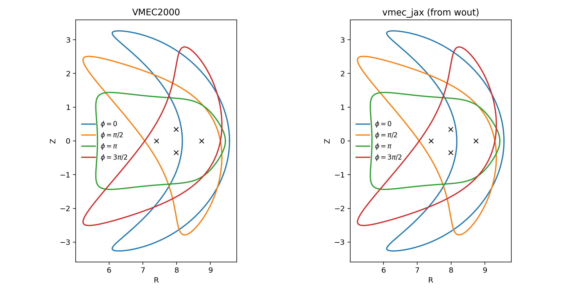
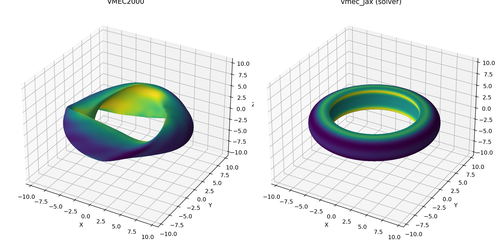
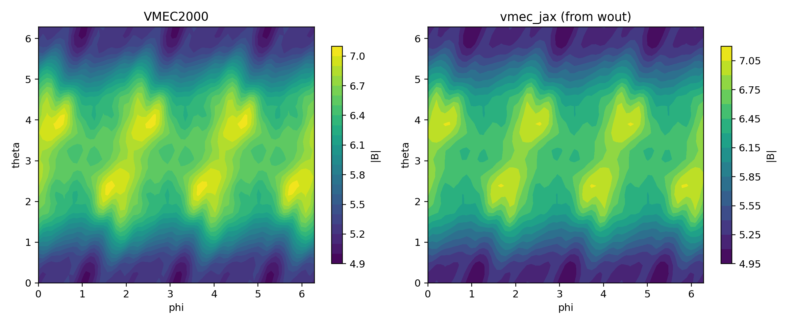
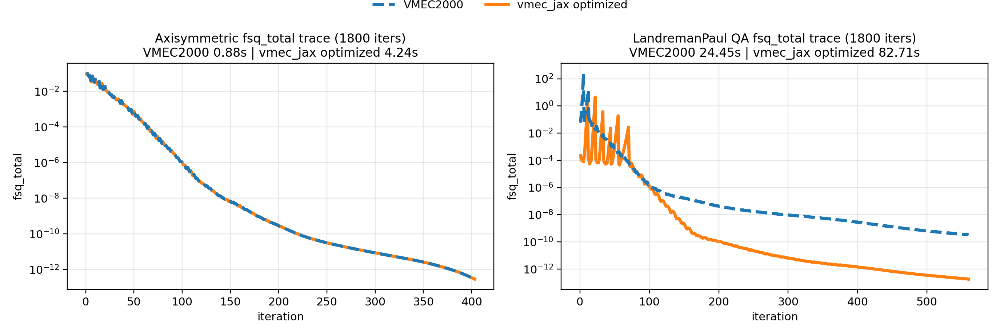

# vmec-jax

Laptop-friendly, end-to-end differentiable (JAX) rewrite of **VMEC2000**, focusing on **fixed-boundary** first.

<table>
  <tr>
    <td></td>
    <td></td>
  </tr>
  <tr>
    <td align="center">Axisymmetric: cross-section (VMEC2000 vs vmec_jax)</td>
    <td align="center">Stellarator (n3are): cross-section (VMEC2000 vs vmec_jax)</td>
  </tr>
  <tr>
    <td></td>
    <td></td>
  </tr>
  <tr>
    <td align="center">Axisymmetric: 3D LCFS (VMEC2000 vs vmec_jax)</td>
    <td align="center">Stellarator (n3are): 3D LCFS (VMEC2000 vs vmec_jax)</td>
  </tr>
  <tr>
    <td></td>
    <td></td>
  </tr>
  <tr>
    <td align="center">Axisymmetric: |B| on LCFS (VMEC2000 vs vmec_jax)</td>
    <td align="center">Stellarator (n3are): |B| on LCFS (VMEC2000 vs vmec_jax)</td>
  </tr>
  <tr>
    <td></td>
    <td></td>
  </tr>
  <tr>
    <td align="center">Axisymmetric: iota (VMEC2000 vs vmec_jax)</td>
    <td align="center">Stellarator (n3are): iota (VMEC2000 vs vmec_jax)</td>
  </tr>
  <tr>
    <td colspan="2"></td>
  </tr>
  <tr>
    <td align="center" colspan="2">fsq_total trace (VMEC2000 vs vmec_jax) for axisymmetric + n3are cases</td>
  </tr>
  <tr>
    <td colspan="2"></td>
  </tr>
  <tr>
    <td align="center" colspan="2">Runtime comparison (VMEC2000 vs vmec_jax, cold + warm JIT)</td>
  </tr>
</table>

## What it is

- Laptop-friendly, end-to-end differentiable (JAX) rewrite of VMEC2000 (fixed boundary first).
- Parity-first solver for axisymmetric and stellarator cases (QA, n3are at `rtol=1e-4`, `atol=1e-12`).
- JAX-native kernels for geometry, transforms, and residual assembly.
- Free-boundary and `lasym=True` parity are still in progress.

## Quickstart

Install (editable) and run the showcase:

```bash
python -m pip install -e .
python examples/showcase_axisym_input_to_wout.py --suite
```

CLI (VMEC2000-style executable):

```bash
vmec_jax examples/data/input.circular_tokamak
```

Default CLI runs use the fast scan loop (still honoring `NITER_ARRAY`/`FTOL_ARRAY`).
Pass `--parity` to force VMEC2000-style time-step control.

Run tests:

```bash
pytest -q
```

Optimization tutorials (differentiable boundary tuning):

```bash
python examples/optimization/optimize_bmag_volume.py --case circular_tokamak --opt-steps 3
python examples/optimization/target_iota_volume.py --case circular_tokamak --opt-steps 3
```

## Performance vs parity

- Default runs prioritize VMEC2000-style iteration parity (time-step control, restarts, dumps).
- For pure speed, use the scan path (`performance_mode=True` or solver `vmec2000_iter_fast`).
- Details and profiling guidance live in `docs/performance.rst`.
- Parity methodology and current status live in `docs/validation.rst`.

## When to use vmec_jax vs VMEC2000

- Use `vmec_jax` for autodiff, rapid parameter sweeps, and JAX-native pipelines.
- Use VMEC2000 for production runs or when you need full free-boundary / `lasym=True` parity today.

## Reproduce figures

Recreate the axisym + n3are VMEC2000 vs vmec_jax panels shown above (single-plane cross-sections, |B| on LCFS, iota overlays, plus the fsq_total trace):

```bash
python tools/diagnostics/qh_vmec_vs_vmecjax.py   --input examples/data/input.shaped_tokamak_pressure   --wout-ref examples/data/wout_shaped_tokamak_pressure_reference.nc   --use-wout-state --jax-title vmec_jax   --phi 0.0 --n-surfaces 31   --prefix axisym --outdir docs/_static/figures

python tools/diagnostics/qh_vmec_vs_vmecjax.py   --input examples/data/input.n3are_R7.75B5.7_lowres   --wout-ref examples/data/wout_n3are_R7.75B5.7_lowres.nc   --use-wout-state --jax-title vmec_jax   --phi 0.0 --n-surfaces 31   --prefix n3are --outdir docs/_static/figures

python tools/diagnostics/readme_fsq_trace.py   --axisym-input examples/data/input.shaped_tokamak_pressure   --stellarator-input examples/data/input.n3are_R7.75B5.7_lowres   --niter 250 --ftol 1e-14   --outdir docs/_static/figures

python tools/diagnostics/readme_runtime_compare.py   --axisym-input examples/data/input.shaped_tokamak_pressure   --stellarator-input examples/data/input.n3are_R7.75B5.7_lowres   --niter 250 --ftol 1e-14   --outdir docs/_static/figures
```

## Documentation

- `docs/quickstart.rst`: getting started
- `docs/validation.rst`: parity workflow and regression tests
- `docs/performance.rst`: profiling and performance knobs
- `docs/algorithms.rst`: algorithmic overview
- `docs/equations.rst`: equations and conventions
