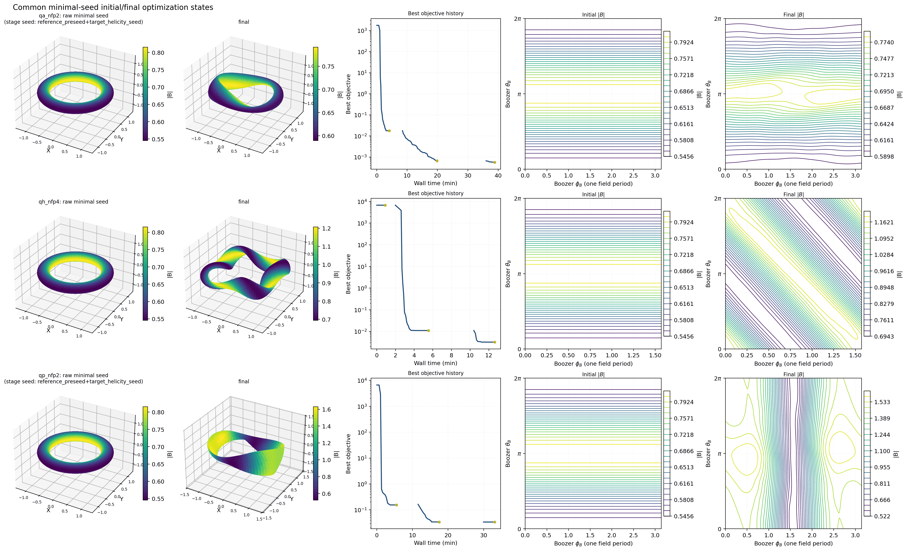
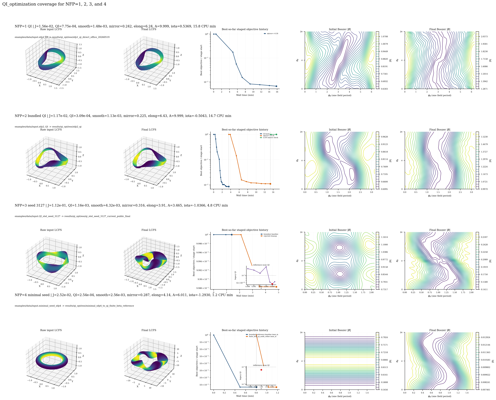

# vmec-jax

[](https://pypi.org/project/vmec-jax/)
[](https://github.com/conda-forge/vmec-jax-feedstock)
[](https://github.com/uwplasma/vmec_jax/blob/main/pyproject.toml)
[](https://github.com/uwplasma/vmec_jax/blob/main/LICENSE)
[](https://github.com/uwplasma/vmec_jax/actions/workflows/ci.yml)
[](https://codecov.io/gh/uwplasma/vmec_jax?branch=main)
[](https://vmec-jax.readthedocs.io/en/latest/)
[](https://pypi.org/project/vmec-jax/)

End-to-end differentiable JAX implementation of **VMEC2000** for fixed-boundary
and free-boundary ideal-MHD equilibria.

## Install

From PyPI:

```bash
pip install vmec-jax
```

PyPI and conda-forge can lag the repository tags. If you need an exact release,
check the package-index version before installing or pinning it.

The plain package includes plotting support (`matplotlib`) and the
differentiable Boozer transform dependency (`booz_xform_jax`) used by the QI
examples, so there is no separate plotting or QI extra to install.

From conda-forge:

```bash
pixi add vmec-jax
conda install --channel conda-forge vmec-jax
```

Developer install from source:

```bash
git clone https://github.com/uwplasma/vmec_jax
cd vmec_jax
pip install -e .
```

The repository intentionally keeps generated WOUT fixtures and large optional
validation assets out of git.  A source clone contains the VMEC input decks and
small magnetic grids needed for ordinary examples; run the inputs to generate
new `wout_*.nc` files.  If you need the full released WOUT/reference bundle for
CI-style validation or docs regeneration, download it with:

```bash
python tools/fetch_assets.py --list
python tools/fetch_assets.py
```

## Quick Start

For a first run after `pip install vmec-jax`, use the bundled test case:

```bash
vmec_jax --test
```

This copies the packaged `input.nfp4_QH_warm_start` into `vmec_jax_test/`,
runs the solver with `FTOL_ARRAY = 1e-12` for a faster first check, writes
`wout_nfp4_QH_warm_start.nc`, and automatically plots the WOUT file into
`vmec_jax_test/figures/`. The terminal output also prints the equivalent manual
commands so new users can repeat each step themselves.

To run the same workflow manually with an input downloaded from the repository:

```bash
curl -L -O https://raw.githubusercontent.com/uwplasma/vmec_jax/main/examples/data/input.nfp4_QH_warm_start
vmec_jax input.nfp4_QH_warm_start
```

Plot the `wout_*.nc` file produced by that run:

```bash
vmec_jax --plot wout_nfp4_QH_warm_start.nc
vmec_jax --plot wout_nfp4_QH_warm_start.nc --outdir figures/
```

Run Boozer coordinates with the bundled `booz_xform_jax` dependency. By default
`vmec_jax --booz` uses `mbooz = 32`, `nbooz = 32`, and all VMEC surfaces:

```bash
vmec_jax --booz input.nfp4_QH_warm_start
vmec_jax --booz --plot input.nfp4_QH_warm_start
vmec_jax --booz wout_nfp4_QH_warm_start.nc
vmec_jax --plot boozmn_nfp4_QH_warm_start.nc
```

`--booz --plot` writes the usual `wout_*.nc`, runs `booz_xform_jax`, writes
`boozmn_*.nc`, and creates Boozer-coordinate `|B|` contour and spectrum plots.
Input decks can also carry opt-in Boozer defaults without changing the VMEC solve:

```fortran
&BOOZ_XFORM_JAX
  LBOOZ = F
  MBOOZ = 32
  NBOOZ = 32
  BOOZ_SURFACES = 'all'
/
```

Use the Python API:

```python
import vmec_jax as vj

run = vj.run_fixed_boundary("input.nfp4_QH_warm_start")
wout_path = "wout_nfp4_QH_warm_start.nc"
vj.write_wout_from_fixed_boundary_run(wout_path, run, include_fsq=True)
vj.plot_wout(wout_path, outdir="figures/")
boozmn = vj.run_booz_xform(wout_path, mbooz=32, nbooz=32)
vj.plot_boozmn(boozmn, outdir="figures/")
```

For the bundled small free-boundary example, download both the input deck and
its magnetic grid into the same folder:

```bash
curl -L -O https://raw.githubusercontent.com/uwplasma/vmec_jax/main/examples/data/input.cth_like_free_bdy_lasym_small
curl -L -O https://raw.githubusercontent.com/uwplasma/vmec_jax/main/examples/data/mgrid_cth_like_lasym_small.nc
vmec_jax input.cth_like_free_bdy_lasym_small
```

## Backend Selection

`vmec_jax` follows the selected JAX backend. If CPU-only JAX is installed, runs
use CPU. If GPU-enabled JAX is installed and selected, runs use the accelerator;
`vmec_jax` does not silently force those runs back to CPU.

```bash
python -c "import jax; print(jax.default_backend()); print(jax.devices())"
JAX_PLATFORMS=cpu vmec_jax input.nfp4_QH_warm_start
JAX_PLATFORM_NAME=gpu vmec_jax input.nfp4_QH_warm_start
JAX_PLATFORMS=cuda vmec_jax input.nfp4_QH_warm_start
```

From Python, leave `solver_device` unset to inherit JAX's default backend, or
pass `solver_device="cpu"` / `solver_device="gpu"` explicitly.

## Optimization Examples

Editable optimization examples live in `examples/optimization/`. Start with
`examples/optimization/README.md` for workflow anatomy, then use
`docs/optimization.rst` for the full method guide,
`docs/optimization_sweep_results.rst` for generated sweep tables/figures, and
`docs/piecewise_omnigenous_plan.rst` for the pwO planning and acceptance gates.

The current README snapshot uses compact figures, not a numeric table. The
first panel shows QA NFP2/3, QH NFP3/4, and QP NFP2/3 common-minimal-seed
GPU runs with aspect target 5, continuation, ESS, and `max_mode=5`. The second
panel shows the current QI NFP1/2/3/4 reviewed snapshot: each row keeps the
user-facing input deck visible, while case-gated reference-family steps are
explicit deterministic basin proposals rather than claims that every NFP row is
already solved from the same common-minimal seed. Full numeric tables, caveats,
LASYM panels, and artifact-promotion rules live in the docs.




Reproduce the common-minimal QA/QH/QP rows with:

```bash
PYTHONPATH=. JAX_PLATFORMS=cuda python3 examples/optimization/generate_minimal_seed_showcase.py \
  --cases qa_nfp2,qa_nfp3,qh_nfp3,qh_nfp4,qp_nfp2,qp_nfp3 --backend-label gpu \
  --solver-device gpu --worker-jax-platforms cuda --policy continuation --max-mode 5 --ess on \
  --max-nfev 70 --continuation-nfev 20 --inner-max-iter 550 --inner-ftol 1e-10 \
  --trial-max-iter 550 --trial-ftol 1e-10 \
  --ess-alpha 1.2 --case-timeout-s 7200 --rerun
PYTHONPATH=. python examples/optimization/render_minimal_seed_showcase.py --publication-matrix
```
Run individual editable examples with `python examples/optimization/QA_optimization.py`,
`QH_optimization.py`, `QP_optimization.py`, or `QI_optimization.py`. Full
provenance and artifact rules are in `docs/optimization.rst` and
`docs/optimization_sweep_results.rst`. Historical panels remain documented as
`readme_best_optimization_qa.png`, `readme_best_optimization_qh.png`,
`readme_best_optimization_qp.png`, and `readme_best_optimization_qi.png`.

## Performance, Validation, Release

- Performance notes: `docs/performance.rst`; validation and VMEC2000 parity:
  `docs/validation.rst`; coverage strategy: `docs/testing_strategy.rst`.
- Release checklist and CI gates: `docs/release_checklist.rst`; latest local
  and hosted release evidence is summarized there.
- Latest repository release tag:
  [`v0.0.14`](https://github.com/uwplasma/vmec_jax/releases/tag/v0.0.14).
- Before tagging, re-check green CI with
  `gh run list --repo uwplasma/vmec_jax --branch main --workflow CI --limit 5`.

## CLI Reference

```text
vmec_jax input.*           run the equilibrium solver and write wout_*.nc
vmec_jax --plot wout.nc    generate VMEC diagnostic plots from a WOUT file
vmec_jax --booz wout.nc    run booz_xform_jax and write boozmn_*.nc
vmec_jax --plot boozmn.nc  generate Boozer contour and spectrum plots
vmec_jax --parity input.*  force the conservative VMEC2000-style loop
vmec_jax --help            show the full option list
```
