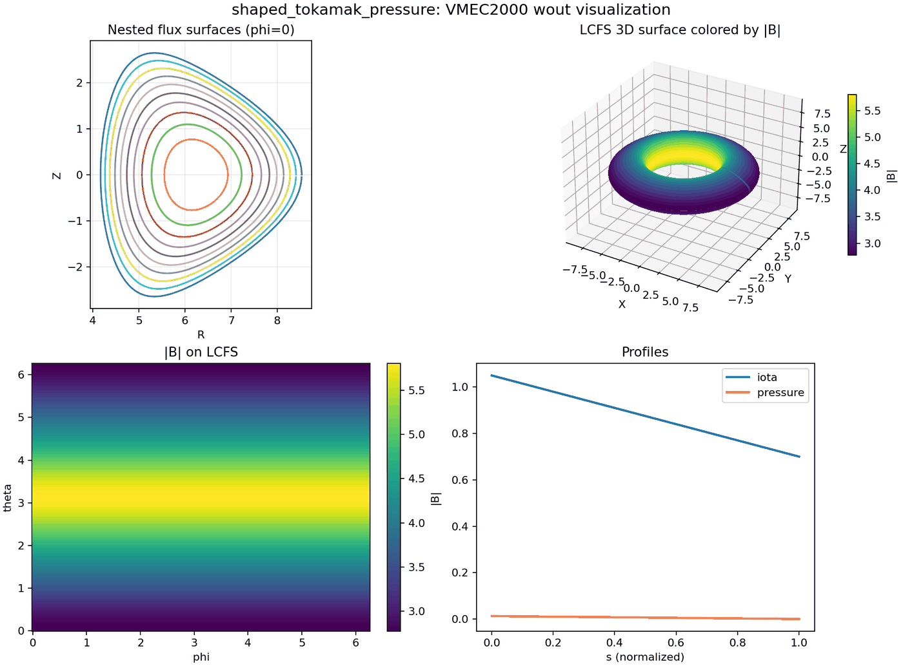
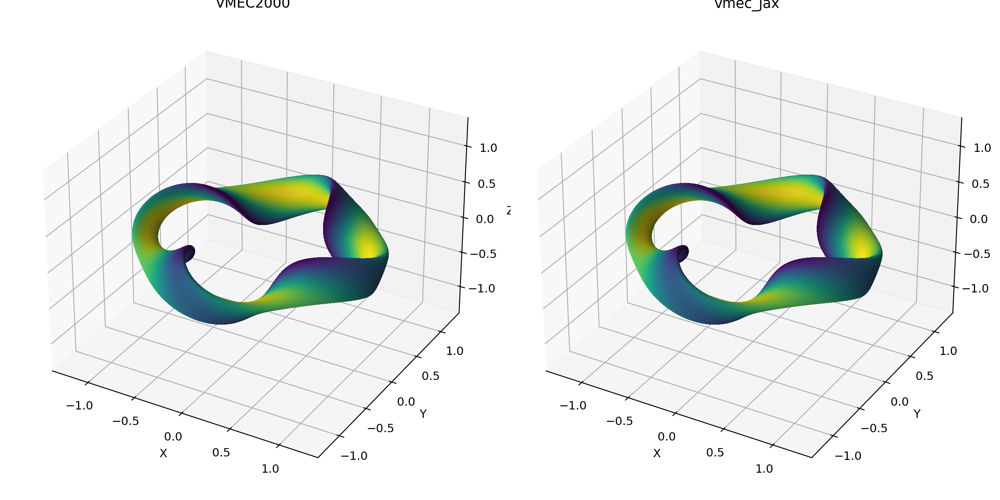
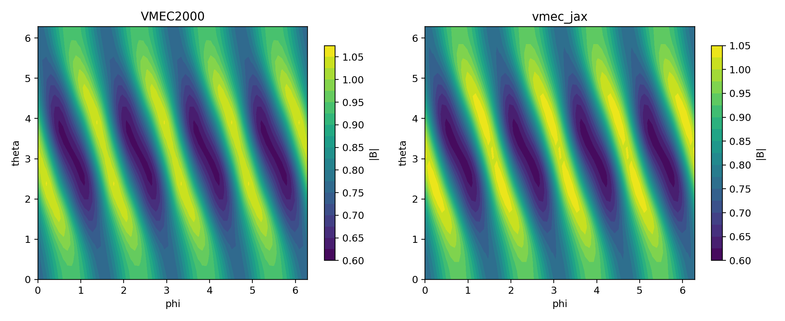
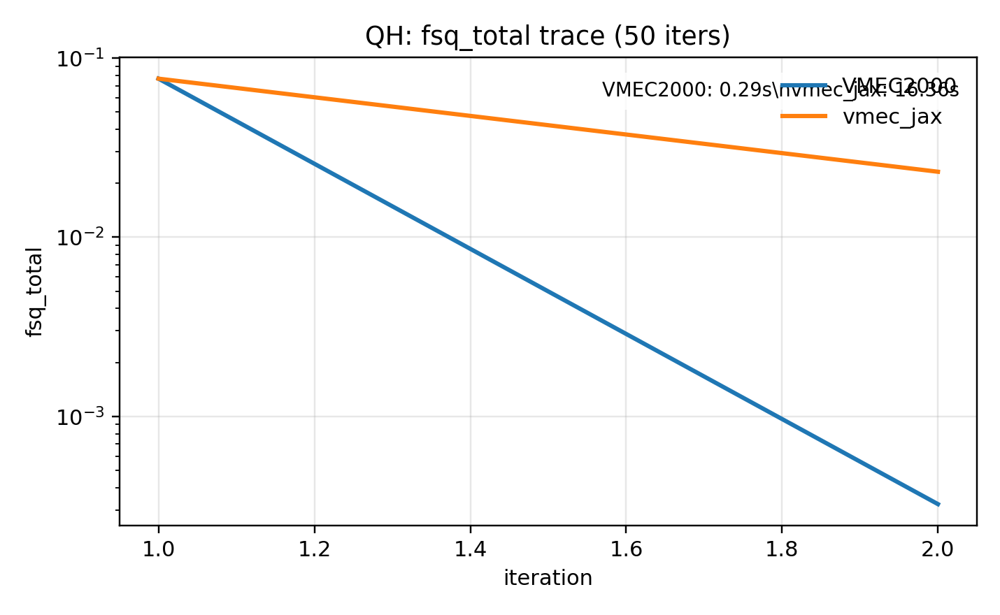

# vmec-jax

Laptop-friendly, end-to-end differentiable (JAX) rewrite of **VMEC2000**, focusing on **fixed-boundary** first.

<table>
  <tr>
    <td></td>
    <td></td>
  </tr>
  <tr>
    <td></td>
    <td></td>
  </tr>
  <tr>
    <td align="center">Tokamak (shaped_tokamak_pressure): vmec_jax overview + |B| on LCFS</td>
    <td align="center">Stellarator (nfp4_QH_warm_start): VMEC2000 vs vmec_jax</td>
  </tr>
  <tr>
    <td colspan="2"></td>
  </tr>
  <tr>
    <td align="center" colspan="2">QH (nfp4_QH_warm_start): per-iteration VMEC2000 vs vmec_jax trace</td>
  </tr>
</table>

## Scope (current)

- Fixed boundary only (free boundary deferred).
- Axisymmetric end-to-end parity is stable (`ntor=0`, `nfp=1`, `lasym=False`).
- Non-axisymmetric parity: QA/QH/n3are/QA-lowres multigrid traces are being revalidated at `rtol=1e-4`, `atol=1e-12` (QA_lowres stage-1 iter-2 passes). Remaining 3D/`lasym=True` cases are still in progress.

## Quickstart

Run the end-to-end showcase (recommended):

```bash
python examples/showcase_axisym_input_to_wout.py --suite
```

CLI (VMEC2000-style executable):

```bash
vmec_jax examples/data/input.circular_tokamak
```

This writes `wout_circular_tokamak.nc` next to the input file and prints the
VMEC2000-style screen table by default. Use `--quiet` to silence output, or
`--outdir` / `--output` to control where the `wout_*.nc` file is written. For
short debug runs, pass `--max-iter` and `--no-multigrid` (single grid).

By default the solver prints the VMEC2000-style per-iteration **screen** table
(FSQR/FSQZ/FSQL, RAX, DELT, WMHD). Pass ``--no-verbose`` to silence it.

Legacy `vmecPlot2.py` compatibility (NetCDF3 `wout` output):

```bash
python examples/showcase_axisym_input_to_wout.py --case circular_tokamak --max-iter 5 --no-vmec2000-trace
python vmecPlot2.py examples/outputs/showcase/circular_tokamak/wout_circular_tokamak_vmec_jax.nc /tmp/vmecplot2_jax
```

Run tests:

```bash
pytest -q
```

Profiling (fixed-boundary iterations):

```bash
python tools/diagnostics/profile_fixed_boundary.py --input examples/data/input.ITERModel --iters 3 --use-scan
python tools/diagnostics/profile_fixed_boundary.py --input examples/data/input.ITERModel --iters 3 --use-scan --simple-profile
```

The first command attempts a TensorBoard trace (requires a compatible TensorFlow install). Use `--simple-profile` to fall back to a timing-only run without TensorBoard.
`--use-scan` enables the fast ``lax.scan`` iteration path (no VMEC2000 control logic), which is ideal for performance profiling but not for per-iteration parity.
You can also select the scan path directly via solver `vmec2000_iter_fast` (alias `vmec2000_scan`).
Set `VMEC_JAX_USE_SCAN=1` to force scan mode for VMEC-style runs without changing code.
For a one-line opt-in to the fast path, pass `performance_mode=True` to `run_fixed_boundary(...)`.

VMEC2000 integration parity (requires the VMEC2000 executable):

```bash
VMEC2000_INTEGRATION=1 pytest -k vmec2000_exec_qa_regression
```

Note: `vmec_jax` enables JAX 64-bit in the fixed-boundary driver for parity. Set `JAX_ENABLE_X64=0` to prioritize speed.
For faster fixed-boundary solves in Python, the force/residual pipeline is JIT-compiled by default. Pass `jit_forces=False` to `run_fixed_boundary(...)` to disable it. Debug dump env vars automatically disable JIT.
For best performance, `VMECStatic` now precomputes VMEC real-space phase stacks. Set `VMEC_JAX_CACHE_VMEC_PHASE=0` to skip the extra cached tensors if you need to minimize memory.
To reduce repeat JIT compilation time across runs, set `VMEC_JAX_COMPILATION_CACHE_DIR=/path/to/cache` (or `JAX_COMPILATION_CACHE_DIR`) to enable the JAX compilation cache.
The fixed-boundary update also precomputes dense (m,n)->signed maps per solve to reduce scatter-heavy updates during iterations.
Scan mode batches the Z/L sin-block conversions into one matmul-based mapping to reduce kernel count.
Axis/edge enforcement now uses concatenation instead of scatter updates to keep the scan loop lighter.
Initial-guess axis blending updates all m=0 columns in one vectorized step to reduce startup overhead.
Mode scaling factors (1/(mscale*nscale)) are cached in `VMECStatic` to avoid repeated table gathers in the initial guess.
Lambda gauge enforcement uses a boolean mask instead of scatter updates in the iteration loop.
Axis m=0 masks are reused from `VMECStatic` to avoid per-iteration reconstruction.

## QH comparison figures

Reproduce the QH VMEC2000 vs vmec_jax comparison (50 iterations, single grid):

```bash
python tools/diagnostics/qh_vmec_vs_vmecjax.py \
  --no-solve --use-wout-state \
  --wout-ref /path/to/wout_nfp4_QH_warm_start.nc \
  --outdir docs/_static/figures

python tools/diagnostics/qh_compare_fsq_trace.py \
  --input examples/data/input.nfp4_QH_warm_start \
  --niter 50 \
  --outdir docs/_static/figures
```

## Parity status (VMEC2000)

Parity work is tracked in two layers:

- **Kernel parity on reference states (solver-free):** reconstruct intermediate quantities from a *reference* `wout` state and compare to the quantities stored in that same `wout`. This isolates conventions and avoids solver noise.
- **End-to-end solve parity:** run a nonlinear fixed-boundary solve from `input.*` and compare the final `wout` to the VMEC2000 reference. This depends on the update loop (preconditioning, time-step control, triggers), and is still in progress.

Reproduce the current kernel-parity snapshot table:

```bash
python examples/validation/pipeline_parity_summary.py
```

Current kernel-parity snapshot (solver-free, bundled reference states):

| Variable | circular_tokamak | purely_toroidal_field | shaped_tokamak_pressure | solovev |
|---| :--: | :--: | :--: | :--: |
| sqrtg | 3.10e-15 | 2.18e-14 | 1.24e-14 | 2.19e-15 |
| bsupu | 2.45e-15 | 2.57e-14 | 1.13e-14 | 2.17e-15 |
| bsupv | 3.08e-15 | 2.68e-14 | 1.32e-14 | 2.23e-15 |
| bsubu | 7.20e-07 | 1.27e-03 | 4.57e-05 | 2.41e-05 |
| bsubv | 1.24e-05 | 3.65e-06 | 2.59e-05 | 3.11e-05 |
| abs(B) | 3.09e-15 | 2.47e-14 | 1.25e-14 | 2.16e-15 |
| bsq = 0.5*B^2 + p | 6.20e-15 | 5.36e-14 | 2.64e-14 | 4.49e-15 |
| fsqr | 5.63e-09 | 1.42e-04 | 3.36e-08 | 3.64e-07 |
| fsqz | 1.15e-10 | 2.45e-04 | 2.67e-08 | 2.69e-07 |
| fsql | 2.17e-10 | 7.97e-09 | 6.21e-11 | 6.42e-07 |
| fsq_total | 5.73e-09 | 6.73e-05 | 6.90e-09 | 2.56e-07 |

Interpretation:
- Axisymmetric cases are at floating-point parity for geometry, ``bsup*``, and ``abs(B)``.
- Axisymmetric tomnsps/gc blocks (including lambda-force ``blmn/clmn``) match VMEC2000 to ~1e-11 abs on reduced grids; scalar residuals now match VMEC2000 at ~1e-7 or better on the standard suite, with the purely-toroidal-field case still the largest scalar residual gap (~1e-4).
- The VMEC-style update loop uses scalxc-weighted forces, and ``xc``/``v`` dumps match VMEC2000 at iter 1 in reduced-grid parity runs.
- The default benchmark path (10 iterations, ``ns=13``) now overlays VMEC2000 and vmec_jax traces for all 4 axisymmetric cases (`circular_tokamak`, `purely_toroidal_field`, `shaped_tokamak_pressure`, `solovev`).
- Non-axisymmetric parity hardening is wired into a batch comparator (`tools/diagnostics/nonaxis_parity_batch.py`) over Simsopt `input.*` files.
- Latest full-grid multigrid snapshot at `rtol=5e-4`, `atol=1e-10` (VMEC2000 exec comparator, `--use-input-niter`, `--max-iter 10`). Revalidation is underway at `rtol=1e-4`, `atol=1e-12`:
  - **Pass:** `input.qa_signgs1` (QA), `input.nfp4_QH_warm_start` (QH), `input.n3are_R7.75B5.7_lowres`, and `input.LandremanPaul2021_QA_lowres`.
  - **Pass (axisymmetric controls):** `input.solovev`, `input.shaped_tokamak_pressure`, `input.ITERModel`.
  - **Pending sweeps:** `li383_low_res` and `lasym=True` cases (e.g., `input.up_down_asymmetric_tokamak`).
- Remaining known gaps: `lasym=True`, free boundary, and additional 3D inputs not yet swept (li383, etc).

Full-grid parity snapshot (VMEC2000 exec comparator, `--use-input-niter`, `--max-iter 10`, `rtol=5e-4`, `atol=1e-10`; revalidation at `rtol=1e-4`, `atol=1e-12` in progress):

| Case | Input | Status | fsq_total (VMEC/JAX) | runtime_s (vmec2000/jax) | Notes |
|---|---|---|---|---|---|
| solovev | `examples/data/input.solovev` | PASS | `1.737e-02 / 1.737e-02` | `0.191 / 5.100` | Axisymmetric |
| shaped_tokamak_pressure | `examples/data/input.shaped_tokamak_pressure` | PASS | `5.541e-03 / 5.541e-03` | `0.180 / 18.218` | Axisymmetric |
| ITERModel | `examples/data/input.ITERModel` | PASS | `7.581e-03 / 7.581e-03` | `0.235 / 7.787` | Axisymmetric |
| QA signgs1 | `/Users/rogeriojorge/local/test/input.qa_signgs1` | PASS | `5.267e-01 / 5.267e-01` | `0.386 / 14.547` | NFP=2, NTOR=6 |
| nfp4_QH_warm_start | `examples/data/input.nfp4_QH_warm_start` | PASS | `4.540e-03 / 4.540e-03` | `0.246 / 14.269` | QH |
| n3are_R7.75B5.7_lowres | `examples/data/input.n3are_R7.75B5.7_lowres` | PASS | `2.330e+00 / 2.330e+00` | `0.177 / 27.706` | NFP=4 |
| LandremanPaul2021_QA_lowres | `examples/data/input.LandremanPaul2021_QA_lowres` | PASS | `3.423e+00 / 3.423e+00` | `0.574 / 11.448` | QA lowres |

Iteration trace parity (VMEC2000 executable, reduced grid):

- Single-grid axisym cases match ``fsq*`` and preconditioned scalars at machine precision for the first **10 iterations** at `--single-ns 13`.
- Full-grid multigrid axisymmetric traces are validated in the 10-iteration benchmark overlay with matching VMEC2000/vmec_jax lines for all 4 cases.
- `LandremanPaul2021_QA_lowres` matches through stage 3 iter 48 at the legacy tolerance (`rtol=5e-4`, `atol=1e-10`, `--max-iter 50`). Tighter tolerance revalidation is in progress.
- ``up_down_asymmetric_tokamak`` (``lasym=True``) shows large bcovar/force-kernel mismatches at iter 1; nonlinear trace diverges. This is the current top lasym parity blocker.

Notes on the snapshot figures:

- The residual trace overlay uses the **VMEC2000 executable** (`xvmec2000`) per-iteration `threed1.*` table (dashed line). If the executable is not available, the plot falls back to a flat reference line at final `fsq_total`.
- The `|B|` LCFS panel uses the *same* vmecPlot2-style evaluation path for VMEC2000 and vmec_jax. Differences here reflect end-to-end solve mismatch (not a plotting artifact). For a fast single-grid parity check, use `--single-ns 13`.

Reproduce scalar residual parity (`fsqr/fsqz/fsql`) on reference states:

```bash
python examples/validation/getfsq_parity_cases.py --solve-metric
```

Reproduce the short end-to-end solve snapshot:

```bash
python examples/validation/end_to_end_solve_parity_summary.py --use-input-niter --fast
```

This is a quick sanity run (reduced cases and resolution). For a full parity snapshot, drop `--fast` and increase `--max-iter`, but expect longer runtimes.

## Benchmark (runtime + residual traces)

This script compares a *fixed iteration budget* across `vmec_jax` and the **VMEC2000 executable** (`xvmec2000`). The current README figures were generated with the parity-first default reduced grid (`ns=13`) and a 10-iteration budget:

```bash
python examples/validation/benchmark_fixed_boundary_runtime_and_residuals.py \
  --iters 10 \
  --cases circular_tokamak shaped_tokamak_pressure solovev purely_toroidal_field \
  --run-vmec2000 --vmec2000-timeout 60
```

The quick settings above keep runs under ~60s per case. Increase `--iters` and/or pass larger `--ns-override`/`--vmec2000-ns-override` for longer and higher-resolution traces.

<table>
  <tr>
    <td></td>
    <td></td>
    <td></td>
  </tr>
</table>

## External VMEC2000 runs (optional)

If you have the VMEC2000 Python extension installed (`vmec` + `mpi4py` + `netCDF4`), you can run VMEC2000 on an input and compare against bundled references:

```bash
python tools/diagnostics/external_vmec_driver_compare.py --case circular_tokamak
```

For per-iteration trace parity against the VMEC2000 executable (single grid, quick run):

```bash
python tools/diagnostics/vmec2000_exec_stage_trace_compare.py --case circular_tokamak --max-iter 30 --vmec-nstep 1 --single-ns 13 --dump-level lite --vmec-timeout 60
python tools/diagnostics/vmec2000_exec_stage_trace_compare.py --case nfp4_QH_warm_start --max-iter 10 --single-ns 16 --vmec-timeout 60 --rtol 1e-4 --atol 1e-12
python tools/diagnostics/nonaxis_parity_batch.py --max-cases 8 --single-ns 13 --max-iter 1 --vmec-timeout 60
```

This uses a reduced grid to stay under ~1 minute; increase `--max-iter`/`--single-ns` for deeper parity checks.

To scan internal force-block parity (tomnsps + gc) and stop at the first mismatch:

```bash
python tools/diagnostics/vmec2000_exec_internal_scan.py --case circular_tokamak --single-ns 17 --iter-start 1 --iter-stop 5
```

## Installation

Create an environment with Python >= 3.10.

Regular users (non-editable install):

```bash
python -m pip install -U pip
python -m pip install .
```

Developers (editable install):

```bash
python -m pip install -e .
```

Recommended extras:

```bash
# JAX runtime (CPU)
python -m pip install ".[jax]"

# Read VMEC2000 `wout_*.nc` reference files
python -m pip install ".[netcdf]"

# Publication-ready figures in examples
python -m pip install ".[plots]"

# Build docs locally
python -m pip install ".[docs]"

# Dev tools
python -m pip install -e ".[dev]"
```

VMEC is typically run in float64. Enable x64 for JAX:

```bash
export JAX_ENABLE_X64=1
```

## Documentation

Sphinx docs live in `docs/`. Build locally:

```bash
LANG=C LC_ALL=C python -m sphinx -b html docs docs/_build/html
```
