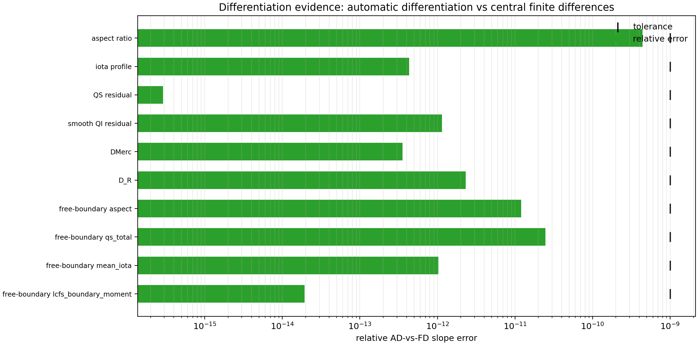

# vmec-jax

[](https://pypi.org/project/vmec-jax/)
[](https://github.com/conda-forge/vmec-jax-feedstock)
[](https://github.com/uwplasma/vmec_jax/blob/main/pyproject.toml)
[](https://github.com/uwplasma/vmec_jax/blob/main/LICENSE)
[](https://github.com/uwplasma/vmec_jax/actions/workflows/ci.yml)
[](https://codecov.io/gh/uwplasma/vmec_jax?branch=main)
[](https://vmec-jax.readthedocs.io/en/latest/)
[](https://pypi.org/project/vmec-jax/)

End-to-end differentiable JAX implementation of **VMEC2000** for fixed-boundary
workflows, with free-boundary support, VMEC2000-compatible `mgrid` workflows,
and direct-coil research paths. Full adaptive free-boundary solve adjoints
remain in development.

## Runtime Snapshot


This full bundled single-grid fixed-boundary matrix compares VMEC2000,
`vmec_jax` cold/warm CPU runs, and VMEC++ where VMEC++ converges cleanly.
The plotted inputs live in `examples/data` and are normalized to
`NS_ARRAY=151`, `FTOL_ARRAY=1e-14`, and `NITER_ARRAY=5000`. The performance
docs keep the detailed CSV/JSON provenance, WOUT-parity rows, and regression
classifications; rows are ordered by descending cold `vmec_jax` speedup over
VMEC2000. In the 2026-07-06 local CPU refresh, warm `vmec_jax` was
faster than VMEC2000 on 33 of 37 rows using the default CLI policy; cold tiny
rows still pay Python/JAX/XLA setup cost, and VMEC++ is shown only on the 17
rows where it exits cleanly.

## Differentiation Evidence



The current differentiable diagnostics agree with central finite differences
for fixed-boundary geometry/profile scalars, QS/QI residuals, `DMerc`, `D_R`,
and branch-local direct-coil free-boundary scalars. The free-boundary rows are
same-branch/fingerprint-gated evidence only; arbitrary adaptive branch changes
are still an explicit research lane. Detailed commands and tolerances are in
the validation guide.

## Install

```bash
pip install vmec-jax
```

The plain package includes plotting support and `booz_xform_jax`; no separate
extra is needed. If bare `pip` does not install into the Python you intend to
use, check that `pip --version` and `python -m pip --version` agree; use the
matching `python -m pip` form only if bare `pip` points at the wrong
interpreter.

```bash
pixi add vmec-jax
conda install --channel conda-forge vmec-jax
```

Developer install from source:

```bash
git clone https://github.com/uwplasma/vmec_jax
cd vmec_jax
pip install -e .
```

Large optional validation assets stay out of git; inspect released bundles with
`python tools/fetch_assets.py --list`.

## Quick Start

For a first run after `pip install vmec-jax`, use the bundled test case:

```bash
vmec --doctor
vmec --test
```

`vmec --doctor` prints Python, pip, package, and JAX backend diagnostics.
`vmec --test` copies `input.nfp4_QH_warm_start`, runs with `FTOL_ARRAY = 1e-12`,
writes WOUT and plots under `vmec_jax_test/`, and prints equivalent manual
commands. The canonical executable is `vmec`; old aliases remain supported.

To run the same workflow manually with an input downloaded from the repository:

```bash
curl -L -O https://raw.githubusercontent.com/uwplasma/vmec_jax/main/examples/data/input.nfp4_QH_warm_start
vmec input.nfp4_QH_warm_start
```

```bash
vmec --plot wout_nfp4_QH_warm_start.nc
vmec --plot wout_nfp4_QH_warm_start.nc --outdir figures/
```

Run Boozer coordinates with bundled `booz_xform_jax`; by default `--booz` uses
`mbooz = 32`, `nbooz = 32`, and all VMEC surfaces:

```bash
vmec --booz input.nfp4_QH_warm_start
vmec --booz --plot input.nfp4_QH_warm_start
vmec --booz wout_nfp4_QH_warm_start.nc
vmec --plot boozmn_nfp4_QH_warm_start.nc
```

Use the Python API:

```python
import vmec_jax as vj

run = vj.run_fixed_boundary("input.nfp4_QH_warm_start")
wout_path = "wout_nfp4_QH_warm_start.nc"
vj.write_wout_from_fixed_boundary_run(wout_path, run, include_fsq=True)
vj.plot_wout(wout_path, outdir="figures/")
boozmn = vj.run_booz_xform(wout_path, mbooz=32, nbooz=32)
vj.plot_boozmn(boozmn, outdir="figures/")
```

Profile-polynomial, spline, finite-beta, and free-boundary examples are in
`examples/` and documented in the performance, validation, and free-boundary
guides.

### Direct-Coil Free-Boundary Research Lane

The direct-coil free-boundary lane samples differentiable Biot-Savart coils
directly while keeping the existing `mgrid` path for VMEC2000 compatibility.
Current coil-only examples validate complete-solve acceptance plus
same-branch, fingerprint-gated branch-local derivatives; arbitrary adaptive
host-controller branch differentiation remains a research lane.

ESSOS direct-coil, generated-mgrid, finite-beta scan, and coil-only QS
optimization commands are documented in `docs/free_boundary_coil_optimization.rst`.

## Backend Selection

`vmec_jax` follows the selected JAX backend. If CPU-only JAX is installed, runs
use CPU. If GPU-enabled JAX is installed and selected, runs use the accelerator;
`vmec_jax` does not silently force those runs back to CPU.
Install or upgrade GPU-enabled JAX using the official JAX installation matrix:
https://docs.jax.dev/en/latest/installation.html

```bash
python -c "import jax; print(jax.default_backend()); print(jax.devices())"
JAX_PLATFORMS=cpu vmec input.nfp4_QH_warm_start
JAX_PLATFORM_NAME=gpu vmec input.nfp4_QH_warm_start
JAX_PLATFORMS=cuda vmec input.nfp4_QH_warm_start
```

From Python, leave `solver_device` unset to inherit JAX's default backend, or
pass `solver_device="cpu"` / `solver_device="gpu"` explicitly.

## Optimization Examples

Optimization examples live in `examples/optimization/`: run
`python examples/optimization/QA_optimization.py` (or the `QH`, `QP`, `QI`
variants) to optimize from a circular-torus-like seed toward the target
symmetry class. `docs/optimization.rst` documents the objectives, staged
mode-continuation options, and caveats (for QI, the per-NFP scripts first
build a QP basin and then switch the objective to QI).

## Performance, Validation, Release

- Performance notes: `docs/performance.rst`; validation, coverage, and release
  gates: `docs/validation.rst`, `docs/testing_strategy.rst`, and
  `docs/release_checklist.rst`.
- Latest repository release tag: [`v0.0.18`](https://github.com/uwplasma/vmec_jax/releases/tag/v0.0.18).

## CLI Reference

```text
vmec input.*           run the equilibrium solver and write wout_*.nc
vmec --plot wout.nc    generate VMEC diagnostic plots from a WOUT file
vmec --booz wout.nc    run booz_xform_jax and write boozmn_*.nc
vmec --plot boozmn.nc  generate Boozer contour and spectrum plots
vmec --parity input.*  force the conservative VMEC2000-style loop
vmec --solver-mode memory input.*  choose the lower-peak-memory parity path
vmec --help            show the full option list
```
