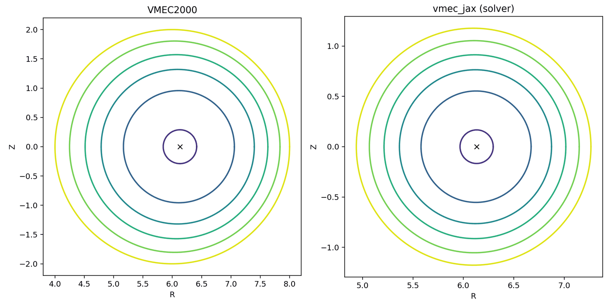
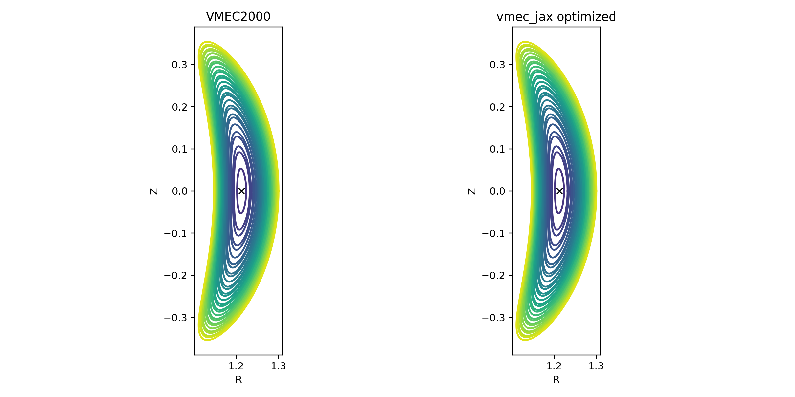
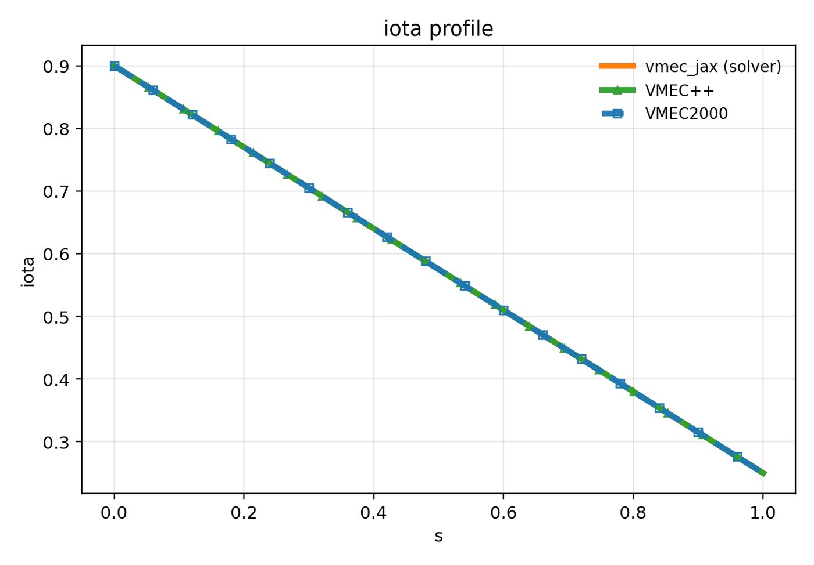
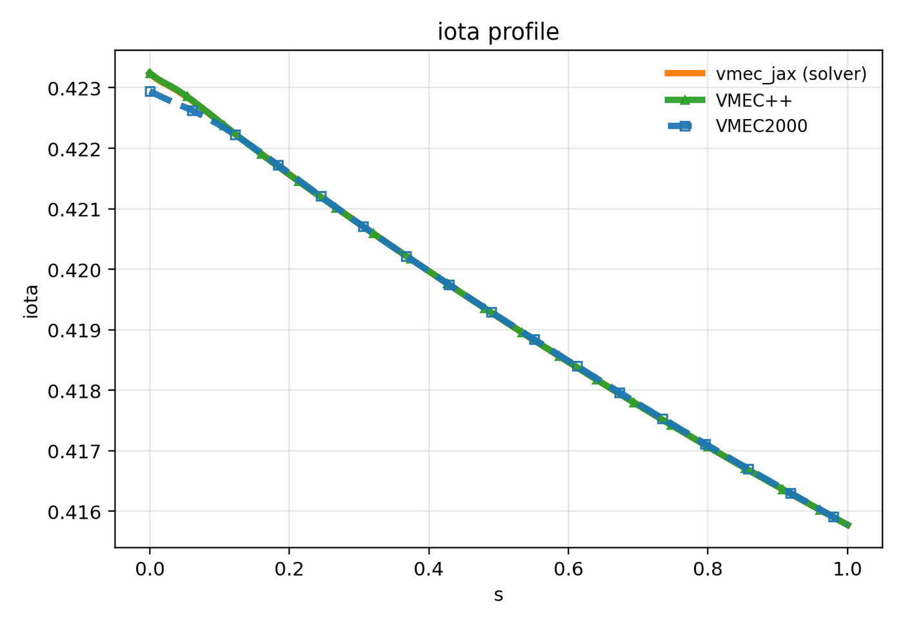
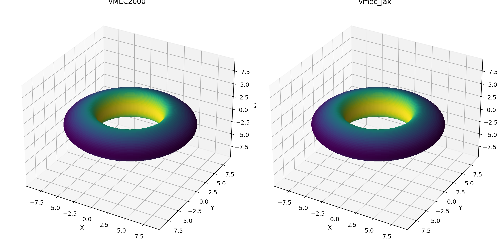
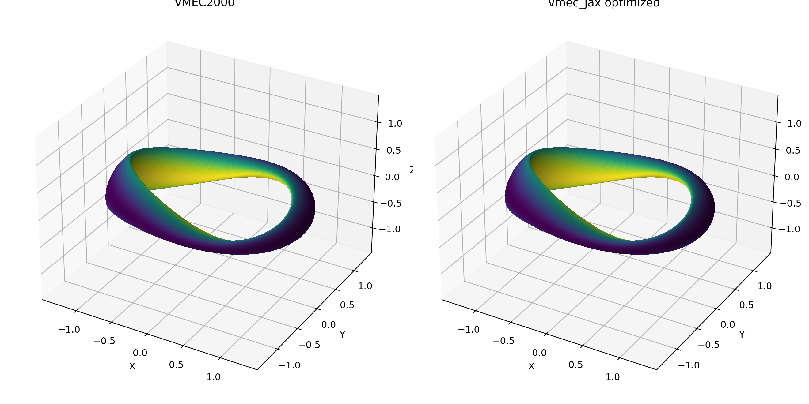
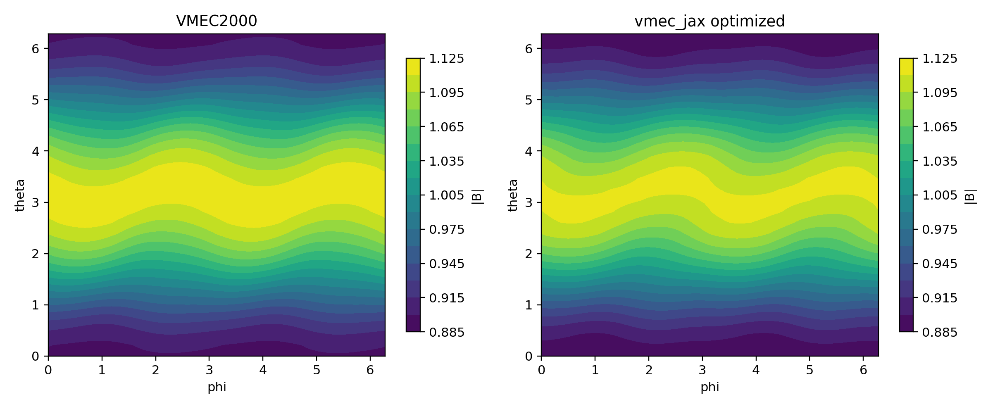
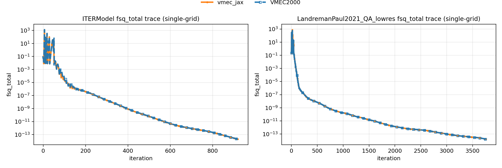

# vmec-jax

[](https://pypi.org/project/vmec-jax/)
[](https://github.com/uwplasma/vmec_jax/blob/main/pyproject.toml)
[](https://github.com/uwplasma/vmec_jax/blob/main/LICENSE)
[](https://github.com/uwplasma/vmec_jax/actions/workflows/ci.yml)
[](https://codecov.io/gh/uwplasma/vmec_jax?branch=main)
[](https://vmec-jax.readthedocs.io/en/latest/)
[](https://pypi.org/project/vmec-jax/)

End-to-end differentiable JAX implementation of **VMEC2000** for fixed-boundary
and free-boundary ideal-MHD equilibria.

## Install

```bash
pip install vmec-jax
```

QI optimization uses `booz_xform_jax` for the differentiable Boozer transform:

```bash
pip install "vmec-jax[qi]"
```

Developer (editable) install:

```bash
git clone https://github.com/uwplasma/vmec_jax
pip install -e "vmec_jax[qi]"
```

## Usage

Run the solver (VMEC2000-style CLI):

```bash
vmec_jax input.nfp4_QH_warm_start        # → wout_nfp4_QH_warm_start.nc
```

Generate diagnostic plots from any `wout_*.nc` (four-panel output, replicates `vmecPlot2.py`):

```bash
vmec_jax --plot wout_nfp4_QH_warm_start.nc           # saves in same directory
vmec_jax --plot wout_nfp4_QH_warm_start.nc --outdir figures/
```

From Python:

```python
import vmec_jax as vj

# Run a fixed-boundary solve
run = vj.run_fixed_boundary("input.nfp4_QH_warm_start")

# Run a free-boundary solve
freeb = vj.run_free_boundary("input.cth_like_free_bdy_lasym_small")

# Plot any wout file (produces *_VMECparams.pdf, *_poloidal_plot.png, *_VMECsurfaces.pdf, *_VMEC_3Dplot.png)
vj.plot_wout("wout_nfp4_QH_warm_start.nc", outdir="figures/")
```

## Choosing CPU or GPU

`vmec_jax` follows the JAX backend you select. If you installed CPU-only JAX,
runs use CPU. If you installed GPU-enabled JAX and select a GPU backend, runs
use GPU; vmec_jax does not silently force those runs back to CPU.

```bash
# Check what JAX will use.
python -c "import jax; print(jax.default_backend()); print(jax.devices())"

# Force CPU for one command.
JAX_PLATFORMS=cpu vmec_jax input.nfp4_QH_warm_start

# Force an accelerator backend after installing GPU-enabled JAX.
JAX_PLATFORM_NAME=gpu vmec_jax input.nfp4_QH_warm_start

# For NVIDIA CUDA specifically, this is also valid.
JAX_PLATFORMS=cuda vmec_jax input.nfp4_QH_warm_start
```

From Python, leave `solver_device` unset to inherit JAX's default backend, or
pass `solver_device="cpu"` / `solver_device="gpu"` explicitly:

```python
import vmec_jax as vj

run_gpu = vj.run_fixed_boundary("input.nfp4_QH_warm_start", solver_device="gpu")
run_cpu = vj.run_fixed_boundary("input.nfp4_QH_warm_start", solver_device="cpu")
```

For GPU runs, vmec_jax defaults `XLA_PYTHON_CLIENT_PREALLOCATE=false` before
JAX import so the allocator grows on demand. This avoids GPU memory contention
between optimization workers and was faster in the exact-Jacobian GPU profile.
Set `XLA_PYTHON_CLIENT_PREALLOCATE=true` before import if you explicitly want
JAX's default preallocation behavior.

`vmec_jax` enables JAX's persistent compilation cache by default, but its
default cache path is machine/CPU-feature scoped to avoid reusing CPU AOT
executables compiled on a different host. Set `VMEC_JAX_COMPILATION_CACHE=0` to
disable the persistent cache or `VMEC_JAX_COMPILATION_CACHE_DIR=/path/to/cache`
to choose a custom location.

## Showcase (single-grid)

All figures below use the same **single-grid** run settings: `NS_ARRAY=151`, `NITER_ARRAY=5000`, `FTOL_ARRAY=1e-14`, `NSTEP=500`.

<table>
  <tr>
    <td></td>
    <td></td>
  </tr>
  <tr>
    <td align="center"><code>ITERModel</code> cross-section (VMEC2000 vs vmec_jax)</td>
    <td align="center"><code>LandremanPaul2021_QA_lowres</code> cross-section (VMEC2000 vs vmec_jax)</td>
  </tr>
  <tr>
    <td></td>
    <td></td>
  </tr>
  <tr>
    <td align="center"><code>ITERModel</code> iota (VMEC2000 vs vmec_jax)</td>
    <td align="center"><code>LandremanPaul2021_QA_lowres</code> iota (VMEC2000 vs vmec_jax)</td>
  </tr>
  <tr>
    <td></td>
    <td></td>
  </tr>
  <tr>
    <td align="center"><code>ITERModel</code> 3D LCFS</td>
    <td align="center"><code>LandremanPaul2021_QA_lowres</code> 3D LCFS</td>
  </tr>
  <tr>
    <td></td>
    <td></td>
  </tr>
  <tr>
    <td align="center"><code>ITERModel</code> |B| on LCFS</td>
    <td align="center"><code>LandremanPaul2021_QA_lowres</code> |B| on LCFS</td>
  </tr>
</table>

<p align="center">
  
</p>

<p align="center">
  
</p>

**Cold vs warm runtime**: the *cold* bar includes XLA JIT compilation on the first call (one-time cost per process); the *warm* bar is the steady-state solve time for subsequent calls in the same process. VMEC2000 has no compilation overhead, so it is always effectively cold. `vmec_jax` enables JAX's persistent compilation cache by default under `~/.cache/vmec_jax/jax_cache/<machine-fingerprint>` so repeated cold-process runs on the same host can reuse compiled kernels without sharing CPU AOT executables across incompatible machines; set `VMEC_JAX_COMPILATION_CACHE=0` to disable it or `VMEC_JAX_COMPILATION_CACHE_DIR=/path/to/cache` to choose a different location.

## Best Stellarator-Symmetric Optimizations

The fixed-boundary optimization examples solve VMEC equilibria and differentiate
the objective with the exact discrete-adjoint/tape path. The README only shows
one current best `LASYM = F` result for each target; the full CPU/GPU policy
matrix, LASYM panels, finite-beta examples, QI constraint sweep, and all tables
live in the
[optimization guide](docs/optimization.rst) and
[optimization sweep results](docs/optimization_sweep_results.rst).

Each row below shows the original deck LCFS before any `max_mode=1`
optimization work, the final LCFS, per-stage objective history, and the final
outer-surface `|B|` in Boozer coordinates computed with `booz_xform_jax`.
This sweep uses NFP=2 seeds for QA/QP/QI and the standard bundled NFP=4 warm
start for QH.  The current objective priority is primary symmetry/QI quality
and rotational-transform control.  QA follows the reference omnigenity QA deck
with aspect ratio near 2.5 and signed mean iota target 0.42; QH/QP/QI use
aspect ratio near 7 and `abs(mean_iota) >= 0.41`.  `LgradB` remains available
as an optional script-level term, but it is not active in the default README
examples or best-row selection.

The QP and QI rows both start from the bundled NFP=2 QI seed.  QP is a
quasi-poloidal-symmetry target using that same input deck; QI can optionally
start from a same-mode QP preseed before the constrained QI refinement.
The bundled NFP=2 seed is projected to each active `max_mode`, so
`max_mode=1` zeroes the seed's mode-2 boundary harmonics before optimizing.

| Target | Backend | Policy | max_mode | ESS | QP preseed | Final J | QI raw | Mirror | Elong. | Aspect | Iota | Wall time |
|---|---|---|---:|---|---|---:|---:|---:|---:|---:|---:|---:|
| QA | CPU | continuation | 3 | no |  | 1.03e-03 |  |  |  | 2.501 | 0.4200 | 4.3 min |
| QH | CPU | continuation | 3 | yes |  | 1.30e-03 |  |  |  | 7.000 | -1.1813 | 3.1 min |
| QP | CPU | continuation | 3 | no |  | 3.00e-02 |  |  |  | 7.006 | -0.7401 | 2.8 min |
| QI | CPU | continuation | 3 | no | no | 1.09e-04 | 1.09e-04 | 0.210 | 3.49 | 7.000 | -0.5005 | 2.6 min |

<p align="center">
  
</p>

<p align="center">
  
</p>

<p align="center">
  
</p>

<p align="center">
  
</p>

Recreate the four displayed runs:

```bash
PYTHONPATH=. JAX_PLATFORMS=cpu python examples/optimization/generate_qs_ess_sweep.py --backend-label cpu --solver-device cpu --policy continuation --problems qa --modes 3 --ess off
PYTHONPATH=. JAX_PLATFORMS=cpu python examples/optimization/generate_qs_ess_sweep.py --backend-label cpu --solver-device cpu --policy continuation --problems qh --modes 3 --ess on
PYTHONPATH=. JAX_PLATFORMS=cpu python examples/optimization/generate_qs_ess_sweep.py --backend-label cpu --solver-device cpu --policy continuation --problems qp --modes 3 --ess off
PYTHONPATH=. JAX_PLATFORMS=cpu python examples/optimization/generate_qs_ess_sweep.py --backend-label cpu --solver-device cpu --policy continuation --problems qi --modes 3 --ess off --qi-qp-preseed off
```

Regenerate the README panels and the compact CSV used for the table:

```bash
PYTHONPATH=. python examples/optimization/render_readme_best_optimizations.py
```

## Performance vs parity

- Default runs select the fastest stable path for each input automatically.
- Use `--parity` (or `performance_mode=False` in Python) to force the conservative VMEC2000 loop.
- Use `--solver-mode accelerated` to force the optimized fixed-boundary controller.
- For GPU benchmarking, compare both first-process and cache-warm timings; the first GPU process pays XLA compilation, while later processes reuse the persistent cache automatically.

Details, profiling guidance, and parity methodology:

- `docs/performance.rst`
- `docs/validation.rst`
- `tools/diagnostics/parity_manifest.toml` + `tools/diagnostics/parity_sweep_manifest.py`

## CLI reference

```
vmec_jax input.*                run the equilibrium solver → wout_*.nc
vmec_jax --plot wout.nc         generate diagnostic plots (4 output files)
vmec_jax --parity input.*       force conservative VMEC2000 loop
vmec_jax --help                 full option list
```

## VMEC++ notes

The current runtime benchmark compares vmec_jax against VMEC2000. VMEC++ is not included in this benchmark.

When VMEC++ is available, it can be added to the runtime plot via `--cpu-summary` entries with `backend=vmecpp`. Some inputs are not supported or do not converge under the same single-grid settings:

VMEC++ unsupported inputs (`lasym=True`):

- `LandremanSenguptaPlunk_section5p3_low_res`
- `basic_non_stellsym_pressure`
- `cth_like_free_bdy_lasym_small`
- `up_down_asymmetric_tokamak`

VMEC++ known non-convergence on these `lasym=False` cases under the same single-grid settings:

- `DIII-D_lasym_false`
- `LandremanPaul2021_QA_reactorScale_lowres`
- `LandremanPaul2021_QH_reactorScale_lowres`
- `LandremanSengupta2019_section5.4_B2_A80`
- `cth_like_fixed_bdy`

## CLI output and `NSTEP`

The VMEC-style iteration loop prints every `NSTEP` iterations. Larger `NSTEP` means fewer print callbacks and faster runs.

To disable live printing:

```bash
export VMEC_JAX_SCAN_PRINT=0
```

Quiet runs (`--quiet` or `verbose=False`) default the scan path to minimal history
mode to reduce host/device traffic. Override with:

```bash
export VMEC_JAX_SCAN_MINIMAL=0  # keep full scan diagnostics even when quiet
```
