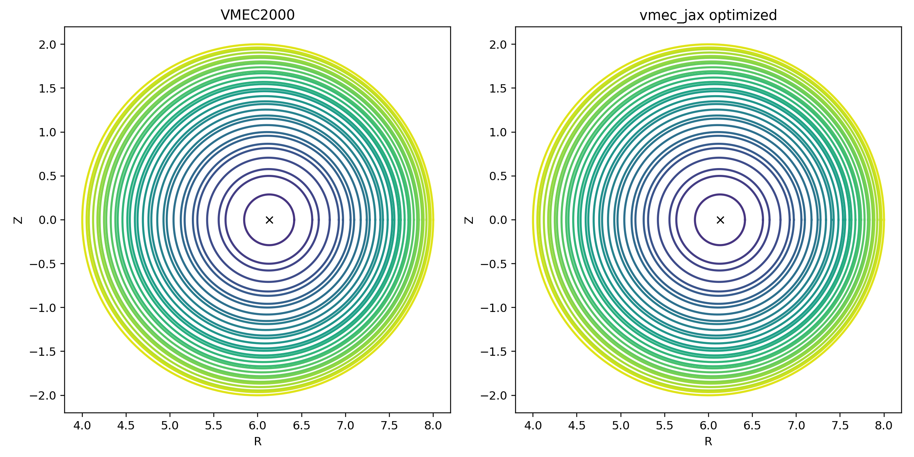
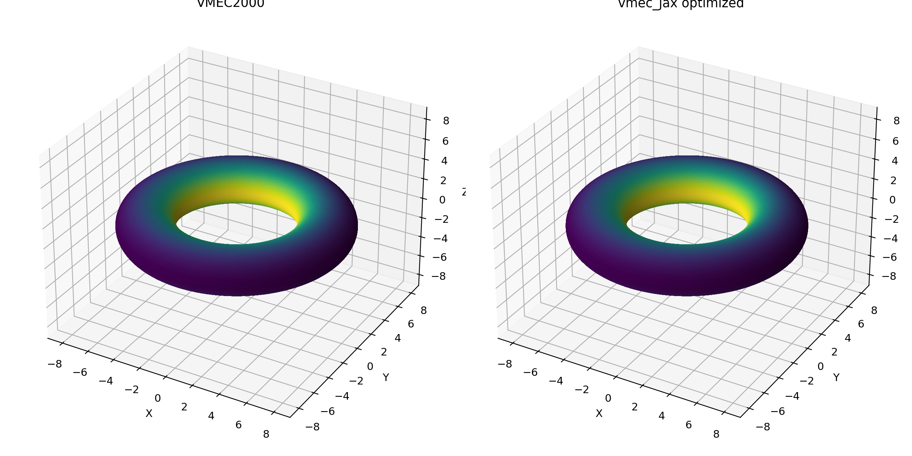
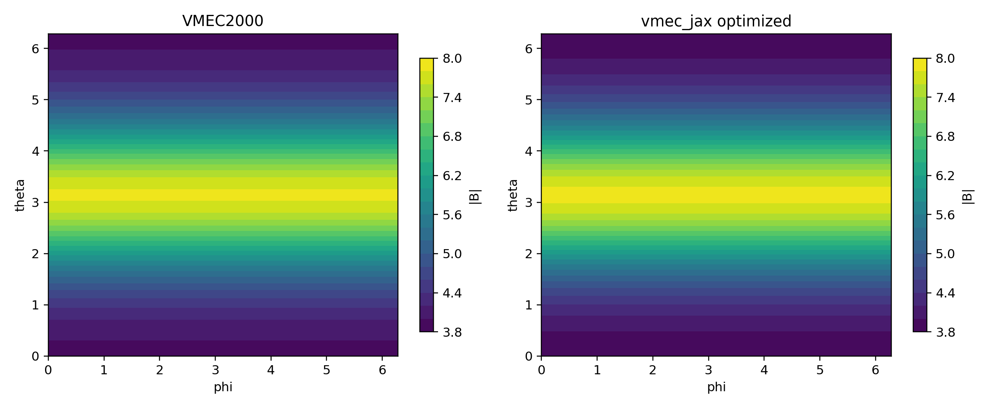
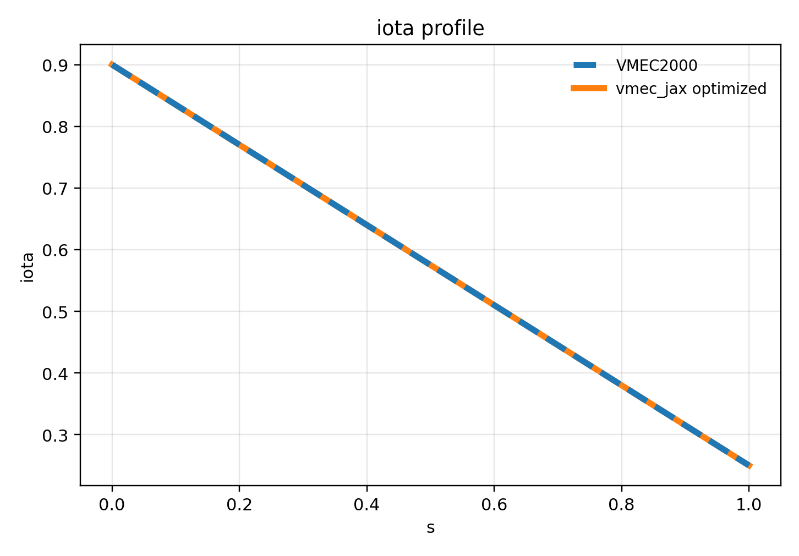

# vmec-jax

End-to-end differentiable JAX implementation of **VMEC2000** for fixed-boundary
and free-boundary ideal-MHD equilibria.

<table>
  <tr>
    <td></td>
    <td></td>
  </tr>
  <tr>
    <td align="center">Axisymmetric: optimized fixed-boundary cross-section (VMEC2000 vs vmec_jax)</td>
    <td align="center">ITERModel: optimized fixed-boundary cross-section (VMEC2000 vs vmec_jax)</td>
  </tr>
  <tr>
    <td></td>
    <td></td>
  </tr>
  <tr>
    <td align="center">Axisymmetric: optimized fixed-boundary 3D LCFS (VMEC2000 vs vmec_jax)</td>
    <td align="center">ITERModel: optimized fixed-boundary 3D LCFS (VMEC2000 vs vmec_jax)</td>
  </tr>
  <tr>
    <td></td>
    <td></td>
  </tr>
  <tr>
    <td align="center">Axisymmetric: optimized fixed-boundary |B| on LCFS (VMEC2000 vs vmec_jax)</td>
    <td align="center">ITERModel: optimized fixed-boundary |B| on LCFS (VMEC2000 vs vmec_jax)</td>
  </tr>
  <tr>
    <td></td>
    <td></td>
  </tr>
  <tr>
    <td align="center">Axisymmetric: optimized fixed-boundary iota (VMEC2000 vs vmec_jax)</td>
    <td align="center">ITERModel: optimized fixed-boundary iota (VMEC2000 vs vmec_jax)</td>
  </tr>
  <tr>
    <td colspan="2"></td>
  </tr>
  <tr>
    <td align="center" colspan="2">Optimized fixed-boundary fsq_total trace (VMEC2000 vs vmec_jax) for shaped tokamak + ITERModel cases</td>
  </tr>
  <tr>
    <td colspan="2"></td>
  </tr>
  <tr>
    <td align="center" colspan="2">Bundled fixed-boundary runtime comparison: VMEC2000 vs vmec_jax CPU on a reference CPU host</td>
  </tr>
</table>

## What it is

- VMEC2000-parity solver for fixed-boundary and free-boundary equilibria.
- Supports axisymmetric and non-axisymmetric configurations, with `lasym=False` and `lasym=True` for stellarator symmetry/asymmetry and up-down symmetry/asymmetry.
- Default CLI path is the same across all supported branches: `vmec_jax input.name`.
- `wout_*.nc` outputs, iteration diagnostics, and manifest-based parity sweeps are built around VMEC2000-compatible workflows.
- JAX-native kernels for geometry, transforms, and residual assembly.
- Differentiable optimization workflows are available through the Python API and bundled examples.

## Quickstart

Install (editable) and run the showcase:

```bash
python -m pip install -e .
python examples/showcase_axisym_input_to_wout.py --suite
```

CLI (VMEC2000-style executable):

```bash
vmec_jax examples/data/input.circular_tokamak
```

For fixed-boundary inputs, the default CLI path now uses the optimized
controller: it tries the fast final-grid scan route first, then escalates to
staged continuation and strict parity finishing only when the input structure
and residual history require it. Pass `--parity` to force the conservative
VMEC2000 loop. Pass `--solver-mode accelerated` to request the optimized track
explicitly.

Python driver comparison (reference track vs optimized CLI-style track):

```bash
python examples/fixed_boundary_driver_tracks.py \
  examples/data/input.circular_tokamak \
  --quiet --json
```

Run tests:

```bash
pytest -q
```

Optimization tutorials (differentiable boundary tuning):

```bash
python examples/optimization/optimize_bmag_volume.py --case circular_tokamak --opt-steps 3
python examples/optimization/explicit_target_iota_volume.py --case circular_tokamak --opt-steps 3
python examples/optimization/implicit_target_iota_volume.py --case circular_tokamak --opt-steps 3
```

## Performance vs parity

- Default runs enable the scan-based fast loop (`performance_mode=True`) with a parity guard.
- LASYM fixed-boundary stages now use a timed scan/non-scan probe on CPU and a short parity-only probe on accelerators, so the default GPU path keeps the scan fast path without paying the full non-scan timing cost.
- Quiet accelerator scan runs now use backend-aware larger chunks, capped to the remaining iterations, to reduce host/device launch overhead without changing solver parity.
- Use `--parity` or `performance_mode=False` to force the conservative parity path.
- Use `--solver-mode accelerated` to force the experimental accelerated
  fixed-boundary path, which skips parity-oriented scan probes and is judged by
  final residual/output quality rather than iteration-trace parity.
- In the current branch, accelerated fixed-boundary solves default to a single
  final-grid stage unless the caller explicitly requests `multigrid=True`. When
  staged inputs provide `NITER_ARRAY`, the accelerated single-grid path now
  carries the total staged iteration budget forward instead of silently falling
  back to `NITER`, and the CLI can automatically retry that staged schedule if
  the first final-grid solve misses the target.
- The optimized CLI controller is therefore layered:
  fast final-grid accelerated attempt first, then input-driven staged follow-up
  for explicit `NS_ARRAY` / `NITER_ARRAY`, then strict parity finish blocks
  only if the staged route still has not closed.
- The current GPU path is fastest when the solve can stay on the scan fast path. Many of the slow GPU benchmark rows are parity-path solves, especially free-boundary cases, where VMEC2000-style restart logic, Jacobian checks, and cadence control still run as a host-controlled loop around many short float64 kernels.
- That means the GPU often sees too little work per launch to amortize host/device overhead, while the CPU benefits from lower launch latency and efficient float64 execution on these moderate-size grids. This is an implementation limit of the current parity path, not a claim that the underlying physics is inherently CPU-only.
- The accelerated-mode comparison harness lives at `tools/diagnostics/benchmark_accelerated_mode.py`.
- The parity-vs-optimized Python driver example lives at
  `examples/fixed_boundary_driver_tracks.py`.
- Details and profiling guidance live in `docs/performance.rst`.
- Merge scope and review criteria for the accelerated branch live in
  `docs/accelerated_merge_readiness.rst`.
- Parity methodology and current status live in `docs/validation.rst`.
- The cross-case parity matrix (fixed/free boundary, axisym/non-axisym, `lasym=False/True`)
  is maintained in `tools/diagnostics/parity_manifest.toml` and executed with
  `tools/diagnostics/parity_sweep_manifest.py`.

### Live NSTEP printing

By default, the VMEC2000-style iteration loop (scan or non-scan) prints every
`NSTEP` iterations using JAX's debug callback (differentiable). This keeps the
output VMEC-like while avoiding explicit host/device syncs in Python.

To disable live printing, set:

```bash
export VMEC_JAX_SCAN_PRINT=0
```

If you want minimal overhead, increase `NSTEP` in your input file. Larger
`NSTEP` means fewer host callbacks and faster runs.

Quiet runs (`--quiet` or `verbose=False`) default the scan path to a minimal
history mode (only `fsqr/fsqz/fsql` and `w_history` are kept) to reduce
host/device traffic. You can override this with:

```bash
export VMEC_JAX_SCAN_MINIMAL=0  # keep full scan diagnostics even when quiet
```

## When to use vmec_jax

- Use `vmec_jax` for fixed-boundary and free-boundary production runs, autodiff, rapid parameter sweeps, and JAX-native optimization workflows.
- Use the VMEC2000 executable as an optional parity reference or regression oracle, not as an operational requirement.

## Reproduce figures

Recreate the shaped-tokamak + ITERModel VMEC2000 vs vmec_jax optimized panels shown above (single-plane cross-sections, |B| on LCFS, iota overlays, plus the fsq_total trace):

```bash
python tools/diagnostics/qh_vmec_vs_vmecjax.py \
  --input examples/data/input.shaped_tokamak_pressure \
  --wout-ref examples/data/wout_shaped_tokamak_pressure_reference.nc \
  --solve --solver vmec2000_iter --solver-mode accelerated \
  --cli-fixed-boundary-mode --jax-title "vmec_jax optimized" \
  --phi 0.0 --n-surfaces 31 \
  --prefix axisym --outdir docs/_static/figures

python tools/diagnostics/qh_vmec_vs_vmecjax.py \
  --input examples/data/input.ITERModel \
  --wout-ref examples/data/wout_ITERModel_reference.nc \
  --solve --solver vmec2000_iter --solver-mode accelerated \
  --cli-fixed-boundary-mode --jax-title "vmec_jax optimized" \
  --phi 0.0 --n-surfaces 31 \
  --prefix iter --outdir docs/_static/figures

python tools/diagnostics/readme_fsq_trace.py \
  --axisym-input examples/data/input.shaped_tokamak_pressure \
  --stellarator-input examples/data/input.ITERModel \
  --niter 1600 --ftol 1e-13 --solver-mode accelerated \
  --outdir docs/_static/figures

python tools/diagnostics/example_runtime_memory_matrix.py \
  --backend both \
  --runner-label cpu \
  --jax-platforms cpu \
  --vmec-exec /path/to/xvmec2000 \
  --solver-mode accelerated \
  --cli-fixed-boundary-mode \
  --warm-runs 1 \
  --outdir outputs/fixed_runtime_vmec2000_accel_cpu_warm

# Run the same benchmark on a CUDA-capable machine with JAX GPU support.
python tools/diagnostics/example_runtime_memory_matrix.py \
  --backend vmec_jax \
  --runner-label gpu \
  --jax-platforms cuda,cpu \
  --outdir outputs/example_runtime_memory_matrix_gpu

python tools/diagnostics/readme_runtime_compare.py \
  --cpu-summary outputs/fixed_runtime_vmec2000_accel_cpu_warm/summary.json \
  --gpu-summary outputs/example_runtime_memory_matrix_gpu/summary.json \
  --outdir docs/_static/figures \
  --table-out outputs/readme_runtime_table.md \
  --figure-kind fixed \
  --plot-mode runtime
```

The exact numbers in the checked-in benchmark table will vary by machine. The
README runtime figure intentionally uses warmed fixed-boundary optimized-CLI
runs so it reflects steady-state solve cost rather than cold JAX startup
overhead. Use the commands above to regenerate a CPU summary and an additional
GPU summary on your own reference hosts.

## Documentation

- `docs/quickstart.rst`: getting started
- `docs/validation.rst`: parity workflow and regression tests
- `docs/free_boundary_plan.rst`: VMEC2000-aligned free-boundary implementation plan
- `docs/performance.rst`: profiling and performance knobs
- `docs/algorithms.rst`: algorithmic overview
- `docs/equations.rst`: equations and conventions

## Optimized CLI Fixed-Boundary Benchmarks

Measured on 2026-03-10 using warmed serial runs of the optimized fixed-boundary
CLI controller (`solver_mode="accelerated"`, `cli_fixed_boundary_mode=True`)
against VMEC2000 on a reference CPU host. Exact results vary by machine, but
this checked-in snapshot is the benchmark behind the top README runtime figure.

Current checked-in summary:

- 16 of 16 bundled fixed-boundary cases are faster than VMEC2000 once the JAX
  kernels are warmed.
- All 16 bundled fixed-boundary cases in this warmed matrix converged.
- The bundled fixed-boundary set now uses the shipped QA/QH reactor-scale
  reference inputs in place of the retired internal stress cases.

| Example | Boundary | Topology | LASYM | VMEC2000 runtime | VMEC2000 memory | vmec_jax CPU runtime (warmed) | vmec_jax CPU memory |
| --- | --- | --- | --- | ---: | ---: | ---: | ---: |
| ITERModel | fixed | axisym | false | 1.01s | 0.07 GiB | 0.19s | 0.49 GiB |
| LandremanPaul2021_QA_lowres | fixed | non-axisym | false | 26.30s | 0.07 GiB | 8.49s | 1.47 GiB |
| LandremanPaul2021_QA_lowres1 | fixed | non-axisym | false | 19.41s | 0.07 GiB | 9.89s | 1.60 GiB |
| LandremanPaul2021_QA_reactorScale_lowres | fixed | non-axisym | false | 43.20s | 0.07 GiB | 21.15s | 1.51 GiB |
| LandremanPaul2021_QH_reactorScale_lowres | fixed | non-axisym | false | 43.84s | 0.07 GiB | 25.33s | 1.46 GiB |
| LandremanSengupta2019_section5.4_B2_A80 | fixed | axisym | false | 0.26s | 0.07 GiB | 0.09s | 0.49 GiB |
| LandremanSenguptaPlunk_section5p3_low_res | fixed | axisym | true | 0.63s | 0.07 GiB | 0.27s | 0.64 GiB |
| basic_non_stellsym_pressure | fixed | non-axisym | true | 2.01s | 0.07 GiB | 0.94s | 1.58 GiB |
| circular_tokamak | fixed | axisym | false | 0.31s | 0.07 GiB | 0.30s | 0.99 GiB |
| circular_tokamak_aspect_100 | fixed | axisym | false | 2.46s | 0.07 GiB | 0.54s | 1.16 GiB |
| cth_like_fixed_bdy | fixed | axisym | false | 0.82s | 0.07 GiB | 0.30s | 0.53 GiB |
| nfp4_QH_warm_start | fixed | non-axisym | false | 0.56s | 0.07 GiB | 0.47s | 1.32 GiB |
| purely_toroidal_field | fixed | axisym | false | 3.26s | 0.07 GiB | 0.66s | 1.14 GiB |
| shaped_tokamak_pressure | fixed | axisym | false | 0.79s | 0.07 GiB | 0.17s | 0.49 GiB |
| solovev | fixed | axisym | false | 0.16s | 0.07 GiB | 0.06s | 0.48 GiB |
| up_down_asymmetric_tokamak | fixed | axisym | true | 0.78s | 0.07 GiB | 0.45s | 0.60 GiB |

## Accelerated Branch Reassessment

The optimized fixed-boundary CLI track is now best summarized by two results:

- on the reference CPU benchmark host, the warmed optimized CLI controller is
  faster than VMEC2000 on all 16 bundled fixed-boundary examples and every
  case converges;
- on a same-host CPU/GPU comparison, both backends converge on all 16 bundled
  fixed-boundary examples, with the GPU already winning on the heavier 3D
  cases while the CPU remains better on the smallest axisymmetric solves.

The bundled Python driver example shows the intended user flow on
`input.circular_tokamak`: parity `28.863s` vs optimized CLI-style `3.445s`,
both at `fsq_total ~ 2e-14`:

```bash
python examples/fixed_boundary_driver_tracks.py \
  examples/data/input.circular_tokamak \
  --quiet --json
```

Same-host CPU/GPU result on the updated 16-case fixed-boundary bundle:

- GPU faster: `LandremanPaul2021_QA_lowres`,
  `LandremanPaul2021_QA_lowres1`,
  `LandremanPaul2021_QA_reactorScale_lowres`,
  `LandremanPaul2021_QH_reactorScale_lowres`,
  `cth_like_fixed_bdy`
- CPU faster: the remaining 11 smaller or more launch-latency-dominated cases

That is why the top README benchmark stays CPU-vs-VMEC2000: it is the current
all-case comparison. On GPU-capable workstations the optimized track already
helps on the larger non-axisymmetric cases, but automatic backend selection is
still the next step before GPU becomes the universal default.
