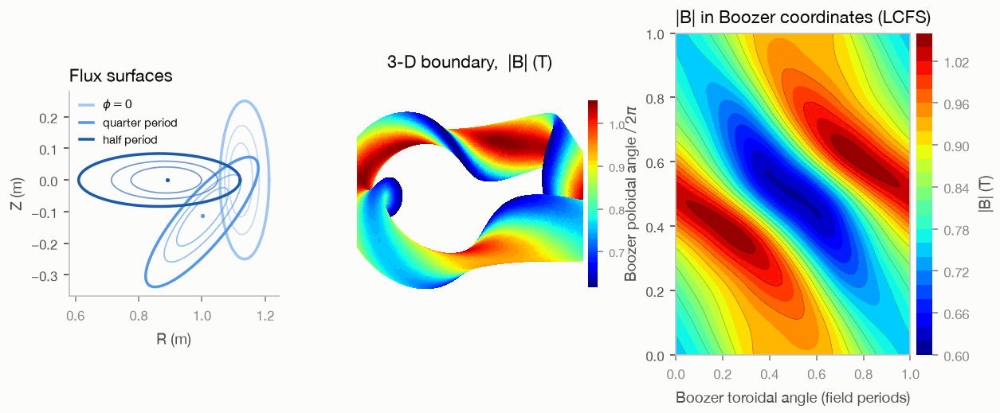
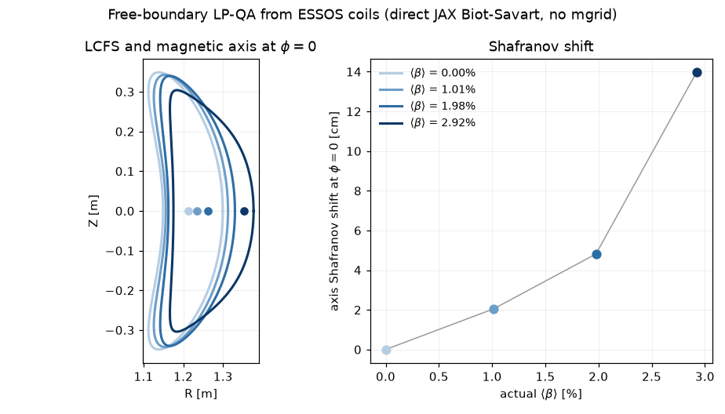
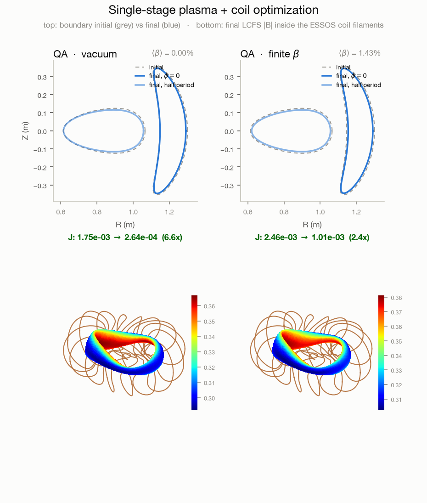
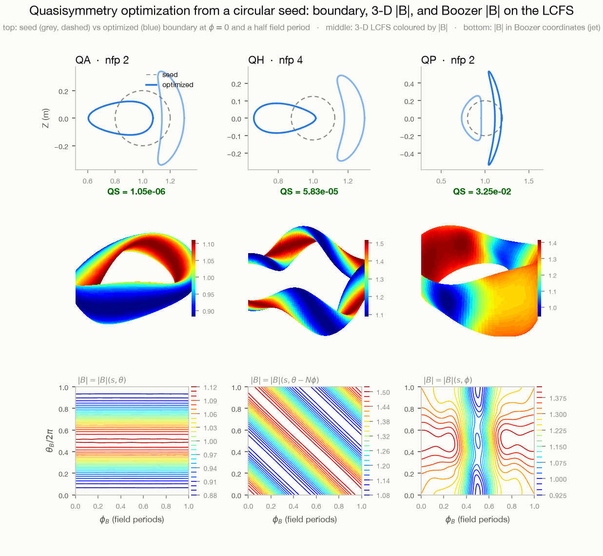
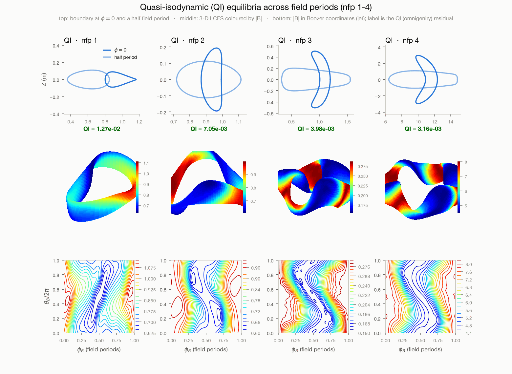
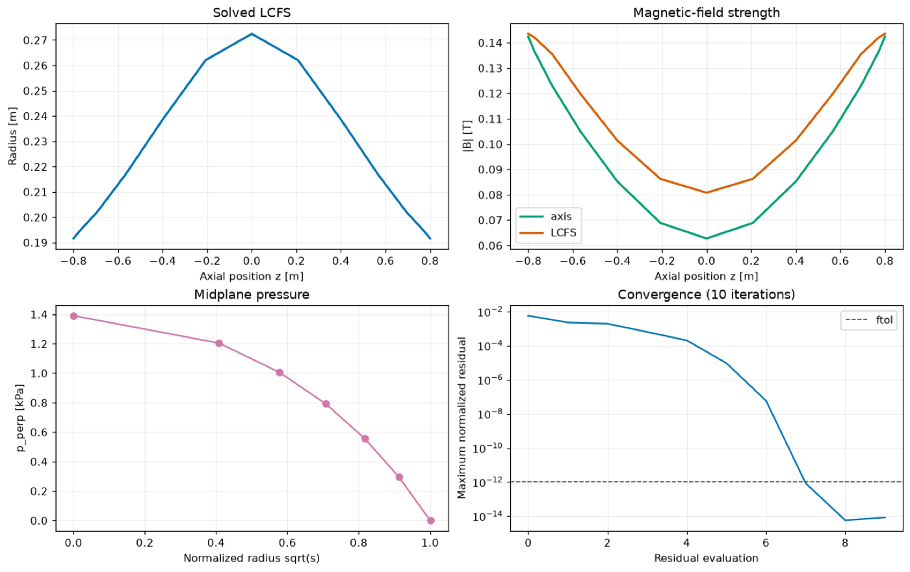
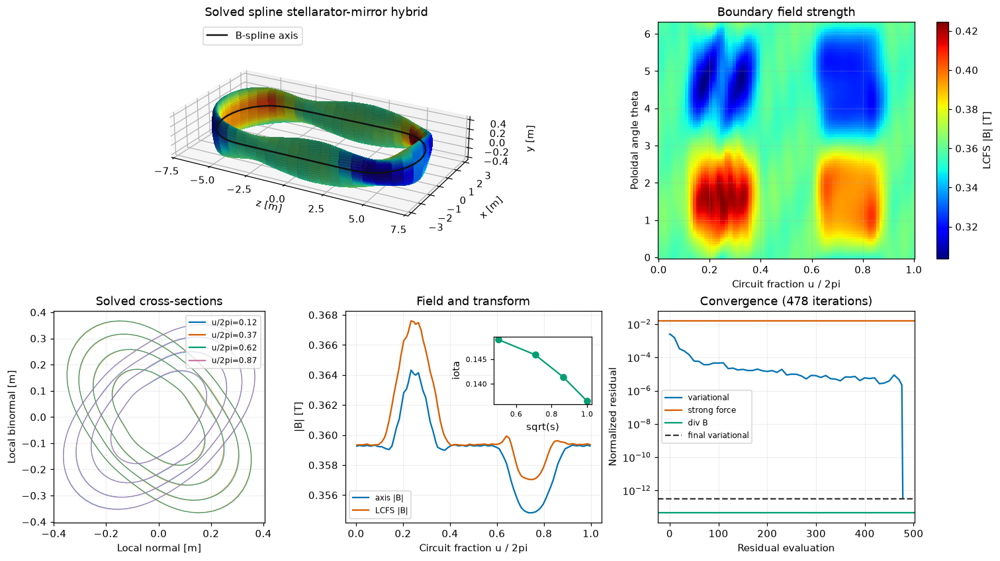
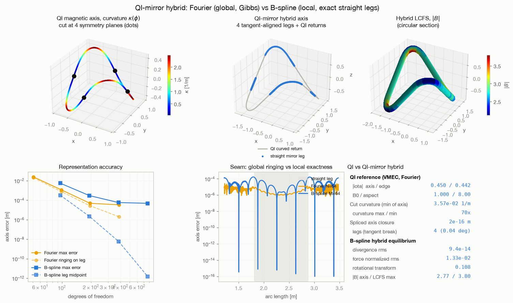

# VMEX

[](https://pypi.org/project/vmex/)
[](https://github.com/uwplasma/vmex/blob/main/pyproject.toml)
[](https://github.com/uwplasma/vmex/blob/main/LICENSE)
[](https://github.com/uwplasma/vmex/actions/workflows/ci.yml)
[](https://vmex.readthedocs.io/en/latest/)

> **`vmec_jax` is now `vmex`.** The package was renamed: install with
> `pip install vmex` and `import vmex`. The `vmec` CLI command still works as an
> alias, and `import vmec_jax` keeps working (with a deprecation warning) for
> one release. Full documentation: **[vmex.readthedocs.io](https://vmex.readthedocs.io/en/latest/)**.

**VMEX** is a clean-room, JAX-native reimplementation of the
[VMEC2000](https://princetonuniversity.github.io/STELLOPT/VMEC) ideal-MHD
equilibrium code for stellarators and tokamaks. It reproduces VMEC2000
iteration-for-iteration on representative benchmark decks — and, unlike the
Fortran original, provides differentiable research paths and runs on GPUs.
The exact support and validation matrix is documented in
[VMEC2000 compatibility and research scope](https://vmex.readthedocs.io/en/latest/vmec2000_compatibility.html).

- **VMEC2000 parity.** The solver ports VMEC2000's algorithms
  constant-for-constant (steepest-descent moment method, radial
  preconditioner, spectral condensation, NESTOR vacuum solve). Benchmark
  decks converge in the *same* number of iterations and reproduce the
  plasma energy at machine precision. An optional **2D block
  preconditioner** cuts iterations 2.5–11x on stiff cases while leaving the
  default path byte-identical.
- **Differentiable.** Gradients of *fixed-boundary* equilibrium outputs with
  respect to boundary shape and profile parameters by implicit
  differentiation of the converged fixed point — no finite differences, no
  unrolling — validated against central finite differences to ~1e-6 relative
  (see the gradient table in the docs), with an O(1)-memory adjoint. The
  **free-boundary virtual-casing residual** is differentiable in coil /
  `extcur` parameters on a specified plasma boundary and is
  finite-difference-validated. The host-driven NESTOR equilibrium solve itself
  is not differentiated.
- **Drop-in.** Reads VMEC2000 `input.*` namelists and VMEC++-style JSON,
  prints VMEC2000-format iteration output, and writes `wout_*.nc` files
  that load unchanged in simsopt and booz_xform.
- **Batteries included.** Plotting (`vmex --plot`), Boozer transform
  (`vmex --booz`), spline profiles, multigrid, hot restart, free boundary
  from mgrid files or fields tabulated from coils,
  typed zero-crash errors — with the shared linear/adjoint solver layer
  factored out into [SOLVAX](https://pypi.org/project/solvax/).



*The bundled quick-start case (`vmex --test`): flux-surface cross sections,
the 3-D plasma boundary coloured by `|B|`, and `|B|` in **Boozer coordinates**
on the last closed flux surface (the near-straight diagonal contours are the
signature of quasi-helical symmetry) for a four-field-period stellarator —
all from the built-in `vmex.core.plotting` / `core.boozer` helpers.*

## Install

Install from PyPI:

```bash
pip install vmex
```

For NVIDIA GPUs with a current JAX-supported Python and driver 580+, install
the CUDA 13 wheel and verify the detected devices:

```bash
pip install -U "jax[cuda13]"
vmex --doctor
```

VMEX does not require platform-selection environment variables for hardware
detection. Its automatic policy keeps small solves, very high-mode stages,
and implicit gradients on CPU when that is faster; the public solve and
implicit APIs also accept an explicit ``device=`` argument.

Development install from source:

```bash
git clone https://github.com/uwplasma/vmex
cd vmex && pip install -e .
```

## Quickstart

```bash
vmex --doctor     # check the installation and JAX backend
vmex --test       # solve the bundled QH case, write wout + plots
vmex input.X      # run any VMEC2000 input deck (or VMEC++-style JSON)
```

`vmex input.X` writes `wout_X.nc` next to the input (`--outdir` to
redirect). To try it on a real deck:

```bash
curl -L -O https://raw.githubusercontent.com/uwplasma/vmex/main/examples/data/input.nfp4_QH_warm_start
vmex input.nfp4_QH_warm_start
```

Post-process any wout file, including ones written by VMEC2000:

```bash
vmex --plot wout_nfp4_QH_warm_start.nc     # surfaces, |B|, profiles, 3D
vmex --booz wout_nfp4_QH_warm_start.nc     # Boozer transform -> boozmn_*.nc
vmex --plot boozmn_nfp4_QH_warm_start.nc   # Boozer |B| contours + spectrum
```

## Parity with VMEC2000

VMEX is validated end-to-end against golden VMEC2000 (PARVMEC 9.0) runs:
benchmark decks converge in **exactly** the golden iteration count — including
DSHAPE's mid-run jacobian reset — and reproduce the plasma energy `wb` to
1 part in 10¹⁵. Across the full benchmark suite (14 rows, all at `ns ≥ 201`),
the iteration count matches VMEC2000 exactly on 12 rows; on the free-boundary
CTH-like row it converges in a ~9% iteration tail, and on Nuhrenberg–Zille QHS
it converges in *fewer* iterations (1681 vs 2829). Per-variable wout agreement
and the full test gates live in the
[documentation](https://vmex.readthedocs.io/en/latest/).


*Parity is per-iteration, not just end-to-end: the total force residual
(`fsqr + fsqz + fsql`) of the quick-start QH case at ns=51, per iteration.
The vmex trajectory lies exactly on top of VMEC2000's (both converge in
502 iterations); VMEC++ follows a near-identical path (501 iterations).
Traces: vmex `SolveResult.fsq_history`, VMEC2000 `NSTEP=1` stdout,
VMEC++ wout `fsqt`.*

### Optional 2D preconditioner: fewer iterations on stiff cases

The default radial (1D) preconditioner reproduces VMEC2000 iteration-for-iteration.
An opt-in **2D block preconditioner** (matrix-free Newton: a Jacobian-vector-product
Hessian on SOLVAX's GMRES) cuts the iteration count **2.5–11×** at *identical*
accuracy — the converged `wb` matches the 1D result to ~1e-10 (it changes the path,
not the fixed point).


**Why it is opt-in, not the default.** Fewer iterations is not the same as less
wall-clock: each 2D Newton step (a GMRES solve of Hessian-vector products) costs far
more than a 1D radial sweep. Measured across easy and stiff decks the wall-clock
ranges 0.55–1.16× — a wash to *slower* (e.g. ~2× slower on a plain circular tokamak,
a tie even on an aspect-ratio-100 stiff case) — and peak memory is ~30% higher (the
extra GMRES/HVP compile graph). So the 1D path stays the byte-identical default, and
the 2D preconditioner is there for cases where the 1D iteration count is the
bottleneck or stalls.

## Performance


Full-solve wall-clock times on the bundled benchmark suite (Apple Silicon
CPU, single thread; `benchmarks/baseline.json`; reproduce with
`python benchmarks/run_baseline.py`):

- **Warm** — kernels already compiled; the number that matters inside an
  optimization loop or scan. Faster than VMEC2000 on **every** benchmark row
  (1.3–2.6× on typical decks, up to ~7× on small ones) — including the
  free-boundary rows (1.3–1.5×) since the NESTOR iteration loop was fused
  into jitted multi-iteration lanes. Ratios measured on a shared CPU are
  conservative lower bounds.
- **Cold** — a fresh CLI process pays a one-time 5–25 s JAX/XLA compile, so a
  single run is slower than Fortran. Executables cache per solver structure, so
  scans, ladders, and optimizations recompile nothing — which is why *warm* is
  the workflow number.
- **GPU** — at these sizes a fixed per-solve dispatch cost dominates and the CPU
  wins outright; per-iteration throughput favours the GPU ~3× on the largest
  moderate-mode decks. A same-host, cache-warm A4000 run of the supplied
  858-mode HSX case was instead 3.44× slower than CPU. The measured device
  policy therefore keeps both small-work and very-high-mode stages on CPU,
  while explicit placement always wins.
- **High resolution** — on Apple Silicon, separable toroidal FFT synthesis
  cuts the supplied
  `ns=101`, `mpol=18`, `ntor=24` HSX deck from 676.46 s / 3.90 GiB to
  206.56 s / 1.63 GiB in a fresh CPU VMEX CLI process; the CLI releases
  completed radial-stage executables while the reusable library API retains
  them by default. Convergence and VMEC2000 parity are unchanged. That is
  faster than the measured
  one-thread VMEC++ control (449.79 s), though ten-thread VMEC++ remains
  faster and smaller (92.03 s / 380 MiB); one-radial-process VMEC2000
  took 1154.82 s / 265 MiB.
  The measured default selects this kernel only above 512 modes on ARM CPUs
  and accelerators. Smaller problems retain the established dense lane (FFT
  was slower on three routine M4 decks and only marginally faster warm at
  128 modes); x86 CPUs also remain dense because FFT was slower.
  Dense synthesis with CLI stage-cache release took 413.24 s /
  4.04 GiB on the office Xeon, versus 570.47 s for FFT and the previous
  cache-retaining dense baseline of 426.94 s / 6.52 GiB (3.2% faster and
  38.0% lower peak RSS). `use_fft=True` or `False` remains an explicit
  library override.
  Column chunking bounds simultaneous design probes, while the implicit
  block factors still scale as `O(ns * m_block²)`; an `ns=201` one-Jacobian
  measurement used 4.11 GiB. The implicit callback deliberately retains the
  real dense transform: complex FFT tangents exceeded 10 GiB. A candidate
  chunk schedule that raised RSS by 36.7% was rejected, and the lower-memory
  GMRES path was over 5× slower without finishing. Scalar objectives now
  default to one matrix-free reverse adjoint and avoid that block assembly;
  reducing block storage for high-mode vector objectives remains open work.

## Features

| | VMEX | VMEC2000 | VMEC++ |
|---|:---:|:---:|:---:|
| Fixed-boundary equilibria | ✅ | ✅ | ✅ |
| Free boundary from an mgrid file | ✅ | ✅ | ✅ |
| Free-boundary radial multigrid + hot restart | ✅ | ✅ | ❌ |
| Free boundary from an in-memory coil-field table | ✅ | ❌ | ❌ |
| Free-boundary tokamaks (`ntor = 0`) | ✅ | ✅ | ❌ |
| Non-stellarator-symmetric (`LASYM = T`) | ✅ | ✅ | ✅ |
| Fixed-boundary fallback on missing mgrid | ✅ | ✅ | ❌ |
| Spline profiles (cubic / Akima) | ✅ | ✅ | ❌ |
| VMEC++-schema JSON input | ✅ | ❌ | ✅ |
| Hot restart from a previous state | ✅ | ❌ | ✅ |
| Typed zero-crash errors | ✅ | ❌ | ✅ |
| Boozer transform built in (`--booz`) | ✅ | ❌ | ❌ |
| Plotting built in (`--plot`) | ✅ | ❌ | ❌ |
| GPU execution | ✅ | ❌ | ❌ |
| Differentiable fixed boundary (implicit diff, O(1) memory) | ✅ | ❌ | ❌ |
| Differentiable virtual-casing residual on a specified boundary | ✅ | ❌ | ❌ |
| 2D block preconditioner (stiff-case speedup) | ✅ | ❌ | ❌ |

### Free boundary from coil-field tabulation

Free-boundary solves can use a coil set by tabulating an
[ESSOS](https://github.com/uwplasma/ESSOS) coil set onto the solver grid in
memory (`essos.coils.Coils.to_mgrid`) and pass it as `external_field=`,
without a persistent MAKEGRID file. This forward route still uses mgrid
interpolation. Separately, the virtual-casing residual can evaluate a JAX
Biot-Savart callable directly on a specified boundary, retaining coil
derivatives for that residual; it is not an adjoint of the reconverged NESTOR
solve. All coil geometry lives in ESSOS; vmex has no coil code of its own.



*Free-boundary equilibria of the Landreman–Paul precise-QA configuration held
by its 16 modular coils as optimized in
[ESSOS](https://github.com/uwplasma/ESSOS) (3 KB coil JSON bundled in
`examples/data/`; until `Coils.to_mgrid` is merged, use ESSOS branch
`feature/mgrid-from-coils`). Pressure is ramped at fixed coil currents with each point
warm-started from the previous boundary, and `PRES_SCALE` is calibrated per
point so the **actual** volume-average beta of the converged wout
(`betatotal`) — not a nominal input value — lands on 0, 1, 2, 3 % (all within
0.08 %, force residual ~2e-10 at ns = 51). The plasma dilates and the magnetic
axis Shafranov-shifts 14 cm outboard at the φ = 0 section (right panel) while
the coils never move. Reproduce with
`python examples/free_boundary_essos_coils.py`.*

### Single-stage plasma + coil optimization

VMEX can optimize the plasma boundary and the coils together, with one
exact gradient. A single `jax.value_and_grad` differentiates through the
fixed-boundary equilibrium (implicit adjoint), the virtual-casing surface
field, and the Biot–Savart law of the ESSOS coil filaments, covering boundary
Fourier modes, coil shapes, and coil currents at once. The benchmark below
compares this against the classical two-stage approach — stage 1 shapes the
boundary for quasi-axisymmetry, stage 2 fits coils to that frozen boundary —
from the same seeds (a circular torus and four circular coils), with identical
coil budgets, scored on the equilibrium each final coil set actually produces.
The finite-β case runs the same joint optimization with a pressure profile;
no published code demonstrates this in general form.

The most effective use is to polish the two-stage result, the "stage 3" of
[arXiv:2302.10622](https://arxiv.org/abs/2302.10622): warm-start the joint
objective from the stage-1 boundary and stage-2 coils and let both adapt.
In 10–30 minutes this lowers the normal-field error by 33% (vacuum) and 17%
(finite β) below the two-stage result, with quasisymmetry and iota unchanged —
stage 2 cannot make this correction because it holds the boundary frozen.
A pure cold start (third column) shows the same joint descent from the crude
seeds: after 50 iterations it reaches low B·n with compact coils, but its
quasisymmetry is far from what a dedicated stage 1 delivers, which is why the
polish pattern is recommended.



*Top: seed (grey, dashed) vs two-stage (orange) vs cold-start single-stage
(blue) boundaries at φ = 0 and a half field period — the polish boundary is
visually indistinguishable from two-stage (same aspect and iota), so it is not
drawn. Middle/bottom: each approach's final LCFS coloured by the local signed
field-alignment error B·n/|B| inside its own final coils (red: field leaving
the surface, blue: entering), on one shared colour scale per column so the
two approaches compare directly.*

Vacuum (measured; identical seeds and coil budgets across columns):

| metric (vacuum) | two-stage | + single-stage polish | single-stage (cold) |
|---|---|---|---|
| QS ratio residual | 9.3e-05 | 1.6e-04 | 2.4e-02 |
| mean iota (target 0.42) | 0.420 | 0.420 | 0.396 |
| ⟨\|B·n\|⟩/⟨B⟩ | 2.38e-03 | **1.60e-03** | 3.05e-03 |
| max\|B·n\|/⟨B⟩ | 1.30e-02 | **7.84e-03** | 1.18e-02 |
| coil lengths [m] (≤ 4.40) | 4.12–4.39 | 4.11–4.40 | 3.60–3.87 |

Finite β (⟨β⟩ ≈ 1.5 %, same pressure profile in all columns):

| metric (finite β) | two-stage | + single-stage polish | single-stage (cold) |
|---|---|---|---|
| QS ratio residual | 4.4e-05 | 2.4e-04 | 2.3e-02 |
| mean iota (target 0.42) | 0.420 | 0.422 | 0.100 |
| ⟨\|B·n\|⟩/⟨B⟩ | 2.80e-03 | **2.34e-03** | 6.20e-03 |
| max\|B·n\|/⟨B⟩ | 1.37e-02 | **1.27e-02** | 1.75e-02 |
| coil lengths [m] (≤ 4.40) | 3.91–4.18 | 3.91–4.19 | 3.25–3.28 |

Reproduce with `python examples/single_stage_vs_two_stage.py --case vacuum
--phase all` (and `--case beta`). Measured on a 36-core CPU: stage 1 ≈ 7–9 min,
stage 2 ≈ 6 min, polish ≈ 10–30 min; the optional cold-start single column is
the long pole (≈ 1.5 h vacuum, several hours at finite β). The phases are
resumable, so long runs can be split across sessions.

## Code size

VMEX delivers that superset of capabilities in little more than **half the
code**, and is the most densely documented of the three. Solver source only (tests,
language bindings, and vendored third-party excluded), counted with
[`pygount`](https://pypi.org/project/pygount/) 3.2:

| code base | language | files | code (SLOC) | comments / docstrings | doc-to-code |
|---|---|---:|---:|---:|---:|
| **VMEX** | Python | 41 | **13,326** | 6,744 | **0.51** |
| VMEC2000 (PARVMEC) | Fortran | 115 | 24,190 | 8,425 | 0.35 |
| VMEC++ | C++ / Python | 117 | 22,824 | 7,646 | 0.34 |

VMEX is little more than half the SLOC of VMEC2000 and VMEC++, while
*adding* differentiability, GPU execution, direct-coil free boundary, and a
built-in Boozer transform — and it carries the highest comment/docstring
density of the three (reproduce with
`pygount --format=summary vmex`).

## Python API

```python
from vmex.core.input import VmecInput
from vmex.core import optimize as opt
from vmex.core.wout import write_wout
from vmex.core.plotting import plot_wout

inp = VmecInput.from_file("input.nfp4_QH_warm_start")
eq = opt.solve_equilibrium(inp)        # full NS_ARRAY ladder, VMEC2000 numerics
print(eq.result.converged, eq.result.iterations, float(eq.wout.aspect))

write_wout("wout_nfp4_QH_warm_start.nc", eq.wout)   # wout built lazily on eq
plot_wout(eq.wout, "figures/")
```

Choosing an entry point: `optimize.solve_equilibrium` for Python analysis and
objectives (state + runtime + lazy `.wout`); `multigrid.solve_multigrid` for a
fixed-boundary ladder; `multigrid.solve_free_boundary_multigrid` for a
free-boundary ladder (including vacuum continuation and hot starts);
`implicit.run` for
gradients (`jax.grad`-able `ImplicitSolution`); `solver.solve` as the
low-level single-grid building block.

Optimization building blocks live in `vmex.core.optimize`
(quasisymmetry and omnigenity residuals; aspect ratio, iota, mirror ratio,
magnetic well, `DMerc`, Glasser `D_R`, `<J·B>`, and ballooning-stability
targets; a least-squares driver over boundary Fourier coefficients) with
implicit-differentiation gradients from
`vmex.core.implicit` (`jac="implicit"`). The recommended pattern is **one
`least_squares` call** — no `max_mode` continuation loop — with **Exponential
Spectral Scaling** ordering the harmonics through the trust region:

```python
from vmex import optimize as opt

qs = opt.QuasisymmetryRatioResidual(surfaces, helicity_m=1, helicity_n=0)
result = opt.least_squares(
    [(qs, 0.0, 1.0), (opt.aspect_ratio, 6.0, 1.0), (opt.mean_iota, 0.42, 1.0)],
    inp, max_mode=5, jac="implicit",
    use_ess=True,        # exp(-alpha*max(|m|,|n|)) trust radius per dof:
)                        # high harmonics on short leashes — no ladder needed
```

Measured on a 36-core CPU from a near-circular torus (single call, all
harmonics released at once; `examples/optimization/*_ess.py`; the staged
`max_mode`-ladder variants live alongside for comparison):

| class | nfp | residual | seed | achieved | max_mode | wall | status |
|-------|-----|----------|------|----------|----------|------|--------|
| QA | 2 | QS (1, 0)  | 2.04e-01 | **7.2e-06** | 5 | **14.5 min** | precise; aspect 6.00, iota 0.42 (ladder: 3.7e-07 in 25.5 min) |
| QH | 4 | QS (1, −1) | 6.91e-01 | **5.83e-05** | 5 | 25.5 min (ladder) | precise; aspect 8.00, iota −1.22 |
| QP | 2 | QS (0, 1)  | 4.46e-01 | 3.3e-02 | 5 | ~3.4 h (ladder + refinement) | hardest QS class — see caption |
| QI | 1 | omnigenity | 4.52e-01 | **1.81e-02** | 6 | **17.3 min** | 25× via the traceable Goodman constructed-QI residual |



*Each quasisymmetry class starts from a near-circular torus (grey, dashed) and
is shaped into a quasi-symmetric stellarator (blue) by the least-squares driver
(top row); the middle row is the optimized last-closed flux surface in 3-D
coloured by `|B|`, and the bottom row is `|B|` in Boozer coordinates on the LCFS
(jet line contours), whose contour geometry reads off the symmetry family —
horizontal for QA, diagonal for QH, vertical for QP. `QS` is the quasisymmetry
residual measured on the plotted equilibrium: QA **1.1e-6**, QH **5.8e-5**
(note QH's near-straight diagonal contours), QP **3.3e-2**. Quasi-poloidal QP
is the hardest class: the ladder plateaus near 5e-2, and an extended
warm-start refinement of the shipped deck reaches 3.3e-2. Reproduce with
`python benchmarks/make_readme_figures.py --only optimization` from the decks
in `benchmarks/opt_decks/`.*

Quasi-isodynamic (QI) shaping is intrinsically harder than quasisymmetry, so it
gets its own row across field periods:



*Quasi-isodynamic (QI) equilibria at nfp 1, 2, 3, 4 (bundled decks in
`examples/data/`): boundary cross-sections (top), 3-D `|B|` geometry (middle),
and `|B|` in Boozer coordinates on the LCFS (jet, bottom). The label is the QI
(omnigenity) residual — **not** QS; QI is hard, so ~1e-3–1e-2 is expected here,
not the ~1e-5 reachable for quasisymmetry. Reproduce with
`python benchmarks/make_readme_figures.py --only qi`.*

These campaigns need implicit gradients. Finite differences stall at the
axisymmetric seed of the QH target (a saddle point) and land in a worse basin
for QP. Three measured optimizations keep each campaign in the minutes range:

- scalar residuals use one reverse adjoint; vector residual Jacobians use a
  block-tridiagonal factorization (33× faster than per-dof GMRES);
- each trial equilibrium starts from a first-order perturbation prediction
  (3.7× fewer solver iterations);
- a converged-state memo avoids re-solving the point the residual just
  converged.

The implicit path runs on CPU by default, where it is fastest at production
sizes; suitably sized forward solves can use the GPU. The device policy
chooses per stage using both work and Fourier-mode thresholds, and
`device="cpu"` / `device="gpu"` explicitly overrides it without environment
variables. Passing `device=None` leaves placement to JAX; omitting it retains
VMEX's measured automatic policy.

### Beyond quasisymmetry: any objective, same gradients

Any physics objective can drive the same machinery. Starting from the
precise-QA deck above (QS ~1e-6, aspect 6.00, mean iota 0.42), five short
campaigns each optimize one new objective while keeping the QA residual in the
objective at a stiff weight:

- raise the coil-simplicity proxy min L∇B (`l_grad_b_state`);
- deepen the vacuum magnetic well;
- raise mean iota to 0.55 at fixed aspect;
- lower the aspect ratio to 4.8 at fixed iota;
- push the Mercier criterion `DMerc` toward stability at ⟨β⟩ ≈ 1.25%.

The first four use the implicit adjoint (`jac="implicit"`). The published
`DMerc` showcase deliberately preserves its legacy host-side reporting lane
and finite-difference baseline at `max_mode` 2. New campaigns can instead use
the traceable `mercier_stability_residual` with `jac="implicit"`; see the
optimization objectives documentation. The self-consistent Redl bootstrap
objective has its own section below.


| campaign | objective | seed → final | QS held? |
|----------|-----------|--------------|----------|
| `lgradb` | raise min L∇B to 1.3× seed (implicit adjoint) | 0.520 → 0.522 m (stiff — see note) | 9.8e-07 → 1.3e-06 |
| `well` | deepen the vacuum magnetic well (implicit adjoint) | **−0.037 → +0.0002** (hill → well) | 9.8e-07 → 1.5e-05 |
| `iota_up` | mean iota 0.42 → 0.55 at aspect 6 (implicit adjoint) | **0.420 → 0.535** | 9.8e-07 → 1.8e-05 |
| `aspect_down` | aspect 6.00 → 4.8 at iota 0.42 (implicit adjoint) | **6.00 → 4.84** | 9.8e-07 → 4.2e-06 |
| `dmerc` | interior DMerc → positive at ⟨β⟩ ≈ 1.25% (finite differences) | −16.6 → −16.5 (stiff — see note) | 6.6e-05 → 6.6e-05 |

The `well`, `iota_up`, and `aspect_down` campaigns each take 2–3 minutes on a
workstation CPU. The other two barely move, for physical reasons: with QS,
aspect, and iota all held, the precise-QA shape is already close to its best
attainable L∇B, and improving interior Mercier stability at fixed pressure
requires profile or current degrees of freedom that boundary shaping alone
does not provide.

*Reproduce with `python examples/optimization/objectives_showcase.py` (an
`--only lgradb,dmerc` flag runs subsets), then
`python benchmarks/make_readme_figures.py --only objectives`.*

### Self-consistent bootstrap current

VMEX implements the **Redl** analytic bootstrap-current formula
([Redl et al. 2021](https://doi.org/10.1063/5.0012664)) as a differentiable
objective, and a fixed-boundary self-consistency loop that regenerates the
toroidal current from the plasma geometry and kinetic profiles. Below,
reproducing [Landreman, Buller & Drevlak 2022](https://arxiv.org/abs/2205.02914):
the published precise QA and QH optima are loaded, their current profile is
**erased**, and `self_consistent_bootstrap` recovers it from the Redl formula
plus the paper's density/temperature profiles.


*Recovered current density &#10216;J·B&#10217; (VMEC, blue) matches the analytic
Redl profile (green), the published self-consistent equilibrium (grey), and —
for QA — the paper's SFINCS drift-kinetic benchmark (circles). Converged in 7
(QA) / 4 (QH) Picard iterations to bootstrap mismatch `f_boot` = 2.0e-6 / 7.5e-6;
the recovered plasma current lands within **1.9 % (QA)** and **0.3 % (QH)** of
the published `CURTOR`. Reproduce with
`python examples/optimization/{QA,QH}_bootstrap_selfconsistent.py` (needs the
paper's Zenodo dataset).*

## VMEX vs DESC

[DESC](https://desc-docs.readthedocs.io/) is the other JAX-native,
differentiable, GPU-capable stellarator-equilibrium code. The key difference:
DESC minimises the MHD force in a global Zernike–Fourier basis — its own
equilibrium — while VMEX reproduces VMEC exactly. The two are
complementary:

| Where **VMEX** wins | Where **DESC** wins |
|---|---|
| **Is VMEC**: iteration-for-iteration VMEC2000 parity, standard `wout_*.nc`, VMEC-format prints | **Low-resolution accuracy**: global Zernike basis converges in fewer radial points |
| **Drop-in**: reads VMEC2000 `input.*` and VMEC++ JSON unchanged | **Objective library**: large, mature set of built-in optimization targets |
| **Full namelist**: non-symmetric surfaces (`LASYM = T`), NESTOR *and* virtual-casing free boundary | **Optimizers**: more built-in stochastic / constrained optimizers |
| **O(1)-memory adjoint**: peak memory flat in the number of design variables | Adjoint gradients (both codes are differentiable) |

Reach for **VMEX** to drop a differentiable code that *is* VMEC into an
existing VMEC workflow (simsopt, `booz_xform`, near-axis tooling). Reach for
**DESC** for its spectral accuracy at low radial resolution or its mature
objective library.

## CLI reference

```text
vmex input.X             solve (INDATA or VMEC++ JSON), write wout_X.nc
vmex --plot wout_*.nc    diagnostic plots from a WOUT file
vmex --booz wout_*.nc    run booz_xform_jax, write boozmn_*.nc
vmex --plot boozmn_*.nc  Boozer contour/spectrum plots
vmex --test              run and plot the bundled quick-start case
vmex --doctor            installation and JAX backend diagnostics

options:
  --outdir PATH          directory for wout/boozmn/figure output
  --mode {cli,jit}       jitted blocks with live printing (cli, default)
                         or a single lax.while_loop (jit)
  --device PLATFORM      auto (default), none (follow JAX), cpu, gpu,
                         cuda, rocm, or tpu; applies to all solve paths
  --ftol F               override the final-stage FTOL_ARRAY tolerance
  --max-iter N           override the final-stage NITER_ARRAY cap
  --coils PATH           ESSOS-style coils file: tabulate its Biot-Savart
                         field in memory instead of reading an mgrid file
  --mbooz/--nbooz N      Boozer spectral resolution (default 32/32)
  --booz-surfaces S      Boozer surfaces ('all' or a list of s values)
  --quiet                silence the VMEC-style stdout
```

`vmec` detects the available JAX hardware without environment variables and
uses CPU or GPU according to the measured per-stage policy. Use `--device
cpu` or `--device gpu` to override it explicitly. Implicit-gradient work
defaults to CPU because it is launch-bound on the tested GPUs; passing
`device=None` to the Python API follows JAX placement. `vmex --doctor`
reports the devices and all three VMEX placement policies.

## Documentation

Full documentation — installation, quickstart, theory and numerics with
equation-to-source cross-references, API reference, and
performance/validation notes — at
[vmex.readthedocs.io](https://vmex.readthedocs.io/en/latest/).

## Mirror equilibria

Alongside the toroidal VMEC core, `vmex.mirror` solves scalar-pressure
equilibria for **open magnetic mirrors** and **closed stellarator–mirror
hybrids** — the same differentiable, spline-native machinery applied to a
straight (open) axis. Open mirrors use nonperiodic axial coordinates
`(s, θ, ξ)` with fixed-flux end cuts, not thin-torus approximations. Coils and
Biot–Savart fields stay in [ESSOS](https://github.com/uwplasma/ESSOS); VMEX
consumes a supplied `xyz → B` field. The divergence-free field and
scalar-pressure energy are

```text
√g B^θ = I'(s) − ∂_ξ λ,    √g B^ξ = Ψ'(s) + ∂_θ λ,    B^s = 0
W = ∫ [ B²/(2μ₀) + p/(γ − 1) ] dV
```

Mirror fixed/free-boundary solves and beta scans use a measured CPU default
for their SciPy-controlled JAX callbacks (35.2 s CPU versus 44.2 s RTX A4000
on the office `15x15` case). Pass `device="gpu"` or `device="cpu"` to
override it, or `device=None` to follow JAX placement; no platform environment
variable is needed. If a field callable captures device arrays, wrap it with
`jax.tree_util.Partial` so VMEX can relocate those captured leaves; an opaque
Python closure cannot be inspected or moved.

### Fixed-boundary open mirrors

A fixed-boundary solve is one call:

```python
from vmex.mirror import MirrorConfig, MirrorResolution, solve_fixed_boundary_from_radius

config = MirrorConfig(resolution=MirrorResolution(ns=7, mpol=4, nxi=17))
result = solve_fixed_boundary_from_radius(0.3, config)   # radius: scalar, (nxi,), or (ntheta, nxi)
```


Two solved equilibria from the same example: a standard axisymmetric mirror
(circular sections) via the one-call entry point, and a rotating ellipse whose
cross-section turns 90° between the end caps. Both converge at `ftol = 1e-12`
(divergence ~1e-14) in seconds, and their boundary gradients are
finite-difference-validated — the derivative an external optimizer needs.

### Free-boundary β scan

`solve_beta_scan` jointly updates the spline boundary, the plasma state, and
the unbounded exterior vacuum, driven by an ESSOS two-coil field. The lane is
supported through **50 % β** (fine-grid-confirmed: every β point from 0 through
50 % converges on the `(ns, nxi, elements, ntheta) = (13, 25, 13, 24)` grid with
bulk minor-radius force ≤ 2.4 × 10⁻³, far under the 0.05 promotion gate) and the
free-boundary derivative is finite-difference-validated. The compact-coil
configuration shown keeps the plasma finite-β equilibrium visibly coupled to the
coils.



### Stellarator–mirror hybrid

A closed periodic hybrid joins two straight mirror legs to two curved
stellarator returns on a rotation-minimizing B-spline axis. A `section_turns`
parameter turns the elliptical cross-section continuously around the circuit (a
genuine rotating-ellipse section) while the legs keep an exactly straight axis;
two turns lift the transform from the return-only `ι = 0.085` to `ι = 0.141` at
`s = 0.75`. Freezing the leg-return junction as an explicit design parameter
makes the **circular-section lane supported** (its force gate converges under
refinement); the **rotating-elliptical-section hybrid is a research candidate**
— the toroidal rotation passes the minor-radius bulk gate but its
device-normalized force still plateaus on the scoped near-axis representation
issue. The same implicit API differentiates the periodic boundary and axis
controls.



### QI–mirror hybrid: Fourier vs B-spline

A quasi-isodynamic (QI) stellarator already has poloidally closed `|B|` contours
and near-straight (low-curvature) magnetic-axis segments at its
field-period-symmetric planes, so cutting the axis there and inserting a straight
mirror cell is natural. `examples/qi_mirror_hybrid_fourier_vs_bspline.py` solves
`input.nfp2_QI` (VMEC, Fourier), reads its magnetic axis, and confirms the four
curvature minima of an nfp=2 QI axis: `κ` drops to **0.036 1/m** at `φ = 0, π` and
**0.088 1/m** at `φ = π/2, 3π/2` (a 70× spread over the torus). It cuts at all
**four** symmetry planes and inserts a straight mirror leg at each **along the
local axis tangent** — so every leg continues the axis in its own direction.
Choosing the leg lengths so the inserted displacements cancel and reflecting one
half about the `x` axis makes the four-legged racetrack **stellarator symmetric**,
with each leg tangent to the axis (junction break `~0.04°`, not a corner). It then
represents that closed hybrid axis both ways:

| representation | straight mirror leg | seam behaviour |
| --- | --- | --- |
| **Fourier** (VMEC-native, global) | ringing floors near **2e-6 m** at 387 DOF | Gibbs-type ringing everywhere at once |
| **B-splines** (`vmex.mirror`, local) | **machine precision** (`1.5e-12 m` once each leg spans ≳30 knots) | error confined to a few knots around the junction |

Only the local B-spline reproduces the exactly-straight cell to machine
precision; the residual maximum of both is set by the leg–return **curvature**
break (a cubic B-spline is `C²` and also rounds a curvature step — an honest
shared limit). The B-spline lane also solves the hybrid equilibrium
(divergence-free to `9e-14`, `ι = 0.11`, mirror ratio 1.8; force residual
`1.3e-2`). A literal VMEC re-solve of a straight-axis device is degenerate
in cylindrical `(R, φ, Z)` coordinates — which is exactly why the closed-axis
B-spline lane exists.



### Run the mirror examples

```bash
python examples/mirror_fixed_boundary_nonaxisymmetric.py
python examples/mirror_free_boundary_beta_scan.py
python examples/stellarator_mirror_hybrid.py
python examples/qi_mirror_hybrid_fourier_vs_bspline.py
```

Open-mirror `mout_*.nc` files plot with `vmex --plot mout_*.nc`. The
[mirror-geometry documentation](https://vmex.readthedocs.io/en/latest/mirror_geometry.html)
derives the coordinate and field models and records the coil geometry,
convergence residuals, promotion-gate ladders, and derivative-validation
numbers behind these figures.

## License

MIT. If you use VMEX in published work, please cite this repository and
the original VMEC papers (Hirshman & Whitson, *Phys. Fluids* 1983;
Hirshman, van Rij & Merkel, *Comput. Phys. Commun.* 1986).
