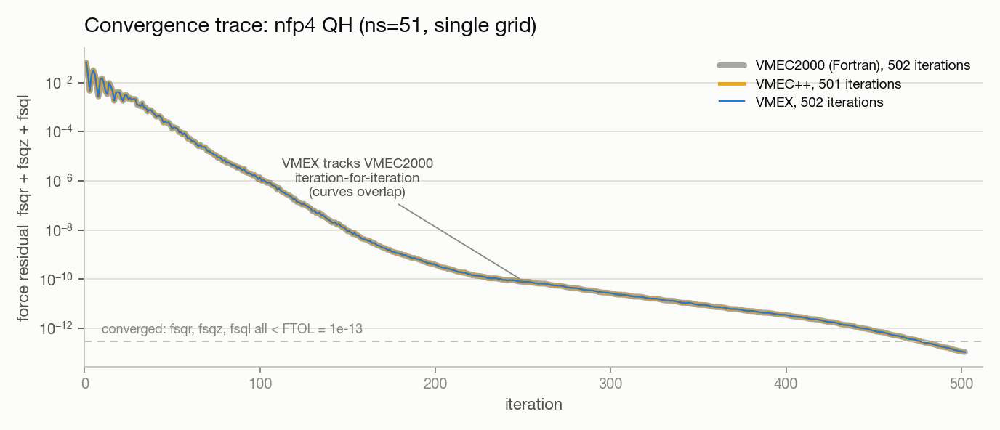
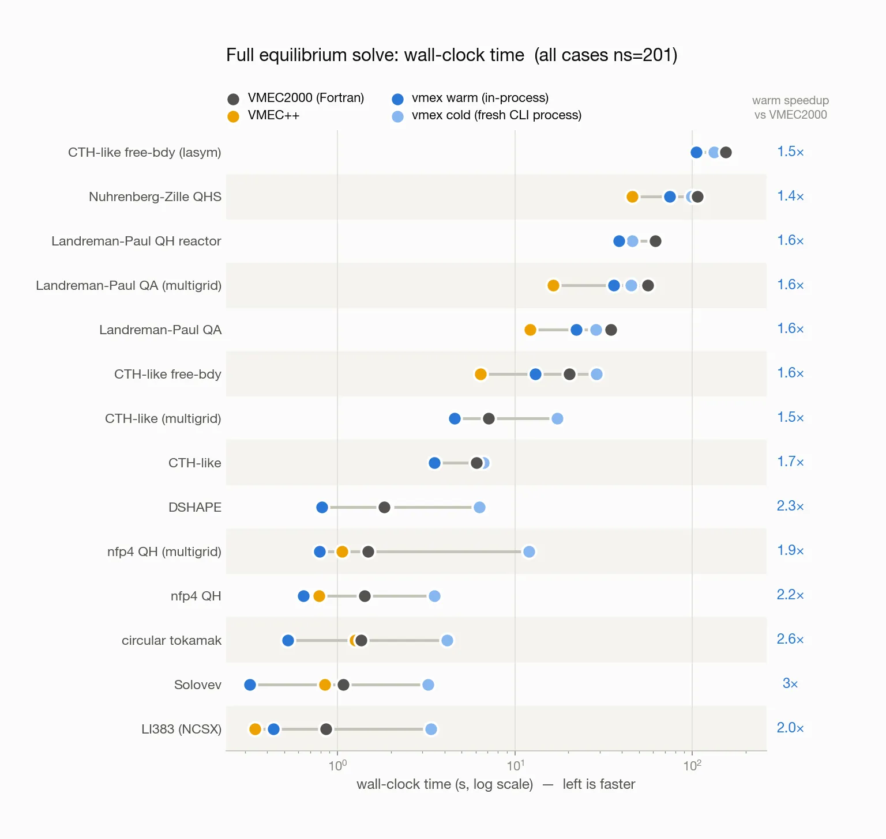
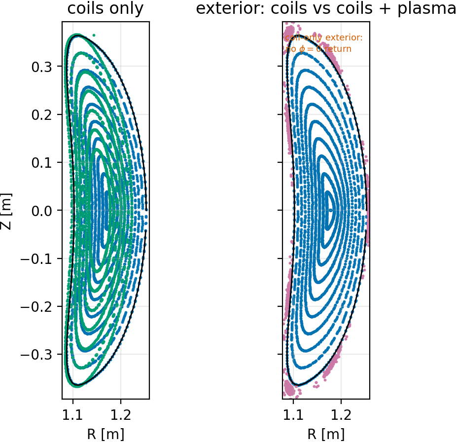
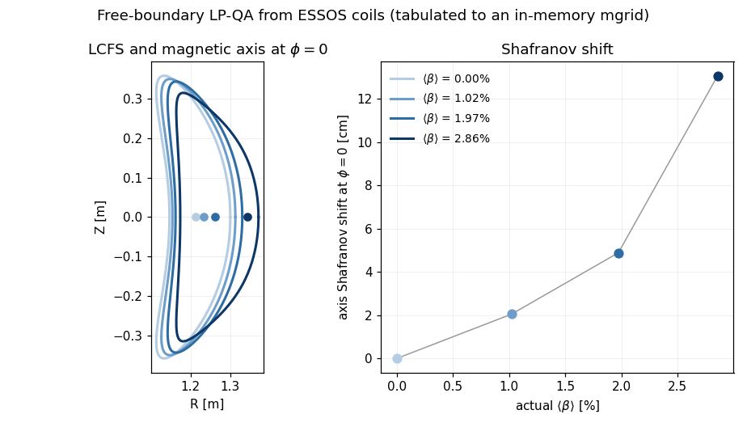
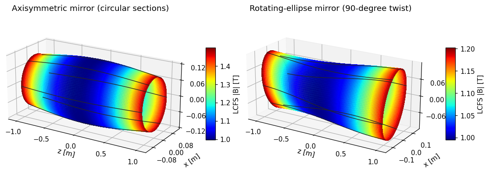
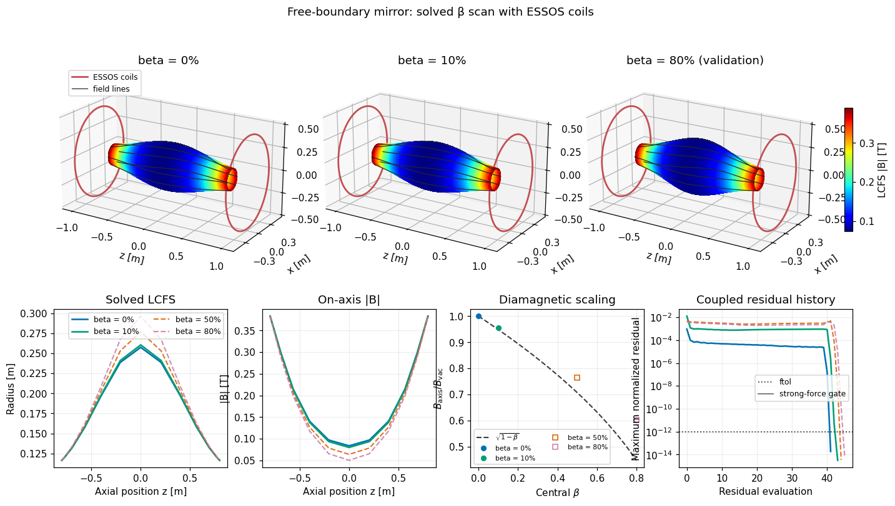
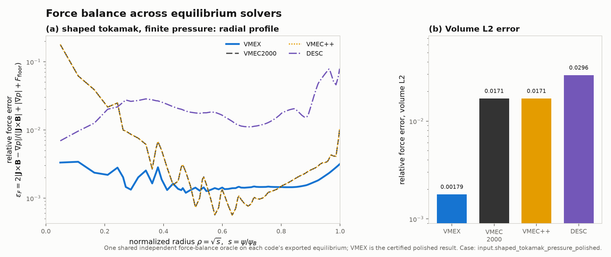
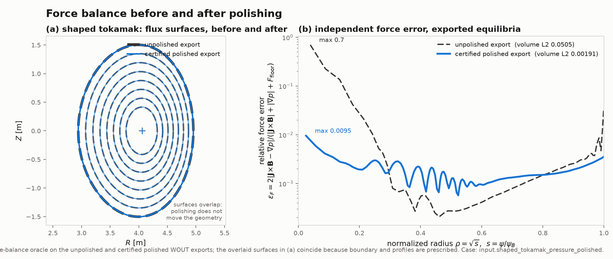

# VMEX

[](https://pypi.org/project/vmex/)
[](https://github.com/uwplasma/vmex/blob/main/pyproject.toml)
[](https://github.com/uwplasma/vmex/blob/main/LICENSE)
[](https://github.com/uwplasma/vmex/actions/workflows/ci.yml)
[](https://codecov.io/gh/uwplasma/vmex)
[](https://vmex.readthedocs.io/en/latest/)

> **Rename note:** `vmec_jax` is now `vmex`; the deprecated `import vmec_jax` compatibility shim still ships with VMEX 0.5.

VMEX is a JAX implementation of VMEC for stellarator and tokamak ideal-MHD equilibria. It reads standard VMEC input files, solves fixed- and free-boundary problems, writes standard `wout_*.nc` files, and provides exact implicit derivatives of converged fixed-boundary equilibria for optimization.


## Install

```console
pip install vmex
vmex --doctor
vmex --test
```

Python 3.10+ is supported. VMEX installs CPU JAX, SciPy, plotting, NetCDF, and `booz_xform_jax`; install an accelerator-enabled JAX wheel separately using the [JAX installation guide](https://docs.jax.dev/en/latest/installation.html). Optional integrations are `vmex[optimizers]` for JAXopt/Optax, `vmex[neoclassical]` for NEO_JAX effective ripple, `vmex[freeb]` for differentiable virtual casing, `vmex[coils]` for ESSOS, and `vmex[turbulence]` for GKX.

An editable source install remains connected to its checkout, so `pip install -e .` only needs to be repeated when packaging metadata or dependencies change—not after each `git fetch` or checkout.

## Solve and inspect an equilibrium

```python
import vmex as vj

inp = vj.VmecInput.from_file("input.circular_tokamak")
result = vj.solve_multigrid(inp, verbose=True)
wout = vj.wout_from_state(inp=inp, state=result.state,
                           fsqr=result.fsqr, fsqz=result.fsqz, fsql=result.fsql,
                           niter=result.iterations, converged=result.converged)
vj.write_wout("wout_circular_tokamak.nc", wout)
figures = vj.plot_wout("wout_circular_tokamak.nc", "figures")
# The summary includes the relative radial force-error profile and its maximum.
# That panel is O(1) noise for a vacuum case: read it only at finite pressure
# or with net current.
```

The CLI provides the same workflow:

```console
vmex input.circular_tokamak
vmex --plot wout_circular_tokamak.nc
vmex input.nearby --restart wout_circular_tokamak.nc
```

VMEX uses the input file's `NS_ARRAY`, `FTOL_ARRAY`, and `NITER_ARRAY`. `verbose=True` prints the VMEC iteration table; typed errors distinguish invalid inputs, Jacobian failures, non-convergence, and numerical failures.

## Physics and interoperability

VMEX includes VMEC pressure/current/iota profiles, multigrid continuation, NESTOR free boundary, mgrid and direct coil fields, Boozer transforms, QI/QS and maximum-J objectives, Mercier and ballooning diagnostics, bootstrap-current objectives, dimensional scaling, mirror equilibria, and standard wout/mout output. The [capability reference](https://vmex.readthedocs.io/en/latest/reference/capabilities.html) states the validation level and limitations of each path.

VMEX outputs are intended for existing VMEC workflows: `wout_*.nc` files load in SIMSOPT, `booz_xform`, and other downstream tools. VMEC2000 compatibility and deliberate differences are documented in the [compatibility reference](https://vmex.readthedocs.io/en/latest/reference/vmec2000-compatibility.html).

### Solver feature comparison

This matrix was checked on 2026-08-11 against current [STELLOPT/VMEC2000](https://github.com/PrincetonUniversity/STELLOPT) and [VMEC++](https://github.com/proximafusion/vmecpp) sources. ✅ denotes a public path, ⚠️ a documented limitation, and ❌ no public path; the linked VMEX capability contract defines the validation scope.

| Capability | VMEX | VMEC2000 | VMEC++ |
|---|:---:|:---:|:---:|
| fixed-boundary toroidal equilibria | ✅ | ✅ | ✅ |
| 3-D NESTOR free boundary | ✅ | ✅ | ✅ |
| free-boundary radial multigrid | ✅ | ✅ | ✅ |
| free boundary from an in-memory field table | ✅ | ❌ | ✅ Python |
| axisymmetric free-boundary tokamaks | ✅ | ✅ | ❌ |
| non-stellarator-symmetric (`LASYM`) equilibria | ✅ | ✅ | ❌ |
| fixed-boundary fallback when an mgrid file is missing | ✅ | ✅ | ❌ |
| cubic and Akima spline profiles | ✅ | ✅ | ❌ |
| INDATA / structured JSON input | ✅ / ✅ | ✅ / ❌ | ✅ / ✅ |
| hot restart from a saved equilibrium | ✅ Python/CLI | ✅ CLI | ✅ Python |
| typed zero-crash errors | ✅ | ❌ | ✅ |
| built-in Boozer transform and plotting | ✅ | ❌ | ❌ |
| input and WOUT dimensional scaling | ✅ | ❌ | ❌ |
| GPU execution | ✅ | ❌ | ❌ |
| exact fixed-boundary derivatives and optimizer interface | ✅ | ❌ | ❌ |
| differentiable specified-boundary virtual-casing residual | ✅ | ❌ | ❌ |
| 2-D block preconditioner | ✅ matrix-free | ✅ BCYCLIC | ❌ |
| differentiable QI/QS, maximum-J, trapped-fraction, and stability objectives | ✅ | ❌ | ❌ |
| self-consistent bootstrap-current workflows | ✅ | ❌ | ❌ |
| open mirrors and stellarator–mirror hybrids | ⚠️ validated scopes | ❌ | ❌ |

### Convergence parity and implementation size

On the bundled NFP=4 QH case at `ns=51`, VMEX follows VMEC2000 and VMEC++ through the full force-residual trace (fresh local run: VMEX `d7347c9`, VMEC2000 `512375c`, VMEC++ 0.5.3). Reproduce it with `python benchmarks/make_readme_figures.py --only convergence`; the benchmark discovers local solver installations or accepts `VMEX_XVMEC2000` and `VMEX_VMECPP_PY`.



The following `cloc 2.11` snapshot counts implementation code and comments, excluding tests, generated code, and third-party sources. VMEX counts `vmex/core` (the toroidal solver); VMEC2000 counts `VMEC2000/Sources` but not shared STELLOPT libraries; VMEC++ counts `src/vmecpp` C++/headers/Python. These scopes make the comparison reproducible, not a claim of identical feature breadth.

| Solver and revision | Files | Code lines | Comment lines |
|---|---:|---:|---:|
| VMEX `d7347c9` | 46 | 21,189 | 7,857 |
| VMEC2000 `aeb0261` | 115 | 24,164 | 8,451 |
| VMEC++ `d83035b` | 146 | 38,338 | 9,661 |

VMEX reduces duplication by expressing spectral operators as vectorized JAX array programs and using the same equations for CPU, accelerators, and automatic differentiation. It also deliberately omits some legacy modes, so the smaller codebase reflects both architecture and narrower compatibility surface.

## Performance and parallelism

JAX compilation is paid once per array structure and reused from a machine-local cache. Warm runs are the relevant measure for continuation, parameter scans, and optimization.



Independent solves use `vj.parallel.solve_ensemble(inputs, workers=None)`. A single equilibrium already uses XLA's internal threading; ensemble workers are therefore bounded by both the number of cases and the CPUs made available by the host scheduler. Explicit `workers=1` gives a reproducible serial baseline, and GPU/device placement can be selected with `device=`.

`benchmarks/optimization.py` profiles QI, QA, QH, QP, scalar objectives,
SciPy/JAX contract agreement, finite differences, optimizer choices, and the
`max_fsq_ratio` policy.

## Magnetic field and derivatives

Converged equilibria evaluate the field inside the LCFS, including spatial
derivatives and exact VJPs in the originating optimization problem's degrees
of freedom:

```python
import jax.numpy as jnp

final_equilibrium = problem.equilibrium_from_x(result.x)
final_equilibrium.set_points_xyz([[x, y, z]])

B = final_equilibrium.B()
absB = final_equilibrium.absB()
gradB = final_equilibrium.gradB()
gradgradB = final_equilibrium.gradgradB()
gradgradgradB = final_equilibrium.gradgradgradB()

dBdx = final_equilibrium.B_vjp(jnp.ones_like(B))
dgradBdx = final_equilibrium.gradB_vjp(jnp.ones_like(gradB))
d2Bdx = final_equilibrium.gradgradB_vjp(jnp.ones_like(gradgradB))
d3Bdx = final_equilibrium.gradgradgradB_vjp(
    jnp.ones_like(gradgradgradB))
```

Everything above is Cartesian, and each VJP returns one entry per
`problem.dof_names`. `set_points_flux([[s, theta, phi]])` places interior points
in flux coordinates (outputs stay Cartesian); `B` and its first three
derivatives are valid on the magnetic axis via the regular spectral limit.
Outside the plasma, `VmecExtender` adds the `virtual_casing_jax` plasma
contribution to a supplied coil or MGRID field — virtual casing alone is not the total exterior field.



Above, from `examples/vmex_fieldline_tracing_finite_beta.py`: Poincaré
sections of the coil field alone (left) and of the extended field (right)
for a finite-beta QA equilibrium. The pink points are field lines seeded
just outside the boundary in the extended field — coils plus the
virtual-casing plasma contribution — resolving the island chain outside the
plasma; the coil field alone loses those lines before they return.

Effective ripple is an optional in-memory diagnostic—no `boozmn` file is
needed. `examples/epsilon_effective.py` computes and plots the conventional
NEO transport quantity $\epsilon_{\mathrm{eff}}^{3/2}$.

```python
field = vj.VmecExtender.from_file(
    "wout_example.nc", external_field=coils.B, nphi=32, ntheta=32
)
field.set_points([[1.8, 0.0, 0.0]])

B = field.B()              # (n, 3), Cartesian
modB = field.absB()        # (n,)
gradB = field.gradB()      # (n, B_i, x_j)
d2B = field.gradgradB()
d3B = field.gradgradgradB()
grad_modB = field.GradAbsB()
```

Install `vmex[freeb]` for the finite-beta path. Points must be outside the
last closed flux surface, away from the source surface and external currents.
MGRID queries must also remain inside the tabulated R-Z domain.
The resulting vacuum region can contain islands or stochastic field lines;
VMEX does not assume nested surfaces there.

`equilibrium.exterior_field()` builds the plasma contribution from the live
VMEX spectral state, rather than a materialized wout, so JAX derivatives with
respect to the equilibrium boundary are retained for single-stage objectives.
`examples/vmex_get_B_gradB.py` and `examples/free_boundary_essos_coils.py`
are the runnable references; the docs' install page covers the ESSOS branch
that exterior coil VJPs and field-line tracing currently need.

The common CLI operations are:

| Command | Result |
|---|---|
| `vmex input.X` | solve INDATA or JSON and write `wout_X.nc` |
| `vmex input.X --plot` | solve and write the summary, cross-sections, automatic Boozer `|B|`, profiles, normalized force balance, and 3-D LCFS |
| `vmex --plot wout_X.nc` | write the same complete plot set from an existing equilibrium |
| `vmex --booz wout_X.nc` | additionally save a reusable standard `boozmn_X.nc` file |
| `vmex input.X --restart wout_Y.nc` | hot-restart a fixed- or free-boundary solve from a saved equilibrium |
| `vmex --scale input.X [B R]` | scale field and length by optional factors; without them target 5.7 T and 1.7 m |
| `vmex --doctor` / `vmex --test` | inspect the installation / run the bundled quick start |

See the [CLI reference](https://vmex.readthedocs.io/en/latest/reference/cli.html) for resolution, device, convergence, coil, plotting, and Boozer options.

## Hot restart

Pass a previous state or wout to initialize a nearby run. VMEX adapts the boundary and skips completed multigrid rungs when possible.

```python
base = vj.solve_multigrid(inp)
nearby = vj.solve_multigrid(changed_input, initial_state=base.state)
from_file = vj.solve_multigrid(changed_input, restart_from="wout_base.nc")
```

The CLI equivalent is `vmex input.changed --restart wout_base.nc`; a deck may instead set `RESTART_WOUT`. Optimization trial solves hot-restart automatically. See the [restart guide](https://vmex.readthedocs.io/en/latest/howto/restart-from-previous-run.html) for grid changes and validation rules.

## Bring your own optimizer

Objective tuples use `(function, target, weight)`, with `weight` multiplying the squared cost by default; a one-dimensional weight applies different penalties to profile rows, such as a stronger edge penalty. The resulting problem plugs into SciPy, JAXopt, Optax, or any optimizer you already use — VMEX supplies values, residuals, and exact derivatives, and stays out of the driver's way.

```python
from dataclasses import replace
import jax.numpy as jnp
import numpy as np
from scipy.optimize import least_squares

from vmex import optimize as opt
from vmex.core.omnigenity import QIResidual

max_mode = 5
mpol = max(max_mode + 2, 5)
inp = replace(inp, delt=0.5).change_resolution(
    mpol=mpol, ntor=mpol, ntheta=2 * mpol + 6, nzeta=2 * mpol + 4)
qi = QIResidual(np.linspace(0.1, 1.0, 6))

def iota_floor(equilibrium_state, solver_context):
    return jnp.maximum(
        0.33 - jnp.abs(opt.mean_iota(equilibrium_state, solver_context)), 0.0)

problem = opt.VmecProblem.from_tuples(inp, [
    (qi, 0.0, 1.0),
    (opt.aspect_ratio, 5.0, 0.005),
    (iota_floor, 0.0, 10.0),
], max_mode=max_mode, use_ess=True)

result = least_squares(problem.residual, problem.x0,
    jac=problem.residual_jac, x_scale=problem.scales, max_nfev=50, verbose=2)
optimized_input = problem.input_from_x(result.x)
optimized_equilibrium = problem.equilibrium_from_x(result.x)
```

VMEX implicitly differentiates the converged equilibrium by default. For a
residual vector, `auto` checks each block-response column against the linearized
VMEC equations. If any column fails, it recomputes the Jacobian with the reverse
adjoint. Cost weights, hot restarts, and one-column batches are defaults.

| Control | Purpose |
|---|---|
| `derivative_method="finite_difference"` | accept opaque host objectives |
| `implicit_jacobian_method` | choose automatic, block, forward, or reverse response assembly |
| `jacobian_batch_size` | trade first-compile memory for warm throughput |
| `forward_ftol`, `forward_max_iterations` | set the final equilibrium solve controls |
| `max_fsq_ratio` | bound `FSQ / ftol` before differentiation |
| `workers` | parallelize finite differences, scans, and ensembles; `None` respects scheduler CPU limits |

`problem.value_and_grad` and `problem.jax_value_and_grad` expose the same scalar contract. `problem.evaluate(x)` reports solve effort, failed trials, derivative fallbacks, `fsq`, `fsq_ratio`, and whether the implicit derivative was certified. The runnable examples show SciPy least squares, BFGS/L-BFGS-B, JAXopt, Optax Adam, QI/QS objectives, high-accuracy final solves, input/wout output, and plotting.

Joint boundary/coil and coil-only free-boundary scripts are previews for the
same ESSOS branch.

## QA, QH, QP, and QI examples

The scripts in `examples/optimization/` optimize QA (NFP=2), QH (NFP=4), QP (NFP=2), and QI (NFP=2) from simple seeds; each writes an optimized input, WOUT, and standard plots. Run `QA_optimization.py`, `QH_optimization.py`, `QP_optimization.py`, or `QI_optimization.py`, then `python examples/plot_optimized_families.py` to reproduce the composites below. Each column shows four toroidal cuts separated by `π/(2 NFP)`, the 3-D LCFS colored by `|B|`, and LCFS `|B|` in Boozer coordinates.

`examples/optimization/stellarator_asymmetry/` contains matching vacuum and finite-beta examples with `LASYM=True`; each visibly seeds and optimizes the additional `RBS` and `ZBC` boundary families.


Validated QI inputs spanning NFP=1–4 are bundled in `examples/data/`; the same plotting script reads them directly.


## Finite beta, free boundary, and mirrors

`examples/free_boundary_essos_coils.py` holds the Landreman–Paul QA coil currents fixed while increasing beta and re-solving the NESTOR free boundary. The magnetic-axis displacement is the expected Shafranov shift.



VMEX also solves open-ended mirrors. `examples/mirror/mirror_fixed_boundary_nonaxisymmetric.py` compares an axisymmetric mirror with a non-axisymmetric rotating ellipse; `examples/mirror/mirror_free_boundary_beta_scan.py` continues an ESSOS-coil free boundary from 0% to 80% central beta. The latter plots the solved on-axis field against the MHD paraxial scaling `B/Bvac = sqrt(1-beta)` implied by `p + B²/(2 μ0) = Bvac²/(2 μ0)`. The 0–10% lane is supported; higher-beta points remain clearly marked as extended validation pending refined-grid promotion.





Closed stellarator–mirror hybrids also expose a differentiable, equal-arc
field-line contract for GKX: VMEX owns the Cartesian metric and drift
calculation, and GKX converts the mapping to its generic flux-tube type. The
interface accepts only a field line that closes on the periodic racetrack and
makes no open-end, sheath, source, or loss-cone claim; the
[model and equations](https://vmex.readthedocs.io/en/latest/explanation/mirror-gyrokinetics.html) spell out that boundary.

```python
from vmex.mirror import gk_closed_fieldline_geometry

geometry = gk_closed_fieldline_geometry(
    result.evaluated.state,
    setup.discretization,
    setup.axis,
    axial_flux_derivative=AXIAL_FLUX_DERIVATIVE,
    current_derivative=0.0,
    ntheta=32,
)
```

## Optional force-balance polishing

Polishing is disabled by default. Ordinary `solve`, `solve_multigrid`,
`solve_file`, CLI, and optimization calls run the established VMEC solve only.
Enable the additional step explicitly when a smaller continuum force residual
is needed.

VMEC converges projected equations on a staggered radial mesh, so small
`FSQR/FSQZ/FSQL` values do not by themselves guarantee a small continuum
residual

$$
\mathbf F = \mathbf J \times \mathbf B - \nabla p , \qquad
\epsilon_F = \frac{2 |\mathbf F|}{|\mathbf J \times \mathbf B| + |\nabla p| + F_{\mathrm{floor}}} .
$$

`eps_F` is the acceptance threshold, and it is **bounded above by 2 by construction**: since `|F| <= |JxB| + |grad p|` pointwise, no state can exceed 2 however badly it violates force balance. It reaches 2 wherever the denominator collapses, and in vacuum, where `grad p` is identically zero, it sits at 2 to machine precision wherever any current remains. A value near 2 reports a collapsed denominator, not a 200% force error, and two saturated states cannot be ranked against one another at all. This is not hypothetical on a shipped deck: on the bundled `input.solovev`, whose pressure peaks at 0.125 Pa, the certificate reports `eps_F` volume L2 `1.969` and Linf `2.000` - the ceiling - because `<|grad p|>` is `1.35e-1` Pa m<sup>-1</sup> against a magnetic pressure gradient of `8.03e3` Pa m<sup>-1</sup>. The same state's vacuum-safe normalized force error is `1.22e-2`, and its dimensional `<|F|>` is `4.00e1` N m<sup>-3</sup>: an ordinary, small residual that the pointwise metric had no way to express ([record](benchmarks/polish_force_error_solovev_2026-09-03.json)).

Every certificate therefore also reports quantities that cannot saturate, over `s` in `[0.1, 0.99]` as well as over the whole domain: the volume-averaged relative force error `<|F|>/<|grad p|>` of Panici et al. (2023) (reported as `n/a` in vacuum, where it is undefined), the vacuum-safe `|F| / <|grad(B^2/2mu0)|>` that DESC's `ForceBalance` objective uses, the dimensional `<|F|>` in N m<sup>-3</sup>, and the near-axis/bulk/edge split of the residual. The CLI prints all of them beside `eps_F`, `PolishReport` carries them, and the benchmark artifacts record them. Quote one of those, never `eps_F` alone, when reporting a gain; the [certificate page](https://vmex.readthedocs.io/en/latest/explanation/high-order-force-balance.html) derives the bound.

The optional step lifts a converged fixed-boundary state to axis-regular cubic
B-splines, holds the boundary and profiles fixed, and reduces both physical
force channels on an overdetermined collocation grid with matrix-free SOLVAX
Gauss–Newton steps. VMEX accepts the result only after independent force,
radial-refinement, and positive-Jacobian checks.

Enable it in a VMEC-compatible input deck:

```fortran
!@VMEX POLISH = AUTO
!@VMEX POLISH_TOL = 1.0E-3
!@VMEX POLISH_MAX_ITER = 40
&INDATA
  ...
/
```

VMEX reads the comments; VMEC2000 ignores them. `POLISH = AUTO` lifts the
converged final stage to degree-3 clamped radial B-splines (about one span per
two radial points, at most 32), returns at once if that lifted state already
passes the independent certificate (volume L2 at or below `1.0E-2`), and
otherwise runs up to 80 Gauss-Newton iterations at relative tolerance `1.0E-3`.
`ON` runs the same path; `OFF` is the default. The other directives map onto `PolishConfig`:

| Directive | Meaning | Default |
|---|---|---|
| `POLISH = AUTO \| ON \| OFF` | polish once after the final fixed-boundary stage | `OFF` |
| `POLISH_TOL` | Gauss-Newton relative tolerance (`tolerance`) | `1.0E-3` |
| `POLISH_DEGREE = 3 \| 5 \| 7` | radial B-spline degree (`radial_degree`) | `3` |
| `POLISH_SPANS` | radial spans of the polished basis (`radial_spans`) | resolution-derived, at most 32 |
| `POLISH_MAX_ITER` | Gauss-Newton iteration cap (`max_nonlinear_iterations`) | `80` |
| `POLISH_FAIL = ERROR \| FALLBACK \| WARN` | failed polish: raise, return unpolished, or warn | `ERROR` |

The CLI mirrors every directive (`--polish`, `--polish-tol`, `--polish-degree`,
`--polish-spans`, `--polish-max-iter`, `--polish-fail`, `--no-polish`) with
precedence `CLI flag > Python keyword > file directive > package default`; an
explicit `polish_config` in Python wins over all scalar knobs. A CLI run
announces each polish phase, prints one row per Gauss-Newton iteration, and
closes with a certificate verdict that names any failed check.

The same opt-in is available in Python:

```python
import vmex as vj

# Reads the !@VMEX directive; no directive means no polishing.
result = vj.solve_file("input.my_case")

# VmecInput contains physics only, so direct solves use an explicit flag.
inp = vj.VmecInput.from_file("input.my_case")
result = vj.solve_multigrid(inp, polish_force_balance="auto")
print(result.polish_report.initial_normalized_l2)
print(result.polish_report.final_normalized_l2)
```

`opt.solve_equilibrium(..., polish_force_balance=True)` exposes the same final
step. Leave it at its `False` default during ordinary optimization and enable it
only for a final equilibrium if desired. The focused example shows the full
before/after workflow:

```console
vmex examples/data/input.shaped_tokamak_pressure_polished --plot
python examples/force_balance_polishing.py
```

The comparison below applies the same independent force oracle to the
exported equilibrium of each code - VMEX, VMEC2000, VMEC++, and DESC - on the
bundled finite-pressure shaped tokamak; VMEX is the certified polished
result. The two cases in it were selected because certified polishing
improves them. It is therefore evidence that polishing can reduce the
continuum residual on those cases and by how much, and it is not evidence of
a general advantage: it says nothing about how often polishing helps, or
about cases where it does not. Stellarator rows join as certified 3-D
polishing becomes tractable (the compile-side work is in progress).



Below: the bundled shaped tokamak (`input.shaped_tokamak_pressure_polished`)
before and after polishing, with the boundary and prescribed profiles
untouched. The like-for-like measurement is the one taken on the lifted
native state - the same spline basis, the same certificate nodes, before and
after the correction - and it is recorded, with the deck hash, the commit and
the exact command, in
[`benchmarks/polish_force_error_2026-09-03.json`](benchmarks/polish_force_error_2026-09-03.json):

| quantity | before | after | ratio |
|---|---|---|---|
| `eps_F` volume L2 (bounded by 2) | `1.284e-2` | `1.803e-3` | 7.1x |
| dimensional \|F\| volume L2, N m<sup>-3</sup> | `3.330e2` | `2.068e2` | 1.61x |
| `<\|F\|>/<\|grad p\|>`, whole domain | `2.090e-3` | `1.586e-3` | 1.32x |
| `<\|F\|>/<\|grad(B^2/2mu0)\|>`, whole domain | `2.374e-3` | `1.801e-3` | 1.32x |
| `<\|F\|>/<\|grad p\|>`, `s` in `[0.1, 0.99]` | `1.658e-3` | `1.561e-3` | 1.06x |
| \|F\| L2 near axis (`rho < 0.2`), N m<sup>-3</sup> | `9.773e2` | `6.718e1` | 14.5x |
| \|F\| L2 bulk (`0.2 <= rho <= 0.8`) | `1.630e2` | `1.470e2` | 1.11x |
| \|F\| L2 edge (`rho > 0.8`), N m<sup>-3</sup> | `4.089e2` | `2.844e2` | 1.44x |

Read the last three rows first: the correction is concentrated near the
magnetic axis, where it removes a factor of 14.5, and over the bulk of the
plasma it is worth about 10%. The 7.1x in `eps_F` is largely that near-axis
gain, because the pointwise denominator is smallest there and the metric is
most sensitive to it; measured as a volume-averaged relative force error over
the whole domain the improvement is 1.32x, and over `s` in `[0.1, 0.99]` it
is 1.06x. Quote the row that answers the question being asked.

Earlier versions of this section claimed "about 26-fold, from `5.05e-2` to
`1.91e-3`". That number is not the polish gain: its two ends are the
*exported* wouts of the figure below, written on different radial meshes -
the unpolished export on the `ns = 31` solve mesh, the certified polished
export on the `ns = 129` mesh that a certifiable reconstruction requires - so
it multiplied the polish gain by an export-mesh reconstruction difference.

The radial force-balance panel in `vmex --plot` summaries is VMEC's own
discrete flux-surface average, which ordinary solves already minimize, so
that panel does not show this gain.



The raw comparison data, source revisions, resolutions, timing boundaries, and
certificate refinements are recorded in `benchmarks/`.

## Equilibrium and kinetic diagnostics

`vmex --plot wout_X.nc` produces cross-sections, profiles, a 3-D LCFS, and
the compact summaries below, including the relative radial force error and
its maximum over solved surfaces, Mercier/Glasser stability, the second
adiabatic invariant, and Boozer $|B|$. The radial force-error panel is
meaningless for a vacuum case — with no pressure gradient and no net current
its numerator and denominator are the same discretization noise, so it reads
$O(1)$ regardless of solve quality. The
[plotting guide](https://vmex.readthedocs.io/en/latest/howto/plot-diagnostics.html)
defines every panel; `--booz` additionally saves a reusable `boozmn_*.nc`.

This finite-pressure NFP=3 QI example reaches $\langle\beta\rangle=2.38\%$.


The vacuum QA example has `pres=0` and `DWell=0` exactly: VMEX adds no pressure floor. `DMerc` can retain shear, current, and geodesic terms; for a current-free vacuum it reduces to the shear term and $D_R=0$, so these curves are not a finite-beta pressure margin.


`QA_optimization_bootstrap.py`, `QH_optimization_bootstrap.py` and `QI_optimization_bootstrap.py` first fit a bootstrap-consistent seed, then optimize the boundary and a stage-refined current spline together against Redl, Mercier, and resistive-interchange targets. The QI variant uses `helicity_n=0`, since a quasi-isodynamic field carries no helical symmetry for the Redl isomorphism to shift; Redl is a fit to quasisymmetric calculations, so there it is an analytic estimate rather than a converged kinetic answer. Their controls are explained in the [objective reference](https://vmex.readthedocs.io/en/latest/reference/objectives.html#bootstrap-current-redl); published-equilibrium and SFINCS comparisons live in `benchmarks/`.
Each script also writes a direct Redl-versus-equilibrium bootstrap-current overlay. In the vacuum QA example, setting `TRIAL_BETA` enables differentiable frozen-geometry pressure proxies for `DMerc` and `DR`; a finite-pressure re-solve remains the stability certificate.


## Documentation and development

The [documentation](https://vmex.readthedocs.io/) is organized as tutorials, task-focused how-to guides, API/reference pages, and numerical explanations. Start with:

- [first equilibrium](https://vmex.readthedocs.io/en/latest/tutorials/first-equilibrium.html)
- [first gradient](https://vmex.readthedocs.io/en/latest/tutorials/first-gradient.html)
- [first optimization](https://vmex.readthedocs.io/en/latest/tutorials/first-optimization.html)
- [optimization reference](https://vmex.readthedocs.io/en/latest/reference/optimization.html)
- [objectives reference](https://vmex.readthedocs.io/en/latest/reference/objectives.html)
- [parallel and HPC usage](https://vmex.readthedocs.io/en/latest/howto/parallel-ensembles.html)

For development:

```console
git clone https://github.com/uwplasma/vmex
cd vmex
pip install -e ".[dev]"
pytest -q -m "not full and not weekly"
python -m ruff check vmex tests examples benchmarks
```

See [contributing](https://vmex.readthedocs.io/en/latest/project/contributing.html) and the [test manifest](tests/manifest.json). Release notes are on [GitHub](https://github.com/uwplasma/vmex/releases). VMEX uses the MIT license.

## Roadmap

The detailed, phased plan lives in [plan.md](plan.md). In flight now:

- Performance: the committed workflow baselines drive measured fixes to
  compilation reuse, the polishing path's runtime, and chunked Boozer
  transforms; regimes (cold, cache-reload, warm) are never mixed in one
  number.
- A pinned DESC `Gamma_c` oracle: `GammaC` evaluates DESC's form of the
  Nemov proxy and is checked against drift-kinetic identities and its own
  `wout` tables, but no test yet asserts its value against a number
  computed by DESC's `GammaC` on a shared equilibrium.
- Up-down asymmetric (LASYM) equilibria as a first-class certified lane.
- Promote the boundary-Schur free-boundary adjoint and coil-only
  free-boundary single-stage optimization after their compile and GPU
  memory costs come down.
- Promote stellarator–mirror hybrids from extended validation, with
  refinement studies, independent force checks, and optimization examples.
- Downstream contracts: booz_xform_jax, NEO_JAX, and GKX consume VMEX
  states differentiably, with cross-code parity tests.
