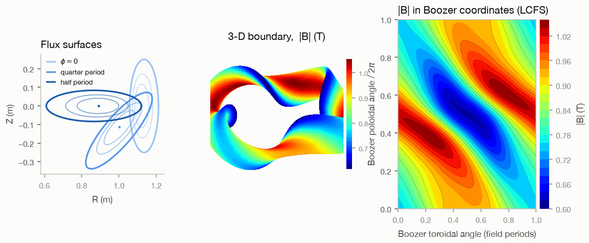
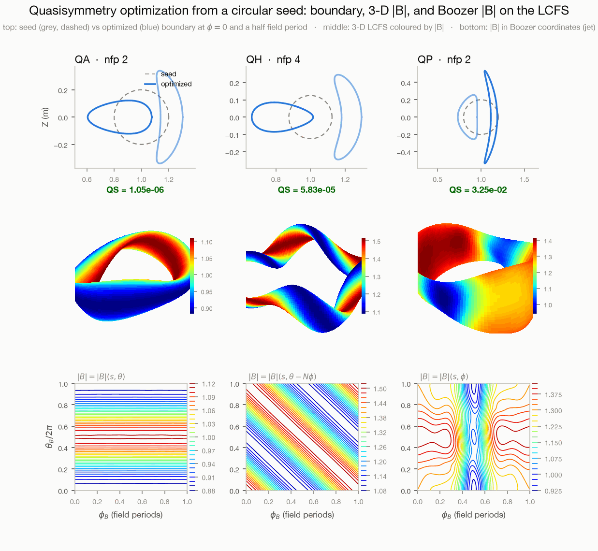
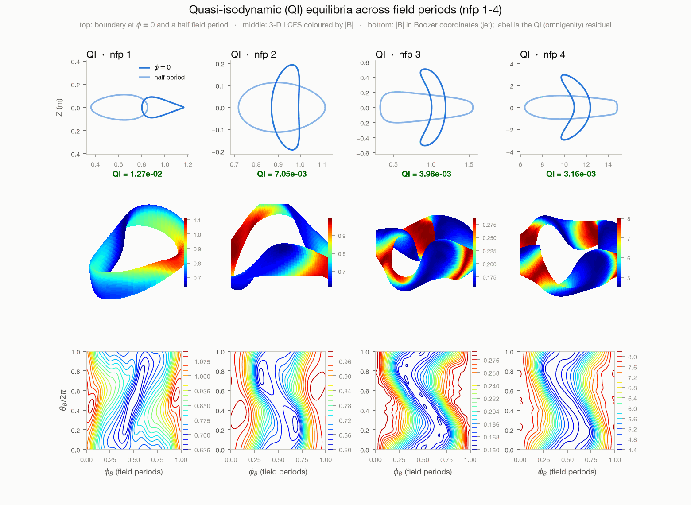
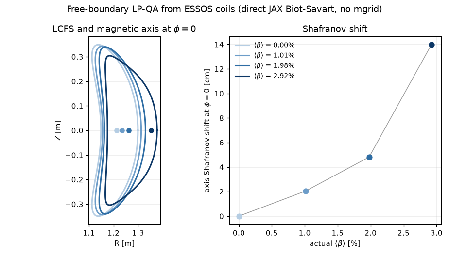
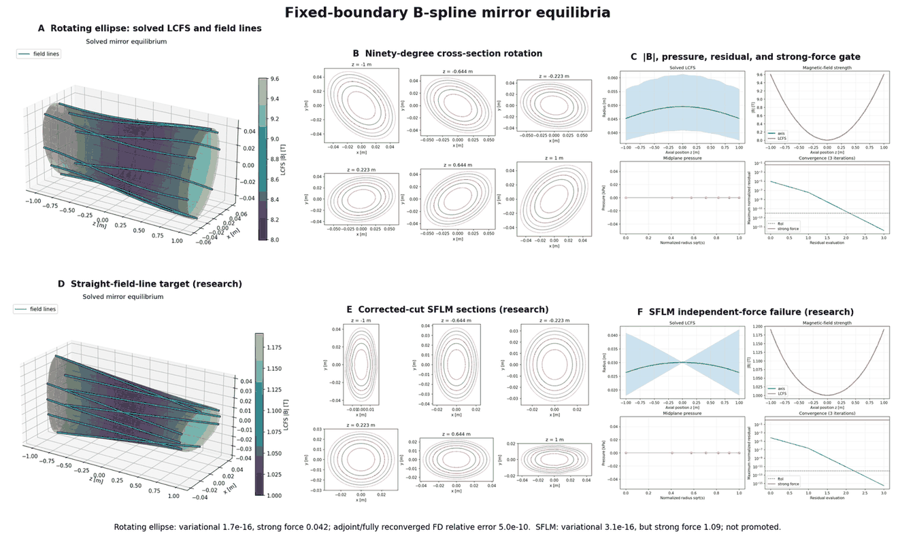
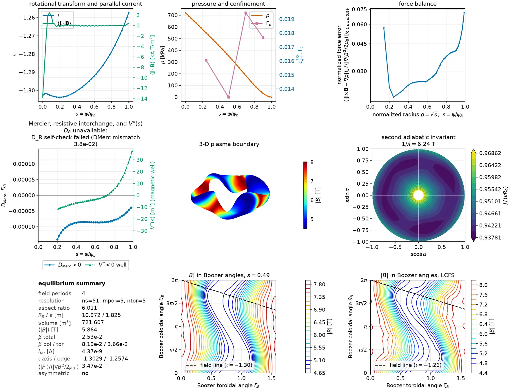
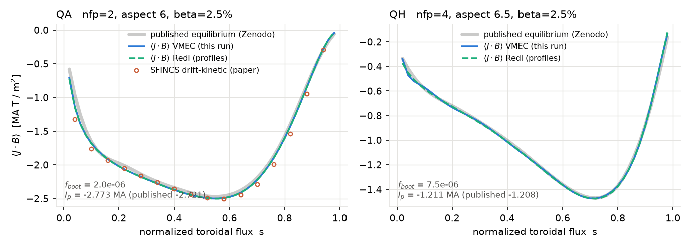
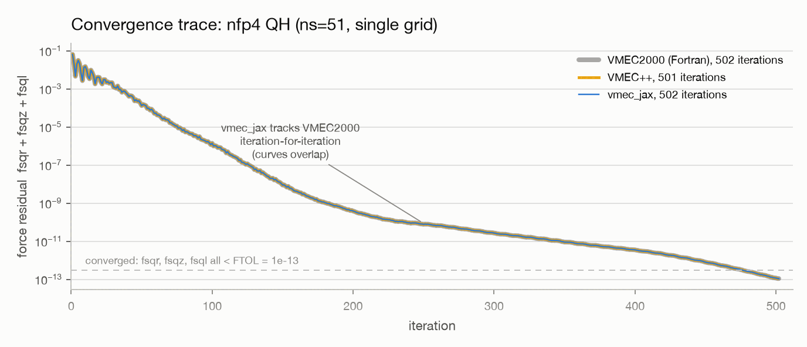
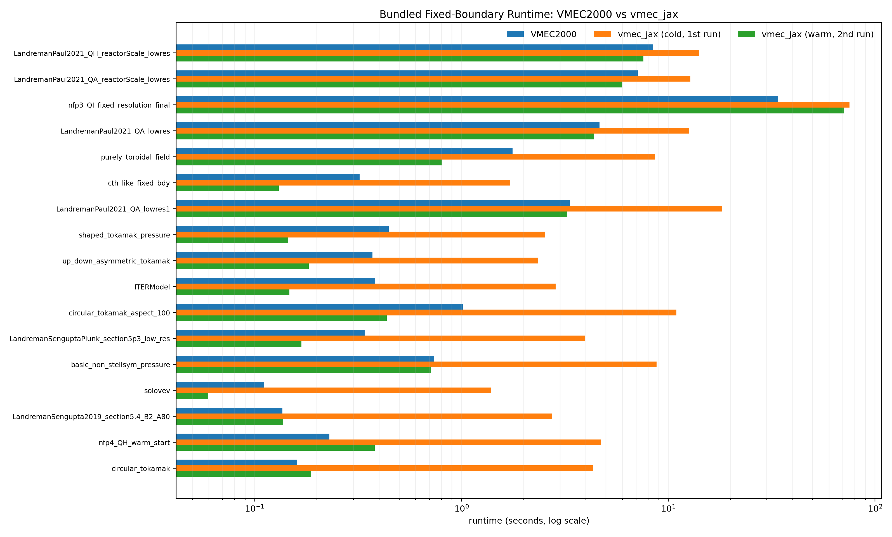

# VMEX

[](https://pypi.org/project/vmex/)
[](https://github.com/uwplasma/vmex/blob/main/pyproject.toml)
[](https://github.com/uwplasma/vmex/blob/main/LICENSE)
[](https://github.com/uwplasma/vmex/actions/workflows/ci.yml)
[](https://vmex.readthedocs.io/en/latest/)

> **Rename note:** `vmec_jax` is now `vmex`; the deprecated `import vmec_jax` compatibility shim still ships with VMEX 0.5.

VMEX is a JAX implementation of VMEC for stellarator and tokamak ideal-MHD equilibria. It reads standard VMEC input files, solves fixed- and free-boundary problems, writes standard `wout_*.nc` files, and provides exact implicit derivatives of converged fixed-boundary equilibria for optimization.



## Install

```console
pip install vmex
vmex --doctor
vmex --test
```

Python 3.10+ is supported. VMEX installs CPU JAX, SciPy, plotting, NetCDF, and `booz_xform_jax`; install an accelerator-enabled JAX wheel separately using the [JAX installation guide](https://docs.jax.dev/en/latest/installation.html). Optional integrations are `vmex[optimizers]` for JAXopt/Optax, `vmex[neoclassical]` for NEO_JAX effective ripple, `vmex[freeb]` for differentiable virtual casing, `vmex[coils]` for ESSOS, and `vmex[turbulence]` for GKX.

An editable source install remains connected to its checkout, so `pip install -e .` only needs to be repeated when packaging metadata or dependencies change—not after each `git fetch` or checkout.

## Solve and inspect an equilibrium

```python
import vmex as vj

inp = vj.VmecInput.from_file("input.circular_tokamak")
result = vj.solve_multigrid(inp, verbose=True)
wout = vj.wout_from_state(inp=inp, state=result.state,
                           fsqr=result.fsqr, fsqz=result.fsqz, fsql=result.fsql,
                           niter=result.iterations, converged=result.converged)
vj.write_wout("wout_circular_tokamak.nc", wout)
vj.plot_wout("wout_circular_tokamak.nc", "figures")
```

The CLI provides the same workflow:

```console
vmex input.circular_tokamak
vmex --plot wout_circular_tokamak.nc
vmex input.nearby --restart wout_circular_tokamak.nc
```

VMEX uses the input file's `NS_ARRAY`, `FTOL_ARRAY`, and `NITER_ARRAY`. `verbose=True` prints the VMEC iteration table; typed errors distinguish invalid inputs, Jacobian failures, non-convergence, and numerical failures.

## Magnetic field and derivatives

Converged equilibria evaluate the field inside the LCFS, including spatial
derivatives and exact VJPs in the originating optimization problem's degrees
of freedom:

```python
import jax.numpy as jnp

final_equilibrium = problem.equilibrium_from_x(result.x)
final_equilibrium.set_points_xyz([[x, y, z]])

B = final_equilibrium.B()
absB = final_equilibrium.absB()
gradB = final_equilibrium.gradB()
gradgradB = final_equilibrium.gradgradB()
gradgradgradB = final_equilibrium.gradgradgradB()

dBdx = final_equilibrium.B_vjp(jnp.ones_like(B))
dgradBdx = final_equilibrium.gradB_vjp(jnp.ones_like(gradB))
d2Bdx = final_equilibrium.gradgradB_vjp(jnp.ones_like(gradgradB))
d3Bdx = final_equilibrium.gradgradgradB_vjp(
    jnp.ones_like(gradgradgradB))
```

All field components and spatial derivative axes above are Cartesian. Each VJP
returns one entry per `problem.dof_names`, including selected boundary and
current-profile variables. Use `set_points_flux([[s, theta, phi]])` instead to
place interior points in VMEC flux coordinates; returned vectors and tensors
remain Cartesian, and parameter VJPs hold those mapped Cartesian points fixed.
The poloidal coordinate degenerates at `s=0`, but the physical field does not:
VMEX applies the regular spectral axis limit, so `B` and its first three
Cartesian spatial derivatives can be queried on the magnetic axis.
`VmecExtender` covers points outside the plasma by adding the
plasma-current contribution from `virtual_casing_jax` to a supplied coil or
MGRID field. Virtual casing alone is not the total exterior field.

Effective ripple is an optional in-memory diagnostic—no `boozmn` file is
needed. `examples/epsilon_effective.py` computes and plots the conventional
NEO transport quantity $\epsilon_{\rm eff}^{3/2}$; `--plot` adds the same
bounded-resolution radial trend to the pressure panel when NEO_JAX is installed.

```python
field = vj.VmecExtender.from_file(
    "wout_example.nc", external_field=coils.B, nphi=32, ntheta=32
)
field.set_points([[1.8, 0.0, 0.0]])

B = field.B()              # (n, 3), Cartesian
modB = field.absB()        # (n,)
gradB = field.gradB()      # (n, B_i, x_j)
d2B = field.gradgradB()
d3B = field.gradgradgradB()
grad_modB = field.GradAbsB()
```

Install `vmex[freeb]` for the finite-beta path. Points must be outside the
last closed flux surface, away from the source surface and external currents.
MGRID queries must also remain inside the tabulated R-Z domain.
The resulting vacuum region can contain islands or stochastic field lines;
VMEX does not assume nested surfaces there.

`equilibrium.exterior_field()` builds the plasma contribution from the live
VMEX spectral state, rather than a materialized wout, so JAX derivatives with
respect to the equilibrium boundary are retained for single-stage objectives.
Run `examples/vmex_get_B_gradB.py` for the finite-beta interior API and
`examples/vmex_get_B_outside_plasma.py` for an actual ESSOS coil field plus
virtual casing. The latter can include both VMEX and ESSOS variables in each
VJP. The vacuum and finite-beta `vmex_fieldline_tracing_*.py` examples compare
VMEX, coil-only, and self-consistent exterior traces in 3-D and Poincare plots.

The common CLI operations are:

| Command | Result |
|---|---|
| `vmex input.X` | solve INDATA or JSON and write `wout_X.nc` |
| `vmex input.X --plot` | solve and write the summary, cross-sections, automatic Boozer `|B|`, profiles, and 3-D LCFS |
| `vmex --plot wout_X.nc` | write the same complete plot set from an existing equilibrium |
| `vmex --booz wout_X.nc` | additionally save a reusable standard `boozmn_X.nc` file |
| `vmex input.X --restart wout_Y.nc` | hot-restart a fixed- or free-boundary solve from a saved equilibrium |
| `vmex --scale input.X [B R]` | scale field and length by optional factors; without them target 5.7 T and 1.7 m |
| `vmex --doctor` / `vmex --test` | inspect the installation / run the bundled quick start |

See the [CLI reference](https://vmex.readthedocs.io/en/latest/reference/cli.html) for resolution, device, convergence, coil, plotting, and Boozer options.

## Hot restart

Pass a previous state or wout to initialize a nearby run. VMEX adapts the boundary and skips completed multigrid rungs when possible.

```python
base = vj.solve_multigrid(inp)
nearby = vj.solve_multigrid(changed_input, initial_state=base.state)
from_file = vj.solve_multigrid(changed_input, restart_from="wout_base.nc")
```

The CLI equivalent is `vmex input.changed --restart wout_base.nc`; a deck may instead set `RESTART_WOUT`. Optimization trial solves hot-restart automatically. See the [restart guide](https://vmex.readthedocs.io/en/latest/howto/restart-from-previous-run.html) for grid changes and validation rules.

## Optimizer-neutral problems

Objective tuples use `(function, target, weight)`, with `weight` multiplying the squared cost by default; a one-dimensional weight applies different penalties to profile rows, such as a stronger edge penalty. The resulting problem works directly with SciPy, JAXopt, Optax, or a user optimizer.

```python
from dataclasses import replace
import jax.numpy as jnp
import numpy as np
from scipy.optimize import least_squares

from vmex import optimize as opt
from vmex.core.omnigenity import QIResidual

max_mode = 5
mpol = max(max_mode + 2, 5)
inp = replace(inp, delt=0.5).change_resolution(
    mpol=mpol, ntor=mpol, ntheta=2 * mpol + 6, nzeta=2 * mpol + 4)
qi = QIResidual(np.linspace(0.1, 1.0, 6))

def iota_floor(equilibrium_state, solver_context):
    return jnp.maximum(
        0.33 - jnp.abs(opt.mean_iota(equilibrium_state, solver_context)), 0.0)

problem = opt.VmecProblem.from_tuples(inp, [
    (qi, 0.0, 1.0),
    (opt.aspect_ratio, 5.0, 0.005),
    (iota_floor, 0.0, 10.0),
], max_mode=max_mode, use_ess=True)

result = least_squares(problem.residual, problem.x0,
    jac=problem.residual_jac, x_scale=problem.scales, max_nfev=50, verbose=2)
optimized_input = problem.input_from_x(result.x)
optimized_equilibrium = problem.equilibrium_from_x(result.x)
```

The defaults are exact implicit derivatives, automatic Jacobian direction, one-column Jacobian batches, hot restarts, and cost weights. Advanced controls include:

- `derivative_method="finite_difference"` for opaque host objectives;
- `implicit_jacobian_method` and `jacobian_batch_size` for response assembly and memory/compile tradeoffs;
- `forward_ftol` and `forward_max_iterations` for the final forward-solve stage;
- `max_fsq_ratio` for the largest under-converged `FSQ / ftol` that may be differentiated;
- `workers` for parallel finite differences, scans, and ensembles. `None` uses the CPUs available to the process and respects scheduler or container limits.

`problem.value_and_grad` and `problem.jax_value_and_grad` expose the same scalar contract. `problem.evaluate(x)` reports solve effort, failed trials, derivative fallbacks, `fsq`, `fsq_ratio`, and whether the implicit derivative was certified. The runnable examples show SciPy least squares, BFGS/L-BFGS-B, JAXopt, Optax Adam, QI/QS objectives, high-accuracy final solves, input/wout output, and plotting.

`single_stage_optimization.py` and its finite-beta counterpart jointly vary a prescribed VMEX boundary and ESSOS coils with exact derivatives. The finite-beta pressure cost is the normalized MHD jump `(|B_out|²-|B_in|²-2μ₀p_edge)/B_ref²`; it constrains interface force balance, not the input pressure profile, and does not invoke a free-boundary NESTOR solve. ESSOS supplies coil names, functional updates, distance objectives, SIMSOPT import, and boundary-to-surface conversion.

The two `single_stage_free_boundary_optimization*.py` examples instead vary only ESSOS coils and differentiate the reconverged NESTOR–VMEX root. This coupled reverse-mode path is experimental: CPU derivatives are finite-difference certified, while reducing its cold XLA compile time and GPU memory remains roadmap work.

## QA, QH, QP, and QI examples

The scripts in `examples/optimization/` optimize QA (NFP=2), QH (NFP=4), QP (NFP=2), and QI (NFP=2) from simple seeds; each writes an optimized input, WOUT, and standard plots. Run `QA_optimization.py`, `QH_optimization.py`, `QP_optimization.py`, or `QI_optimization.py`, then `python examples/plot_optimized_families.py` to reproduce the composites below. Each column shows four toroidal cuts separated by `π/(2 NFP)`, the 3-D LCFS colored by `|B|`, and LCFS `|B|` in Boozer coordinates.

`examples/optimization/stellarator_asymmetry/` contains matching vacuum and finite-beta examples with `LASYM=True`; each visibly seeds and optimizes the additional `RBS` and `ZBC` boundary families.



Validated QI inputs spanning NFP=1–4 are bundled in `examples/data/`; the same plotting script reads them directly.



## Finite beta, free boundary, and mirrors

`examples/free_boundary_essos_coils.py` holds the Landreman–Paul QA coil currents fixed while increasing beta and re-solving the NESTOR free boundary. The magnetic-axis displacement is the expected Shafranov shift.



VMEX also solves open-ended mirrors. `examples/mirror/mirror_fixed_boundary_nonaxisymmetric.py` compares an axisymmetric mirror with a non-axisymmetric rotating ellipse; `examples/mirror/mirror_free_boundary_beta_scan.py` continues an ESSOS-coil free boundary from 0% to 80% central beta. The latter plots the solved on-axis field against the MHD paraxial scaling `B/Bvac = sqrt(1-beta)` implied by `p + B²/(2 μ0) = Bvac²/(2 μ0)`. The 0–10% lane is supported; higher-beta points remain clearly marked as extended validation pending refined-grid promotion.




## Equilibrium and kinetic diagnostics

`vmex --plot wout_X.nc` produces cross-sections, profiles, a full-resolution 3-D LCFS, and the compact summaries below. They combine Mercier `DMerc`, Glasser `DR`, and $V''(s)$ on zero-aligned axes; add a 3-D LCFS; and show the second adiabatic invariant in the Velasco polar coordinates $x=s\cos\alpha$, $y=s\sin\alpha$. A separate stability figure decomposes `DMerc` and shows the frozen-geometry response to a pressure ramp; finite-pressure points must be re-solved for certification. Boozer $|B|$ appears automatically, while `--booz` only saves a reusable `boozmn_*.nc` file.

This finite-pressure NFP=3 QI example reaches $\langle\beta\rangle=2.38\%$.



The vacuum QA example has `pres=0` and `DWell=0` exactly: VMEX adds no pressure floor. `DMerc` can retain shear, current, and geodesic terms; for a current-free vacuum it reduces to the shear term and $D_R=0$, so these curves are not a finite-beta pressure margin.


`QA_optimization_bootstrap.py` and `QH_optimization_bootstrap.py` first fit a bootstrap-consistent seed, then optimize the boundary and a stage-refined current spline together against Redl, Mercier, and resistive-interchange targets. Their controls are explained in the [objective reference](https://vmex.readthedocs.io/en/latest/reference/objectives.html#bootstrap-current-redl); published-equilibrium and SFINCS comparisons live in `benchmarks/`.
Each script also writes a direct Redl-versus-equilibrium bootstrap-current overlay. In the vacuum QA example, setting `TRIAL_BETA` enables differentiable frozen-geometry pressure proxies for `DMerc` and `DR`; a finite-pressure re-solve remains the stability certificate.



## Physics and interoperability

VMEX includes VMEC pressure/current/iota profiles, multigrid continuation, NESTOR free boundary, mgrid and direct coil fields, Boozer transforms, QI/QS and maximum-J objectives, Mercier and ballooning diagnostics, bootstrap-current objectives, dimensional scaling, mirror equilibria, and standard wout/mout output. The [capability reference](https://vmex.readthedocs.io/en/latest/reference/capabilities.html) states the validation level and limitations of each path.

VMEX outputs are intended for existing VMEC workflows: `wout_*.nc` files load in SIMSOPT, `booz_xform`, and other downstream tools. VMEC2000 compatibility and deliberate differences are documented in the [compatibility reference](https://vmex.readthedocs.io/en/latest/reference/vmec2000-compatibility.html).

### Solver feature comparison

This matrix was checked on 2026-08-11 against current [STELLOPT/VMEC2000](https://github.com/PrincetonUniversity/STELLOPT) and [VMEC++](https://github.com/proximafusion/vmecpp) sources. ✅ denotes a public path, ⚠️ a documented limitation, and ❌ no public path; the linked VMEX capability contract defines the validation scope.

| Capability | VMEX | VMEC2000 | VMEC++ |
|---|:---:|:---:|:---:|
| fixed-boundary toroidal equilibria | ✅ | ✅ | ✅ |
| 3-D NESTOR free boundary | ✅ | ✅ | ✅ |
| free-boundary radial multigrid | ✅ | ✅ | ✅ |
| free boundary from an in-memory field table | ✅ | ❌ | ✅ Python |
| axisymmetric free-boundary tokamaks | ✅ | ✅ | ❌ |
| non-stellarator-symmetric (`LASYM`) equilibria | ✅ | ✅ | ❌ |
| fixed-boundary fallback when an mgrid file is missing | ✅ | ✅ | ❌ |
| cubic and Akima spline profiles | ✅ | ✅ | ❌ |
| INDATA / structured JSON input | ✅ / ✅ | ✅ / ❌ | ✅ / ✅ |
| hot restart from a saved equilibrium | ✅ Python/CLI | ✅ CLI | ✅ Python |
| typed zero-crash errors | ✅ | ❌ | ✅ |
| built-in Boozer transform and plotting | ✅ | ❌ | ❌ |
| input and WOUT dimensional scaling | ✅ | ❌ | ❌ |
| GPU execution | ✅ | ❌ | ❌ |
| exact fixed-boundary derivatives and optimizer interface | ✅ | ❌ | ❌ |
| differentiable specified-boundary virtual-casing residual | ✅ | ❌ | ❌ |
| 2-D block preconditioner | ✅ matrix-free | ✅ BCYCLIC | ❌ |
| differentiable QI/QS, maximum-J, trapped-fraction, and stability objectives | ✅ | ❌ | ❌ |
| self-consistent bootstrap-current workflows | ✅ | ❌ | ❌ |
| open mirrors and stellarator–mirror hybrids | ⚠️ validated scopes | ❌ | ❌ |

### Convergence parity and implementation size

On the bundled NFP=4 QH case at `ns=51`, VMEX follows VMEC2000 and VMEC++ through the full force-residual trace (fresh local run: VMEX `d7347c9`, VMEC2000 `512375c`, VMEC++ 0.5.3). Reproduce it with `python benchmarks/make_readme_figures.py --only convergence`; the benchmark discovers local solver installations or accepts `VMEX_XVMEC2000` and `VMEX_VMECPP_PY`.



The following `cloc 2.11` snapshot counts implementation code and comments, excluding tests, generated code, and third-party sources. VMEX counts `vmex/core` (the toroidal solver); VMEC2000 counts `VMEC2000/Sources` but not shared STELLOPT libraries; VMEC++ counts `src/vmecpp` C++/headers/Python. These scopes make the comparison reproducible, not a claim of identical feature breadth.

| Solver and revision | Files | Code lines | Comment lines |
|---|---:|---:|---:|
| VMEX `d7347c9` | 46 | 21,189 | 7,857 |
| VMEC2000 `aeb0261` | 115 | 24,164 | 8,451 |
| VMEC++ `d83035b` | 146 | 38,338 | 9,661 |

VMEX reduces duplication by expressing spectral operators as vectorized JAX array programs and using the same equations for CPU, accelerators, and automatic differentiation. It also deliberately omits some legacy modes, so the smaller codebase reflects both architecture and narrower compatibility surface.

## Performance and parallelism

JAX compilation is paid once per array structure and reused from a machine-local cache. Warm runs are the relevant measure for continuation, parameter scans, and optimization.



Independent solves use `vj.parallel.solve_ensemble(inputs, workers=None)`. A single equilibrium already uses XLA's internal threading; ensemble workers are therefore bounded by both the number of cases and the CPUs made available by the host scheduler. Explicit `workers=1` gives a reproducible serial baseline, and GPU/device placement can be selected with `device=`.

`benchmarks/optimization.py` profiles QI, QA, QH, QP, scalar objectives,
SciPy/JAX contract agreement, finite differences, optimizer choices, and the
`max_fsq_ratio` policy.

## Documentation and development

The [documentation](https://vmex.readthedocs.io/) is organized as tutorials, task-focused how-to guides, API/reference pages, and numerical explanations. Start with:

- [first equilibrium](https://vmex.readthedocs.io/en/latest/tutorials/first-equilibrium.html)
- [first gradient](https://vmex.readthedocs.io/en/latest/tutorials/first-gradient.html)
- [first optimization](https://vmex.readthedocs.io/en/latest/tutorials/first-optimization.html)
- [optimization reference](https://vmex.readthedocs.io/en/latest/reference/optimization.html)
- [objectives reference](https://vmex.readthedocs.io/en/latest/reference/objectives.html)
- [parallel and HPC usage](https://vmex.readthedocs.io/en/latest/howto/parallel-ensembles.html)

For development:

```console
git clone https://github.com/uwplasma/vmex
cd vmex
pip install -e ".[dev]"
pytest -q -m "not full and not weekly"
python -m ruff check vmex tests examples benchmarks
```

See [contributing](https://vmex.readthedocs.io/en/latest/project/contributing.html), the [test manifest](tests/manifest.json), and the [changelog](docs/project/changelog.md). VMEX is released under the MIT license.

## Roadmap

- Promote the experimental boundary-Schur free-boundary adjoint after reducing its remaining local-force/NESTOR cold compile and GPU memory costs, then promote coil-only free-boundary single-stage optimization.
- Promote rotating-ellipse stellarator–mirror hybrids from extended validation with refinement, independent force checks, and practical optimization examples.
- Broaden trapped-particle-fraction benchmarks against near-axis theory across QA/QH/QP/QI, retaining the physically nonzero on-axis QI trapped fraction.
- Complete the VMEX-state-to-NEO differentiable lane for effective ripple, validate its forward sensitivities against finite differences and STELLOPT NEO, then add `Gamma_c` and the associated trapped-particle diagnostics.
