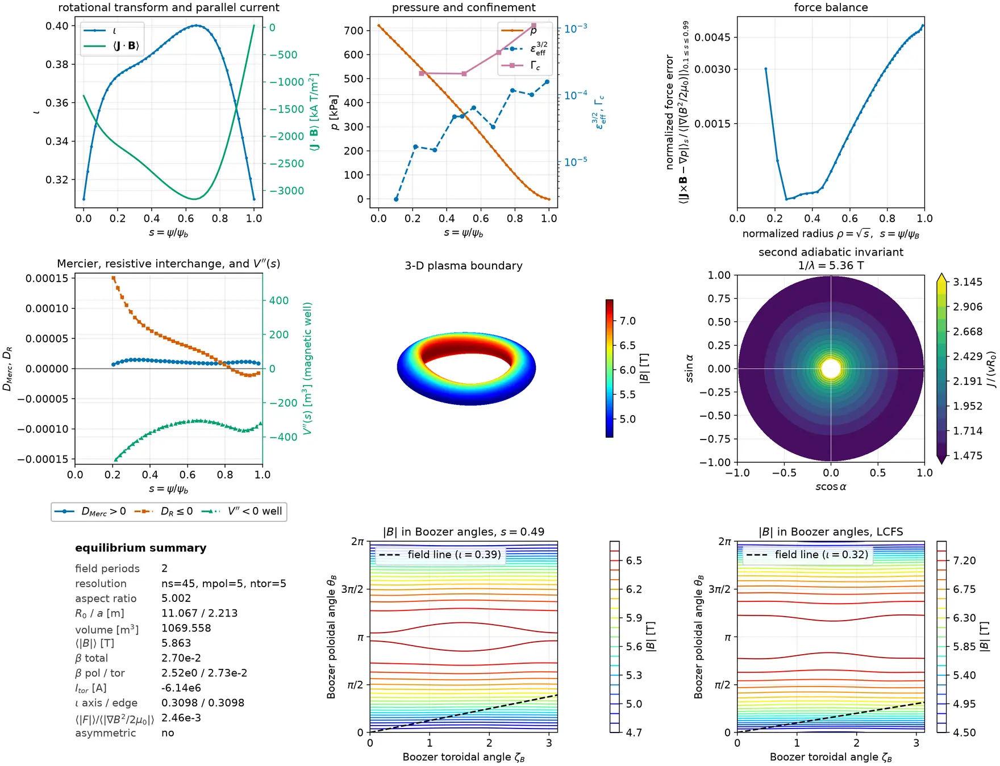
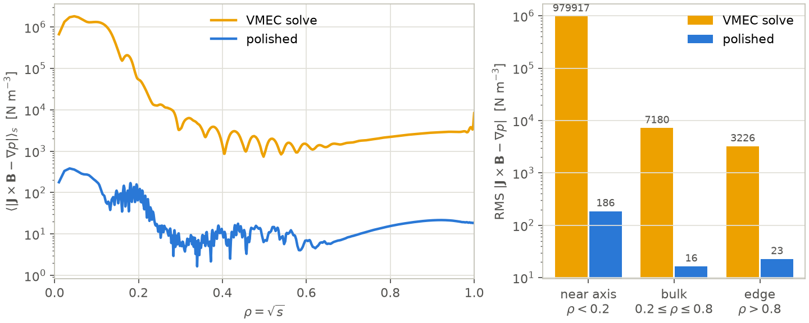

# VMEX

[](https://pypi.org/project/vmex/)
[](pyproject.toml)
[](LICENSE)
[](https://github.com/uwplasma/vmex/actions/workflows/ci.yml)
[](https://codecov.io/gh/uwplasma/vmex)
[](https://vmex.readthedocs.io/en/latest/)

VMEX is a JAX reimplementation of VMEC2000, the standard code for
three-dimensional ideal-MHD equilibria of stellarators and tokamaks. It reads
VMEC input decks, solves fixed- and free-boundary equilibria (NESTOR vacuum
field driven by an MGRID table or coils), reproduces VMEC2000's iteration
and writes standard `wout_*.nc` files. Because the solver is written in JAX,
VMEX also differentiates the converged equilibrium through the implicit
function theorem, so boundary, profile and coil parameters can be optimized
with derivatives of the discrete equilibrium equations.

The goal is fast, differentiable and VMEC2000-compatible equilibria for
stellarator optimization, including single-stage design, in which the plasma
boundary and the coils are optimized together. VMEX also computes Boozer
transforms, fields and their derivatives, quasisymmetry, quasi-isodynamicity
and stability diagnostics, and has a separate lane for open mirrors.


The [capability reference](https://vmex.readthedocs.io/en/latest/reference/capabilities.html)
defines supported models and validation limits. The toroidal model assumes nested flux surfaces;
mirror and high-order polishing features have narrower validation scopes.

## Install

```console
pip install vmex
vmex --doctor
vmex --test
```

Python 3.11–3.13 is tested, and CPU JAX is included. Extras: `vmex[coils]` (ESSOS), `vmex[freeb]`
(virtual casing), `vmex[neoclassical]` (effective ripple), `vmex[optimizers]` (JAXopt/Optax),
`vmex[turbulence]` (GKX) and `vmex[all]`. See [installation](https://vmex.readthedocs.io/en/latest/installation.html)
for GPUs and dependency versions.

## Solve, plot and restart

With your own VMEC input file:

```console
vmex input.my_case --plot
vmex --plot wout_my_case.nc
vmex --booz wout_my_case.nc
vmex input.nearby --restart wout_my_case.nc
```

`--plot` writes six PNGs beside the input or in `--outdir`: the summary below, flux-surface cross-sections,
`|B|` in VMEC angles, radial profiles, Mercier stability and the 3-D LCFS. The summary adds Boozer `|B|`, a `J` map,
`D_R` and the DESC-normalized force balance (effective ripple needs `vmex[neoclassical]`). The QA and QI panels are
`vmex examples/data/input.nfp2_QA_finite_beta --plot` and `vmex examples/data/input.nfp4_QI_finite_beta --plot`.




VMEX follows the deck's `NS_ARRAY`, `FTOL_ARRAY` and `NITER_ARRAY`. In Python:

```python
import vmex as vj

inp = vj.VmecInput.from_file("input.my_case")
result = vj.solve_multigrid(inp, verbose=True)
print(result.converged, result.fsqr, result.fsqz, result.fsql)
vj.write_wout("wout_my_case.nc", vj.wout_from_result(inp, result))
```

Pass `initial_state=result.state` for a nearby solve, or `restart_from=` for a saved WOUT. The
[restart](https://vmex.readthedocs.io/en/latest/howto/restart-from-previous-run.html) and
[CLI](https://vmex.readthedocs.io/en/latest/reference/cli.html) guides cover resolution changes,
devices, profiles and output controls.

`vmex equilibrium.h5` reads DESC text inputs and HDF5/pickle outputs without installing DESC, using the final stage or equilibrium; it writes `input.equilibrium` and solves it to write `wout_equilibrium.nc`.
`--desc-tol 0` retains all boundary modes. The default 1% boundary tolerance does not guarantee magnetic-field accuracy. WOUT iota has the opposite sign to DESC.

## Differentiate and optimize

Compute a boundary/profile derivative without differentiating through every forward iteration:

```python
import jax
from vmex.core import implicit

params = implicit.params_from_input(inp)
gradient = jax.grad(lambda p: implicit.run(inp, p).aspect)(params)
```

For a simple boundary optimization, supply objectives and let SciPy choose the
steps. Each tuple is `(function, target, cost_weight)`:

```python
from scipy.optimize import least_squares
from vmex import optimize as opt

problem = opt.VmecProblem.from_tuples(
    inp, [(opt.aspect_ratio, 4.0, 1.0)], max_mode=1, use_ess=True)
fit = least_squares(
    problem.residual, problem.x0, jac=problem.residual_jac,
    x_scale=problem.scales, max_nfev=20)
problem.input_from_x(fit.x).to_indata("input.optimized")
equilibrium = problem.equilibrium_from_x(fit.x)
vj.write_wout("wout_optimized.nc", equilibrium.wout)
```

`problem.value_and_grad` supplies scalar objectives to BFGS/L-BFGS-B, `problem.jax_value_and_grad`
to JAX optimizers, and `problem.evaluate(x)` reports solve effort and derivative status. The
[gradient tutorial](https://vmex.readthedocs.io/en/latest/tutorials/first-gradient.html) and
[optimization guide](https://vmex.readthedocs.io/en/latest/howto/optimize-a-boundary.html) cover
convergence checks, constraints, scaling and finite-difference verification.

## How VMEX works

1. **Energy principle.** VMEX finds a stationary point of `W = ∫ (B²/2μ₀ + p/(γ−1)) dV` over
   nested flux surfaces, where `J × B = ∇p`. As in VMEC, the unknowns are the surface shapes `R`, `Z`
   and the angle function `λ`: Fourier series in both angles, finite differences in radius.
2. **Spectral force iteration.** Each iteration evaluates the Fourier-projected forces and takes a
   damped second-order Richardson step with VMEC2000's time-step control and restarts, in its
   order. A radial tridiagonal preconditioner per Fourier mode makes the step effective (a 2-D block
   preconditioner is opt-in), and `NS_ARRAY` runs a coarse-to-fine radial multigrid ladder. The
   solve has converged when `FSQR`, `FSQZ` and `FSQL` fall below `FTOL`.
3. **Free boundary.** NESTOR solves the exterior Neumann problem for the vacuum potential with
   Merkel's Green's-function method, driven by an MGRID table or a coil field; pressure balance
   across the boundary moves the plasma surface.
4. **Implicit derivatives.** At a root `F(x, p) = 0` of the force residual, `dx/dp = −(∂F/∂x)⁻¹ ∂F/∂p`.
   A scalar objective needs one adjoint linear solve for all parameters, and least-squares
   Jacobians factor the block-tridiagonal radial operator once. The forward iterations are not
   recorded, so memory does not grow with their number. The derivative assumes that the state is a
   root (on a fixed boundary VMEX first Newton-refines it to `refine_tol = 1e-10`), that `∂F/∂x` is
   invertible there, and that perturbed solves stay on the same branch. It is the derivative of the
   discrete equations, not of the continuum problem.
5. **Virtual casing.** `VmecExtender` adds the plasma currents' field, a surface integral over
   the boundary field, to the coil field outside the plasma; its error grows near the surface.

The [explanation pages](https://vmex.readthedocs.io/en/latest/explanation/index.html) derive each step.

## Results

- **VMEC2000 parity.** CI solves six decks against stored VMEC2000 output and requires `wb` within
  `1e-7` relative, `iota` and `R`, `Z` harmonics on three surfaces within `1e-5`, and iteration
  counts within ±25%. On six decks never run before (ITER, W7-X, HSX, ARIES-CS, ESTELL,
  Nührenberg–Zille), the worst relative difference from VMEC2000 was `2.5e-10`, and the iteration
  counts were identical on five and one apart on the sixth
  ([record](benchmarks/fresh_decks_vs_vmec2000_2026-09-02.md), VMEX 0.8.1).
- **Speed.** On those decks (Apple M4 CPU, one run each) VMEX took 0.50–1.34 times the VMEC2000
  wall time with a warm compilation cache and 0.60–3.13 times with it cleared; the difference is
  mostly XLA compilation, which a repeated solve in one process skips. In the older
  [ns = 201 table](https://vmex.readthedocs.io/en/latest/reference/performance.html) (VMEX 0.3.0)
  VMEC++ was faster than VMEX on the largest 3-D decks it completed. On two RTX A4000 GPUs no
  shipped deck or problem size ran faster than on the CPU.
- **Derivatives.** CI compares adjoint gradients with central finite differences: four Solov'ev
  gradients to `1e-6` relative and a 3-D `li383` boundary gradient to `2e-4`. One warm
  value-plus-Jacobian evaluation of a 48-parameter QA problem took 16.6 s on an Apple M4
  ([record](benchmarks/qa_optimization_startup_least_squares_m4.json), VMEX 0.7.0).
- **Not validated.** Free-boundary derivatives are experimental (CPU by default), 3-D force-balance
  polishing has not certified, and mirror beta above 10% is extended validation. The
  [validation record](docs/explanation/validation.md) lists every gate, tolerance and record.


The NFP=4 QH deck at ns = 51 in all three codes, from a trace recorded in July 2026
(`python benchmarks/make_readme_figures.py --only convergence`).

## What you can build

Every figure below is regenerated by the script named beside it, from decks in this repository.

### Quasisymmetric and quasi-isodynamic boundaries


Boundary optimization for quasi-axisymmetry, quasi-helical symmetry and quasi-poloidal symmetry, each at its own
field-period count, from `examples/optimization/QA_optimization.py` and its QH and QP siblings.
`python examples/plot_optimized_families.py` draws the panel.


Quasi-isodynamic designs at four field-period counts: the `|B|` contours close poloidally as `nfp`
rises. The QI scripts in `examples/optimization/` cover vacuum, finite-beta, bootstrap-consistent and
maximum-`J` variants, with scalar-adjoint, SciPy, JAXopt and Optax drivers.

### Free boundary with coils


NESTOR free boundary driven by ESSOS coils (or an MGRID table), ramping beta and tracking the
Shafranov shift: `python examples/free_boundary_essos_coils.py`. The exterior field is described
[below](#fields-coils-and-free-boundary).

### Single-stage plasma and coil design

`examples/optimization/single_stage_optimization.py` adjusts the plasma boundary and the coils
against one weighted objective, solving the equilibrium implicitly at every step;
`single_stage_free_boundary_optimization.py` couples them through a true free-boundary solve. Both
print final plasma and coil metrics; `single_stage_optimization.py` also states whether it met its
rotational-transform and normal-field targets. A lower penalty with unmet targets is not a design. The free-boundary gradient is exact at the root of the coupled residual, but the
free-boundary state is not yet Newton-refined onto it. A zero-beta free boundary also needs a nested
coil-field surface enclosing PHIEDGE; at an island chain VMEX, VMEC2000 and VMEC++ all fail to
converge ([not validated](docs/explanation/validation.md#what-is-not-validated)).

### Open mirrors and stellarator-mirror hybrids


Fixed-boundary open mirrors (`examples/mirror/mirror_fixed_boundary_nonaxisymmetric.py`), a
free-boundary mirror beta scan over the validated 0 to 10 percent range
(`mirror_free_boundary_beta_scan.py`) and periodic stellarator-mirror hybrids
(`stellarator_mirror_hybrid.py`, above, and the quasi-isodynamic
`qi_mirror_hybrid_fourier_vs_bspline.py`). Hybrids and anisotropy are research scopes: see the
[mirror guide](https://vmex.readthedocs.io/en/latest/howto/mirror-machines.html) for what is validated.

### Running the examples

From a clone (`git clone https://github.com/uwplasma/vmex && pip install -e vmex`), run
`vmex examples/data/input.circular_tokamak --plot` or `python examples/take_gradients.py`:

| Application | Runnable starting point |
|---|---|
| Tokamak or stellarator equilibrium | `vmex examples/data/input.circular_tokamak --plot`; other decks in [examples/data](examples/data/) |
| QA, QH, QP or QI boundary design | [examples/optimization](examples/optimization/), including bootstrap, ballooning, Mercier and maximum-`J` variants |
| Asymmetric boundary design | [stellarator_asymmetry](examples/optimization/stellarator_asymmetry/) vacuum and finite-beta scripts |
| Single-stage plasma and coils | `single_stage_optimization.py`, `single_stage_free_boundary_optimization.py` |
| Fields and spatial derivatives | `python examples/vmex_get_B_gradB.py` |
| ESSOS coils and a free-boundary beta scan | `python examples/free_boundary_essos_coils.py` |
| Experimental exterior tracing (unqualified topology) | `python examples/vmex_fieldline_tracing_finite_beta.py` |
| Effective ripple | `python examples/epsilon_effective.py` |
| Open mirrors | `mirror/mirror_fixed_boundary_nonaxisymmetric.py`, `mirror/mirror_free_boundary_beta_scan.py` |
| Research force-balance polishing | `python examples/force_balance_polishing.py` |

The optimization scripts expose resolutions, objective weights and iteration budgets near the top.
Inspect those settings before a research run; advanced coil examples need the optional dependencies
and versions in the [ESSOS guide](https://vmex.readthedocs.io/en/latest/howto/use-essos-fields-and-coils.html).

## Fields, coils and free boundary

The live equilibrium exposes Cartesian `B()`, `gradB()`, `gradgradB()` and
`gradgradgradB()`, with corresponding VJPs in the originating problem's degrees
of freedom. Use `set_points_xyz(...)` or `set_points_flux(...)` to select
interior evaluation points.

For an exterior field, `vj.VmecExtender.from_file("wout_my_case.nc",
external_field=coils.B)` combines the plasma's virtual-casing contribution with
the supplied coil field. The plasma part is a quadrature over a source grid on
the plasma surface, sampled by default from the boundary's aspect ratio, field
periods and requested digits. Its error grows rapidly near that surface:
evaluate only where its error estimate meets your target. Targets must also stay away from
coil filaments, and an MGRID field has a finite tabulated domain.

`with_near_surface_continuation` is unqualified for physics: the implementation
records that it does not reproduce direct quadrature. The exterior field-line
example uses that experimental path and does not validate magnetic topology.
See the [exterior-field explanation](https://vmex.readthedocs.io/en/latest/explanation/nestor-vacuum.html)
and [field and coil usage](https://vmex.readthedocs.io/en/latest/howto/use-essos-fields-and-coils.html).

Joint boundary/coil optimization and the boundary-Schur adjoint remain advanced
workflows with substantial solve costs; they require independent derivative and
final-constraint checks. Open mirrors support defined isotropic
fixed/free-boundary cases; the shipped free-boundary 0–10% beta range is the
supported range, while higher beta, anisotropy and periodic hybrids need further
validation. See the [mirror guide](https://vmex.readthedocs.io/en/latest/howto/mirror-machines.html).

## Accuracy and optional polishing

A small VMEC `FSQR/FSQZ/FSQL` means the discrete solve converged; it does not bound the continuous
force error `J × B − ∇p`. Optional spline-based polishing is off by default and remains a research
feature. It certifies on the bundled axisymmetric shaped, finite-pressure tokamak, where the gain
is real but not uniform; an accurate, affordable 3-D polished solve is still an open goal.



`python examples/force_balance_polishing.py` (3 to 5 minutes on one CPU) writes both WOUT files on
the same 129-surface mesh and certifies each with the same independent oracle, so they differ only
in the polish. The near-axis error (`ρ < 0.2`) falls from 2.9e3 to 61 N m⁻³ and the edge error
2.5-fold, but the polished state is slightly worse for `0.6 ≲ ρ ≲ 0.8`, and the volume-averaged
`⟨|F|⟩/⟨|∇(B²/2μ₀)|⟩` falls only from 2.3e-3 to 1.9e-3. The written file keeps the native
certificate (`eps_F` 1.80e-3 native, 1.90e-3 read back). The `--plot` summary's force panel, a
finite-difference rebuild from the WOUT, reads about 5.8e-3 on both files and cannot show this.

From the command line, `vmex examples/data/input.shaped_tokamak_pressure_polished --polish auto`
runs the same polish; `AUTO` checks the estimated Gauss–Newton work against `--polish-budget` (an
admission estimate, not a timeout). `eps_F` is bounded above by 2 by construction and saturates in
vacuum; read the dimensional metrics with it. See the [validation record](docs/explanation/validation.md) for
the failed 3-D attempts and the [polishing reference](https://vmex.readthedocs.io/en/latest/explanation/high-order-force-balance.html)
for the method and certificate.

## Documentation, development and citation

Start with [your first equilibrium](https://vmex.readthedocs.io/en/latest/tutorials/first-equilibrium.html),
then the [API](https://vmex.readthedocs.io/en/latest/reference/api/basic.html),
[VMEC compatibility](https://vmex.readthedocs.io/en/latest/reference/vmec2000-compatibility.html) and
[troubleshooting](https://vmex.readthedocs.io/en/latest/howto/troubleshoot.html) pages. For development,
`pip install -e ".[dev]"` and `python tools/preflight.py --static`. Report issues with the input deck
and `vmex --doctor` output. See [contributing](CONTRIBUTING.md), [citation](CITATION.cff),
[license](LICENSE) and the [plan](plan.md).
