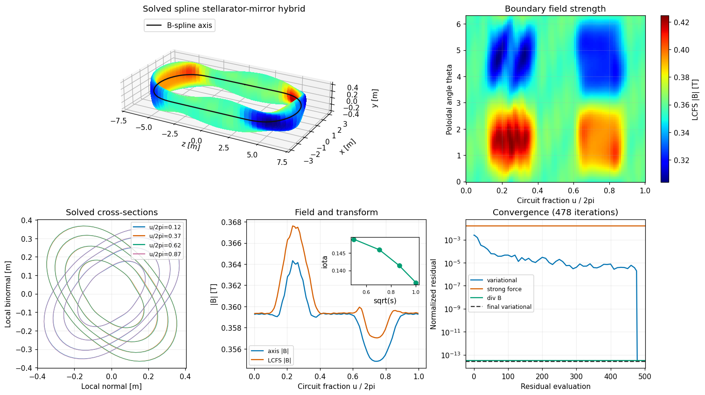

# VMEX

[](https://pypi.org/project/vmex/)
[](pyproject.toml)
[](LICENSE)
[](https://github.com/uwplasma/vmex/actions/workflows/ci.yml)
[](https://codecov.io/gh/uwplasma/vmex)
[](https://vmex.readthedocs.io/en/latest/)

VMEX computes stellarator and tokamak ideal-MHD equilibria in JAX. It reads
VMEC input files, solves fixed- and free-boundary problems, and writes standard
`wout_*.nc` files. Implicit derivatives connect equilibria to boundary, profile,
and coil optimization.

- **Use existing workflows:** VMEC input/output, multigrid continuation and hot restart.
- **Design with gradients:** SciPy or JAX optimizers, scalar adjoints and residual Jacobians.
- **Inspect the physics:** Boozer transforms, magnetic fields and spatial derivatives,
  quasisymmetry, quasi-isodynamicity and stability diagnostics.
- **Choose the hardware:** CPU or GPU execution, reusable compilation and independent-case ensembles.
- **Connect coils:** ESSOS fields, NESTOR free boundary and finite-beta exterior fields.


The [capability reference](https://vmex.readthedocs.io/en/latest/reference/capabilities.html)
defines supported models and validation limits. VMEX's toroidal equilibrium
model assumes nested flux surfaces; mirror and high-order polishing features
have narrower validation scopes.

## Install

```console
pip install vmex
vmex --doctor
vmex --test
```

Python 3.10–3.12 is tested. CPU JAX is included; for GPUs follow the
[JAX installation guide](https://docs.jax.dev/en/latest/installation.html) and
[VMEX GPU guide](https://vmex.readthedocs.io/en/latest/howto/run-on-gpu.html).
Optional extras include `vmex[coils]` (ESSOS), `vmex[freeb]` (virtual casing),
`vmex[neoclassical]` (effective ripple), and `vmex[optimizers]` (JAXopt/Optax).
See [installation](https://vmex.readthedocs.io/en/latest/installation.html) for dependencies.

## Solve, plot and restart

With your own VMEC input file:

```console
vmex input.my_case --plot
vmex --plot wout_my_case.nc
vmex --booz wout_my_case.nc
vmex input.nearby --restart wout_my_case.nc
```

VMEX follows the deck's `NS_ARRAY`, `FTOL_ARRAY` and `NITER_ARRAY`.
In Python:

```python
import vmex as vj

inp = vj.VmecInput.from_file("input.my_case")
result = vj.solve_multigrid(inp, verbose=True)
print(result.converged, result.fsqr, result.fsqz, result.fsql)
wout = vj.wout_from_state(
    inp=inp, state=result.state, fsqr=result.fsqr, fsqz=result.fsqz,
    fsql=result.fsql, niter=result.iterations, converged=result.converged)
vj.write_wout("wout_my_case.nc", wout)
```

Pass `initial_state=result.state` for a nearby Python solve, or `restart_from=`
for a saved WOUT. [Restart](https://vmex.readthedocs.io/en/latest/howto/restart-from-previous-run.html)
and [CLI](https://vmex.readthedocs.io/en/latest/reference/cli.html) guides cover
resolution changes, devices, profiles and output controls.

```console
pip install 'vmex[desc]'
vmex equilibrium.h5  # writes input.equilibrium and solves it to write wout_equilibrium.nc
vmex input.equilibrium  # reproduce the WOUT without DESC
```

Native DESC text decks use their final continuation stage; HDF5/pickle outputs use the final `Equilibrium` in an `EquilibriaFamily` or a single equilibrium.
`--outdir DIR` places both files in DIR. Output extensions are stripped from names; native text deck names are preserved.
DESC's exporter transfers boundary, pressure, current/iota, flux, field periods and asymmetry to a standard fixed-boundary VMEC input.
Non-polynomial profiles are sampled at 101 radial points, with enclosed current transferred directly. WOUT iota has the opposite sign to DESC's right-handed convention.
Conversion chooses the smallest rectangular boundary spectrum with a conservative 1% bound on discarded position and angular derivatives relative to their nonconstant RMS Fourier amplitudes.
This bounds boundary truncation, not magnetic-field error. `--desc-tol 0` retains all nonzero boundary modes.
Generated inputs use 17/33/65 radial surfaces; edit the input for stricter resolution studies.

## Differentiate and optimize

Compute a boundary/profile derivative without differentiating through every
forward iteration:

```python
import jax
from vmex.core import implicit

params = implicit.params_from_input(inp)
gradient = jax.grad(lambda p: implicit.run(inp, p).aspect)(params)
```

For a simple boundary optimization, supply objectives and let SciPy choose the
steps. Each tuple is `(function, target, cost_weight)`:

```python
from scipy.optimize import least_squares
from vmex import optimize as opt

problem = opt.VmecProblem.from_tuples(
    inp, [(opt.aspect_ratio, 4.0, 1.0)], max_mode=1, use_ess=True)
fit = least_squares(
    problem.residual, problem.x0, jac=problem.residual_jac,
    x_scale=problem.scales, max_nfev=20)
problem.input_from_x(fit.x).to_indata("input.optimized")
equilibrium = problem.equilibrium_from_x(fit.x)
vj.write_wout("wout_optimized.nc", equilibrium.wout)
```

`problem.value_and_grad` supplies scalar objectives to BFGS/L-BFGS-B;
`problem.jax_value_and_grad` supports JAX optimizers. `problem.evaluate(x)`
reports solve effort and derivative status. Implicit derivatives describe the
chosen discrete equilibrium equations: small linear residuals alone do not
establish continuum accuracy. See the
[gradient tutorial](https://vmex.readthedocs.io/en/latest/tutorials/first-gradient.html)
and [optimization guide](https://vmex.readthedocs.io/en/latest/howto/optimize-a-boundary.html)
for convergence checks, constraints, scaling and finite-difference verification.

## What you can build

Every figure below is regenerated by the script named beside it, from decks in
this repository.

### Quasisymmetric and quasi-isodynamic boundaries


Boundary optimization for quasi-axisymmetry, quasi-helical symmetry and
quasi-poloidal symmetry, each at its own field-period count, from
`examples/optimization/QA_optimization.py` and its QH and QP siblings.
`python examples/plot_optimized_families.py` draws the panel.


Quasi-isodynamic designs across four field-period counts, showing how the
`|B|` contours close poloidally as `nfp` rises. The QI scripts in
`examples/optimization/` cover vacuum, finite beta, bootstrap-consistent and
maximum-`J` continuation variants, and the same families have scalar-adjoint,
SciPy, JAXopt and Optax drivers.

### Free boundary with coils


NESTOR free boundary driven by ESSOS coils, ramping beta and tracking the
Shafranov shift: `python examples/free_boundary_essos_coils.py`. Free-boundary
runs also accept an MGRID table, and `VmecExtender` evaluates the exterior
field including the plasma's own virtual-casing contribution.

### Single-stage plasma and coil design

`examples/optimization/single_stage_optimization.py` optimizes the plasma
boundary and the coils against one objective, with the equilibrium solved
implicitly at every step; `single_stage_free_boundary_optimization.py` does the
same through a true free-boundary solve. Both report coil length, curvature,
separation and normal-field error beside the plasma metrics, because a lower
weighted penalty with infeasible coils is not a design.

### Open mirrors and stellarator-mirror hybrids


Fixed-boundary open mirrors, from
`examples/mirror/mirror_fixed_boundary_nonaxisymmetric.py`.


The free-boundary mirror beta scan,
`examples/mirror/mirror_free_boundary_beta_scan.py`, over the validated 0 to 10
percent beta range.



Periodic stellarator-mirror hybrids,
`examples/mirror/stellarator_mirror_hybrid.py`, with a quasi-isodynamic variant
in `qi_mirror_hybrid_fourier_vs_bspline.py`. Hybrids and anisotropy are
research scopes: see the
[mirror guide](https://vmex.readthedocs.io/en/latest/howto/mirror-machines.html)
for what is validated.

### Agreement with VMEC2000 and VMEC++


The same deck through all three codes, `python benchmarks/make_readme_figures.py
--only convergence`. Cross-code agreement, its norms and its limits are in the
[validation record](docs/explanation/validation.md).

### Running the examples

```console
git clone https://github.com/uwplasma/vmex
cd vmex
pip install -e .
vmex examples/data/input.circular_tokamak --plot
python examples/take_gradients.py
```

| Application | Runnable starting point |
|---|---|
| Tokamak or stellarator equilibrium | `vmex examples/data/input.circular_tokamak --plot`; other decks in [examples/data](examples/data/) |
| QA, QH, QP or QI boundary design | [examples/optimization](examples/optimization/), including bootstrap, ballooning, Mercier and maximum-`J` variants |
| Asymmetric boundary design | [stellarator_asymmetry](examples/optimization/stellarator_asymmetry/) vacuum and finite-beta scripts |
| Single-stage plasma and coils | `single_stage_optimization.py`, `single_stage_free_boundary_optimization.py` |
| Fields and spatial derivatives | `python examples/vmex_get_B_gradB.py` |
| ESSOS coils and a free-boundary beta scan | `python examples/free_boundary_essos_coils.py` |
| Finite-beta exterior field lines | `python examples/vmex_fieldline_tracing_finite_beta.py` |
| Effective ripple | `python examples/epsilon_effective.py` |
| Open mirrors | `mirror/mirror_fixed_boundary_nonaxisymmetric.py`, `mirror/mirror_free_boundary_beta_scan.py` |
| Research force-balance polishing | `python examples/force_balance_polishing.py` |

The optimization scripts expose resolutions, objective weights and iteration
budgets near the top. Inspect those settings before a research run; advanced
coil examples need the optional dependencies and versions in the
[ESSOS guide](https://vmex.readthedocs.io/en/latest/howto/use-essos-fields-and-coils.html).

## Fields, coils and free boundary

The live equilibrium exposes Cartesian `B()`, `gradB()`, `gradgradB()` and
`gradgradgradB()`, with corresponding VJPs in the originating problem's degrees
of freedom. Use `set_points_xyz(...)` or `set_points_flux(...)` to select
interior evaluation points.

For an exterior field, `vj.VmecExtender.from_file("wout_my_case.nc",
external_field=coils.B)` combines the plasma's virtual-casing contribution with
the supplied coil field. Its points must be outside the plasma and away from
source surfaces/currents; an MGRID field also has a finite tabulated domain.
See [field and coil usage](https://vmex.readthedocs.io/en/latest/howto/use-essos-fields-and-coils.html).


Joint boundary/coil optimization and the boundary-Schur adjoint remain advanced
workflows with substantial solve costs. Open mirrors support defined isotropic
fixed/free-boundary cases; the shipped free-boundary 0–10% beta range is the
supported range, while higher beta, anisotropy and periodic hybrids need further
validation. See the [mirror guide](https://vmex.readthedocs.io/en/latest/howto/mirror-machines.html).

## Accuracy and optional polishing

A small VMEC `FSQR/FSQZ/FSQL` means the discrete solve converged. It does not
by itself bound the continuous force error `J × B − ∇p`. Optional spline-based
polishing is disabled by default and remains a research feature: recorded
certified cases are axisymmetric; a generally accurate, affordable 3-D polished
solve is still an open goal.

```console
vmex examples/data/input.shaped_tokamak_pressure_polished --polish auto --plot
```

`AUTO` estimates the Gauss–Newton work against `--polish-budget`; this is an
admission estimate, not an enforced end-to-end timeout. Inspect
`result.polish_report` when using Python. The legacy pointwise `eps_F` metric
is bounded above by 2 by construction and can saturate in vacuum; read the
dimensional and volume-normalized metrics with it.

The [validation record](docs/explanation/validation.md) explains the measured
near-axis improvement, failed 3-D attempts, native DESC comparison and export
errors. The [polishing reference](https://vmex.readthedocs.io/en/latest/explanation/high-order-force-balance.html)
defines the method and certificate. Exported-and-refitted WOUT comparisons
measure reconstruction error as well as solver error.

## Performance and parallel execution

JAX compilation is reused for matching array structures. Measure first-call,
cache-reload and warm costs separately, including refinement and gradients for
optimization. CPU/GPU performance depends on resolution and workload; see
[benchmark evidence](https://vmex.readthedocs.io/en/latest/explanation/validation.html)
and [profiling tools](benchmarks/).

`vj.parallel.solve_ensemble(inputs, workers=None)` distributes independent
cases; `workers=1` provides a serial baseline. Set worker and device budgets
using the [ensemble guide](https://vmex.readthedocs.io/en/latest/howto/parallel-ensembles.html).
Multi-device kernel/AD tests do not yet establish a scalable distributed
nonlinear equilibrium solve.

## Documentation, development and citation

Start with [your first equilibrium](https://vmex.readthedocs.io/en/latest/tutorials/first-equilibrium.html),
then [your first optimization](https://vmex.readthedocs.io/en/latest/tutorials/first-optimization.html).
The [API](https://vmex.readthedocs.io/en/latest/reference/api/basic.html),
[VMEC compatibility](https://vmex.readthedocs.io/en/latest/reference/vmec2000-compatibility.html)
and [troubleshooting](https://vmex.readthedocs.io/en/latest/howto/troubleshoot.html)
pages cover research use.

For development, install `pip install -e ".[dev]"` and run
`python tools/preflight.py --static`; the [test manifest](tests/manifest.json)
defines numerical suites. Report issues with the input deck and `vmex --doctor`
output. See [contributing](CONTRIBUTING.md), [citation metadata](CITATION.cff),
[license](LICENSE) and the [plan/logbook](plan.md). A new release will follow
integration and validation of the agreed priorities.
