# VMEX

[](https://pypi.org/project/vmex/)
[](pyproject.toml)
[](LICENSE)
[](https://github.com/uwplasma/vmex/actions/workflows/ci.yml)
[](https://codecov.io/gh/uwplasma/vmex)
[](https://vmex.readthedocs.io/en/latest/)

VMEX solves VMEC2000-compatible fixed- and free-boundary ideal-MHD equilibria in JAX,
reads VMEC inputs and writes standard `wout_*.nc` files. Implicit derivatives
support boundary, profile and coil optimization; Boozer transforms, fields,
stability diagnostics and open-mirror models support the wider workflow.

- **Use existing workflows:** VMEC input decks and `wout_*.nc` output, `NS_ARRAY` multigrid
  continuation, hot restart from a saved WOUT, and DESC inputs and outputs read without DESC.
- **Design with gradients:** implicit scalar adjoints and residual Jacobians for SciPy, JAXopt or
  Optax, with quasisymmetry, quasi-isodynamic, Mercier, ballooning, bootstrap and maximum-`J` objectives.
- **Inspect the physics:** Boozer transforms, the magnetic field and its first three spatial
  derivatives, effective ripple, the `--plot` diagnostic summary, `--scale` to reactor size and
  `--trace` alpha-particle losses.
- **Choose the hardware:** CPU or GPU equilibrium solves (optimization gradients default to CPU),
  reusable compilation and independent-case ensembles.
- **Connect coils:** ESSOS coil fields, NESTOR free boundary from an MGRID table or coils, and the
  virtual-casing exterior field of a finite-beta plasma.


The [capability reference](https://vmex.readthedocs.io/en/latest/reference/capabilities.html)
defines supported models and validation limits. The toroidal model assumes nested flux surfaces;
mirror and high-order polishing features have narrower validation scopes.

## Installation

```console
pip install vmex
vmex --doctor
vmex --test
```

The core install solves, plots, restarts and optimizes with SciPy. `vmex --doctor`
reports dependencies and devices; `vmex --test` solves a bundled QH case.

Python 3.11, 3.12 and 3.13 are tested. JAX 0.11 needs Python 3.12 or newer, so a 3.11 environment
resolves an older JAX; 3.12 or newer is recommended.

### Optional packages for the full capabilities

Install every optional feature with

```console
pip install "vmex[all]"
```

or pick what you need:

| Install | Adds | Enables |
|---|---|---|
| `pip install "vmex[coils]"` | `essos>=0.19.2` | ESSOS coil fields, `vmex --coils` free boundary, single-stage plasma and coil optimization, field-line and alpha-particle tracing |
| `pip install "vmex[freeb]"` | `virtual-casing-jax>=0.0.9` | the virtual-casing exterior field of the plasma (`VmecExtender`) |
| `pip install "vmex[neoclassical]"` | `neo-jax>=1.0.2` | effective ripple `ε_eff` from a WOUT or Boozer spectrum (`vmex.epsilon_effective_from_wout`) and the `--plot` ripple panel |
| `pip install "vmex[turbulence]"` | `gkx>=2.4.2` (with `jax>=0.10.1`) | gyrokinetic turbulence-proxy objectives (`vmex.core.turbulence`) |
| `pip install "vmex[optimizers]"` | `jaxopt`, `optax` | the JAXopt and Optax optimization drivers |
| `pip install "vmex[all]"` | all of the above | every example and documented workflow |

Core dependencies include `solvax>=0.27.0` and `booz_xform_jax>=0.4.1`.
Keep DESC versions that require `jax<0.10` in a separate environment from
`vmex[turbulence]` or `vmex[all]`, which require `jax>=0.10.1`.
NESTOR free boundary from an MGRID table needs no extra.

### GPU, conda-forge and source installs

Install accelerator support through the [JAX guide](https://docs.jax.dev/en/latest/installation.html)
and select a device using the [VMEX GPU guide](https://vmex.readthedocs.io/en/latest/howto/run-on-gpu.html).
`conda install --channel conda-forge vmex` installs the core package. For development:

```console
git clone https://github.com/uwplasma/vmex
cd vmex
pip install -e ".[all,dev]"
```

The [installation guide](https://vmex.readthedocs.io/en/latest/installation.html) covers float64,
WSL2 and dependency details.

## Solve, plot and restart

With your own VMEC input file:

```console
vmex input.my_case --plot
vmex --plot wout_my_case.nc
vmex --booz wout_my_case.nc
vmex --scale wout_my_case.nc
vmex --trace wout_my_case.nc
vmex input.nearby --restart wout_my_case.nc
vmex wout_my_case.nc --to-input    # writes input.my_case
```

`--scale` writes `*_scaled` at ARIES-CS size (a = 1.7044 m, ⟨B⟩ = 5.8646 T); two factors `B R` scale
by hand. `--trace` (needs `vmex[coils]`) scales the same way in memory and traces 500 fusion alphas for
10 ms in Boozer coordinates (under a minute on 10 CPU cores, faster than a GPU at this size). It writes the loss fraction and a figure set:
loss against time, loss maps on the boundary, and pitch and loss-time distributions. Production runs set
`--trace-particles N` and `--trace-tmax T`; cost grows as `N x T`. `--trace-birth volume` samples the D-T
birth profile, and `--collisional` adds slowing down and pitch-angle scattering
([guide](docs/howto/trace-alpha-particles.md)).

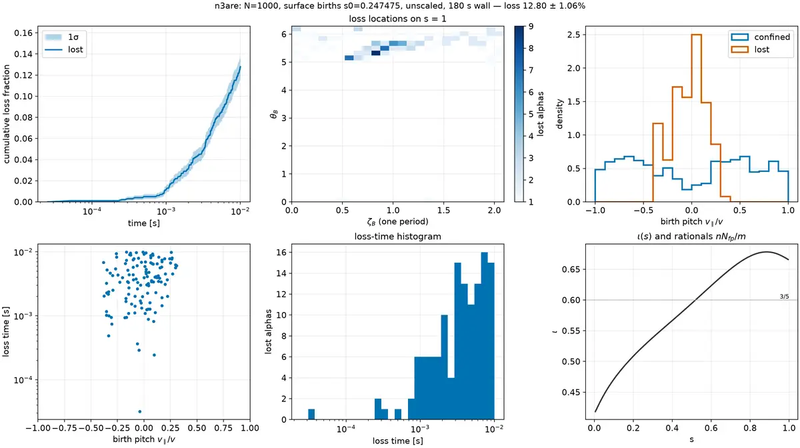

**`--trace` against SIMPLE and SIMSOPT.** The same 1000 ARIES-CS alphas (positions, pitches, energy) were traced for 10 ms by each code on the same 8 CPU
cores. Runtimes exclude compilation and field set-up ([benchmark](benchmarks/trace_cross_code.py),
[details](docs/howto/trace-alpha-particles.md#against-simple-and-simsopt)). The loss fractions agree within 0.6σ.

| code | loss fraction | runtime |
|---|---|---|
| VMEX `--trace` | 12.8 % ± 1.1 % | 146 s |
| [SIMPLE](https://github.com/itpplasma/SIMPLE) | 12.4 % ± 1.0 % | 556 s |
| SIMSOPT | 11.9 % ± 1.0 % | 1079 s |


`--plot` writes five PNGs beside the input or in `--outdir`: the summary below, flux-surface cross-sections,
`|B|` in VMEC angles, Mercier stability and the 3-D LCFS. The summary adds Boozer `|B|`, a `J` map,
`D_R` and the DESC-normalized force balance (effective ripple needs `vmex[neoclassical]`). The QA and QI panels are
`vmex examples/data/input.nfp2_QA_finite_beta --plot` and `vmex examples/data/input.nfp4_QI_finite_beta --plot`.

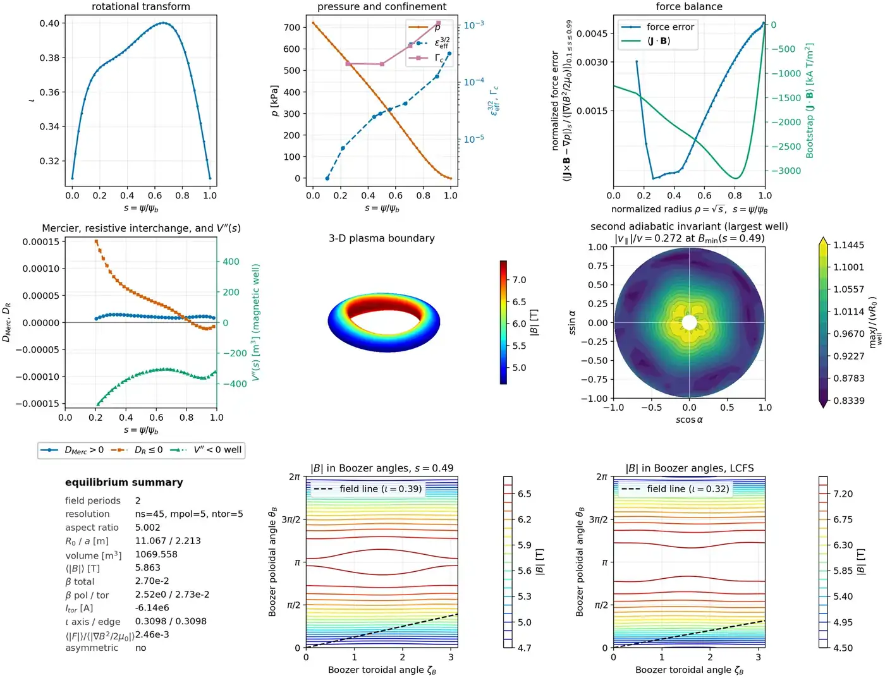


VMEX follows the deck's `NS_ARRAY`, `FTOL_ARRAY` and `NITER_ARRAY`. In Python:

```python
import vmex as vj

inp = vj.VmecInput.from_file("input.my_case")
result = vj.solve_multigrid(inp, verbose=True)
print(result.converged, result.fsqr, result.fsqz, result.fsql)
vj.write_wout("wout_my_case.nc", vj.wout_from_result(inp, result))
```

Pass `initial_state=result.state` for a nearby solve, or `restart_from=` for a saved WOUT. The
[restart](https://vmex.readthedocs.io/en/latest/howto/restart-from-previous-run.html) and
[CLI](https://vmex.readthedocs.io/en/latest/reference/cli.html) guides cover resolution changes,
devices, profiles and output controls.

To reconstruct a standalone deck in Python, use
`vj.VmecInput.from_wout("wout_my_case.nc").to_indata("input.my_case")`.
The WOUT supplies the final boundary, flux and profiles. VMEX infers `NCURR`
from the profile echo; the original multigrid ladder cannot be recovered.
For a free-boundary case, the referenced MGRID file is also needed.
If `input.my_case` exists, the CLI writes `input.my_case_from_wout` instead.

`vmex equilibrium.h5` reads DESC text inputs and HDF5/pickle outputs without installing DESC, using the final stage or equilibrium; it writes `input.equilibrium` and solves it to write `wout_equilibrium.nc`.
`--desc-tol 0` retains all boundary modes. The default 1% boundary tolerance does not guarantee magnetic-field accuracy. WOUT iota has the opposite sign to DESC.

## Differentiate and optimize

Compute a boundary/profile derivative without differentiating through every forward iteration:

```python
import jax
from vmex.core import implicit

params = implicit.params_from_input(inp)
gradient = jax.grad(lambda p: implicit.run(inp, p).aspect)(params)
```

For a simple boundary optimization, supply objectives and let SciPy choose the
steps. Each tuple is `(function, target, cost_weight)`:

```python
from scipy.optimize import least_squares
from vmex import optimize as opt

problem = opt.VmecProblem.from_tuples(
    inp, [(opt.aspect_ratio, 4.0, 1.0)], max_mode=1, use_ess=True)
fit = least_squares(
    problem.residual, problem.x0, jac=problem.residual_jac,
    x_scale=problem.scales, max_nfev=20)
problem.input_from_x(fit.x).to_indata("input.optimized")
equilibrium = problem.equilibrium_from_x(fit.x)
vj.write_wout("wout_optimized.nc", equilibrium.wout)
```

`problem.value_and_grad` supplies scalar objectives to BFGS/L-BFGS-B, `problem.jax_value_and_grad`
to JAX optimizers, and `problem.evaluate(x)` reports solve effort and derivative status. The
[gradient tutorial](https://vmex.readthedocs.io/en/latest/tutorials/first-gradient.html) and
[optimization guide](https://vmex.readthedocs.io/en/latest/howto/optimize-a-boundary.html) cover
convergence checks, constraints, scaling and finite-difference verification.

## How VMEX works

VMEX finds a stationary point of MHD energy on nested flux surfaces and differentiates the converged
discrete force equations. The [explanation pages](https://vmex.readthedocs.io/en/latest/explanation/index.html)
give the derivations and assumptions.

| Step | Method |
|---|---|
| Equilibrium | Fourier modes in both angles, radial finite differences, VMEC2000-style force iteration and `NS_ARRAY` continuation |
| Free boundary | NESTOR vacuum solve driven by an MGRID table or coils; pressure balance moves the boundary |
| Gradients | Implicit adjoints at a converged root; one linear solve gives a scalar gradient over all parameters |
| Exterior field | `VmecExtender` adds the plasma's virtual-casing field to the coil field |

## VMEX Highlights

| Result | Measured scope |
|---|---|
| VMEC2000 parity | Six CI decks test energy within `1e-7` and selected harmonics within `1e-5`; six [fresh decks](benchmarks/fresh_decks_vs_vmec2000_2026-09-02.md) reached `2.5e-10` worst measured relative difference. |
| Solve time | On those fresh decks, warm-cache VMEX/VMEC2000 wall-time ratios were 0.50–1.34 on an Apple M4 CPU; [cold and larger-case results](https://vmex.readthedocs.io/en/latest/reference/performance.html) differ. |
| Derivatives | CI agrees with central differences to `1e-6` on Solov'ev cases and `2e-4` on a 3-D boundary gradient; a [48-parameter QA evaluation](benchmarks/qa_optimization_startup_least_squares_m4.json) took 16.6 s warm. |

The [validation record](docs/explanation/validation.md) lists test limits and benchmark inputs.

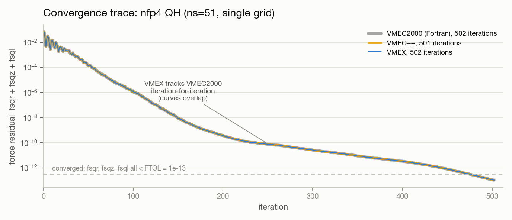

The NFP=4 QH deck at ns = 51 in all three codes, from a trace recorded in July 2026
(`python benchmarks/make_readme_figures.py --only convergence`).

## Stellarator optimization

Every figure below is regenerated by the script named beside it, from decks in this repository.

### Quasisymmetric and quasi-isodynamic boundaries

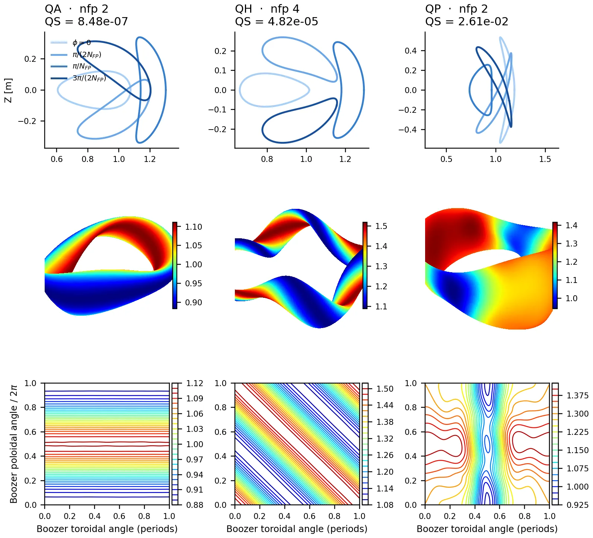

Boundary optimization for quasi-axisymmetry, quasi-helical symmetry and quasi-poloidal symmetry, each at its own
field-period count, from `examples/optimization/QA_optimization.py` and its QH and QP siblings.
`python examples/plot_optimized_families.py` draws the panel.

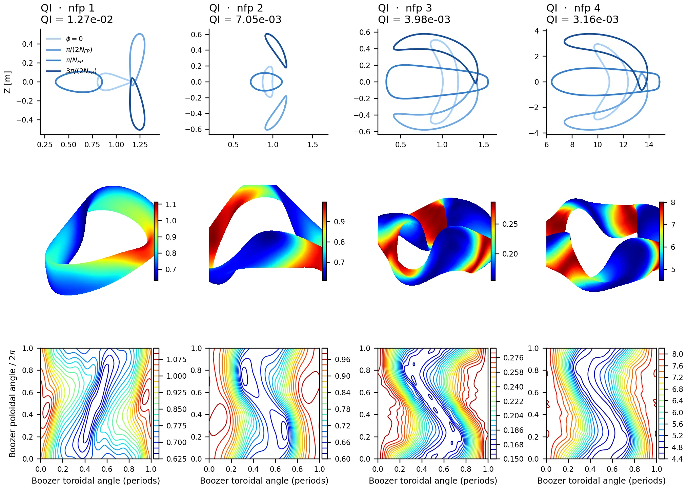

Quasi-isodynamic designs at four field-period counts: the `|B|` contours close poloidally as `nfp`
rises. The QI scripts in `examples/optimization/` cover vacuum, finite-beta, bootstrap-consistent and
maximum-`J` variants, with scalar-adjoint, SciPy, JAXopt and Optax drivers.

### Free boundary with coils

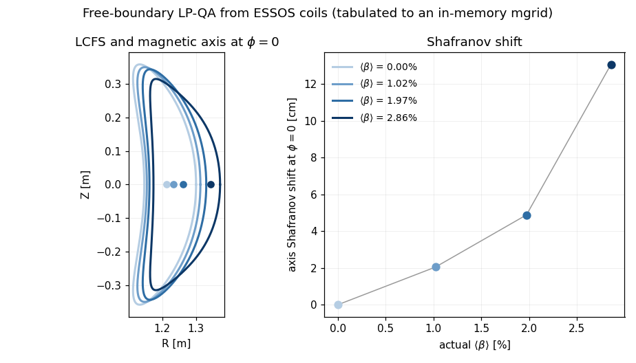

NESTOR free boundary driven by ESSOS coils (or an MGRID table), ramping beta and tracking the
Shafranov shift: `python examples/free_boundary_essos_coils.py`. The exterior field is described
[below](#fields-coils-and-free-boundary).

### Single-stage plasma and coil design

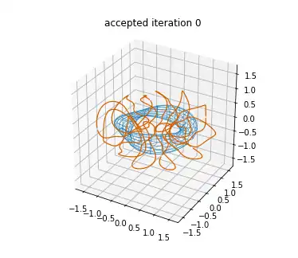
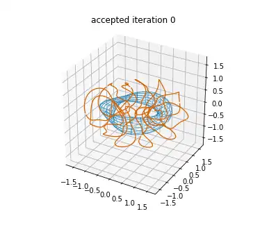

Accepted iterates of `single_stage_optimization.py` (left, fixed boundary in vacuum) and
`single_stage_free_boundary_optimization_finite_beta.py` (right, free boundary at 0.5% beta).

`examples/optimization/single_stage_optimization.py` adjusts the plasma boundary and the coils
against one weighted objective, solving the equilibrium implicitly at every step;
`single_stage_free_boundary_optimization.py` couples them through a true free-boundary solve. Both
print final plasma and coil metrics. Each free-boundary trial is Newton-refined onto the root of the
coupled plasma-vacuum residual, where its gradient is exact.

### Running the examples

The examples live in the repository, not in the wheel. From a clone:

```console
git clone https://github.com/uwplasma/vmex
cd vmex
pip install -e ".[all]"
vmex examples/data/input.circular_tokamak --plot
python examples/take_fixed_boundary_gradients.py
```

| Application | Runnable starting point | Needs |
|---|---|---|
| Tokamak or stellarator equilibrium | `vmex examples/data/input.circular_tokamak --plot`; other decks in [examples/data](examples/data/) | core |
| QA, QH, QP or QI boundary design | [examples/optimization](examples/optimization/), including bootstrap, ballooning, Mercier and maximum-`J` variants | core |
| JAXopt and Optax drivers | `QI_optimization_jaxopt.py`, `QI_optimization_optax.py` | `vmex[optimizers]` |
| Asymmetric boundary design | [stellarator_asymmetry](examples/optimization/stellarator_asymmetry/) vacuum and finite-beta scripts | core |
| Single-stage plasma and coils | `single_stage_optimization.py`, `single_stage_free_boundary_optimization.py` | `vmex[coils]` |
| Fields and spatial derivatives | `python examples/vmex_get_B_gradB.py` | core |
| Exterior field from coils and plasma | `python examples/vmex_get_B_outside_plasma.py` | `vmex[coils,freeb]` |
| ESSOS coils and a free-boundary beta scan | `python examples/free_boundary_essos_coils.py` | `vmex[coils]` |
| Free boundary from an MGRID table | `python examples/free_boundary_mgrid.py` | core; first `python tools/fetch_assets.py --bundle reference-nc` |
| Field lines outside a finite-beta plasma | `python examples/vmex_fieldline_tracing_finite_beta.py` | `vmex[coils,freeb]` |
| Effective ripple | `python examples/epsilon_effective.py` | `vmex[neoclassical]` |
| Independent-case ensembles | `python examples/parallel_ensemble_scan.py` | core |
| Open mirrors | `mirror/mirror_fixed_boundary_nonaxisymmetric.py`, `mirror/mirror_free_boundary_beta_scan.py` | core; the beta scan needs `vmex[coils]` |
| Research force-balance polishing | `python examples/force_balance_polishing.py` | core |

The optimization scripts expose resolutions, objective weights and iteration budgets near the top.
Inspect those settings before a research run; advanced coil examples need the optional dependencies
and versions in the [ESSOS guide](https://vmex.readthedocs.io/en/latest/howto/use-essos-fields-and-coils.html).

## Fields, coils and free boundary

The equilibrium provides Cartesian `B()` and three spatial derivatives inside the plasma.
`VmecExtender` adds the plasma's virtual-casing field to coils outside it;
coil and MGRID fields also drive free-boundary solves.


At 1% beta, the coil-held QA case develops a 0.9 cm exterior island chain when
4 kA of toroidal current raises edge iota to 0.514. The
[figure source](docs/_static/figures/sources/make_extender_islands_figure.py)
and [fields guide](https://vmex.readthedocs.io/en/latest/howto/use-essos-fields-and-coils.html)
give the construction and vacuum comparison.

## Accuracy and optional polishing

Small `FSQR/FSQZ/FSQL` values certify the discrete solve, not the continuous
force error `J × B − ∇p`. Optional `--polish` reduces that error on a quintic-spline
representation and checks it independently. An input deck can request polishing with:

```fortran
! VMEX: POLISH_FORCE_BALANCE = .TRUE.
```

The supported lane is axisymmetric fixed boundary with prescribed pressure and
iota (`NCURR = 0`, `GAMMA = 0`, `LASYM = F`).

`vmex examples/data/input.shaped_tokamak_pressure --polish --plot --outdir polish_run` writes one polished
WOUT and its diagnostic plots. To reproduce the before-and-after figures below, run
`python examples/force_balance_polishing.py` from the repository root; it writes the
ordinary and polished WOUTs on the same 370-surface mesh before plotting them.
`examples/data/input.shaped_tokamak_pressure_polished` is a different, current-constrained
benchmark with a smaller boundary and different profiles; it is not the figure source.

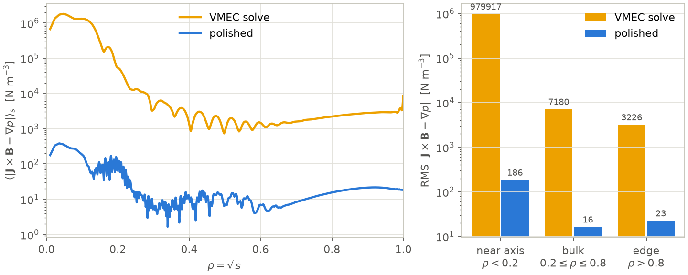

On matching 370-surface WOUTs, the whole-volume RMS force falls from
`2.0e5` to `42 N m⁻³`; near-axis RMS falls from `9.8e5` to `190 N m⁻³`.
The [polishing reference](https://vmex.readthedocs.io/en/latest/explanation/high-order-force-balance.html)
defines the dimensional force and normalized `eps_F` metrics.

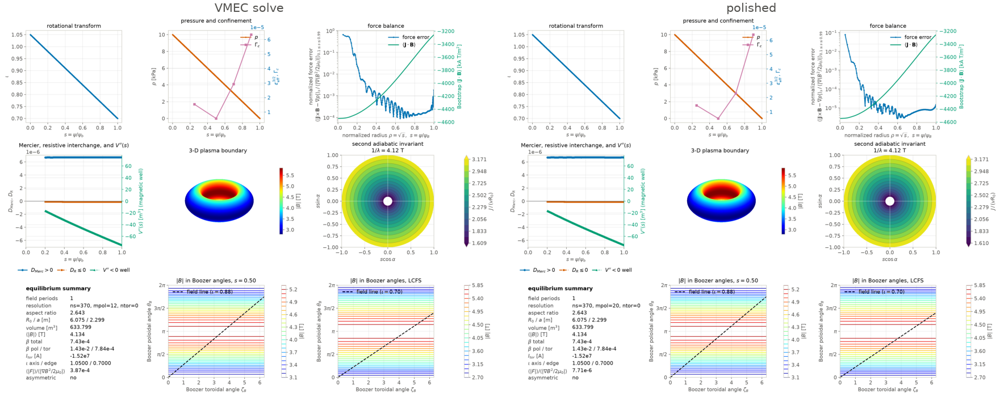

The same files give a `--plot` normalized force ratio of `3.9e-4` versus
`7.7e-6`; see the [validation record](docs/explanation/validation.md).

## Performance and parallel execution

JAX compiles each solve once per array structure and reuses the executable for matching shapes, so
measure first-call, cache-reload and warm costs separately, including refinement and gradients for
optimization. CPU and GPU performance depend on resolution and workload; the dated measurements are
in the [performance reference](https://vmex.readthedocs.io/en/latest/reference/performance.html)
and the [benchmark records](benchmarks/INDEX.md).

`vj.parallel.solve_ensemble(inputs, workers=None)` solves independent cases concurrently and returns
results in input order, each identical to solving that input alone; `workers=1` is the serial
baseline. Set worker and device budgets with the
[ensemble guide](https://vmex.readthedocs.io/en/latest/howto/parallel-ensembles.html). Multi-device
kernel and derivative tests do not yet establish a scalable distributed nonlinear equilibrium solve.

## Documentation, development and citation

Start with [your first equilibrium](https://vmex.readthedocs.io/en/latest/tutorials/first-equilibrium.html)
and [your first optimization](https://vmex.readthedocs.io/en/latest/tutorials/first-optimization.html),
then the [API](https://vmex.readthedocs.io/en/latest/reference/api/basic.html),
[VMEC compatibility](https://vmex.readthedocs.io/en/latest/reference/vmec2000-compatibility.html) and
[troubleshooting](https://vmex.readthedocs.io/en/latest/howto/troubleshoot.html) pages. For development,
`pip install -e ".[dev]"` and `python tools/preflight.py --static`. Report issues with the input deck
and `vmex --doctor` output. See [contributing](CONTRIBUTING.md), [citation](CITATION.cff),
[license](LICENSE) and the [archived plan](https://github.com/uwplasma/vmex/blob/35a5158f47bfb9d17bd4092ff518facda54cb0af/plan.md).

## Open mirrors and stellarator-mirror hybrids

The open-mirror model uses axial splines and poloidal Fourier modes between
prescribed end cuts, with a free side boundary. Stellarator-mirror hybrids
join straight mirror legs with curved returns; the
[mirror geometry guide](https://vmex.readthedocs.io/en/latest/explanation/mirror-geometry.html)
gives the coordinates and field equations.

```console
vmex examples/data/input.mirror_two_coil_free_boundary --plot   # a &MIRROR deck, writes mout_*.nc
```

```python
from vmex.mirror import MirrorInput, solve_mirror
solution = solve_mirror(MirrorInput.from_file("examples/data/input.mirror_two_coil_free_boundary"))
```

Specify the boundary or coils, flux and pressure; `solve_mirror` builds the grids.

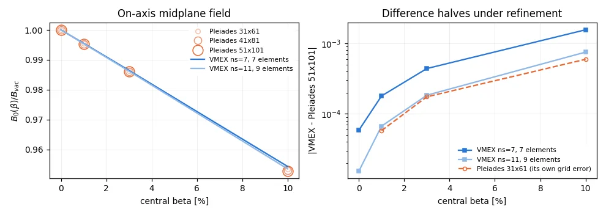

From vacuum to 10% beta, the two-coil on-axis field agrees with Pleiades to
`7.5e-4` or better on the finer grid. See the
[figure source](docs/_static/figures/sources/make_mirror_pleiades_figure.py)
and [mirror guide](https://vmex.readthedocs.io/en/latest/howto/mirror-machines.html).

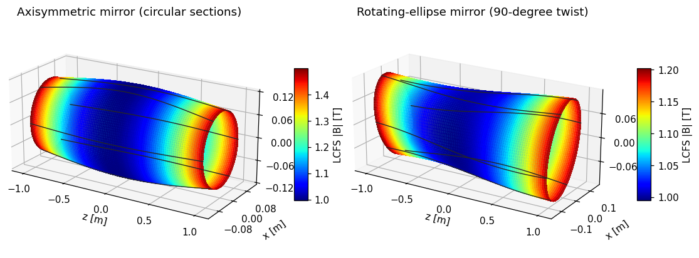
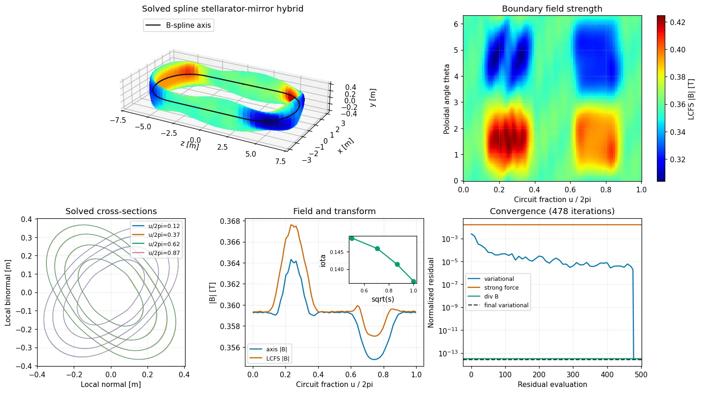
