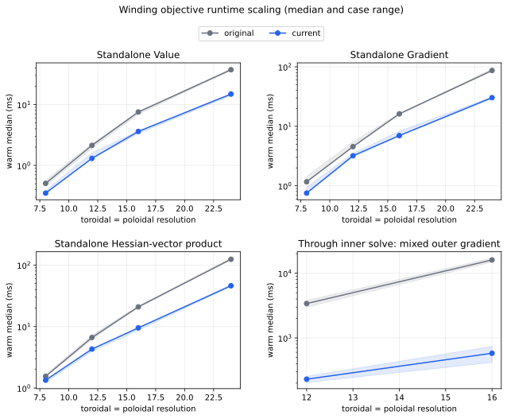
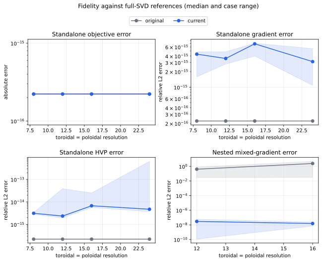
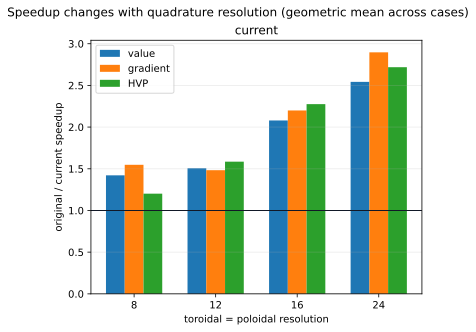
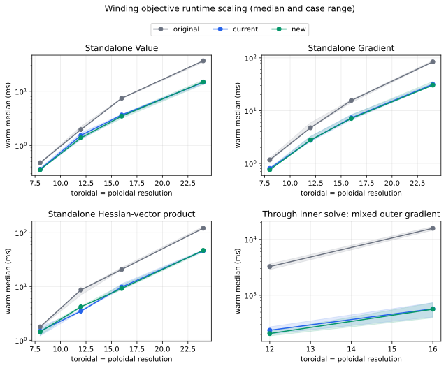
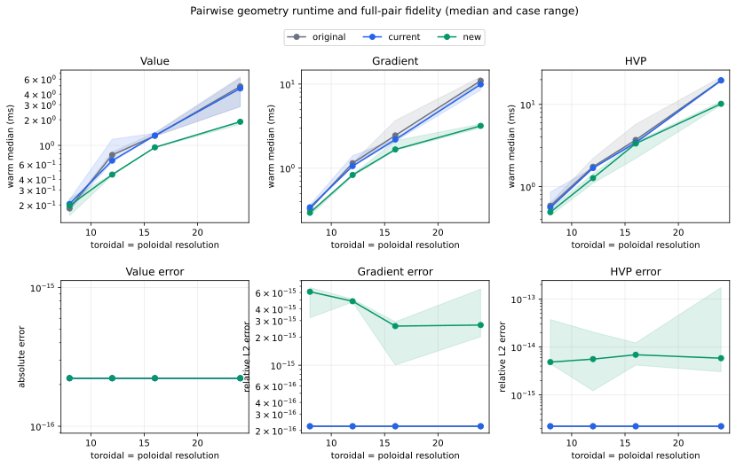
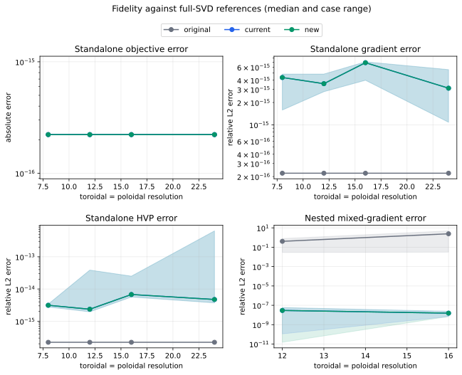
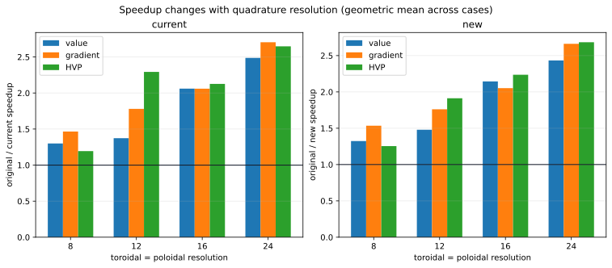

# Winding-surface optimization benchmarks

This report tracks the performance and numerical fidelity of the winding-surface
changes in PR #366.  It deliberately separates fixed-geometry kernels from the
nested optimization path and retains the historical code exactly as it was.  In
particular, the historical inner solve still stops after four L-BFGS-B iterations;
its low wall time is reported together with its failed stationarity certificate,
not presented as a valid converged result.

Raw samples and complete provenance are in
[`winding_surface_before_next_20260918.json`](winding_surface_before_next_20260918.json)
and
[`winding_surface_three_way_20260918.json`](winding_surface_three_way_20260918.json).
They are regenerated by
[`winding_surface_optimization.py`](winding_surface_optimization.py).

## Protocol

- CPU, JAX 0.11.2, float64, compilation cache disabled, four requested numerical
  library threads.  Compilation and warm execution are reported separately.
- Three deterministic geometries are fixed before measurement: a production-scale
  nominal surface, a lower-clearance surface, and a more strongly shaped surface.
- Fixed-geometry value, gradient, and Hessian-vector product measurements use
  8×8, 12×12, 16×16, and 24×24 quadrature grids.  Each warm executable has nine
  retained samples; plots show the median across geometries and the complete
  geometry range.
- A second fixed-geometry track isolates the sum of plasma clearance and
  winding self-approach.  Its reference retains every full-torus pair, so the
  new pairwise reduction is measured independently of the SVD and inner solve.
- Nested measurements use the nominal and shaped cases at 12×12 and 16×16.
  They differentiate entropy-only, inverse-distance-only, and equally mixed outer
  objectives through the 25-DOF inner solve.  Each has three retained warm samples.
- Fixed-geometry fidelity is measured against the original unsplit full-matrix
  SVD at identical inputs.  Nested fidelity is measured against the original
  full-SVD objective with only `maxiter` changed from 4 to 100 and its 25×25
  optimality Jacobian solved directly in float64.  This dense solve is independent
  of both the historical normal-equations CG and the PR's GCROT solve.

## Before the next optimization

The symmetry-reduced spectrum produces a speedup at every tested resolution and
the gain is not resolution-independent: it grows as the matrices get larger.
Geometric-mean warm speedups across all three geometries are:

| resolution | value | gradient | HVP |
| ---: | ---: | ---: | ---: |
| 8×8 | 1.42× | 1.55× | 1.20× |
| 12×12 | 1.51× | 1.48× | 1.59× |
| 16×16 | 2.08× | 2.20× | 2.28× |
| 24×24 | 2.54× | 2.90× | 2.72× |

The nested mixed-objective gradient is 11.75–35.54× faster than the historical
path.  That comparison includes two changes: the exact field-period reduction and
the switch from 25 forward winding responses to one transposable reverse adjoint.
At matched `maxiter=100` fidelity, the periodic inner solve alone is 1.65–2.23×
faster than the full-SVD reference.

For the current code, the largest fixed-geometry discrepancies over every case and
resolution are:

| quantity | maximum absolute error | maximum relative L2 error |
| --- | ---: | ---: |
| objective value | 8.33e-17 | 4.31e-16 |
| gradient | 1.75e-15 | 7.09e-15 |
| HVP | 9.89e-13 | 6.36e-13 |

All four current nested solves satisfy the requested infinity-norm stationarity
tolerance (`6.81e-7` to `9.04e-7`, tolerance `1e-6`).  Against the independent
dense reference, the largest absolute outer-observable error is `3.69e-9`, and
the maximum relative gradient errors are `1.06e-8` for entropy, `7.58e-8` for
inverse distance, and `5.87e-8` for the mixed objective.  Thus the fidelity result
does not depend on choosing `1/minimum_distance` as the outer objective.

The four-iteration historical solves do not satisfy stationarity: their residuals
range from `3.02e-2` to `1.00`, with mixed-gradient relative errors from 2.85% to
484%.  Their apparent primal solve time therefore is not an accuracy-matched
speed result.  In the fidelity plot, exact zero reference errors are displayed at
machine epsilon so they remain visible on logarithmic axes.

The next optimization is selected only after profiling this measured current
implementation.  The same cases, resolutions, references, and plotting code will
then be rerun with a third `new` revision so the comparison cannot move its target.

## Next optimization selection

The specialized scalar entropy JVP was implemented as a prototype and checked
against generic SVD automatic differentiation for real and complex sectors.  Its
values, gradients, and HVPs agreed, but its timing was mixed: isolated cases
sometimes improved while nested cases were neutral or slower.  It was therefore
not retained.  The other screened alternatives also failed the selection gate:

| candidate | observed result | decision |
| --- | --- | --- |
| dense 25×25 implicit solve | mixed-gradient time rose from 205 to 234 ms, 256 to 282 ms, and 418 to 548 ms in the three profiled cases | reject |
| PCG on the original system | encountered non-positive curvature and failed gradient certification | reject |
| unrecycled GMRES | 244 and 273 ms versus 205 and 256 ms in the two 12×12 cases | reject |
| specialized entropy JVP | exact derivatives, but no stable end-to-end gain | reject |
| one-period pairwise reductions | exact derivatives and consistent isolated gains | select |

The selected change uses field-period symmetry for both pairwise geometric
quantities, not just the final `1/minimum_distance` observable.  Every source
field period contributes the same multiset of distances and tangent radii, so a
softmax-weighted reduction needs only one source period.  For NFP=2 this halves
the pairwise tensors without approximation.  Both terms remain part of the
inner winding objective and its guardrails, so entropy-only, distance-only, and
mixed future outer objectives all benefit.

## After the pairwise reduction

The final benchmark uses immutable source revisions for `original`, `current`,
and `new`; the measurement commit was clean.  At a representative 12×12 case,
the entropy/SVD-only compiled StableHLO is byte-for-byte identical between
`current` and `new` for value, gradient, and HVP, as intended.  Its small timing
differences are sampling scatter rather than a claimed effect of the pairwise
change.

Geometric-mean isolated speedups for `new` relative to `current`, across all
three geometries, are:

| resolution | pairwise value | pairwise gradient | pairwise HVP |
| ---: | ---: | ---: | ---: |
| 8×8 | 1.06× | 1.19× | 1.31× |
| 12×12 | 1.76× | 1.41× | 1.33× |
| 16×16 | 1.40× | 1.21× | 1.17× |
| 24×24 | 2.33× | 3.03× | 1.90× |

The gain is resolution-dependent: launch and other fixed overhead dominate the
smallest grids, while avoiding half of the pair tensor matters much more at
24×24.  No individual resolution/derivative combination regressed in this
isolated matrix.

The change also reduces differentiated work through the full inner solve.  Warm
mixed-gradient medians are:

| case | resolution | current (ms) | new (ms) | current/new | historical/new |
| --- | ---: | ---: | ---: | ---: | ---: |
| nominal | 12×12 | 202.63 | 188.38 | 1.076× | 19.37× |
| nominal | 16×16 | 409.10 | 395.14 | 1.035× | 36.82× |
| shaped | 12×12 | 272.54 | 226.73 | 1.202× | 12.70× |
| shaped | 16×16 | 739.77 | 734.48 | 1.007× | 23.02× |

The geometric-mean incremental nested gain is 1.078×.  The smaller end-to-end
gain at 16×16 is expected: the unchanged spectral decomposition and optimizer
account for a larger share of total work there.  All four new solves meet the
`1e-6` stationarity requirement (`6.81e-7` to `9.04e-7`).

The one-period reduction preserves the full-pair reference to roundoff over all
cases and resolutions:

| pairwise quantity | maximum absolute error | maximum relative L2 error |
| --- | ---: | ---: |
| value | 8.33e-17 | 4.81e-16 |
| gradient | 2.00e-14 | 6.78e-15 |
| HVP | 3.98e-12 | 1.73e-13 |

The unchanged spectral path retains the earlier maxima (`8.33e-17` value,
`1.75e-15` gradient, and `9.89e-13` HVP absolute error).  In the nested
comparison, the new code's maximum absolute observable error is `7.18e-11` and
its maximum relative gradient errors are `1.06e-8` for entropy, `7.57e-8` for
inverse distance, and `5.86e-8` for the mixed objective.  No numeric result or
timing sample in the raw record is non-finite.

Taken together, the two optimization stages leave the fixed-geometry spectral
path 1.25–2.68× faster than the historical code (depending on derivative and
resolution) and the isolated pairwise path up to 3.49× faster.  The valid nested
mixed gradient is 2.02–4.67× faster than the accuracy-matched dense reference;
the historical four-iteration timings are 12.70–36.82× slower but do not meet
stationarity.  The separate plots and references keep those effects attributable
instead of folding them into one preferred outer objective configuration.
