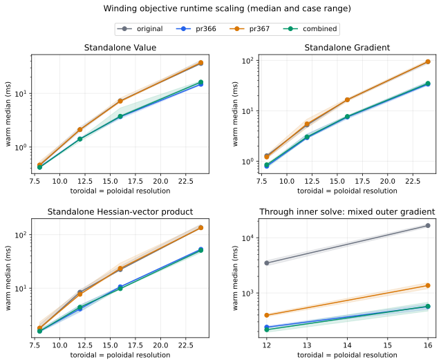
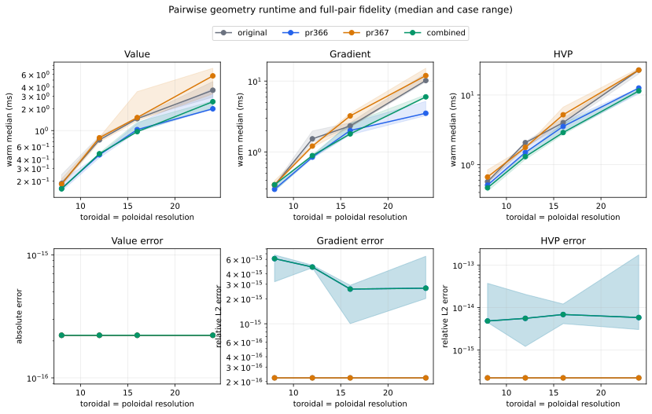
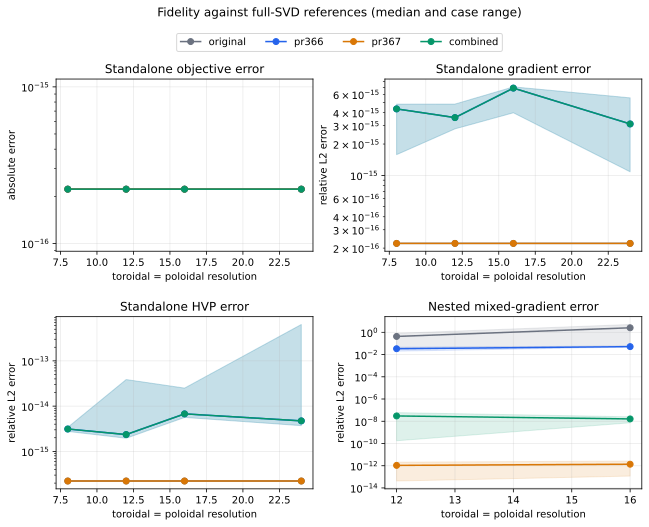
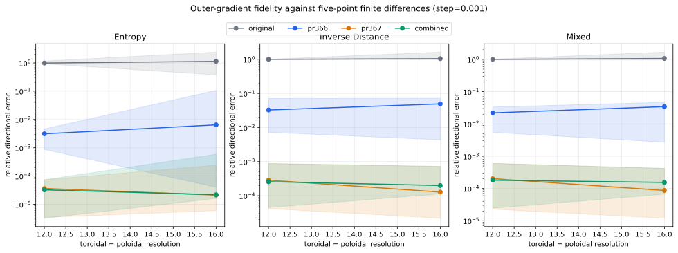
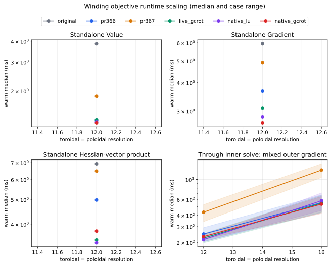

# Winding-surface optimization benchmarks

This report tracks the performance and numerical fidelity of the winding-surface
changes in PR #366.  It deliberately separates fixed-geometry kernels from the
nested optimization path and retains the historical code exactly as it was.  In
particular, the historical inner solve still stops after four L-BFGS-B iterations;
its low wall time is reported together with its failed stationarity certificate,
not presented as a valid converged result.

Raw samples and complete provenance are in
[`winding_surface_before_next_20260918.json`](winding_surface_before_next_20260918.json)
and
[`winding_surface_three_way_20260918.json`](winding_surface_three_way_20260918.json).
They are regenerated by
[`winding_surface_optimization.py`](winding_surface_optimization.py).
Publication through GitHub assigned different commit IDs to several clean local
measurement and prototype revisions.  The machine-readable
[`winding_surface_provenance.json`](winding_surface_provenance.json) maps those
historical IDs to self-contained source snapshots and retained patches.
Regression tests apply every patch and verify the snapshots, patches and result
Git blobs by SHA-256 or object ID, so all measured sources remain reconstructible
from a fresh shallow checkout without historical Git objects.

## Protocol

- CPU, JAX 0.11.2, float64, compilation cache disabled, four requested numerical
  library threads.  Compilation and warm execution are reported separately.
- Three deterministic geometries are fixed before measurement: a production-scale
  nominal surface, a lower-clearance surface, and a more strongly shaped surface.
- Fixed-geometry value, gradient, and Hessian-vector product measurements use
  8×8, 12×12, 16×16, and 24×24 quadrature grids.  Each warm executable has nine
  retained samples; plots show the median across geometries and the complete
  geometry range.
- A second fixed-geometry track isolates the sum of plasma clearance and
  winding self-approach.  Its reference retains every full-torus pair, so the
  new pairwise reduction is measured independently of the SVD and inner solve.
- Nested measurements use the nominal and shaped cases at 12×12 and 16×16.
  They differentiate entropy-only, inverse-distance-only, and equally mixed outer
  objectives through the 25-DOF inner solve.  Each has three retained warm samples.
- Fixed-geometry fidelity is measured against the original unsplit full-matrix
  SVD at identical inputs.  Nested fidelity is measured against the original
  full-SVD objective with only `maxiter` changed from 4 to 100 and its 25×25
  optimality Jacobian solved directly in float64.  This dense solve is independent
  of both the historical normal-equations CG and the PR's GCROT solve.

## Before the next optimization

The symmetry-reduced spectrum produces a speedup at every tested resolution and
the gain is not resolution-independent: it grows as the matrices get larger.
Geometric-mean warm speedups across all three geometries are:

| resolution | value | gradient | HVP |
| ---: | ---: | ---: | ---: |
| 8×8 | 1.42× | 1.55× | 1.20× |
| 12×12 | 1.51× | 1.48× | 1.59× |
| 16×16 | 2.08× | 2.20× | 2.28× |
| 24×24 | 2.54× | 2.90× | 2.72× |

The nested mixed-objective gradient is 11.75–35.54× faster than the historical
path.  That comparison includes two changes: the exact field-period reduction and
the switch from 25 forward winding responses to one transposable reverse adjoint.
At matched `maxiter=100` fidelity, the periodic inner solve alone is 1.65–2.23×
faster than the full-SVD reference.

For the current code, the largest fixed-geometry discrepancies over every case and
resolution are:

| quantity | maximum absolute error | maximum relative L2 error |
| --- | ---: | ---: |
| objective value | 8.33e-17 | 4.31e-16 |
| gradient | 1.75e-15 | 7.09e-15 |
| HVP | 9.89e-13 | 6.36e-13 |

All four current nested solves satisfy the requested infinity-norm stationarity
tolerance (`6.81e-7` to `9.04e-7`, tolerance `1e-6`).  Against the independent
dense reference, the largest absolute outer-observable error is `3.69e-9`, and
the maximum relative gradient errors are `1.06e-8` for entropy, `7.58e-8` for
inverse distance, and `5.87e-8` for the mixed objective.  Thus the fidelity result
does not depend on choosing `1/minimum_distance` as the outer objective.

The four-iteration historical solves do not satisfy stationarity: their residuals
range from `3.02e-2` to `1.00`, with mixed-gradient relative errors from 2.85% to
484%.  Their apparent primal solve time therefore is not an accuracy-matched
speed result.  In the fidelity plot, exact zero reference errors are displayed at
machine epsilon so they remain visible on logarithmic axes.

The next optimization is selected only after profiling this measured current
implementation.  The same cases, resolutions, references, and plotting code will
then be rerun with a third `new` revision so the comparison cannot move its target.

## Next optimization selection

The specialized scalar entropy JVP was implemented as a prototype and checked
against generic SVD automatic differentiation for real and complex sectors.  Its
values, gradients, and HVPs agreed, but its timing was mixed: isolated cases
sometimes improved while nested cases were neutral or slower.  It was therefore
not retained.  The other screened alternatives also failed the selection gate:

| candidate | observed result | decision |
| --- | --- | --- |
| dense 25×25 implicit solve | mixed-gradient time rose from 205 to 234 ms, 256 to 282 ms, and 418 to 548 ms in the three profiled cases | reject |
| PCG on the original system | encountered non-positive curvature and failed gradient certification | reject |
| unrecycled GMRES | 244 and 273 ms versus 205 and 256 ms in the two 12×12 cases | reject |
| specialized entropy JVP | exact derivatives, but no stable end-to-end gain | reject |
| one-period pairwise reductions | exact derivatives and consistent isolated gains | select |

The selected change uses field-period symmetry for both pairwise geometric
quantities, not just the final `1/minimum_distance` observable.  Every source
field period contributes the same multiset of distances and tangent radii, so a
softmax-weighted reduction needs only one source period.  For NFP=2 this halves
the pairwise tensors without approximation.  Both terms remain part of the
inner winding objective and its guardrails, so entropy-only, distance-only, and
mixed future outer objectives all benefit.

## After the pairwise reduction

The final benchmark uses immutable source revisions for `original`, `current`,
and `new`; the measurement commit was clean.  At a representative 12×12 case,
the entropy/SVD-only compiled StableHLO is byte-for-byte identical between
`current` and `new` for value, gradient, and HVP, as intended.  Its small timing
differences are sampling scatter rather than a claimed effect of the pairwise
change.

Geometric-mean isolated speedups for `new` relative to `current`, across all
three geometries, are:

| resolution | pairwise value | pairwise gradient | pairwise HVP |
| ---: | ---: | ---: | ---: |
| 8×8 | 1.06× | 1.19× | 1.31× |
| 12×12 | 1.76× | 1.41× | 1.33× |
| 16×16 | 1.40× | 1.21× | 1.17× |
| 24×24 | 2.33× | 3.03× | 1.90× |

The gain is resolution-dependent: launch and other fixed overhead dominate the
smallest grids, while avoiding half of the pair tensor matters much more at
24×24.  No individual resolution/derivative combination regressed in this
isolated matrix.

The change also reduces differentiated work through the full inner solve.  Warm
mixed-gradient medians are:

| case | resolution | current (ms) | new (ms) | current/new | historical/new |
| --- | ---: | ---: | ---: | ---: | ---: |
| nominal | 12×12 | 202.63 | 188.38 | 1.076× | 19.37× |
| nominal | 16×16 | 409.10 | 395.14 | 1.035× | 36.82× |
| shaped | 12×12 | 272.54 | 226.73 | 1.202× | 12.70× |
| shaped | 16×16 | 739.77 | 734.48 | 1.007× | 23.02× |

The geometric-mean incremental nested gain is 1.078×.  The smaller end-to-end
gain at 16×16 is expected: the unchanged spectral decomposition and optimizer
account for a larger share of total work there.  All four new solves meet the
`1e-6` stationarity requirement (`6.81e-7` to `9.04e-7`).

The one-period reduction preserves the full-pair reference to roundoff over all
cases and resolutions:

| pairwise quantity | maximum absolute error | maximum relative L2 error |
| --- | ---: | ---: |
| value | 8.33e-17 | 4.81e-16 |
| gradient | 2.00e-14 | 6.78e-15 |
| HVP | 3.98e-12 | 1.73e-13 |

The unchanged spectral path retains the earlier maxima (`8.33e-17` value,
`1.75e-15` gradient, and `9.89e-13` HVP absolute error).  In the nested
comparison, the new code's maximum absolute observable error is `7.18e-11` and
its maximum relative gradient errors are `1.06e-8` for entropy, `7.57e-8` for
inverse distance, and `5.86e-8` for the mixed objective.  No numeric result or
timing sample in the raw record is non-finite.

Taken together, the two optimization stages leave the fixed-geometry spectral
path 1.25–2.68× faster than the historical code (depending on derivative and
resolution) and the isolated pairwise path up to 3.49× faster.  The valid nested
mixed gradient is 2.02–4.67× faster than the accuracy-matched dense reference;
the historical four-iteration timings are 12.70–36.82× slower but do not meet
stationarity.  The separate plots and references keep those effects attributable
instead of folding them into one preferred outer objective configuration.

## Independent comparison with PR #367

PR #367 was fetched at `0f4ba71e`; PR #366 was measured at `9ab36917`, before
the combination below.  The complete clean-run samples, source revisions, command,
environment, and outputs are in
[`winding_surface_pr367_comparison_20260922.json`](winding_surface_pr367_comparison_20260922.json).
The compatibility-candidate screen is independently recorded in
[`winding_surface_pr367_candidates_20260922.json`](winding_surface_pr367_candidates_20260922.json).
No timing or error below was copied from either pull request's own report.

The methods overlap at a high level, but they are not the same implementation:

| concern | PR #366 | PR #367 |
| --- | --- | --- |
| inner convergence | `maxiter=100`, tolerance `1e-6` | `maxiter=200`, tolerance `1e-6` |
| implicit derivative | custom JVP, transposable matrix-free GCROT solve | native JAXopt VJP, dense 25×25 LU solve |
| outer differentiation | `auto` (selects reverse for this scalar residual) | pinned `reverse_adjoint` |
| normalization scales | sensitivity stopped | sensitivity retained |
| induction spectrum | exact field-period block decomposition | original full-torus SVD |
| pairwise geometry | exact one-source-period reduction | original full pair tensors |

Both PRs therefore converge the inner problem and avoid the historical 25-way
forward outer derivative.  Most of PR #367's speedup over the historical code is
the same high-level reverse-mode change already present in PR #366.  Its dense LU
is an alternative to, rather than an additional layer on top of, PR #366's GCROT
adjoint.  PR #367's live normalization-scale derivative is a distinct fidelity
improvement.  PR #366's two periodic kernel reductions are distinct performance
improvements.

### Protocol additions

- The standalone matrix uses nominal, close-clearance, and shaped geometries at
  8×8, 12×12, 16×16, and 24×24, with nine retained warm samples for value,
  gradient, and HVP.  Full-SVD and full-pair calculations remain the references.
- The nested matrix uses nominal and shaped geometries at 12×12 and 16×16, with
  five retained warm samples for entropy-only, inverse-distance-only, and equally
  mixed outer gradients.  No solver tolerance is tuned by case or resolution.
- Two independent dense full-SVD references are evaluated: one stops the
  normalization-scale derivative, and one retains it.  The live-scale reference
  is primary because it differentiates the scalar map actually executed.
- Two deterministic directions and two step sizes are checked with a five-point
  finite difference of the complete solve-and-observe map.  This check is
  independent of the implicit differentiation implementation.
- JAX 0.11.2, float64, disabled compilation cache, and the earlier CPU/thread
  protocol are unchanged.  Every numeric result and timing sample is finite.

### Speed and resolution scaling

PR #367 leaves the standalone spectral and pairwise kernels unchanged, so its
isolated timings track the historical implementation within sampling scatter.
The selected combination retains PR #366's exact periodic reductions.  Its
geometric-mean speedups over the original implementation across all three
geometries are:

| resolution | spectral value | spectral gradient | spectral HVP | pairwise value | pairwise gradient | pairwise HVP |
| ---: | ---: | ---: | ---: | ---: | ---: | ---: |
| 8×8 | 1.10× | 1.51× | 1.16× | 1.28× | 1.05× | 1.25× |
| 12×12 | 1.56× | 1.67× | 2.01× | 1.60× | 1.83× | 1.53× |
| 16×16 | 1.75× | 2.17× | 2.32× | 1.38× | 1.18× | 1.30× |
| 24×24 | 2.34× | 2.61× | 2.85× | 1.55× | 1.79× | 1.95× |

Every entry is above one, but the magnitude is resolution-dependent rather than
constant.  The larger-grid spectral gains grow because the exact block
decomposition reduces matrix construction and factorization work, while fixed
launch overhead is more visible on small grids.  Nothing is specialized to a
single grid size: the periodic path is used whenever the toroidal grid divides
evenly by NFP and otherwise falls back to the full exact calculation.

Warm mixed-gradient medians through the inner solve are:

| case | resolution | historical, unconverged (ms) | live full-SVD dense reference (ms) | PR #366 (ms) | PR #367 (ms) | combined (ms) | PR #367 / combined |
| --- | ---: | ---: | ---: | ---: | ---: | ---: | ---: |
| nominal | 12×12 | 3,868.23 | 493.50 | 228.83 | 372.28 | 194.18 | 1.92× |
| nominal | 16×16 | 15,581.56 | 1,979.11 | 502.19 | 1,193.04 | 470.36 | 2.54× |
| shaped | 12×12 | 3,102.47 | 543.80 | 252.17 | 417.79 | 237.52 | 1.76× |
| shaped | 16×16 | 17,657.79 | 2,324.22 | 629.00 | 1,536.30 | 678.49 | 2.26× |

Against the accuracy-matched live full-SVD reference, geometric-mean speedups are
2.87× for PR #366, 1.44× for PR #367, and 3.03× for the combination.  The
combination is 2.10× faster than PR #367 and 1.055× faster than PR #366 in the
geometric mean.  The latter is best interpreted as preserved PR #366 performance,
not a claimed speedup from retaining another derivative term: the combined result
is faster in three cases and 7.9% slower in the shaped 16×16 case.  The historical
comparison is 21.76×, but all four historical solves fail stationarity and are not
accuracy-matched.

### Absolute and gradient fidelity

All PR #366, PR #367, and combined inner solves meet the `1e-6` stationarity
requirement.  Their residual ranges are `6.81e-7`–`9.04e-7`; the historical range
is `3.02e-2`–`1.00`.  Against the live-scale dense reference, the worst nested
errors across both geometries and both resolutions are:

| implementation | max observable absolute error | entropy gradient relative L2 | inverse-distance gradient relative L2 | mixed gradient relative L2 |
| --- | ---: | ---: | ---: | ---: |
| PR #366 | 7.18e-11 | 7.12e-3 | 1.27e-1 | 5.61e-2 |
| PR #367 | 0 | 3.06e-13 | 2.16e-12 | 2.61e-12 |
| combined | 7.18e-11 | 1.05e-8 | 7.75e-8 | 5.97e-8 |

PR #366's value is already correct, but stopping the moving normalization scales
omits part of the total derivative.  The frozen-scale dense reference reproduces
the same discrepancy (`0.71%`, `12.67%`, and `5.61%` maxima), identifying the
cause independently of the periodic kernels and GCROT.  PR #367 retains that
derivative and matches its structurally identical dense reference to roundoff.
The combined code retains it while preserving PR #366's exact reductions; its
remaining errors are the already-certified matrix-free and periodic roundoff.

For fixed geometries, the combined code retains the earlier maxima against the
unreduced references: `8.33e-17` value absolute error, `7.09e-15` gradient
relative L2 error, and `6.36e-13` HVP relative L2 error for the spectral path;
`8.33e-17`, `6.78e-15`, and `1.73e-13`, respectively, for the pairwise path.
Thus both absolute output fidelity and first/second derivative fidelity are
checked independently of the inner optimization.

At the less noise-sensitive `1e-3` step, maximum relative directional errors over
eight case/resolution/direction combinations are:

| implementation | entropy | inverse distance | mixed |
| --- | ---: | ---: | ---: |
| PR #366 | 1.07e-1 | 7.16e-2 | 4.68e-2 |
| PR #367 | 2.44e-4 | 8.80e-4 | 6.00e-4 |
| combined | 5.89e-4 | 8.77e-4 | 5.98e-4 |

The live-scale methods agree with finite differences to below `0.1%` in every
entry.  Reducing the step to `3e-4` moves them toward the inner solver's tolerance
floor (maximum `0.30%`), while PR #366's omitted-scale signal persists.  Entropy,
inverse distance, and their mixture are reported separately, so the conclusion
does not rely on `1/minimum_distance` being the only future outer objective.

## Compatibility candidates and selected combination

The two PRs touch the same inner-solve function, so a textual cherry-pick needs a
manual conflict resolution, but their mathematical changes are compatible.  Five
optimized variants were screened through the same four nested cases.  The three
combination prototypes were:

1. `live_gcrot`: PR #366 plus the live normalization-scale derivative.
2. `native_lu`: the direct combination of PR #366's periodic kernels with PR
   #367's native JAXopt VJP and dense LU.
3. `native_gcrot`: periodic kernels plus a native JAXopt VJP whose supplied
   linear solver is certified GCROT.

The candidate run retained three warm nested samples per case.  Mixed-gradient
medians and aggregate checks are:

| variant | nominal 12 (ms) | nominal 16 (ms) | shaped 12 (ms) | shaped 16 (ms) | geometric mean (ms) | PR #367 / variant | max mixed-gradient relative error |
| --- | ---: | ---: | ---: | ---: | ---: | ---: | ---: |
| PR #366 | 203.98 | 431.81 | 292.36 | 673.91 | 362.95 | 2.01× | 5.61e-2 |
| PR #367 | 340.37 | 1,052.70 | 525.54 | 1,494.64 | 728.36 | 1.00× | 2.61e-12 |
| live GCROT | 198.14 | 426.91 | 250.45 | 664.47 | 344.45 | 2.11× | 5.97e-8 |
| native LU | 204.21 | 452.44 | 226.85 | 710.12 | 349.28 | 2.09× | 1.56e-8 |
| native GCROT | 216.75 | 418.16 | 248.85 | 647.95 | 347.69 | 2.09× | 5.97e-8 |

All candidates meet stationarity and the live-reference fidelity requirement.
The direct native-LU combination therefore does preserve both branches' essential
benefits, but it is 1.4% slower in geometric mean than `live_gcrot` and replaces a
working transposable solver with a dense factorization.  Native GCROT is also
close, but provides no measured aggregate advantage over the existing custom
rule.  Given differences of this size are near timing scatter, the selection
favors the smallest implementation change and the already-tested solver path:
retain PR #366's `maxiter=100`, periodic kernels, and certified custom GCROT JVP,
and remove only the normalization-scale `stop_gradient` identified by PR #367.

This combination is now the code in PR #366.  It is objective-agnostic: the inner
objective, its normalization, and all returned observables receive the corrected
total derivative, while the speedups arise from symmetry and adjoint structure
rather than special-casing the current inverse-distance outer residual.
