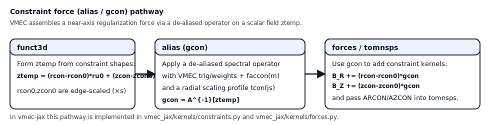

Algorithms
==========

This page documents the numerical building blocks currently implemented, and
the intended path to a VMEC-quality solver.

Discretization summary
----------------------

Radial grid
~~~~~~~~~~~

We use a uniform grid in :math:`s \in [0,1]` with ``ns`` points:

.. math::

   s_j = \frac{j}{ns-1},\qquad j=0,\dots,ns-1.

VMEC2000 uses a mix of full-mesh and half-mesh conventions in ``s``; ``vmec-jax``
currently treats most quantities on a full mesh for simplicity, and ports
half-mesh logic as needed for parity (notably in ``wout`` regressions).

Angular grids
~~~~~~~~~~~~~

We use uniform tensor-product grids in :math:`\theta` and :math:`\zeta` (one
field period):

- :math:`\theta_i = 2\pi i / ntheta`
- :math:`\zeta_k = 2\pi k / nzeta`

These grids are represented by ``AngleGrid`` and built in
``vmec_jax/grids.py``.

Fourier transforms
~~~~~~~~~~~~~~~~~~

VMEC uses Fourier transforms between mode space and real space on the angular
grid. In ``vmec-jax`` we implement synthesis using dense basis tensors:

.. math::

   f(\theta,\zeta) = \sum_{m,n} \Bigl(
     c_{mn}\cos(m\theta-n\zeta) + s_{mn}\sin(m\theta-n\zeta)
   \Bigr).

For VMEC parity, the *analysis* transform (real-space → Fourier) follows the
``fixaray``-style DFT with precomputed trig/weight tables. Denote the VMEC
theta grid by :math:`\theta_i` with endpoint half-weights and the zeta grid by
:math:`\zeta_k` over one field period. VMEC defines weighted tables
(:math:`\mathrm{cosmui}`, :math:`\mathrm{sinmui}`) that already include the
``mscale`` normalization and endpoint quadrature weights. The first stage is:

.. math::

   \tilde{f}^{c}_{m}(\zeta_k) = \sum_i f(\theta_i,\zeta_k)\,\mathrm{cosmui}_{i,m},
   \qquad
   \tilde{f}^{s}_{m}(\zeta_k) = \sum_i f(\theta_i,\zeta_k)\,\mathrm{sinmui}_{i,m}.

The second stage uses the precomputed zeta tables
(:math:`\mathrm{cosnv}`, :math:`\mathrm{sinnv}`) to obtain
the :math:`(m,n)` coefficients:

.. math::

   c_{m,n} = \sum_k \tilde{f}^{c}_m(\zeta_k)\,\mathrm{cosnv}_{k,n},
   \qquad
   s_{m,n} = \sum_k \tilde{f}^{s}_m(\zeta_k)\,\mathrm{sinnv}_{k,n}.

For derivative terms, VMEC uses ``cosnvn/sinnvn`` which already include the
field-period scaling (:math:`n\,\mathrm{NFP}`); the same tables are used in
``vmec-jax``.

The implementation in ``vmec_jax.vmec_tomnsp`` performs these two DFT stages as
batched ``dot_general`` calls (GEMM-friendly) to match VMEC2000 scaling while
enabling XLA fusion. See References [4-6] for the VMEC2000 ``fixaray`` tables
and the VMEC++ DFT/basis discussion.

Geometry pipeline
-----------------

The geometry kernel is the foundation of most downstream physics:

1. Evaluate :math:`(R,Z,\lambda)` on the ``(s,theta,zeta)`` grid from Fourier
   coefficients (``eval_coords``).
2. Compute angular derivatives analytically in mode space
   (``eval_fourier_dtheta``, ``eval_fourier_dzeta_phys``).
3. Compute radial derivatives by finite differences on coefficient arrays
   (``d_ds_coeffs``), then re-synthesize.
4. Embed in Cartesian coordinates using :math:`\phi_{\mathrm{phys}} = \zeta/\mathrm{NFP}`.
5. Compute covariant metric elements and signed Jacobian ``sqrtg`` (``eval_geom``).

The goal is that each step is differentiable and jittable.

Iteration Loop: Non-Scan vs Scan
--------------------------------

VMEC2000 solves a nonlinear fixed-boundary equilibrium by repeatedly updating
the state vector :math:`x` (stacked Fourier coefficients of
:math:`R,Z,\lambda`) using a preconditioned force residual. In compact form:

.. math::

   \mathbf{x}_{k+1}
   =
   \mathbf{x}_k
   +
   \Delta t_k\,\mathbf{v}_k,
   \qquad
   \mathbf{v}_k = P_k^{-1}\,\mathbf{r}(\mathbf{x}_k).

Here :math:`\mathbf{r}` is assembled from the VMEC force blocks
(:math:`F_R, F_Z, F_\lambda`) after ``tomnsps`` projection, and :math:`P^{-1}`
is the 1D radial preconditioner built from ``bcovar`` quantities
(``arm``, ``azm``, ``brm``, ``bzm``, ``crm``, ``czm`` and lambda factors).

The table entries printed each ``NSTEP`` iterations are the VMEC-normalized
force scalars:

.. math::

   \mathrm{fsqr} = r_1\,f_\mathrm{norm}\,\|F_R\|_2^2,\quad
   \mathrm{fsqz} = r_1\,f_\mathrm{norm}\,\|F_Z\|_2^2,\quad
   \mathrm{fsql} = f_\mathrm{norm}^L\,\|F_\lambda\|_2^2,

with the same normalization factors as VMEC2000 ``bcovar``.

VMEC2000 then applies ``TimeStepControl`` [8] on two aggregated residuals:

.. math::

   \mathrm{fsq} = \mathrm{fsqr} + \mathrm{fsqz},
   \qquad
   \mathrm{fsq0} = \mathrm{fsqr} + \mathrm{fsqz} + \mathrm{fsql}.

Denoting restart checkpoint values by :math:`\mathrm{res0},\mathrm{res1}`,
VMEC's control logic in ``evolve.f`` / ``restart.f`` is:

.. math::

   \mathrm{res0}\leftarrow\min(\mathrm{res0},\mathrm{fsq}),
   \qquad
   \mathrm{res1}\leftarrow\min(\mathrm{res1},\mathrm{fsq0}),

then:

1. If ``iter2 == iter1`` (or uninitialized ``res0``), initialize checkpoint.
2. If :math:`\mathrm{fsq}\le\mathrm{res0}` and
   :math:`\mathrm{fsq0}\le\mathrm{res1}`, store new checkpoint.
3. If ``iter2 - iter1 > 10`` and
   :math:`\mathrm{fsq} > 10^4\mathrm{res0}` or
   :math:`\mathrm{fsq0} > 10^4\mathrm{res1}`, trigger bad-progress restart.
4. On restart, ``restart_iter`` rescales :math:`\Delta t` exactly as:

   - bad Jacobian (``irst=2``): :math:`\Delta t \leftarrow 0.9\,\Delta t`
   - bad progress/time-control (``irst=3``):
     :math:`\Delta t \leftarrow \Delta t / 1.03`

This is the control law vmec-jax must match for per-iteration parity.

``vmec-jax`` exposes two execution paths that use the *same* mathematical
updates but differ in how the loop is staged:

**Non-scan (parity) path**

- Implements VMEC2000 ordering directly in a host ``for`` loop, including
  checkpoint/restart sequencing and Jacobian-triggered axis resets.
- Uses VMEC-style restarts and time-step control with scalar checks in host
  control flow (same ordering as ``evolve.f`` + ``restart.f``).
- Supports exact VMEC2000 iteration parity and reproduces ``threed1`` output.
- Preferred for verification, regression tests, and large ``ns`` where subtle
  ordering differences can accumulate.

In code, this corresponds to ``solve_fixed_boundary_residual_iter`` using the
direct loop near the lower part of ``vmec_jax/solve.py``:

- force evaluation: ``_compute_forces_nodump`` / ``_compute_forces_impl``
- VMEC time-step bookkeeping: ``_dump_time_control_trace`` block and
  ``restart_reason`` handling
- restart path: VMEC-compatible ``time_step`` rescaling and checkpoint rollback.

**Scan (performance) path**

- Wraps the same residual+preconditioner update in a JAX ``lax.scan`` to keep
  the entire iteration loop on device.
- Eliminates Python overhead, reduces host/device synchronization, and enables
  kernel fusion across steps (especially with JIT-enabled force kernels).
- Applies the same update formulas, but encodes control flow in a pure carry
  state (``_ScanCarry``), with restart decisions represented by ``lax.cond``.

This path is invoked by setting ``use_scan=True`` or using the fast solver
aliases (``vmec2000_iter_fast``/``vmec2000_scan``).  A parity guard can probe
the first few iterations and automatically fall back to the non-scan path when
the scan loop diverges from the VMEC2000 ordering (see
``VMEC_JAX_SCAN_PARITY_GUARD`` in ``vmec_jax/driver.py``).

Mathematically, the scan path performs:

.. math::

   (\mathbf{x}_{k+1}, c_{k+1}) = \Phi(\mathbf{x}_k, c_k; k),

where :math:`c_k` is the carry (time step, restart indices, cached norms,
checkpoint state, and running traces). The key difference from non-scan is not
the physics formulas, but the *placement* of control-flow boundaries and host
synchronization.

**Why scan is faster**

The scan loop lets XLA treat the entire iteration as a single compiled region.
That reduces Python dispatch, keeps intermediate arrays on device, and allows
kernel fusion across consecutive iterations.  On the non-scan path, each
iteration triggers multiple Python→JAX calls and synchronization points.  For
small-to-moderate grids this cost dominates; for large grids, the scan path can
still win but must be validated for parity (especially when ``ns`` or
``NS_ARRAY`` is large).

**Example usage**

.. code-block:: python

   # Parity-focused run (VMEC2000 ordering)
   vj.run_fixed_boundary(path, solver="vmec2000_iter", use_scan=False)

   # Performance-focused run (JAX scan loop)
   vj.run_fixed_boundary(path, solver="vmec2000_iter", use_scan=True, performance_mode=True)

For reproducibility against VMEC2000, prefer the non-scan path.  For fast
parameter sweeps on validated inputs, the scan path can offer significant
speedups while preserving differentiability.

Worked comparison against VMEC2000
~~~~~~~~~~~~~~~~~~~~~~~~~~~~~~~~~~

For the converged QI test (``examples/data/input.QI_nfp2``), both VMEC2000 and
vmec-jax non-scan runs follow the same iteration-level convergence pattern
(same Jacobian reset count and close ``fsq`` traces), while preserving
end-to-end differentiability of the JAX path.

The most stable workflow for parity-critical studies remains:

1. use non-scan for production parity runs,
2. compare ``wout`` with an axis mask (skip first 6 radial points),
3. use scan mode only after the case is validated at the chosen resolution.

This policy is consistent with VMEC2000 behavior near the axis and VMEC++
documentation about reduced reliability of axis-adjacent Mercier-type
diagnostics.

Free-Boundary Path (Current WP2)
--------------------------------

The free-boundary implementation now includes an active vacuum-edge coupling
path. It still follows staged VMEC2000 parity work, but ``bsqvac`` is now
computed and coupled into the edge force channel in fixed-boundary iterations
when ``LFREEB=T``.

Control law currently threaded (VMEC2000 ``funct3d`` + ``eqsolve`` compatible
for ``ictrl_prec2d=0`` path):

.. math::

   \mathrm{if}\; iter2_k>1:
   \quad
   \begin{cases}
   ivac_k \leftarrow 1, & ivac_{k-1}<0\;\wedge\;(fsqr_{k-1}+fsqz_{k-1})\le f_{\mathrm{act}},\\
   ivac_k \leftarrow ivac_{k-1}+1, & ivac_{k-1}\ge 0.
   \end{cases}

and, for :math:`ivac_k \ge 0`:

.. math::

   ivacskip_k = \mathrm{mod}(iter2_k - iter1_k,\; nvacskip_k),
   \qquad
   \mathrm{if}\; ivac_k \le 2,\; ivacskip_k \leftarrow 0.

On full vacuum updates (:math:`ivacskip_k=0`), ``nvacskip`` is adapted as in
VMEC:

.. math::

   nvacskip_k \leftarrow \max\!\left(nvskip0,\;
   \left\lfloor\frac{1}{\max(10^{-1},\,10^{11}(fsqr_{k-1}+fsqz_{k-1}))}\right\rfloor\right).

When ``ivac==1`` (vacuum turn-on iteration), vmec-jax applies the VMEC
``restart_iter(irst=2)`` analog used in free-boundary runs: the state is reset
to the checkpoint, pseudo-velocities are zeroed, ``delt`` is reduced by ``0.9``,
``iter1`` is set to ``iter2``, and ``ijacob`` is incremented. This yields the
same operational phases as VMEC2000: delayed vacuum turn-on, forced full
updates while ``ivac<=2``, then periodic reuse updates.

In vmec-jax the default activation threshold is
:math:`f_{\mathrm{act}}=5\times 10^{-4}` (override with
``VMEC_JAX_FREEB_ACTIVATE_FSQ``). This reproduces VMEC2000 turn-on timing on
the current free-boundary parity cases and keeps ``ivac/ivacskip`` reuse
cadence aligned with VMEC diagnostics.

Axis-current contribution (VMEC ``tolicu``/``belicu`` port)
~~~~~~~~~~~~~~~~~~~~~~~~~~~~~~~~~~~~~~~~~~~~~~~~~~~~~~~~~~~

VMEC2000 ``bextern.f`` combines two sources on the plasma boundary:

.. math::

   \mathbf{B}_{ext} = \mathbf{B}_{mgrid} + \mathbf{B}_{axis\ current}.

The axis-current term is modeled as a filament along the magnetic axis and is
evaluated with a finite-segment Biot-Savart formula (matching VMEC++'s simple
``AddAxisCurrentFieldSimple`` path):

.. math::

   \Delta \mathbf{B}
   = \frac{\mu_0 I}{4\pi}\,2\,
     \frac{r_i+r_f}{r_i r_f\left((r_i+r_f)^2-\ell^2\right)}
     \left(\Delta\mathbf{s}\times\mathbf{r}_i\right),

for each segment :math:`\Delta\mathbf{s}` of the axis polygon, with endpoint
distances :math:`r_i,r_f` from the evaluation point and segment length
:math:`\ell`. vmec-jax replicates the axis polygon over all field periods and
adds this term to interpolated mgrid fields before computing
:math:`(B_u,B_v,B_n)` and ``bexni``.

MGRID interpolation model
~~~~~~~~~~~~~~~~~~~~~~~~~

For hook validation, ``vmec-jax`` now includes trilinear interpolation on the
mgrid tensor :math:`B_{r,\phi,z}(k,j,i)` with periodic toroidal angle:

.. math::

   \phi \mapsto \phi \bmod \frac{2\pi}{NFP},

and piecewise-linear weights along :math:`R`, :math:`Z`, and :math:`\phi`.
Given coil-group weights ``EXTCUR``, the interpolated external field is:

.. math::

   \mathbf{B}_{ext}(R,Z,\phi)
   = \sum_{g=1}^{N_{cur}} I_g \,\mathcal{I}_{tri}\!\left(\mathbf{B}_g; R,Z,\phi\right),

where :math:`\mathcal{I}_{tri}` is trilinear interpolation on the mgrid cell.

For a query point :math:`(R,Z,\phi)` in one mgrid cell with local normalized
coordinates :math:`(\alpha,\beta,\gamma)\in[0,1]^3`, the interpolation used in
``vmec_jax.free_boundary.interpolate_mgrid_bfield`` is

.. math::

   \mathcal{I}_{tri}(B)
   = \sum_{p,q,r\in\{0,1\}}
     w_p(\alpha)\,w_q(\beta)\,w_r(\gamma)\,B_{pqr},

with

.. math::

   w_0(t)=1-t,\qquad w_1(t)=t.

This is applied independently to :math:`B_R`, :math:`B_\phi`, and :math:`B_Z`,
and the toroidal index wraps periodically before cell selection. The model is
first-order accurate in grid spacing and exactly reproduces fields that are
affine in each coordinate over a cell.

Because interpolation + EXTCUR weighting are algebraic operations, the path is
compatible with JAX transformations in downstream coupled implementations
(``grad``, ``jit``, ``vmap``), once the vacuum coupling enters the force
assembly in later work packages.

Current boundary sampling uses edge-surface
:math:`R(\theta,\zeta), Z(\theta,\zeta)` synthesis and
:math:`\phi = \zeta/NFP` for one field period, producing a diagnostic
external-field summary (RMS and extrema).

WP2 boundary-vacuum algebra scaffold
~~~~~~~~~~~~~~~~~~~~~~~~~~~~~~~~~~~~

The next staged piece now computes VMEC-style surface field channels from the
sampled external cylindrical field:

.. math::

   B_u = B_R R_u + B_Z Z_u,\qquad
   B_v = B_R R_v + R B_\phi + B_Z Z_v.

With metric terms

.. math::

   g_{uu}=R_u^2+Z_u^2,\quad
   g_{uv}=R_u R_v + Z_u Z_v,\quad
   g_{vv}=R^2 + R_v^2 + Z_v^2,

and determinant :math:`\Delta = g_{uu}g_{vv}-g_{uv}^2`, contravariant channels
are evaluated as:

.. math::

   B^u = \frac{g_{vv}B_u - g_{uv}B_v}{\Delta},\qquad
   B^v = \frac{g_{uu}B_v - g_{uv}B_u}{\Delta}.

The diagnostic vacuum magnetic pressure proxy is then

.. math::

   B_{\mathrm{sq,vac}} = B_u B^u + B_v B^v.

This quantity now feeds edge-force coupling. A signed floor is applied to
:math:`\Delta` to avoid non-finite values in degenerate cells.

WP2 NESTOR-Core Models (Current)
~~~~~~~~~~~~~~~~~~~~~~~~~~~~~~~~

The free-boundary iteration path supports two potential-solve models:

1. ``vmec2000_like_dense_integral`` (default in ``auto`` for moderate grids):
   a dense boundary-integral-style operator assembly + dense linear solve.
2. ``spectral_poisson_external_only``: the previous FFT Poisson surrogate,
   used as a fast fallback.

Both models share the same boundary sampling and edge-coupling equations.

1. Build VMEC source on the boundary grid:

   .. math::

      gsource_i = -(2\pi)^2\,\left(B\cdot dS\right)_i\,w_i.

   For stellarator-symmetric runs (``lasym=F``), apply the VMEC fouri source
   symmetrization:

   .. math::

      source_i = \tfrac{1}{2}\,onp\,(gsource_i - gsource_{\mathrm{imirr}(i)}),
      \qquad onp = 1/nfp.

2. Dense VMEC-like mode solve (new default inside dense free-boundary mode):

   - Project to VMEC sine/cosine mode basis using weighted tables
     :math:`sinmni, cosmni` (including ``wint`` normalization).
   - Assemble a mode operator by projection of the dense point operator:

     .. math::

        A_{mode} = B^T A_{point} B,

     then add the VMEC diagonal term :math:`\pi^3` on the sin-sin (and
     cos-cos for ``lasym=T``) blocks.
   - Solve for ``potvac`` coefficients:

     .. math::

        A_{mode}\,potvac = bvec.

   An experimental analytic-source augmentation path (``VMEC_JAX_FREEB_ADD_ANALYTIC_BVEC=1``)
   is available for debugging ``analyt.f`` parity, but remains off by default.

3. Reconstruct tangential potential derivatives with VMEC vacuum.f formulas:

   .. math::

      \partial_u \Phi = \sum_{m,n}\Big[m\,pot_{sin,mn}\cos\chi_{mn}
      - m\,pot_{cos,mn}\sin\chi_{mn}\Big],

   .. math::

      \partial_v \Phi = \sum_{m,n}\Big[-n\,nfp\,pot_{sin,mn}\cos\chi_{mn}
      + n\,nfp\,pot_{cos,mn}\sin\chi_{mn}\Big],

   where :math:`\chi_{mn}=m\theta-n\zeta`.

   Then:

   .. math::

      B_u^{tot} = B_u^{ext} + \partial_u \Phi,\qquad
      B_v^{tot} = B_v^{ext} + \partial_v \Phi,

   followed by recomputation of :math:`B^u,B^v` and
   :math:`B_{\mathrm{sq,vac}} = \tfrac{1}{2}(B_u B^u + B_v B^v)`.

4. Fast surrogate (fallback/forced mode):

   .. math::

      \nabla_{\theta,\zeta}^2 \phi = rhs,\qquad \langle \phi\rangle = 0.

   The solver is spectral (FFT) with precomputed stage-static eigenvalues
   :math:`\lambda_{k_\theta,k_\zeta} = k_\theta^2 + k_\zeta^2`, and
   :math:`\lambda_{0,0}` pinned to a nonzero constant for gauge handling.

5. Couple edge vacuum pressure proxy into the force pipeline by overriding
   half-mesh edge ``bsq`` as:

   .. math::

      bsq_{\mathrm{edge}} = \frac{1}{2} B_{\mathrm{sq,vac}} + p_{\mathrm{edge}}.

`ivacskip` reuse behavior
^^^^^^^^^^^^^^^^^^^^^^^^^

The VMEC-style cadence is enforced by ``ivac``:

- ``ivac=1``: full potential update (sample + Poisson solve),
- ``ivac=2``: reuse cached operator (matrix/LU analog) and recompute only the
  RHS + solve, mirroring ``scalpot``'s reuse intent for ``ivacskip != 0``.

For debugging/performance comparison, legacy hold behavior (reuse previous
:math:`\phi` without recomputing RHS) is still available via
``VMEC_JAX_FREEB_REUSE_RHS_UPDATE=0``.

This mirrors VMEC2000's matrix-reuse cadence intent while keeping the fast
surrogate as a robust fallback on large grids.

Profiles and volume integrals
-----------------------------

Profiles
~~~~~~~~

VMEC supports several profile parameterizations. ``vmec-jax`` currently
implements:

- ``power_series`` for pressure (``AM``), iota (``AI``), and current
  :math:`I'(s)` (``AC``),
- ``power_series_i`` for current :math:`I(s)`,
- ``two_power`` for pressure and current-density profiles,
- ``cubic_spline``, ``akima_spline``, and ``line_segment`` for pressure and
  iota tabulated by ``AM_AUX_S/F`` and ``AI_AUX_S/F``,
- ``cubic_spline_i`` / ``cubic_spline_ip``, ``akima_spline_i`` /
  ``akima_spline_ip``, and ``line_segment_i`` / ``line_segment_ip`` for current
  tabulated by ``AC_AUX_S/F``.

The cubic-spline and Akima endpoint conditions follow VMEC2000's
``spline_cubic`` and ``spline_akima`` implementations: endpoint behavior is
fixed by quadratic extrapolation from the first and last three knots. ``*_ip``
current profiles prescribe :math:`I'(s)` and are integrated from the magnetic
axis; ``*_i`` profiles prescribe enclosed current :math:`I(s)` directly.

Future work:

- pedestal logic parity (beyond the minimal clamp already implemented),
- correct handling of the ``gamma != 0`` “mass profile” pathway (pressure derived
  from the volume profile).

Volume profile
~~~~~~~~~~~~~~

Given ``sqrtg(s,theta,zeta)`` we compute:

- ``dV/ds`` by integrating over angles,
- ``V(s)`` by a cumulative trapezoid in ``s``.

This is implemented in ``vmec_jax/integrals.py``.

Field and energy
----------------

We compute contravariant field components ``(bsupu, bsupv)`` using:

- ``sqrtg``,
- 1D flux functions ``(phipf, chipf)``,
- scaled lambda derivatives multiplied by ``lamscale``.

We validate against ``wout`` Nyquist Fourier coefficients for ``sqrtg`` and
``bsup*`` and integrate to obtain ``wb``.

Residual and constraint building blocks
~~~~~~~~~~~~~~~~~~~~~~~~~~~~~~~~~~~~~~~~~~~~~~~~~~~~~~~~~~~~

VMEC's reported force residual scalars (``fsqr``, ``fsqz``, ``fsql``) are
computed from *Fourier-space* force arrays produced by a specific sequence of
real-space kernels and transforms. Reproducing these conventions is necessary
for true output parity with VMEC2000.

Near-axis conventions matter. VMEC enforces mode-dependent axis rules via the
``jmin1``/``jmin2`` tables (see ``vmec_params.f``). In particular, odd-m internal
fields satisfy:

- for ``m=1``: extrapolate the internal odd field to the axis (copy ``js=2``),
- for ``m>=2``: internal odd fields are zero on the axis.

In this repo we apply this rule by splitting the odd-m contribution into an
``m=1`` part and an ``m>=3`` part before converting from physical
``sqrt(s)*odd_internal`` to ``odd_internal``.

Force kernel combination (tomnsps)
~~~~~~~~~~~~~~~~~~~~~~~~~~~~~~~~~~

VMEC forms real-space "kernel" arrays and combines them into Fourier-space force
arrays via ``tomnsps``. Conceptually, the residuals have the form:

In PARVMEC, two axisymmetric kernel fields are mutated inside ``forces_par``:
``crmn_e`` is scaled by ``pshalf`` and ``czmn_o`` is overwritten with the
``lu_o`` work array (``dshalfds * lu_e`` plus the forward-half accumulation).
These fields are *not* used in the axisymmetric ``tomnsps`` path
(``lthreed=False``), but they are dumped for parity diagnostics, so
``vmec_jax`` mirrors this behavior.

.. math::

   F_R &= A_R - \partial_u B_R + \partial_v C_R, \\
   F_Z &= A_Z - \partial_u B_Z + \partial_v C_Z, \\
   F_\lambda &=      - \partial_u B_\lambda + \partial_v C_\lambda,

where :math:`u=\theta` and :math:`v=\phi_{\mathrm{phys}}`.

In VMEC2000 this is not done with a plain FFT. Instead the code uses:

- symmetry-aware theta sizes ``ntheta1/2/3``,
- endpoint-weighted quadrature tables (``cosmui/sinmui``),
- mode normalization scalings (``mscale/nscale``),
- derivative tables that include the field-period scaling (:math:`n\,\mathrm{NFP}`).

In ``vmec-jax`` these conventions are implemented in:

- ``vmec_jax.vmec_tomnsp`` (``fixaray``-style trig/weight tables + a vectorized ``tomnsps`` core)

Constraint pipeline (alias / gcon)
~~~~~~~~~~~~~~~~~~~~~~~~~~~~~~~~~~

VMEC includes a constraint force that is assembled via an ``alias`` operator.
In the fixed-boundary pathway (see VMEC2000 ``funct3d.f`` and ``alias.f``),
VMEC forms a scalar field:

.. math::

   z_{\mathrm{temp}}(s,\theta,\zeta)
   =
   \bigl(r_{\mathrm{con}} - r_{\mathrm{con},0}\bigr)\,r_{\theta,0}
   +
   \bigl(z_{\mathrm{con}} - z_{\mathrm{con},0}\bigr)\,z_{\theta,0},

then computes :math:`g_{\mathrm{con}}` by applying a de-aliased spectral operator
that (schematically) resembles:

.. math::

   g_{\mathrm{con}} \;\approx\; \mathcal{A}^{-1}\!\left[z_{\mathrm{temp}}\right],

with an ``m``-dependent multiplier

.. math::

   \mathrm{xmpq}(m,1) = m(m-1),

and a constraint filter coefficient (VMEC ``faccon``):

.. math::

   \mathrm{faccon}(m)
   =
   -\frac{1}{4}\,\frac{\mathrm{signgs}}{\mathrm{xmpq}(m+1,1)^2},
   \qquad m=1,\dots,(\mathrm{mpol}-2).

VMEC's actual discrete operator uses the precomputed trig tables and an
additional surface-dependent scaling ``tcon(js)`` computed in VMEC's ``bcovar``.

In ``vmec-jax`` we port the discrete ``alias`` operator in:

- ``vmec_jax.vmec_constraints`` (``alias_gcon``).

For fixed-boundary parity, ``vmec-jax`` computes the constraint multiplier
``tcon(js)`` using the diagonal pieces of the VMEC preconditioner (matching the
``bcovar.f`` formula), with a conservative heuristic fallback when the
flux-surface norms are ill-conditioned.

Note: in VMEC2000, ``tcon(js)`` is **not** recomputed every nonlinear iteration.
It is refreshed only when VMEC refreshes the 1D preconditioner blocks
(``vmec_params.f: ns4=25``) and is reused verbatim between refreshes. This
caching affects the per-iteration trace and must be mirrored for exact
iteration-by-iteration parity.

Radial preconditioner and time-stepper (VMEC-quality solve)
~~~~~~~~~~~~~~~~~~~~~~~~~~~~~~~~~~~~~~~~~~~~~~~~~~~~~~~~~~~

VMEC’s robust fixed-boundary convergence relies on:

- a **radial preconditioner** for the R/Z forces,
- a corresponding **lambda preconditioner** (BETAS-style),
- a special **m=1 preconditioner** for polar constraints,
- a **Garabedian-style preconditioned descent / time-stepper** with adaptive
  damping.

These pieces are described in VMEC2000 sources (``precondn``,
``bcovar``, and the time-step loop), and are required for VMEC-quality
fixed-boundary convergence on 3D cases. In ``vmec-jax`` we implement these
pieces in a JAX-friendly way (``lax.scan`` over ``s`` and matrix-free
linear solves) and expose them in the fixed-boundary solver path.

   Schematic of VMEC's ``alias``/``gcon`` constraint-force pathway as implemented in ``vmec-jax``.

At present, ``tcon(js)`` is computed from a JAX port of the diagonal
``precondn`` contribution used by VMEC's ``bcovar.f`` for the constraint scaling
on the axisymmetric path, with a conservative heuristic fallback on 3D/asymmetric
cases (matching VMEC's ``tcon0`` dependence and the :math:`(32\,hs)^2` factor).
This is sufficient to exercise the full ``alias`` / constraint-force pathway
under ``jit`` while we continue parity work on the full preconditioner machinery.

Lambda-only solve (inner solve)
-------------------------------

Holding ``(R,Z)`` fixed, we minimize ``wb`` with respect to lambda coefficients.
This is a useful subproblem and is part of VMEC’s nonlinear solve.

``vmec-jax`` implements a robust baseline method:

- gradient descent in coefficient space,
- backtracking line search enforcing monotone decrease,
- gauge fixing of the ``(m,n)=(0,0)`` lambda mode.

This is implemented in ``solve_lambda_gd``.

Implicit differentiation
------------------------

``vmec-jax`` provides custom-VJP wrappers for equilibrium sub-solves in
``vmec_jax/implicit.py``. These allow outer objectives to differentiate through
equilibrium solutions without storing the full iteration history.

Fixed-boundary implicit solve
~~~~~~~~~~~~~~~~~~~~~~~~~~~~~

Let :math:`W(x, p)` be the fixed-boundary objective (magnetic energy plus
pressure and a soft Jacobian penalty), where :math:`x` are the Fourier
coefficients and :math:`p` are profile parameters
(:math:`\phi'(s)`, :math:`\chi'(s)`, pressure, and ``lamscale``). At the
equilibrium :math:`x^\star(p)` we satisfy:

.. math::

   \nabla_x W\bigl(x^\star(p), p\bigr) = 0.

For an outer loss :math:`\mathcal{L}(x^\star(p), p)`, implicit differentiation
solves a damped linear system

.. math::

   \bigl(H + \lambda I\bigr)\,v = \nabla_x \mathcal{L},

with :math:`H=\nabla_x^2 W`. The parameter gradient is then

.. math::

   \frac{d\mathcal{L}}{dp} = - v^\top \frac{\partial}{\partial p}\nabla_x W.

Implementation details:

- Hessian–vector products are computed via ``jax.jvp`` on the gradient.
- Conjugate gradients (CG) solve the linear system without materializing the
  full Hessian.
- A mask enforces VMEC gauge/constraint rules (e.g. removes the
  :math:`(m,n)=(0,0)` mode).

The forward solve uses gradient descent or L-BFGS; the backward pass uses the
implicit system above, keeping memory use bounded even for long solves.
If the forward solve does not reach the requested gradient tolerance, the
implicit wrapper returns **zero** parameter gradients (implicit gradients are
only valid at a fixed point).

Lambda-only implicit solve
~~~~~~~~~~~~~~~~~~~~~~~~~~

For fixed geometry, ``solve_lambda_state_implicit`` applies the same
implicit-function machinery to lambda-only solves.

Experimental VMEC-residual solvers (not yet VMEC2000-parity)
------------------------------------------------------------

For end-to-end work we also provide *experimental* solvers that minimize a
VMEC-style residual objective built from parity kernels:

.. math::

   W_{\mathrm{res}}(\mathbf{x})
   =
   w_{\mathrm{rz}}\left(\lVert F_R \rVert^2 + \lVert F_Z \rVert^2\right)
   +
   w_{\lambda}\lVert F_\lambda \rVert^2,

where :math:`\mathbf{x}` stacks the Fourier coefficients for
:math:`(R,Z,\lambda)`.

In ``vmec-jax``, the residual blocks are post-processed to match VMEC’s
``residue/getfsq`` conventions (notably the post-``tomnsps`` ``scalxc`` scaling,
optional converged-iteration ``m=1`` constraints, and the exclusion of the edge
surface from the R/Z sums).

For VMEC-style scalar residual diagnostics (``fsqr/fsqz/fsql``), the required
normalization scalars (``vp/wb/wp`` and ``fnorm/fnormL``) can be computed
directly from the bcovar fields via ``vmec_force_norms_from_bcovar_dynamic`` and
combined with tomnsps outputs using ``vmec_fsq_from_tomnsps_dynamic``.

Two variants exist:

1. ``solve_fixed_boundary_lbfgs_vmec_residual`` minimizes :math:`W_{\mathrm{res}}`
   using a simple L-BFGS loop with backtracking line search.
2. ``solve_fixed_boundary_gn_vmec_residual`` treats :math:`W_{\mathrm{res}}` as a
   least-squares problem and applies a Gauss-Newton step:

   .. math::

      (J^\top J + \mu I)\,\Delta\mathbf{x} = -J^\top \mathbf{r},

   where :math:`\mathbf{r}` is the stacked residual vector and :math:`J` its Jacobian.
   We apply conjugate gradients to the normal equations using JAX ``jvp/vjp`` to
   form matrix-vector products without materializing :math:`J`.

Both residual solvers can optionally include VMEC's constraint force
(``include_constraint_force=True``), using the scalar input parameter ``TCON0``.

Current limitations (important)
~~~~~~~~~~~~~~~~~~~~~~~~~~~~~~~

The **VMEC2000-style fixed-boundary loop** (``solver=vmec2000_iter``) now
reproduces VMEC2000 iteration traces for axisymmetric and non-axisymmetric
cases, including ``lasym=False`` and ``lasym=True``:

- VMEC time-step control (Garabedian update with restarts),
- preconditioner and normalization caching (``ns4=25`` behavior),
- constraint-force pipeline (``TCON0``) and m=1 gating,
- optional ``lforbal`` correction when ``LFORBAL=T`` in the input.

Remaining limitations are mostly *scope* rather than parity gaps:

- **Free-boundary** equilibria are implemented for the documented mgrid-backed
  CLI/API path and are covered by bundled smoke/parity gates.  The remaining
  work is broader case coverage, performance tuning, and full VMEC2000 parity
  on larger free-boundary production decks.
- Experimental optimization solvers (GD/LBFGS/GN) are **not** VMEC2000 and do
  not reproduce all iteration-dependent logic; they are intended for
  differentiable objectives and regression experiments.
- **Implicit differentiation** is available for lambda-only and fixed-boundary
  profile solves, but does not yet expose full boundary-shape sensitivities.

Fixed-boundary VMEC2000 parity
~~~~~~~~~~~~~~~~~~~~~~~~~~~~~~

We extend the optimization variables to include all Fourier coefficients:

- interior surfaces: evolve ``R/Z/λ``,
- boundary surface (``s=1``): hold ``R/Z`` fixed (prescribed boundary),
- axis surface (``s=0``): enforce basic regularity by zeroing all ``m>0`` ``R/Z`` coefficients,
- lambda: enforce gauge and axis row constraints.

Two optimizers are currently provided:

1. Gradient descent + backtracking (``solve_fixed_boundary_gd``)
2. L-BFGS + backtracking (``solve_fixed_boundary_lbfgs``)

These are **not** VMEC2000-quality solvers; they are retained for experimentation
and autodiff workflows. For parity-grade results, use ``solver=vmec2000_iter``
which implements VMEC’s force residuals, preconditioning, and time-stepping.

Roadmap to VMEC-quality parity
------------------------------

Fixed-boundary parity is in place for both ``lasym=False`` and ``lasym=True``
(force residuals, preconditioning, and VMEC2000 time-step control). The next
major roadmap items are:

- **Free-boundary equilibrium**: external vacuum field solve and boundary
  update, coupling of plasma boundary updates with vacuum response, and parity
  validation against VMEC2000 free-boundary runs.
- **Implicit differentiation extensions**: extend implicit gradients to
  boundary-shape sensitivities and free-boundary workflows.
