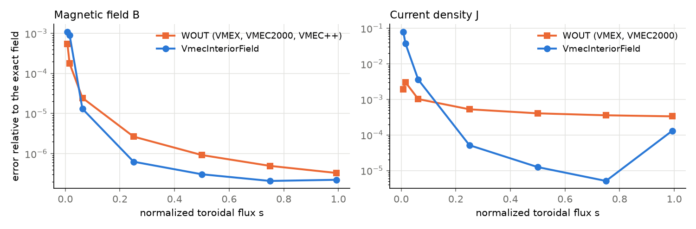

# The interior field and how accurate it is

{class}`~vmex.core.extender.VmecInteriorField` gives B, and its first to third
Cartesian derivatives, at any point inside the plasma. This page explains what
it evaluates, how to use it on a VMEX, VMEC2000 or VMEC++ equilibrium, and how
accurate it is against an exact solution.

## What it evaluates

The field is built from the equilibrium's own Fourier series for R, Z and
lambda, not from the tables stored in a WOUT file. A Cartesian point is first
mapped to flux coordinates (s, theta, phi) by a Newton solve. B then follows
from the native VMEC form

$$
B^\theta = \frac{\chi' - \lambda_\zeta}{\sqrt{g}}, \qquad
B^\zeta = \frac{\Phi' + \lambda_\theta}{\sqrt{g}},
$$

with the Jacobian $\sqrt{g}$ built from the same R and Z series as the
position, so the field is divergence-free in the angles by construction. Between radial
surfaces each coefficient of poloidal mode m is interpolated after dividing by
$s^{m/2}$, the behavior a regular field has near the axis. The axis value of
that scaled coefficient is extrapolated from the first two surfaces. Spatial
derivatives, and so the current $J = \nabla \times B / \mu_0$, are taken by
automatic differentiation in flux coordinates.

## Using it

On an equilibrium from any VMEC-type code, go through its WOUT file:

```python
import numpy as np
import vmex

inp = vmex.VmecInput.from_file("input.my_case")
wout = vmex.read_wout("wout_my_case.nc")          # written by VMEX, VMEC2000 or VMEC++
field = vmex.VmecInteriorField.from_state(inp, vmex.state_from_wout(wout, inp=inp))

points = np.array([[1.05, 0.0, 0.02]])            # Cartesian, inside the plasma
B = field.B(points)
gradB = field.gradB(points)                       # gradB[p, i, j] = dB_i / dx_j
```

## Accuracy against an exact equilibrium

The figure compares the two ways of reading one equilibrium: the fields
stored in the WOUT file, and `VmecInteriorField` built from that file. The
equilibrium is an exact, finite-pressure solution from the integer family of
[Landreman (2026)](https://arxiv.org/abs/2609.26742), solved on 129 radial
surfaces. VMEX, VMEC2000 and VMEC++ produce the same WOUT for it, so the WOUT
curves hold for all three (VMEC++ writes no current harmonics, so only B is
available from its file). Errors are measured at the same points of the
native flux surfaces against the exact B and J.



Away from the axis the interior field is the more accurate way to read the
equilibrium. Between s = 0.25 and 0.75 its current is 10 to 70 times closer to
the exact one (1.3e-5 against 4.1e-4 at s = 0.5), and B is 2 to 4 times
closer. The WOUT current is a derived quantity on a staggered radial grid;
away from the axis its error stays between 3e-4 and 1e-3.

Within the first few surfaces the WOUT current is better. There, the error of
the solved state itself is larger than the error of reading it. On the
integer 3-D case at NS = 129, the exact solution projected onto the same
representation, with no solve, has a current error of 2e-5 at s = 1e-4. The remaining near-axis error therefore comes
from the discrete equilibrium, not from the evaluator.

The WOUT format fixes what is stored, and VMEX writes it the same way as
VMEC2000 so that existing tools keep working. For accurate B, J or field
derivatives inside the plasma, use `VmecInteriorField`.

The data and the scoring code are in the [analytical benchmark](https://github.com/rogeriojorge/vmex-benchmark-analytical),
which also compares VMEX, VMEC2000, VMEC++ and DESC on further exact cases.
The plotted numbers are in `benchmarks/interior_field_vs_wout.json`.
