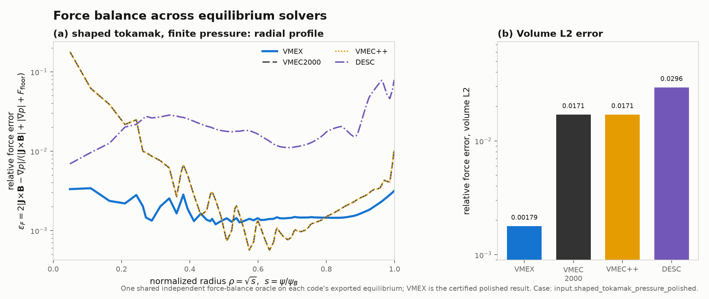
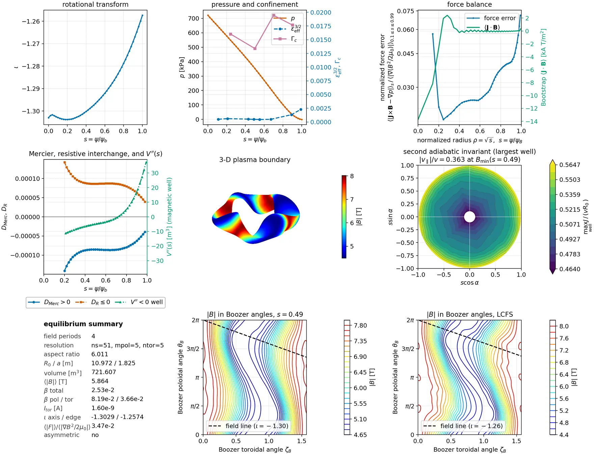

# What is validated, and against what

This page is the map of VMEX's evidence. For every class of claim the code
makes, it names the gate that enforces it, the tolerance in that gate, and
the artifact behind the number. It also names what is *not* validated, which
is the part a reader checking a solver actually needs.

Two rules run through the whole page. Where a number appears here it is a
tolerance some test asserts or a value some committed artifact records — not
a remembered result. And where the honest answer is "this is a record, not a
gate", the page says so instead of implying coverage.

## The evidence hierarchy

VMEX uses five complementary types of evidence. Each addresses a different
question; none alone establishes accuracy for every supported model.

1. **Analytic limits.** The answer is known in closed form, so agreement is
   evidence about the implementation within that analytic model. The true
   Solov'ev projection and mirror paraxial/vacuum identities are here.
2. **An independent oracle.** A second implementation of the physics, written
   against a different discretization, scores the same equilibrium. VMEX's
   continuum force-balance oracle is here. Independence must be checked for
   the specific derivative, representation and normalization under test;
   analytic and native cross-code tests provide complementary checks.
3. **Reference-code parity.** VMEC2000 is the reference implementation; VMEX
   reproduces its trajectory and its output file. This is the largest tier by
   test count, and its weakness is structural — it can only show that VMEX
   agrees with VMEC2000, never that either is right.
4. **Internal consistency.** Adjoint against finite difference, forward
   against transpose, CPU against accelerator, one lane against another.
   These catch implementation error, not modelling error.
5. **Committed records without a gate.** Measurements that are stored and
   hashed but that no test asserts on. They are provenance, not validation,
   and this page marks them as such.

`tests/manifest.json` classifies every test by the oracle it checks against,
so the balance of tiers is countable rather than asserted:

```bash
python -c "import json,collections; print(collections.Counter(
    r[6] for r in json.load(open('tests/manifest.json'))['records']))"
```

On VMEX 0.11.0 that reads `analytic` 53, `vmec2000` 18, `fd` 17,
`none` 17, `external` 10, `golden` 7. Run it rather than trusting the
snapshot; it moves with every test added.

## VMEC2000 parity, tier by tier

Parity is checked at four different resolutions of detail. Each tier is a
separate suite with its own gate.

### Trajectory: the same iterations, not just the same answer

`tests/test_parity_breadth.py` runs six decks — `DSHAPE`,
`circular_tokamak`, `li383_low_res`, `LandremanPaul2021_QA_lowres`,
`nfp4_QH_warm_start`, `up_down_asymmetric_tokamak` — against stored VMEC2000
goldens and asserts:

| quantity | gate |
|---|---|
| convergence | `fsqr`, `fsqz`, `fsql` all at or below the deck `ftol` |
| iteration count | within `[0.75 g, ceil(1.25 g)]` of the golden `g` |
| `wb` | relative difference below `1e-7` |
| mode tables `xm`, `xn` | bit-exact |
| `iotaf` | `rtol=1e-5` |
| `rmnc`, `zmns` (and the LASYM partners) | `rtol=1e-5` on three surfaces: axis-adjacent, mid, edge |

The iteration window is the one to read carefully. Iteration counts are the
parity quantity that legitimately moves with the floating-point path, so the
enforced gate is `+-25%`, not equality — even though the counts observed on
the recorded runs match exactly on most decks. Anywhere this documentation
prints an iteration table, it is reporting what a run did, not what CI
requires.

Two decks carry a looser harmonic `atol` because their goldens are
NITER-capped rather than converged: `5e-6` for `LandremanPaul2021_QA_lowres`
and `2e-5` for `up_down_asymmetric_tokamak`. For the latter, a fully
converged VMEC2000 rerun agrees with VMEX's converged core to `7.3e-7` on
every checked harmonic. Two decks are deliberately absent:
`NuhrenbergZille_1988_QHS` (over the 120 s budget, no golden in the bundle)
and `cth_like_free_bdy_lasym_small` (free boundary).

These tests need no VMEC2000 binary — they read a stored, sha256-verified
golden bundle, resolved from `VMEX_GOLDEN_DIR`, then `~/vmex_notes/golden`,
then a verified download. Tests that do need a live binary are marked
`vmec2000_live` and run only under `--run-vmec2000`.

```{figure} /_static/figures/readme_convergence.webp
:alt: force-residual traces for VMEX, VMEC2000 and VMEC++ on the NFP=4 QH case
:align: center
:width: 90%

Parity along the whole trajectory, not only at the endpoint: total force
residual per iteration for the bundled NFP=4 QH case at `ns=51` through all
three codes. Regenerate with
`python benchmarks/make_readme_figures.py --only convergence`.
```

### Scalars: a cheap gate that needs no golden bundle

`tests/golden_digests.json` stores ten scalars per case (`wb`, `wp`,
`aspect`, `volume_p`, `betatotal`, `b0`, `betapol`, `betator`, `rmax_surf`,
`rmin_surf`), the `iotaf` and `presf` endpoints, and two boundary geometry
checksums. `tests/test_golden_digests.py` compares them at `rtol` `2e-4` for
`wb` and `aspect`, `5e-4` for the volume, field, extent and geometry
checksums, `3e-3` for the `iotaf` endpoints, and `3e-3` by default, all with
`atol=1e-8` so quantities passing through zero do not produce false
failures. Two cases run on every pull request; five more run under
`RUN_FULL=1`. Regenerate with `python tools/make_golden_digests.py`.

### The output file: every variable, by class

`tests/test_wout_golden.py` compares a written `wout` against the golden
one variable at a time on `solovev`, `cth_like_fixed_bdy`, `li383_low_res`
and `up_down_asymmetric_tokamak`. It asserts structure first (same
variables, dimensions and dtypes, no unexpected additions) and then values
under a per-variable policy rather than one global tolerance:

- geometry, pressure, flux and axis arrays: `rtol=1e-6`, `atol=1e-7`;
- Jacobian, field and contravariant families: `rtol=5e-5`;
- `iotaf`/`iotas`: `rtol=1e-5`; scalars: `rtol=1e-6`;
- near-zero covariant channels and near-axis rows get their own atol and skip
  the first two surfaces, because a relative tolerance is meaningless there;
- the Mercier family gets `rtol=5e-2` with a scale-relative atol.

The loose Mercier tier is not a claim that Mercier terms agree to 5%; it is a
bound chosen to catch normalization regressions in quantities built from
nested radial derivatives. A separate drift tier applies to decks whose
`ftol` is above `1e-9`, where the two trajectories are not comparable
coefficient by coefficient.

### Fresh decks, never benchmarked before

`benchmarks/fresh_decks_vs_vmec2000_2026-09-02.json` records six decks that
had never been run on VMEX, solved against a locally built `xvmec2000`
(sha256 prefix `f7e9034f7d9d7ae5`): `ITERModel`, `estell_24_scaled`,
`n3are_R7.75B5.7`, `HSX_QHS_vacuum_ns201`, `W7-X_standard_configuration`
and `NuhrenbergZille_1988_QHS`, spanning tokamak, vacuum, finite beta and
net-current cases.

Quote it by its measured maxima, never as "machine precision":

- worst relative difference over all decks and all compared fields:
  **`2.5e-10`**, on `iotaf` for `HSX_QHS_vacuum_ns201`;
- worst `betatotal` difference `2.2e-13`; worst `volume_p` difference
  `1.2e-16`;
- worst boundary coefficient difference `1.4e-17` where it was measured;
- iteration counts identical on five of six decks, and different by exactly
  one on `ITERModel` (1469 against 1470); Jacobian resets identical wherever
  recorded.

`tests/test_performance_docs.py::test_fresh_deck_parity_artifact_is_provenanced_and_cited`
guards the record's provenance and requires {doc}`/reference/performance`
to cite it by path.

## Continuous force, native states and WOUT reconstruction

`vmex.core.strong_force` evaluates Cartesian `J × B − ∇p` independently of
VMEC's discrete force residual. Its current/field tests include analytic
fields and a native DESC reference. The closed-form finite-pressure Solov'ev
state in `tests/test_strong_force_solovev.py` additionally verifies radial
and Fourier convergence: this tests representation and differentiation of a
known equilibrium, not convergence of a VMEX solve to that equilibrium.

### Cross-code reconstruction record

[`benchmarks/strong_force_comparison_m4.json`](../../benchmarks/strong_force_comparison_m4.json)
contains the following historical values of pointwise-normalized force L2
after each output has been sampled to WOUT and reconstructed by VMEX:

| WOUT source | shaped tokamak | NFP=2 QA |
|---|---|---|
| VMEX | 0.00179 | 0.52590 |
| VMEC2000 | 0.01711 | 0.52518 |
| VMEC++ | 0.01711 | 0.52518 |
| DESC | 0.02962 | 0.87926 |

These are **reconstruction measurements, not a ranking of native solvers**.
The VMEX tokamak output includes polishing and a denser export mesh; the QA
row does not demonstrate certified 3-D polishing. The original cases were
selected for successful tokamak polishing, so they do not establish how often
it helps on other configurations.



The separate [native DESC record](../../benchmarks/desc_native_vs_lifted_2026-09-03.json)
reports `<|F|>/<|grad p|> = 4.01e-6` on DESC's own shaped-tokamak equilibrium.
Exporting that state to 129 surfaces and fitting VMEX splines gives pointwise
normalized L2 `7.13e-2`. Those two norms are different; their quotient is not
an error amplification factor. They establish that the old table cannot be
used to claim VMEX is more accurate than DESC. A solver comparison must
independently refine each native representation and use the same physical
norm, region, boundary, profiles and flux conventions.

Figure/source hashes remain checked in
`tests/test_performance_docs.py::test_validation_strong_force_figure_matches_committed_sources`.
The checks preserve this historical record; they do not rerun the solvers or
certify a native accuracy ordering.

### Force-balance polish

`examples/force_balance_polishing.py` polishes `input.shaped_tokamak_pressure`
and reads both WOUT files back on the polished spline basis: the RMS force
falls from 2.0e5 to 42 N m<sup>-3</sup> over the volume, 9.8e5 to 190 near the
axis and 3.2e3 to 23 at the edge, with projected stationarity 1.3e-10; the
written file reproduces the native certificate. The pointwise
`eps_F = 2|F|/(|J×B|+|grad p|+floor)` is bounded above by 2 by construction
and cannot rank near-vacuum states, so read the dimensional force with it.
The polish covers fixed-boundary axisymmetric decks with prescribed pressure
and iota; a 3-D polish is future work. See the
[method reference](high-order-force-balance.rst).

## Application record: finite-beta QI diagnostics

The bundled `input.nfp4_QI_finite_beta` run reached **2.53% beta** at
`ns=51` in 2,599 iterations. This is an equilibrium/diagnostic example, not
a new optimization result or a continuous-force certificate. The README's QA
panel, from the bundled `input.nfp2_QA_finite_beta`, reached **2.70% beta** at
`ns=45` in 757 iterations and is the same kind of example. Their inputs,
figures and solve provenance are recorded in
[readme_diagnostics.json](../_static/figures/readme_diagnostics.json).



## Derivative certificates

Implicit gradients describe a converged discrete equilibrium. Their validity
requires nonlinear convergence and a sufficiently accurate linear response
solve. The tests below check particular cases; they do not guarantee that
every returned state satisfies both conditions. The ordinary refinement
fallback and polished nonlinear stationarity gate remain under review.

**Fixed boundary** (`tests/test_implicit_grad.py`, `tests/test_implicit_grad_fd.py`). Four adjoint gradients on
`solovev` — `d(wb)/d(RBC)`, `d(aspect)/d(RBC)`, `d(wb)/d(phiedge)`,
`d(wp)/d(pres_scale)` — must match central finite differences to
`rel <= 1e-6`. The 3-D `li383_low_res` boundary gradient is checked at
`rtol=2e-4` against a finite difference whose own noise floor is about
`3e-5`. The adjoint preconditioner has its own certificate: the
preconditioned residual falls below `1e-10` within 300 matrix-vector
products while the raw residual stays above `1e-6`, a ratio above `1e4`.

**Free boundary** (`tests/test_freeboundary_implicit.py`). The coupled
plasma-vacuum root's reverse derivative is certified factor by factor at a
frozen root, with no re-solve: each factor to relative error below `1e-6` and
the transpose duality below `1e-11`. The coupled GCROT, edge-response and
boundary-Schur adjoints must agree to `1e-6` relative. Coil-current gradients on
an asymmetric DIII-D deck and on NCSX are also compared with central differences of
independent free-boundary re-solves, at `rtol=2e-2`; that gate is set by
where the solver stops, not by the adjoint.

**End to end** (`tests/test_examples.py::test_take_fixed_boundary_gradients`). The bundled
example prints its adjoint-versus-finite-difference agreement and the test
fails above `1e-4`. Documentation quotes that gate rather than a particular
run's number.

For solver-sensitive outputs — `iota`, `DMerc`, `jdotb`, `D_R` — an
insufficiently converged re-solving finite difference can be dominated by
solver noise. The frozen-path checks in
{doc}`/explanation/adjoint-gradients` isolate linearization consistency; they
do not replace an independently converged perturbation study of the physical
objective. That study needs a step-size convergence interval and explicit
checks that perturbed solves remain on the same admissible branch.

## Free boundary: the ladder

Free-boundary evidence is built in rungs, each with its own gate.

1. **The vacuum operator.** `tests/test_freeboundary.py` pins the NESTOR
   solve against a reference at `rtol=1e-12`, asserts bit-exactness of the
   skip branch, and matches the first-call diagnostics against the golden
   VMEC2000 print block.
2. **The radial ladder with an mgrid.**
   `tests/test_freeboundary_multigrid.py` matches VMEC2000 through the
   pre-vacuum stages, pins `r00` to `2e-10` relative, and requires the
   converged multigrid state to agree within `1e-2` on geometry and `1.5e-2`
   on `iota`.
3. **A second 3-D geometry.** `tests/test_ncsx_free_boundary_parity.py`
   reproduces the published NCSX c09r00 mgrid currents at `rtol=1e-12` and
   the field components at `rtol=1e-8`, from a coil file recorded by sha256.
4. **High mode count.** `tests/test_high_mode_free_boundary_parity.py` takes
   the 238-mode CTH-like free-boundary ladder to `fsqr <= 1e-8` and pins
   `r00` and `wb` against VMEC2000 at `1e-4` and `2e-4`.
5. **Finite beta.** The beta-scan panels are recorded in
   `docs/_static/figures/freeb_diiid_mgrid_beta_ns101_panel_summary.csv`
   (mgrid, to 3.33% actual beta) and
   `freeb_lpqa_direct_coil_beta_ns101_panel_summary.csv` (direct coils, to
   1.93%), both holding `fsq_total` near `1e-12` across the scan.

Rung 5 is tier 5 evidence: those CSVs, and
`docs/_static/figures/pr20_wout_parity_summary.json`, are committed records
that **no test asserts on**. They are provenance for a campaign that was
run, not gates that would fail if the physics regressed. Read them as such.

## Mirror geometry: analytic limits

The mirror module is the one place where the answer is known in closed form,
so `tests/mirror/test_analytic.py` is tier 1 evidence. Vacuum and flux
identities hold to round-off: curl and divergence residuals at `atol` `2e-15`
to `2e-14`, flux preservation at `rtol=3e-15`, the Riccati residual of the
rotating-ellipse construction at `2e-15`, and the endpoint quarter-turn to
`2e-15`.

Two gates are genuinely physical rather than round-off. The straight-field-line
mirror's ellipticity and its flux-area-times-axis-field product are checked at
`rtol=5e-4` — that is the paraxial truncation error at the chosen aspect
ratio, not a numerical tolerance. And
`tests/mirror/test_boundary_conditions.py` checks long-thin pressure balance
with an *aspect-ratio-scaled* bound: the deviation of $p + B^2/2\mu_0$ across
the midplane must stay within $1.5\,\epsilon^2$ of the magnetic scale,
where $\epsilon = a/L$, and the magnetic rise must cancel the pressure drop
to $2\,\epsilon^2$. That is the diamagnetism certificate.

## Downstream parity

Equilibria are inputs to other codes, so several tests check what those codes
see rather than what VMEX stores.

| consumer | compared | gate |
|---|---|---|
| Boozer tables (`vmex.core.boozer_tables`) | `bmnc`, `R`/`Z` tables, `iota`/`G`/`I` against the wout rows | `rtol=1e-8` |
| ESSOS field handoff | `AbsB` and coordinates, wout path against in-memory equilibrium | `rtol=0.0` (exact) |
| `neo_jax` effective ripple | `epsilon_eff` on three surfaces | `rtol=5e-5` |
| DESC | pointwise current and force through the shared oracle | `rtol=3e-13` / `3e-10` |

The ESSOS and `neo_jax` tests are `importorskip`-gated, so they run in the
nightly optional-integrations lane and silently skip in the dependency-minimal
core lane. A green core run is not evidence that they passed.

## Alpha tracing mode cut and field derivatives

`benchmarks/trace_mode_cut.py` checks every requested cut against the uncut
Boozer spectrum on three surfaces (`s = 0.25, 0.5, 0.9`). The audit used 31
tracked WOUTs from [vmec_equilibria](https://github.com/landreman/vmec_equilibria)
at commit `41fcf8b`, the two matched tokamak WOUTs in
[VMEX PR #514](https://github.com/uwplasma/vmex/pull/514), and the
Landreman-Paul QA (`ESSOS/examples/input_files`, commit `e77c6a0`) and QH
(`simsopt/tests/test_files`, commit `2b39098`) examples. One LASYM WOUT
cannot enter the current
stellarator-symmetric Boozer tracer; the table summarizes the other 34
equilibria (102 surfaces). Errors are relative root-mean-square errors over
Boozer angles using the *same radial spline* as ESSOS, rather than a comparison
of Fourier amplitudes alone. The angular-gradient norm includes both poloidal
and toroidal derivatives.

| mode cut | median modes | median `|B|` error | median radial derivative error | median angular-gradient error | worst angular-gradient error | ARIES modes | ARIES lost / 512 | matching labels |
|---|---:|---:|---:|---:|---:|---:|---:|---:|
| 1e-4 | 116 | 0.0096% | 0.41% | 1.24% | 6.6% | 118 | 18 | 100% |
| 2e-4 | 90 | 0.0188% | 0.81% | 2.32% | 12.6% | 89 | 27 | 93.95% |
| 3e-4 | 73 | 0.0309% | 1.13% | 3.34% | 16.0% | 71 | 17 | 96.29% |
| 5e-4 | 58 | 0.0524% | 1.62% | 5.02% | 22.0% | 55 | 26 | 94.14% |
| 6e-4 | 53 | 0.0585% | 1.81% | 5.69% | 24.4% | 55 | 26 | 94.14% |
| 8e-4 | 45 | 0.0778% | 2.26% | 6.91% | 27.3% | 46 | 30 | 94.14% |
| 1e-3 | 37 | 0.1022% | 2.61% | 7.75% | 30.2% | 39 | 21 | 94.73% |

The timed ARIES-CS row uses 512 common births drawn from the `1e-5` field at
`s = 0.3`, 2 ms, a nominal
`1.25e-7 s` step, 20 saved times and eight CPU devices on an Apple M2, with
the corrected VMEC flux sign. The host was contended during this timing run:
the identical 55-mode fields at 5e-4 and 6e-4 had different median times
(26.51 and 23.25 s). Those times are not a speed ranking. More importantly,
even 2e-4 changes 31 of 512 individual lost/confined labels relative to
1e-4; a similar total loss count does not imply the same orbits. The short
2 ms horizon cannot validate a rare-loss configuration.
Across the 34 cases, angular and radial derivatives deteriorate much faster
than `|B|` itself. The existing `1e-4` default remains a conservative
starting point among the tested cuts; check tighter spectra, timesteps and
individual losses on the intended field before relying on it.

The precise Landreman-Paul QA field is a rare-loss check. The same 1,000
births at `s = 0.3` were followed for 10 ms at all seven cuts, with the
corrected VMEC flux sign. Times are medians of three warmed traces on eight
Apple M2 CPU devices; field construction and JIT compilation are excluded.
The 3e-4 and larger cuts retain the same three modes. Their 99% overall
label agreement hides a 62.5% loss-count reduction (16 to 6).
At `1e-4`, halving the 10 ms QA timestep from `1.25e-7` to `6.25e-8` s
preserves all 16 loss IDs and all 1,000 labels; maximum relative energy
error falls from `6.75e-5` to `9.10e-6`.

| mode cut | QA modes | QA lost / 1000 | baseline losses recovered | labels matching 1e-4 | QA trace [s] |
|---|---:|---:|---:|---:|---:|
| 1e-4 | 16 | 16 | 16/16 | 100% | 34.74 |
| 2e-4 | 7 | 14 | 13/16 | 99.60% | 23.45 |
| 3e-4 | 3 | 6 | 6/16 | 99.00% | 9.13 |
| 5e-4 | 3 | 6 | 6/16 | 99.00% | 9.08 |
| 6e-4 | 3 | 6 | 6/16 | 99.00% | 10.08 |
| 8e-4 | 3 | 6 | 6/16 | 99.00% | 10.24 |
| 1e-3 | 3 | 6 | 6/16 | 99.00% | 9.34 |

The earlier HSX orbit table used the incorrect VMEC flux sign and is withdrawn.
Even after correcting the sign, a 500-birth, 5 ms HSX check at `1e-4` changed
37 individual loss labels when the timestep fell from `6.25e-8` to
`3.125e-8` s, then changed 34 more when it fell to `1.5625e-8` s.
Total losses were 86, 85 and 81; maximum relative energy errors were
`2.59e-3`, `8.90e-5` and `5.04e-6`. The seven-cut HSX run at the largest
timestep is exploratory timing data, not a cutoff accuracy result.
Changing the number of saved states at fixed effective timestep left the
same births bitwise identical. Changing the particle batch size introduced
roundoff-scale differences that grew over milliseconds, consistent with
chaotic orbit sensitivity rather than a changed step count.
Converge the timestep and check energy on the intended field before judging a
mode cut from its losses.

A shorter 0.5 ms HSX comparison keeps 500 common births and uses an eighth
step (`1.5625e-8 s`), 101 saved times and eight Apple M2 CPU devices. All
seven cuts have zero failed orbits and maximum relative energy error below
`3.1e-7`. Times are medians of three warmed runs:

| mode cut | modes | lost / 500 | baseline losses recovered | labels matching `1e-4` | trace [s] |
|---|---:|---:|---:|---:|---:|
| 1e-4 | 157 | 23 | 23/23 | 100.0% | 39.97 |
| 2e-4 | 118 | 23 | 16/23 | 97.2% | 31.01 |
| 3e-4 | 102 | 21 | 14/23 | 96.8% | 26.56 |
| 5e-4 | 75 | 18 | 10/23 | 95.8% | 20.64 |
| 6e-4 | 64 | 20 | 13/23 | 96.6% | 29.06 |
| 8e-4 | 50 | 23 | 13/23 | 96.0% | 22.29 |
| 1e-3 | 42 | 16 | 9/23 | 95.8% | 19.34 |

At the baseline cut, quarter and eighth steps still disagree on 3 of 500
labels. A tighter `1e-5` spectrum (364 modes) at the eighth step also loses
23 particles but shares only 15 loss IDs with `1e-4`: 16 labels differ, and
`1e-4` recovers only 15/23 losses. Against `1e-5`, `2e-4` recovers 13/23
losses and changes 20 labels. The tighter run has no failed orbits and a
maximum relative energy error of `3.00e-7`; its single warmed trace took
122.09 s, too few repetitions for a stable speed comparison. Thus `1e-4`
is **not cutoff-converged for HSX losses**, and `1e-5` is a tighter reference,
not proven physical truth. These spectral effects exceed the measured
3-label timestep change. The nonmonotonic CPU times at `6e-4` and `8e-4`
also show that mode count alone is not a reliable runtime predictor.

To reproduce the spectral table after checking out or merging PR #514, run
`python benchmarks/trace_mode_cut.py PATH_TO_VMEC_EQUILIBRIA examples/data
PATH_TO_QA_WOUT PATH_TO_QH_WOUT --out cuts.json`. Add `--particles 512
--tmax 0.002 --devices 8 --save-times 20 --birth-cut 1e-5` for the ARIES
orbit timing protocol.
The script records each equilibrium, surface, cut, mode count and error in
JSON. The orbit option uses fixed births and reports losses, baseline-loss
recall, label agreement, energy error and compile and warm times for all seven cuts.
For the QA table, pass its WOUT alone with `--particles 1000 --tmax 0.01
--devices 8 --repeats 3 --save-times 101`.
For the seven-cut HSX table use `vmec_equilibria/HSX/QHS_vac/wout_HSX_QHS_vac.nc`
with `--particles 500 --tmax 0.0005 --devices 8 --save-times 101
--birth-cut 1e-4 --step-factor 0.125 --repeats 3`. For the 5 ms timestep
check, use that WOUT with `--particles 500 --tmax 0.005 --devices 8
--orbit-cuts 1e-4 --step-factor 0.5`, then 0.25 and 0.125.
For the tighter HSX reference, use the 0.5 ms command with
`--orbit-cuts 1e-5 --repeats 1`; keep `--birth-cut 1e-4` to preserve births.

**Where tracing time goes.** ESSOS evaluates the Boozer `|B|` series and its
derivatives at four RK4 stages, then evaluates `|B|` again to track the maximum
energy error at every step. Retaining fewer harmonics reduces this repeated
work but can remove small modes that control losses. ESSOS
[PR #92](https://github.com/uwplasma/ESSOS/pull/92) tried angle-addition
tables: it was 1.8× faster for a single-device, 135-mode test, but 10% slower
for the 10-device, 500-particle VMEX workload; that change is not ready to
replace the current kernel. Checking energy only at saved times also changes
the reported maximum. Reusing a full field evaluation at a step endpoint for
the next step could save work while retaining the every-step energy check;
this still needs a benchmark and a test that the orbits agree.

## Cross-code alpha trace comparisons

The [tracing guide](../howto/trace-alpha-particles.md) gives the exact
seed-WOUT recipe and three-code command.

On one i7-3820 host with eight CPU workers, the same 64 births give:

| tracer | loss result | matching ESSOS labels | warm trace time | maximum reported relative energy drift |
|---|---:|---:|---:|---:|
| ESSOS Boozer RK4 | 55 | 64 | 1.701 s | 1.66e-6, every step |
| SIMPLE symplectic Euler, `npoiper2=512` | 55 | 64 | 5.078 s | 1.25e-3, 401 saved states |
| SIMPLE symplectic midpoint, `npoiper2=256` | 55 | 64 | 5.247 s | 1.20e-5, 401 saved states |
| SIMSOPT `gc_noK`, [sign fix](https://github.com/hiddenSymmetries/simsopt/pull/664), axis stop | 50/58 resolved; 6 axis stops | 58/58 resolved | 0.415 s | 6.77e-4, all resolved path states |

The methods and output policies differ: ESSOS returns 101 states and checks
energy every fixed step; SIMPLE saves 401 macrostep states, and SIMSOPT checks
all adaptive states of its resolved paths. Without saved-orbit output, SIMPLE
Euler and midpoint take 1.898 and 3.469 s, respectively; their endpoint-only
energy errors are `8.28e-4` and `8.03e-6`. The Euler saved-path error exceeds
the default `1e-3` benchmark limit, so the retained script defaults to
midpoint and checks saved-path energy.
Several unguarded SIMSOPT paths enter `s < 0`, where its Boozer angle is
ill-defined; their matching terminal loss labels do not validate those paths.
Saving adaptive intermediate states reveals a maximum `4.88e-3` energy
excursion near the axis. With the inner-flux stop, the maximum drift across
all resolved path states is `6.77e-4` on both the i7-3820 and Apple M2.
For two stopped births, sampled SIMPLE midpoint and ESSOS paths remain above
the `s=0.001` stop surface while SIMSOPT reaches it; these stops may reflect
near-axis field-interpolation differences, and the other codes' saved states
can miss a finer axis approach. Their physical outcome remains unresolved.

These are trace-only times after field construction and compilation. In a fresh
same-host run, ESSOS takes 4.526 s from WOUT to its 12-mode field and
5.541 s for its first trace including JIT. SIMPLE spends 8.055 s in
field/start setup; its no-orbit-output Euler trace takes 1.890 s, giving
9.949 s through output in that run. With 401 saved states, the midpoint
trace takes 5.247 s. SIMSOPT spends 130.728 s converting and tabulating the
field before the guarded 0.415 s trace. Repeated trace speed therefore does
not measure the cost of a single calculation.

The larger GPU comparison requests 101 sample times on a GTX TITAN X hosted by
an i7-3820 CPU.
CATAPULT truncates trajectories at loss (median four stored rows across this
ensemble); ESSOS returns 101 states per particle.
ESSOS retains 12 Boozer modes at cut `1e-4` and takes 16,000 fixed RK4 steps
(`dt=1.25e-7 s`). CATAPULT uses a 25×25×25 tricubic field table and adaptive DP5
at tolerance `1e-10`. Times are warmed and exclude field setup and JIT:

| tracer | lost / 1,024 | labels matching ESSOS | trace [s] | maximum confined-orbit energy drift |
|---|---:|---:|---:|---:|
| ESSOS Boozer, default lookup and [kernel PR #95](https://github.com/uwplasma/ESSOS/pull/95) | 795 | 1,024 | 14.72 | 2.08e-6 |
| ESSOS Boozer, [GPU lookup PR #98](https://github.com/uwplasma/ESSOS/pull/98) | 795 | 1,024 | 3.81 | 2.08e-6 |
| CATAPULT, released radial interpolant | 802 | 1,017 | 4.88 | 7.84e-3 |
| CATAPULT, [axis fix PR #90](https://github.com/ColumbiaStellaratorTheory/firm3d/pull/90) | 795 | 1,024 | 4.68 | 3.54e-4 |

The ESSOS lookup change leaves all saved states, loss times and energy
diagnostics bitwise identical; it also improves 100- and 300-knot GPU
workloads without a measured eight-device CPU regression.
With the same tabulated field, births and requested output on one host CPU
core (FIRM3D's serial CPU particle loop), patched FIRM3D takes 74.67 and
74.70 s in two warmed runs. It loses the same 795 particles and has maximum
all-path relative energy drift `3.55e-4`.
On the same host, the ESSOS Boozer kernel traces those births in 18.15 s using eight CPU
devices; its one-device run takes 260.76 s. These CPU timings measure
different particle-parallel policies.
On the seven axis-sensitive births, the separate *spectral* FIRM3D CPU solver
at adaptive tolerance `1e-10` changes from seven spurious losses and maximum
energy drift `1.22e-2` to zero losses and `4.75e-9` after the patch.

All seven released-CATAPULT disagreements pass close to the axis (`s<0.03`).
Its Boozer radial interpolation gives a nonzero `m=1` magnetic-field
harmonic on the axis. Zeroing all `m>0` axis coefficients and using the same
spline's derivative for `dB/ds` removes those seven losses and sharply
reduces Hamiltonian drift. The regularization is proposed in [FIRM3D PR #90](https://github.com/ColumbiaStellaratorTheory/firm3d/pull/90)
and remains experimental until merged. A DESC run independently confines those seven births through
0.2 ms. On a re-solved `ns=101` equilibrium, ESSOS and regularized FIRM3D
both lose the same one of the seven; unmodified FIRM3D loses two. This
resolution check matters because axis crossings are sensitive to sparse
radial data. The PR enforces the axis value and a consistent derivative, but
its cubic-in-`s` `m=1` mode is still an approximation to the regular
`sqrt(s)` behaviour. Along 40 sampled points with `s<0.03`, the patched
FIRM3D and ESSOS fields differ by up to 0.381% in `|B|`. Matching labels on
this ensemble is not a general convergence guarantee. The [ESSOS README](https://github.com/uwplasma/ESSOS/pull/94)
compares methods and features in more detail.

## Device and lane consistency

Float64 is required and enforced at solver import. Across devices the
contract is numerical equivalence, not bit-identity — the batched tridiagonal
solver on an accelerator is a different algorithm from the CPU Thomas sweep.

`tests/test_gpu_ci.py` (marked `gpu`, skipped without a real device) pins
CPU-against-GPU agreement per quantity: `1e-10` for the confinement
diagnostics, `5e-10` for the forward solve, `5e-9` for a converged LASYM free
boundary, and `2e-7` for implicit gradients, which are the loosest because a
reverse pass accumulates over the whole trajectory. A separate test asserts
that no `JAX_PLATFORMS` pin is in the environment and that the default
backend really is the GPU, so a silently-CPU run cannot pass as a GPU lane.
`benchmarks/device_parity.py` is the standalone audit; its default tolerance
is `rtol=1e-7`, recorded in every output JSON it writes.

Lane consistency — jit against eager, and the traced against the stepped
lane — is checked where it matters rather than in one suite: the Boozer
tables, the setup and geometry chains, the mgrid path and the bootstrap
state-versus-wout lanes each carry their own comparison. Note that the test
session disables JIT globally and solver-heavy modules opt back in, so a
module without that fixture is exercising the interpreted path.

## What is NOT validated

This section is deliberately specific. Absence of a claim here does not mean
a claim exists elsewhere.

- **Free-boundary forward derivatives.** JVPs are `not-available`. The
  reverse derivative of the reconverged free-boundary root is `limited` and
  explicitly experimental, CPU only. Low-memory GPU compilation and failed-trial
  handling are open promotion gates. `tests/test_capability_docs.py`
  asserts these statuses, so the claim cannot quietly widen.
- **Free-boundary roots are anchored, not free.** A converged free-boundary
  solve at `ftol = 1e-12` sat about 1.2e-2 from the root of its projected
  coupled residual in coefficient norm on the 0.5 % beta single-stage deck,
  and warm restarts from different references gave values differing by up to
  12 %. The implicit free-boundary solve now Newton-anchors every certifiable
  state on that root (#432), where the adjoint is exact (1e-9–6e-7 against
  finite differences of anchored roots); `refine_tol=inf` skips the anchor.
  The Newton work is an extra cost per trial.
- **Zero-beta free boundaries that meet an island chain.** VMEC's model needs
  a nested flux surface that encloses PHIEDGE. When the coil field has an
  island chain or stochastic layer at that flux, no such equilibrium exists.
  VMEX, VMEC2000 and VMEC++ then limit-cycle instead of converging. One
  optimized single-stage coil set had a 4/9 chain at the boundary, confirmed
  by field-line tracing. Nothing in VMEX detects this yet. Check it by
  field-line tracing, or by whether the coil-field B.n/B on the boundary falls
  with resolution.
- **Mirror beta above 10%.** The axisymmetric open-mirror free-boundary lane
  is supported to 10% requested beta. The 25%, 50% and 80% cases converge
  variationally and the 80% case passes its force gate, but refined-grid
  promotion is incomplete and they remain extended validation.
- **Anisotropic and ANIMEC-derived equilibria.** Not implemented.
- **Untested `wout` modes.** Parity is claimed for the variables the golden
  comparison covers. Fill-valued or untested modes are not covered.
- **Parsed input names.** Recognizing a VMEC2000 namelist name is not
  evidence that the solver uses it. Unsupported physics fails with a typed
  error rather than being silently ignored.
- **The 2D block preconditioner as a speed feature.** Its evidence is an
  iteration-count reduction and a `wb` agreement, not a wall-clock or memory
  win; it is opt-in for that reason.
- **Recovery of an analytic equilibrium.** The constant-field and true
  Solov'ev projection tests validate the oracle and representation. They
  do not establish that the nonlinear high-order solve recovers the analytic
  state from a perturbed guess or solves a finite-beta 3-D case.
- **`virtual_casing.py` and `turbulence.py`** are excluded from the coverage
  gate, because their finite-difference gradient tests are optional-dependency
  gated and skip in the core lane.
- **Memory figures** in {doc}`/reference/performance` are measurements on
  particular decks, not high-resolution upper bounds.

## How to rerun any of this

The local gate before pushing:

```bash
python tools/preflight.py --static   # lint, types, docs prose, guard tests
python tools/preflight.py            # also the diff-affected suites
python tools/preflight.py --docs     # also a warning-free sphinx build
```

Test selection is manifest-driven, not path-driven. Every CI lane resolves
its files the same way:

```bash
python tools/test_manifest.py select pr-fast
RUN_FULL=1 pytest -q $(python tools/test_manifest.py select full-core-d-f0)
```

Four pytest markers gate the slower evidence: `full` (needs `RUN_FULL=1`),
`weekly` (high-resolution campaigns, excluded from nightly), `gpu` (needs a
real device; no CI runner has one, so the `gpu-smoke` lane is local-only) and
`vmec2000_live` (needs `--run-vmec2000` and a local `xvmec2000`). There is no `nightly`, `slow` or `live` marker. Passing
`--vmex-report PATH` writes a machine-readable record of what ran, what was
slowest, and — importantly for reading a green run — every test that skipped
and why.

Regenerating the artifacts this page cites:

```bash
python tools/fetch_assets.py --bundle golden-v1     # the VMEC2000 goldens
python tools/make_golden_digests.py                 # tests/golden_digests.json
python benchmarks/run_baseline.py                   # benchmarks/baseline.json
python benchmarks/run_freeboundary_multigrid.py     # the free-boundary ladder
python benchmarks/run_gpu_matrix.py                 # benchmarks/gpu_baseline.json
python benchmarks/preconditioner_2d_stiff.py        # the 2D preconditioner run
python benchmarks/make_strong_force_comparison.py   # the cross-code table
python benchmarks/device_parity.py --devices cpu,gpu --output parity.json
```

Figures carry their own provenance in
`docs/_static/figures/figures.json` — generator, inputs, date, hardware, and
two separate honesty fields: `reproducible` says what it takes to rebuild the
figure, and `bytes_verified` says whether the committed pixels were actually
re-derived and compared. A `command` figure with `bytes_verified` false can
be rebuilt but its committed bytes predate the current renderer. `python
tools/update_figure_manifest.py` refreshes the derived fields, and
`tests/test_figure_provenance.py` fails when a figure and its row disagree.
