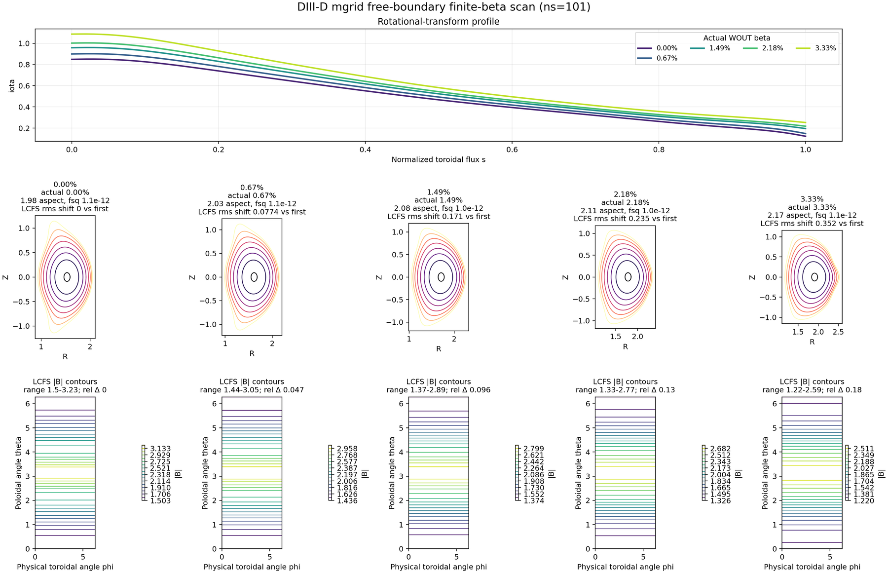
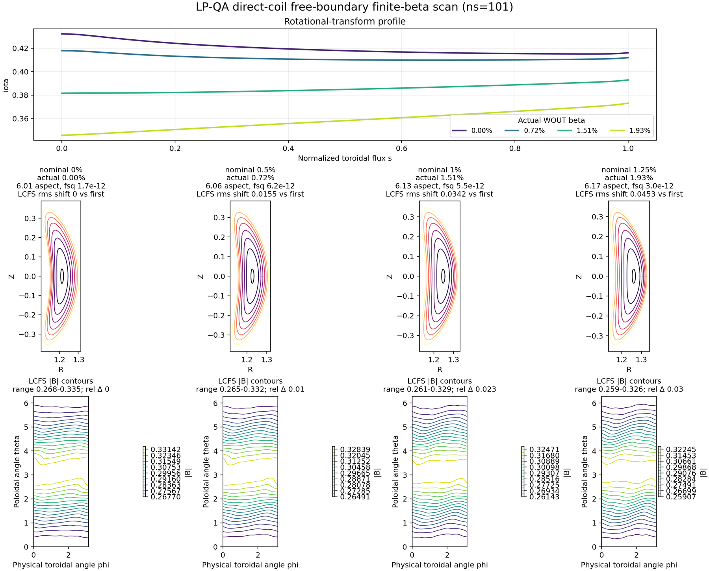

Free-Boundary Coil Optimization
===============================

This page documents the research lane toward true single-stage
free-boundary optimization with differentiable coils. The existing VMEC-compatible
``mgrid`` path remains the VMEC2000-compatibility backend; generated-``mgrid``
WOUT parity is optional/non-promoted unless explicitly stated. The new
direct-coil path evaluates the external field from coil Fourier coefficients
and currents in JAX, so the coil parameters can become the independent
optimization variables.

Architecture
------------

The intended single-stage loop is:

.. code-block:: text

   coil Fourier dofs/currents
      -> differentiable Biot-Savart external field
      -> vmec_jax free-boundary equilibrium
      -> wout/proxy diagnostics
      -> coil-only objective update

Pedagogic forward examples
--------------------------

Two short examples in ``examples/`` show the two free-boundary external-field
paths without hiding the workflow inside a large sweep driver.

The compatibility path uses ESSOS coils to write a VMEC ``mgrid`` file, then
runs ``vmec_jax`` using the same mgrid-style external-field backend used for
VMEC2000 parity:

.. code-block:: bash

   export ESSOS_ROOT=/Users/rogeriojorge/local/ESSOS_mgrid_pr
   export ESSOS_INPUT_DIR=$ESSOS_ROOT/examples/input_files
   PYTHONPATH=.:$ESSOS_ROOT:$PYTHONPATH \
     python examples/free_boundary_essos_mgrid_forward.py --max-iter 10

The direct-coil research path converts the same ESSOS coils to
``CoilFieldParams`` and passes them directly to ``run_free_boundary``.  No
``mgrid`` file is written or read by the solver:

.. code-block:: bash

   export ESSOS_ROOT=/Users/rogeriojorge/local/ESSOS_mgrid_pr
   export ESSOS_INPUT_DIR=$ESSOS_ROOT/examples/input_files
   PYTHONPATH=.:$ESSOS_ROOT:$PYTHONPATH \
     python examples/free_boundary_essos_direct_forward.py --max-iter 10

Both examples accept ``--dry-run`` to write the input deck and JSON summary
without running VMEC.  This is useful for checking the generated namelist,
magnetic-grid bounds, and direct-coil provider wiring.  By default, outputs go
under ``results/free_boundary_essos_mgrid_forward/`` and
``results/free_boundary_essos_direct_forward/``.

Boozer/QS diagnostics are the intended promotion target for this lane, but the
current implementation keeps the single-stage optimization example on a cheap
VMEC residual plus VMEC-state ``qs_total``, aspect, and mean-iota proxy until
complete Boozer/QS full-loop gradient checks pass.

Reviewer-facing validation plots for this lane are committed only as compressed
summary panels. Generated WOUTs, magnetic grids, PDFs, and full-resolution raw
renderings stay out of git. Use the reproduction commands below to regenerate
the architecture, beta-scan, provider-parity, and benchmark figures from JSON
summaries.

Phase 1 in this lane includes JAX-native coil-field sampling, an ESSOS coil
adapter, generated-``mgrid`` compatibility, and forward free-boundary solves
from direct coils. Phase 2 targets the production custom adjoint through the
full free-boundary vacuum/NESTOR solve. Several phase-2 validation rungs are
already implemented on JAX-visible dense or accepted-state problems, but the
production ``run_free_boundary`` nonlinear-loop adjoint is not claimed as
publication-ready until complete-solve AD-vs-finite-difference checks pass. The current
post-merge evidence now includes reusable accepted-trace replay helpers,
accepted-state ``bsqvac`` replay derivatives with respect to the VMEC state,
JAX-visible nonlinear-controller primitives with fixed-length masked
``lax.scan`` control flow, and a fixed-accepted-trace custom-VJP seam for
direct-coil replay objectives.  The fixed-trace path is guarded by accepted
trace fingerprints so finite-difference promotions can reject perturbations
that changed the adaptive host-controller branch. These validate the intended
full-loop adjoint contract, but they are still production-adjacent validation
gates rather than a promoted custom VJP for the host-controlled
``run_free_boundary`` loop.

Adjoint Validation Roadmap
--------------------------

The exact-gradient lane is deliberately staged. The literature points to a
discrete-adjoint implementation around the structured spectral operators and
linear solves, not to reverse-mode differentiation through every nonlinear
iteration. In NESTOR, the free-boundary vacuum contribution is a spectral
integral-equation solve for a Neumann problem on a toroidal surface; this
naturally maps to a JAX-native operator plus an implicit transpose solve. JAX's
``custom_linear_solve`` is the relevant primitive for this layer because it
defines reverse-mode derivatives by solving the transposed linear problem at
the converged solution rather than taping the internals of the linear solver.
This is also consistent with recent spectral-PDE adjoint work, where efficient
adjoints are built from reusable operator graphs, fast transforms, and sparse
or structured linear solves.

The validation ladder is:

1. Provider derivatives: direct Biot-Savart derivatives with respect to coil
   current, Fourier curve coefficients, and evaluation coordinates.
2. Toy implicit vacuum chain: direct coils feed a dense custom-linear-solve
   vacuum problem, and gradients with respect to current and geometry are
   checked against finite differences.
3. Boundary projection: JAX vacuum-boundary projection derivatives with
   respect to sampled cylindrical fields and boundary coefficients.
4. Projected implicit vacuum chain: direct coils feed the JAX boundary
   projection and then a dense custom-linear-solve vacuum problem, with
   current and geometry gradients checked against finite differences.
5. Mode-space NESTOR chain: the same projected boundary data feeds
   ``dense_vmec_nestor_mode_solve_jax``, a JAX-native VMEC-style operator that
   combines source symmetrization, mode-RHS projection, nonsingular
   Green-function source/matrix assembly, analytic/singular ``analyt.f``
   source/matrix assembly, mode-matrix assembly, and dense mode-space solve
   that reconstructs the boundary scalar potential. This validates the
   differentiable operator blocks used by the VMEC-like NESTOR solve on
   low-resolution grids. The high-resolution matrix-free production operator
   remains phase-2 work.
6. Nonlinear fixed-point chain: direct-coil controls feed a dense nonlinear
   fixed-point solve with a custom implicit adjoint. The reusable
   ``direct_coil_projected_mode_fixed_point_jax`` helper implements the
   moving-boundary validation loop: the current state changes where the coil
   field is sampled, the field is projected through the JAX boundary projection
   and mode-space vacuum response, and the response updates the next state. The
   companion ``direct_coil_projected_mode_fixed_point_objective_jax`` helper
   wraps the solved state in a scalar quadratic objective with component
   diagnostics for optimizer-facing AD-vs-FD tests. The reusable
   ``pytree_directional_derivative_check_jax`` helper then compares exact
   pytree directional derivatives against central finite differences. The
   focused tests run that check on the scalar objective with respect to the
   full ``CoilFieldParams`` pytree, verifying finite, nonzero gradients and a
   mixed current/curve-coefficient directional derivative. This validates the
   mathematical reverse pass needed by the production free-boundary fixed-point
   wrapper: solve ``F_x^T lambda = dJ/dx`` at the accepted root and apply
   ``-F_p^T lambda`` to coil/current parameters. This is still a dense
   validation primitive, not the production VMEC nonlinear loop.
   The same phase-2 work now also includes a JAX-visible nonlinear-controller
   primitive: ``jax_visible_nonlinear_controller_jax`` and
   ``jax_visible_masked_nonlinear_controller_jax`` model a fixed-length
   differentiable controller with an on-device convergence mask. The tests
   check controller-level AD-vs-central-FD behavior for a direct-coil
   moving-boundary objective with current and Fourier geometry controls. This
   is the concrete replacement pattern for differentiating through
   convergence/early-stop logic without taping a Python host loop, but it is
   not wired in as the default production free-boundary controller yet.
   The accepted/rejected controller layer also includes
   ``jax_visible_segmented_accepted_nonlinear_controller_jax``.  This helper
   splits a long accepted-controller scan into static-policy subcontrollers,
   preserving the accepted state and convergence mask across segment
   boundaries.  The unit gate compares the segmented run against the monolithic
   scan and checks the segmented objective gradient against both the monolithic
   gradient and a central finite difference.  This is the validated structure
   needed for production traces that change radial preconditioner policy
   without padding every branch-local array into one large scan payload.

7. Full direct-coil free-boundary solve: low-resolution physical scalar
   objectives, first with one coil current and then with one Fourier
   coefficient, bounded against finite differences of complete solves.  The
   promoted same-branch current representative includes a VMEC-state
   quasisymmetry-ratio scalar, ``qs_total``, in addition to aspect ratio and
   accepted-vacuum scalars.
8. Boozer/QS objective: the same complete-solve finite-difference checks after
   Boozer/QS diagnostics are in the objective path.

The reviewer-facing status of this ladder is:

.. list-table::
   :header-rows: 1
   :widths: 8 18 39 35

   * - Rung
     - Status
     - Current validation evidence
     - Remaining promotion work
   * - 1
     - Complete
     - Coil Biot-Savart derivatives with respect to currents, Fourier curve
       coefficients, and evaluation coordinates are checked against finite
       differences.
     - None for the provider derivative layer.
   * - 2
     - Complete
     - Dense custom-linear-solve vacuum problems validate implicit gradients
       with respect to coil current and geometry controls.
     - None for the dense toy vacuum primitive.
   * - 3
     - Complete
     - Boundary-projection derivatives are checked with respect to sampled
       cylindrical fields and boundary coefficients.
     - None for the projection primitive.
   * - 4
     - Complete
     - Direct coils, boundary projection, and a dense implicit vacuum response
       are chained and AD-vs-FD checked for current and geometry controls.
     - None for this projected dense-chain primitive.
   * - 5
     - Complete for validation scale
     - ``dense_vmec_nestor_mode_solve_jax`` validates the JAX-visible
       VMEC-style source/RHS/matrix/mode-space blocks on low-resolution grids.
     - Replace the dense validation operator with the production
       matrix-free/high-resolution NESTOR adjoint.
   * - 6
     - Complete for validation scale
     - A dense nonlinear fixed-point loop validates the implicit-root reverse
       pass for current and Fourier-geometry controls. A JAX-visible masked
       nonlinear-controller primitive also validates the production replacement
       pattern for fixed-length scan control with early-stop masking.
     - Wrap or replace the production VMEC nonlinear free-boundary iteration
       with the same validated custom-adjoint contract.
   * - 7
     - Partial
     - Complete direct-coil solves have finite-difference response guards, and
       accepted-boundary replay has AD-vs-FD checks after freezing the accepted
       plasma boundary. Accepted-state ``bsqvac`` replay is also AD-vs-FD
       checked with respect to the VMEC boundary state. The fixed accepted-trace
       custom-VJP seam is now checked against complete-solve central finite
       differences on unchanged accepted branches for a current-only direction
       and for mixed current/Fourier-geometry directions.
     - The remaining production milestone is the general adaptive
       host-controller branch seam: accepted/rejected step selection, resets,
       activation cadence, and limiter branch changes remain unclaimed unless
       the explicit branch fingerprint is unchanged.
   * - 8
     - Open
     - The phase-1 coil-only optimization example currently uses a cheap
       VMEC residual plus VMEC-state ``qs_total``, aspect, and mean-iota proxy
       instead of Boozer/QS gradients.
     - Add Boozer/QS diagnostics to the complete-solve objective and validate
       coil-current and coil-geometry gradients against finite differences.

In short, rungs 1--6 validate the mathematical and operator pieces needed for a
production adjoint, rung 7 validates finite-response and accepted-state replay
but not the host-controlled nonlinear iteration derivative, and rung 8 remains
the publication-level coil-to-QS gradient target.

The first six AD-vs-FD rungs are implemented as fast tests today, and the
fixed-boundary dense mode-space NESTOR rung is promoted for both
stellarator-symmetric and ``LASYM`` tiny direct-coil cases: one coil current and
one Fourier geometry coefficient are checked against central finite differences
through the chain direct coils -> boundary projection -> VMEC/NESTOR
source/matrix assembly -> dense mode solve while the plasma boundary is held
fixed. The nonlinear fixed-point rung is also AD-vs-FD checked for a
direct-coil current and one Fourier geometry coefficient, including a
state-dependent boundary sample and projected mode-space vacuum response, but
only on a dense validation loop solved inside JAX. The masked-controller rung
then verifies that a fixed-length JAX scan with an on-device ``done`` mask
keeps the final state and direct-coil gradients stable against finite
differences. Rung 7 is split
deliberately: complete accepted direct-coil solves have
fast finite-difference response guards for current and one Fourier geometry
coefficient.  The same complete-solve guard now also evaluates the phase-1
coil-only proxy objective used by
``examples/optimization/free_boundary_QS_coil_optimization.py`` (VMEC residual
plus aspect/iota terms) and checks finite central-difference responses to both
coil controls.  The accepted-state direct-coil normal-field metric also has a
JAX replay gate whose current derivative matches central FD after freezing the
accepted plasma boundary, and the accepted-state ``bsqvac`` replay path now
matches central FD with respect to the packed VMEC state.  The two-step
accepted-trace replay path is also exposed through
``direct_coil_accepted_trace_directional_check_jax`` and checks current,
Fourier-geometry, and mixed coil directions after resampling the second
boundary from the first replayed accepted state.  The full accepted-trace
replay also preserves inactive/setup accepted steps and VMEC host-control reset
discontinuities, such as the free-boundary turn-on reset, instead of
incorrectly chaining every ``state_post`` into the next ``state_pre``.  The
scalar ``direct_coil_fixed_trace_custom_vjp_objective_jax`` wrapper exposes
this fixed accepted replay behind an explicit custom VJP.  The newer
``direct_coil_accepted_trace_controller_custom_vjp_objective_jax`` wrapper uses
the same frozen accepted steps but carries accepted/rejected masks, scalar
update controls, velocity histories, and preconditioner arrays through the
JAX-visible accepted-controller replay.  This is the preferred phase-2 seam for
production-adjacent validation.  When production traces change the active
radial preconditioner size across accepted steps, the controller replay keeps
those preconditioner matrices branch-local instead of padding them into the
scan payload; scalar controls and velocity histories remain scan-stacked.
The reusable segmented accepted-controller primitive now validates the same
split on a JAX-visible toy controller: segment boundaries are static Python
structure, while each segment body is a differentiable ``lax.scan`` and the
state/done carry is propagated across segments.  Production replay has not yet
been switched to this segmented primitive by default, but
``direct_coil_accepted_trace_controller_replay_objective_jax`` exposes an
opt-in ``use_preconditioner_policy_segments`` mode that slices the stacked
trace controls by the reported static-policy segments and validates identical
accepted-output behavior against the monolithic replay.  The production-backed
test passes.  Segment mode now builds local trace-switch branches for each
static segment instead of recompiling a global switch over all accepted traces,
but the current one-segment gate remains dominated by strict-update replay
compilation, so the default stays monolithic until segmented replay compile
cost is reduced on real multi-policy traces.
``direct_coil_accepted_trace_fingerprint_delta`` records whether a
finite-difference perturbation stayed on the same accepted-step/control branch,
including the same traced reset pattern, scalar update controls, preconditioner
policy flags, active preconditioner size, and preconditioner/mode-shape
signatures.
The current required gate exercises this same-branch contract in three ways:
a current-only perturbation validates the cleanest coil-control direction, a
Fourier-coefficient-only perturbation validates a pure coil-geometry direction,
and the existing stellsym/``LASYM`` gate validates a mixed current plus
Fourier-geometry direction.  These tests compare the custom-VJP directional
derivative to the central finite difference of complete tiny free-boundary
solves after explicitly rejecting branch changes.  This is stronger than a
fixed-boundary replay test, but it remains a same-branch accepted-trace
validation rather than a general derivative of the adaptive host loop.
The current-only gate also promotes physical scalars from the same complete
base/plus/minus solve triplet: final aspect ratio, VMEC-state
quasisymmetry-ratio ``qs_total``, accepted ``Bnormal`` RMS, and accepted
``Bsqvac`` RMS.  The last two scalars exercise active
free-boundary vacuum forcing seen by the accepted update, while still requiring
identical accepted-trace and residual-controller fingerprints before comparing
AD against central finite differences.  The same current-only promotion now
also replays one explicit fixed rejected controller slot with the accepted-only
fast path disabled.  This validates that the JAX-visible controller seam carries
accepted/rejected masks and ``done`` controls through the custom-VJP scalar path
instead of silently reducing the branch to accepted-only replay.  This is still
a fixed same-branch replay check; it does not claim derivatives through a host
branch change that would alter which trial steps are accepted.
For scripts that need reviewer-facing evidence, the companion
``direct_coil_accepted_trace_fingerprint_delta_summary`` helper converts the
delta into a strict-JSON-safe payload.
On the tiny forced-active default gate, the branch-compatible complete solve
also compares both the fixed-trace custom-VJP directional derivative and the
stacked-controller custom-VJP directional derivative against a central finite
difference of the final accepted-state norm for a mixed coil current/Fourier
direction, for both stellarator-symmetric and ``LASYM`` traces.  This is the
current promoted same-branch complete-solve validation, not yet a claim that
arbitrary controller branch changes are differentiable.

The same evidence can be written as a local JSON artifact without adding
generated data to the repository:

.. code-block:: bash

   JAX_ENABLE_X64=1 python tools/diagnostics/direct_coil_same_branch_adjoint_report.py \
     --out /tmp/vmec_jax_freeb_same_branch_adjoint_report.json \
     --workdir /tmp/vmec_jax_freeb_same_branch_adjoint_report_work

The default command is bounded and records the branch fingerprints,
complete-solve central finite-difference slope, and fixed-trace custom-VJP
slope.  The required CI gate is stricter than this default diagnostic: it also
checks same-branch physical scalar slopes for aspect ratio, VMEC-state
``qs_total``, and accepted ``Bnormal``/``Bsqvac`` RMS on the current-only
representative.  Passing
``--include-controller-vjp`` also evaluates the stacked
accepted-controller custom VJP, which is useful for deeper review but slower in
cold processes.  The JSON report includes
``accepted_trace_controls.preconditioner_policy_segment_summary`` so reviewers
can see whether the accepted trace is a single static preconditioner-policy
range or will require multiple subcontrollers.  The controller replay keeps only the tridiagonal
preconditioner policy as branch-local static trace data.  Update limiting and
``divide_by_scalxc_for_update`` are JAX-visible scan controls, so accepted
controller payloads can include those switches without traced-Python-boolean
failures.  The fixed accepted replay is still well-defined because each
accepted step is selected by a static ``lax.switch`` branch over the recorded
trace index; the preconditioner policy is therefore fixed for that step and is
covered by the same-branch fingerprint.  The remaining controller refactor is
to make the radial preconditioner policy itself JAX-visible, or to split the
future production controller into static preconditioner-policy subcontrollers
before claiming gradients through adaptive preconditioner-policy changes.  The
``direct_coil_accepted_trace_preconditioner_policy_segments`` helper exposes
the consecutive trace ranges with identical static preconditioner policy,
``precond_jmax``, and preconditioner/mode payload shapes; this is the tested
data model for that subcontroller split.  The accepted-controller replay
returns these ranges as ``preconditioner_policy_segments`` together with the
segment count, so diagnostics can distinguish a same-policy replay from one
that will need multiple static-policy subcontrollers before the replay
implementation is refactored.  The companion
``preconditioner_policy_segment_summary`` payload is JSON-safe and records the
accepted, rejected, free-boundary replay, state-reset, and done-marker counts
inside each static-policy range.

The segmented replay timing diagnostic is separate from the same-branch
adjoint evidence:

.. code-block:: bash

   JAX_ENABLE_X64=1 python tools/diagnostics/direct_coil_segmented_replay_report.py \
     --out /tmp/vmec_jax_freeb_segmented_replay_report.json \
     --workdir /tmp/vmec_jax_freeb_segmented_replay_work

By default this diagnostic synthesizes a two-policy accepted-trace sequence by
flipping a static preconditioner policy flag on alternating traces while
keeping trace payload shapes fixed.  This exercises the segmented controller
machinery and checks objective/final-state parity against the monolithic
controller replay; it is not a claim that the synthetic policy sequence came
from production.  The current tiny local run passed with two segments, zero
objective/state difference, and cold timings of about ``7.59 s`` for the
monolithic replay versus ``7.56 s`` for segmented replay.  That validates the
control-flow split, but it does not yet demonstrate a meaningful speedup; the
next performance target is a real multi-policy production trace or a larger
trace-width benchmark.
Running the same diagnostic on a slightly longer tiny solve without synthetic
policy edits,

.. code-block:: bash

   JAX_ENABLE_X64=1 python tools/diagnostics/direct_coil_segmented_replay_report.py \
     --out /tmp/vmec_jax_freeb_segmented_replay_nosynth_n4.json \
     --workdir /tmp/vmec_jax_freeb_segmented_replay_nosynth_n4_work \
     --niter 4 \
     --no-synthetic-multi-policy

produced a real two-segment accepted trace: the first step used
``precond_jmax=6`` and the remaining three steps used ``precond_jmax=7`` with
active free-boundary replay.  The segmented and monolithic replay objectives
and final states matched exactly in the JSON report, but cold replay timing
was still comparable: about ``21.19 s`` monolithic versus ``21.38 s``
segmented.  This confirms the next optimization target is the strict-update
and preconditioner replay compilation path itself, not just the controller
segment wrapper.
The same diagnostic also exposes an opt-in
``--segment-local-preconditioner-controls`` mode.  This stacks preconditioner
payloads independently inside each static-policy segment when global stacking
is impossible.  On the same four-step no-synthetic trace, both the default
segmented replay and the segment-local variant preserved objective and final
state exactly.  The measured cold timings were still slightly slower than the
monolithic path: about ``21.01 s`` monolithic versus ``21.80 s`` segmented
without segment-local controls, and about ``20.09 s`` monolithic versus
``20.78 s`` segmented with segment-local controls.  The option is therefore
kept as a diagnostic hook, not as a promoted performance default.
A narrower strict-update diagnostic isolates the accepted VMEC force,
preconditioner, and update map by reusing stored ``freeb_bsqvac_half`` and
excluding direct-coil boundary resampling:

.. code-block:: bash

   JAX_ENABLE_X64=1 python tools/diagnostics/direct_coil_strict_update_replay_report.py \
     --out /tmp/vmec_jax_freeb_strict_update_replay_n4.json \
     --workdir /tmp/vmec_jax_freeb_strict_update_replay_n4_work \
     --niter 4

On the same tiny four-step setup, this isolated path passed with exact parity
between trace-static controls and dynamic scalar/array/preconditioner controls.
The first JIT call was about ``0.446 s`` for trace-static controls and
``0.536 s`` for dynamic controls, while warm calls were around ``0.1 ms``.
This shows the standalone strict update is not the full ``~21 s`` cold replay
cost; the next performance rung should isolate boundary-geometry,
direct-coil/NESTOR replay, and full-controller composition costs.
A second isolation diagnostic times exactly that boundary-vacuum part:

.. code-block:: bash

   JAX_ENABLE_X64=1 python tools/diagnostics/direct_coil_boundary_replay_report.py \
     --out /tmp/vmec_jax_freeb_boundary_replay_n4.json \
     --workdir /tmp/vmec_jax_freeb_boundary_replay_n4_work \
     --niter 4

On the same tiny active trace, fixed-geometry direct-coil/NESTOR replay took
about ``2.13 s`` for the first JIT call, while accepted-boundary geometry
synthesis plus direct-coil/NESTOR replay took about ``5.85 s``.  Both variants
matched to ``~9e-11`` in objective value, and warm calls were below
``0.3 ms``.  The remaining cold full-controller replay overhead is therefore
controller composition across steps and repeated boundary replay compilation,
not the standalone strict update.
The remaining phase-2 blocker is differentiating through the nonlinear
``run_free_boundary`` iteration loop itself, rather than through the dense toy
nonlinear primitive, fixed-boundary operator, complete finite-response proxy,
or final fixed accepted-boundary replay. The combined
JAX operator is also threaded into the free-boundary driver behind the opt-in
``VMEC_JAX_FREEB_JAX_NESTOR_OPERATOR=1`` diagnostic flag for low-resolution
validation. For stellarator-symmetric runs, the JAX path reconstructs the full
VMEC angular grid internally for the nonsingular Green block while keeping the
analytic/singular block on the active grid, matching the host bridge. The
JAX operator closure can be precompiled and cached with
``VMEC_JAX_FREEB_JAX_NESTOR_JIT_OPERATOR=1`` (the default when JIT is enabled),
but the host bridge remains the production/default route because the compiled
operator is still a validation primitive, not yet the final matrix-free
adjoint. The production NESTOR adjoint is therefore still a phase-2 deliverable.
The intended design is
to expose a JAX-native NESTOR operator ``A(q) phi = b(q, I, c)`` where ``q`` is
the VMEC boundary state and ``I, c`` are coil currents and curve coefficients.
The backward pass should solve ``A(q)^T lambda = dJ/dphi`` and then use JAX
JVP/VJP rules for the operator assembly and Biot-Savart source terms. This
keeps memory independent of the number of vacuum-solver iterations and keeps
gradient cost approximately independent of the number of coil optimization
parameters.

Finite-pressure direct-coil support is currently a promoted forward validation
lane: active NESTOR diagnostics respond to coil-current changes, matched
direct/generated-``mgrid`` provider samples agree tightly, and WOUT-level
generated-``mgrid``/direct comparisons are bounded by the documented finite
tolerances for the corrected ESSOS LP-QA stellarator pressure-continuation case.
Accepted-equilibrium sensitivity and exact full-solve gradients remain phase-2
promotion gates.

Current Status
--------------

The current lane status is intentionally narrower than a production
single-stage coil optimizer:

- ``mgrid`` remains the VMEC2000-compatible parity backend.
- Direct coils are supported as a JAX external-field provider for forward
  free-boundary solves, including nonzero pressure profiles.
- The finite-pressure evidence includes active-coupling provider validation
  and an LP-QA stellarator pressure-continuation lane. Generated-``mgrid`` and
  direct-coil providers from the same ESSOS LP-QA coil set converge to actual
  WOUT beta values above 1%.
- The promoted high-resolution finite-beta reference evidence also includes the
  VMEC2000-compatible DIII-D ``mgrid`` benchmark: final ``ns=101``, final
  ``FTOL=1e-12``, and actual WOUT beta through 3.33%.
- The previous LP-QA direct-coil failure was traced to the automatic CPU
  ``lax.tridiagonal_solve`` preconditioner policy, not to direct Biot-Savart
  sampling or NESTOR ``bsqvac`` construction. The safe default now keeps the
  Thomas R/Z solve for direct free-boundary runs unless users force the lax
  path explicitly for diagnostics.
- The fast validation lane now includes same-branch complete-solve
  AD-vs-central-FD gates for direct-coil current, direct-coil Fourier geometry,
  and mixed stellsym/``LASYM`` directions. These gates compare fixed
  accepted-trace/controller custom-VJP derivatives against complete-solve
  finite differences only after rejecting accepted-branch fingerprint changes.
- Branch-local production-forward replay gates now cover aspect ratio plus
  VMEC-state ``qs_total`` plus accepted ``Bnormal`` and ``Bsqvac`` RMS
  physical scalars, with scalar/vector coverage for current and Fourier
  geometry representatives. This validates a fixed accepted branch, not
  arbitrary adaptive host-controller branch changes.
- The phase-2 full-loop refactor target has JAX-visible masked and segmented
  nonlinear-controller primitives with AD-vs-FD direct-coil gradient coverage,
  plus accepted-state replay gates for coil and VMEC-state derivatives. This
  validates the replacement contract for the host loop but does not promote a
  default production ``run_free_boundary`` exact adjoint.
- The active NESTOR sensitivity checks validate the provider/coupling layer:
  normal-field/source channels scale linearly with current changes and
  ``bsqvac`` scales quadratically. They do not yet validate a full accepted
  equilibrium derivative.
- The phase-1 optimization example is coil-only, but it still uses a cheap
  VMEC residual plus VMEC-state ``qs_total``, aspect, and mean-iota proxy.
  Boozer/QS objectives and production full-solve adjoints are next-step work.
- The experimental JAX NESTOR driver path is opt-in and guarded. It validates
  both LASYM full-grid and stellarator-symmetric reduced-grid samples, but the
  host bridge remains the default production path until complete-solve adjoints
  are promoted.

In short: direct-coil finite-pressure plumbing is present and validation-tested;
high-resolution finite-beta ``mgrid`` validation exists for DIII-D; the LP-QA
stellarator direct-coil forward lane has strict WOUT evidence through actual
beta 1.93%; publication-grade gradients through the full
free-boundary/NESTOR nonlinear loop and VMEC2000-bounded generated-``mgrid``
trace parity are not claimed yet.

Low-Resolution Beta Scan
------------------------

The first diagnostic uses unit-scale ESSOS Landreman-Paul QA coils and a
pressure scan. The zero-pressure endpoint is retained as a reference, but the
finite-pressure points are the meaningful provider-plumbing checks. The same
coil set is used two ways:

1. ESSOS coils are sampled onto an ``mgrid`` file and solved by the legacy
   free-boundary compatibility path.
2. The same ESSOS coils are converted to ``CoilFieldParams`` and sampled
   directly by the differentiable JAX Biot-Savart provider.

The scalar diagnostics from the two ``vmec_jax`` providers agree within the
recorded JSON precision/roundoff for this low-resolution validation run. The scan
records both the input ``PRES_SCALE`` and the output energy ratio
``100 W_p / W_B`` so future plots cannot accidentally validate only the vacuum
case.

The default scan deliberately uses the unit-scale VMEC input
``examples/data/input.LandremanPaul2021_QA_lowres``. Do not pair the default
ESSOS LP-QA coils with the reactor-scale LP-QA input unless the coils are also
scaled: the coil major radius is about 1.1 while the reactor-scale plasma has
``RBC(0,0)`` about 10.1. That mismatch was the cause of the failed high-res
LP-QA run in the initial PR diagnostic.

The example uses ``--activate-fsq 1e99`` by default. This forces immediate
VMEC2000-style NESTOR turn-on so the short run exercises active finite-pressure
vacuum coupling instead of stopping in the inactive ``ivac=-1`` cadence. That
is useful for provider validation. The residuals shown here are recomputed on
the accepted final state with a fresh active NESTOR sample, but this is still
not a converged high-beta result: the active residual norm remains large and
must be bounded against VMEC2000 before this becomes a promoted finite-beta
single-stage optimization claim.

Use ``--activate-fsq 1e-3`` when checking literal VMEC2000 activation cadence.
Use a larger value, such as the default ``1e99``, only
when the goal is to force active coupling early in a deliberately short
validation run.
Those early-activation runs are provider/coupling diagnostics, not evidence
that the accepted equilibrium is converged to the same state as a long
VMEC2000 run.

The numerical summaries are runtime artifacts under the selected ``--outdir``.
They are intentionally not committed, since generated WOUT files, magnetic-grid
files, and validation plots are handled as release/PR artifacts.

Reproduction
------------

Run all commands in this section from the repository root.  The ESSOS-backed
commands require an ESSOS checkout on ``PYTHONPATH`` and the Landreman-Paul QA
coil JSON under ``$ESSOS_INPUT_DIR``.  The beta-scan command exercises both the
generated-``mgrid`` and direct-coil backends; if your ESSOS checkout does not
yet provide ``Coils.to_mgrid``, add ``--skip-mgrid-runs`` to keep the
direct-coil finite-beta scan runnable.

The three PR-review workflows are:

.. code-block:: bash

   export ESSOS_ROOT=/path/to/ESSOS_mgrid_pr
   export ESSOS_INPUT_DIR=$ESSOS_ROOT/examples/input_files

   PYTHONPATH=.:$ESSOS_ROOT:$PYTHONPATH \
     python examples/free_boundary_essos_direct_forward.py \
     --input examples/data/input.LandremanPaul2021_QA_lowres \
     --max-iter 10 \
     --ns 7 \
     --mpol 3 \
     --ntor 2 \
     --nzeta 8 \
     --outdir results/free_boundary_essos_direct_forward

This ESSOS direct-coil forward run writes
``results/free_boundary_essos_direct_forward/input.lpqa_direct_coils``,
``wout_direct_coils.nc``, and ``summary.json``.  The summary records
``fsqr/fsqz/fsql``, aspect, mean iota, coil length/current diagnostics, the
``DIRECT_COILS`` provider tag, ``mgrid: null``, and the active
free-boundary/NESTOR coupling diagnostics.  Use the beta-scan command below
when you need the standardized finite-beta pressure profile and the
generated-``mgrid`` comparison row.

The generated input deck contains ``MGRID_FILE='DIRECT_COILS'`` as a provider
tag for the Python direct-coil examples.  It is not a standalone magnetic-grid
filename: replaying that generated input through the public ``vmec`` CLI alone
will not reconstruct the ESSOS coils unless a direct-coil provider object is
also supplied by Python.  Use the example command above, or use the generated
``mgrid`` compatibility example when you need an input deck that can be replayed
without Python coil parameters.

.. code-block:: bash

   export ESSOS_ROOT=/path/to/ESSOS_mgrid_pr
   export ESSOS_INPUT_DIR=$ESSOS_ROOT/examples/input_files

   PYTHONPATH=.:$ESSOS_ROOT:$PYTHONPATH \
     python examples/free_boundary_essos_coils_beta_scan.py \
     --outdir results/free_boundary_essos_coils_beta_scan_smoke \
     --input examples/data/input.LandremanPaul2021_QA_lowres \
     --phiedge=-0.025 \
     --betas 0.0025 \
     --pressure-profile standard \
     --ns 12 \
     --max-iter 1000 \
     --ftol 1e-8 \
     --mpol 5 \
     --ntor 5 \
     --mgrid-nr 16 \
     --mgrid-nz 16 \
     --mgrid-nphi 16 \
     --activate-fsq 1e-3

This finite-beta scan writes ``summary.json`` plus
``wout_mgrid_beta_*.nc`` and ``wout_direct_beta_*.nc`` rows under the selected
``--outdir``.  When ``--skip-mgrid-runs`` is used, only the direct-coil WOUT
rows are expected.  The root summary is checkpointed after each case and
contains ``complete``, the coil/plasma scale summary, the mgrid path, the
radial schedule, and per-run entries with backend, nominal beta label, WOUT
path, residuals, aspect, mean iota, pressure, ``wp/wb`` beta proxy, and NESTOR
history summaries.  Staged scans additionally write
``case_checkpoints/*.json`` and per-stage WOUT/input files.

.. code-block:: bash

   python examples/optimization/free_boundary_QS_coil_optimization.py \
     --smoke \
     --provider circle \
     --max-evals 1 \
     --max-iter 1 \
     --vmec-max-iter 2 \
     --helicity-m 1 \
     --helicity-n 0 \
     --qs-surfaces 0.25,0.5,0.75 \
     --pressure-profile standard \
     --beta 1.0 \
     --activate-fsq 1e99 \
     --outdir results/free_boundary_QS_coil_optimization_circle_smoke

This single-stage free-boundary coil-optimization smoke is dependency-light
because it uses the synthetic circular direct-coil provider.  It writes
``input.direct_coil_qs``, ``history.json``, ``summary.json``, and
``wout_best_direct_coil_qs.nc``.  The optimizer vector contains only coil
current and selected coil Fourier degrees of freedom; the plasma boundary is
recomputed by the free-boundary solve at each objective evaluation.  The
current deterministic objective contains accepted-state VMEC residual,
VMEC-state quasisymmetry-ratio residual, aspect-ratio, and mean-iota terms.
The QS residual is evaluated from the accepted VMEC state, not from a promoted
coil-to-Boozer exact adjoint through adaptive branch selection.

For a local same-branch validation artifact, add
``--write-same-branch-report``.  The example now defaults that opt-in report to
``--same-branch-report-mode vector --same-branch-report-ad-mode direct``, which
is the validated production-report path for this lane: it evaluates production
values from a complete direct-coil free-boundary solve, replays the saved fixed
accepted branch in JAX, and reports ``J @ direction`` for several physical
scalars using a directional JVP without materializing the full Jacobian.  The
default vector scalar set is the lower-cost ``aspect,qs_total`` pair; pass
``--same-branch-report-vector-keys aspect,qs_total,lcfs_boundary_moment,accepted_bnormal_rms``
when you want the broader physical-scalar artifact.  Use
``--same-branch-report-vector-keys state_norm`` only as a non-physics timing
probe for the accepted-state replay graph, since it omits boundary-geometry,
vacuum-RMS, and QS postprocessing.  Use
``--same-branch-report-mode none`` when you only want the complete-solve
finite-difference artifact and want to avoid cold branch-local replay
compilation.  Use ``--same-branch-report-mode scalar`` to validate one
fixed-accepted-branch ``qs_total`` gradient.
The scalar can be changed with ``--same-branch-report-scalar-key``.  Use
``state_norm`` for a non-physics replay-graph timing probe, ``aspect`` for a
cheap physical scalar, and ``qs_total`` for the QS-relevant scalar.  The
derivative report defaults to
``--same-branch-report-ad-mode direct``, which differentiates the fixed
accepted-branch replay directly.  Use
``--same-branch-report-ad-mode custom_vjp`` only when explicitly auditing the
custom-VJP seam; that path falls back to the more expensive full-Jacobian VJP
diagnostic.
``--same-branch-report-disable-jit-preconditioner`` is another diagnostic
switch: it replaces the cached JIT radial-preconditioner apply inside the
fixed replay with the non-JIT array implementation.  It is not a default
production setting; use it only to isolate cold graph-construction costs.
The resulting ``same_branch_complete_solve_report.json`` includes a
``timings`` block.  ``complete_solve_fd_wall_s`` measures the complete
base/plus/minus finite-difference solves, while
``branch_local_scalar_wall_s`` or ``branch_local_vector_wall_s`` measures the
fixed-accepted-branch replay derivative.  On the current tiny circle-provider
smoke, the forward objective evaluation is about two seconds, the complete
finite-difference report is several seconds, and the first cold branch-local
scalar replay can still take tens of seconds.  That is why derivative-detail
reports remain opt-in performance diagnostics rather than default example
output.  When scalar or vector detail is requested, the corresponding
``branch_local_*`` block also includes nested timing fields such as
``production_scalar_eval_wall_s``, ``replay_value_and_grad_dispatch_s``,
``replay_value_and_grad_ready_s``, ``replay_vjp_wall_s``, and
``replay_pullbacks_wall_s``.  These fields synchronize JAX arrays before
recording device-ready timings, so they are suitable for distinguishing Python
dispatch, XLA compilation, and CPU/GPU execution costs in local profiling.
The report also writes ``same_branch_report_config`` in ``summary.json`` so the
artifact remains self-describing.  Its derivative contract is fixed accepted
branch only; it does not differentiate adaptive host branch selection, rejected
step selection, resets, or branch changes unless the explicit fingerprint
remains compatible.  If the complete-solve finite-difference branch fingerprint
is not same-branch compatible, the example records the incompatibility and skips
branch-local AD instead of reporting an invalid derivative.

Run the dependency-light direct-coil forward example from the repository root.
This path constructs a synthetic circular ``CoilFieldParams`` object directly in
``vmec_jax`` and writes ``wout_direct_coils.nc`` plus ``summary.json`` without
requiring ESSOS assets or an ``mgrid`` file.

.. code-block:: bash

   python examples/free_boundary_direct_coils_forward.py \
     --max-iter 4 \
     --outdir results/free_boundary_direct_coils_forward

The direct-coil examples default to JIT force kernels, matching the public
``run_free_boundary`` fast path. Add ``--no-jit-forces`` only when debugging
parity or compile behavior.

Run the ESSOS direct-coil forward example from the repository root.  This path
loads ESSOS coils, converts them to ``CoilFieldParams``, runs one
low-resolution finite-pressure free-boundary forward validation run without writing an
``mgrid`` file, and writes ``wout_direct_coils.nc`` plus ``summary.json``.

.. code-block:: bash

   export ESSOS_ROOT=/path/to/ESSOS_mgrid_pr
   export ESSOS_INPUT_DIR=$ESSOS_ROOT/examples/input_files
   PYTHONPATH=.:$ESSOS_ROOT:$PYTHONPATH \
     python examples/free_boundary_essos_direct_forward.py \
     --max-iter 10 \
     --outdir results/free_boundary_essos_direct_forward

Use ``--dry-run`` on the same command to validate the ESSOS coil conversion,
the generated VMEC input deck, and the direct provider wiring without running
VMEC.  The generated input explicitly uses ``MGRID_FILE='DIRECT_COILS'`` and
the JSON summary records ``mgrid: null``.  As above, ``DIRECT_COILS`` is a
Python-provider tag, not a filesystem ``mgrid`` file.

Run the matched beta scan from the repository root. Until the ESSOS
``to_mgrid`` PR is merged and released, put the ESSOS branch checkout on
``PYTHONPATH``. If only released ESSOS is available, add ``--skip-mgrid-runs``
to run the direct-coil provider without generating a magnetic grid.

.. code-block:: bash

   export ESSOS_ROOT=/path/to/ESSOS_mgrid_pr
   export ESSOS_INPUT_DIR=$ESSOS_ROOT/examples/input_files
   PYTHONPATH=.:$ESSOS_ROOT:$PYTHONPATH \
     python examples/free_boundary_essos_coils_beta_scan.py \
     --outdir results/free_boundary_essos_coils_beta_scan_readme \
     --input examples/data/input.LandremanPaul2021_QA_lowres \
     --phiedge=-0.025 \
     --betas 0.00125 0.0025 0.00375 0.005 \
     --pressure-profile standard \
     --ns-array 16,31 \
     --niter-array 600,1200 \
     --ftol-array 1e-8,1e-8 \
     --mpol 5 \
     --ntor 5 \
     --mgrid-nphi 24 \
     --max-iter 1200 \
     --activate-fsq 1e-3

To include a self-consistent Redl bootstrap-current preconditioner before each
finite-beta equilibrium solve, add:

.. code-block:: bash

   --bootstrap-current-fixed-point \
   --bootstrap-helicity-n 0 \
   --bootstrap-max-fixed-point-iter 2 \
   --bootstrap-n-current 32 \
   --bootstrap-vmec-max-iter 1200 \
   --bootstrap-ns-array 16,31 \
   --bootstrap-niter-array 300,1200 \
   --bootstrap-ftol-array 1e-7,1e-8 \
   --bootstrap-damping 0.5 \
   --bootstrap-max-current-update-norm 0.1 \
   --bootstrap-return-best-evaluated-current

This leaves the plasma boundary and coils unchanged during the preconditioner;
only the VMEC current profile is updated from the Redl formula.  The scan
summary records the per-case bootstrap-current history path, final ``CURTOR``,
effective damping, and current-step limiter status so these runs are auditable.
The bootstrap-stage schedule controls are intentionally separate from the final
scan ``NS_ARRAY``/``NITER_ARRAY``/``FTOL_ARRAY``: use a cheaper Redl-current
preconditioner schedule, then keep the final finite-beta equilibrium solve at
the strict resolution required for validation.
Treat the limiter as a continuation control: a coarse low-resolution Redl
update can reduce the Redl mismatch while still worsening the next VMEC
residual if the current step is too large.  The best-evaluated-current option
avoids handing the final beta solve a last proposed profile that has not yet
been solved by the fixed-point loop.

Use staged radial continuation for high-resolution promotion attempts. Keep
``--pressure-continuation`` enabled so each pressure point starts from the
previous accepted free-boundary LCFS. Add ``--resume-existing`` when rerunning
an interrupted high-resolution scan: existing ``wout_{backend}_beta_*.nc``
files are skipped and, if their residuals satisfy
``--pressure-continuation-max-fsq``, promoted as continuation seeds for the next
pressure point.  When ``--ns-array`` is supplied, the scan also writes
``case_checkpoints/{backend}_beta_*.json`` plus per-stage inputs and WOUT files
after every accepted radial-grid stage.  These stage checkpoints are independent
of the root ``summary.json`` so a wall-time stop during a strict ``ns=51`` or
``ns=101`` stage still leaves the last accepted lower-resolution metrics and
restart seed available to ``--resume-existing``.

.. code-block:: bash

   export ESSOS_ROOT=/path/to/ESSOS_mgrid_pr
   export ESSOS_INPUT_DIR=$ESSOS_ROOT/examples/input_files
   PYTHONPATH=.:$ESSOS_ROOT:$PYTHONPATH \
     python examples/free_boundary_essos_coils_beta_scan.py \
     --outdir results/free_boundary_essos_coils_beta_scan_highres_attempt \
     --input examples/data/input.LandremanPaul2021_QA_lowres \
     --phiedge=-0.025 \
     --betas 0 0.5 1.0 1.25 \
     --pressure-profile standard \
     --pressure-continuation \
     --resume-existing \
     --pressure-continuation-max-fsq 1e-6 \
     --ns-array 16,31,51,101 \
     --niter-array 1000,2000,4000,12000 \
     --ftol-array 1e-8,1e-10,1e-11,1e-12 \
     --mpol 5 \
     --ntor 5 \
     --activate-fsq 1.0

The ``--betas`` values are nominal pressure-scaling labels used to drive the
scan.  The actual physical beta must be read from ``summary.json`` or the WOUT
file after convergence.

High-Resolution DIII-D Finite-Beta Benchmark
--------------------------------------------

The current reviewer-facing high-resolution axisymmetric finite-beta evidence is
the VMEC2000-compatible DIII-D ``mgrid`` benchmark.

   DIII-D ``mgrid`` free-boundary finite-beta scan at final ``ns=101`` and
   ``FTOL=1e-12``. The compressed figure is committed for PR review; the
   numerical summary is available as
   :download:`CSV <_static/figures/freeb_diiid_mgrid_beta_ns101_panel_summary.csv>`.

Full-resolution external artifacts remain available for review without
committing large vector/PDF files:

- WOUT-panel SVG: https://gist.githubusercontent.com/rogeriojorge/f9bfe56c5de71445cf86ea0843dc6629/raw/diiid_mgrid_beta_ns101_panel.svg
- WOUT-panel CSV: https://gist.githubusercontent.com/rogeriojorge/f9bfe56c5de71445cf86ea0843dc6629/raw/diiid_mgrid_beta_ns101_panel_summary.csv

The plotted WOUTs use final ``ns=101`` and final ``FTOL=1e-12``. The actual
WOUT beta values shown in the compressed panel are 0.00%, 0.67%, 1.49%, 2.18%,
and 3.33%; all final residual sums are near ``1e-12``. The renderer annotates
LCFS RMS displacement and relative LCFS ``|B|`` RMS change against the vacuum
row. At actual WOUT beta 3.33%, the LCFS RMS displacement is about ``0.352``,
the maximum LCFS displacement is about ``0.478``, the magnetic-axis
``R``-shift is about ``0.381``, and the relative LCFS ``|B|`` RMS change is
about ``0.181``. This is promoted as a free-boundary finite-beta ``mgrid``
validation artifact. It is not a direct-coil stellarator promotion artifact.

For this DIII-D ``mgrid`` row only, executable-backed VMEC2000 validation was
run on the same 3.33% WOUT row. The VMEC2000 and vmec_jax high-beta WOUTs
agree far below the finite-beta response: aspect differs by ``6.4e-7``,
``rmnc`` relative RMS by ``5.6e-7``, ``zmns`` relative RMS by ``3.5e-7``,
``bmnc`` relative RMS by ``5.1e-7``, and LCFS RMS displacement between codes by
``1.7e-6``. The beta-induced LCFS RMS shift is therefore about five orders of
magnitude larger than the vmec_jax-vs-VMEC2000 geometric mismatch.

Generate the DIII-D WOUTs from the bundled input and fetched ``mgrid`` asset:

.. code-block:: bash

   python tools/fetch_assets.py --bundle reference-nc
   python tools/diagnostics/run_diiid_mgrid_beta_scan.py \
     --outdir results/freeb_diiid_mgrid_beta_ns101 \
     --pressure-scales 0 0.50 1.0 1.35 1.8 \
     --ns-array 16,51,101 \
     --niter-array 1000,4000,20000 \
     --ftol-array 1e-8,1e-11,1e-12

Then render the panel directly from the generated summary:

.. code-block:: bash

   python tools/diagnostics/render_freeb_beta_wout_panels.py \
     --summary results/freeb_diiid_mgrid_beta_ns101/summary.json \
     --title "DIII-D mgrid free-boundary finite-beta scan (ns=101)" \
     --stem diiid_mgrid_beta_ns101_panel \
     --outdir /tmp/freeb_publication_panels

High-Resolution LP-QA Stellarator Gate
--------------------------------------

The corrected unit-scale LP-QA input and ESSOS coil pair has two validation
layers. The strict direct-coil ``ns=101`` WOUT panel is phase-1 promoted
forward-validation stellarator evidence. The lower-resolution ``ns=16,31``
rows below are provenance and pressure-continuation diagnostics that explain
how the basin was reached; they are not the publication-grade promotion rows.
A local ``ns=16,31`` run
with ``PHIEDGE=-0.025`` and ``PRES_SCALE = 1000 * nominal_beta_percent``
produced:

.. list-table::
   :header-rows: 1

   * - Nominal beta label
     - Actual WOUT beta
     - WOUT ``fsqr+fsqz+fsql``
     - Aspect
     - Mean iota
   * - 0.0
     - 0.00%
     - ``1.66e-8``
     - 6.013
     - 0.409
   * - 0.5
     - 0.72%
     - ``1.67e-8``
     - 6.046
     - 0.405
   * - 1.0
     - 1.49%
     - ``1.02e-8``
     - 6.098
     - 0.395
   * - 2.0
     - 3.43%
     - ``7.94e-7``
     - 6.343
     - 0.191

The same low-resolution pressure-continuation schedule also follows the direct
differentiable coil provider after disabling the unsafe automatic CPU
``lax.tridiagonal_solve`` R/Z preconditioner policy:

.. list-table::
   :header-rows: 1

   * - Nominal beta label
     - Actual WOUT beta
     - WOUT ``fsqr+fsqz+fsql``
     - Aspect
     - Mean iota
   * - 0.0
     - 0.00%
     - ``1.63e-8``
     - 6.014
     - 0.405
   * - 0.5
     - 0.72%
     - ``1.73e-8``
     - 6.048
     - 0.402
   * - 1.0
     - 1.49%
     - ``1.80e-8``
     - 6.097
     - 0.393
   * - 2.0
     - 3.42%
     - ``4.74e-7``
     - 6.343
     - 0.201

These low-resolution rows are not the promoted phase-1 claim; the strict
``ns=101`` WOUT panel below is. Neither row set promotes the full nonlinear
exact-adjoint path: current gradient validation still stops at
accepted-boundary replay and dense low-grid NESTOR primitives.

Lessons from the earlier failed attempts:

- pairing the default ESSOS coils with the reactor-scale LP-QA input is invalid
  without coil scaling and caused the original high-resolution failure;
- the native reactor-scale ``PHIEDGE`` has the wrong sign for the vacuum
  subroutine, while a small hand-tuned flux magnitude destroys the scale;
- direct pressure jumps are much less robust than pressure continuation from
  accepted lower-beta equilibria;
- the direct provider needs the safe Thomas R/Z preconditioner by default.
  Forcing the CPU ``lax`` tridiagonal path can generate a nonphysical first
  active R/Z update even when direct and generated-``mgrid`` ``bsqvac`` agree
  to roughly ``1e-3`` relative RMS.

The promoted strict direct-coil ``ns=101`` local continuation run converged the
vacuum, nominal ``0.5``, nominal ``1.0``, and refined nominal ``1.25`` beta
labels at final ``FTOL=1e-12``. The corresponding actual WOUT beta values are
``0.00%``, ``0.724%``, ``1.508%``, and ``1.932%`` with residual sums below
``6.3e-12``. A nominal ``2.0`` label reaches actual WOUT beta about ``3.184%``
and residual sum ``3.75e-7`` from the same continuation sequence; that row is
useful stress evidence but is not part of the strict promoted panel.
This is committed PR-review artifact evidence, not a default CI gate and not a
VMEC2000 generated-``mgrid`` WOUT parity promotion.

The strict direct-coil LP-QA reviewer WOUT-panel is committed as a compressed
summary figure:

   LP-QA direct-coil free-boundary finite-beta scan at final ``ns=101``. The
   strict promoted rows reach actual WOUT beta through ``1.932%`` with residual
   sums below ``6.3e-12``. The numerical summary is available as
   :download:`CSV <_static/figures/freeb_lpqa_direct_coil_beta_ns101_panel_summary.csv>`.

Full-resolution external artifacts remain available for review:

- WOUT-panel SVG: https://gist.githubusercontent.com/rogeriojorge/f9bfe56c5de71445cf86ea0843dc6629/raw/lpqa_direct_coil_beta_ns101_panel.svg
- WOUT-panel CSV: https://gist.githubusercontent.com/rogeriojorge/f9bfe56c5de71445cf86ea0843dc6629/raw/lpqa_direct_coil_beta_ns101_panel_summary.csv

The WOUT-panel renderer is reusable for both ``mgrid`` and direct-coil scans:

The strict LP-QA panel was generated by first running the high-resolution
pressure-continuation command above for nominal labels ``0``, ``0.5``, ``1.0``,
and the refined ``1.25`` point. If the scan was interrupted, rerun the same
command with ``--resume-existing`` so each accepted WOUT is reused as the next
pressure-continuation seed.

.. code-block:: bash

   python tools/diagnostics/render_freeb_beta_wout_panels.py \
     --summary results/free_boundary_essos_coils_beta_scan_highres_attempt/summary.json \
     --backend direct \
     --max-actual-beta 2.05 \
     --title "LP-QA direct-coil free-boundary finite-beta scan (ns=101)" \
     --stem lpqa_direct_coil_beta_ns101_panel \
     --outdir /tmp/freeb_publication_panels

For ad hoc existing DIII-D WOUTs, the renderer also accepts explicit files:

.. code-block:: bash

   python tools/diagnostics/render_freeb_beta_wout_panels.py \
     --wout "0.00%=wout_diiid_b0_mg101.nc" \
     --wout "0.67%=wout_diiid_b050_mg101.nc" \
     --wout "1.49%=wout_diiid_b100_mg101.nc" \
     --wout "2.18%=wout_diiid_b135_mg101.nc" \
     --wout "3.33%=wout_diiid_b180_mg101.nc" \
     --title "DIII-D mgrid free-boundary finite-beta scan (ns=101)" \
     --stem diiid_mgrid_beta_ns101_panel \
     --outdir /tmp/freeb_publication_panels

Direct-provider nonlinear-control diagnostics now record accepted NESTOR
histories for ``bnormal``, ``gsource``, ``bsqvac``, and source reuse. A short
LP-QA vacuum trace showed that the unsafe ``lax`` tridiagonal path converted
identical raw R/Z residual blocks into an oversized first active update. The
public driver still exposes ``limit_update_rms`` and the beta-scan example
exposes ``--direct-coil-limit-update-rms`` for future nonlinear-control
diagnostics, but the LP-QA promotion result above does not require that limiter.

Generate the benchmark summary used by the README/docs figure renderer:

.. code-block:: bash

   python tools/benchmarks/bench_freeb_direct_coil_matrix.py \
     --quick \
     --out results/bench_freeb_direct_coil_matrix/summary.json

Render the README/docs figures from the generated JSON summaries:

.. code-block:: bash

   python tools/diagnostics/render_freeb_single_stage_readme.py \
     --summary results/free_boundary_essos_coils_beta_scan_readme/summary.json \
     --benchmark-summary results/bench_freeb_direct_coil_matrix/summary.json \
     --outdir docs/_static/figures

The example writes ``input.*`` decks, ``wout_*.nc`` files, a generated mgrid,
and ``summary.json`` in the output directory. Those runtime files are ignored
by git; the committed figures and CSV are generated artifacts for documentation
only.

Single-Stage Coil-Only Optimization Validation
----------------------------------------------

The initial single-stage optimization example is a bounded validation example.
It optimizes only coil currents and selected coil Fourier coefficients. The
VMEC plasma boundary coefficients are never included in the optimization
vector; the plasma surface is recomputed by a direct-coil free-boundary solve
at every objective evaluation.

The default deterministic objective is:

- accepted-state VMEC residual,
- VMEC-state quasisymmetry-ratio residual,
- aspect-ratio target,
- mean-iota target.

The example records ``history.json``, ``summary.json``, and the best ``wout``.
It exits with code ``77`` when optional ESSOS assets are unavailable. For a
dependency-light setup check that does not run VMEC or the optimizer, use
``--dry-run``. This writes ``summary.json`` with the generated VMEC input path,
selected coil variables, objective weights, QS helicity/surface settings, and
baseline coil diagnostics. The summary also carries a
``single_stage_limitations`` list so dry-run artifacts remain self-describing
when shared without this page:

.. code-block:: bash

   python examples/optimization/free_boundary_QS_coil_optimization.py \
     --smoke \
     --dry-run \
     --provider circle \
     --helicity-m 1 \
     --helicity-n 0 \
     --outdir results/free_boundary_QS_coil_optimization_circle_preview

The same dry-run contract is covered for the optional ESSOS provider in CI by
monkeypatching a synthetic ESSOS coil provider.  The generated VMEC deck uses
``MGRID_FILE='DIRECT_COILS'`` and no generated ``mgrid`` artifact, so the
example remains a direct-coil path:

.. code-block:: bash

   export ESSOS_ROOT=/path/to/ESSOS_mgrid_pr
   export ESSOS_INPUT_DIR=$ESSOS_ROOT/examples/input_files
   PYTHONPATH=.:$ESSOS_ROOT:$PYTHONPATH \
     python examples/optimization/free_boundary_QS_coil_optimization.py \
     --smoke \
     --dry-run \
     --provider essos \
     --helicity-m 1 \
     --helicity-n 0 \
     --outdir results/free_boundary_QS_coil_optimization_essos_preview

For a bounded validation run, use the synthetic circular coil provider:

.. code-block:: bash

   python examples/optimization/free_boundary_QS_coil_optimization.py \
     --smoke \
     --provider circle \
     --max-evals 1 \
     --max-iter 1 \
     --vmec-max-iter 2 \
     --helicity-m 1 \
     --helicity-n 0 \
     --qs-surfaces 0.25,0.5,0.75 \
     --pressure-profile standard \
     --beta 1.0 \
     --activate-fsq 1e99 \
     --outdir results/free_boundary_QS_coil_optimization_circle_smoke

To include the validated branch-local vector/JVP report for the same bounded
run, append ``--write-same-branch-report``:

.. code-block:: bash

   python examples/optimization/free_boundary_QS_coil_optimization.py \
     --smoke \
     --provider circle \
     --max-evals 1 \
     --max-iter 1 \
     --vmec-max-iter 2 \
     --helicity-m 1 \
     --helicity-n 0 \
     --write-same-branch-report \
     --outdir results/free_boundary_QS_coil_optimization_circle_same_branch

For the ESSOS Landreman-Paul QA coils, put ESSOS on ``PYTHONPATH`` and use:

.. code-block:: bash

   export ESSOS_ROOT=/path/to/ESSOS_mgrid_pr
   export ESSOS_INPUT_DIR=$ESSOS_ROOT/examples/input_files
   PYTHONPATH=.:$ESSOS_ROOT:$PYTHONPATH \
     python examples/optimization/free_boundary_QS_coil_optimization.py \
     --smoke \
     --max-evals 3 \
     --helicity-m 1 \
     --helicity-n 0 \
     --outdir results/free_boundary_QS_coil_optimization_essos_smoke

The promoted complete-loop gate now covers a VMEC-state ``qs_total`` scalar on
the same fixed accepted branch as the aspect and accepted-vacuum scalars.  The
next scientific promotion step is replacing that VMEC-state proxy in this
example with a Boozer-space QS objective and validating the same complete-loop
gradients through the full Boozer/QS diagnostic path.  The adaptive host branch
selection itself remains outside the promoted derivative claim.

Each accepted objective evaluation records a weighted objective-term breakdown
for the residual, QS, aspect-ratio, and mean-iota terms.

Benchmarks
----------

This lane includes lightweight, non-CI benchmark scripts. The recommended
first command is the matrix runner:

.. code-block:: bash

   python tools/benchmarks/bench_freeb_direct_coil_matrix.py \
     --quick \
     --out results/bench_freeb_direct_coil_matrix/summary.json

The matrix runner executes the provider, direct free-boundary solve with and
without JIT force kernels, and coil-gradient scripts with small CPU-only
defaults. It writes each child JSON into the output directory and records the
child paths plus compact timing/status rows in ``summary.json``. GPU rows are
opt-in:

.. code-block:: bash

   python tools/benchmarks/bench_freeb_direct_coil_matrix.py \
     --quick \
     --include-gpu \
     --backend-note "local workstation validation" \
     --out results/bench_freeb_direct_coil_matrix_gpu/summary.json

If no JAX GPU device is available, the matrix records a skipped GPU row rather
than falling back silently to CPU. Use ``--no-quick`` only for a larger local
benchmark budget.

The benchmark CSV/JSON is written to the requested results directory. The
runner probes concrete accelerator platforms, so mixed launches such as
``JAX_PLATFORMS=cpu,cuda`` still record CUDA rows even when CPU is the default
backend.  The current office benchmark shows tiny direct free-boundary solves
are CPU-favorable, while provider and gradient microbenchmarks have small
enough kernel payloads that CUDA launch overhead dominates. GPU production work
should therefore focus on larger batched/tangent workloads and accepted-point
replay amortization, not on claiming a speedup from these tiny validation
cases.

The matrix keeps two direct-solve rows: the non-JIT diagnostic path and the
default fast path with ``--jit-forces``. On the 2026-05-25 office CUDA probe,
``--jit-forces`` reduced the tiny GPU warm direct solve from roughly ``2.07 s``
to ``0.31 s`` by removing the force-evaluation bucket as the dominant cost.
The follow-up free-boundary-aware fused strict update then reduced the tiny
CUDA warm solve further to about ``0.25 s`` by cutting the update-state bucket
to about one millisecond. The remaining warm GPU overhead is dominated by
host-side iteration-control dispatch between preconditioning and accepted
updates, while final NESTOR sample/solve time is already small. A split
control-timing probe then localized that overhead to
``iteration_control_badjac_s``, the early bad-Jacobian state check. The default
keeps the first-two-iteration VMEC safety probe; use
``VMEC_JAX_BADJAC_INITIAL_STATE_PROBE_ITERS=0`` only as an explicit profiling
knob while checking VMEC2000 parity. On the tiny active direct-coil CUDA probe,
that opt-in path reduced warm time from ``0.269 s`` to ``0.184 s`` and reduced
the bad-Jacobian control bucket from ``77 ms`` to below ``1 ms``.

The 2026-05-28 office CPU/CUDA rerun with concrete-platform GPU probing showed
the same conclusion with finer buckets.  The best ``--jit-forces`` tiny
direct-solve row was ``0.0525 s`` warm on CPU and ``0.2346 s`` warm on CUDA.
The force kernel itself was already competitive on CUDA
(``0.00855 s`` CUDA versus ``0.00921 s`` CPU), and final NESTOR sample/solve
time was also comparable.  The remaining CUDA overhead was setup
(``0.0538 s`` versus ``0.00931 s``), residual scalar materialization
(``0.0293 s`` versus ``0.000764 s``), accepted-control ``fsq1``
(``0.0142 s`` versus ``0.000146 s``), and preconditioner dispatch
(``0.0126 s`` versus ``0.00109 s``).  The next GPU patch should therefore cache
or stage static setup and reduce scalar/control dispatch; scalar-defer is not
yet the right default because those residual scalars still drive VMEC control
flow and output history.

At the same head, the solver also uses a host flux-profile fast path for
concrete default-``APHI`` iota profiles.  This is a safe setup-only
optimization for non-traced forward solves; differentiated/traced profile
coefficients still use the JAX path.  The follow-up ``office`` matrix reported
the same performance conclusion: the tiny direct-coil ``--jit-forces`` row was
``0.0521 s`` warm on CPU and ``0.2318 s`` warm on CUDA, while force assembly
itself was still near parity.  The remaining work is setup/control staging, not
Biot-Savart kernel math.

The host-profile setup path is controlled by
``VMEC_JAX_HOST_PROFILE_SETUP``.  With the default ``auto`` policy, the latest
office CUDA matrix keeps host ``fsq1`` norms enabled but leaves primary
residual products on device.  The direct-coil JIT-forces row measured
``0.224 s`` warm on CUDA with the old host-residual policy and ``0.181 s``
when residual products were kept on device.  The matrix also tested
``VMEC_JAX_TRIDI_PRECOMPUTE=1`` and ``VMEC_JAX_TRIDI_SOLVE=1``; both were
slower than the default on the tiny direct-coil GPU row.  Preconditioner
dispatch/application and cold accepted-point force setup remain the next
production GPU targets.

The same benchmark pass tested existing opt-in knobs and did not promote them:
``VMEC_JAX_HOST_UPDATE_ON_ACCELERATOR=1`` was slower for the tiny CUDA row, and
``VMEC_JAX_BADJAC_INITIAL_STATE_PROBE_ITERS=0`` was not a robust speedup after
the current accepted-control fusion.  Timing-light rows confirmed that timing
instrumentation is not the dominant remaining wall-time source.

The June 2026 follow-up matrix kept the same conclusion. The production
``jit_forces=True`` row remains the large win: on the tiny direct-coil
free-boundary case the no-JIT CUDA warm solve was about ``13.3x`` slower than
CPU, while the JIT-force row reduced that to about ``2.7x``. Host-policy
ablations did not beat the production JIT row on CPU or CUDA, so they remain
diagnostic controls. Quiet performance-mode direct-provider free-boundary runs
now enable ``light_history`` by default, which suppresses broad per-iteration
histories without changing the solver branch, NESTOR coupling, or convergence
logic. The next real performance seam remains first-call force/tape
construction plus GPU preconditioner/setup/finalize launch overhead.

The direct-solve child JSON includes active and trial NESTOR timing summaries:
sample time, scalar-potential solve time, reuse counts, failed trial counts,
and the final recompute sampler/solver timings. It also records a
``final_recompute_guard`` block for direct-solve children. This block compares
the final accepted-state residuals against the pre-update final residuals,
records final-vacuum metric deltas, and keeps ``safe_to_skip_final_recompute``
false until an explicit cached-finalization path proves parity. The matrix
runner also enables
``VMEC_JAX_TIMING=1`` and ``VMEC_JAX_TIMING_DETAIL=1`` for the direct-solve
child and records compact cold/warm solve-loop buckets in ``summary.json``:
force evaluation, preconditioner, update, trace construction, and unattributed
iteration-loop cost. These fields are the first place to inspect when a
direct-coil free-boundary solve is slow, because they separate Biot-Savart
sampling, the vacuum linear solve, solver-trial replay overhead, and the higher
VMEC residual/update loop.  The setup bucket is also split into static-grid
rebuild, free-boundary policy, boundary/profile construction, cache-key hashing,
``ptau`` constants, mode-index constants, and update constants, so GPU setup
work can be targeted without conflating it with the NESTOR solve.

The child scripts are still useful when isolating one lane:

.. code-block:: bash

   python tools/benchmarks/bench_external_field_providers.py \
     --points 48 --segments 48 \
     --out results/bench_external_field_providers.json

   python tools/benchmarks/bench_freeb_direct_coil_solve.py \
     --max-iter 2 \
     --out results/bench_freeb_direct_coil_solve.json

   python tools/benchmarks/bench_freeb_coil_gradient.py \
     --points 24 --segments 48 --matrix-size 24 \
     --out results/bench_freeb_coil_gradient.json

Each benchmark writes JSON with backend/device information, cold/compile
timing, warm timing, and the problem dimensions. Defaults are intentionally
small and CPU-safe; GPU production benchmarks should raise the grid and segment
counts explicitly.

Optional VMEC2000 Diagnostics
-----------------------------

The direct-coil provider is a ``vmec_jax`` research path; VMEC2000 itself reads
external fields through ``mgrid`` files, not ``CoilFieldParams``. VMEC2000
diagnostics therefore validate the generated-``mgrid``/free-boundary operator
side of the branch, while direct-coil evidence comes from
direct-versus-generated-``mgrid`` comparisons inside ``vmec_jax``.

The standalone three-way diagnostic writes a JSON report for the current
research case. It always compares ``vmec_jax`` generated-``mgrid`` against
``vmec_jax`` direct coils, then attempts VMEC2000 generated-``mgrid`` if the
executable is available.  The generated ``mgrid`` is an interpolated
compatibility backend, while direct coils sample the continuous Biot-Savart
field.  For one-update or short bounded traces this is a strict provider
regression check.  For longer active nonlinear free-boundary traces it is a
finite-resolution convergence diagnostic: the accepted surface must remain
inside the generated-``mgrid`` box, residuals must be physical, and the
direct/generated differences should decrease as the grid is refined.

.. code-block:: bash

   export ESSOS_ROOT=/path/to/ESSOS_mgrid_pr
   export ESSOS_INPUT_DIR=$ESSOS_ROOT/examples/input_files
   PYTHONPATH=.:$ESSOS_ROOT:$PYTHONPATH \
     python tools/diagnostics/compare_freeb_coils_mgrid_vmec2000.py \
       --out results/freeb_coils_mgrid_vmec2000.json \
       --workdir results/freeb_coils_mgrid_vmec2000_work \
       --ns-array 5,9,13 \
       --niter-array 100,500,2000 \
       --ftol-array 1e-8,1e-10,1e-12

For a quick provider-only validation run, skip VMEC2000 explicitly:

.. code-block:: bash

   export ESSOS_ROOT=/path/to/ESSOS_mgrid_pr
   export ESSOS_INPUT_DIR=$ESSOS_ROOT/examples/input_files
   PYTHONPATH=.:$ESSOS_ROOT:$PYTHONPATH \
     python tools/diagnostics/compare_freeb_coils_mgrid_vmec2000.py \
       --niter 1 \
       --mgrid-nphi 4 \
       --skip-vmec2000 \
       --activate-fsq 1e99 \
       --out results/freeb_coils_mgrid_vmec2000_smoke.json

The diagnostic defaults ``NZETA`` to ``--mgrid-nphi`` so the generated
``mgrid`` toroidal grid is compatible with VMEC's free-boundary loader. If you
override ``--nzeta``, choose a value compatible with the generated grid
(``kp``). Use ``--activate-fsq 1e99`` only for short parity diagnostics so
``vmec_jax`` exercises the active NESTOR/free-boundary coupling immediately
instead of proving only inactive-cadence bookkeeping. Do not use forced
activation as long-trace promotion evidence unless the resulting surfaces stay
inside the generated-``mgrid`` domain and the final residuals are small. The
JSON records ``active_free_boundary`` for both the direct-coil and
generated-``mgrid`` ``vmec_jax`` backends, approximate LCFS
``boundary_extents`` for each WOUT, and
``comparisons.vmec_jax_direct_vs_generated_mgrid.boundary_vs_mgrid_domain``.
That containment block reports whether each final surface is inside the
generated grid and gives signed margins to the radial and vertical domain
limits.  The default direct/generated comparison tolerances are
``--jax-rtol 1e-5`` and ``--jax-atol 1e-7``; stricter values can be used for
one-update provider regressions, while resolved free-boundary traces should be
judged by mgrid-resolution convergence. When a generated ``mgrid`` has more
toroidal planes than VMEC ``NZETA``, vmec_jax follows VMEC2000's
``read_mgrid_nc`` reduction and samples file planes ``0, nskip, 2*nskip, ...``
instead of taking the first ``NZETA`` planes.

A bounded LP-QA low-resolution check illustrates the promoted interpretation.
With ``examples/data/input.LandremanPaul2021_QA_lowres``, ``ns=12``,
``niter=300``, default activation cadence, ``mgrid=24x24x8``, and
``pressure-scale=1000``, both vmec_jax backends enter active free-boundary
coupling, stay inside the generated grid, and converge to
``fsq_total≈6e-4``.  Refining the generated grid to ``48x48x16`` reduces the
direct/generated aspect relative gap to about ``1.3e-4`` and the iota-profile
relative RMS to about ``3.5e-3``.  This is finite-resolution evidence for the
continuous direct-coil provider, not a claim that a coarse generated ``mgrid``
and direct Biot-Savart sampling are bitwise equivalent.

The forced-active reactor-scale LP-QA stress test is intentionally retained as
a failure-mode diagnostic.  In that run the nonlinear direct/generated
surfaces leave the generated grid and cross into nonphysical ``R<=0`` geometry,
so generated-``mgrid`` interpolation clips while the direct provider continues
sampling a non-toroidal surface.  The comparator now reports this explicitly
with ``vmec_jax_*_boundary_outside_generated_mgrid`` warnings rather than
allowing the result to be mistaken for provider-parity evidence.

To reproduce the bounded low-resolution finite-resolution probe:

.. code-block:: bash

   export ESSOS_ROOT=/path/to/ESSOS_mgrid_pr
   PYTHONPATH=.:$ESSOS_ROOT:$PYTHONPATH JAX_ENABLE_X64=1 \
     python tools/diagnostics/compare_freeb_coils_mgrid_vmec2000.py \
       --essos-root "$ESSOS_ROOT" \
       --skip-vmec2000 \
       --input examples/data/input.LandremanPaul2021_QA_lowres \
       --pressure-scale 1000 \
       --phiedge-scale 1 \
       --ns 12 \
       --niter 300 \
       --ftol 1e-8 \
       --mpol 4 \
       --ntor 4 \
       --mgrid-nr 48 \
       --mgrid-nz 48 \
       --mgrid-nphi 16 \
       --nzeta 8 \
       --nvacskip 8 \
       --out results/freeb_lowres_direct_vs_mgrid48.json \
       --workdir results/freeb_lowres_direct_vs_mgrid48_work \
       --no-fail-on-jax-mismatch

If VMEC2000 exits before writing ``wout_*.nc``, the JSON still records the
workdir, return code, whether VMEC2000 opened the vacuum grid, stdout/stderr
tails, ``threed1`` tail, and parsed iteration trace. The parser includes both
the force rows and free-boundary convergence channels such as ``DEL-BSQ`` and
``FEDGE``. VMEC2000 return code ``2`` is the source-level ``more_iter_flag``
and is reported as ``more_iter_exit`` when the diagnostic also has a parsed
iteration trace or an explicit request to increase ``NITER``. Other nonzero
exits remain ``nonzero_exit`` so true generated-grid crashes stay visible in the
promotion evidence. The current low-iteration LP-QA generated-``mgrid`` VMEC2000
leg is a ``more_iter_exit`` WOUT-promotion gap, not a direct-coil provider
failure: recent traces show small force rows but ``DEL-BSQ`` still near one.
The JSON includes ``delbsq_over_ftolv`` so this free-boundary residual can be
tracked separately from ``FSQR``, ``FSQZ``, and ``FSQL``.

For local WOUT-promotion investigation, add ``--vmec2000-promotion-probes``.
This optional mode leaves the default comparison untouched, then records
bounded VMEC2000-only follow-up attempts such as loose ``FTOL_ARRAY``,
``LFULL3D1OUT=T``, and small ``MAX_MAIN_ITERATIONS`` values when the first
VMEC2000 leg exits before WOUT. These probe rows are diagnostic evidence only:
they are not used for direct-coil versus generated-``mgrid`` scoring because
they intentionally alter only the VMEC2000 input deck.

.. code-block:: bash

   PYTHONPATH=.:$ESSOS_ROOT:$PYTHONPATH \
     python tools/diagnostics/compare_freeb_coils_mgrid_vmec2000.py \
       --vmec2000-exec /path/to/xvmec2000 \
       --vmec2000-promotion-probes \
       --vmec2000-probe-ftols 1e-2,1e-3 \
       --vmec2000-probe-max-main-iterations 2,5 \
       --activate-fsq 1e99 \
       --out results/freeb_coils_mgrid_vmec2000_with_probes.json

The ``--ns-array``, ``--niter-array``, and ``--ftol-array`` options define a
shared multigrid schedule used by both the ``vmec_jax`` generated-``mgrid`` and
direct-coil runs. Use this shared schedule for promotion runs. The
``--vmec2000-niter`` override is only for diagnostics because it intentionally
changes the VMEC2000 schedule without changing the ``vmec_jax`` schedule.

The stock-executable validation run needs only a local VMEC2000 binary. It verifies that
the bundled asymmetric free-boundary deck reaches the vacuum solve:

.. code-block:: bash

   export VMEC2000_EXEC=/path/to/xvmec2000
   VMEC2000_INTEGRATION=1 \
     pytest -q tests/test_vmec2000_exec_fast_validation.py::test_vmec2000_free_boundary_lasym_true_reaches_vacuum_solve

The bounded ``freeb_scalpot`` manifest diagnostic requires an instrumented
VMEC2000 executable that honors the ``VMEC_DUMP_*`` environment variables. It
compares VMEC2000 scalpot/vacuum/bextern dumps with the dense ``vmec_jax``
free-boundary path for a self-contained generated-``mgrid`` case:

The comparator treats VMEC2000 ``scalpot`` and ``vacuum`` dumps as required.
``bextern``, ``fouri``, free-boundary coupling, and GC dumps remain optional and
are compared when present. If a stock VMEC2000 executable exits successfully but
does not emit the required dumps, ``--json`` records a structured
``missing_vmec_dumps`` error with the requested dump environment and dump-file
inventory. Nonzero VMEC2000 exits are fatal only when the required dumps are
missing; if the instrumented dumps exist, the comparator continues and records
the VMEC return codes in the JSON output.

.. code-block:: bash

   export VMEC2000_EXEC=/path/to/xvmec2000
   VMEC2000_INTEGRATION=1 \
     PYTHONPATH=. python tools/diagnostics/parity_sweep_manifest.py \
       --ids freeb_nonaxis_lasym_true_cth_like_local \
       --output-root results/parity/freeb_lasym_true \
       --manifest tools/diagnostics/parity_manifest.toml \
       --vmec-exec "$VMEC2000_EXEC"

For one-off debugging of a specific iteration, run the comparator directly:

.. code-block:: bash

   export VMEC2000_EXEC=/path/to/xvmec2000
   VMEC2000_INTEGRATION=1 \
   VMEC_DUMP_GC=1 \
   VMEC_DUMP_GC_STAGE=precond \
     PYTHONPATH=. python tools/diagnostics/vmec2000_exec_freeb_scalpot_compare.py \
       --input examples/data/input.cth_like_free_bdy_lasym_small \
       --vmec-exec "$VMEC2000_EXEC" \
       --iter 80 \
       --max-iter 120 \
       --activate-fsq 1e99 \
       --workdir results/freeb_scalpot_cth_like_lasym \
       --json results/freeb_scalpot_cth_like_lasym/summary.json

``--activate-fsq`` is a vmec-jax-only diagnostic override. It is useful for
short traces because VMEC2000's production cadence can delay vacuum activation
until after the bounded iteration window; forcing the JAX side active makes the
dump compare the active boundary-field, scalar-potential, and edge-pressure
channels immediately. The comparator also records a JAX ``dbsq_edge_proxy``
based on ``gcon -`` extrapolated plasma ``bsq`` so VMEC2000 ``DEL-BSQ``
failures can be localized to sampled external field, NESTOR solve, or edge
magnetic-pressure balance.

The generated-``mgrid`` VMEC2000 comparison for the ESSOS LP-QA coil validation
case is still non-promoted/xfailed. The current promoted LP-QA signal for this
branch is ``vmec_jax`` direct-coil versus generated-``mgrid`` provider/sample
agreement within documented tolerances, active NESTOR coupling sensitivity
checks, and the direct pressure-continuation sequence above.

Validation Status
-----------------

PR-ready phase-1 evidence is split into default fast gates and optional external
evidence. The default gates are CI-safe and cover:

- direct-coil Biot-Savart derivatives with respect to currents, coil Fourier
  coefficients, and evaluation coordinates;
- ESSOS adapter value parity when ESSOS is installed;
- JAX ``mgrid`` interpolation value and gradient checks;
- a direct-coil runtime hook that does not require an ``mgrid`` file and uses
  nonzero pressure;
- active generated-``mgrid`` versus direct-coil ``vmec_jax`` provider parity
  for the ESSOS Landreman-Paul QA finite-pressure validation case when the
  optional ESSOS assets and ``Coils.to_mgrid`` path are available;
- active direct-coil NESTOR-step sensitivity to coil-current changes, including
  the expected linear normal-field/source scaling and quadratic ``bsqvac``
  scaling;
- direct-provider source refresh on reuse and trial-state vacuum-field refresh,
  so direct coils are not scored against stale pre-update source data;
- dense toy vacuum-adjoint tests.
- direct-coil to implicit dense-vacuum-chain finite-difference checks for one
  current scale and one Fourier geometry perturbation.
- JAX boundary-field projection value parity with the current NumPy
  implementation plus finite-difference checks with respect to both field
  samples and boundary geometry.
- direct-coil to JAX boundary projection to implicit dense-vacuum-chain
  finite-difference checks for one current scale and one Fourier geometry
  perturbation.
- VMEC-style source symmetrization and mode-RHS projection value parity with
  the host implementation, plus finite-difference gradients with respect to
  the source values.
- dense mode-space vacuum solve and reconstruction tests, including
  stellarator-symmetric and LASYM-style basis blocks plus finite-difference
  gradients through a direct-coil projected source/RHS/mode-space chain.
- fixed-boundary dense mode-space NESTOR AD-vs-central-finite-difference checks
  for both stellarator-symmetric and ``LASYM`` tiny direct-coil cases, covering
  one coil current and one coil Fourier geometry coefficient through the JAX
  chain direct coils -> boundary projection -> VMEC/NESTOR source/matrix
  assembly -> dense mode solve.
- reusable pytree directional-derivative checks for optimizer-facing
  direct-coil objectives, so current and Fourier-geometry controls are checked
  together instead of only by bespoke scalar tests.
- same-branch complete-solve AD-vs-central-finite-difference custom-VJP gates
  for one coil current, one Fourier geometry coefficient, and a mixed
  stellsym/``LASYM`` direction, with branch-fingerprint checks that reject
  adaptive controller changes.
- branch-local production-forward scalar/vector replay gates. Both the
  current-only and Fourier-geometry representatives cover aspect ratio plus
  accepted ``Bnormal`` and ``Bsqvac`` RMS scalars; the current-only
  representative also covers VMEC-state ``qs_total``, and the
  Fourier-geometry representative also covers an LCFS boundary moment. These
  validate fixed accepted-branch replay, not a general derivative of adaptive
  ``run_free_boundary`` branch selection.

Optional evidence includes ESSOS-backed full finite-pressure response tests,
VMEC2000 executable comparisons, and ``RUN_FULL=1`` complete-solve finite
response checks. These are review and nightly lanes rather than default CI
requirements.

The optional VMEC2000 generated-``mgrid`` comparison is present but xfailed for
now. VMEC2000 reads the generated grid and advances the trace locally, but the
current generated-``mgrid`` free-boundary parity gap is not bounded tightly
enough for a promoted gate. The comparator now handles both main and Nyquist
WOUT mode bases for low-order geometry and magnetic-field arrays, so the
remaining blocker is not array-shape handling: sign-flipped diagnostic runs can
produce a VMEC2000 WOUT, but that WOUT still has underconverged/zero geometric
scalars and fails the current iota/energy limits. The diagnostic reports this
explicitly as ``vmec2000_wout_available=true`` but
``vmec2000_wout_promotable=false`` with reason
``nonpositive_geometry_scalars``. Dump-to-dump VMEC2000 comparisons require an
instrumented executable that honors the ``VMEC_DUMP_*`` environment variables.
That is a validation task, not a reason to regress the existing
VMEC2000-parity ``mgrid`` fixtures.

Next Implementation Steps
-------------------------

- Bound active accepted-equilibrium sensitivity to direct coil parameters with
  realistic ESSOS/high-beta full-solve finite-difference checks, then promote
  the optional xfail.
- Replace the phase-1 coil-only optimization proxy with a Boozer/QS objective
  once the complete direct-coil free-boundary loop has validated gradients.
- Promote the VMEC2000 generated-``mgrid`` comparison after the direct/mgrid
  trace discrepancy is bounded.
- Replace the dense validation vacuum-adjoint primitive with the production
  matrix-free/custom-linear-solve NESTOR operator.
- Promote the accepted-boundary replay gate to a complete-loop free-boundary
  gradient once the host NumPy state bridge is removed or wrapped by a
  validated custom adjoint, then add Boozer/QS gradient checks.
- Run larger CPU/GPU benchmark matrices before making broad accelerator claims;
  keep the JSON summaries and documentation plots refreshed from those runs.

Literature Anchors
------------------

- Merkel's NESTOR integral-equation formulation converts the toroidal Neumann
  vacuum problem into Fourier-space linear equations with singular-kernel
  regularization, which is the operator we eventually need to expose as a
  differentiable JAX linear solve.
- Antonsen, Paul, and Landreman's VMEC adjoint work demonstrates the expected
  order-of-magnitude advantage of adjoints over direct finite differences for
  stellarator equilibrium sensitivities, including objectives such as
  quasisymmetry and magnetic well.
- DESC's JAX-based quasisymmetry optimization demonstrates the practical value
  of exact derivatives from a single equilibrium solution instead of a number
  of equilibrium solves that scales with design-space dimension.
- Recent automated adjoint work for spectral PDE solvers supports the same
  implementation principle: differentiate the assembled operator graph and use
  adjoint linear solves, rather than differentiating through each solver
  iteration.
