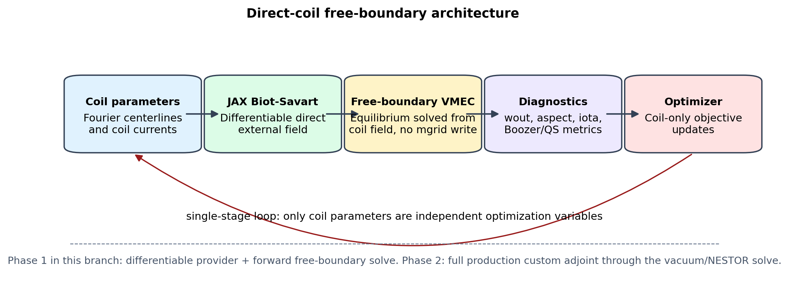
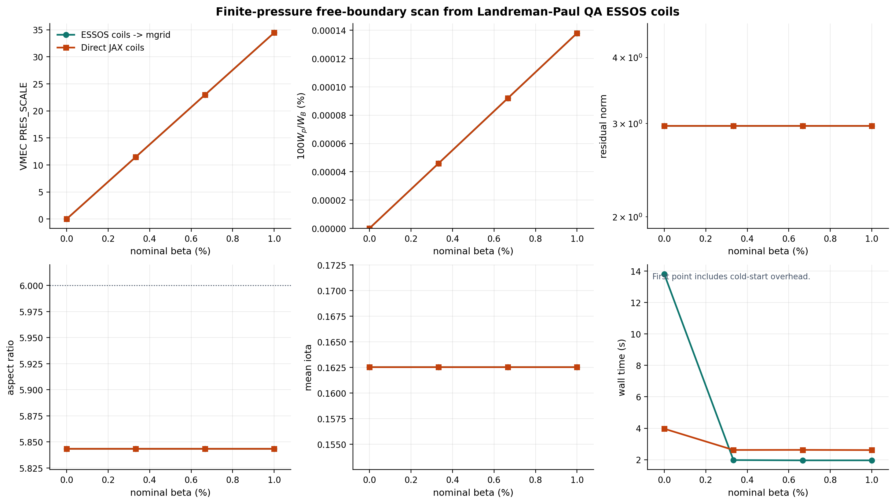
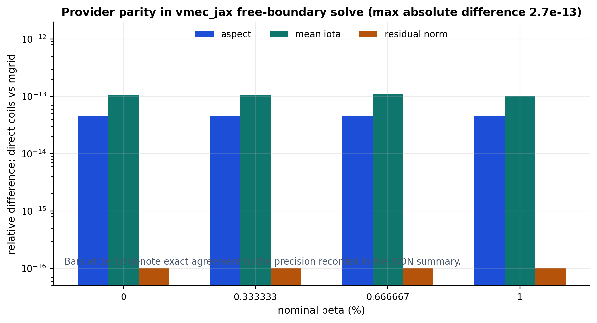
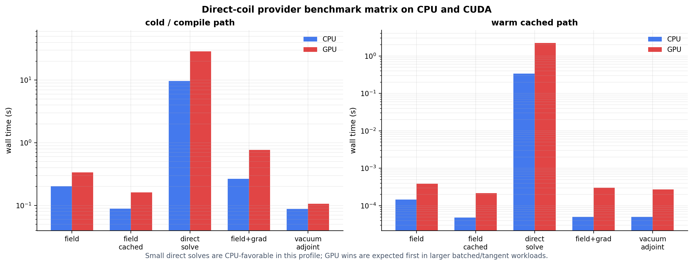

Free-Boundary Coil Optimization
===============================

This page documents the research branch toward true single-stage
free-boundary optimization with differentiable coils. The existing VMEC-compatible
``mgrid`` path remains the parity backend. The new direct-coil path evaluates
the external field from coil Fourier coefficients and currents in JAX, so the
coil parameters can become the independent optimization variables.

Architecture
------------

The intended single-stage loop is:

.. code-block:: text

   coil Fourier dofs/currents
      -> differentiable Biot-Savart external field
      -> vmec_jax free-boundary equilibrium
      -> wout/proxy diagnostics
      -> coil-only objective update

Boozer/QS diagnostics are the intended promotion target for this lane, but the
current branch keeps the single-stage optimization example on a cheap
VMEC-residual/aspect/iota proxy until complete full-loop gradient checks pass.

Phase 1 in this branch includes JAX-native coil-field sampling, an ESSOS coil
adapter, generated-``mgrid`` compatibility, and forward free-boundary solves
from direct coils. Phase 2 is the production custom adjoint through the full
free-boundary vacuum/NESTOR solve. Dense toy vacuum-adjoint tests are present
now, but the full-solve adjoint is not claimed as publication-ready until
finite-difference checks of complete solves pass.

Adjoint Validation Roadmap
--------------------------

The exact-gradient lane is deliberately staged. The literature points to a
discrete-adjoint implementation around the structured spectral operators and
linear solves, not to reverse-mode differentiation through every nonlinear
iteration. In NESTOR, the free-boundary vacuum contribution is a spectral
integral-equation solve for a Neumann problem on a toroidal surface; this
naturally maps to a JAX-native operator plus an implicit transpose solve. JAX's
``custom_linear_solve`` is the relevant primitive for this layer because it
defines reverse-mode derivatives by solving the transposed linear problem at
the converged solution rather than taping the internals of the linear solver.
This is also consistent with recent spectral-PDE adjoint work, where efficient
adjoints are built from reusable operator graphs, fast transforms, and sparse
or structured linear solves.

The validation ladder is:

1. Provider derivatives: direct Biot-Savart derivatives with respect to coil
   current, Fourier curve coefficients, and evaluation coordinates.
2. Toy implicit vacuum chain: direct coils feed a dense custom-linear-solve
   vacuum problem, and gradients with respect to current and geometry are
   checked against finite differences.
3. Boundary projection: JAX vacuum-boundary projection derivatives with
   respect to sampled cylindrical fields and boundary coefficients.
4. Projected implicit vacuum chain: direct coils feed the JAX boundary
   projection and then a dense custom-linear-solve vacuum problem, with
   current and geometry gradients checked against finite differences.
5. Mode-space NESTOR chain: the same projected boundary data feeds
   ``dense_vmec_nestor_mode_solve_jax``, a JAX-native VMEC-style operator that
   combines source symmetrization, mode-RHS projection, nonsingular
   Green-function source/matrix assembly, analytic/singular ``analyt.f``
   source/matrix assembly, mode-matrix assembly, and dense mode-space solve
   that reconstructs the boundary scalar potential. This validates the
   differentiable operator blocks used by the VMEC-like NESTOR solve on
   low-resolution grids. The high-resolution matrix-free production operator
   remains phase-2 work.
6. Full direct-coil free-boundary solve: a low-resolution scalar objective,
   first with one coil current and then with one Fourier coefficient, bounded
   against finite differences of complete solves.
7. Boozer/QS objective: the same complete-solve finite-difference checks after
   Boozer/QS diagnostics are in the objective path.

The first six rungs are implemented as fast tests today. The combined JAX
operator is also threaded into the free-boundary driver behind the opt-in
``VMEC_JAX_FREEB_JAX_NESTOR_OPERATOR=1`` diagnostic flag for low-resolution
validation. For stellarator-symmetric runs, the JAX path reconstructs the full
VMEC angular grid internally for the nonsingular Green block while keeping the
analytic/singular block on the active grid, matching the host bridge. The
JAX operator closure can be precompiled and cached with
``VMEC_JAX_FREEB_JAX_NESTOR_JIT_OPERATOR=1`` (the default when JIT is enabled),
but the host bridge remains the production/default route because the compiled
operator is still a validation primitive, not yet the final matrix-free
adjoint. The production NESTOR adjoint is therefore still a phase-2 deliverable.
The intended design is
to expose a JAX-native NESTOR operator ``A(q) phi = b(q, I, c)`` where ``q`` is
the VMEC boundary state and ``I, c`` are coil currents and curve coefficients.
The backward pass should solve ``A(q)^T lambda = dJ/dphi`` and then use JAX
JVP/VJP rules for the operator assembly and Biot-Savart source terms. This
keeps memory independent of the number of vacuum-solver iterations and keeps
gradient cost approximately independent of the number of coil optimization
parameters.

Finite-pressure direct-coil support is currently a provider/coupling validation
lane: active NESTOR diagnostics respond to coil-current changes and matched
direct/generated-``mgrid`` samples agree within recorded precision/roundoff,
but accepted-equilibrium sensitivity and high-beta convergence remain promotion
gates.

Current Status
--------------

The current branch status is intentionally narrower than a production
single-stage coil optimizer:

- ``mgrid`` remains the VMEC2000-compatible parity backend.
- Direct coils are supported as a JAX external-field provider for forward
  free-boundary solves, including nonzero pressure profiles.
- The finite-pressure evidence is a low-resolution active-coupling validation
  run:
  generated-``mgrid`` and direct-coil providers from the same ESSOS LP-QA coil
  set agree within recorded precision/roundoff in the recorded scalar
  diagnostics, and direct NESTOR samples respond to coil-current changes.
- The fast validation lane also includes tiny accepted-state
  finite-difference slope-stability checks for direct-coil current and one
  direct-coil Fourier geometry coefficient.
- The active NESTOR sensitivity checks validate the provider/coupling layer:
  normal-field/source channels scale linearly with current changes and
  ``bsqvac`` scales quadratically. They do not yet validate a full accepted
  equilibrium derivative.
- The phase-1 optimization example is coil-only, but it still uses a cheap
  VMEC residual/aspect/iota proxy. Boozer/QS objectives and production
  full-solve adjoints are next-step work.
- The experimental JAX NESTOR driver path is opt-in and guarded. It validates
  both LASYM full-grid and stellarator-symmetric reduced-grid samples, but the
  host bridge remains the default production path until complete-solve adjoints
  are promoted.

In short: direct-coil finite-pressure plumbing is present and validation-tested; a
converged high-beta direct-coil design, publication-grade gradients through the
full free-boundary/NESTOR solve, and VMEC2000-bounded generated-``mgrid`` trace
parity are not claimed yet.

Low-Resolution Beta Scan
------------------------

The first diagnostic uses ESSOS Landreman-Paul QA coils and a four-point
pressure scan. The zero-pressure endpoint is retained as a reference, but the
finite-pressure points are the meaningful provider-plumbing checks. The same
coil set is used two ways:

1. ESSOS coils are sampled onto an ``mgrid`` file and solved by the legacy
   free-boundary compatibility path.
2. The same ESSOS coils are converted to ``CoilFieldParams`` and sampled
   directly by the differentiable JAX Biot-Savart provider.

The scalar diagnostics from the two ``vmec_jax`` providers agree within the
recorded JSON precision/roundoff for this low-resolution validation run. The scan
records both the input ``PRES_SCALE`` and the output energy ratio
``100 W_p / W_B`` so future plots cannot accidentally validate only the vacuum
case.

The example uses ``--activate-fsq 1e99`` by default. This forces immediate
VMEC2000-style NESTOR turn-on so the short run exercises active finite-pressure
vacuum coupling instead of stopping in the inactive ``ivac=-1`` cadence. That
is useful for provider validation. The residuals shown here are recomputed on
the accepted final state with a fresh active NESTOR sample, but this is still
not a converged high-beta result: the active residual norm remains large and
must be bounded against VMEC2000 before this becomes a promoted finite-beta
single-stage optimization claim.

Use ``--activate-fsq 1e-3`` when checking literal VMEC2000 activation cadence.
Use a larger value, such as the default ``1e99``, only
when the goal is to force active coupling early in a deliberately short
validation run.
Those early-activation runs are provider/coupling diagnostics, not evidence
that the accepted equilibrium is converged to the same state as a long
VMEC2000 run.

The committed numerical summary is stored in
``docs/_static/figures/freeb_single_stage_beta_scan_summary.csv``.

Reproduction
------------

Run the dependency-light direct-coil forward example from the repository root.
This path constructs a synthetic circular ``CoilFieldParams`` object directly in
``vmec_jax`` and writes ``wout_direct_coils.nc`` plus ``summary.json`` without
requiring ESSOS assets or an ``mgrid`` file.

.. code-block:: bash

   python examples/free_boundary_direct_coils_forward.py \
     --max-iter 4 \
     --outdir results/free_boundary_direct_coils_forward

Run the ESSOS direct-coil forward example from the repository root.  This path
loads ESSOS coils, converts them to ``CoilFieldParams``, runs one
low-resolution finite-pressure free-boundary forward validation run without writing an
``mgrid`` file, and writes ``wout_direct_coils.nc`` plus ``summary.json``.

.. code-block:: bash

   export ESSOS_ROOT=/path/to/ESSOS_mgrid_pr
   export ESSOS_INPUT_DIR=$ESSOS_ROOT/examples/input_files
   PYTHONPATH=$ESSOS_ROOT:$PYTHONPATH \
     python examples/free_boundary_essos_coils_forward.py \
     --beta 1.0 \
     --max-iter 20 \
     --outdir results/free_boundary_essos_coils_forward

Run the matched beta scan from the repository root. Until the ESSOS
``to_mgrid`` PR is merged and released, put the ESSOS branch checkout on
``PYTHONPATH``.

.. code-block:: bash

   export ESSOS_ROOT=/path/to/ESSOS_mgrid_pr
   export ESSOS_INPUT_DIR=$ESSOS_ROOT/examples/input_files
   PYTHONPATH=$ESSOS_ROOT:$PYTHONPATH \
     python examples/free_boundary_essos_coils_beta_scan.py \
     --outdir results/free_boundary_essos_coils_beta_scan_readme \
     --activate-fsq 1e99

The ESSOS Landreman-Paul QA fixture has relatively weak currents for the short
finite-pressure validation run. Use ``--coil-current-scale`` to run matched direct/mgrid
sensitivity studies with stronger coils:

.. code-block:: bash

   export ESSOS_ROOT=/path/to/ESSOS_mgrid_pr
   export ESSOS_INPUT_DIR=$ESSOS_ROOT/examples/input_files
   PYTHONPATH=$ESSOS_ROOT:$PYTHONPATH \
     python examples/free_boundary_essos_coils_beta_scan.py \
     --outdir results/free_boundary_essos_coils_beta_scan_scaled \
     --coil-current-scale 100 \
     --activate-fsq 1e99

Render the README/docs figures from the generated JSON summary:

.. code-block:: bash

   python tools/diagnostics/render_freeb_single_stage_readme.py \
     --summary results/free_boundary_essos_coils_beta_scan_readme/summary.json \
     --benchmark-summary results/bench_freeb_direct_coil_matrix/summary.json \
     --outdir docs/_static/figures

The example writes ``input.*`` decks, ``wout_*.nc`` files, a generated mgrid,
and ``summary.json`` in the output directory. Those runtime files are ignored
by git; the committed figures and CSV are generated artifacts for documentation
only.

Phase-1 Coil-Only Optimization Validation
-----------------------------------------

The initial single-stage optimization example is a bounded validation example,
not a promoted QS design. It optimizes only coil currents and selected coil
Fourier coefficients. The VMEC plasma boundary coefficients are never included
in the optimization vector; the plasma surface is recomputed by a direct-coil
free-boundary solve at every objective evaluation.

The default objective is a cheap proxy:

- accepted-state VMEC residual,
- aspect-ratio target,
- mean-iota target.

The example records ``history.json``, ``summary.json``, and the best ``wout``.
It exits with code ``77`` when optional ESSOS assets are unavailable. For a
dependency-light bounded validation run, use the synthetic circular coil
provider:

.. code-block:: bash

   python examples/optimization/free_boundary_QS_coil_optimization.py \
     --smoke \
     --provider circle \
     --max-evals 1 \
     --max-iter 1 \
     --vmec-max-iter 1 \
     --pressure-scale 100 \
     --activate-fsq 1e99 \
     --outdir results/free_boundary_QS_coil_optimization_circle_smoke

For the ESSOS Landreman-Paul QA coils, put ESSOS on ``PYTHONPATH`` and use:

.. code-block:: bash

   export ESSOS_ROOT=/path/to/ESSOS_mgrid_pr
   export ESSOS_INPUT_DIR=$ESSOS_ROOT/examples/input_files
   PYTHONPATH=$ESSOS_ROOT:$PYTHONPATH \
     python examples/optimization/free_boundary_QS_coil_optimization.py \
     --smoke \
     --max-evals 3 \
     --outdir results/free_boundary_QS_coil_optimization_essos_smoke

The next promotion step is replacing the cheap proxy with a Boozer/QS objective
and validating finite-difference gradients of the complete direct-coil
free-boundary loop.

Robust Coil Perturbations
-------------------------

The phase-1 direct-coil example can optionally evaluate a robust objective by
adding perturbed coil scenarios to the nominal free-boundary solve:

.. code-block:: bash

   python examples/optimization/free_boundary_QS_coil_optimization.py \
     --smoke \
     --provider circle \
     --max-evals 1 \
     --max-iter 1 \
     --vmec-max-iter 1 \
     --robust-samples 2 \
     --robust-risk mean_plus_std \
     --outdir results/free_boundary_QS_coil_optimization_circle_robust_smoke

The default remains the deterministic nominal objective. When
``--robust-samples`` is positive, the example samples common coil perturbations
with ``vmec_jax.robust_coils`` and aggregates nominal plus perturbed scenario
losses with ``mean``, ``mean_plus_std``, or ``smooth`` risk aggregation.

Each objective evaluation then runs one nominal direct-coil free-boundary solve
plus one solve per perturbation sample. The resulting ``history.json`` contains
per-scenario entries, while ``summary.json`` records the robust aggregation
options under ``robust_objective``.

For a finite-pressure robust validation run, add the same finite-pressure flags
used by the deterministic validation run, for example ``--pressure-scale 100`` and
``--activate-fsq 1e99``. Keep ``--max-evals`` and ``--robust-samples`` small
because the solve count multiplies quickly.

``vmec_jax.robust_coils`` provides pure-JAX perturbation helpers for robust coil
objectives:

- multiplicative current perturbations,
- rigid Cartesian displacements,
- toroidal phase rotations about the z axis,
- additive Fourier-centerline perturbations,
- risk aggregation with mean, mean-plus-standard-deviation, smooth maximum, and
  smooth tail/CVaR-like penalties.

These functions operate on ``CoilFieldParams`` pytrees and do not require
ESSOS. They can be used with ``jax.vmap`` for transformable objective pieces;
the example intentionally uses a Python loop around full free-boundary solves
until the production solver path is fully JAX-transformable.

Benchmarks
----------

The branch includes lightweight, non-CI benchmark scripts. The recommended
first command is the matrix runner:

.. code-block:: bash

   python tools/benchmarks/bench_freeb_direct_coil_matrix.py \
     --quick \
     --out results/bench_freeb_direct_coil_matrix/summary.json

The matrix runner executes the provider, direct free-boundary solve, and
coil-gradient scripts with small CPU-only defaults. It writes each child JSON
into the output directory and records the child paths plus compact
timing/status rows in ``summary.json``. GPU rows are opt-in:

.. code-block:: bash

   python tools/benchmarks/bench_freeb_direct_coil_matrix.py \
     --quick \
     --include-gpu \
     --backend-note "local workstation validation" \
     --out results/bench_freeb_direct_coil_matrix_gpu/summary.json

If no JAX GPU device is available, the matrix records a skipped GPU row rather
than falling back silently to CPU. Use ``--no-quick`` only for a larger local
benchmark budget.

The committed CPU/CUDA matrix CSV is stored in
``docs/_static/figures/freeb_single_stage_benchmark_matrix.csv``. The current
office benchmark shows tiny direct free-boundary solves are CPU-favorable,
while provider and gradient microbenchmarks have small enough kernel payloads
that CUDA launch overhead dominates. GPU production work should therefore focus
on larger batched/tangent workloads and accepted-point replay amortization, not
on claiming a speedup from these tiny validation cases.

The direct-solve child JSON includes active and trial NESTOR timing summaries:
sample time, scalar-potential solve time, reuse counts, failed trial counts,
and the final recompute sampler/solver timings. These fields are the first
place to inspect when a direct-coil free-boundary solve is slow, because they
separate Biot-Savart sampling cost from the vacuum linear solve and from
solver-trial replay overhead.

The child scripts are still useful when isolating one lane:

.. code-block:: bash

   python tools/benchmarks/bench_external_field_providers.py \
     --points 48 --segments 48 \
     --out results/bench_external_field_providers.json

   python tools/benchmarks/bench_freeb_direct_coil_solve.py \
     --max-iter 2 \
     --out results/bench_freeb_direct_coil_solve.json

   python tools/benchmarks/bench_freeb_coil_gradient.py \
     --points 24 --segments 48 --matrix-size 24 \
     --out results/bench_freeb_coil_gradient.json

Each benchmark writes JSON with backend/device information, cold/compile
timing, warm timing, and the problem dimensions. Defaults are intentionally
small and CPU-safe; GPU production benchmarks should raise the grid and segment
counts explicitly.

Optional VMEC2000 Diagnostics
-----------------------------

The direct-coil provider is a ``vmec_jax`` research path; VMEC2000 itself reads
external fields through ``mgrid`` files, not ``CoilFieldParams``. VMEC2000
diagnostics therefore validate the generated-``mgrid``/free-boundary operator
side of the branch, while direct-coil evidence comes from
direct-versus-generated-``mgrid`` comparisons inside ``vmec_jax``.

The standalone three-way diagnostic writes a JSON report for the current
research case. It always compares ``vmec_jax`` generated-``mgrid`` against
``vmec_jax`` direct coils, then attempts VMEC2000 generated-``mgrid`` if the
executable is available:

.. code-block:: bash

   export ESSOS_ROOT=/path/to/ESSOS_mgrid_pr
   export ESSOS_INPUT_DIR=$ESSOS_ROOT/examples/input_files
   PYTHONPATH=$ESSOS_ROOT:$PYTHONPATH \
     python tools/diagnostics/compare_freeb_coils_mgrid_vmec2000.py \
       --out results/freeb_coils_mgrid_vmec2000.json \
       --workdir results/freeb_coils_mgrid_vmec2000_work \
       --ns-array 5,9,13 \
       --niter-array 100,500,2000 \
       --ftol-array 1e-8,1e-10,1e-12

For a quick provider-only validation run, skip VMEC2000 explicitly:

.. code-block:: bash

   export ESSOS_ROOT=/path/to/ESSOS_mgrid_pr
   export ESSOS_INPUT_DIR=$ESSOS_ROOT/examples/input_files
   PYTHONPATH=$ESSOS_ROOT:$PYTHONPATH \
     python tools/diagnostics/compare_freeb_coils_mgrid_vmec2000.py \
       --niter 1 \
       --mgrid-nphi 4 \
       --skip-vmec2000 \
       --out results/freeb_coils_mgrid_vmec2000_smoke.json

The diagnostic defaults ``NZETA`` to ``--mgrid-nphi`` so the generated
``mgrid`` toroidal grid is compatible with VMEC's free-boundary loader. If you
override ``--nzeta``, choose a value compatible with the generated grid
(``kp``).

If VMEC2000 exits before writing ``wout_*.nc``, the JSON still records the
workdir, return code, whether VMEC2000 opened the vacuum grid, stdout/stderr
tails, ``threed1`` tail, and parsed iteration trace. The parser includes both
the force rows and free-boundary convergence channels such as ``DEL-BSQ`` and
``FEDGE``. VMEC2000 return code ``2`` is the source-level ``more_iter_flag``
and is reported as ``more_iter_exit`` when the diagnostic also has a parsed
iteration trace or an explicit request to increase ``NITER``. Other nonzero
exits remain ``nonzero_exit`` so true generated-grid crashes stay visible in the
promotion evidence. The current low-iteration LP-QA generated-``mgrid`` VMEC2000
leg is a ``more_iter_exit`` WOUT-promotion gap, not a direct-coil provider
failure: recent traces show small force rows but ``DEL-BSQ`` still near one.
The JSON includes ``delbsq_over_ftolv`` so this free-boundary residual can be
tracked separately from ``FSQR``, ``FSQZ``, and ``FSQL``.

For local WOUT-promotion investigation, add ``--vmec2000-promotion-probes``.
This optional mode leaves the default comparison untouched, then records
bounded VMEC2000-only follow-up attempts such as loose ``FTOL_ARRAY``,
``LFULL3D1OUT=T``, and small ``MAX_MAIN_ITERATIONS`` values when the first
VMEC2000 leg exits before WOUT. These probe rows are diagnostic evidence only:
they are not used for direct-coil versus generated-``mgrid`` scoring because
they intentionally alter only the VMEC2000 input deck.

.. code-block:: bash

   PYTHONPATH=$ESSOS_ROOT:$PYTHONPATH \
     python tools/diagnostics/compare_freeb_coils_mgrid_vmec2000.py \
       --vmec2000-exec /path/to/xvmec2000 \
       --vmec2000-promotion-probes \
       --vmec2000-probe-ftols 1e-2,1e-3 \
       --vmec2000-probe-max-main-iterations 2,5 \
       --out results/freeb_coils_mgrid_vmec2000_with_probes.json

The ``--ns-array``, ``--niter-array``, and ``--ftol-array`` options define a
shared multigrid schedule used by both the ``vmec_jax`` generated-``mgrid`` and
direct-coil runs. Use this shared schedule for promotion runs. The
``--vmec2000-niter`` override is only for diagnostics because it intentionally
changes the VMEC2000 schedule without changing the ``vmec_jax`` schedule.

The stock-executable validation run needs only a local VMEC2000 binary. It verifies that
the bundled asymmetric free-boundary deck reaches the vacuum solve:

.. code-block:: bash

   export VMEC2000_EXEC=/path/to/xvmec2000
   VMEC2000_INTEGRATION=1 \
     pytest -q tests/test_vmec2000_exec_fast_validation.py::test_vmec2000_free_boundary_lasym_true_reaches_vacuum_solve

The bounded ``freeb_scalpot`` manifest diagnostic requires an instrumented
VMEC2000 executable that honors the ``VMEC_DUMP_*`` environment variables. It
compares VMEC2000 scalpot/vacuum/bextern dumps with the dense ``vmec_jax``
free-boundary path for a self-contained generated-``mgrid`` case:

.. code-block:: bash

   export VMEC2000_EXEC=/path/to/xvmec2000
   VMEC2000_INTEGRATION=1 \
     PYTHONPATH=. python tools/diagnostics/parity_sweep_manifest.py \
       --ids freeb_nonaxis_lasym_true_cth_like_local \
       --output-root results/parity/freeb_lasym_true \
       --manifest tools/diagnostics/parity_manifest.toml \
       --vmec-exec "$VMEC2000_EXEC"

For one-off debugging of a specific iteration, run the comparator directly:

.. code-block:: bash

   export VMEC2000_EXEC=/path/to/xvmec2000
   VMEC2000_INTEGRATION=1 \
   VMEC_DUMP_GC=1 \
   VMEC_DUMP_GC_STAGE=precond \
     PYTHONPATH=. python tools/diagnostics/vmec2000_exec_freeb_scalpot_compare.py \
       --input examples/data/input.cth_like_free_bdy_lasym_small \
       --vmec-exec "$VMEC2000_EXEC" \
       --iter 80 \
       --max-iter 120 \
       --workdir results/freeb_scalpot_cth_like_lasym \
       --json results/freeb_scalpot_cth_like_lasym/summary.json

The generated-``mgrid`` VMEC2000 comparison for the ESSOS LP-QA coil validation case is
still non-promoted/xfailed. The current promoted signal for this branch is
``vmec_jax`` direct-coil versus generated-``mgrid`` provider agreement within
recorded precision/roundoff plus the active NESTOR coupling sensitivity checks
listed below.

Validation Status
-----------------

Current fast tests cover:

- direct-coil Biot-Savart derivatives with respect to currents, coil Fourier
  coefficients, and evaluation coordinates;
- ESSOS adapter value parity when ESSOS is installed;
- JAX ``mgrid`` interpolation value and gradient checks;
- a direct-coil runtime hook that does not require an ``mgrid`` file and uses
  nonzero pressure;
- generated-``mgrid`` versus direct-coil ``vmec_jax`` provider parity for the
  ESSOS Landreman-Paul QA finite-pressure validation case;
- active direct-coil NESTOR-step sensitivity to coil-current changes, including
  the expected linear normal-field/source scaling and quadratic ``bsqvac``
  scaling;
- direct-provider source refresh on reuse and trial-state vacuum-field refresh,
  so direct coils are not scored against stale pre-update source data;
- robust-coil perturbation/risk aggregation utilities;
- dense toy vacuum-adjoint tests.
- direct-coil to implicit dense-vacuum-chain finite-difference checks for one
  current scale and one Fourier geometry perturbation.
- JAX boundary-field projection value parity with the current NumPy
  implementation plus finite-difference checks with respect to both field
  samples and boundary geometry.
- direct-coil to JAX boundary projection to implicit dense-vacuum-chain
  finite-difference checks for one current scale and one Fourier geometry
  perturbation.
- VMEC-style source symmetrization and mode-RHS projection value parity with
  the host implementation, plus finite-difference gradients with respect to
  the source values.
- dense mode-space vacuum solve and reconstruction tests, including
  stellarator-symmetric and LASYM-style basis blocks plus finite-difference
  gradients through a direct-coil projected source/RHS/mode-space chain.

The optional VMEC2000 generated-``mgrid`` comparison is present but xfailed for
now. VMEC2000 reads the generated grid and advances the trace locally, but the
current generated-``mgrid`` free-boundary parity gap is not bounded tightly
enough for a promoted gate. That is a validation task, not a reason to regress
the existing VMEC2000-parity ``mgrid`` fixtures.

Next Implementation Steps
-------------------------

- Bound active accepted-equilibrium sensitivity to direct coil parameters with
  realistic ESSOS/high-beta full-solve finite-difference checks, then promote
  the optional xfail.
- Replace the phase-1 coil-only optimization proxy with a Boozer/QS objective
  once the complete direct-coil free-boundary loop has validated gradients.
- Promote the VMEC2000 generated-``mgrid`` comparison after the direct/mgrid
  trace discrepancy is bounded.
- Replace the dense validation vacuum-adjoint primitive with the production
  matrix-free/custom-linear-solve NESTOR operator.
- Promote the toy direct-coil/vacuum-chain gradient checks to complete
  low-resolution free-boundary finite-difference checks, then to Boozer/QS
  gradient checks.
- Run the benchmark matrix on CPU and GPU and turn the JSON summaries into
  documentation plots.

Literature Anchors
------------------

- Merkel's NESTOR integral-equation formulation converts the toroidal Neumann
  vacuum problem into Fourier-space linear equations with singular-kernel
  regularization, which is the operator we eventually need to expose as a
  differentiable JAX linear solve.
- Antonsen, Paul, and Landreman's VMEC adjoint work demonstrates the expected
  order-of-magnitude advantage of adjoints over direct finite differences for
  stellarator equilibrium sensitivities, including objectives such as
  quasisymmetry and magnetic well.
- DESC's JAX-based quasisymmetry optimization demonstrates the practical value
  of exact derivatives from a single equilibrium solution instead of a number
  of equilibrium solves that scales with design-space dimension.
- Recent automated adjoint work for spectral PDE solvers supports the same
  implementation principle: differentiate the assembled operator graph and use
  adjoint linear solves, rather than differentiating through each solver
  iteration.
