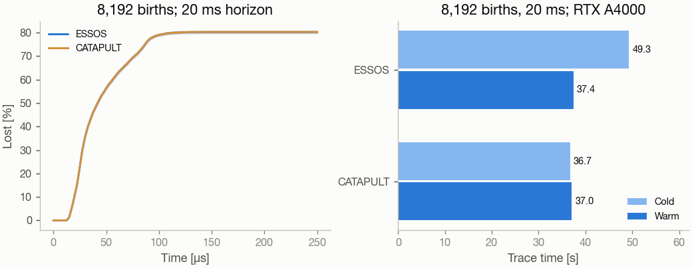

# Trace alpha particles

`vmex --trace` follows fusion-born 3.52 MeV alphas through an equilibrium and
reports the fraction lost through the last closed flux surface. It needs the
`coils` extra (`pip install "vmex[coils]"`, ESSOS 0.19.5 or later).

## Run it

```console
vmex wout_case.nc --trace          # 500 alphas, 10 ms, ARIES-CS size
vmex input.case --trace            # solve first, then trace
```

The default run takes under a minute on a 10-core laptop (see Cost below). While it runs it reports, on
stderr, the share of `tmax` traced, the elapsed time and an estimate of the time left
(ESSOS 0.19.5 and later). It then prints the scaling factors, the step, the number of Boozer
modes, the wall time split into compile and run, and the loss fraction with
its binomial error:

```text
 Loss fraction: 12.30% ± 1.04% (123 of 1000 particles lost)
```

## Production runs: particles, time and other flags

| flag | default | what it sets | cost |
|---|---|---|---|
| `--trace-particles N` | 500 | ensemble size; the error is `sqrt(f (1 - f) / N)` | linear in `N` |
| `--trace-tmax T` | `1e-2` | horizon in seconds | linear in `T` |
| `--trace-method rk4\|dopri5\|dopri8` | `rk4` | fixed-step integrator; alternatives require ESSOS method support | field dependent |
| `--trace-timestep DT` | size-scaled step | orbit step in seconds | `1 / DT` |
| `--trace-compact`, `--no-trace-compact` | on when supported | compact early losses | loss dependent |
| `--trace-birth surface\|volume` | `surface` | births on `--trace-s` or through the volume at the D-T fusion rate | none |
| `--trace-s S` | 0.25 | birth surface `s = psi / psi_b` | none |
| `--collisional` | off | Monte Carlo collisions on electrons, D and T | about none |
| `--trace-ne0 N0`, `--trace-te0 T0` | `4e20`, `12` | on-axis electron density [m^-3] and temperature [keV] | none |
| `--trace-no-scale` | off | trace the equilibrium at its own size and field | none |
| `--scale-target axis` | `volavgB` | ARIES-CS convention of the in-memory scaling | none |
| `--mbooz M`, `--nbooz N` | 32, 32 | Boozer resolution of the traced field | small |
| `--trace-seed K` | 42 | births and collision noise | none |
| `--trace-times K` | 1000 | samples of the loss-fraction curve | none |
| `--trace-mode-cut C` | `1e-4` | drop modes below `C` times the largest cosine/sine amplitude | about `1 / C` in modes |

The wall time is `particles × tmax / timestep` times a per-step cost. For
example, going from the default to 5000 alphas over 0.1 s costs 50 times the
default, about 25 min on the same laptop. Run that on a workstation or a GPU.

```console
vmex wout_case.nc --trace --trace-particles 5000 --trace-tmax 0.1
vmex wout_case.nc --trace --trace-birth volume --collisional --trace-tmax 0.2
vmex wout_case.nc --trace --trace-particles 200 --trace-tmax 1e-3   # a quick look
```

Losses from 10 ms are prompt losses only. Published reactor numbers are
slowing-down losses over about 0.2 s: `--collisional --trace-tmax 0.2`. Do not
compare a 10 ms number against a 0.2 s table. For reference, Paul et al.
(NF 62, 126054, 2022, Table 2) report 2470 of 10^4 ARIES-CS alphas born on
s = 0.3 lost within 0.2 s.

## What is traced

- **Scale.** Loss fractions are physical only at reactor size, so the
  equilibrium is first scaled in memory to ARIES-CS size: `<B> = 5.8646 T`
  and `a = 1.7044 m` (the `--scale` rule, see {doc}`scale-a-configuration`).
- **Field.** `booz_xform_jax` transforms every surface to Boozer coordinates.
  The cosine and sine `|B|` spectra are cut below `1e-4` of the largest
  combined amplitude and splined in `sqrt(s)`; `iota`, `G` and `I` are splined in `s`.
- **Orbits.** The guiding-centre equations in Boozer coordinates (White; the
  `K = 0` form of SIMSOPT) are integrated with fixed-step RK4 in the chart
  `sqrt(s) (cos theta, sin theta)`, which is regular on the magnetic axis, so
  no orbit stops there. An alpha is lost when it reaches `s = 1`.
- **Births.** Pitch `v_par / v` is uniform in `[-1, 1)`. The angles follow
  the Boozer Jacobian `(G + iota I) / B^2`. With `--trace-birth volume`, `s`
  follows the D-T rate `n_D n_T <sigma v>(T)`, weighted by the volume
  element (Bosch-Hale reactivity).
- **Profiles** (volume births and `--collisional`; Landreman, Buller &
  Drevlak, PoP 29, 082501, 2022): `n_e = n_e0 (1 - s^5)`,
  `n_D = n_T = n_e / 2`, and `T_e = T_i = T_0 (1 - s)`.
- **Collisions.** After every step, a Monte Carlo operator applies
  pitch-angle scattering, slowing down and energy diffusion on electrons, D
  and T (Ito Euler-Maruyama; Boozer & Kuo-Petravic 1981; ESSOS collision
  rates). An alpha below 1.5 times the local temperature is thermalised and
  counts as confined. The ESSOS tests check the slowing down against the
  Stix time and the pitch-angle decay against `nu_D`.

## Outputs

Next to the input (or in `--outdir`):

- `*_trace.json` holds the counts, loss fraction and error, scaling factors,
  step, Boozer modes, devices, versions and timing.
- `*_trace.npz` holds the loss-fraction curve, the loss and thermalisation
  times, the births `(s, theta_B, zeta_B, v_par/v)` and the final states.
  This is enough to replot or compare runs.
- `*_trace.png` has six panels:
  - the cumulative loss fraction against log time, with its 1σ band;
  - a heatmap of the loss locations on the boundary in `(zeta_B, theta_B)`;
  - the birth pitch of lost and confined alphas;
  - loss time against birth pitch;
  - loss fraction against birth `s` (volume births), or a loss-time
    histogram (surface births);
  - `iota(s)` with the low-order rationals `n N_fp / m`, where orbit
    resonances sit.
- `*_trace_3d.png` shows the loss locations on the 3-D boundary, coloured by
  loss time.

## Cost

On an Apple M3 Max laptop (10 performance cores, load average 6-9), the
default ARIES-CS run (`wout_n3are_R7.75B5.7.nc`, 1000 alphas, 10 ms, 41
Boozer modes) takes 28 s: 25 s of tracing, of which 1.9 s is compilation.
It loses 12.3 % ± 1.0 %. The defaults are now 500 alphas (± 1.5 %) and a
mode cut of 1e-4 (see the convergence section). `--trace` gives JAX one CPU
device per usable core (on Linux, the cores the process may run on). On Apple
silicon it uses only the performance cores unless there are at least as many
efficiency cores. On an M4 (4 + 6) all 10 cores trace 1.7x faster than the 4
performance cores. A device count in `XLA_FLAGS` or `JAX_NUM_CPU_DEVICES`
wins. The Boozer transform takes about 2 s.

**CPU or GPU.** Since ESSOS 0.19.3 (parallel spline lookup and compaction of
lost alphas) a GPU is the faster choice for large ensembles: 1,024 alphas over
2 ms take 2.4 s warm on an RTX A4000 against 18 s on eight CPU devices
(uwplasma/ESSOS#98). On a laptop CPU the default 500-alpha run takes under a
minute.

## Convergence of the defaults

Twenty equilibria, 1,000 alphas each from `s = 0.25`, traced for 10 ms on
one RTX A4000 with VMEX 0.11.7 and ESSOS 0.19.5 (after the flux-sign and
alpha-mass corrections). Every run uses the same births, so each cut and the
halved timestep are compared alpha by alpha with the reference (`1e-5`, default
step): σ is `(gained - dropped) / sqrt(gained + dropped)` over the alphas whose
label changes.

| equilibrium | modes 1e-5 / 1e-4 / 2e-4 / 3e-4 | lost % ref / 1e-4 / 2e-4 / 3e-4 / half step | σ 1e-4 / 2e-4 / 3e-4 / half step | energy error |
|---|---|---|---|---|
| ARIES-CS | 382 / 135 / 101 / 77 | 12.5 / 13.3 / 12.2 / 14.7 / 11.5 | +0.6 / −0.2 / +1.5 / −1.1 | 2.3e-3 |
| Landreman–Paul QA, reactor scale | 96 / 16 / 7 / 3 | 0.6 / 0.8 / 0.4 / **0.0** / 0.6 | +0.5 / −0.6 / **−2.4** / 0.0 | 1.7e-4 |
| Landreman–Paul QA, β 2.5 % | 179 / 50 / 22 / 15 | 0.1 / 0.0 / 0.1 / 0.0 / 0.0 | −1.0 / 0.0 / −1.0 / −1.0 | 8.4e-5 |
| HSX | 342 / 159 / 115 / 93 | 11.4 / 13.0 / 11.8 / 11.9 / 10.1 | +1.1 / +0.3 / +0.4 / −1.9 | **2.5e-2** |
| W7-X, β 5 % | 229 / 78 / 54 / 45 | 1.8 / 1.7 / 2.0 / 1.8 / 2.0 | −0.4 / +0.7 / 0.0 / +0.7 | 8.8e-4 |
| li383 | 198 / 120 / 92 / 81 | 28.2 / 28.4 / 28.5 / 28.5 / 28.4 | +0.8 / +0.5 / +0.1 / +1.0 | **2.9e-2** |
| Nührenberg–Zille QHS | 235 / 87 / 68 / 54 | 4.6 / 4.5 / 4.7 / 4.6 / 4.7 | −0.1 / +0.1 / 0.0 / +0.3 | 2.6e-4 |
| nfp1_QI | 332 / 139 / 88 / 73 | 7.5 / 5.9 / 5.7 / 5.8 / 7.3 | −1.4 / −1.6 / −1.5 / −0.6 | 2.1e-4 |
| nfp2_QI | 184 / 92 / 74 / 65 | 3.7 / 4.0 / 4.0 / 3.9 / 3.7 | +1.7 / +1.3 / +0.3 / 0.0 | 6.1e-4 |
| QI, 2 periods, fixed resolution | 458 / 172 / 111 / 83 | 2.4 / 2.9 / 2.9 / 2.8 / 2.0 | +0.7 / +0.7 / +0.6 / −1.6 | **9.8e-3** |
| QI, 3 periods, fixed resolution | 857 / 360 / 247 / 190 | 1.4 / 1.1 / 1.4 / 2.1 / 1.0 | −0.6 / 0.0 / +1.2 / −0.9 | **2.7e-1** |
| nfp4_QI, β 2.5 % | 546 / 169 / 126 / 100 | 3.7 / 3.3 / 3.3 / 3.1 / 2.3 | −0.5 / −0.5 / −0.7 / **−3.5** | **5.9e-2** |
| nfp4_QH, β 2.5 % | 380 / 132 / 90 / 72 | 7.4 / 8.2 / 8.1 / 8.5 / 7.1 | +0.7 / +0.6 / +0.9 / −1.3 | **1.6e-2** |
| nfp4_QH warm start | 133 / 61 / 50 / 43 | 1.5 / 1.4 / 1.3 / 1.7 / 1.6 | −0.2 / −0.4 / +0.4 / +0.3 | 9.2e-4 |
| nfp2_QA_highres | 56 / 30 / 23 / 22 | 20.1 / 19.2 / 19.5 / 20.1 / 19.8 | −1.7 / −0.5 / 0.0 / −0.7 | 8.3e-6 |
| QI_stel_seed_3127 | 103 / 53 / 42 / 37 | 31.1 / 31.0 / 31.1 / 31.1 / 31.1 | −1.0 / 0.0 / 0.0 / 0.0 | 7.9e-4 |

Four more lose nothing at every setting: Landreman–Paul QA lowres and QH
reactor scale, CTH-like and nfp2_QA_omnigenity (which loses everything).

- **Mode cut.** 1e-4 and 2e-4 stay within 1.7σ of the reference everywhere.
  3e-4 misses the reactor-scale Landreman–Paul QA (−2.4σ): its few
  symmetry-breaking modes sit between `2e-4` and `3e-4` of `B00`. The default
  is 1e-4; `--trace-mode-cut 2e-4` is safe on all twenty.
- **Timestep.** The default RK4 step (`1.25e-7 s × a / 1.7044 m`) is the larger
  error. The energy error exceeds `1e-3` in six cases (bold), up to 27 % in the
  three-period QI, and halving the step moves the nfp4 QI loss fraction by
  −3.5σ. Check `max_energy_error` in `*_trace.json`; when it exceeds `1e-3`,
  rerun with `--trace-timestep` halved or `--trace-method dopri5`.
- **The `K = 0` equations.** `--trace` drops the radial covariant field
  `K`, which is nonzero only at finite pressure. SIMSOPT traces both forms
  (`gc` with `K`, `gc_noK` without), and on 512 identical births over 5 ms the
  loss labels are unchanged on W7-X at β = 4.5 % (3 and 3 lost). On a QA at
  β = 2.7 % 4 of 512 labels change (9 against 11 lost, −1.0σ), and on a
  Landreman–Paul QA at β = 2.5 % and a vacuum QH nothing is lost either way.
  At these β the `K` term is below the sampling error of prompt losses.
- Over 10 ms the orbits are chaotic, so individual labels change between any
  two settings; the fraction converges, the labels do not.

## Against SIMPLE and SIMSOPT

This comparison was measured with VMEX 0.11.4, before the toroidal-flux sign
and alpha-mass corrections of 0.11.7, and has not been rerun. The totals
agreed, but individual orbits differ. After the corrections, ESSOS,
FIRM3D/CATAPULT and SIMPLE agree on all 512 loss labels of a matched
5 ms case (uwplasma/vmex#516).



`benchmarks/trace_cross_code.py` traces the same 1000 alphas with three
codes. The equilibrium is ARIES-CS (`wout_n3are_R7.75B5.7.nc`, unscaled).
The alphas are born on s = 0.247 with the `--trace` births, and all three
codes get the same positions, pitches and 3.52 MeV energy. Each code runs
for 10 ms on the same 8 cores (`taskset`) of a shared 36-core x86_64
workstation, under a load average of 28-50 from other jobs. The runtime
leaves out JAX compilation (35 s), the field set-up of SIMPLE and the
interpolation tables of SIMSOPT.

| code | integrator | lost | loss fraction | runtime |
|---|---|---|---|---|
| VMEX `--trace` (ESSOS Boozer) | RK4, 1.25e-7 s | 128 | 12.8 % ± 1.1 % | 146 s |
| SIMPLE | symplectic Euler, defaults, all orbits traced | 124 | 12.4 % ± 1.0 % | 556 s |
| SIMSOPT `trace_particles_boozer` | RK45, tol 1e-9, `gc_noK` | 119 | 11.9 % ± 1.0 % | 1079 s |

The three loss fractions agree within 0.6σ. SIMSOPT uses a `booz_xform`
field with the same 32 × 32 resolution. SIMPLE reads its starts in VMEC
angles. The Boozer births are mapped with `nu` and `lambda`, and the
mapping agrees to 0.13 mm in `R, Z` and 0.2 % in SIMPLE's own `|B|`.
`docs/_static/figures/sources/make_trace_figures.py` plots the record
(`benchmarks/trace_cross_code.json`).

## From Python

```python
import vmex as vj

result = vj.trace_alphas("wout_case.nc", nparticles=400, tmax=1e-3,
                         birth="volume", collisions=True)
print(result.loss_fraction, result.loss_fraction_sigma)
vj.plot_tracing(result, "figs", name="case")
```

`trace_alphas` accepts a path or an in-memory
{class}`~vmex.core.wout.WoutData` and returns an
{class}`~vmex.core.tracing.AlphaTracingResult`. The exact loss fraction is
piecewise constant in the boundary, so use it to certify a design, not as an
optimization objective.
