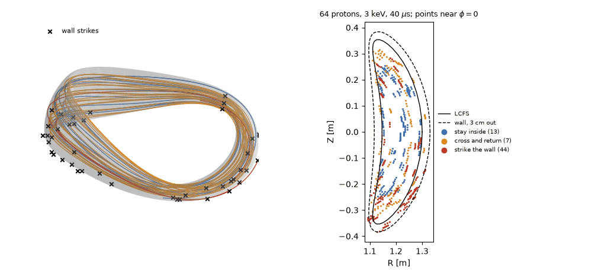
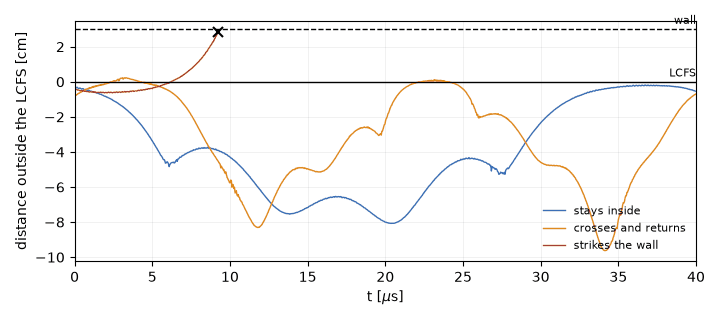
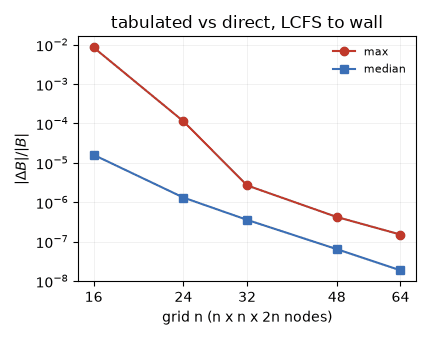
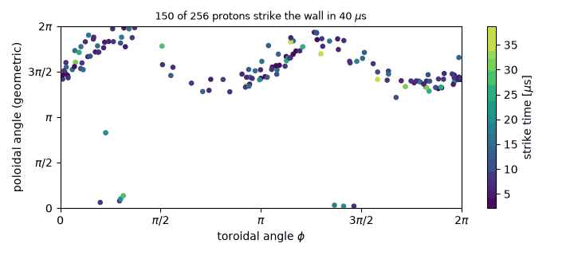

# Trace particles to the wall

Alpha-loss studies usually stop an orbit at the last closed flux surface
(LCFS). That is where VMEC coordinates end, not where particles end: an orbit
that leaves the LCFS can drift back in, and one that does not lands somewhere
on the first wall. VMEX and [ESSOS](https://github.com/uwplasma/ESSOS) trace
guiding centres across that boundary: in VMEC coordinates inside, in
Cartesian coordinates outside, until the orbit strikes a wall surface, comes
back in, or reaches the end time. Requires ESSOS 0.20.2 or newer
(`pip install "vmex[coils]"`).

```python
import vmex as vj
from essos.coils import Coils
from essos.dynamics import Tracing

wout = vj.wout_from_result(inp, vj.solve_multigrid(inp))   # or "wout_case.nc"
coils = Coils.from_json("coils.json")         # or an MgridField, or None for the wout's mgrid
setup = vj.essos_tracing_fields(wout, coils, wall=0.03)   # field, exterior_field, wall
trace = Tracing(**setup, model="GuidingCenterAdaptative", particles=particles,
                maxtime=4e-5, atol=1e-9, rtol=1e-9)
trace.wall_hits, trace.wall_positions, trace.wall_times
```

`examples/vmex_essos_tracing_to_wall.py` runs this on the vacuum
Landreman-Paul QA equilibrium and its ESSOS coils;
`docs/_static/figures/sources/make_wall_tracing_figures.py` draws the figures
on this page from the same setup.



## Equations of motion

Each particle is a guiding centre at position $\mathbf X$ with parallel
velocity $v_\parallel$ and magnetic moment $\mu = m v_\perp^2 / 2B$. With
$\mathbf b = \mathbf B / B$, the curvature $\boldsymbol\kappa = \mathbf b\cdot\nabla\mathbf b$
and

$$
\mathbf B^* = \mathbf B + \frac{m v_\parallel}{q}\,\nabla\times\mathbf b,
\qquad
\mathbf F = \mu\nabla B + m v_\parallel^2\,\boldsymbol\kappa,
$$

ESSOS integrates, without collisions or electric field,

$$
\dot{\mathbf X} = v_\parallel\,\mathbf b + \frac{\mathbf B\times\mathbf F}{q\,\mathbf B\cdot\mathbf B^*},
\qquad
m\,\dot v_\parallel = -\frac{B\,\mathbf B^*\cdot\mathbf F}{\mathbf B\cdot\mathbf B^*},
\qquad
\dot\mu = 0 .
$$

The energy $E = \tfrac12 m v_\parallel^2 + \mu B$ is conserved, and
`trace.energy()` reports how well the integrator keeps it. The same
equations are solved in two charts:

| Region | Chart | State | Field |
| --- | --- | --- | --- |
| inside the LCFS | VMEC $(s, \theta, \phi)$, axis-regular $(\sqrt s\cos\theta, \sqrt s\sin\theta, \phi)$ | $(s,\theta,\phi,v_\parallel)$ | `essos.fields.Vmec` from the wout |
| outside | Cartesian $(x, y, z)$ | $(x,y,z,v_\parallel,\mu)$ | `exterior_field` |

Both legs use adaptive Dormand-Prince steps to `atol`/`rtol`.

## Crossing the LCFS and coming back

Inside, an event function $1 - s$ is root-found, so the crossing time and
state are exact to the root-finder tolerance, not to the output sampling. At
the crossing the state is mapped to Cartesian position, $v_\parallel$ and
$\mu$ are kept, and the orbit continues outside. Two events stop the outside
leg:

- the wall: the wall's signed distance changes sign, the orbit is struck;
- re-entry: the orbit is `reentry_depth` inside the LCFS (default
  $10^{-3}$ minor radii), so one that only grazes the surface does not
  bounce between charts. It is mapped back to $(s,\theta,\phi)$ and
  continues inside, up to `max_returns` times (default 16).



The orange orbit leaves the LCFS on the outboard side, drifts up to
RE_DEPTH cm out and comes back RE_COUNT times; the red one leaves and reaches
the wall.

## The field outside the plasma

The exterior field is any field with ESSOS `B`, or a batched
`xyz -> B` callable. `essos_tracing_fields` builds it from what the
equilibrium knows:

| Source | Exterior field | When |
| --- | --- | --- |
| coils (ESSOS `Coils`, `BiotSavart`) | `VmecExtender`: coils plus the plasma's virtual-casing field | most accurate |
| `MgridField` (mgrid file or `MgridField.from_coils`) | `VmecExtender` on the grid | the field a free-boundary solve used |
| nothing, free-boundary wout | the wout's own mgrid | quick look |
| nothing, fixed-boundary wout | none: orbits stop at the LCFS | |

`plasma="vacuum"` skips the virtual-casing term, which is zero at zero beta;
`plasma="auto"` keeps it when the plasma carries current or pressure. The
plasma field is the virtual-casing integral over the LCFS
({doc}`/explanation/nestor-vacuum`), accurate to about $10^{-12}$ down to
0.01 minor radii with graded quadrature ({doc}`use-essos-fields-and-coils`).

## Interpolated exterior fields

A virtual-casing evaluation costs a surface quadrature per point, so the
direct field is slow inside an adaptive integrator. By default
`essos_tracing_fields` tabulates it once with ESSOS `InterpolatedField`:
tricubic B-splines on $n\times n\times 2n$ nodes in $(R, Z, \phi)$ over the
box around the wall plus 5 cm, one field period, stellarator symmetry
folded in. `n=None` keeps the direct field.



INTERP_SENTENCE

Use the table for ensembles and scans. Use the direct field to check a
result, or when the orbits of interest stay within a few millimetres of the
LCFS, where the plasma field changes fastest. Check a table against the
direct field on the same births: the example prints the largest strike-point
distance between the two.

## Wall surfaces

`wall=` is a gap in metres or an ESSOS surface. A gap builds the LCFS with
its $m = 1$ Fourier modes grown by that distance
(`SurfaceRZFourier.from_vmec(field, offset=gap)`), a wall of constant
distance to first order. Any `SurfaceRZFourier` works, for example a
vessel from a VMEC-format boundary file. ESSOS classifies points with a
signed-distance table on a 2 cm grid, so a strike is located to that grid
spacing at worst, and the exterior field must cover the whole wall.

## Outputs

| Attribute | Meaning |
| --- | --- |
| `status` | per orbit: 0 inside at the end, 2 outside at the end, 3 struck the wall, 4 integrator failure, 5 more than `max_returns` re-entries |
| `wall_hits`, `wall_times`, `wall_positions`, `wall_energies` | strikes: mask, time [s], Cartesian point [m], energy at the strike [J] |
| `lcfs_times`, `lcfs_states` | first LCFS crossing (`inf` if none) |
| `returns` | re-entries into the LCFS |
| `region`, `trajectories_xyz` | per saved time: 0 inside, 1 outside, and the Cartesian position |
| `loss_fractions` | fraction struck against time (LCFS crossings without a wall) |



STRIKE_SENTENCE

## Limits

- Guiding centres only: no finite Larmor radius at the wall. A 3.5 MeV
  alpha in 5 T has a gyroradius of about 5 cm, comparable to a typical gap.
- Collisions are applied inside the LCFS only.
- The VMEC field near the LCFS is only as good as the equilibrium's
  resolution; see {doc}`trace-alpha-particles`.
