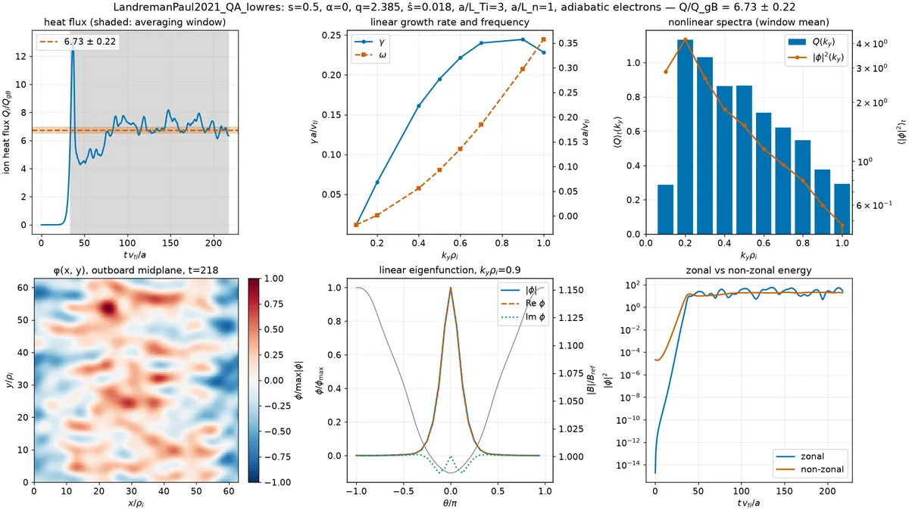

# Run a quick gyrokinetic turbulence simulation

`vmex --turbulence` solves an input (or reads a `wout_*.nc`), samples one flux tube and runs
[GKX](https://github.com/uwplasma/GKX), uwplasma's JAX gyrokinetic code, on it. It needs the
`turbulence` extra:

```console
pip install "vmex[turbulence]"        # gkx>=2.5.0
vmex input.my_case --turbulence
vmex wout_my_case.nc --turbulence --outdir turb
```

Three GKX runs follow the equilibrium, each printed with its elapsed time and an estimate of the time left:

1. a linear `k_y` scan: the growth rate `γ(k_y)` and real frequency `ω(k_y)` of the dominant mode;
2. one linear run at the fastest-growing `k_y`, for the eigenfunction `φ(θ)`;
3. a short nonlinear simulation. GKX stops it when the heat-flux window statistics converge
   (`run_to = "saturation"`) or at `t_max`, whichever comes first.

GKX chooses the solvers. Linear runs integrate in time and fall back to a Krylov eigensolve when the fit
is not a clean growing mode. Nonlinear runs use the adaptive CFL-controlled RK4 step.

## Defaults

| Flag | Default | Meaning |
|---|---|---|
| `--turbulence-s S` | 0.5 | normalized toroidal flux of the flux tube |
| `--turbulence-alpha A` | 0 | field-line label (`α = θ* − ι ζ`) |
| `--turbulence-gradients TPRIM FPRIM` | 3 1 | `a/L_T` and `a/L_n` of every species (an ITG drive) |
| `--turbulence-kinetic-electrons` | off | kinetic electrons (`m_e/m_i = 1/3670`) instead of adiabatic ones |
| `--turbulence-ky MIN MAX N` | 0.1 1 8 | linear scan: `N` values of `k_y ρ_i` in `[MIN, MAX]`, snapped to multiples of `MIN` |
| `--turbulence-grid NX NY NZ` | 32 32 32 | nonlinear grid; the box is `2π/k_y,min` wide in `y` |
| `--turbulence-moments NL NM` | 2 6 | Laguerre and Hermite moments of the nonlinear run (linear runs use at least 4 8) |
| `--turbulence-tmax T` | 250 | nonlinear horizon in `a/v_ti` |

Every species has `n = T = 1` and ion collisionality `ν = 0.01`. The nonlinear run adds GKX's
hypercollisions and a `k_⊥` hyperdiffusion `D_hyper = 0.05`, as in GKX's stellarator decks, and seeds
every `(k_x, k_y)` mode at amplitude `10⁻³`. The flux tube covers one poloidal turn. Quantities are in GKX's gyro-Bohm units: `k_y ρ_i`, `γ a/v_ti` and
`Q/Q_gB`. With adiabatic electrons the ion particle flux is zero by construction.

These defaults are a survey and are not converged. They take a few minutes (timings below). A
transport number for a paper needs resolution and box-size convergence, several field lines or a
full-surface model, and a longer averaging window. GKX's own documentation describes the audits it
requires. Each run writes `<case>_gkx_linear.toml` and `<case>_gkx_nonlinear.toml`; edit the
resolution in them and rerun with `gkx run`.

## Output

All files go next to the input or into `--outdir`:

- `<case>_turbulence.png`: the summary figure (below). It shows the heat-flux trace with its saturated
  mean ± standard error (the error is a batch-means estimate over GKX's saturation window, or over the
  last half of the run when GKX found none), `γ(k_y)` and `ω(k_y)`, the time-averaged nonlinear `Q(k_y)`
  and `|φ|²(k_y)` spectra, a snapshot of `φ(x, y)` at the outboard midplane, the linear eigenfunction
  over `|B|`, and the zonal and non-zonal `|φ|²`.
- `<case>_turbulence_geometry.png`: `|B|`, the grad-B and curvature drifts (`gbdrift`, `cvdrift`;
  negative is bad curvature), and the metric elements `gds2`, `gds21` and `gds22` along the field
  line, in the GS2/GX normalization of `vmex.core.turbulence.gk_fieldline_geometry_from_wout`.
- `<case>_turbulence_fluxes.png`: heat and particle flux on linear and logarithmic axes (the log
  axis shows the linear phase), and the free energies `W_g` and `W_φ`.
- `<case>_turbulence.json`: settings, `q`, `ŝ`, the scan, the fluxes, GKX's saturation decision and
  the wall time.



The panels follow the figures in the stellarator gyrokinetic literature. Flux traces with a
saturated mean, `γ(k_y)` and `Q(k_y)` spectra appear in the GX papers (Mandell et al. 2024, *J. Plasma
Phys.*; Kim et al. 2024, *J. Plasma Phys.*) and in the turbulence-optimization studies built on them
(Landreman et al. 2025, *J. Plasma Phys.*). The geometry panels follow Roberg-Clark et al. (2023) and
the stella W7-X study of González-Jerez et al. (2022, *J. Plasma Phys.*).

## Cost

The table times the default run of `examples/data/input.LandremanPaul2021_QA_lowres` on a 36-core
Linux workstation with an RTX A4000. The equilibrium solve is listed separately and depends on the deck.

| Stage | CPU (36-core Xeon) | GPU (RTX A4000) |
|---|---|---|
| equilibrium solve (`NS` 16/31/50) | 38 s | 69 s |
| field-line geometry (incl. compile) | 21 s | 30 s |
| linear `k_y` scan, 8 points | 26 s | 34 s |
| eigenfunction at peak `k_y` | 1 s | 2 s |
| nonlinear run (saturated at `t ≈ 190–220`) | 195 s | 54 s |
| **`--turbulence` total** | **243 s** | **119 s** |
| **end to end, `/usr/bin/time`** | **285 s** | **192 s** |

Both runs saturated by GKX's criterion: `Q_i/Q_gB = 6.31 ± 0.25` on CPU and `6.73 ± 0.22` on GPU.
The CFL-controlled step sequences differ by backend, so the two windows differ.
The equilibrium solve stopped with `MORE ITERATIONS REQUIRED` on this deck, so `vmex` exits with code 2 after writing every file.
GKX 2.5.0, JAX 0.11.2, 2026-10-04.
