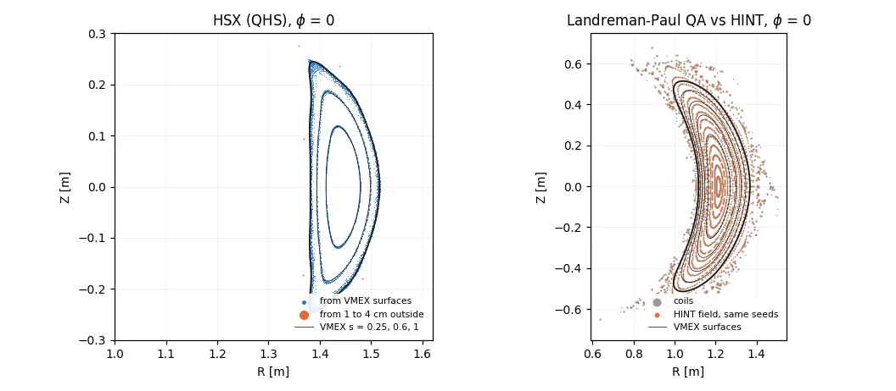

# Use ESSOS fields, coils and alpha tracing

VMEX and [ESSOS](https://github.com/uwplasma/ESSOS) meet at two Python seams,
and each one runs in a single direction. Neither package imports the other:
the equilibrium crosses as a wout, the coil field crosses as a tabulated
grid. Requires ESSOS (`pip install essos`).

| Direction | Call | Crosses as |
| --- | --- | --- |
| VMEX equilibrium to ESSOS | {func}`~vmex.core.tracing.essos_vmec_field` | wout tables |
| ESSOS coils to VMEX | {meth}`~vmex.core.mgrid.MgridField.from_coils` | cylindrical field grid |

There is no third seam. VMEX owns fixed and free-boundary equilibrium
physics and its diagnostics; ESSOS owns coil geometry, Biot-Savart fields,
particle and field-line tracing and loss diagnostics.

## Hand an equilibrium to ESSOS

```python
import vmex as vj

field = vj.essos_vmec_field("wout_case.nc")   # essos.fields.Vmec
print(field.nfp, field.AbsB([0.5, 0.0, 0.0]), field.surface.gamma.shape)
```

`essos_vmec_field` takes either an in-memory
{class}`~vmex.core.wout.WoutData` or a path to a `wout_*.nc`. Released ESSOS
reads a wout *file*, so an in-memory equilibrium is written to a temporary
wout; ESSOS loads every table eagerly in its constructor, so the file is
gone by the time the field is returned. Keyword arguments pass through to
`essos.fields.Vmec` (`ntheta`, `nphi`, `close`, `range_torus`), which set the
resolution of the `field.surface` ESSOS builds alongside the field.

Three consequences worth knowing before you build on this:

- **The write severs the gradient.** This seam is a diagnostic route, not a
  differentiable one. A differentiable alpha-loss objective needs the ESSOS
  array constructor (uwplasma/ESSOS#61) and is not available here.
- **Stellarator symmetry only.** Released ESSOS reads the symmetric wout
  tables, so an `lasym` equilibrium is rejected rather than silently
  half-transferred.
- **Radial resolution is yours to choose.** ESSOS interpolates the half-mesh
  tables linearly in `s`, so its two independent `|B|` channels (`AbsB` from
  `bmnc`, and `norm(B)` built from `bsub*`, `gmnc` and the geometry) agree
  better on finer radial grids. Solve on the grid your diagnostic needs.

The tables themselves cross unchanged: `tests/test_tracing.py` requires the
file and in-memory routes to give identical fields.

## Bring an ESSOS coil field back

VMEX keeps no coil code, and its free-boundary solver consumes only a
magnetic field, so an ESSOS coil set enters through one tabulation:

```python
from essos.coils import Coils

coils = Coils.from_json("coils.json")
coil_field = vj.MgridField.from_coils(coils)          # or pass a BiotSavart
# order=3 gives a tricubic (C1) interpolant, e.g. for guiding-center tracing
res = vj.solve_free_boundary(inp, external_field=coil_field)
```

Unset bounds default to the coil bounding box grown by 10%, and `nfp`
defaults to the coil set's own period count; the CLI equivalent is
`vmex input.case --coils coils.json` ({doc}`free-boundary`). Pass `rmin`/`rmax`/`zmin`/`zmax`
to bracket the plasma more tightly than the coils do, and `ir`/`jz`/`kp` to
set the grid (96, 96, 32 by default). The result is the same in-memory
{class}`~vmex.core.mgrid.MgridField` the mgrid-file lane produces — no
temporary file — and it is reused across every radial stage and hot restart.
`NZETA` must divide `kp`, which is VMEC2000's `mgrid_mod` pairing rule.

Judge the grid where NESTOR uses it, on the plasma boundary:
`examples/vmex_essos_workflow.py` prints the tabulated field's median and
maximum relative error against direct Biot-Savart there. Trilinear
interpolation degrades close to a filament, so a bounding box taken from the
coils is a sampling region, not an accuracy claim.

Tabulation is host-side and keeps no derivative with respect to coil shape.
For coil-shape gradients use
{meth}`~vmex.core.mgrid.MgridField.from_parameterized_cartesian_field`, which
stays inside JAX, or the virtual-casing residual
({doc}`free-boundary`). The reverse of this seam — recovering coils from a
field grid — is a coil-design inverse problem and belongs in ESSOS, not
here.

## Fields inside and outside the plasma

The live equilibrium exposes Cartesian `B()`, `gradB()`, `gradgradB()` and
`gradgradgradB()`, with corresponding VJPs in the originating problem's degrees
of freedom. Use `set_points_xyz(...)` or `set_points_flux(...)` to select
interior evaluation points.

This interior field is also the most accurate way to read an equilibrium. Against an exact
finite-pressure solution, it gives the current 10 to 70 times more accurately than the WOUT file
between s = 0.25 and 0.75, for equilibria from VMEX, VMEC2000 or VMEC++ alike (any WOUT can be
loaded with `vmex.state_from_wout`). Within the first few surfaces of the axis the WOUT current
is better. See {doc}`/explanation/interior-field`.

Tabulated coil and mgrid fields (`MgridField.from_coils`, `from_cartesian_field`, `from_file`,
`from_input`) take `order=1` (trilinear, the VMEC2000-parity default) or `order=3` (tricubic,
C1). On the Landreman-Paul QA coils tricubic is about 10x more accurate in |B| just outside the
LCFS and costs about 12% more solve time on a free-boundary deck; see {doc}`free-boundary`.

For an exterior field, `vj.VmecExtender.from_file("wout_my_case.nc",
external_field=coils.B)` combines the plasma's virtual-casing contribution with
the supplied coil field. The plasma part is a quadrature over a source grid on
the plasma surface, sampled by default from the boundary's aspect ratio, field
periods and requested digits. Its error grows rapidly near that surface, so at
the points where its error estimate misses the requested digits an eager call
switches to a target-graded quadrature, accurate to about 1e-12 of the field
down to 0.01 minor radii at a few milliseconds per point;
`with_graded_quadrature()` uses it everywhere, including under `jit`. Targets
must also stay away from coil filaments, and an MGRID field has a finite
tabulated domain. The exterior field-line example
(`examples/vmex_fieldline_tracing_finite_beta.py`) traces through the graded
field; a finite trace does not by itself establish magnetic topology. See
{doc}`/explanation/nestor-vacuum` for the derivation.



The README figure plots Poincare sections at the phi = 0 plane recorded by two
external benchmarks, both at zero beta, where the extended field equals the
coil field. `benchmarks/extender_islands_sections.npz` holds the sections and
`docs/_static/figures/sources/make_extender_islands_figure.py` draws them.

- **HSX (QHS)**, from the neutral-beam study at
  `neutral-beam-hsx` (not yet public):
  the main-coil Biot-Savart field, scaled to the QHS WOUT, traced from the
  VMEX surfaces s = 0.25 to 1 and from 1 to 4 cm outside the LCFS, for 200
  field periods. The lines launched on VMEX surfaces stay within 8 mm of
  their surface; the lines launched outside are open and leave the frame.
- **Landreman-Paul QA**, case Q0 of
  `vmex-hint-benchmark` (not yet public):
  the same seeds traced for 300 transits through the ESSOS coil field and
  through HINT's relaxed field on a 128^2 grid, with the VMEX free-boundary
  surfaces whose PHIEDGE matches the traced surface just inside the
  iota = 2/5 separatrix. The HINT and coil rotational transforms agree to
  3e-7, the magnetic axes to 1e-6 m, and the VMEX interior iota is within
  1e-3 of the traced one at (ns, mpol) = (101, 12). The coil field's island
  chain at iota = 2/5 bounds the region where VMEC's nested-surface model
  applies; a zero-beta free boundary asked to enclose more flux than that has
  no equilibrium (see {doc}`/explanation/validation`).

Joint boundary/coil optimization and the boundary-Schur adjoint remain advanced
workflows with substantial solve costs; they require independent derivative and
final-constraint checks.

## Walk both seams

`examples/vmex_essos_workflow.py` runs the round trip end to end: solve a
fixed boundary, hand it to ESSOS, compare the rotational transform from an
ESSOS field-line trace with the wout's `iotaf`, tabulate the ESSOS coil set,
solve a vacuum free boundary with it, and hand that equilibrium back across
the same seam.

`examples/free_boundary_essos_coils.py` is the dedicated pressure scan on
the coil-held plasma, and `examples/vmex_get_B_outside_plasma.py` queries the
exterior field with coils and virtual casing.

## Trace alpha particles

`vmex --trace` and {func}`~vmex.core.tracing.trace_alphas` trace fusion alphas
in Boozer coordinates with `essos.boozer`; see {doc}`trace-alpha-particles`.

For anything else ESSOS does with an equilibrium (field lines, surfaces,
`|B|` queries), use the bare `essos.fields.Vmec` from
{func}`~vmex.core.tracing.essos_vmec_field` above.
