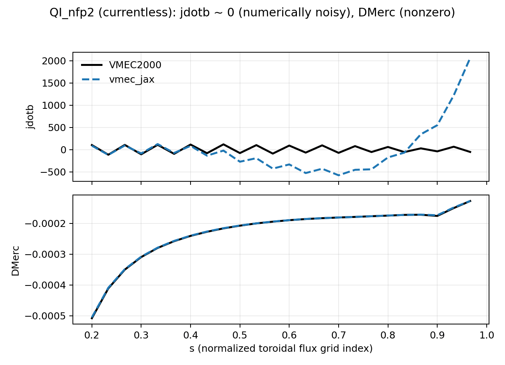
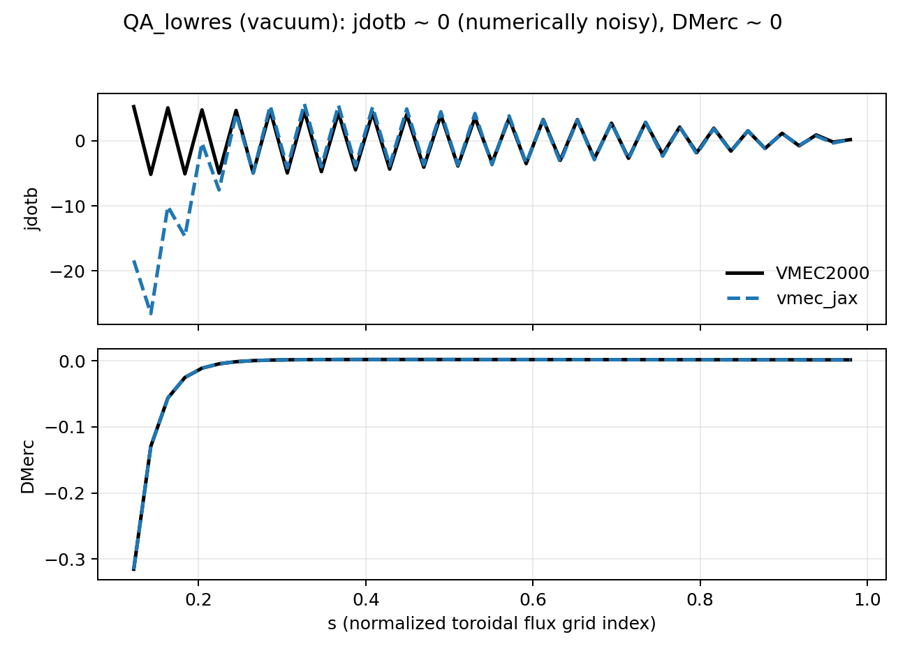

JXBFORCE / Mercier Diagnostics (``jdotb``, ``DMerc``, ``D_R``)
==============================================================

VMEC2000 writes a set of derived diagnostics related to the Mercier stability
criterion and to current-related scalars. In the VMEC2000 code base, these
quantities are computed primarily in:

- ``jxbforce.f`` (low-pass filtering of ``bsub{u,v}``, reconstruction of
  ``bsubs{u,v}``, and intermediate real-space scalars), and
- ``mercier.f`` (construction of the 1D Mercier terms).

In ``vmec_jax``, these quantities are computed during ``wout_*.nc`` generation
using a parity-first port of the VMEC2000 algorithms and conventions.
The same finite-beta channel reconstruction is also available to optimization
scripts through JAX-differentiable helpers:

- ``vmec_jax.mercier_terms_from_state`` returns ``DMerc`` and the component
  terms, the Glasser resistive-interchange diagnostic ``D_R``, plus
  ``jdotb``, ``bdotb``, ``bdotgradv``, ``torcur`` and ``ip`` on the full
  radial mesh.
- ``vmec_jax.jxbforce_profiles_from_realspace`` exposes the small algebraic
  reduction from real-space channels to those 1D profiles.
- ``vmec_jax.DMerc``, ``vmec_jax.GlasserResistiveInterchange``,
  ``vmec_jax.JDotB``, ``vmec_jax.BDotB``, ``vmec_jax.BDotGradV``,
  ``vmec_jax.ToroidalCurrent`` and ``vmec_jax.ToroidalCurrentGradient`` are
  objective objects that can be added directly to
  ``LeastSquaresProblem.from_tuples``.
- ``vmec_jax.JVector`` exposes the same JXBFORCE channels as flattened
  flux-coordinate current-density components ``(J^theta, J^zeta)``.  Use
  ``vmec_jax.BVector`` for Cartesian ``(Bx, By, Bz)`` targeting on one radial
  surface.
- ``vmec_jax.RedlBootstrapMismatch`` compares VMEC's state-derived
  ``<J.B>`` profile with the Redl bootstrap-current fit formula using
  polynomial density/temperature profiles and differentiable trapped-fraction
  quadrature.

Example:

.. code-block:: python

   problem = vj.LeastSquaresProblem.from_tuples(
       [
           (vj.DMerc(minimum=0.0, softness=1.0e-3).J, 0.0, 1.0),
           (vj.GlasserResistiveInterchange(maximum=0.0, softness=1.0e-3).J, 0.0, 1.0),
           (vj.JDotB(surfaces=(0.25, 0.50, 0.75)).J, 0.0, 1.0e-4),
           (vj.ToroidalCurrent(surfaces=(0.25, 0.50, 0.75)).J, target_torcur, 1.0e-4),
           (vj.RedlBootstrapMismatch(
               helicity_n=0,
               ne_coeffs=[3.0e20, 0, 0, 0, 0, -2.97e20],
               Te_coeffs=[15.0e3, -14.85e3],
               surfaces=(0.25, 0.50, 0.75),
           ).J, 0.0, 1.0e2),
           (vj.JVector(surfaces=(0.50,)).J, target_j_vector, 1.0e-6),
       ]
   )

This page documents:

- what VMEC2000 means by the ``jdotb`` and Mercier-related fields in ``wout``,
- why these calculations are numerically delicate in currentless / vacuum-like
  cases (so *relative* differences can be misleading), and
- what was required to match VMEC2000 parity in practice.

The Redl algebra and residual normalization are regression-tested against
SIMSOPT when SIMSOPT is installed:

.. code-block:: bash

   RUN_SIMSOPT_VALIDATION=1 python -m pytest tests/test_redl_bootstrap_simsopt_parity.py -q

That test uses the committed shaped-tokamak pressure fixture and compares both
the strict shared-geometry residual and the public vmec_jax state-geometry
approximation.

.. note::

   A large fraction of the logic below is parity-driven rather than
   "mathematically minimal". In particular, VMEC2000 uses storage conventions
   and symmetry/parity channels tailored to its internal Fourier machinery.
   ``vmec_jax`` mirrors these conventions to reproduce VMEC2000 outputs.

Glasser Resistive-Interchange Criterion
---------------------------------------

``vmec_jax`` also evaluates the resistive interchange diagnostic introduced by
Glasser, Greene and Johnson and related to the Mercier criterion by Landreman
and Jorge; see :doc:`references` [10] and [11].  In the notation of Landreman
and Jorge,

.. math::

   D_R = -D_{\mathrm{Merc}}
       + \frac{4 \pi^2}{(\iota')^2}
         \left[H - \frac{(\iota')^2}{8\pi^2}\right]^2,

with the necessary resistive-MHD condition ``D_R <= 0`` on nonzero-shear
surfaces.  The VMEC/Ichiguchi algebra in ``vmec_jax`` uses
:math:`S=d\iota/d\Phi` and :math:`D_{\mathrm{shear}}=S^2/4`, where
:math:`\Phi=2\pi\psi`.  Therefore the implemented normalized expression is

.. math::

   D_R = -D_{\mathrm{Merc}}
       + \frac{\left(H - S^2/2\right)^2}{S^2}.

The ``H`` term is reconstructed from the same differentiable surface integrals
used for ``DMerc``:

.. math::

   H = S \left(t_{JB}
       - \frac{\langle J\cdot B\rangle}{\langle B^2\rangle} t_{BB}\right).

When only Mercier profile terms are available,
``glasser_resistive_interchange_from_mercier_terms`` can fall back to
``H = -Dcurr``.  The full state path uses the ``jdotb/bdotb`` ratio above, so it
does not require that fallback.

Because the criterion contains ``1 / S^2``, ``D_R`` is physically meaningful
only away from zero magnetic shear.  Returned dictionaries include
``glasser_shear_valid`` for that mask and ``glasser_correction`` for the
positive correction added to ``-DMerc``.  The optimization wrapper follows the
same sign convention: ``vj.GlasserResistiveInterchange(maximum=0.0)`` applies
a smooth upper-bound residual to surfaces with ``D_R > 0``, and the
least-squares tuple target must be ``0.0`` because the bound is encoded by the
objective object itself.  Use a small ``shear_epsilon`` only as a smooth
regularization; it does not make zero-shear surfaces physically valid.
Generated ``wout`` files persist these profiles as ``D_R``, ``HGlasser``,
``GlasserCorrection`` and ``GlasserShearValid``.  Older VMEC/VMEC++ files that
do not contain them are read with a fallback reconstruction from ``DMerc``,
``DShear`` and ``DCurr``.

Key VMEC2000 Convention: Parity Channels For ``bsubu``/``bsubv``
----------------------------------------------------------------

VMEC2000 stores covariant components ``bsubu`` and ``bsubv`` in two "parity
channels" (the last dimension in Fortran is indexed ``0:1``). These channels
are *not* an even/odd-:math:`m` decomposition of the physical field.

In the fixed-boundary output path, VMEC2000 forces ``IEQUI=1`` before calling
``funct3d`` and then computes (in ``bcovar.f``) the odd-parity storage channel
as a scaled copy of the even channel:

.. math::

   \texttt{bsubu\_odd}(s,\theta,\zeta) &= \texttt{shalf}(s)\;\texttt{bsubu\_even}(s,\theta,\zeta),\\
   \texttt{bsubv\_odd}(s,\theta,\zeta) &= \texttt{shalf}(s)\;\texttt{bsubv\_even}(s,\theta,\zeta),

where ``shalf`` is VMEC's half-mesh :math:`\sqrt{s}` factor (stored on the
*full* mesh index in the Fortran implementation but derived from the half mesh
radial locations).

Immediately upon entering ``jxbforce.f``, VMEC2000 undoes this scaling before
performing its Fourier low-pass filter:

.. math::

   \texttt{bsubu\_odd} \leftarrow \texttt{bsubu\_odd}/\texttt{shalf}, \qquad
   \texttt{bsubv\_odd} \leftarrow \texttt{bsubv\_odd}/\texttt{shalf}.

This means the two parity channels are primarily a storage/algorithmic
convention: they let VMEC apply an :math:`m`-dependent normalization rule inside
its (mpol-1, ntor) filter loop without having to rebuild the parity split from
Fourier coefficients.

**What ``vmec_jax`` does**

To match VMEC2000 output parity in the ``wout`` Mercier/jdotb diagnostics,
``vmec_jax`` now constructs these parity channels the same way by default.
See: ``vmec_jax/wout.py`` (Mercier/jxbforce parity channel construction) and
VMEC2000 ``bcovar.f``/``jxbforce.f`` for the reference behavior.

JXBFORCE Low-Pass Filter (Conceptual Summary)
---------------------------------------------

VMEC2000 applies a low-pass filter to the covariant components ``bsubu`` and
``bsubv`` using a truncated set of modes:

- poloidal: :math:`m \le \texttt{mpol}-1`
- toroidal: :math:`n \le \texttt{ntor}`

The filtered fields are then used to compute cancellation-sensitive quantities
such as ``itheta``, ``izeta``, ``bdotk`` (and ultimately ``jdotb`` and Mercier
terms). The filter is implemented with VMEC's precomputed trigonometric tables
(``cosmui``, ``sinmui``, ``cosnv``, ``sinnv``, ...) and includes VMEC's Nyquist
half-weighting at the geometric Nyquist limits.

``vmec_jax`` mirrors this by using the same VMEC trigonometric tables and the
same (mpol-1, ntor) cutoffs when building the ``wout`` diagnostics.

From Filtered Fields To ``jdotb`` (VMEC2000 Discretization)
-----------------------------------------------------------

After the filter, VMEC2000 reconstructs ``bsubsu`` and ``bsubsv`` and defines
two auxiliary fields (names follow the VMEC2000 source):

.. math::

   i_\theta(js) &= \frac{1}{\mu_0}\left(\texttt{bsubsv}(js) - \frac{\texttt{bsubv}(js+1)-\texttt{bsubv}(js)}{h_s}\right),\\
   i_\zeta(js)  &= \frac{1}{\mu_0}\left(-\texttt{bsubsu}(js) + \frac{\texttt{bsubu}(js+1)-\texttt{bsubu}(js)}{h_s}\right),

where :math:`h_s = 1/(ns-1)` is the uniform VMEC radial grid spacing on the
normalized toroidal-flux grid and ``js`` is the (1-based) full-mesh radial
index.

Then:

.. math::

   \texttt{bdotk}(js) =
   i_\theta(js)\;\texttt{bsubu1}(js) + i_\zeta(js)\;\texttt{bsubv1}(js),

with ``bsubu1``/``bsubv1`` computed as VMEC's half-mesh average
(:math:`\tfrac12(\cdot_{js+1}+\cdot_{js})`).

Finally, VMEC2000 forms a 1D profile ``jdotb`` as a (weighted) flux-surface
average of ``bdotk`` with a volume normalization:

.. math::

   \texttt{jdotb}(js) \propto \frac{2}{\texttt{vp}(js+1)+\texttt{vp}(js)}
   \left\langle \frac{\texttt{bdotk}(js)}{\sigma(js)} \right\rangle,

where :math:`\langle\cdot\rangle` denotes a VMEC quadrature sum on the internal
(:math:`\theta,\zeta`) grid and :math:`\sigma` is the anisotropy factor
(``sigma_an``; :math:`\sigma\equiv 1` for isotropic equilibria).

Numerical Sensitivity: Why ``jdotb`` Can Look Like Noise
--------------------------------------------------------

For currentless / vacuum-like cases (e.g. inputs with effectively zero current
profile), the physically relevant signal in ``jdotb`` may be small. However,
VMEC2000's discretization includes:

- a *radial finite difference* amplified by :math:`1/h_s`,
- cancellation-prone sums in the (mpol-1, ntor) Fourier low-pass filter,
- axis and edge extrapolations, and
- :math:`\sqrt{s}`-weighted parity conventions.

As a result:

- ``jdotb`` can be dominated by discretization noise and cancellation error in
  some configurations,
- *relative* error comparisons become uninformative when the reference value is
  near zero or oscillatory, and
- agreement should be evaluated in context (e.g. by checking that the full
  Mercier terms match and that ``jdotb`` parity holds in cases where the signal
  is demonstrably nonzero).

In parity work we therefore adopt the VMEC community convention of excluding a
small number of points near the magnetic axis and (optionally) the edge when
comparing cancellation-limited stability diagnostics.

Profiles: QI_nfp2 + QA_lowres (``jdotb`` should be small)
---------------------------------------------------------

The following figures compare VMEC2000 vs ``vmec_jax`` profiles for two
configurations where ``jdotb`` is expected to be small and differences are not
physically meaningful. In both plots, we skip the first 6 radial points and
drop the edge point to avoid the most cancellation-limited region.

   ``QI_nfp2``: ``jdotb`` (cancellation-limited) and ``DMerc`` (nonzero).

   ``LandremanPaul2021_QA_lowres``: vacuum-like case; ``DMerc`` should be ~0.

For current-driven cases, use the bundled reactor-scale QA/QH examples when a
nonzero ``jdotb`` profile is needed for targeted parity checks. The small-signal
QI/QA plots above remain the default documentation figures because they are the
most stable examples for explaining the cancellation-limited behavior of
``jdotb`` and Mercier diagnostics.

Implementation Pointers (Source Code)
-------------------------------------

The relevant ``vmec_jax`` code paths are:

- ``vmec_jax/wout.py``:

  - parity-channel construction for ``bsub{u,v}``,
  - jxbforce-style low-pass filter and reconstruction,
  - Mercier and ``jdotb`` assembly.

Performance Notes (vmec_jax vs VMEC2000)
----------------------------------------

VMEC2000 implements these diagnostics in Fortran with explicit loops over
``(m,n)`` modes and over the reduced ``(theta,zeta)`` grid. For parity work,
``vmec_jax`` originally mirrored this ordering closely, including Python-level
loop nests for some cancellation-sensitive sums. That path is useful for
debugging, but it is **too slow** to be a good default.

Today, ``vmec_jax`` uses **vectorized NumPy contractions** (``einsum``) for the
``wrout``-style Nyquist analysis and the ``jxbforce`` filter by default. These
vectorized paths preserve the VMEC2000 discretization but may change floating
point summation order slightly.

If you need the slow loop order for debugging, the following env vars switch
back to explicit loops:

- ``VMEC_JAX_WROUT_LOOP=1``: use loop-based ``wrout`` Nyquist analysis.
- ``VMEC_JAX_JXBFORCE_LOOP=1``: use loop-based ``jxbforce`` reconstruction of
  ``bsubsu/bsubsv``.
- ``VMEC_JAX_BSUB_FILTER_LOOP=1``: use loop-based ``jxbforce`` low-pass filter.
- ``VMEC_JAX_MERCIER_EXACT_SUM=1``: use explicit ``theta/zeta`` summation order
  in Mercier surface averages.

The reference VMEC2000 implementations are:

- ``bcovar.f`` (odd-channel storage convention for ``IEQUI=1`` outputs)
- ``jxbforce.f`` (filter and ``itheta``/``izeta``/``bdotk`` construction)
- ``mercier.f`` (Mercier term assembly)

Reproducing The Figures
-----------------------

These figures were generated from VMEC-style ``wout_*.nc`` files using:

.. code-block:: bash

   python tools/diagnostics/plot_wout_profiles_compare.py \
     --vmec /path/to/vmec2000/wout_case.nc \
     --jax  /path/to/vmec_jax/wout_case.nc \
     --vars jdotb,DMerc \
     --axis-skip 6 --drop-edge \
     --out docs/_static/figures/case_jdotb_dmerc_parity.png
