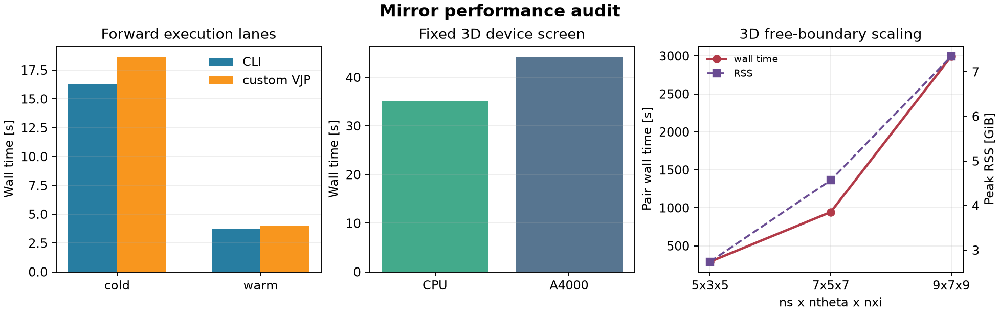
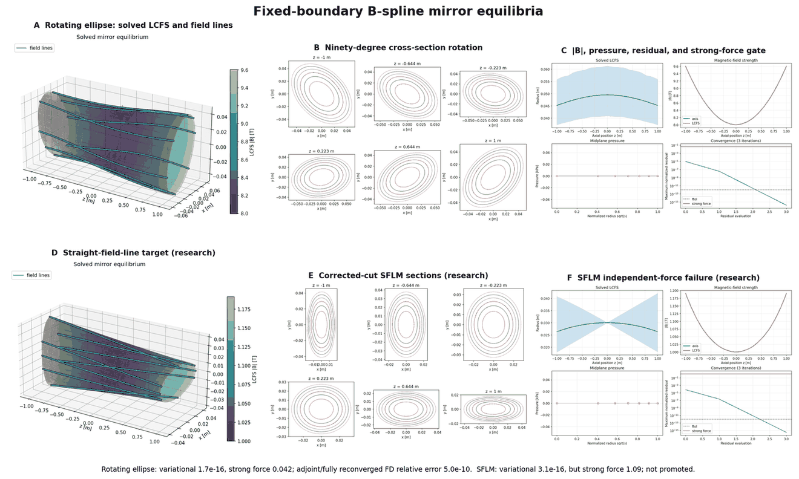

Mirror geometry
===============

``vmec_jax.mirror`` is the open-field-line equilibrium backend. It uses
coordinates ``(s, theta, xi)`` with a nonperiodic axial coordinate and
fixed-flux end cuts. It does not reinterpret a straight mirror as a periodic
torus. Axisymmetric fixed- and free-boundary equilibria are supported;
nonaxisymmetric straight mirrors remain a research API.

Open topology and end cuts
--------------------------

The open coordinates are
:math:`(s,\theta,\xi)\in[0,1]\times[0,2\pi)\times[-1,1]`. The lateral
surface :math:`s=1` is the plasma-vacuum interface. The planes
:math:`\xi=\pm1` are prescribed computational cuts through the flux tube;
magnetic flux passes through them, so they are neither material interfaces nor
``B.n=0`` boundaries. The divergence-free representation is

.. math::

   \sqrt{g}B^\theta = I'(s)-\partial_\xi\lambda, \qquad
   \sqrt{g}B^\xi = \Psi'(s)+\partial_\theta\lambda,

with :math:`B^s=0` and a zero-surface-mean gauge for :math:`\lambda`.
All theta samples at the magnetic axis denote one physical point. Writing
:math:`q_0=\lim_{s\to0}r\,\partial_s r`, single-valued axial field requires

.. math::

   \partial_\theta\lambda(0,\theta,\xi)
   = \Psi'(0)\left[\frac{q_0(\theta,\xi)}{\langle q_0\rangle_\theta}-1\right].

The solver eliminates the axis stream function with this condition and
includes its geometry dependence in variational and implicit derivatives.
Axis ``|B|`` nonuniformity is stored as a separate promotion diagnostic.

An unbounded exterior Green solve requires a geometrically closed integration
surface, so disks temporarily close the two cuts. Their Neumann data continue
the nonzero plasma and applied-field through-flux across each cut. The disks do
not close the plasma or acquire an interface pressure-balance equation.
Tangency and total-pressure continuity are enforced only on the lateral LCFS.

Current capability
------------------

The branch currently includes:

* axisymmetric and nonaxisymmetric fixed-boundary finite-current solves,
* an isotropic VMEC-style conserved-mass pressure energy with independent
  weak and pointwise force diagnostics,
* a free-space boundary-integral vacuum model with an ``xyz -> B`` field
  callable or the shared ESSOS/MAKEGRID-compatible ``MgridField``; coil
  geometry and Biot-Savart evaluation remain in ESSOS,
* coupled axisymmetric free-boundary beta continuation with compressed
  restart files,
* a closed-surface Neumann solve on the lateral LCFS and both end disks,
* component-wise nonlinear convergence checks at a requested ``ftol=1e-12``.

The axisymmetric free-boundary path has completed unbounded-exterior studies
through 50% requested beta. The nonaxisymmetric free-boundary path is a
deferred research lane because its point observables were not monotone under
spatial refinement. A native periodic
B-spline hybrid geometry and fixed-boundary research solve now exist. The
removed Fourier projection is not a supported capability, and the hybrid still
requires the residual, limiting-case, and derivative gates below.

Toroidal hybrid foundation
--------------------------

The former square-axis Fourier target, continuation driver, examples, and
benchmarks were experimental and have been removed. A toroidal
stellarator-mirror hybrid requires a native spline axis and surface state
that can represent long straight sections joined by rotating-ellipse curved
sections. The first geometry gate now provides a periodic cubic B-spline
racetrack and a rotation-minimizing frame with periodic holonomy correction.
Circle tests cover curvature, arc length, frame closure, and centerline
coefficient gradients; a 32-control racetrack retains exact straight interiors
over 56% of its sampled axis. The shared geometry metric now embeds circular
and rotating-ellipse sections around that frame without end cuts. Its circular
limit recovers analytic torus volume to ``2e-5`` relative and keeps discrete
``div(B)`` below ``2e-14``; the racetrack ellipse rotates 90 degrees between
the long legs and matches its area-times-axis-length volume to ``3e-4``.
The coefficient-native solver now applies the same radial-Gauss energy and
``ftol=1e-12`` variational contract. The current-free initializer obtains the
poloidal stream function from the axial average of
:math:`\sqrt{g}/g_{\xi\xi}`; on concentric circular surfaces this produces the
vacuum :math:`1/R` field and fixes its sign and zero-mean gauge. The complete
circular-torus solve jointly advances radius and stream function in 27
residual-Newton evaluations. Its variational/staggered-weak residuals are
``1.88e-15/1.83e-15`` and normalized ``div(B)=4.64e-15``. The independently
reconstructed pointwise-force norm improves from ``0.709`` at ``ns=5`` to
``0.570`` at ``ns=7`` but is not yet small. It remains an explicitly
unconverged, non-gating diagnostic until a manufactured half-to-full force
reconstruction refines. The finite-current racetrack also solves its stream
function and its 90-degree ellipse is an actual fixed-boundary equilibrium,
not a Fourier projection. Its variational and staggered-weak residuals reach
``ftol=1e-12`` and normalized ``div(B)`` is below ``2e-12``. A differentiable
periodic RK4 tracer follows the solved contravariant field for multiple
circuits and measures nonzero iota. On the circular analytic fixture it
recovers ``iota=I'/Psi'`` and its current derivative to ``2e-13`` relative.
VMEC limit parity, beta refinement, hybrid solver adjoints, and release plots
remain open, so this is a research implementation and is not yet exported as
a supported equilibrium model.

Plotting and output scope
-------------------------

Straight-axis mirror examples write mirror-native ``mout_*.nc`` files and
render horizontal 3D, coil, cap-to-cap field-line, ``|B|``, pressure,
cross-section, and residual figures. The same figures can be regenerated with
``vmec --plot mout_*.nc``. The data include geometry, the stream function,
Cartesian magnetic field, isotropic pressure, interface residuals, solver
history, normalized variational, staggered-weak, and pointwise-force residuals,
normalized ``div(B)``, and optional coil curves. The
variational residual defines ``ftol``. The staggered weak residual independently
assembles the first variation on the energy quadrature and is checked on the
same constrained solver variables. The pointwise force reconstructs
``J x B - grad(p)`` on the full mesh and remains a non-gating spatial-error
diagnostic. Its total, near-axis, first-radial-row, bulk, and end-collar norms
are reported separately. ``div(B)`` checks the field representation.
Straight-axis mirror data are never encoded as a toroidal WOUT file.

The saved ``|B|`` array is reconstructed from the same radial Gauss cells used
by the magnetic-energy functional. Cartesian field samples remain separate for
field-line direction. Plots resample the uniformly spaced poloidal data with
their resolved Fourier modes, so low-order ellipses are not displayed as
polygons.

The compact six-point isotropic reference data are recorded in
``benchmarks/mirror_free_boundary_axisymmetric.json``. At 50% requested and
achieved central beta, the solve reaches variational and staggered-weak
residuals of ``5.38e-15`` and ``7.08e-16`` in 10 iterations. The center radius
increases by 7.64% and the
on-axis field decreases by 24.91%; the solved field ratio is 0.7509 versus
the paraxial ``sqrt(1-beta)=0.7071`` reference. The three-resolution scan took
137 seconds and peaked at 12.1 GiB RSS; ``(9,17)`` remained in dense Jacobian
assembly after five minutes. These measurements make free-boundary Jacobian
memory and runtime explicit optimization targets.

Fixed-boundary 3D solver
------------------------

The fixed-boundary host solver jointly advances geometry and a gauge-free
stream function for helical boundaries with finite axial current. Its Newton
preconditioner combines radial, Fourier-poloidal, and CGL-axial model
stiffness. The eliminated weighted-mean stream-function node is handled by a
symmetric lift and projection, so the reduced preconditioner remains positive
definite.

The formal full-physics test refines ``(ns,nxi)`` through ``(5,5)``, ``(7,7)``,
and ``(9,9)`` at ``mpol=1`` and requires component-wise residuals below
``1e-12``. Radial magnetic energy uses two-point Gauss integration. This is
essential: the former midpoint rule admitted an alternating lambda hourglass
mode and its published refinement data were rejected. The corrected lambda
and pitch profiles are smooth, and a dedicated regression test assigns the
alternating mode finite energy.

Two manufactured pointwise-force fixtures isolate the reconstruction from the
nonlinear solve. A cylindrical finite-beta state with analytic radial
``B_z(s)`` and pressure balance converges at second order when ``ns`` doubles.
A theta-dependent self-similar tube carrying an exactly uniform Cartesian
field gives normalized Lorentz force below ``1e-12``. These gates show that
radial differentiation and nonaxisymmetric coordinates work independently;
they do not promote shaped solved states whose pointwise force remains large.
The first corrected rotating-ellipse audit also exposed a missing axis
condition: the old state varied ``|B|`` by 9--20% over theta at ``s=0`` even
though those samples are one physical point. That freedom has been removed;
all earlier shaped pointwise-force values must be regenerated before use.

At ``ns=15,nxi=15,ntheta=5``, the variational force is ``2.25e-13`` and the
independently differenced all-row/axis/bulk force residuals are
``0.0430/0.107/0.00972``. The split is intentional: the first two off-axis
rows expose the still-open mode-regular axis stencil instead of contaminating
the bulk convergence measure. At ``ns=31`` (3,805 unknowns), the matrix-free
solve reaches ``6.81e-13`` in 141 seconds and bulk force falls to ``0.00628``.
The axis residual and 10,500 Krylov iterations remain promotion blockers.
Systems through 2,048 unknowns have a bounded dense reference polish; larger
systems report matrix-free convergence honestly.

Independent nonaxisymmetric analytic fixtures
----------------------------------------------

``vmec_jax.mirror.analytic`` contains validation data that never call an
equilibrium solve. ``RotatingEllipseParaxial`` maps a unit circle through a
flux-conserving ellipse whose major axis turns by 90 degrees from one end to
the other. A compensating field-line-label angle makes the first-order vacuum
identity vanish while preserving

.. math::

   X_{1c}Y_{1s}-X_{1s}Y_{1c}=\bar B/B_0.

It evaluates the Rodriguez-Helander-Goodman Appendix-C Riccati equation and
the independent general and magnetic-well-minimum formulas for
``(B20,B2c,B2s)``. Tests recover those coefficients from low-radius Fourier
samples and verify that the order-``r`` ``m=1`` field strength is zero. This is
the coefficient oracle for the native-spline fixed-boundary solve; it is not
itself an equilibrium.

``StraightFieldLineMirror`` implements the Agren-Savenko paraxial scalar
potential, on-axis field, Clebsch labels, straight nonparallel field lines,
and analytic elliptical sections. Its tests verify curl-free field, the
expected order-``(a/c)^2`` solenoidal and field-line truncation errors, axial
flux conservation, and

.. math::

   B_0(z)=\frac{B_0(0)}{1-z^2/c^2}, \qquad
   \mathcal E(z)=\frac{1+|z/c|}{1-|z/c|}.

Both fixtures require a thin tube and ``|z|<c``. The separate
``long_thin_beta_scaling`` helper records the simultaneous
``beta`` and ``lambda=(a/L)^2`` ordering only for ``beta <= 0.3`` and
``a/L <= 0.2``. Its ``sqrt(1-beta)`` field ratio is an asymptotic pressure-
balance reference, not a finite-beta solution or ellipticity prediction.

Native spline basis status
--------------------------

``vmec_jax.mirror.splines.CubicBSplineBasis`` now supplies the isolated basis
contract for the next solver state. Open axes use clamped knots; closed hybrid
centerlines use folded uniform periodic cubics. Values and two derivatives are
JAX operations, each nonzero span uses four-point Gauss-Legendre quadrature,
and open refinement uses exact Boehm knot insertion. The basis matches SciPy,
reproduces cubics, preserves curves under insertion, closes periodic values and
two derivatives, and has tested JVP/VJP actions. For a smooth periodic fixture,
maximum errors at 8, 16, 32, and 64 controls are ``5.06e-3``, ``2.76e-4``,
``1.65e-5``, and ``1.02e-6``.

``SplineMirrorState`` and ``SplineMirrorBoundary`` store geometry and stream
function coefficients rather than sampled values. ``SplineMirrorDiscretization``
evaluates them on endpoint-augmented Gauss nodes before calling the shared
geometry and energy kernels, and applies side/end constraints plus the lambda
gauge in coefficient space. A quadratic flared tube uses 9 coefficients and 26
evaluation nodes versus 41 Chebyshev nodes; volume agrees to roundoff, total
energy agrees to ``5.0e-13`` relative, and an energy directional derivative
agrees with finite differences to ``1.9e-8`` relative.

``solve_spline_fixed_boundary_cli`` now minimizes the same scalar-pressure
energy directly in the active spline coefficients. It fixes the side and end
coefficients, eliminates the weighted stream-function gauge, and uses the same
host L-BFGS plus residual-Newton policy as the Chebyshev solve. The independent
staggered first variation is assembled on the quadrature grid and pulled back
through the spline evaluation matrix rather than reused from autodiff.

For an ``ns=5`` finite-pressure, finite-current flared tube, both paths converge
in 59 iterations below ``ftol=1e-12``. Seven spline coefficients replace nine
Chebyshev axial nodes and reduce active variables from 45 to 31. Relative
differences are ``5.1e-7`` in energy, ``5.9e-6`` in volume, and ``3.2e-4`` in
center radius.

Independent solves at ``(ns,nxi)=(5,9),(7,13),(9,17)`` pair 7, 9, and 11
spline coefficients with the nodal grids. Energy error decreases
``5.12e-7 -> 1.46e-7 -> 5.60e-8``, volume error decreases
``5.91e-6 -> 2.57e-6 -> 1.04e-6``, and sampled radius RMS error decreases
``2.40e-4 -> 6.49e-5 -> 2.94e-5``. On the finest grid the Cartesian field and
``|B|`` differ by ``7.02e-4`` and ``3.05e-4`` RMS. A relative coefficient
test is deliberately not applied to the near-zero gauge stream function; the
physical field is the invariant comparison. Splines use roughly half the
active radius variables and take 3.27, 3.19, and 5.00 seconds versus 5.24,
8.09, and 11.47 seconds for the local nodal solves. All variational and
independent weak residuals remain below ``1.3e-15``. Compact evidence is in
the ``open_spline`` section of ``benchmarks/mirror_fixed_boundary.json``.

Above the dense-reference threshold, a 585-variable ``mpol=1`` cylinder uses
the same radial/Fourier tensor preconditioner with the spline Galerkin axial
stiffness. It converges both variational and staggered residuals to
``1.23e-15`` and recovers the exact radius to ``5.6e-15``. Its 1,000 inner
GMRES iterations expose conditioning work still assigned to Milestone 8; this
result establishes a working matrix-free path, not a final scaling claim.

The periodic coefficient block uses every cyclic B-spline coefficient and
passes its gauge-free shape and linearity tests. It is not enabled for closed
primal solves. On the 892-variable finite-current racetrack, forced
matrix-free GMRES matches dense energy to ``3.3e-16`` and radius to
``9.5e-11`` while reducing wall time from 8.71 to 5.81 seconds, but requires
3,000 Krylov iterations and leaves relative linear residual 0.136. CG and
MINRES improve that residual only to 0.0167 and 0.0158 after 2,000 and 1,852
iterations. This fails the structured-solver gate: closed production studies
remain below the 1,024-variable dense limit, and the periodic block is retained
only for the bounded closed-adjoint work.

On the flared finite-beta case, knot refinement from 5 to 11 coefficients
reduces relative energy error against an ``nxi=17`` Chebyshev oracle from
``1.09e-6`` to ``5.14e-8`` and volume error from ``1.19e-5`` to ``2.18e-6``.
Both errors decrease at every refinement and all coefficient solves retain
variational and staggered residuals below ``9e-15``.

Nonaxisymmetric spline evidence
-------------------------------

Changing a prescribed spline boundary uses
``SplineMirrorDiscretization.transfer_boundary``. It rescales every nested
surface at spline collocation nodes before projection, instead of replacing
only the LCFS and risking crossed surfaces. The optimizer also rejects any
trial with a changed Jacobian sign, matching the regular VMEC-JAX merit policy.

A five-stage shape continuation solves a thin ellipse rotating 90 degrees from
cap to cap. With 12 theta nodes, half-turn symmetry is exact and the forbidden
``m=1`` field-strength signal is below ``9e-16``. Odd or under-integrated theta
grids alias even nonlinear products into ``m=1`` and are not valid for this
gate. The compatible staggered field recovers the analytic ``m=2`` phase, but
its amplitude is not yet converged. The full-mesh axis ``|B|`` reconstruction
is explicitly non-gating, like the full-mesh pointwise force.

The independent Straight Field Line Mirror gives a stronger current gate. For
semi-axis scale 0.03 m, the solved Cartesian field has mean direction cosine
``0.999956`` and minimum ``0.999316`` against the gradient of the analytic
scalar potential. Halving the radius improves these to ``0.999988`` and
``0.999810``, consistent with paraxial directional convergence. Full-mesh
field magnitude does not converge under the same study, so magnitude promotion
awaits a staggered comparison. Compact positive and negative evidence is in
the ``nonaxisymmetric_validation`` section of
``benchmarks/mirror_fixed_boundary.json``.

A fixed-boundary pressure continuation calibrates conserved mass from the
vacuum geometry and reaches achieved reference beta ``0.0969``. The center
field falls by 2.26%. Refining ``ns=5`` to 7 changes that field ratio by
0.049%; increasing theta nodes from 12 to 16 changes it by 0.0006%.
Pressure-first and shape-first continuations agree in state to ``3.4e-14``
relative RMS, excluding continuation order as the source of the response.

The local quadrupole converges more slowly than these global observables.
Increasing axial spline coefficients through 7, 9, 11, and 13 decreases the
compatible midplane ``m=2`` amplitude monotonically from ``0.0567`` to
``0.00795 T``. The finest value remains about 48% above the direct paraxial
estimate. Further knot escalation is deferred to the structured-preconditioner
milestone; the amplitude is not promoted early merely because the equilibrium
residual is small.

The parser-free root example runs both fixtures through five coefficient-space
continuation stages and writes MOUT plus horizontal 3-D, cross-section,
``|B|``, residual, symmetry, and analytic-direction figures::

   python examples/mirror_fixed_boundary_nonaxisymmetric.py

At its compact demonstration resolution, the rotating ellipse reaches a
variational/staggered-weak residual of ``7.91e-17/7.71e-17``, normalized
``div(B)=7.37e-15``, and forbidden ``m=1`` amplitude below ``5e-15``. The SFLM
reaches ``9.68e-17/9.69e-17`` and ``div(B)=7.86e-15``; its mean field-direction
cosine remains above ``0.9974`` including the fixed-flux end cuts. The figures
show the actual solved nested surfaces and field lines, not the analytic target
alone.

Fixed-boundary implicit gradients
---------------------------------

``fixed_boundary_adjoint`` differentiates a scalar diagnostic through the
converged isotropic fixed-boundary equilibrium. Its residual is the packed
energy gradient after eliminating fixed side/end geometry and the lambda
gauge. The transpose Hessian action is exact JAX reverse AD, while GMRES uses
the same separable radial, poloidal, and axial preconditioner as the primal
Newton polish. Nonlinear iteration histories are not differentiated or saved.

The returned gradient covers boundary radius, axial flux derivative,
mass/pressure profile, and axial current derivative in one reverse solve. The
root nonaxisymmetric example differentiates the rotating-ellipse volume with
respect to a native spline boundary coefficient and checks it against two
fully reconverged finite-difference equilibria::

   python examples/mirror_fixed_boundary_nonaxisymmetric.py

For the finite-pressure, finite-current flared tube, the primal reaches
``ftol=1e-12``. The adjoint converges in four iterations to relative linear
residual ``8.85e-16`` and the combined directional derivative agrees with
central differences to ``1.10e-7`` relative. The example writes mirror-native
MOUT and horizontal 3D, ``|B|``, cross-section, pressure, residual, and
sensitivity figures. Above the dense-reference threshold, an ``ns=17,
nxi=41`` case with 585 active unknowns takes 3.41 seconds and 171 adjoint
iterations to reach ``9.23e-10`` relative residual; its primal polish takes
8.61 seconds and 951 linear iterations. Compact evidence is in the
``implicit_derivatives`` section of ``benchmarks/mirror_fixed_boundary.json``.
A three-color radial block
factorization reaches ``2.69e-15`` without a GMRES correction, but costs 4.79
seconds for this one right-hand side. Unlike a many-column forward Jacobian,
the scalar reverse adjoint cannot amortize its assembly, so preconditioned
GMRES remains the default and block mode is an opt-in verification path.
``solve_fixed_boundary_implicit`` exposes the same converged state directly
to JAX objectives. Its static context keeps the host solver out of the AD tape::

   implicit_config = make_fixed_boundary_implicit_config(
       initial_state, grid, config, solve_lambda=True
   )
   state = solve_fixed_boundary_implicit(parameters, implicit_config)
   gradient = jax.grad(
       lambda controls: solve_fixed_boundary_implicit(
           controls, implicit_config
       ).radius_scale[1, 0, grid.nxi // 2]
   )(parameters)

The custom VJP matches the explicit isotropic adjoint. The supported
free-boundary field derivative follows.

``spline_fixed_boundary_adjoint`` uses that same transpose-solve implementation
on the coefficient-native residual. Boundary spline coefficients, flux,
conserved mass, and current remain differentiable; neither the host iterations
nor spline evaluation history is stored. A combined axisymmetric direction and
a nonaxisymmetric ``solve_lambda=True`` boundary direction agree with two
independently reconverged equilibria to ``3.92e-10`` and ``3.20e-10`` relative.
``spline_fixed_boundary_tangent`` solves the complementary forward system
``F_u du = -F_p dp`` with exact residual JVPs and the same preconditioner. On a
nonaxisymmetric finite-current ``solve_lambda=True`` case, both radius and
stream-function tangents agree with two fully reconverged centered differences
within ``2e-4`` in relative state norm, with linear residual below ``1e-8``.
This establishes both open-spline derivative directions. Closed-axis and
centerline-control derivatives remain part of fixed-hybrid promotion.

Axisymmetric free-boundary implicit gradients
---------------------------------------------

``free_boundary_adjoint`` differentiates the supported axisymmetric exterior
equilibrium with respect to a differentiable external-field callable, axial
flux, pressure profile, and axial current. The physical fixed point
contains the lateral LCFS and plasma-interior radii. The exterior Neumann BIE
eliminates vacuum unknowns, so its exact reverse-AD field and shape responses
enter the interface-stress rows directly. The transpose solve reuses the
separable primal plasma preconditioner and does not assemble a dense Jacobian
or retain nonlinear iterations.

The validation uses a differentiable curl-free paraxial mirror field and
checks its strength and axial-curvature controls against fully reconverged
equilibria. Coil-design derivatives belong to the ESSOS integration layer;
vmec_jax differentiates only the supplied field object.

This derivative holds fixed the end-cut radii and physical pressure profile.
The nonaxisymmetric free-boundary derivative is deliberately unavailable
because M7 failed local Fourier-mode refinement; it will not be presented as
a supported gradient.

``device=None`` uses the shared measured device policy. On the office host,
the corrected ``15x15`` case took 35.2 seconds on CPU and 44.2 seconds on one
RTX A4000. Energy and force diagnostics agree to numerical precision. Explicit
``device=`` arguments and JAX platform environment pins are always honored.

At the small finite-pressure/current fixed point used to compare public lanes,
the office-CPU CLI takes ``16.28/3.75 s`` cold/warm. The custom-VJP forward
takes ``18.65/4.04 s``, or 14.6% cold and 7.7% warm overhead, with a 5.6%
peak-RSS increase. The CLI therefore remains the fastest forward interface;
the differentiable lane pays a bounded callback cost and supplies the
iteration-independent reverse solve. Complete scaling values are in the
``performance`` section of ``benchmarks/mirror_fixed_boundary.json``.

Release evidence
----------------

Coverage must run without ``--source=vmec_jax.mirror``; that coverage option
pre-imports the package and can trigger a duplicate NumPy extension import on
macOS before pytest collection. The equivalent report restriction is applied
after execution::

   coverage erase
   PYTEST_DISABLE_PLUGIN_AUTOLOAD=1 coverage run -m pytest \
       tests/mirror -m "not full" -q
   RUN_FULL=1 PYTEST_DISABLE_PLUGIN_AUTOLOAD=1 coverage run --append \
       -m pytest tests/mirror/test_implicit.py -q
   coverage report --include="*/vmec_jax/mirror/*" --fail-under=95

The release audit is rerun from the final branch rather than copied from an
intermediate repository snapshot. Generated MOUT files, field-line traces, and
figures remain ignored. Four compact JSON files retain numerical evidence for
fixed open, free axisymmetric, deferred free nonaxisymmetric, and fixed hybrid
ownership; repository-shape and promotion gates are maintained in ``plan.md``.

Beta scan example
-----------------

From a developer checkout, run:

.. code-block:: bash

   python examples/mirror_free_boundary_beta_scan.py

The script has editable inputs at its top and no command-line parser. It
solves every beta point from 0 through 50% and writes CSV plus three reviewed
figures under ``results/mirror_free_boundary_beta_scan/``. The figures include horizontal
``z`` geometry, LCFS displacement, on-axis and LCFS ``|B|``, pressure balance,
coils, cap-to-cap field lines, field arrows, and coupled residual histories.
Generated results are ignored by git. CSV rows include closed-surface
compatibility and BIE condition number for every beta point.

Set ``SAVE_RESTARTS = True`` to write one compressed ``.npz`` hot-start per
beta point. :func:`vmec_jax.mirror.output.load_free_boundary_restart` checks its
schema and plasma-grid shape before returning the boundary, plasma state, and
calibrated mass scale. The BIE potential is recomputed because the moving
boundary changes at every continuation point.
Set ``RESTART_FROM`` and trim ``BETAS`` to resume only the unfinished suffix;
the original beta-zero boundary remains the pressure-profile reference.

Interpreting beta
-----------------

The equilibrium uses a VMEC-style conserved mass profile. Because geometry
changes pressure at fixed mass, the beta-scan driver adds one mass-amplitude
unknown and one central-pressure equation to the coupled nonlinear system.
Requested and achieved central beta therefore agree to the solve tolerance
without an outer sequence of complete solves. For the default profile
``p(s) = p0 (1-s)``, pressure vanishes at the LCFS, so a 10% central beta does
not imply a 10% edge-pressure jump or volume beta.

``summarize_axisymmetric_beta_scan`` reports:

* requested central beta,
* achieved central beta normalized by the reference vacuum field,
* volume-averaged beta,
* local central beta normalized by the solved plasma field,
* center radius and plasma/vacuum-side field,
* diamagnetic field ratio, and
* error against the paraxial estimate ``B/B_vac = sqrt(1-beta)``.

At ``(ns,nxi,nrho)=(7,13,7)``, the default 10% request reaches 10% central
beta and 3.37% volume beta. The center radius expands by 1.21%, while the
central field falls by 4.78%; the field ratio is within 0.37% relative of the
paraxial estimate. Thus field depression is the more sensitive validation
observable for this zero-edge-pressure profile.

On the unbounded exterior grid ``(ns,nxi,ntheta_panel)=(9,17,16)``, the 50%
point reaches center radius ``0.272660 m``, field ratio ``0.747645``, and
volume beta ``0.219148`` with nonlinear residual ``7.7e-15``. The paraxial
small-beta estimate is intentionally shown but is no longer an accuracy
reference at 50%; the solved nonlinear pressure balance is the governing gate.

The finite-beta mirror trend follows the WHAM/Pleiades discussion in Frank et
al., `Confinement performance predictions for a high field axisymmetric tandem
mirror <https://doi.org/10.1017/S002237782510055X>`_. A checked Pleiades
Green-function reference at upstream commit ``0161abb3`` gives a 10% field
ratio of 0.952754 on a 51 by 101 grid. The production mixed-truncation
``vmec_jax`` solve gives 0.952176, a 0.061% relative difference. Boundary
independent-reference curves remain promotion gates rather than being replaced
by this scalar comparison.
That study reports robust Pleiades equilibria for ``beta < 1`` and the expected
outward flux-surface expansion and diamagnetic field depression. Extending the
numerical gate to 50% therefore probes a scientifically relevant nonlinear
regime, but it is an equilibrium benchmark only: it does not establish flute,
firehose, mirror-mode, or kinetic stability.

MGRID and vectorized ``xyz -> B`` callables share one external-field adapter.
MGRID interpolation tests remain in vmec_jax; filament sampling and
Biot-Savart parity tests live with ESSOS.

The free-space model has no artificial outer cylinder. Exterior trace order,
panel refinement, closed-surface compatibility, and memory cost remain
promotion gates.

Open-exterior foundation
------------------------

:func:`vmec_jax.mirror.build_closed_mirror_surface` closes a star-shaped
lateral LCFS with disks at both fixed-flux cuts. It stores outward ``n dA``
directly, including quadrature weights, so the disk center is regular and no
unit-normal division enters geometric identities. For axisymmetric equilibrium
grids, which intentionally store one theta node, the adapter supplies an
independent Cartesian angular quadrature. ``axisymmetric_ntheta`` controls its
resolution without adding redundant theta unknowns to the equilibrium solve.
Polar quadrature repeats each cap center and the cap rims coincide with lateral
end rings. ``ClosedMirrorSurface`` therefore also provides a unique
collocation grid and an explicit map that expands continuous collocation values
back to all quadrature nodes; repeated geometry never becomes duplicate BIE
unknowns.
The same unique nodes define a watertight outward-oriented triangular panel
mesh. Every undirected edge belongs to exactly two panels, no panel is
degenerate, and cylinder area/volume converge at the expected second order as
the inscribed angular polygon is refined. This topology is the input for local
Duffy quadrature at singular panels.
The local Duffy primitive maps a vertex-singular triangle to a regular unit
square, interpolates density linearly, and is differentiable in panel geometry
and density. On a right triangle, orders ``2,4,8,16`` converge monotonically;
order 16 matches the analytic constant-density single-layer integral within
``1.4e-14`` and the linear ``x+y`` density gives exactly half that value.
For axisymmetric M6 data, angular panel nodes remain fully resolved as sources
but one target is evaluated per rotational orbit. The density dimension is
``nxi + 2(ns-1)``. At 57 unknowns and 1,762 panel vertices this representative-
target Jacobian takes 2.75 seconds instead of 67.5 seconds, with unchanged
3.27% ``u=z`` boundary error and condition number 19.1. The reduction is exact
for ring-constant values and does not lower angular integration resolution.
Power grading in the cap radius resolves the edge density without changing
closed-surface area or volume. At 45 reduced unknowns, ``u=z`` recovery improves
from 4.39% ungraded to 0.222%, 0.0589%, and 0.0264% at grades 2, 2.5, and 3;
grade 3.5 gives 0.0216% with condition number 17.0. The differentiable
exterior solve reports net-flux compatibility, condition number, and its full
equation residual. The decaying exterior equation is
``S(q) + K(u-u_target) + u = 0``. It has no constant gauge freedom, and its
off-surface representation has the opposite sign. A zero-flux dipole MMS
closes this equation to ``3e-14`` with condition number below 5. Boundary
trace error decreases ``14.9% -> 5.44%`` over the regular two-grid test, while
the exterior field-gradient error at ``z=2`` decreases to 1.12%.
Reconstructing the field directly on the side from solved normal data and the
CGL derivative of boundary potential exposes the remaining coupling blocker:
the dipole lateral-field error decreases ``48.4% -> 14.5% -> 5.28% -> 3.08%``
over four meshes; the finest solve takes 5.7 seconds and has condition number
4.02. Removing endpoint bands does not change the rate. Spectral filtering,
off-surface extrapolation, and two-grid Richardson correction were measured
and rejected because they increase the error. Linear density interpolation on
side triangles are therefore the leading candidate limiter. The finest-grid
result is accurate enough for guarded M6 coupling and is the root beta-scan
example default. The option below isolates density order before any
library-wide default changes.

An opt-in spectral side-density rule now evaluates lateral Dirichlet and
Neumann data with global Fourier-Chebyshev interpolation while retaining the
same linear panel geometry and cap density. It reproduces resolved
Fourier-Chebyshev functions to ``2e-13`` and improves the medium dipole
boundary-potential error from 5.44% to 1.19% and far-field gradient error from
1.12% to 0.72%. Set ``EXTERIOR_SPECTRAL_SIDE_DENSITY = True`` in the beta-scan
example to exercise it. The default is false because the coupled 3D study
below shows that density order alone is insufficient.

An experimental curved-side and high-order-cap variant was removed after its
bounded nonaxisymmetric endpoint run failed to complete in 690 seconds. Its
medium manufactured improvement did not justify roughly 400 lines of extra
geometry, interpolation, and differentiation code. The retained production
path uses linear Duffy panels, with optional Fourier-Chebyshev interpolation
of side density. Cap disks only close the end cuts for the Green identity and
use the same linear panel rule.

Source ownership is kept narrow: ``exterior.py`` builds geometry and reduction
maps, ``exterior_mesh.py`` owns side-panel topology and Duffy assembly,
including its density interpolation, and ``exterior_bie.py`` owns Neumann
solves. These numerical kernels remain in
their owning modules rather than the flattened public namespace.
``solve_axisymmetric_exterior_vacuum`` now owns the complete M6 adapter:
it closes the moving boundary, continues the plasma field through both end
cuts, cancels the supplied external normal field on the side, solves the exterior
Neumann problem, and returns the lateral total-field trace. Tangency and a
full shape JVP pass on the coupled adapter, so the remaining gate is nonlinear
equilibrium behavior rather than a missing differentiation path.
The adapter is the sole vacuum model in the coupled axisymmetric free-boundary
and beta-continuation drivers. On the coarse
``(ns,nxi,ntheta_panel)=(5,7,8)`` two-coil gate, beta 0 and 10% both converge
in seven nonlinear evaluations. Maximum residuals are ``7.93e-16`` and
``2.95e-15``; vacuum tangency is below ``6.3e-17`` and normalized stress below
``1.3e-15``. The center radius increases from 0.252576 m to 0.255603 m. This
proves the unbounded model is an actual finite-beta equilibrium path, while
the four-grid dipole study above still limits its quantitative promotion.
Restart files contain only the plasma state, boundary, and pressure scale; the
BIE potential is solved into ``result.vacuum_field.neumann_result`` rather than
hot-started.
The exterior solve applies the standard Neumann compatibility projection only
on the artificial end caps, leaving every lateral LCFS datum unchanged. The
corrected compatibility must close near roundoff and the condition number must
remain below ``1e8``. ``raw_compatibility_error`` reports the relative cap
correction before projection; it must decrease under refinement and fall below
``1e-6`` on the finest promotion grid. Neither quantity is conflated with the
``1e-12`` force and interface-stress convergence contract.

The beta-zero exterior resolution study at ``(ns,nxi,ntheta_panel)`` equal to
``(5,7,8)``, ``(7,13,12)``, and ``(9,17,16)`` gives center radii
``0.2525753, 0.2531506, 0.2531155`` m and axis fields
``0.0840027, 0.0835434, 0.0835623`` T. The last two grids agree within
``1.39e-4`` and ``2.26e-4`` relative. Raw flux compatibility improves
``1.60e-8 -> 1.02e-9 -> 5.92e-10`` while every force solve remains below
``5.8e-15``.

The 120-variable third grid exposed a CLI memory problem in monolithic forward
AD: it was terminated at 9.67 GB RSS before producing an iteration. The solver
now keeps the fast monolithic Jacobian through 80 variables and evaluates exact
forward-mode JVP columns in chunks of six above that point. The same third grid
then converges in 118.8 seconds at 5.48 GB peak RSS. This closes the first
three-grid beta-zero physics gate and identifies CPU memory as a performance
blocker; the GPU result below closes the finite-beta follow-up.

The office RTX A4000 study now continues every grid through 50% beta. On the
third grid, beta 50% gives center radius ``0.2726602 m``, axis field
``0.0624749 T``, volume beta ``0.219148``, compatibility ``2.09e-9``, and
condition 3.23. All nonlinear residuals through the scan remain below
``8.1e-15``. Medium-to-fine relative changes at 50% are ``7.4e-4`` in radius,
``4.2e-3`` in field, and ``4.7e-3`` in volume beta. The ``full`` regression
therefore preserves the ``5e-4`` low-beta gate and uses a separate ``5e-3``
high-beta gate. Higher-order panels and lower CPU memory remain M5/M10 work.
Tests require exact cylinder area and volume, zero integrated normal, the full
tensor divergence theorem on a theta-shaped flared tube, cap/side ring
continuity, and a JAX shape derivative. The reduced decaying-exterior solve is
tested against an analytic dipole at boundary and off-surface targets, including
refinement, spectral side density, compatibility, conditioning, and shape JVPs.
Generic interior and full-node virtual-casing adapters are intentionally left
to virtual-casing-jax; vmec_jax retains only the operator used by mirror
equilibria. Broader shaped and near-singular references and higher-order side
panels remain promotion work.

The nonaxisymmetric seam is explicit. ``magnetic_field_xyz`` converts the full
contravariant field without an axisymmetry shortcut, while
``plasma_external_neumann`` assembles lateral and cap data on a
theta-dependent closed surface. ``solve_free_boundary_cli`` now packs the
interior radius and gauge-free stream function together. Earlier refinement
runs held the stream function fixed; those incomplete-equilibrium rows have
been removed rather than used as validation evidence.

The corrected finite-current endpoint case uses two oppositely offset end-coil
fields supplied by ESSOS. At ``(ns,ntheta,nxi)=(5,3,5)`` and ``(7,5,7)``, beta
0 and 50% all converge at requested ``ftol=1e-12``. Variational and independent
weak-force residuals, normalized ``div(B)``, normal stress, and ``B.n`` remain
below ``1e-14``. On the medium grid, beta 50% expands the mean center radius to
``0.2177835 m`` and reduces the center field to ``0.0624544 T``. The stream
function is nonzero, so this is a complete nonaxisymmetric MHD state rather
than a radius-only shape optimization.

Global coarse-to-medium changes are at most 0.96% for center radius, center
field, volume, and energy. The local center ``m=1`` amplitude changes by 81%
at beta zero and 73% at beta 50%, however. The medium endpoint pair takes
800.7 s and 4.25 GiB host RSS on one RTX A4000. A second formulation using
high-order cap panels did not complete a bounded 690.7 s coarse scan. The lane
therefore remains research-only: no third brute-force grid is scheduled before
structured Jacobian solves make local-mode refinement practical. Compact input,
residual, observable, runtime, and memory evidence is retained in
``benchmarks/mirror_free_boundary_nonaxisymmetric.json``.

``solve_beta_scan_cli`` remains the topology-independent hot-start driver and
propagates current through its reference and finite-beta solves;
``solve_axisymmetric_beta_scan_cli`` is a compatibility alias.

Two cheaper boundary-limit approximations were tested and rejected. Inward or
outward offset collocation produced density-system condition numbers from
``1e6`` to ``1e19`` and did not converge reliably. Replacing each singular
single-layer panel by an equal-area disk was stable but only algebraic: the
hardest linear harmonic retained 8.3% boundary error at about 1,900 unknowns.
The implementation therefore follows local singular quadrature rather than
labeling either approximation research-grade. Relevant numerical foundations
are Duffy's `vertex-singularity transform
<https://doi.org/10.1137/0719090>`_ and the distinction between smooth-surface
QBX error control and explicit corner treatment discussed by
`af Klinteberg and Tornberg <https://arxiv.org/abs/1603.08366>`_ and
`Helsing and Ojala <https://doi.org/10.1016/j.jcp.2008.06.022>`_.
