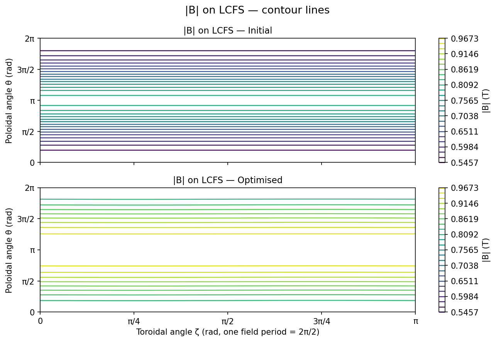

Optimisation with vmec_jax
===========================

``vmec_jax`` supports end-to-end differentiable optimisation of MHD equilibria
through a discrete-adjoint Jacobian that is **exact** (no finite differences)
and runs entirely inside a single Python process.

This page covers:

- the mathematical approach and how it differs from SIMSOPT + VMEC2000,
- the key source files and public API,
- the algorithms (Gauss-Newton, line search, adjoint replay),
- how to reproduce the quasi-helical symmetry (QH) and quasi-axisymmetric (QA) examples,
- figures comparing ``max_mode=1, 2, 3`` optimisation results.

.. contents:: Table of contents
   :local:
   :depth: 2

Motivation: differentiability without finite differences
---------------------------------------------------------

SIMSOPT's canonical fixed-boundary QH workflow calls VMEC2000 as a black-box
subprocess and builds the Jacobian column by column using finite differences::

  # SIMSOPT / VMEC2000 approach
  for i in range(n_params):
      perturb boundary DOF i by ε
      run VMEC2000 subprocess            # one full solve per column
      J[:, i] = (f(x+ε·eᵢ) - f(x)) / ε

For ``n_params = 24`` boundary DOFs this is 24 extra forward solves per
Jacobian evaluation — expensive, and the result is only accurate to
``O(√ε_machine)`` due to finite-difference cancellation.

``vmec_jax`` uses a **discrete-adjoint replay** instead:

1. Run one "exact" forward solve with the adjoint flag, storing a
   compressed checkpoint tape of the iteration trajectory.
2. Propagate tangent vectors through the tape via batched JVP
   (``jax.vmap(jax.jvp(...))``, visiting each recorded iteration step
   in forward order exactly once per tangent batch.

The Jacobian is thereby computed to **machine precision** in a time roughly
equal to ``1 + fraction-of-solve × n_params`` forward-solve equivalents,
rather than ``n_params`` full forward solves.

In practice, for ``n_params ≤ 24`` the Jacobian build takes roughly 0.5–1.5×
the cost of a single tight solve — comparable to SIMSOPT + finite differences
with ``n_params = 1`` but covering the full parameter space at once.

→ See :doc:`discrete_adjoint` for a full mathematical description.

Comparison with SIMSOPT
------------------------

.. list-table::
   :header-rows: 1
   :widths: 35 32 33

   * - Feature
     - vmec_jax
     - SIMSOPT + VMEC2000
   * - Jacobian method
     - Exact discrete-adjoint replay
     - Finite differences (columnar)
   * - Jacobian cost
     - ≈ 1.5 × forward solve
     - n_params × forward solve
   * - Subprocess required
     - No — pure Python/JAX
     - Yes — VMEC2000 Fortran binary
   * - Accuracy
     - Machine-precision (exact)
     - O(√ε\_machine) FD error
   * - GPU support
     - Yes (JAX device)
     - No
   * - Differentiable through optimizer
     - Yes (JAX autodiff)
     - No
   * - Wall time (QH, max\_mode=1, 15 evals)
     - ≈ 118 s (CPU, Apple M-series)
     - ≈ 28 s (SIMSOPT + xvmec2000)
   * - QS objective (QH max\_mode=1, 15 evals)
     - **57.47 → 0.028** (99.9% reduction)
     - 57.47 → 4.04 (93% reduction)

``vmec_jax`` achieves dramatically lower final QS because exact Jacobians
extract far more gradient information per step.  Individual VMEC2000 solves
are faster on CPU, but the exact Jacobian more than compensates.

→ See :doc:`simsopt_comparison` for a detailed runtime, memory, and
algorithm comparison.

Quasi-helical symmetry example
--------------------------------

The ``examples/optimization/qh_fixed_resolution_jax.py`` script replicates the
SIMSOPT QH fixed-resolution benchmark entirely within ``vmec_jax``.  It has no
argparse — all parameters are top-level variables:

.. code-block:: python

   # ── User parameters ────────────────────────────────────────────────────────
   INPUT_FILE    = Path(".../input.nfp4_QH_warm_start")
   MAX_MODE      = 2         # boundary DOF mode number cutoff
   MAX_NFEV      = 15        # maximum residual+Jacobian evaluations
   HELICITY_M    = 1         # QH helicity
   HELICITY_N    = 4         # nfp=4 quasi-helical symmetry
   TARGET_ASPECT = 7.0       # target aspect ratio
   SURFACES      = np.arange(0, 1.01, 0.1)

   # ── Load ──────────────────────────────────────────────────────────────────
   cfg, indata  = vj.load_config(str(INPUT_FILE))
   static       = vj.build_static(cfg)
   boundary     = vj.boundary_from_indata(indata, static.modes)
   indata, static, boundary = vj.extend_boundary_for_max_mode(indata, static, boundary, MAX_MODE)

   # ── DOFs ──────────────────────────────────────────────────────────────────
   specs        = vj.boundary_param_specs(boundary, static.modes, max_mode=MAX_MODE,
                                          include=("rc","zs"), fix=("rc00",))
   params0      = np.zeros(len(specs))

   # ── Objective ─────────────────────────────────────────────────────────────
   residuals_fn = vj.make_qh_residuals_fn(
       static, indata, helicity_m=HELICITY_M, helicity_n=HELICITY_N,
       target_aspect=TARGET_ASPECT, surfaces=SURFACES,
   )

   # ── Optimiser ─────────────────────────────────────────────────────────────
   opt    = vj.FixedBoundaryExactOptimizer(static, indata, boundary, specs, residuals_fn)
   result = opt.run(params0, max_nfev=MAX_NFEV)

   # ── Save + plot ────────────────────────────────────────────────────────────
   opt.save_wout(OUTPUT_DIR / "wout_final.nc", result["x"])
   opt.save_history(OUTPUT_DIR / "history.json", result)
   vj.plot_qh_optimization(...)

Run it with:

.. code-block:: bash

   python examples/optimization/qh_fixed_resolution_jax.py

Results by mode number
-----------------------

The table below summarises the QH optimisation results for three mode-number
cutoffs, all starting from the same boundary (``input.nfp4_QH_warm_start``,
nfp=4) and using 15 function evaluations.

.. note::
   The QS metric value depends on the Fourier mode table size (mpol/ntor).
   ``max_mode=1`` uses the original mpol=2 mode table (QS initial ≈ 57.47);
   ``max_mode=2, 3`` extend the mode table to mpol=4 which rescales the QS
   metric (QS initial ≈ 0.311).  Within each row the reduction is self-consistent.

.. list-table::
   :header-rows: 1
   :widths: 12 10 14 14 14 18 18

   * - max\_mode
     - DOFs
     - QS initial
     - QS final
     - Reduction
     - vmec\_jax time
     - SIMSOPT time ¹
   * - 1
     - 8
     - 57.47
     - **0.028**
     - **99.9 %**
     - ≈ 118 s
     - ≈ 28 s (93 % red.)
   * - 2
     - 24
     - 0.311
     - **0.055**
     - **82 %**
     - ≈ 63 s
     - ≈ 73 s (92 % red.)
   * - 3
     - 48
     - 0.311
     - **0.055** ²
     - **82 %**
     - ≈ 68 s
     - —

¹ SIMSOPT + VMEC2000, serial (no MPI), ``method='lm'``, same ``max_nfev=15`` budget,
Apple M-series CPU.  Note SIMSOPT's QS final is 4.04 (max_mode=1) — much higher than
vmec_jax's 0.028 — because finite-difference Jacobians are less informative.

² With 15 function evaluations the optimizer has not yet exploited the extra 24
high-mode DOFs; increase ``MAX_NFEV`` for further improvement.

3-D LCFS and |B| contour plots
~~~~~~~~~~~~~~~~~~~~~~~~~~~~~~~

**max_mode = 1** (8 DOFs, 99.9% QS reduction, 118 s)

.. list-table::
   :widths: 60 40

   * - .. image:: _static/figures/qh_opt/boundary_comparison.png
          :width: 100%
          :alt: 3D LCFS max_mode=1
     - .. image:: _static/figures/qh_opt/objective_history.png
          :width: 100%
          :alt: Objective history max_mode=1

.. image:: _static/figures/qh_opt/bmag_surface.png
   :width: 80%
   :align: center
   :alt: |B| contour lines on LCFS, max_mode=1

**max_mode = 2** (24 DOFs, 82% QS reduction, 63 s)

.. list-table::
   :widths: 60 40

   * - .. image:: _static/figures/qh_opt/mode2/boundary_comparison.png
          :width: 100%
          :alt: 3D LCFS max_mode=2
     - .. image:: _static/figures/qh_opt/mode2/objective_history.png
          :width: 100%
          :alt: Objective history max_mode=2

.. image:: _static/figures/qh_opt/mode2/bmag_surface.png
   :width: 80%
   :align: center
   :alt: |B| contour lines on LCFS, max_mode=2

**max_mode = 3** (48 DOFs, 82% QS reduction, 68 s)

.. list-table::
   :widths: 60 40

   * - .. image:: _static/figures/qh_opt/mode3/boundary_comparison.png
          :width: 100%
          :alt: 3D LCFS max_mode=3
     - .. image:: _static/figures/qh_opt/mode3/objective_history.png
          :width: 100%
          :alt: Objective history max_mode=3

.. image:: _static/figures/qh_opt/mode3/bmag_surface.png
   :width: 80%
   :align: center
   :alt: |B| contour lines on LCFS, max_mode=3

The contour lines on the |B| surface plots show the magnetic field strength as
isocurves in (θ, φ) space.  Quasi-helical symmetry means |B| depends mainly on
``m·θ − n·φ``; the optimised contours are clearly more helically aligned than
the initial configuration.

QA optimisation with exponential spectral scaling (ESS)
--------------------------------------------------------

``examples/optimization/qa_fixed_resolution_jax_ess.py`` demonstrates
quasi-axisymmetric optimisation of an nfp=2 configuration with three objectives:

* **Aspect ratio** target = 6.0
* **Mean rotational transform** (iota) target = 0.41
* **QA quasisymmetry** residuals (``helicity_m=1, helicity_n=0``)

A top-level toggle ``USE_ESS = True/False`` enables exponential spectral scaling
via :func:`create_x_scale`.  With ESS, boundary DOFs at mode number
``max(|m|, |n|) = k`` are pre-scaled by ``exp(-α·k) / exp(-α)`` (``α=1``
default), so the Gauss-Newton step naturally prefers coarse-scale shape changes
over fine-scale ones.  This often improves convergence on inputs with many
high-mode DOFs.

.. code-block:: bash

   # Run with ESS (results saved to results/qa_opt/ess/)
   python examples/optimization/qa_fixed_resolution_jax_ess.py

   # Edit USE_ESS = False at the top to compare without scaling
   # (results saved to results/qa_opt/no_ess/)

The script starts from ``examples/data/input.nfp2_QA`` (nfp=2, ``NS=31``,
``FTOL=1e-12``) and uses ``max_mode=2`` (24 DOFs).

**ESS off** (max_mode=2, 24 DOFs)

.. list-table::
   :widths: 60 40

   * - .. image:: _static/figures/qa_opt/no_ess/boundary_comparison.png
          :width: 100%
          :alt: 3D LCFS QA ESS off
     - .. image:: _static/figures/qa_opt/no_ess/objective_history.png
          :width: 100%
          :alt: Objective history QA ESS off

.. image:: _static/figures/qa_opt/no_ess/bmag_surface.png
   :width: 80%
   :align: center
   :alt: |B| contour lines on LCFS, QA ESS off

**ESS on** (max_mode=2, 24 DOFs, α=1)

.. list-table::
   :widths: 60 40

   * - .. image:: _static/figures/qa_opt/ess/boundary_comparison.png
          :width: 100%
          :alt: 3D LCFS QA ESS on
     - .. image:: _static/figures/qa_opt/ess/objective_history.png
          :width: 100%
          :alt: Objective history QA ESS on

Algorithms in detail
---------------------

Gauss-Newton least squares
~~~~~~~~~~~~~~~~~~~~~~~~~~~

``vmec_jax`` uses a custom :func:`~vmec_jax.gauss_newton_least_squares` solver
(``vmec_jax/optimization.py``) rather than SciPy's ``least_squares``.  This is
necessary because:

- The Jacobian is expensive and must not be recomputed inside the line search.
- Line-search trial residuals use a *relaxed* forward solve (fewer iterations,
  looser ftol) to reduce overhead.
- The "exact residual after Jacobian" hook allows the Gauss-Newton step to use
  the precise converged residual from the tape-build call, avoiding a redundant
  extra tight solve.

The algorithm per iteration:

1. **Jacobian**: build checkpoint tape at current ``x``, propagate ``n_params``
   tangents via batched JVP → dense ``(n_residuals × n_params)`` matrix.
2. **Newton step**: solve the normal equations ``J^T J Δx = -J^T r`` via
   NumPy's ``lstsq`` (LAPACK DGELSD on CPU).
3. **Line search**: Armijo backtracking — evaluate trial residual using the
   *relaxed* forward solve; accept the first ``α`` that reduces cost.
4. **Accept**: store the accepted residual in the cache; do not rebuild the
   tape again at the new ``x`` until the next iteration's Jacobian call.

Discrete-adjoint Jacobian
~~~~~~~~~~~~~~~~~~~~~~~~~~

The Jacobian column ``∂r/∂pᵢ`` is computed by propagating the initial-state
tangent ``∂state₀/∂pᵢ`` through all recorded iteration steps:

.. code-block:: text

   params → boundary → state₀   (linearize via jax.linearize)
   state₀ → state₁ → ... → stateₙ  (forward scan, checkpointed)
   stateₙ → residuals            (linearize via jax.linearize)

The tangent propagation through the iterates is done by
:func:`~vmec_jax.checkpoint_tape_state_jvp_columns`, which:

1. Loads the checkpoint tape (packed state at each step, preconditioner, etc.).
2. Calls ``jax.vmap(jax.jvp(step_fn, ...))`` over all parameter tangents at
   once, reusing the same compiled scan kernel.

Key implementation choices:

- **``backtracking=False, strict_update=True``**: matches the VMEC2000 iteration
  path.  Using ``backtracking=True`` collapses the step size to machine epsilon
  on QH geometry and kills convergence.
- **``VMEC_JAX_DYNAMIC_REPLAY_BUCKET=1024``**: pads nearby solve trajectories so
  the same XLA scan executable is reused across Jacobian evaluations with
  slightly different tape lengths.
- **Single-entry cache** (``_exact_cache``): stores the last tape by parameter
  hash.  Avoids rebuilding the tape when ``residual_fun`` then ``jacobian_fun``
  are called at the same ``x`` (which Gauss-Newton always does).

Residuals function
~~~~~~~~~~~~~~~~~~

:func:`~vmec_jax.make_qh_residuals_fn` builds the combined QH + aspect-ratio
residual vector:

.. code-block:: python

   r[0]    = aspect_weight * (aspect - target_aspect)
   r[1:]   = qs_weight * quasisymmetry_ratio_residuals(state, surfaces, m=1, n=4)

The quasisymmetry ratio residual is computed by
:func:`~vmec_jax.quasisymmetry_ratio_residual_from_state`, which evaluates
``|B|`` on the specified surfaces, decomposes it into helical modes, and
returns the residuals of the off-helicity modes.

Public API
----------

.. currentmodule:: vmec_jax

:class:`FixedBoundaryExactOptimizer`
~~~~~~~~~~~~~~~~~~~~~~~~~~~~~~~~~~~~~

The main entry point for differentiable fixed-boundary optimisation.

.. list-table::
   :header-rows: 1
   :widths: 40 60

   * - Method
     - Description
   * - ``__init__(static, indata, boundary, specs, residuals_fn)``
     - Construct optimizer; derive solver settings from indata.
   * - ``run(params0, *, max_nfev, ftol, gtol, xtol, x_scale)``
     - Run Gauss-Newton loop; returns SciPy-like result dict.
   * - ``save_wout(path, params)``
     - Write a ``wout_*.nc`` for the equilibrium at ``params``.
   * - ``save_history(path, result)``
     - Write per-iteration history to JSON.
   * - ``aspect_ratio(params)``
     - Query aspect ratio (uses exact-solve cache).
   * - ``quasisymmetry_objective(params)``
     - Query total QS objective (uses exact-solve cache).
   * - ``clear_caches()``
     - Release JIT and tape caches.

:func:`make_qh_residuals_fn`
~~~~~~~~~~~~~~~~~~~~~~~~~~~~~

Factory returning a ``residuals_from_state(VMECState) → jnp.ndarray`` callable
configured for quasi-helical symmetry.  Combines one aspect-ratio residual with
per-surface QS residuals.

Parameters: ``static``, ``indata``, ``helicity_m``, ``helicity_n``,
``target_aspect``, ``surfaces``, ``aspect_weight``, ``qs_weight``.

:func:`make_qs_residuals_fn`
~~~~~~~~~~~~~~~~~~~~~~~~~~~~~

General quasisymmetry residuals factory supporting QA (``helicity_n=0``),
QH, and optional mean-iota targets.  Preferred for new workflows.

Parameters: ``static``, ``indata``, ``helicity_m``, ``helicity_n``,
``target_aspect``, ``target_iota``, ``surfaces``,
``aspect_weight``, ``iota_weight``, ``qs_weight``.

:func:`create_x_scale`
~~~~~~~~~~~~~~~~~~~~~~~

Build per-DOF exponential spectral scaling weights for use with
:meth:`FixedBoundaryExactOptimizer.run`.

.. math::

   w_i = \exp(-\alpha \cdot \max(|m_i|, |n_i|)) \;/\; \exp(-\alpha)

The lowest non-trivial mode level (``max(|m|,|n|)=1``) has weight 1; higher
modes are progressively down-weighted.  Use ``alpha=0`` for uniform weights.

Parameters: ``specs``, ``alpha`` (default 1.0).

:func:`gauss_newton_least_squares`
~~~~~~~~~~~~~~~~~~~~~~~~~~~~~~~~~~~

Bare Gauss-Newton solver with exact Jacobian, Armijo line search, and hooks for
expensive outer loops.  See ``vmec_jax/optimization.py`` for full signature.

:func:`plot_qh_optimization`
~~~~~~~~~~~~~~~~~~~~~~~~~~~~~

Generate all three standard QH optimisation figures:

- ``boundary_comparison.png`` — 3-D LCFS coloured by |B|.
- ``bmag_surface.png`` — |B| contour lines on LCFS (θ, φ/nfp).
- ``objective_history.png`` — Objective and aspect ratio vs Jacobian index.

:func:`checkpoint_tape_state_jvp_columns`
~~~~~~~~~~~~~~~~~~~~~~~~~~~~~~~~~~~~~~~~~~

Low-level function for propagating a batch of tangents through the adjoint
tape.  Returns final-state tangents (one per parameter).  Used internally by
:class:`FixedBoundaryExactOptimizer` but exposed publicly for custom workflows.

Source files
-------------

.. list-table::
   :header-rows: 1
   :widths: 45 55

   * - File
     - Role
   * - ``vmec_jax/optimization.py``
     - :class:`FixedBoundaryExactOptimizer`, :func:`make_qh_residuals_fn`,
       :func:`make_qs_residuals_fn`, :func:`create_x_scale`,
       :func:`gauss_newton_least_squares`, boundary DOF helpers.
   * - ``vmec_jax/discrete_adjoint.py``
     - Checkpoint tape build (``build_residual_checkpoint_tape_direct``),
       JVP propagation (``checkpoint_tape_state_jvp_columns``).
   * - ``vmec_jax/quasisymmetry.py``
     - QS residuals (``quasisymmetry_ratio_residual_from_state``).
   * - ``vmec_jax/plotting.py``
     - ``plot_qh_optimization`` and helper plotting functions.
   * - ``vmec_jax/driver.py``
     - ``write_wout_from_fixed_boundary_run``, ``wout_from_fixed_boundary_run``.
   * - ``examples/optimization/qh_fixed_resolution_jax.py``
     - QH SIMSOPT-style workflow script (no argparse, variables at top).
   * - ``examples/optimization/qa_fixed_resolution_jax_ess.py``
     - QA workflow with ESS toggle (aspect + mean iota + QA objectives).
   * - ``examples/optimization/plot_qh_optimization_results.py``
     - Standalone plotting helper (regenerates figures from saved wout+JSON).
   * - ``examples/optimization/target_iota_aspect_volume.py``
     - Simpler optimisation targeting iota, aspect, volume.

Running the QH example
-----------------------

.. code-block:: bash

   # Run optimisation (saves wout files + history.json + figures to results/qh_opt)
   python examples/optimization/qh_fixed_resolution_jax.py

   # Regenerate figures from saved outputs
   python examples/optimization/plot_qh_optimization_results.py --output-dir results/qh_opt

Increase ``MAX_MODE`` at the top of ``qh_fixed_resolution_jax.py`` for richer
boundary parameterisation; increase ``MAX_NFEV`` for more optimisation budget.

GPU acceleration
-----------------

The same workflow runs on GPU without modification.  Set ``JAX_PLATFORMS=cuda``
(or ``metal`` on Apple Silicon) before running.  The checkpoint tape is
device-resident throughout; host/device traffic is limited to the final wout
write.

For GPU runs, the dynamic replay bucketing
(``VMEC_JAX_DYNAMIC_REPLAY_BUCKET``) is especially important: it ensures that
XLA reuses a single compiled scan kernel across Jacobian calls with slightly
different tape lengths, amortising the JIT cost over the full optimisation.

Further reading
---------------

.. toctree::
   :maxdepth: 1

   discrete_adjoint
   simsopt_comparison
