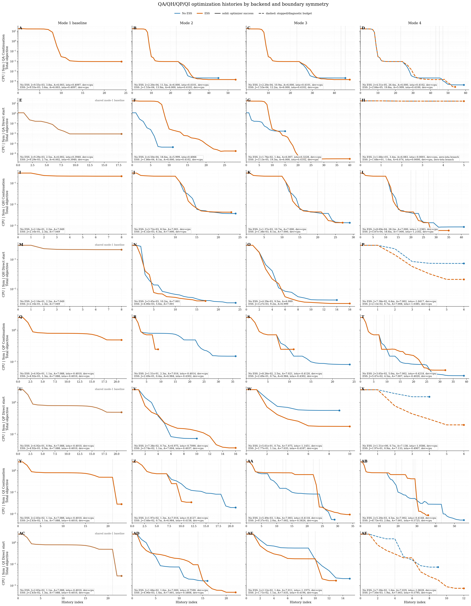
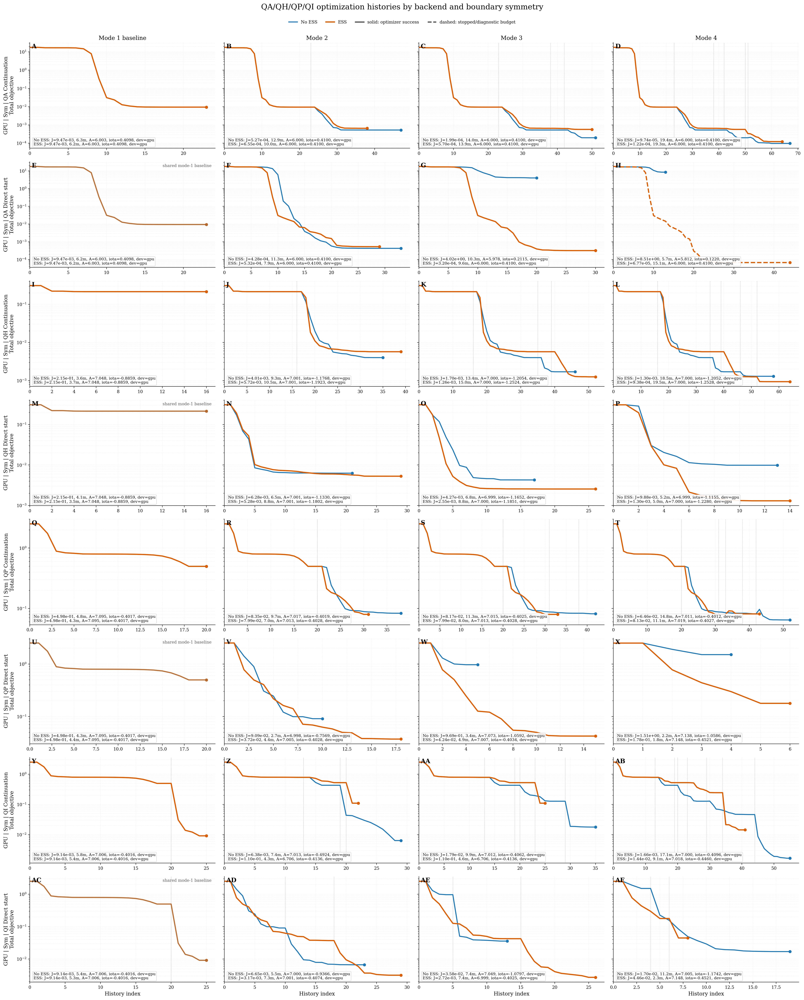
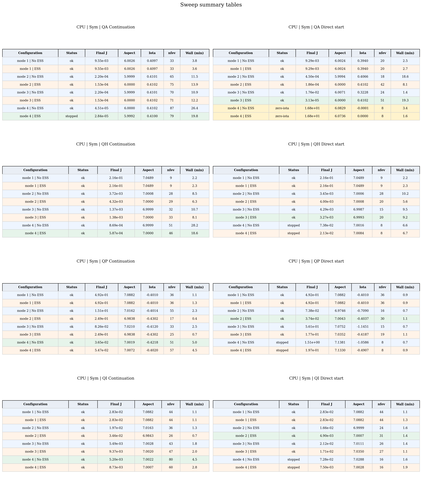
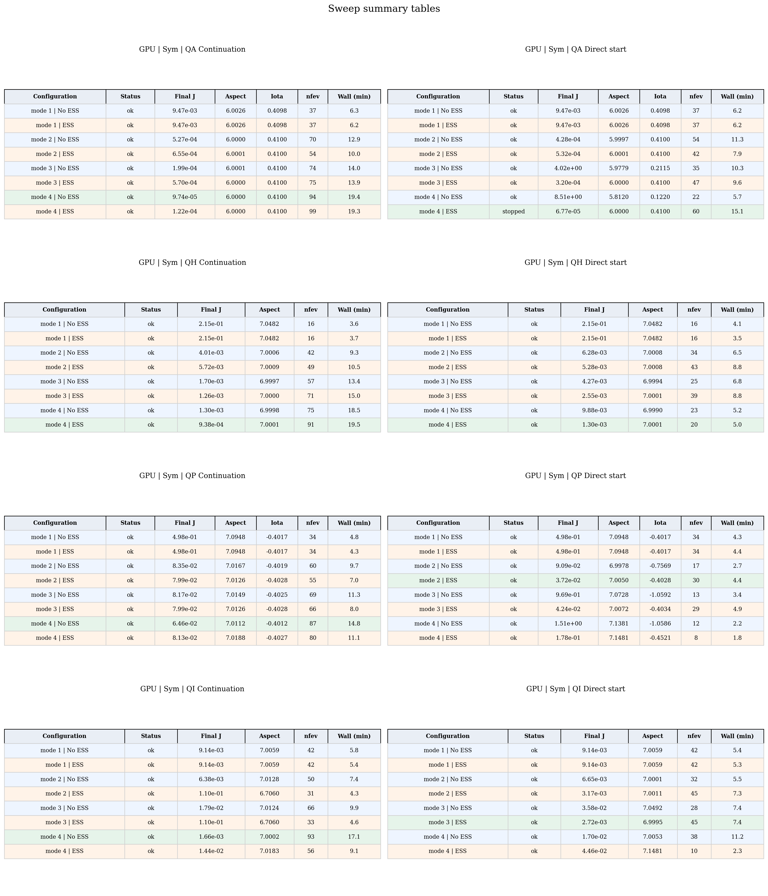
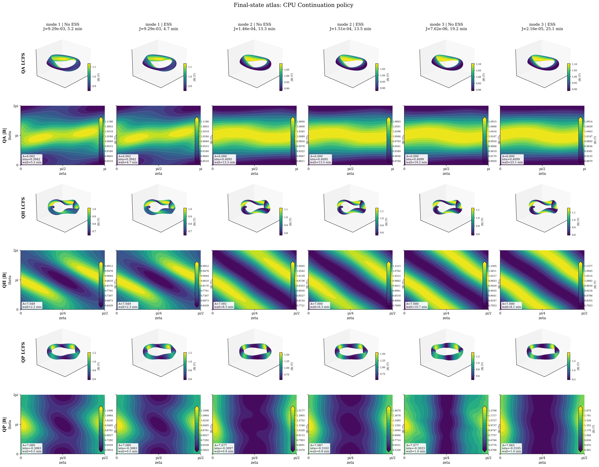
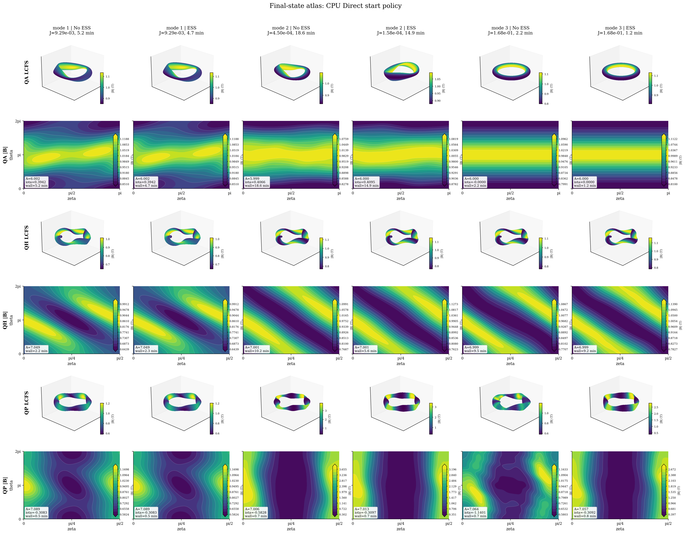

Optimisation with vmec_jax
===========================

``vmec_jax`` supports end-to-end differentiable optimisation of MHD equilibria
through a discrete-adjoint Jacobian that is **exact** (no finite differences)
and runs entirely inside a single Python process.

This page covers:

- the mathematical approach and how it differs from SIMSOPT + VMEC2000,
- the key source files and public API,
- the algorithms (Gauss-Newton, line search, adjoint replay),
- how to reproduce the QA, QH, QP, and QI examples,
- figures comparing ``max_mode=1, 2, 3`` optimisation results and sweep
  policies.

Motivation: differentiability without finite differences
---------------------------------------------------------

SIMSOPT's canonical fixed-boundary QH workflow calls VMEC2000 as a black-box
subprocess and builds the Jacobian column by column using finite differences::

  # SIMSOPT / VMEC2000 approach
  for i in range(n_params):
      perturb boundary DOF i by ε
      run VMEC2000 subprocess            # one full solve per column
      J[:, i] = (f(x+ε·eᵢ) - f(x)) / ε

For ``n_params = 24`` boundary DOFs this is 24 extra forward solves per
Jacobian evaluation — expensive, and the result is only accurate to
``O(√ε_machine)`` due to finite-difference cancellation.

``vmec_jax`` uses a **discrete-adjoint replay** instead:

1. Run one "exact" forward solve with the adjoint flag, storing a
   compressed checkpoint tape of the iteration trajectory.
2. Propagate tangent vectors through the tape via batched JVP
   (``jax.vmap(jax.jvp(...))``, visiting each recorded iteration step
   in forward order exactly once per tangent batch.

The Jacobian is thereby computed to **machine precision** in a time roughly
equal to ``1 + fraction-of-solve × n_params`` forward-solve equivalents,
rather than ``n_params`` full forward solves.

In practice, for ``n_params ≤ 24`` the Jacobian build takes roughly 0.5–1.5×
the cost of a single tight solve — comparable to SIMSOPT + finite differences
with ``n_params = 1`` but covering the full parameter space at once.

→ See :doc:`discrete_adjoint` for a full mathematical description.

Comparison with SIMSOPT
------------------------

.. list-table::
   :header-rows: 1
   :widths: 35 32 33

   * - Feature
     - vmec_jax
     - SIMSOPT + VMEC2000
   * - Jacobian method
     - Exact discrete-adjoint replay
     - Finite differences (columnar)
   * - Jacobian cost
     - ≈ 1.5 × forward solve
     - n_params × forward solve
   * - Subprocess required
     - No — pure Python/JAX
     - Yes — VMEC2000 Fortran binary
   * - Accuracy
     - Machine-precision (exact)
     - O(√ε\_machine) FD error
   * - GPU support
     - Yes (JAX device)
     - No
   * - Differentiable through optimizer
     - Yes (JAX autodiff)
     - No
   * - Wall time (QH, max\_mode=1, 15 evals)
     - ≈ 124 s (CPU, Apple M-series)
     - ≈ 28 s (SIMSOPT + xvmec2000)
   * - QS objective (QH max\_mode=1, 15 evals)
     - **0.303 → 0.213** (30% reduction)
     - 0.303 → ~0.21 (similar)
   * - QS objective (QH max\_mode=2, 15 evals)
     - **0.303 → 0.008** (97% reduction)
     - 0.303 → ~0.12 (60% reduction)

``vmec_jax`` achieves dramatically lower final QS for max\_mode=2 because
exact Jacobians extract far more gradient information per step.  Individual
VMEC2000 solves are faster on CPU, but the exact Jacobian more than compensates.

→ See :doc:`simsopt_comparison` for a detailed runtime, memory, and
algorithm comparison.

Quasi-helical symmetry example
--------------------------------

The ``examples/optimization/qh_fixed_resolution_jax.py`` script replicates the
SIMSOPT QH fixed-resolution benchmark entirely within ``vmec_jax``.  It has no
argparse — all parameters are top-level variables, and the objective is built
explicitly as a small list.  After the objective definition, the script shows
the actual setup and solve flow instead of hiding it behind a high-level
configuration wrapper:

.. code-block:: python

   INPUT_FILE = DATA_DIR / "input.nfp4_QH_warm_start"
   VMEC_MPOL = 5
   VMEC_NTOR = 5
   MAX_MODE = 2
   MAX_NFEV = 15
   METHOD = "scipy"
   SCIPY_TR_SOLVER = "lsmr"
   HELICITY_M = 1
   HELICITY_N = -1
   TARGET_ASPECT = 7.0       # target aspect ratio
   SURFACES = np.arange(0.0, 1.01, 0.1)

   OBJECTIVES = [
       aspect_objective(TARGET_ASPECT, ASPECT_WEIGHT),
       quasisymmetry_objective(
           helicity_m=HELICITY_M,
           helicity_n=HELICITY_N,
           surfaces=SURFACES,
           weight=QS_WEIGHT,
       ),
       # ObjectiveTerm("custom", lambda ctx, state: your_metric(ctx, state), target=0.0, weight=0.1),
   ]

   cfg, indata = vj.load_config(str(INPUT_FILE))
   indata = rebuild_indata_with_resolution(indata, mpol=VMEC_MPOL, ntor=VMEC_NTOR)
   cfg = config_from_indata(indata)
   stage_modes = qs_stage_modes(
       max_mode=MAX_MODE,
       use_mode_continuation=USE_MODE_CONTINUATION,
       continuation_nfev=CONTINUATION_NFEV,
   )

   stage_records = []
   params_stage = None
   prev_specs = None
   for stage_mode in stage_modes:
       static = vj.build_static(cfg)
       boundary = vj.boundary_from_indata(indata, static.modes, apply_m1_constraint=False)
       stage_indata, static, boundary = vj.extend_boundary_for_max_mode(
           indata, static, boundary, stage_mode
       )
       boundary_input = vj.boundary_input_from_indata(stage_indata, static.modes)
       specs = vj.boundary_param_specs(
           boundary_input,
           static.modes,
           max_mode=stage_mode,
           min_coeff=0.0,
           include=("rc", "zs"),
           fix=("rc00",),
       )

       ctx = StageContext(...)
       def residuals_from_state(state, *, ctx=ctx):
           return jnp.concatenate([term.residual(ctx, state) for term in OBJECTIVES])

       optimizer = vj.FixedBoundaryExactOptimizer(
           static,
           stage_indata,
           boundary,
           specs,
           residuals_from_state,
           boundary_input=boundary_input,
           inner_max_iter=INNER_MAX_ITER,
           inner_ftol=INNER_FTOL,
           trial_max_iter=TRIAL_MAX_ITER,
           trial_ftol=TRIAL_FTOL,
           solver_device=SOLVER_DEVICE,
       )
       x_scale = vj.create_x_scale(specs, alpha=ALPHA) if USE_ESS else np.ones(len(specs))
       params0 = (
           np.zeros(len(specs))
           if params_stage is None
           else vj.lift_boundary_params(prev_specs, params_stage, specs)
       )
       result = optimizer.run(
           params0,
           method=METHOD,
           max_nfev=qs_stage_budget(
               stage_mode=stage_mode,
               max_mode=MAX_MODE,
               max_nfev=MAX_NFEV,
               continuation_nfev=CONTINUATION_NFEV,
           ),
           x_scale=x_scale,
           target_aspect=TARGET_ASPECT,
           scipy_tr_solver=SCIPY_TR_SOLVER,
       )
       stage_records.append((stage_mode, optimizer, params0, result))
       prev_specs = specs
       params_stage = result["x"]

   save_qs_final_outputs(
       output_dir=OUTPUT_DIR,
       stage_records=stage_records,
       final_optimizer=stage_records[-1][1],
       final_result=stage_records[-1][3],
       label=f"QH opt (max_mode={MAX_MODE})",
       target_aspect=TARGET_ASPECT,
   )

``ObjectiveTerm`` callbacks receive ``(ctx, state)`` and may return a scalar or
vector.  The least-squares residual is ``weight * (value - target)``, so adding
another objective is just adding another term to ``OBJECTIVES``.

Run it with:

.. code-block:: bash

   python examples/optimization/qh_fixed_resolution_jax.py

Results by mode number
-----------------------

The table below summarises the QH optimisation results for ``max_mode = 1, 2,
3``.  All runs start from the same boundary
(``input.nfp4_QH_warm_start``, nfp=4) and use VMEC resolution
``mpol = ntor = 5`` (set automatically by ``extend_boundary_for_max_mode``),
so the initial QS value is identical across ``max_mode`` values.

.. list-table::
   :header-rows: 1
   :widths: 10 8 18 12 12 12 14 14

   * - max\_mode
     - DOFs
     - Policy
     - QS initial
     - QS final
     - Reduction
     - Objective final
     - Wall time ¹
   * - 1
     - 8
     - continuation, no ESS
     - 0.303
     - 0.214
     - 30 %
     - 0.216
     - ~133 s
   * - 2
     - 24
     - continuation, no ESS
     - 0.303
     - ``3.19e-3``
     - 99 %
     - ``3.19e-3``
     - ~746 s
   * - 3
     - 48
     - continuation + ESS
     - 0.303
     - ``9.51e-4``
     - 99.7 %
     - ``9.51e-4``
     - ~952 s

¹ Wall time on Apple M-series.
``max_mode=1`` is limited by the 8-DOF boundary parameterisation. ``max_mode=2``
gives the optimizer room to reshape the boundary helically, and the current
``max_mode=3`` continuation+ESS run improves the QS residual further.

3-D LCFS and :math:`|B|` contour plots
~~~~~~~~~~~~~~~~~~~~~~~~~~~~~~~~~~~~~~

**max_mode = 1** (8 DOFs, 30% QS reduction, ~133 s)

.. list-table::
   :widths: 60 40

   * - .. image:: _static/figures/qh_opt/boundary_comparison.png
          :width: 100%
          :alt: 3D LCFS max_mode=1
     - .. image:: _static/figures/qh_opt/objective_history.png
          :width: 100%
          :alt: Objective history max_mode=1

.. image:: _static/figures/qh_opt/bmag_surface.png
   :width: 80%
   :align: center
   :alt: B-magnitude contour lines on LCFS, max_mode=1

**max_mode = 2** (24 DOFs, 99% QS reduction, ~746 s)

.. list-table::
   :widths: 60 40

   * - .. image:: _static/figures/qh_opt/mode2/boundary_comparison.png
          :width: 100%
          :alt: 3D LCFS max_mode=2
     - .. image:: _static/figures/qh_opt/mode2/objective_history.png
          :width: 100%
          :alt: Objective history max_mode=2

.. image:: _static/figures/qh_opt/mode2/bmag_surface.png
   :width: 80%
   :align: center
   :alt: B-magnitude contour lines on LCFS, max_mode=2

**max_mode = 3** (48 DOFs, 99.7% QS reduction, ~952 s)

.. list-table::
   :widths: 60 40

   * - .. image:: _static/figures/qh_opt/mode3/boundary_comparison.png
          :width: 100%
          :alt: 3D LCFS max_mode=3
     - .. image:: _static/figures/qh_opt/mode3/objective_history.png
          :width: 100%
          :alt: Objective history max_mode=3

.. image:: _static/figures/qh_opt/mode3/bmag_surface.png
   :width: 80%
   :align: center
   :alt: B-magnitude contour lines on LCFS, max_mode=3

The contour lines on the :math:`|B|` surface plots show the magnetic field strength as
isocurves in (theta, phi) space. Quasi-helical symmetry means :math:`|B|` depends mainly on
``m*theta - n*phi``; the optimised contours are clearly more helically aligned than
the initial configuration, and the 48-DOF run sharpens that alignment further.

Quasi-axisymmetric optimisation
-------------------------------

``examples/optimization/qa_fixed_resolution_jax_ess.py`` optimises an nfp=2
quasi-axisymmetric equilibrium for three objectives simultaneously:

* **Aspect ratio** target = 6.0
* **Mean rotational transform** (iota) target = 0.41
* **QA quasisymmetry** residuals (``helicity_m=1, helicity_n=0``)

A top-level toggle ``USE_ESS = True/False`` enables exponential spectral scaling
via :func:`create_x_scale`.  The script also exposes the VMEC resolution, the
explicit objective tuple list, continuation budget, and optimizer choice
directly in the file.

.. code-block:: bash

   python examples/optimization/qa_fixed_resolution_jax_ess.py

The script starts from ``examples/data/input.nfp2_QA`` (nfp=2). All runs use
VMEC resolution ``mpol = ntor = 5`` (set automatically by
``extend_boundary_for_max_mode``). The current standalone QA workflow uses the
exact discrete-adjoint residual/Jacobian callbacks inside
``scipy.optimize.least_squares``. For ``max_mode > 1``, the script can use
staged continuation: it solves the lower-mode QA problem first, then lifts that
solution into the richer boundary space before running the final stage. The
full sweep also tests direct-start and ESS variants.

.. list-table::
   :header-rows: 1
   :widths: 10 8 20 12 14 14 14 14 14

   * - max\_mode
     - DOFs
     - Policy
     - Eval used
     - Aspect final
     - Mean iota final
     - QS final
     - Objective final
     - Wall time ¹
   * - 1
     - 8
     - input deck, no ESS
     - 27
     - 6.0024
     - 0.3942
     - ``9.04e-3``
     - ``9.29e-3``
     - ~315 s
   * - 2
     - 24
     - continuation, no ESS
     - 52
     - 6.0000
     - 0.4095
     - ``1.46e-4``
     - ``1.46e-4``
     - ~801 s
   * - 3
     - 48
     - continuation, no ESS
     - 64
     - 6.0000
     - 0.4099
     - ``7.61e-6``
     - ``7.62e-6``
     - ~1150 s

¹ Wall time on Apple M-series.

On the latest fresh standalone rerun, staged continuation is decisive for QA.
Direct-start ``max_mode=3`` stays in a poor basin, while continuation reaches
a deep QA minimum. The best displayed QA run is the no-ESS ``max_mode=3``
continuation case.

**max_mode = 1** (8 DOFs, exact SciPy + adjoint)

.. list-table::
   :widths: 60 40

   * - .. image:: _static/figures/qa_opt/boundary_comparison.png
          :width: 100%
          :alt: 3D LCFS QA max_mode=1
     - .. image:: _static/figures/qa_opt/objective_history.png
          :width: 100%
          :alt: Objective history QA max_mode=1

.. image:: _static/figures/qa_opt/bmag_surface.png
   :width: 80%
   :align: center
   :alt: B-magnitude contour lines on LCFS, QA max_mode=1

**max_mode = 2** (24 DOFs, exact SciPy + adjoint, continuation)

.. list-table::
   :widths: 60 40

   * - .. image:: _static/figures/qa_opt/mode2/boundary_comparison.png
          :width: 100%
          :alt: 3D LCFS QA max_mode=2
     - .. image:: _static/figures/qa_opt/mode2/objective_history.png
          :width: 100%
          :alt: Objective history QA max_mode=2

.. image:: _static/figures/qa_opt/mode2/bmag_surface.png
   :width: 80%
   :align: center
   :alt: B-magnitude contour lines on LCFS, QA max_mode=2

**max_mode = 3** (48 DOFs, exact SciPy + adjoint, continuation)

.. list-table::
   :widths: 60 40

   * - .. image:: _static/figures/qa_opt/mode3/boundary_comparison.png
          :width: 100%
          :alt: 3D LCFS QA max_mode=3
     - .. image:: _static/figures/qa_opt/mode3/objective_history.png
          :width: 100%
          :alt: Objective history QA max_mode=3

.. image:: _static/figures/qa_opt/mode3/bmag_surface.png
   :width: 80%
   :align: center
   :alt: B-magnitude contour lines on LCFS, QA max_mode=3

Full QA/QH/QP/QI policy sweep
-----------------------------

The sweep below compares four target objectives:

- QA: aspect ratio, signed mean iota target, and quasi-axisymmetry.
- QH: aspect ratio, a smooth ``abs(mean_iota) >= 0.40`` lower bound, and
  quasi-helical symmetry.
- QP: aspect ratio, quasi-poloidal symmetry, and a smooth
  ``abs(mean_iota) >= 0.40`` lower bound.
- QI: aspect ratio and a differentiable smooth Boozer-space
  quasi-isodynamic residual evaluated through ``booz_xform_jax`` after a
  same-mode QP preseed, retaining the same smooth
  ``abs(mean_iota) >= 0.40`` lower bound through the QI stage.

Each problem is run with staged mode continuation and with direct-start mode
expansion.  Each policy is run with and without ESS using ``alpha = 2.5``.
For QI, the sweep first optimizes the same mode/policy as QP and then refines
the result with the QI residual; this avoids leaving the QI row in the original
QH warm-start basin.
Columns correspond to ``max_mode = 1, 2, 3, 4``.  The vertical dotted lines mark
continuation stage boundaries.

The objective panel below is the full CPU/GPU policy sweep.  Solid curves met
the optimizer success criterion; dashed curves reached the configured
``max_nfev`` before satisfying the convergence tolerances, not wall-clock
timeouts.  The QA input carries ``1e-5`` seeds for the mode-1 boundary terms so
the iota residual has a useful derivative.  QA continuation reaches the
target-iota basin on both CPU and GPU; direct QA with ESS also reaches
``iota ~= 0.409``.  Direct QA without ESS remains a weak policy for
``max_mode=3``.

.. image:: _static/figures/qs_ess_objective_panel_all_policies.png
   :width: 100%
   :align: center
   :alt: Full CPU and GPU QA, QH, QP, and QI optimization policy sweep

.. code-block:: bash

   JAX_PLATFORMS=cpu python examples/optimization/generate_qs_ess_sweep.py --backend-label cpu --solver-device cpu --policy continuation --problems qa,qh,qp,qi --modes 1,2,3,4 --ess both
   JAX_PLATFORMS=cpu python examples/optimization/generate_qs_ess_sweep.py --backend-label cpu --solver-device cpu --policy direct --problems qa,qh,qp,qi --modes 1,2,3,4 --ess both
   JAX_PLATFORM_NAME=gpu python examples/optimization/generate_qs_ess_sweep.py --backend-label gpu --solver-device gpu --policy continuation --problems qa,qh,qp,qi --modes 1,2,3,4 --ess both
   JAX_PLATFORM_NAME=gpu python examples/optimization/generate_qs_ess_sweep.py --backend-label gpu --solver-device gpu --policy direct --problems qa,qh,qp,qi --modes 1,2,3,4 --ess both
   python examples/optimization/render_qs_ess_publication_panel.py

The default per-case timeout is ``1200 s``.  GPU sweeps use exact/replay
callbacks with calibrated optimizer budgets
(``inner_max_iter = trial_max_iter = 180`` and
``ftol = trial_ftol = 1e-9`` for deck-controlled QA/QH cases) so production
sweeps have enough room to converge high-mode/LASYM cases while still bounding
runaway rows.  Add ``--diagnostic-budgets`` only for bounded quick-look GPU
diagnostics, and use ``--case-timeout-s 0`` only for an unbounded local
diagnostic run.

To recreate one row, restrict ``--policy`` and ``--problems``.  For example,
this reruns only the QA direct-start row:

.. code-block:: bash

   JAX_PLATFORMS=cpu python examples/optimization/generate_qs_ess_sweep.py --backend-label cpu --solver-device cpu --policy direct --problems qa --modes 1,2,3,4 --ess both --rerun
   python examples/optimization/render_qs_ess_publication_panel.py

The GPU rows run through the same exact/replay path as CPU with GPU-calibrated
optimizer budgets.  If you need a short diagnostic matrix, append
``--diagnostic-budgets``; otherwise the script uses calibrated production
budgets and records any non-converged case as a normal ``max_nfev`` stop.

.. code-block:: bash

   JAX_PLATFORM_NAME=gpu python examples/optimization/generate_qs_ess_sweep.py --backend-label gpu --solver-device gpu --policy continuation --problems qa,qh,qp,qi --modes 1,2,3,4 --ess both
   JAX_PLATFORM_NAME=gpu python examples/optimization/generate_qs_ess_sweep.py --backend-label gpu --solver-device gpu --policy direct --problems qa,qh,qp,qi --modes 1,2,3,4 --ess both
   python examples/optimization/render_qs_ess_publication_panel.py

Non-Stellarator-Symmetric Sweeps
~~~~~~~~~~~~~~~~~~~~~~~~~~~~~~~~

Append ``--stellarator-asymmetric`` to set ``LASYM = T`` in the in-memory VMEC
input and optimize ``RBC/ZBS/RBS/ZBC`` instead of only the stellarator-symmetric
``RBC/ZBS`` families.  The sweep deterministically seeds zero asymmetric
``RBS/ZBC`` degrees of freedom with ``1e-7`` so exact Jacobians do not start
from a completely inactive asymmetric subspace.  Results are written under
``results/qs_ess_sweep/<backend>/asymmetric/`` and the renderer creates
additional ``*_asymmetric_*`` objective panels, state atlases, summary tables,
and full publication panels when those cases are present.

.. code-block:: bash

   JAX_PLATFORMS=cpu python examples/optimization/generate_qs_ess_sweep.py --backend-label cpu --solver-device cpu --policy continuation --problems qa,qh,qp,qi --modes 1,2,3,4 --ess both --stellarator-asymmetric
   JAX_PLATFORMS=cpu python examples/optimization/generate_qs_ess_sweep.py --backend-label cpu --solver-device cpu --policy direct --problems qa,qh,qp,qi --modes 1,2,3,4 --ess both --stellarator-asymmetric
   JAX_PLATFORM_NAME=gpu python examples/optimization/generate_qs_ess_sweep.py --backend-label gpu --solver-device gpu --policy continuation --problems qa,qh,qp,qi --modes 1,2,3,4 --ess both --stellarator-asymmetric
   JAX_PLATFORM_NAME=gpu python examples/optimization/generate_qs_ess_sweep.py --backend-label gpu --solver-device gpu --policy direct --problems qa,qh,qp,qi --modes 1,2,3,4 --ess both --stellarator-asymmetric
   python examples/optimization/render_qs_ess_publication_panel.py

The current published optimization figures below show the complete
stellarator-symmetric CPU/GPU matrix through ``max_mode=4``.  The LASYM command
path is retained here for reproducibility, but LASYM figures are intentionally
not published until the mode-4 CPU/GPU LASYM matrix is rerun end-to-end with the
same 1200 second per-case budget.

For NVIDIA-only JAX installations, ``JAX_PLATFORMS=cuda`` is also valid.  Do
not use ``JAX_PLATFORMS=gpu``: some JAX versions interpret that as both CUDA
and ROCm and fail if ROCm is not installed.

.. image:: _static/figures/qs_ess_publication_panel_full.png
   :width: 100%
   :align: center
   :alt: Full CPU and GPU QA, QH, QP, and QI optimization policy sweep

The summary-table image is intentionally large; use it for reports where the
full wall-time/status table is needed as a figure.  The README keeps the same
data as a Markdown table for readability.

Final equilibria for CPU/GPU continuation/direct cases are rendered separately
so the 3D surfaces and boundary-field colorbars remain readable.  The
``|B|`` panels use line contours on the LCFS, not filled contours.  The
production CPU atlases are also emitted as
``final_state_atlas_continuation.pdf`` and ``final_state_atlas_direct.pdf``.

.. image:: _static/figures/qs_ess_final_state_atlas_continuation.png
   :width: 100%
   :align: center
   :alt: CPU continuation final-state atlas for QA, QH, QP, and QI

.. image:: _static/figures/qs_ess_final_state_atlas_direct.png
   :width: 100%
   :align: center
   :alt: CPU direct-start final-state atlas for QA, QH, QP, and QI

.. image:: _static/figures/qs_ess_final_state_atlas_gpu_continuation.png
   :width: 100%
   :align: center
   :alt: GPU continuation final-state atlas for QA, QH, QP, and QI

Finite-beta stage-one examples
------------------------------

The finite-beta examples reproduce the VMEC-only stage-one part of the
``single_stage_optimization_finite_beta`` workflows without SIMSOPT or coils.
They use the finite-pressure/current input decks in ``examples/data`` and add
JAX-differentiable global residuals for aspect ratio, iota bounds,
volume-averaged field proxy, and total beta.  QA and QH then add the usual
quasisymmetry residual; QI adds the smooth Boozer-space quasi-isodynamic
residual through ``booz_xform_jax``.

.. code-block:: bash

   PYTHONPATH=. python examples/optimization/qa_optimization_finite_beta.py
   PYTHONPATH=. python examples/optimization/qh_optimization_finite_beta.py
   PYTHONPATH=. python examples/optimization/qi_optimization_finite_beta.py

All controls are top-level variables in those scripts: ``MAX_MODE``,
``MAX_NFEV``, ``USE_ESS``, ``USE_MODE_CONTINUATION``, and
``SOLVER_DEVICE``.  The scripts also expose ``INNER_MAX_ITER``,
``INNER_FTOL``, ``TRIAL_MAX_ITER``, and ``TRIAL_FTOL`` so deck-controlled
VMEC budgets can be kept or overridden explicitly.  Set
``SOLVER_DEVICE = "gpu"`` or run with ``JAX_PLATFORM_NAME=gpu`` on a machine
with a working JAX GPU install.

The QI finite-beta script additionally exposes ``QI_MBOZ``, ``QI_NBOZ``,
``QI_NPHI``, ``QI_NALPHA``, and ``QI_N_BOUNCE``.  Its defaults are intended as
diagnostic first-run settings; increase these grid controls before treating a
QI finite-beta refinement as a final research-quality result.

The current implementation includes differentiable finite-beta global
diagnostics and current-driven iota through ``PCURR_TYPE = "cubic_spline_ip"``.
The full Redl bootstrap-current mismatch and Mercier ``DMerc`` residuals from
the SIMSOPT finite-beta script remain open extensions; the examples keep the
stage-one structure and write VMEC inputs/wouts/history so those terms can be
added and regression-tested incrementally.

.. image:: _static/figures/qs_ess_final_state_atlas_gpu_direct.png
   :width: 100%
   :align: center
   :alt: GPU direct-start final-state atlas for QA, QH, QP, and QI

The full multi-page artifact inventory, including legacy aliases, CSV/JSON
summary downloads, and exact reproduction commands for each standalone example,
is collected in :doc:`optimization_sweep_results`.

Algorithms in detail
---------------------

Least-squares drivers
~~~~~~~~~~~~~~~~~~~~~

``vmec_jax`` provides two standalone outer least-squares drivers:

- :func:`~vmec_jax.gauss_newton_least_squares`, a concrete custom
  Gauss-Newton loop tuned for exact VMEC callbacks;
- ``method="scipy"`` in :class:`~vmec_jax.FixedBoundaryExactOptimizer.run`,
  which uses ``scipy.optimize.least_squares`` with the same exact residual and
  discrete-adjoint Jacobian callbacks.

The QA fixed-resolution example currently uses the SciPy route because it is
more robust on the higher-dimensional QA problem. The custom Gauss-Newton path
is still available for lower-level experiments and tighter callback control.

Discrete-adjoint Jacobian
~~~~~~~~~~~~~~~~~~~~~~~~~~

The Jacobian column ``∂r/∂pᵢ`` is computed by propagating the initial-state
tangent ``∂state₀/∂pᵢ`` through all recorded iteration steps:

.. code-block:: text

   params → boundary → state₀   (linearize via jax.linearize)
   state₀ → state₁ → ... → stateₙ  (forward scan, checkpointed)
   stateₙ → residuals            (linearize via jax.linearize)

The tangent propagation through the iterates is done by
:func:`~vmec_jax.checkpoint_tape_state_jvp_columns`, which:

1. Loads the checkpoint tape (packed state at each step, preconditioner, etc.).
2. Calls ``jax.vmap(jax.jvp(step_fn, ...))`` over all parameter tangents at
   once, reusing the same compiled scan kernel.

Key implementation choices:

- **``backtracking=False, strict_update=True``**: matches the VMEC2000 iteration
  path.  Using ``backtracking=True`` collapses the step size to machine epsilon
  on QH geometry and kills convergence.
- **``VMEC_JAX_DYNAMIC_REPLAY_BUCKET``**: pads nearby solve trajectories so the
  same XLA scan executable is reused across Jacobian evaluations with slightly
  different tape lengths.  The default is ``32``; larger values are profiling
  controls, not a universal GPU speedup.
- **Single-entry cache** (``_exact_cache``): stores the last tape by parameter
  hash.  Avoids rebuilding the tape when ``residual_fun`` then ``jacobian_fun``
  are called at the same ``x`` (which Gauss-Newton always does).

Residuals function
~~~~~~~~~~~~~~~~~~

:func:`~vmec_jax.make_qh_residuals_fn` builds the combined QH + aspect-ratio
residual vector:

.. code-block:: python

   r[0]    = aspect_weight * (aspect - target_aspect)
   r[1:]   = qs_weight * quasisymmetry_ratio_residuals(state, surfaces, m=1, n=-1)
   # n is in field-period units: n=-1 → QH with nn=-nfp internally (nfp=4 → nn=-4)

The quasisymmetry ratio residual is computed by
:func:`~vmec_jax.quasisymmetry_ratio_residual_from_state`, which evaluates
:math:`|B|` on the specified surfaces, decomposes it into helical modes, and
returns the residuals of the off-helicity modes.

Public API
----------

.. currentmodule:: vmec_jax

:class:`FixedBoundaryExactOptimizer`
~~~~~~~~~~~~~~~~~~~~~~~~~~~~~~~~~~~~~

The main entry point for differentiable fixed-boundary optimisation.

.. list-table::
   :header-rows: 1
   :widths: 40 60

   * - Method
     - Description
   * - ``__init__(static, indata, boundary, specs, residuals_fn)``
     - Construct optimizer; derive solver settings from indata.
   * - ``run(params0, *, max_nfev, ftol, gtol, xtol, x_scale)``
     - Run Gauss-Newton loop; returns SciPy-like result dict.
   * - ``save_wout(path, params)``
     - Write a ``wout_*.nc`` for the equilibrium at ``params``.
   * - ``save_history(path, result)``
     - Write per-iteration history to JSON.
   * - ``aspect_ratio(params)``
     - Query aspect ratio (uses exact-solve cache).
   * - ``quasisymmetry_objective(params)``
     - Query total QS objective (uses exact-solve cache).
   * - ``clear_caches()``
     - Release JIT and tape caches.

:func:`make_qh_residuals_fn`
~~~~~~~~~~~~~~~~~~~~~~~~~~~~~

Factory returning a ``residuals_from_state(VMECState) → jnp.ndarray`` callable
configured for quasi-helical symmetry.  Combines one aspect-ratio residual with
per-surface QS residuals.

Parameters: ``static``, ``indata``, ``helicity_m``, ``helicity_n``,
``target_aspect``, ``surfaces``, ``aspect_weight``, ``qs_weight``.

:func:`make_qs_residuals_fn`
~~~~~~~~~~~~~~~~~~~~~~~~~~~~~

General quasisymmetry residuals factory supporting QA (``helicity_n=0``),
QH, and optional mean-iota targets.  Preferred for new workflows.

Parameters: ``static``, ``indata``, ``helicity_m``, ``helicity_n``,
``target_aspect``, ``target_iota``, ``surfaces``,
``aspect_weight``, ``iota_weight``, ``qs_weight``.

:func:`create_x_scale`
~~~~~~~~~~~~~~~~~~~~~~~

Build per-DOF exponential spectral scaling weights for use with
:meth:`FixedBoundaryExactOptimizer.run`.

.. math::

   w_i = \exp(-\alpha \cdot \max(|m_i|, |n_i|)) \;/\; \exp(-\alpha)

The lowest non-trivial mode level (``max(|m|,|n|)=1``) has weight 1; higher
modes are progressively down-weighted.  Use ``alpha=0`` for uniform weights.

Parameters: ``specs``, ``alpha`` (default 1.0).

:func:`gauss_newton_least_squares`
~~~~~~~~~~~~~~~~~~~~~~~~~~~~~~~~~~~

Bare Gauss-Newton solver with exact Jacobian, Armijo line search, and hooks for
expensive outer loops.  See ``vmec_jax/optimization.py`` for full signature.

:func:`plot_qh_optimization`
~~~~~~~~~~~~~~~~~~~~~~~~~~~~~

Generate all three standard QH optimisation figures:

- ``boundary_comparison.png`` — 3-D LCFS coloured by :math:`|B|`.
- ``bmag_surface.png`` — :math:`|B|` contour lines on LCFS (θ, φ/nfp).
- ``objective_history.png`` — Objective and aspect ratio vs Jacobian index.

:func:`checkpoint_tape_state_jvp_columns`
~~~~~~~~~~~~~~~~~~~~~~~~~~~~~~~~~~~~~~~~~~

Low-level function for propagating a batch of tangents through the adjoint
tape.  Returns final-state tangents (one per parameter).  Used internally by
:class:`FixedBoundaryExactOptimizer` but exposed publicly for custom workflows.

Source files
-------------

.. list-table::
   :header-rows: 1
   :widths: 45 55

   * - File
     - Role
   * - ``vmec_jax/optimization.py``
     - :class:`FixedBoundaryExactOptimizer`, :func:`make_qh_residuals_fn`,
       :func:`make_qs_residuals_fn`, :func:`create_x_scale`,
       :func:`gauss_newton_least_squares`, boundary DOF helpers.
   * - ``vmec_jax/discrete_adjoint.py``
     - Checkpoint tape build (``build_residual_checkpoint_tape_direct``),
       JVP propagation (``checkpoint_tape_state_jvp_columns``).
   * - ``vmec_jax/quasisymmetry.py``
     - QS residuals (``quasisymmetry_ratio_residual_from_state``).
   * - ``vmec_jax/quasi_isodynamic.py``
     - Differentiable smooth Boozer-space QI residuals
       (``quasi_isodynamic_residual_from_state``).
   * - ``vmec_jax/plotting.py``
     - ``plot_qh_optimization`` and helper plotting functions.
   * - ``vmec_jax/driver.py``
     - ``write_wout_from_fixed_boundary_run``, ``wout_from_fixed_boundary_run``.
   * - ``examples/optimization/qh_fixed_resolution_jax.py``
     - QH SIMSOPT-style workflow script (no argparse, variables and objective list at top).
   * - ``examples/optimization/qa_fixed_resolution_jax_ess.py``
     - QA workflow with ESS toggle (aspect + mean iota + QA objectives).
   * - ``examples/optimization/qp_fixed_resolution_jax_ess.py``
     - QP workflow with helicity ``M=0`` quasisymmetry and iota lower bound.
   * - ``examples/optimization/fixed_boundary_qs_common.py``
     - Shared mechanics for objective terms, stage construction, continuation,
       output writing, and plotting while keeping the QA/QH/QP scripts linear.
   * - ``examples/optimization/qi_fixed_resolution_jax_ess.py``
     - QI workflow using a QP preseed plus ``booz_xform_jax`` and the smooth
       Boozer-space QI objective.
   * - ``examples/optimization/plot_qh_optimization_results.py``
     - Standalone plotting helper (regenerates figures from saved wout+JSON).
   * - ``examples/optimization/target_iota_aspect_volume.py``
     - Simpler optimisation targeting iota, aspect, volume.

Running the QH example
-----------------------

.. code-block:: bash

   # Run optimisation (saves wout files + history.json + figures to results/qh_opt)
   python examples/optimization/qh_fixed_resolution_jax.py

   # Regenerate figures from saved outputs
   python examples/optimization/plot_qh_optimization_results.py --output-dir results/qh_opt

Increase ``MAX_MODE`` at the top of ``qh_fixed_resolution_jax.py`` for richer
boundary parameterisation; increase ``MAX_NFEV`` for more optimisation budget.

GPU acceleration
-----------------

The same workflow runs on GPU without modification.  After installing
GPU-enabled JAX, leave JAX's default platform selection active or set
``JAX_PLATFORM_NAME=gpu`` before running.  For NVIDIA CUDA specifically,
``JAX_PLATFORMS=cuda`` is also valid.  You can also pass
``solver_device="gpu"`` to the Python optimizer/driver interfaces.  If
``solver_device`` is unset, vmec_jax inherits JAX's active default backend.

For GPU runs, the dynamic replay bucket
(``VMEC_JAX_DYNAMIC_REPLAY_BUCKET``) should be tuned only during profiling.
The default keeps padding modest.  Coarser buckets can reduce recompilation in
some trajectories, but they can also make accepted-point replay much slower.

Further reading
---------------

.. seealso::

   * :doc:`discrete_adjoint`
   * :doc:`simsopt_comparison`
