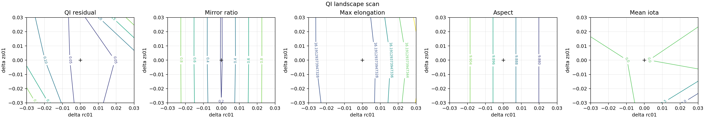

Optimisation with vmec_jax
===========================

``vmec_jax`` supports end-to-end differentiable optimisation of MHD equilibria
through a discrete-adjoint Jacobian that is **exact** (no finite differences)
and runs entirely inside a single Python process.

This page covers:

- the mathematical approach and how it differs from SIMSOPT + VMEC2000,
- the key source files and public API,
- the algorithms (Gauss-Newton, line search, adjoint replay),
- how to reproduce the QA, QH, QP, and QI examples,
- figures comparing ``max_mode=1, 2, 3`` optimisation results and sweep
  policies.

Current reproducible workflow
-----------------------------

Editable workflow anatomy
~~~~~~~~~~~~~~~~~~~~~~~~~

The standalone QA/QH/QP scripts are meant to be read top to bottom.  They keep
the scientific problem visible instead of hiding it behind a large driver:

1. Define VMEC and stage controls with top-level variables, then instantiate
   ``vj.FixedBoundaryVMEC.from_input(...)``.
2. Instantiate objective objects and assemble explicit SIMSOPT-style
   ``objective_tuples = [(objective.J, target, weight), ...]``.
3. Build ``vj.LeastSquaresProblem.from_tuples(objective_tuples)``.
4. Call ``vj.least_squares_solve(...)`` with optimizer, continuation, ESS,
   device, and output controls only.
5. Unpack the returned ``FixedBoundaryOptimizationResult`` to save inputs,
   WOUT files, history JSON, diagnostics, and plots with explicit function
   calls.

Do not pass physics shortcuts such as ``target_aspect`` or ``qi_options`` to
``least_squares_solve``.  Physics targets live in the objective tuple list, and
QI sampling/threshold choices live in ``QuasiIsodynamicOptions`` plus the QI
objective objects.  That separation is the main API hygiene rule: changing the
science problem means editing the visible objective block; changing the
optimizer means editing the solve-call keywords.

Use the standalone scripts for editable single-case studies and the sweep
driver for reproducible comparison tables:

.. list-table::
   :header-rows: 1
   :widths: 18 42 40

   * - Target
     - Best current entry point
     - Notes
   * - QA
     - ``examples/optimization/QA_optimization.py``
     - NFP=2 QA deck, aspect near 5, signed mean-iota target, QA residual.
   * - QH
     - ``examples/optimization/QH_optimization.py``
     - NFP=4 warm start, aspect near 5, ``abs(mean_iota) >= 0.41``, QH residual.
   * - QP
     - ``examples/optimization/QP_optimization.py``
     - NFP=2 QI seed, aspect near 5, ``abs(mean_iota) >= 0.41``, QP residual.
   * - QI
     - ``examples/optimization/QI_optimization.py``
     - NFP=2 QI default lane with aspect target 10, Boozer-space QI, mirror, elongation, QI ceiling, ESS, and repeated same-mode continuation.

Minimal far-from-goal seed files are available for NFP=1, 2, 3, and 4:
``examples/data/input.minimal_seed_nfp1`` through
``examples/data/input.minimal_seed_nfp4``.  They all come from
``vj.minimal_fixed_boundary_indata(nfp=...)`` and contain only
``RBC(0,0)``, ``RBC(0,1)``, and ``ZBS(0,1)`` as nonzero boundary
coefficients.  Use those inputs to test whether a QA/QH/QP/QI policy can build
the target field structure from a common seed that does not already encode the
target helicity.

For generated comparison artifacts, run QA/QH/QP/QI with the current QI
default of no same-mode QP preseed, then run the focused QI matrix separately
when preseed/no-preseed is the experiment:

.. code-block:: bash

   PYTHONPATH=. JAX_PLATFORMS=cpu python examples/optimization/generate_qs_ess_sweep.py --backend-label cpu --solver-device cpu --policy continuation --problems qa,qh,qp,qi --modes 1,2,3 --ess both --qi-qp-preseed off
   PYTHONPATH=. JAX_PLATFORMS=cpu python examples/optimization/generate_qs_ess_sweep.py --backend-label cpu --solver-device cpu --policy direct --problems qa,qh,qp,qi --modes 1,2,3 --ess both --qi-qp-preseed off
   PYTHONPATH=. python examples/optimization/render_qs_ess_publication_panel.py

   PYTHONPATH=. JAX_PLATFORMS=cpu python examples/optimization/generate_qs_ess_sweep.py --backend-label cpu --solver-device cpu --policy continuation --problems qi --modes 1,2,3 --ess both --qi-qp-preseed both
   PYTHONPATH=. JAX_PLATFORMS=cpu python examples/optimization/generate_qs_ess_sweep.py --backend-label cpu --solver-device cpu --policy direct --problems qi --modes 1,2,3 --ess both --qi-qp-preseed both
   PYTHONPATH=. python examples/optimization/render_qi_constrained_sweep.py

For QI seed robustness, first rank solved seed candidates without optimizing,
then run the bounded robustness probe or select a ``RUN_CASE`` in
``QI_optimization.py``:

.. code-block:: bash

   PYTHONPATH=. python examples/optimization/audit_qi_seed_suitability.py --quick --csv results/qi_seed_audit.csv
   PYTHONPATH=. python examples/optimization/audit_qi_seed_suitability.py --quick --smooth-qi-max 5e-3 --legacy-qi-max 2e-3 --csv results/qi_seed3127_audit.csv
   PYTHONPATH=. python examples/optimization/audit_qi_seed_suitability.py --quick --prefine-probes plan --prefine-manifest results/qi_seed_audit/prefine_manifest.json --prefine-output-dir results/qi_seed_audit/prefine_probes
   PYTHONPATH=. JAX_PLATFORMS=cpu python examples/optimization/QI_seed_robustness.py
   PYTHONPATH=. JAX_PLATFORMS=cpu VMEC_JAX_QI_RUN_CASE=qi_stel_seed_3127 python examples/optimization/QI_optimization.py

The second audit command uses the far-seed QI gate convention from
``QI_optimization.py``: legacy QI below ``2e-3`` and smooth differentiable QI
below ``5e-3``.

The README/docs QI coverage figure is rendered from existing reviewed outputs
for both bundled QI inputs:

.. list-table::
   :header-rows: 1
   :widths: 22 27 11 11 11 10 9 9 9 9

   * - Input
     - Output/provenance
     - Final J
     - Smooth QI
     - Legacy QI
     - Mirror
     - Elong.
     - Aspect
     - Iota
     - CPU min
   * - ``examples/data/input.nfp2_QI``
     - ``results/qi_opt/ess/nfp2_qi``
     - ``1.17e-2``
     - ``1.13e-3``
     - ``3.09e-4``
     - ``0.225/0.30``
     - ``6.43/8.2``
     - ``9.999/10.0``
     - ``-0.5043``
     - ``14.7``
   * - ``examples/data/input.QI_stel_seed_3127``
     - ``results/qi_opt/ess/qi_stel_seed_3127_current_public_final``
     - ``1.12e-1``
     - ``4.32e-3``
     - ``1.16e-3``
     - ``0.316/0.35``
     - ``3.91/8.0``
     - ``3.465/4.0``
     - ``-1.0366``
     - ``6.3``

.. image:: _static/figures/readme_qi_optimization_cases.png
   :width: 100%
   :align: center
   :alt: QI optimization coverage for NFP=2 QI and seed-3127 inputs

The Boozer ``|B|`` panels in that figure use line contours only.  The staged
objective panel concatenates every recorded history file and plots the
best-so-far value in each stage, normalized to that stage's first objective,
with dashed separators where objective definitions or weights change.  For the
seed-3127 lane, the inset is a boundary-reference interpolation scan, not an
optimizer trajectory.
Regenerate the figure and CSV without launching new optimization jobs with:

.. code-block:: bash

   PYTHONPATH=. python examples/optimization/render_qi_readme_cases.py

The robustness probe is intentionally a QI+iota basin test, not a full
engineering acceptance claim.  ``QI_optimization.py`` is now the single
staged driver for the promoted path: it can run a low-QI basin search, an
iota ramp with a QI ceiling, and guarded mirror/elongation cleanup, with exact
independent diagnostics deciding which stages are promoted.  For far seeds it
can also run a bounded basin prefilter over ESS-scaled boundary jumps before
local optimization.  Far-seed stages can use a cheaper QI grid for the
optimization and a higher-resolution final audit recorded in
``diagnostics.json``.  Promote a QI result only after the independent
smooth-QI, legacy-QI, iota, mirror-ratio, elongation, and Boozer ``|B|``
contour checks agree.  Landscape and
basin-survey diagnostics use fast trial solves unless ``--exact-solve`` is
passed; use exact solves before treating their scalar values as promotion
evidence.

Current NFP=4 QI status: ``VMEC_JAX_QI_RUN_CASE=nfp4_qh_warm_to_qi`` is an
explicit non-passing stress fixture, not a promoted QI path.  Bounded May 2026
audits of the bundled QH warm start, a local QH-to-QI cleanup, and archived
same-NFP QI references did not satisfy the agreed smooth/legacy QI ``< 2e-3``
gates.  The best quick-audited archived NFP=4 QI reference found locally was
still above the gate (smooth about ``8.4e-3``, legacy about ``5.2e-3``), so the
example records stress-fixture metadata in ``diagnostics.json`` and should stay
in the audit lane until a new independent smooth/legacy/mirror pass is added.

Motivation: differentiability without finite differences
---------------------------------------------------------

SIMSOPT's canonical fixed-boundary QH workflow calls VMEC2000 as a black-box
subprocess and builds the Jacobian column by column using finite differences::

  # SIMSOPT / VMEC2000 approach
  for i in range(n_params):
      perturb boundary DOF i by ε
      run VMEC2000 subprocess            # one full solve per column
      J[:, i] = (f(x+ε·eᵢ) - f(x)) / ε

For ``n_params = 24`` boundary DOFs this is 24 extra forward solves per
Jacobian evaluation — expensive, and the result is only accurate to
``O(√ε_machine)`` due to finite-difference cancellation.

``vmec_jax`` uses a **discrete-adjoint replay** instead:

1. Run one "exact" forward solve with the adjoint flag, storing a
   compressed checkpoint tape of the iteration trajectory.
2. Propagate tangent vectors through the tape via batched JVP
   (``jax.vmap(jax.jvp(...))``, visiting each recorded iteration step
   in forward order exactly once per tangent batch.

The Jacobian is thereby computed to **machine precision** in a time roughly
equal to ``1 + fraction-of-solve × n_params`` forward-solve equivalents,
rather than ``n_params`` full forward solves.

In practice, for ``n_params ≤ 24`` the Jacobian build takes roughly 0.5–1.5×
the cost of a single tight solve — comparable to SIMSOPT + finite differences
with ``n_params = 1`` but covering the full parameter space at once.

→ See :doc:`discrete_adjoint` for a full mathematical description.

Comparison with SIMSOPT
------------------------

.. list-table::
   :header-rows: 1
   :widths: 35 32 33

   * - Feature
     - vmec_jax
     - SIMSOPT + VMEC2000
   * - Jacobian method
     - Exact discrete-adjoint replay
     - Finite differences (columnar)
   * - Jacobian cost
     - ≈ 1.5 × forward solve
     - n_params × forward solve
   * - Subprocess required
     - No — pure Python/JAX
     - Yes — VMEC2000 Fortran binary
   * - Accuracy
     - Machine-precision (exact)
     - O(√ε\_machine) FD error
   * - GPU support
     - Yes (JAX device)
     - No
   * - Differentiable through optimizer
     - Yes (JAX autodiff)
     - No

Current wall times and objective values are generated by
``examples/optimization/generate_qs_ess_sweep.py`` and rendered in the policy
sweep below.  The docs avoid fixed one-off numbers in this comparison table so
that benchmark values do not drift from the generated CSV/JSON artifacts.

→ See :doc:`simsopt_comparison` for a detailed runtime, memory, and
algorithm comparison.

SIMSOPT-style objective tuples
------------------------------

The recommended public workflow mirrors the SIMSOPT ``LeastSquaresProblem``
style: create objective objects, then pass explicit
``(objective_function, target, weight)`` tuples to
``vj.LeastSquaresProblem.from_tuples``.  The objective function should be the
``.J`` method on the objective object, or any callable with signature
``(ctx, state)`` returning a scalar or vector.

.. code-block:: python

   vmec = vj.FixedBoundaryVMEC.from_input(
       INPUT_FILE,
       max_mode=MAX_MODE,
       min_vmec_mode=MIN_VMEC_MODE,
       output_dir=OUTPUT_DIR,
   )

   aspect = vj.AspectRatio()
   iota_floor = vj.AbsMeanIotaFloor(TARGET_ABS_IOTA_MIN)
   qs = vj.QuasisymmetryRatioResidual(
       helicity_m=HELICITY_M,
       helicity_n=HELICITY_N,
       surfaces=SURFACES,
   )

   objective_tuples = [
       (aspect.J, TARGET_ASPECT, ASPECT_WEIGHT),
       (iota_floor.J, 0.0, IOTA_FLOOR_WEIGHT),
       (qs.J, 0.0, QS_WEIGHT),
   ]
   problem = vj.LeastSquaresProblem.from_tuples(objective_tuples)

The tuple weight follows SIMSOPT semantics.  ``vmec_jax`` minimizes the
least-squares residual

.. code-block:: text

   sqrt(weight) * (objective(ctx, state) - target)

for each scalar entry returned by the objective.  Do not pre-apply
``sqrt(weight)`` inside the callback.  Put physics targets and regularization
strengths in the tuple list, and put optimizer controls such as continuation
stages, ESS scaling, tolerances, device selection, and output directories in
``least_squares_solve``.

Finite-beta physics metrics use the same tuple form.  For example, a smooth
magnetic-well floor and a Mercier-stability floor can be added alongside QS or
QI terms without changing the optimizer setup:

.. code-block:: python

   well = vj.MagneticWell(minimum=0.0, softness=1.0e-3)
   dmerc = vj.DMerc(minimum=0.0, softness=1.0e-3)

   objective_tuples = [
       (aspect.J, TARGET_ASPECT, ASPECT_WEIGHT),
       (iota_floor.J, 0.0, IOTA_FLOOR_WEIGHT),
       (qs.J, 0.0, QS_WEIGHT),
       (well.J, 0.0, MAGNETIC_WELL_WEIGHT),
       (dmerc.J, 0.0, DMERC_WEIGHT),
   ]
   problem = vj.LeastSquaresProblem.from_tuples(objective_tuples)

``MagneticWell`` evaluates the VMEC/SIMSOPT magnetic-well proxy from the
state-derived half-mesh volume derivative, also available directly as
``vj.magnetic_well_from_state(...)``.  ``DMerc`` uses the differentiable
state-level Mercier/JXBFORCE path and returns one smooth lower-bound residual
per interior full-mesh surface.  Both are lower-bound penalties, so their tuple
target must be ``0.0``.

QI objectives use the same tuple syntax, but the QI field-quality terms are
routed through the Boozer/QI problem path so they can share one Boozer
transform.  QI tuple targets must be ``0.0``; encode thresholds and smoothing
inside the objective object, for example ``QuasiIsodynamicOptions``,
``MirrorRatio(threshold=...)``, or ``MaxElongation(threshold=...)``.
Use ``include_bounce_endpoints=True`` when you want the smooth QI residual to
sample the same normalized bounce-level endpoints as the legacy Goodman-style
branch-shuffle diagnostic.

.. code-block:: python

   qi_options = vj.QuasiIsodynamicOptions(
       surfaces=np.linspace(0.1, 1.0, 6),
       mboz=18,
       nboz=18,
       nphi=151,
       nalpha=31,
       n_bounce=51,
       include_bounce_endpoints=True,
       branch_width_weight=0.5,
       profile_weight=0.1,
       shuffle_profile_weight=1.0,
       jit_booz=True,  # default; faster in current CPU/GPU QI diagnostics
       # Optional, closer to legacy arr_out=True but more expensive:
       # shuffle_profile_nphi_out=501,
   )
   qi = vj.QuasiIsodynamicResidual(qi_options)
   mirror = vj.MirrorRatio(
       threshold=0.21,
       ntheta=96,
       nphi=96,
       surface_index=None,       # all QI surfaces
       smooth_extrema=2.0e-2,    # smoother gradients than hard max/min
       smooth_penalty=2.0e-2,
       qi_options=qi_options,
   )
   qi_ceiling = vj.QuasiIsodynamicResidualCeiling(
       maximum=2.0e-3,
       smooth_penalty=2.0e-3,
       qi_options=qi_options,
   )
   elongation = vj.MaxElongation(
       threshold=8.0,
       ntheta=48,
       nphi=16,
       qi_options=qi_options,
   )

   objective_tuples = [
       (vj.AspectRatio().J, 5.0, 1.0),
       (vj.AbsMeanIotaFloor(0.41).J, 0.0, 200.0**2),
       (qi.J, 0.0, 1.0),
       (qi_ceiling.J, 0.0, 100.0),
       (mirror.J, 0.0, 10.0),
       (elongation.J, 0.0, 10.0),
   ]
   qi_problem = vj.LeastSquaresProblem.from_tuples(objective_tuples)

For QI cleanup work, rank solved candidates with the no-solve component report
before promoting any scalar objective result.  Mirror-ratio cleanup must be
guarded by a QI residual ceiling or by an independent engineering promotion
gate.  Endpoints that improve mirror but fail the independent QI gate are
rejected rather than promoted.  The report records the QI+iota gate separately
from the full engineering gate and sorts mirror-cleanup candidates ahead of
low-mirror states that already failed smooth or legacy QI:

.. code-block:: bash

   PYTHONPATH=. JAX_PLATFORMS=cpu python tools/diagnostics/qi_objective_component_report.py \
     --output results/diagnostics/qi_mirror_cleanup_rank.json \
     --include-bounce-endpoints --mboz 18 --nboz 18 --nphi 151 --nalpha 31 \
     --n-bounce 51 \
     --case current:results/qi_mirror_probe/input_nfp2_qi_branch5_mode3_nfev12/input.final:results/qi_mirror_probe/input_nfp2_qi_branch5_mode3_nfev12/wout_final.nc \
     --case cleanup:results/qi_mirror_probe/input_nfp2_qi_light_mirror20_matrixfree_nfev10/input.final:results/qi_mirror_probe/input_nfp2_qi_light_mirror20_matrixfree_nfev10/wout_final.nc

Add ``--branch-width-weight 5.0`` only when reproducing the branch-heavy
optimization objective components rather than the independent promotion gate.

Quasi-helical symmetry example
--------------------------------

The ``examples/optimization/QH_optimization.py`` script replicates the
SIMSOPT QH benchmark entirely within ``vmec_jax``.  It has no
argparse — all parameters are top-level variables, and the objective is built
explicitly as a small list.  After the objective definition, the script shows
the same setup-and-solve flow used by the QA/QP/QI examples:

.. code-block:: python

   INPUT_FILE = DATA_DIR / "input.nfp4_QH_warm_start"
   MAX_MODE = 3
   MIN_VMEC_MODE = 6
   MAX_NFEV = 30
   METHOD = "scipy"            # also: "gauss_newton", "scipy_matrix_free", "lbfgs_adjoint", "scalar_trust"
   SCIPY_TR_SOLVER = "lsmr"    # also: "exact" for small dense trust-region solves
   SOLVER_DEVICE = None        # set to "cpu" or "gpu" to force one backend
   SAVE_STAGE_INPUTS = True    # keep per-stage input decks
   SAVE_STAGE_WOUTS = False    # set True to write per-stage WOUT files
   HELICITY_M = 1
   HELICITY_N = -1
   TARGET_ASPECT = 5.0
   TARGET_ABS_IOTA_MIN = 0.41
   SURFACES = np.arange(0.0, 1.01, 0.1)

   vmec = vj.FixedBoundaryVMEC.from_input(
       INPUT_FILE,
       max_mode=MAX_MODE,
       min_vmec_mode=MIN_VMEC_MODE,
       output_dir=OUTPUT_DIR,
   )
   STAGE_MODES = vj.qs_stage_modes(
       max_mode=MAX_MODE,
       use_mode_continuation=USE_MODE_CONTINUATION,
       continuation_nfev=CONTINUATION_NFEV,
   )

   aspect = vj.AspectRatio()
   iota_floor = vj.AbsMeanIotaFloor(TARGET_ABS_IOTA_MIN)
   qs = vj.QuasisymmetryRatioResidual(
       helicity_m=HELICITY_M,
       helicity_n=HELICITY_N,
       surfaces=SURFACES,
   )
   objective_tuples = [
       (aspect.J, TARGET_ASPECT, ASPECT_WEIGHT),
       (iota_floor.J, 0.0, IOTA_WEIGHT),
       (qs.J, 0.0, QS_WEIGHT),
       # Optional physics terms:
       # (vj.LgradB(threshold=0.30, smooth_penalty=1.0e-3).J, 0.0, 0.01),
       # (vj.MagneticWell(minimum=0.0).J, 0.0, 1.0),
       # (vj.VolavgB().J, TARGET_VOLAVGB, VOLAVGB_WEIGHT),
       # (vj.BetaTotal().J, TARGET_BETA, BETA_WEIGHT),
       # (vj.DMerc(minimum=0.0, softness=1.0e-3).J, 0.0, DMERC_WEIGHT),
       # (vj.JDotB(surfaces=(0.25, 0.50, 0.75)).J, 0.0, JDOTB_WEIGHT),
       # (vj.BDotB(surfaces=(0.25, 0.50, 0.75)).J, TARGET_BDOTB, BDOTB_WEIGHT),
       # (vj.BDotGradV(surfaces=(0.25, 0.50, 0.75)).J, TARGET_BDOTGRADV, BDOTGRADV_WEIGHT),
       # (vj.ToroidalCurrent(surfaces=(0.25, 0.50, 0.75)).J, TARGET_TORCUR, TORCUR_WEIGHT),
       # (vj.ToroidalCurrentGradient(surfaces=(0.25, 0.50, 0.75)).J, TARGET_TORCUR_PRIME, TORCUR_PRIME_WEIGHT),
       # (vj.BVector(s_index=-1).J, TARGET_B_VECTOR, B_VECTOR_WEIGHT),
       # (vj.JVector(surfaces=(0.25, 0.50, 0.75)).J, TARGET_J_VECTOR, J_VECTOR_WEIGHT),
   ]
   problem = vj.LeastSquaresProblem.from_tuples(objective_tuples)

   result = vj.least_squares_solve(
       vmec,
       problem,
       stage_modes=STAGE_MODES,
       max_nfev=MAX_NFEV,
       continuation_nfev=CONTINUATION_NFEV,
       method=METHOD,
       ftol=FTOL,
       gtol=GTOL,
       xtol=XTOL,
       use_ess=USE_ESS,
       ess_alpha=ALPHA,
       label=LABEL,
       use_mode_continuation=USE_MODE_CONTINUATION,
       inner_max_iter=INNER_MAX_ITER,
       inner_ftol=INNER_FTOL,
       trial_max_iter=TRIAL_MAX_ITER,
       trial_ftol=TRIAL_FTOL,
       solver_device=SOLVER_DEVICE,
       scipy_tr_solver=SCIPY_TR_SOLVER,
       save_stage_inputs=SAVE_STAGE_INPUTS,
       save_stage_wouts=SAVE_STAGE_WOUTS,
   )

   initial_optimizer = result.initial_optimizer
   final_optimizer = result.final_optimizer
   final_result = result.final_result
   history = result.history
   objective_history = result.objective_history
   timing = result.timing_summary
   saved_paths = {
       "initial_input": OUTPUT_DIR / "input.initial",
       "final_input": OUTPUT_DIR / "input.final",
       "initial_wout": OUTPUT_DIR / "wout_initial.nc",
       "final_wout": OUTPUT_DIR / "wout_final.nc",
       "history": OUTPUT_DIR / "history.json",
   }
   initial_optimizer.save_input(saved_paths["initial_input"], result.initial_params)
   initial_optimizer.save_wout(
       saved_paths["initial_wout"],
       result.initial_params,
       state=result.initial_state,
   )
   final_optimizer.save_input(saved_paths["final_input"], result.final_params)
   final_optimizer.save_wout(
       saved_paths["final_wout"],
       result.final_params,
       state=result.final_state,
   )
   final_optimizer.save_history(saved_paths["history"], final_result)

   print(f"Final aspect ratio:    {history['aspect_final']:.6g}")
   print(f"Final mean iota:       {history['iota_final']:.6g}")
   print(f"Final field objective: {history['qs_final']:.6e}")
   print(f"Wall time:             {timing['total_wall_time_s']:.2f} s")
   print(f"Recent objectives:     {objective_history[-3:]}")

   wout_final = vj.load_wout(saved_paths["final_wout"])
   theta, zeta, b_lcfs = vj.vmecplot2_bmag_grid(
       wout_final,
       s_index=-1,
       ntheta=64,
       nzeta=64,
       zeta_max=2.0 * np.pi / float(wout_final.nfp),
   )
   print(f"LCFS |B| grid shape: {b_lcfs.shape}, Bmax={np.max(b_lcfs):.6g}")

   plot_paths = {
       "boundary_comparison": vj.plot_3d_boundary_comparison(
           saved_paths["initial_wout"],
           saved_paths["final_wout"],
           outdir=OUTPUT_DIR,
       ),
       "bmag_contours": vj.plot_bmag_contours(
           saved_paths["initial_wout"],
           saved_paths["final_wout"],
           outdir=OUTPUT_DIR,
       ),
       "objective_history": vj.plot_objective_history(
           saved_paths["history"],
           outdir=OUTPUT_DIR,
       ),
   }
   print(plot_paths)

Objective callbacks receive ``(ctx, state)`` and may return a scalar or vector.
For continuation runs, use ``result.initial_stage`` and ``result.final_stage``
for the common endpoints, and ``result.stage_histories`` or
``result.stage_timing_summaries`` for per-stage accepted exact-replay history
and timing.  The raw records remain available as ``result.stage_records`` for
custom inspection, but user scripts do not need to unpack them just to save,
plot, or report final outputs.
The tuple weight follows SIMSOPT semantics: vmec_jax minimizes
``sqrt(weight) * (J - target)``.  Problem-specific targets and QI sampling
options live on the objective objects/problem, while ``least_squares_solve``
only receives optimizer, continuation, device, and output controls.

Run it with:

.. code-block:: bash

   python examples/optimization/QH_optimization.py

Recommended standalone scripts
------------------------------

The individual scripts are workflow examples, not the canonical benchmark
tables.  They intentionally expose all important controls as top-level
variables, so users can edit the file exactly as in the SIMSOPT examples:
VMEC resolution, active boundary modes, objective terms, weights, ESS scaling,
continuation policy, and optimizer options.

Use these four scripts as the current starting points for fixed-boundary
optimization:

.. list-table::
   :header-rows: 1
   :widths: 18 28 54

   * - Target
     - Script
     - Default objective tuple set
   * - QA
     - ``examples/optimization/QA_optimization.py``
     - ``AspectRatio``, signed ``MeanIota`` target, and
       ``QuasisymmetryRatioResidual(helicity_m=1, helicity_n=0)``.  This is the
       recommended public QA example.
   * - QH
     - ``examples/optimization/QH_optimization.py``
     - ``AspectRatio``, ``AbsMeanIotaFloor``, and
       ``QuasisymmetryRatioResidual(helicity_m=1, helicity_n=-1)`` on the NFP=4
       warm start.
   * - QP
     - ``examples/optimization/QP_optimization.py``
     - ``AspectRatio``, ``AbsMeanIotaFloor``, and
       ``QuasisymmetryRatioResidual(helicity_m=0, helicity_n=-1)`` from the
       bundled NFP=2 QI seed.
   * - QI
     - ``examples/optimization/QI_optimization.py``
     - ``AspectRatio``, ``AbsMeanIotaFloor``, ``QuasiIsodynamicResidual``,
       ``MirrorRatio``, and ``MaxElongation`` with repeated same-mode
       continuation and ESS.

.. code-block:: bash

   PYTHONPATH=. JAX_PLATFORMS=cpu python examples/optimization/QA_optimization.py
   PYTHONPATH=. JAX_PLATFORMS=cpu python examples/optimization/QH_optimization.py
   PYTHONPATH=. JAX_PLATFORMS=cpu python examples/optimization/QP_optimization.py
   PYTHONPATH=. JAX_PLATFORMS=cpu python examples/optimization/QI_optimization.py

Those scripts write ``input.initial``, ``input.final``, ``wout_initial.nc``,
``wout_final.nc``, ``history.json``, and per-case diagnostic plots.  Current
published optimization numbers, wall times, objective histories, final 3-D
surfaces, and LCFS :math:`|B|` contours come only from the generated sweep
artifacts below.  This avoids drifting documentation when a one-off example is
rerun with different local budgets.

Full QA/QH/QP/QI policy sweep
-----------------------------

The sweep below compares four target objectives:

- QA: the reference omnigenity NFP=2 QA deck, aspect ratio near 5,
  signed mean iota target 0.42, and quasi-axisymmetry.
- QH: the bundled NFP=4 warm start, aspect ratio near 5, quasi-helical
  symmetry, and a smooth ``abs(mean_iota) >= 0.41`` lower bound.
- QP: aspect ratio near 5, quasi-poloidal symmetry, and a smooth
  ``abs(mean_iota) >= 0.41`` lower bound, using the same bundled NFP=2 seed as
  the QI runs.
- QI: aspect ratio near 10, a differentiable smooth Boozer-space quasi-isodynamic
  residual evaluated through ``booz_xform_jax``, maximum mirror-ratio penalty,
  maximum-LCFS-elongation penalty, and the same smooth
  ``abs(mean_iota) >= 0.41`` lower bound.  ``LgradB`` is available as an
  optional commented term in the example scripts.

The current objective priority is primary symmetry/QI quality and rotational
transform control first.  QA/QH/QP use aspect ratio near 5, while QI uses
aspect ratio near 10 to keep mirror and elongation cleanup from being
overconstrained.  QA also uses the signed iota-0.42 target, while QH/QP/QI use
``abs(mean_iota) >= 0.41``.  ``LgradB`` remains available for users who want
extra magnetic-gradient regularization, but it is not active in the default
sweeps or best-row selection.  When enabling ``LgradB`` in an adjoint
optimization, use a small ``smooth_penalty`` so the softplus penalty remains
differentiable near the threshold.

Each problem is run with staged mode continuation and with direct-start mode
expansion.  Each policy is run with and without ESS using ``alpha = 1.2``,
matching the gentler scaling used by the local omnigenity optimization
workflows.
For QI, the focused constrained sweep additionally compares starting from a
same-mode QP preseed against starting directly from the bundled
``input.nfp2_QI`` omnigenity seed.  This QP preseed is useful as a controlled
warm start, but its scalar objective is different from the QI refinement
objective and is therefore not stitched into the plotted QI history.  The CLI
default is ``--qi-qp-preseed off``; use ``--qi-qp-preseed on`` or
``--qi-qp-preseed both`` to run the QP-preseed diagnostic rows.
That NFP=2 seed contains mode-2 boundary harmonics, so QI stages first project
the input boundary to the requested active space:
``max(abs(m), abs(n)) <= max_mode``.  Thus a ``max_mode=1`` QI run explicitly
zeros the mode-2 seed before solving, while ``max_mode=2`` and ``max_mode=3``
retain and optimize the corresponding larger active spaces.
When enabled, the QP preseed is followed by a final refinement with the full
QI + mirror-ratio + elongation objective.  ``LgradB`` remains an optional
commented objective term in the scripts, but it is not active in the default
sweeps.  The previous QI-only
preseed and profile-locking penalty are disabled by default because the local
reference QI workflow optimizes bounce/well-width label dependence directly,
plus mirror, elongation, and magnetic-gradient scale-length penalties, rather
than forcing a prescribed Boozer ``|B|`` profile.
This keeps QP as an explicit optional experiment while still measuring whether
the preseed helps or hurts the constrained QI solve.
``QI_OPTIONS.phimin`` selects the beginning of the one-field-period well
interval used by the smooth QI residual.  The bundled NFP=2 seed uses the
default ``0.0``; set it to ``np.pi / nfp`` when comparing against a reference
configuration whose well starts one half-period later.
Columns correspond to ``max_mode = 1, 2, 3``.  The vertical dotted lines mark
continuation stage boundaries.  QA/QH/QP continuation uses the repeated
omnigenity-style policy ``[1, 1, 2, 2, 2]`` for ``max_mode=2`` and
``[1, 1, 2, 2, 2, 3, 3, 3]`` for ``max_mode=3``.  QI repeats the requested
active space five times, matching the reference omnigenity workflow.

The generated objective panels contain the full CPU/GPU policy sweep.  Solid
curves met the optimizer success criterion; dashed curves are stopped, failed,
or budgeted lanes.  The summary tables identify whether a dashed lane reached
``max_nfev``, hit the 1200 second timeout, or failed earlier such as from GPU
OOM.  Curves are split by objective stage and plotted as best-so-far values
within that stage, so QP preseed and full constrained QI refinement are not
treated as one continuous scalar objective.  The QA input follows the
omnigenity ``input.nfp22_QA`` deck and carries nonzero mode-1 boundary terms so
the iota residual has a useful derivative.  Direct QA without ESS remains a
weak policy for high direct-start modes; staged continuation is the default
research-grade policy for QA.

The large all-policy panels, atlases, and PDF snapshots are generated assets,
not source files.  They are intentionally not tracked in git.  Recreate them
from the sweep results with the commands below; the README keeps only the four
compact best-result PNGs.

.. code-block:: bash

   PYTHONPATH=. JAX_PLATFORMS=cpu python examples/optimization/generate_qs_ess_sweep.py --backend-label cpu --solver-device cpu --policy continuation --problems qa,qh,qp,qi --modes 1,2,3 --ess both --qi-qp-preseed off
   PYTHONPATH=. JAX_PLATFORMS=cpu python examples/optimization/generate_qs_ess_sweep.py --backend-label cpu --solver-device cpu --policy direct --problems qa,qh,qp,qi --modes 1,2,3 --ess both --qi-qp-preseed off
   PYTHONPATH=. JAX_PLATFORM_NAME=gpu python examples/optimization/generate_qs_ess_sweep.py --backend-label gpu --solver-device gpu --policy continuation --problems qa,qh,qp,qi --modes 1,2,3 --ess both --qi-qp-preseed off
   PYTHONPATH=. JAX_PLATFORM_NAME=gpu python examples/optimization/generate_qs_ess_sweep.py --backend-label gpu --solver-device gpu --policy direct --problems qa,qh,qp,qi --modes 1,2,3 --ess both --qi-qp-preseed off
   PYTHONPATH=. python examples/optimization/render_qs_ess_publication_panel.py

Run the constrained QI preseed/no-preseed matrix explicitly with:

.. code-block:: bash

   PYTHONPATH=. JAX_PLATFORMS=cpu python examples/optimization/generate_qs_ess_sweep.py --backend-label cpu --solver-device cpu --policy continuation --problems qi --modes 1,2,3 --ess both --qi-qp-preseed both
   PYTHONPATH=. JAX_PLATFORMS=cpu python examples/optimization/generate_qs_ess_sweep.py --backend-label cpu --solver-device cpu --policy direct --problems qi --modes 1,2,3 --ess both --qi-qp-preseed both
   PYTHONPATH=. python examples/optimization/render_qi_constrained_sweep.py

The default per-case timeout is ``1200 s``.  The current omnigenity-style
science configs use ``inner_max_iter = trial_max_iter = 120`` and
``ftol = trial_ftol = 1e-9``.  GPU production sweeps cap those values at 180
if a future config requests a larger replay budget, so high-mode/LASYM cases
are bounded without silently switching to diagnostic budgets.  Add
``--diagnostic-budgets`` only for bounded quick-look GPU diagnostics, and use
``--case-timeout-s 0`` only for an unbounded local diagnostic run.

To recreate one row, restrict ``--policy`` and ``--problems``.  For example,
this reruns the current README-best QA row:

.. code-block:: bash

   PYTHONPATH=. JAX_PLATFORMS=cpu python examples/optimization/generate_qs_ess_sweep.py --backend-label cpu --solver-device cpu --policy continuation --problems qa --modes 3 --ess on --rerun
   PYTHONPATH=. python examples/optimization/render_qs_ess_publication_panel.py

The GPU rows run through the same accepted-point tape exact/replay path as CPU
with GPU-calibrated optimizer budgets; vmec_jax does not silently switch GPU
optimization callbacks to CPU or to scan exact.  If you need a short diagnostic
matrix, append ``--diagnostic-budgets``; otherwise the script uses calibrated
production budgets and records any non-converged case as a normal ``max_nfev``
stop.  Force ``VMEC_JAX_OPT_EXACT_PATH=scan`` only for a targeted scan-exact
profiling or parity experiment.

.. code-block:: bash

   PYTHONPATH=. JAX_PLATFORM_NAME=gpu python examples/optimization/generate_qs_ess_sweep.py --backend-label gpu --solver-device gpu --policy continuation --problems qa,qh,qp,qi --modes 1,2,3 --ess both --qi-qp-preseed off
   PYTHONPATH=. JAX_PLATFORM_NAME=gpu python examples/optimization/generate_qs_ess_sweep.py --backend-label gpu --solver-device gpu --policy direct --problems qa,qh,qp,qi --modes 1,2,3 --ess both --qi-qp-preseed off
   PYTHONPATH=. python examples/optimization/render_qs_ess_publication_panel.py

Non-Stellarator-Symmetric Sweeps
~~~~~~~~~~~~~~~~~~~~~~~~~~~~~~~~

Append ``--stellarator-asymmetric`` to set ``LASYM = T`` in the in-memory VMEC
input and optimize ``RBC/ZBS/RBS/ZBC`` instead of only the stellarator-symmetric
``RBC/ZBS`` families.  The sweep deterministically seeds zero asymmetric
``RBS/ZBC`` degrees of freedom with ``1e-7`` so exact Jacobians do not start
from a completely inactive asymmetric subspace.  Results are written under
``results/qs_ess_sweep/<backend>/asymmetric/`` and the renderer creates
additional ``*_asymmetric_*`` objective panels, state atlases, summary tables,
and full publication panels when those cases are present.

.. code-block:: bash

   PYTHONPATH=. JAX_PLATFORMS=cpu python examples/optimization/generate_qs_ess_sweep.py --backend-label cpu --solver-device cpu --policy continuation --problems qa,qh,qp,qi --modes 1,2,3 --ess both --qi-qp-preseed off --stellarator-asymmetric
   PYTHONPATH=. JAX_PLATFORMS=cpu python examples/optimization/generate_qs_ess_sweep.py --backend-label cpu --solver-device cpu --policy direct --problems qa,qh,qp,qi --modes 1,2,3 --ess both --qi-qp-preseed off --stellarator-asymmetric
   PYTHONPATH=. JAX_PLATFORM_NAME=gpu python examples/optimization/generate_qs_ess_sweep.py --backend-label gpu --solver-device gpu --policy continuation --problems qa,qh,qp,qi --modes 1,2,3 --ess both --qi-qp-preseed off --stellarator-asymmetric
   PYTHONPATH=. JAX_PLATFORM_NAME=gpu python examples/optimization/generate_qs_ess_sweep.py --backend-label gpu --solver-device gpu --policy direct --problems qa,qh,qp,qi --modes 1,2,3 --ess both --qi-qp-preseed off --stellarator-asymmetric
   PYTHONPATH=. python examples/optimization/render_qs_ess_publication_panel.py

The published LASYM figures are partial 1200 second lanes rather than a
complete matrix.  This is intentional: timeout and GPU-memory failures are
useful performance data for the asymmetric exact/replay path.  The current
frozen snapshot contains 13 CPU LASYM rows and 61 GPU LASYM rows.  The CPU
subset has 6 successful rows, 6 crashed rows, and 1 budgeted stop; the GPU
subset has 19 successful rows, 10 crashed rows, and 32 budgeted stops.

For NVIDIA-only JAX installations, ``JAX_PLATFORMS=cuda`` is also valid.  Do
not use ``JAX_PLATFORMS=gpu``: some JAX versions interpret that as both CUDA
and ROCm and fail if ROCm is not installed.

The renderer writes these report artifacts under
``examples/optimization/results/qs_ess_sweep``.  Copy only the small README
figures into ``docs/_static/figures`` before committing.  Leave the large
publication panels, state atlases, summary-table images, and PDFs as generated
local artifacts or attach them to a GitHub release.

Final equilibria for CPU/GPU continuation/direct cases are rendered separately
so the 3D surfaces and boundary-field colorbars remain readable.  The
``|B|`` panels use line contours on the LCFS, not filled contours.  The
renderer emits ``final_state_atlas_*.png/.pdf`` files locally for reports; they
are excluded from git so a fresh clone stays lightweight.

Finite-beta stage-one examples
------------------------------

The finite-beta examples reproduce the VMEC-only stage-one part of the
``single_stage_optimization_finite_beta`` workflows without SIMSOPT or coils.
They use the finite-pressure/current input decks in ``examples/data`` and add
JAX-differentiable global residuals for aspect ratio, iota bounds,
volume-averaged field proxy, and total beta.  QA and QH then add the usual
quasisymmetry residual; QI adds the smooth Boozer-space quasi-isodynamic
residual through ``booz_xform_jax``.

Unlike the public QA/QH/QP/QI teaching scripts above, these finite-beta stage-one
examples call ``FixedBoundaryExactOptimizer`` directly rather than
``least_squares_solve``.  That is intentional: each continuation stage builds
stage-local pressure/current profile data, finite-beta global residual blocks,
and optional Redl/QI residual closures before running the optimizer.  The
shared ``finite_beta_stage1_common.py`` helper only standardizes stage budgets,
saved inputs/wouts, histories, and plots; it does not hide objective assembly
behind a config object.

.. code-block:: bash

   PYTHONPATH=. python examples/optimization/qa_optimization_finite_beta.py
   PYTHONPATH=. python examples/optimization/qh_optimization_finite_beta.py
   PYTHONPATH=. python examples/optimization/qi_optimization_finite_beta.py

All controls are top-level variables in those scripts: ``MAX_MODE``,
``MAX_NFEV``, ``USE_ESS``, ``USE_MODE_CONTINUATION``, and
``SOLVER_DEVICE``.  The scripts also expose ``INNER_MAX_ITER``,
``INNER_FTOL``, ``TRIAL_MAX_ITER``, and ``TRIAL_FTOL`` so deck-controlled
VMEC budgets can be kept or overridden explicitly.  Set
``SOLVER_DEVICE = "gpu"`` or run with ``JAX_PLATFORM_NAME=gpu`` on a machine
with a working JAX GPU install.

The QI finite-beta script additionally exposes ``QI_MBOZ``, ``QI_NBOZ``,
``QI_NPHI``, ``QI_NALPHA``, and ``QI_N_BOUNCE``.  Its defaults are intended as
diagnostic first-run settings; increase these grid controls before treating a
QI finite-beta refinement as a final research-quality result.

The current implementation includes differentiable finite-beta global
diagnostics, current-driven iota through ``PCURR_TYPE = "cubic_spline_ip"``,
a ``vj.DMerc`` lower-bound residual for stellarator-symmetric and LASYM
equilibria, VMEC/JXBFORCE profile accessors ``vj.JDotB``, ``vj.BDotB`` and
``vj.BDotGradV``, and state-derived current-profile accessors
``vj.ToroidalCurrent`` and ``vj.ToroidalCurrentGradient``.  Pass
``surfaces=(...)`` to those profile objects to select nearest full-mesh
surfaces, or omit it to use all interior radial surfaces.  ``ToroidalCurrent``
uses VMEC's Mercier normalization ``signgs * 2*pi * <B_u>``; its gradient is
the radial derivative ``ip`` used in ``DMerc``.

Two vector-valued accessors are also available for advanced targeting:
``vj.BVector(s_index=...)`` returns Cartesian ``(Bx, By, Bz)`` on one radial
surface and ``vj.JVector(surfaces=...)`` returns VMEC flux-coordinate current
density components ``(J^theta, J^zeta) = (itheta/sqrtg, izeta/sqrtg)`` on the
selected surfaces.  These are flattened residual blocks; users should choose
their own target arrays and normalizations before adding them to a problem.

The Redl bootstrap-current mismatch is available as
``vj.RedlBootstrapMismatch``:

.. code-block:: python

   ne_coeffs = [3.0e20, 0.0, 0.0, 0.0, 0.0, -2.97e20]  # m^-3
   te_coeffs = [15.0e3, -14.85e3]                      # eV
   redl = vj.RedlBootstrapMismatch(
       helicity_n=HELICITY_N,
       ne_coeffs=ne_coeffs,
       Te_coeffs=te_coeffs,
       Ti_coeffs=te_coeffs,
       Zeff_coeffs=1.0,
       surfaces=(0.1, 0.2, 0.3, 0.4, 0.5, 0.6, 0.7, 0.8, 0.9),
   )
   objective_tuples.append((redl.J, 0.0, BOOTSTRAP_WEIGHT))

The Redl algebra follows the SIMSOPT/Redl et al. fit formula.  vmec_jax
evaluates the geometry from differentiable VMEC state channels on nearest
full-mesh surfaces using fixed quadrature for the trapped-particle fraction.
This keeps the term differentiable and usable in the discrete-adjoint
least-squares workflow; final validation against a Boozer-space Redl geometry
choice should still be part of any publication-quality finite-beta study.

The full multi-page artifact inventory, including legacy aliases, CSV/JSON
summary downloads, and exact reproduction commands for each standalone example,
is collected in :doc:`optimization_sweep_results`.

QI objective tuning
-------------------

The current standalone ``QI_optimization.py`` defaults encode the best
mirror-aware QI lane from the bundled NFP=2 ``input.nfp2_QI`` omnigenity seed:

.. code-block:: bash

   PYTHONPATH=. python examples/optimization/QI_optimization.py

For a smaller focused QI+iota basin probe from the bundled stellarator seed,
run:

.. code-block:: bash

   PYTHONPATH=. JAX_PLATFORMS=cpu python examples/optimization/QI_seed_robustness.py

Both scripts optimize QI, aspect ratio, and a differentiable
``abs(mean_iota) >= 0.41`` floor.  The default NFP=2 lane still targets a
higher aspect ratio to avoid overconstraining the mirror-aware problem.  The
``input.QI_stel_seed_3127`` far-seed lane is different: the known same-NFP QI
branch lives near aspect ``3.5``-``4.0`` with ``|iota|≈1``, so that case now
uses a deterministic same-NFP reference-family boundary preconditioner before
local cleanup.  The preconditioner scans interpolation points between the raw
seed and the bundled NFP=3 QI reference, solves each candidate, ranks them with
independent smooth/legacy QI, mirror, elongation, aspect, and iota gates, and
then continues from the lowest-mirror accepted non-endpoint candidate when one
exists.
That preconditioned candidate is also recorded as the accepted baseline, so a
later cleanup stage cannot overwrite it unless exact diagnostics improve.
For this far-seed case, the legacy Goodman-style QI metric uses a tight
``2e-3`` gate while the smooth differentiable proxy uses an explicit
``5e-3`` cap; this avoids rejecting a legacy-good state only because the
smooth surrogate is more conservative on the six-surface high-resolution audit.
The script therefore prints both a ``QI+iota`` gate and a stricter engineering
gate that also includes mirror ratio and elongation.  It also writes a
Boozer-coordinate ``|B|`` line-contour plot; VMEC-angle contour plots alone are
not accepted as a QI visual gate.

The study compared direct versus repeated-stage continuation, QP pre-seeding,
aspect-ratio weights, mirror/elongation soft-wall weights, QI branch-width
weights, the branch-shuffle profile residual, ``phimin`` well-interval choices,
and termination tolerances against the nfp=2
``examples/data/input.nfp2_QI`` seed and the bundled near-axis
``input.QI_stel_seed_3127`` seed.  The current far-seed QI lane uses
``max_mode = 4`` with ESS, ``target_aspect = 4.0``,
``abs(mean_iota) >= 0.41``, same-NFP reference-family boundary interpolation,
and a single QI/iota cleanup with a QI ceiling.  The
shuffle-profile term is intentionally retained because width-only and
branch-width-only smooth surrogates can rank QH/QP-like false positives ahead
of the branch-squash/stretch/shuffle diagnostic used in the reference Goodman
et al. omnigenity workflow.

Two practical lessons from that study are now reflected in the example:

- ``least_squares_solve`` uses SIMSOPT tuple semantics, so tuple weights are
  ``sqrt(weight)`` residual multipliers.  Mirror/elongation soft-wall weights
  should be strong enough to prevent pathological shapes but not so dominant
  that they block the lower-QI basin.  ``MirrorRatio`` defaults to all QI
  surfaces when ``surface_index=None`` and exposes ``smooth_extrema`` and
  ``smooth_penalty`` to avoid hard max/min gradients during cleanup.
- The QI branch-width and shuffle-profile terms smooth the well matching
  enough to avoid the noisy objective jumps seen in earlier direct QI attempts,
  while preserving the same design ranking as the legacy branch diagnostic on
  the seed, the reference omnigenity result, and recent vmec_jax candidates.
  LgradB remains available as a commented optional shaping term, but it is not
  part of the default best QI lane.
- ``weighted_shuffle_profile_weight`` enables an opt-in branch-shuffle term
  that uses the legacy squash/stretch endpoint correction, monotone linear
  branch crossings, and differentiable field-line weights when computing the
  mean bounce width.  It is closer to the Goodman-style branch diagnostic than
  the historical smooth occupancy crossing estimator and is useful for ranking
  and homotopy experiments.  In the current bounded NFP=2 probe it improved
  the isolated branch-shuffle ranking but did not beat the default
  mirror-aware run, so the public example leaves it at ``0.0``.
- ``shuffle_profile_nphi_out`` enables an opt-in dense output grid for the
  differentiable branch-shuffle profile residual.  This mirrors the legacy
  ``arr_out=True`` Goodman objective more closely by comparing the shuffled
  well and original profile on a denser toroidal grid than the base ``nphi``.
  It is intended for QI homotopy/diagnostic experiments because it increases
  residual size, memory, and wall time.
- A QI-only objective is not a robust optimization policy.  It can make the
  branch/shuffle diagnostic small while leaving ``mean_iota`` near zero.  The
  default examples therefore include the iota floor and only promote a result
  when the independent smooth-QI, legacy-QI, and iota gates all pass.  Mirror
  ratio is reported separately.  For ``input.QI_stel_seed_3127``, QI-only
  cleanup recovers precise QI but raises mirror ratio, while mirror-heavy
  cleanup lowers mirror but damages QI.  The current public lane keeps the
  reproducible QI/iota result as the promoted output and leaves the balanced
  mirror policies in ``tools/diagnostics/qi_constraint_policy_scan.py``; the
  open lane is still a fully QI-preserving mirror cleanup schedule that is
  robust across unrelated seeds.
- ``QuasiIsodynamicResidualCeiling`` is the preferred cleanup guard when adding
  mirror, elongation, or other engineering terms after a low-QI basin has been
  found.  It adds a smooth penalty only when the shared QI residual exceeds a
  configured ceiling.  If a simultaneous mirror-aware solve uses no ceiling,
  it must instead require the independent full engineering gate.  Any endpoint
  that improves mirror ratio but exceeds the ceiling or fails smooth/legacy QI
  validation is rejected, not promoted.
- ``AugmentedLagrangianConstraint`` is available for engineering constraints
  that should be enforced without manually guessing a single enormous weight.
  It follows the projected Powell-Hestenes-Rockafellar form used in modern
  constrained stellarator optimization: the wrapped objective provides a signed
  constraint residual ``g(x) <= 0``, and the optimizer minimizes
  ``sqrt(mu) * max(g(x) + lambda / mu, 0)``.  Update ``lambda`` and ``mu`` only
  from exact accepted diagnostics between explicit stages; never update them
  from relaxed trial residuals.  ``MirrorRatio`` and ``MaxElongation`` expose
  signed constraint hooks for this wrapper while preserving their ordinary
  least-squares penalty behavior.
- ``BoozerBTarget`` is available as a differentiable steering or homotopy term
  when a known reference Boozer ``|B|`` spectrum should guide a run toward a
  specific basin.  It is a steering objective, not a final acceptance
  diagnostic.  For example:

  .. code-block:: python

     target = vj.boozer_b_target_from_wout(
         "wout_reference_qi.nc",
         surfaces=SURFACES,
         mboz=QI_OPTIONS.mboz,
         nboz=QI_OPTIONS.nboz,
     )
     b_target = vj.BoozerBTarget(
         target_bmnc=target["bmnc_b"],
         target_bmns=target["bmns_b"],
         qi_options=QI_OPTIONS,
     )
     objective_tuples.append((b_target.J, 0.0, 100.0))

- ``vj.interpolate_indata_boundary`` is the lower-level boundary-space
  counterpart to ``BoozerBTarget``.  It deterministically interpolates selected
  VMEC boundary coefficient dictionaries, preserving seed-owned scalar
  metadata such as ``NFP`` and ``LASYM``.  For very far seeds this can be more
  effective than a local trust-region step because it deliberately crosses
  basins before the differentiable local optimizer starts.  The
  ``qi_stel_seed_3127`` case uses this as a same-NFP reference-family
  preconditioner and, after the independent engineering gate passes, gives
  mirror ratio enough selection weight to use aspect/elongation margin instead
  of always picking the smallest scalar QI residual.

``QI_optimization.py`` is now the single recommended multi-seed entry point.
Set ``VMEC_JAX_QI_RUN_CASE`` at launch time, or change ``RUN_CASE`` at the top
of the file, to one of the bundled cases:

.. code-block:: python

   RUN_CASE = "nfp1_qi"             # NFP=1 mirror-aware QI lane
   RUN_CASE = "nfp2_qi"             # default NFP=2 mirror-aware QI lane
   RUN_CASE = "qi_stel_seed_3127"   # unrelated seed with reference-family preconditioner
   RUN_CASE = "nfp4_qh_warm_to_qi"  # NFP=4 diagnostic stress test, using the input NFP

The NFP=4 QH-warm case is deliberately listed as a stress test.  It confirms
that the current QI driver can run the NFP=4 input path, but the available QH
warm start does not yet pass the independent QI and mirror gates.

For example, to run the bundled near-axis stellarator seed without editing the
script:

.. code-block:: bash

   PYTHONPATH=. JAX_PLATFORMS=cpu VMEC_JAX_QI_RUN_CASE=qi_stel_seed_3127 python examples/optimization/QI_optimization.py

The script takes ``nfp`` from the VMEC input file, so the NFP=4 warm-start case
does not need a separate driver.  To try a different VMEC input deck, add one
dictionary entry to ``QI_CASES`` in ``QI_optimization.py``:

.. code-block:: python

   QI_CASES["my_seed"] = {
       "input_file": Path("/absolute/path/to/input.my_seed"),
       "output_dir": Path("results/qi_opt/ess/my_seed"),
       "max_mode": 3,
       "min_vmec_mode": 6,
       "use_mode_continuation": True,
       "stage_repeats": 5,
       "max_nfev": 12,
       "target_aspect": 10.0,
       "target_abs_iota_min": 0.41,
       "mirror_threshold": 0.21,
       "mirror_surface_index": None,
       "qi_ceiling_max": 2.0e-2,
       "qi_ceiling_smooth_penalty": 2.0e-3,
       "branch_width_weight": 0.5,
       "weighted_shuffle_profile_weight": 0.0,
       "phimin": 0.0,
       # Optional homotopy target for far seeds.  Use a solved QI wout with
       # the same NFP to steer the Boozer |B| spectrum before QI cleanup.
       "boozer_target_wout": None,
       "boozer_target_weight": 0.0,
       "boozer_target_normalize": True,
       "boozer_target_include_b00": False,
       "mirror_weight": 0.0,
       "elongation_weight": 0.0,
       "qi_ceiling_weight": 0.0,
       "shuffle_profile_nphi_out": None,
   }
   RUN_CASE = "my_seed"

Keep ``project_input_boundary_to_max_mode=True`` in the
``FixedBoundaryVMEC.from_input`` call so a ``max_mode = 1`` run removes higher
boundary modes from a richer seed, while ``max_mode = 2`` and ``3`` expose the
corresponding larger parameter spaces.  The optimization script itself only
needs the VMEC input file.  For a one-off external deck using the conservative
far-seed policy, set ``VMEC_JAX_QI_INPUT`` and optionally
``VMEC_JAX_QI_OUTPUT_DIR``:

.. code-block:: bash

   PYTHONPATH=. JAX_PLATFORMS=cpu VMEC_JAX_QI_INPUT=/path/to/input.my_seed python examples/optimization/QI_optimization.py

If you have a scientifically appropriate same-NFP QI reference input, add it
without editing the script:

.. code-block:: bash

   PYTHONPATH=. JAX_PLATFORMS=cpu \
     VMEC_JAX_QI_INPUT=/path/to/input.my_seed \
     VMEC_JAX_QI_REFERENCE_INPUT=/path/to/input.same_nfp_qi_reference \
     python examples/optimization/QI_optimization.py

If you want to rank the seed before optimizing it, first create a matching
wout with ``vmec_jax /path/to/input.my_seed`` and then run
``examples/optimization/audit_qi_seed_suitability.py --case
label:qi:input_path:wout_path`` as described in :doc:`validation`.

The bundled ``input.QI_stel_seed_3127`` case can be used directly with
``VMEC_JAX_QI_RUN_CASE=qi_stel_seed_3127`` or
``RUN_CASE = "qi_stel_seed_3127"``.  This far-from-QI seed is configured as a
reference-family robustness probe: direct local mirror/QI weighting is not
enough, but a large deterministic boundary-space move toward the same-NFP QI
family enters the precise-QI basin.  For a new unrelated seed, audit the seed
first, prefer a solved same-NFP QI reference if one is scientifically
appropriate, run the boundary-interpolation scan, then accept the result only
if both the numerical metrics and Boozer ``|B|`` line-contour plot pass the QI
gate.

For local cleanup after a global preconditioner, the script can unlock
boundary modes anisotropically using ``stage_mode_limits``.  For example,
``{"mode": 4, "max_m": 1, "max_n": 4, "label": "nfirst"}`` lets toroidal
harmonics move while keeping poloidal complexity low, then a second
``{"mode": 4, "max_m": 4, "max_n": 4, "label": "full"}`` stage unlocks the
full boundary.  Candidate stages are promoted only if independent exact
diagnostics pass, so a lower-mirror local step cannot overwrite the accepted
QI baseline if it damages legacy QI or the mirror gate.

To reproduce the same-NFP reference-family scan used by the public
``qi_stel_seed_3127`` case:

.. code-block:: bash

   PYTHONPATH=. JAX_PLATFORMS=cpu python tools/diagnostics/qi_boundary_interpolation_scan.py \
     --seed-input examples/data/input.QI_stel_seed_3127 \
     --reference-input examples/data/input.nfp3_QI_fixed_resolution_final \
     --out-root results/diagnostics/qi_seed3127_boundary_interpolation \
     --lambdas 0.994,0.995,0.996,0.997,0.998,0.999,1.0,1.001,1.002 \
     --max-mode 4 --max-iter 80 --target-aspect 4.0 \
     --surfaces 0.1,0.28,0.46,0.64,0.82,1.0 \
     --mboz 18 --nboz 18 --nphi 151 --nalpha 31 --n-bounce 51 \
     --smooth-qi-max 5e-3 --legacy-qi-max 2e-3 \
     --max-mirror-ratio 0.35 --max-elongation 8.0

The following local landscape scan illustrates why the raw
``input.QI_stel_seed_3127`` neighborhood is hard.  The seed starts with low
mirror ratio, but poor elongation and low transform.  Nearby boundary moves in
``rc01`` and ``zs01`` can keep the mirror low only in a narrow valley and do not
fix the elongation/transform issue by themselves.  This is why the promoted
robustness lane uses a larger reference-family move before local cleanup.  The
plot is generated with contour lines, not filled contours, so the competing
ridges are visible.

Recreate the scan with:

.. code-block:: bash

   PYTHONPATH=. JAX_PLATFORMS=cpu python tools/diagnostics/qi_landscape_scan.py \
     --input examples/data/input.QI_stel_seed_3127 \
     --output-dir results/diagnostics/qi_landscape_seed3127 \
     --max-mode 3 --min-vmec-mode 6 --dofs rc01,zs01 --points 3 \
     --span 0.03 --span2 0.03 --surfaces 0.35,0.65 \
     --nphi 51 --nalpha 11 --n-bounce 15 \
     --mirror-ntheta 32 --mirror-nphi 32 \
     --elongation-ntheta 24 --elongation-nphi 8

QI diagnostics and validation plan
----------------------------------

QI optimization has more ways to get a plausible but wrong answer than QA/QH
because the smooth QI residual is a differentiable proxy for the legacy branch
diagnostic.  The public audit helpers are ``vj.QIDiagnosticOptions``,
``vj.qi_diagnostics_from_boozer_output``,
``vj.qi_diagnostics_from_state``, and ``vj.rank_qi_seed_records``; they return
and rank unweighted records with smooth QI, raw QI, legacy branch,
mirror-ratio, elongation, optional ``LgradB``, resolution metadata, and
diagnostic error fields.  Treat the standalone QI script as a candidate
generator, then run the following validation ladder before promoting a result.

1. Confirm the objective definition on the seed and any final candidate.  The
   diagnostics compare smooth QI variants, component totals, mirror ratio,
   elongation, ``phimin`` shifts, and optionally the reference omnigenity
   implementation:

   .. code-block:: bash

      PYTHONPATH=. JAX_PLATFORMS=cpu python tools/diagnostics/qi_objective_component_report.py
      PYTHONPATH=. JAX_PLATFORMS=cpu python examples/optimization/compare_omnigenity_qi_objective.py
      VMEC_JAX_RUN_REFERENCE_OMNIGENITY=1 PYTHONPATH=. JAX_PLATFORMS=cpu python examples/optimization/compare_omnigenity_qi_objective.py

   ``qi_objective_component_report.py`` is intentionally cheap: it does not run
   VMEC or BOOZ_XFORM.  It uses controlled synthetic Boozer spectra to verify
   that the differentiable smooth-QI surrogate ranks QI-like, mixed, and
   QH-like spectra in the same order as the legacy branch-shuffle diagnostic.

2. Run the constrained QI matrix before declaring a best policy.  This keeps
   direct QI, repeated same-mode continuation, ESS, and QP-preseed rows
   comparable:

   .. code-block:: bash

      PYTHONPATH=. JAX_PLATFORMS=cpu python examples/optimization/generate_qs_ess_sweep.py --backend-label cpu --solver-device cpu --policy continuation --problems qi --modes 1,2,3 --ess both --qi-qp-preseed both
      PYTHONPATH=. JAX_PLATFORMS=cpu python examples/optimization/generate_qs_ess_sweep.py --backend-label cpu --solver-device cpu --policy direct --problems qi --modes 1,2,3 --ess both --qi-qp-preseed both
      PYTHONPATH=. python examples/optimization/render_qi_constrained_sweep.py

3. Re-evaluate the final candidate at higher Boozer/QI resolution before using
   it as a science result.  Increase ``QI_MBOZ``, ``QI_NBOZ``, ``QI_NPHI``,
   ``QI_NALPHA``, and ``QI_N_BOUNCE`` in
   ``compare_omnigenity_qi_objective.py`` or ``QI_optimization.py`` and check
   that the ranking, mirror ratio, elongation, and branch-shuffle metrics do
   not change qualitatively.

4. Run the QI-specific unit and workflow tests after changing the QI objective
   construction:

   .. code-block:: bash

      pytest -q tests/test_quasi_isodynamic.py tests/test_qi_legacy.py tests/test_qi_diagnostics.py tests/test_qi_objective_component_report.py tests/test_booz_input.py
      pytest -q tests/test_optimization_examples.py -k "qi or LeastSquaresProblem"

5. For parity-grade QI validation, compare against a local VMEC2000 executable
   when the external deck is available:

   .. code-block:: bash

      VMEC_JAX_RUN_QI_PARITY=1 VMEC2000_EXEC=/path/to/xvmec2000 pytest -q tests/test_qi_wout_parity.py

The acceptance criteria are not just a lower scalar objective.  Keep the final
aspect ratio and signed/absolute iota in bounds, verify mirror ratio and LCFS
elongation stay below their soft-wall thresholds, inspect ``|B|`` contours, and
prefer candidates whose smooth QI metrics preserve the same ranking as the
legacy branch diagnostic under the higher-resolution audit.

For mirror-cleanup lanes, a lower mirror ratio is only promotable when either
the QI residual ceiling or the independent full engineering gate still passes.

Algorithms in detail
---------------------

Least-squares drivers
~~~~~~~~~~~~~~~~~~~~~

``vmec_jax`` provides two standalone outer least-squares drivers:

- :func:`~vmec_jax.gauss_newton_least_squares`, a concrete custom
  Gauss-Newton loop tuned for exact VMEC callbacks;
- ``method="scipy"`` in :class:`~vmec_jax.FixedBoundaryExactOptimizer.run`,
  which uses ``scipy.optimize.least_squares`` with the same exact residual and
  discrete-adjoint Jacobian callbacks.

The QA fixed-resolution example currently uses the SciPy route because it is
more robust on the higher-dimensional QA problem. The custom Gauss-Newton path
is still available for lower-level experiments and tighter callback control.

Discrete-adjoint Jacobian
~~~~~~~~~~~~~~~~~~~~~~~~~~

The Jacobian column ``∂r/∂pᵢ`` is computed by propagating the initial-state
tangent ``∂state₀/∂pᵢ`` through all recorded iteration steps:

.. code-block:: text

   params → boundary → state₀   (linearize via jax.linearize)
   state₀ → state₁ → ... → stateₙ  (forward scan, checkpointed)
   stateₙ → residuals            (linearize via jax.linearize)

The tangent propagation through the iterates is done by
:func:`~vmec_jax.checkpoint_tape_state_jvp_columns`, which:

1. Loads the checkpoint tape (packed state at each step, preconditioner, etc.).
2. Calls ``jax.vmap(jax.jvp(step_fn, ...))`` over all parameter tangents at
   once, reusing the same compiled scan kernel.

Key implementation choices:

- **``backtracking=False, strict_update=True``**: matches the VMEC2000 iteration
  path.  Using ``backtracking=True`` collapses the step size to machine epsilon
  on QH geometry and kills convergence.
- **``VMEC_JAX_DYNAMIC_REPLAY_BUCKET``**: pads nearby solve trajectories so the
  same XLA scan executable is reused across Jacobian evaluations with slightly
  different tape lengths.  The default is ``32``; larger values are profiling
  controls, not a universal GPU speedup.
- **Single-entry cache** (``_exact_cache``): stores the last tape by parameter
  hash.  Avoids rebuilding the tape when ``residual_fun`` then ``jacobian_fun``
  are called at the same ``x`` (which Gauss-Newton always does).

Residuals function
~~~~~~~~~~~~~~~~~~

:func:`~vmec_jax.make_qh_residuals_fn` builds the combined QH + aspect-ratio
residual vector:

.. code-block:: python

   r[0]    = aspect_weight * (aspect - target_aspect)
   r[1:]   = qs_weight * quasisymmetry_ratio_residuals(state, surfaces, m=1, n=-1)
   # n is in field-period units: n=-1 → QH with nn=-nfp internally (nfp=4 → nn=-4)

The quasisymmetry ratio residual is computed by
:func:`~vmec_jax.quasisymmetry_ratio_residual_from_state`, which evaluates
:math:`|B|` on the specified surfaces, decomposes it into helical modes, and
returns the residuals of the off-helicity modes.

Public API
----------

.. currentmodule:: vmec_jax

Recommended workflow API
~~~~~~~~~~~~~~~~~~~~~~~~

For new examples and user scripts, prefer the small workflow layer that keeps
the problem assembly in user code and standardizes only the repeated mechanics:

.. list-table::
   :header-rows: 1
   :widths: 38 62

   * - Object or function
     - Role in an editable script
   * - ``FixedBoundaryVMEC.from_input(...)``
     - Load the VMEC input deck, choose active boundary modes, apply the
       resolution policy, and select the output directory.
   * - ``LeastSquaresProblem.from_tuples(...)``
     - Convert the visible ``(objective.J, target, weight)`` list into regular
       and QI residual blocks using SIMSOPT weight semantics.
   * - ``least_squares_solve(...)``
     - Run the regular QS or QI least-squares driver.  It should receive
       optimizer, continuation, ESS, device, and artifact-writing controls, not
       hidden physics-target keyword arguments.
   * - ``FixedBoundaryOptimizationResult``
     - Return object with teaching accessors such as ``initial_optimizer``,
       ``final_optimizer``, ``initial_params``, ``final_params``,
       ``initial_state``, ``final_state``, ``history``,
       ``objective_history``, and ``timing_summary``.
   * - Objective wrappers such as ``AspectRatio``, ``MeanIota``,
       ``AbsMeanIotaFloor``, ``QuasisymmetryRatioResidual``,
       ``QuasiIsodynamicResidual``, ``MirrorRatio``, and ``MaxElongation``
     - Small objects whose ``.J`` methods are placed directly in
       ``objective_tuples``.  QI field objectives share one
       ``QuasiIsodynamicOptions`` object so the Boozer transform is routed
       through a single QI solve path.

The lower-level optimizer remains public for custom research workflows, but
the examples should use the workflow API above unless a script truly needs to
construct residual closures or stage-local finite-beta data itself.

:class:`FixedBoundaryExactOptimizer`
~~~~~~~~~~~~~~~~~~~~~~~~~~~~~~~~~~~~~

The main entry point for differentiable fixed-boundary optimisation.

.. list-table::
   :header-rows: 1
   :widths: 40 60

   * - Method
     - Description
   * - ``__init__(static, indata, boundary, specs, residuals_fn)``
     - Construct optimizer; derive solver settings from indata.
   * - ``run(params0, *, max_nfev, ftol, gtol, xtol, x_scale)``
     - Run Gauss-Newton loop; returns SciPy-like result dict.
   * - ``save_wout(path, params, state=None)``
     - Write a ``wout_*.nc`` for the equilibrium at ``params``; pass a cached
       solved state from the result object to avoid an extra replay.
   * - ``save_history(path, result)``
     - Write per-iteration history to JSON.
   * - ``aspect_ratio(params)``
     - Query aspect ratio (uses exact-solve cache).
   * - ``quasisymmetry_objective(params)``
     - Query total QS objective (uses exact-solve cache).
   * - ``clear_caches()``
     - Release JIT and tape caches.

:func:`make_qh_residuals_fn`
~~~~~~~~~~~~~~~~~~~~~~~~~~~~~

Factory returning a ``residuals_from_state(VMECState) → jnp.ndarray`` callable
configured for quasi-helical symmetry.  Combines one aspect-ratio residual with
per-surface QS residuals.

Parameters: ``static``, ``indata``, ``helicity_m``, ``helicity_n``,
``target_aspect``, ``surfaces``, ``aspect_weight``, ``qs_weight``.

:func:`make_qs_residuals_fn`
~~~~~~~~~~~~~~~~~~~~~~~~~~~~~

General quasisymmetry residuals factory supporting QA (``helicity_n=0``),
QH, and optional mean-iota targets.  Preferred for new workflows.

Parameters: ``static``, ``indata``, ``helicity_m``, ``helicity_n``,
``target_aspect``, ``target_iota``, ``surfaces``,
``aspect_weight``, ``iota_weight``, ``qs_weight``.

:func:`create_x_scale`
~~~~~~~~~~~~~~~~~~~~~~~

Build per-DOF exponential spectral scaling weights for use with
:meth:`FixedBoundaryExactOptimizer.run`.

.. math::

   w_i = \exp(-\alpha \cdot \max(|m_i|, |n_i|)) \;/\; \exp(-\alpha)

The lowest non-trivial mode level (``max(|m|,|n|)=1``) has weight 1; higher
modes are progressively down-weighted.  Use ``alpha=0`` for uniform weights.

Parameters: ``specs``, ``alpha`` (default 1.0).

:func:`gauss_newton_least_squares`
~~~~~~~~~~~~~~~~~~~~~~~~~~~~~~~~~~~

Bare Gauss-Newton solver with exact Jacobian, Armijo line search, and hooks for
expensive outer loops.  See ``vmec_jax/optimization.py`` for full signature.

:func:`plot_3d_boundary_comparison`, :func:`plot_bmag_contours`, :func:`plot_objective_history`
~~~~~~~~~~~~~~~~~~~~~~~~~~~~~~~~~~~~~~~~~~~~~~~~~~~~~~~~~~~~~~~~~~~~~~~~~~~~~~~~~~~~~~~~~~~~~~~

Generate the standard optimization figures independently, so user scripts can
choose only the plots they need:

- ``boundary_comparison.png`` — 3-D LCFS coloured by :math:`|B|`.
- ``bmag_surface.png`` — :math:`|B|` contour lines on LCFS (θ, φ/nfp).
- ``objective_history.png`` — Objective and aspect ratio vs Jacobian index.

:func:`checkpoint_tape_state_jvp_columns`
~~~~~~~~~~~~~~~~~~~~~~~~~~~~~~~~~~~~~~~~~~

Low-level function for propagating a batch of tangents through the adjoint
tape.  Returns final-state tangents (one per parameter).  Used internally by
:class:`FixedBoundaryExactOptimizer` but exposed publicly for custom workflows.

Source files
-------------

.. list-table::
   :header-rows: 1
   :widths: 45 55

   * - File
     - Role
   * - ``vmec_jax/optimization.py``
     - :class:`FixedBoundaryExactOptimizer`, :func:`make_qh_residuals_fn`,
       :func:`make_qs_residuals_fn`, :func:`create_x_scale`,
       :func:`gauss_newton_least_squares`, boundary DOF helpers.
   * - ``vmec_jax/discrete_adjoint.py``
     - Checkpoint tape build (``build_residual_checkpoint_tape_direct``),
       JVP propagation (``checkpoint_tape_state_jvp_columns``).
   * - ``vmec_jax/quasisymmetry.py``
     - QS residuals (``quasisymmetry_ratio_residual_from_state``).
   * - ``vmec_jax/quasi_isodynamic.py``
     - Differentiable smooth Boozer-space QI residuals
       (``quasi_isodynamic_residual_from_state``), mirror-ratio penalty, and
       LCFS elongation and ``LgradB`` penalties.
   * - ``vmec_jax/plotting.py``
     - ``plot_3d_boundary_comparison``, ``plot_bmag_contours``,
       and ``plot_objective_history``.
   * - ``vmec_jax/driver.py``
     - ``write_wout_from_fixed_boundary_run``, ``wout_from_fixed_boundary_run``.
   * - ``examples/optimization/QH_optimization.py``
     - QH SIMSOPT-style workflow script (no argparse, variables and objective list at top).
   * - ``examples/optimization/QA_optimization.py``
     - QA workflow with ESS toggle (aspect + mean iota + QA objectives).
   * - ``examples/optimization/QP_optimization.py``
     - QP workflow with helicity ``M=0`` quasisymmetry and iota lower bound.
   * - ``vmec_jax/optimization_workflow.py``
     - Shared mechanics for objective terms, stage construction, continuation,
       output writing, and plotting while keeping the QA/QH/QP scripts linear.
   * - ``examples/optimization/QI_optimization.py``
     - QI workflow using ``booz_xform_jax``, a bundled omnigenity seed,
       and explicit mirror-ratio/elongation/``LgradB``
       objective blocks that users can extend in the script.
   * - ``examples/optimization/QI_seed_robustness.py``
     - Focused QI + aspect + iota-floor seed-refinement workflow for
       ``input.QI_stel_seed_3127`` with a Boozer contour promotion gate.
   * - ``examples/optimization/compare_omnigenity_qi_objective.py``
     - Diagnostic QI objective comparison against the local
       ``omnigenity_optimization`` reference scripts, including ``phimin``
       interval scans and residual-block timings.
   * - ``examples/optimization/plot_optimization_results.py``
     - Standalone plotting helper (regenerates figures from saved wout+JSON).
   * - ``examples/optimization/target_iota_aspect_volume.py``
     - Simpler optimisation targeting iota, aspect, volume.

Running the QH example
-----------------------

.. code-block:: bash

   # Run optimisation (saves wout files + history.json + figures to results/qh_opt)
   python examples/optimization/QH_optimization.py

   # Regenerate figures from saved outputs
   python examples/optimization/plot_optimization_results.py --output-dir results/qh_opt

Increase ``MAX_MODE`` at the top of ``QH_optimization.py`` for richer
boundary parameterisation; increase ``MAX_NFEV`` for more optimisation budget.

Running the QI objective comparison
------------------------------------

.. code-block:: bash

   PYTHONPATH=. python examples/optimization/compare_omnigenity_qi_objective.py
   PYTHONPATH=. python examples/optimization/scan_qi_boozer_mode.py

These scripts are intentionally diagnostic. The comparison script writes JSON and ``wout`` artifacts
under ``results/omnigenity_compare/qi_objective`` and should be used before
changing the smooth QI objective weights, especially
``shuffle_profile_weight``, or the ``phimin`` well interval.  The
local SIMSOPT/``omnigenity_optimization`` reference leg is off by default to
avoid expensive accidental runs; set ``RUN_REFERENCE_OMNIGENITY = True`` in the
script when an apples-to-apples reference residual is needed.  The reference
leg runs in a child process with ``REFERENCE_TIMEOUT_S`` so crashes, memory
pressure, or timeouts are reported in the JSON summary without killing the
vmec_jax diagnostic.

The Boozer-mode scan script writes
``results/omnigenity_compare/qi_boozer_mode_scan/qi_boozer_mode_scan.json`` and
``.png``. It runs one equilibrium/Boozer transform, then scales one selected
``bmnc`` coefficient and compares the smooth differentiable QI objective against
the legacy Goodman-style branch/shuffle diagnostic. Use this before launching a
large QI sweep when objective changes appear noisy or when the optimized
configuration looks visually QP/QH-like despite a small smooth QI objective.

GPU acceleration
-----------------

The same workflow runs on GPU without modification.  After installing
GPU-enabled JAX, leave JAX's default platform selection active or set
``JAX_PLATFORM_NAME=gpu`` before running.  For NVIDIA CUDA specifically,
``JAX_PLATFORMS=cuda`` is also valid.  You can also pass
``solver_device="gpu"`` to the Python optimizer/driver interfaces.  If
``solver_device`` is unset, vmec_jax inherits JAX's active default backend.

For GPU runs, the dynamic replay bucket
(``VMEC_JAX_DYNAMIC_REPLAY_BUCKET``) should be tuned only during profiling.
The default keeps padding modest.  Coarser buckets can reduce recompilation in
some trajectories, but they can also make accepted-point replay much slower.

Further reading
---------------

.. seealso::

   * :doc:`discrete_adjoint`
   * :doc:`simsopt_comparison`
