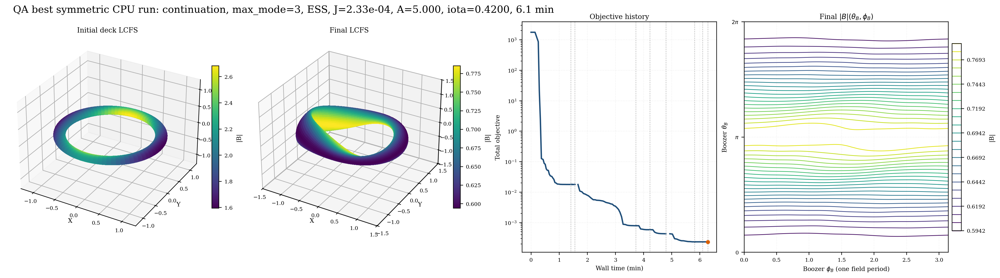
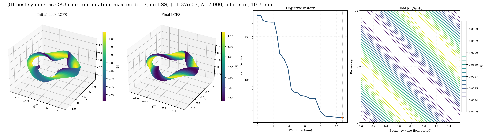
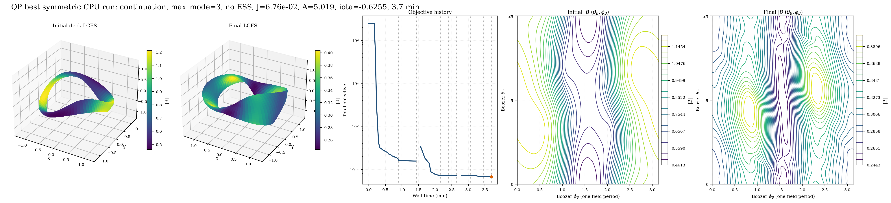
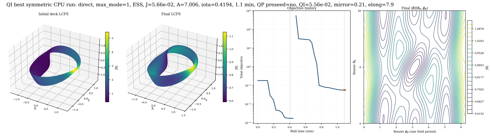
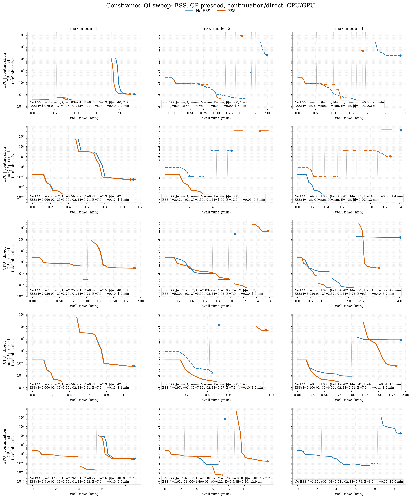

Optimization Sweep Results
==========================

This page collects the generated optimization sweep artifacts used by the
README and the main optimization guide.  The full regeneration target covers
QA, QH, QP, and QI targets; checked-in artifacts are explicitly labeled when
they are only partial snapshots:

- QA: the reference omnigenity NFP=2 QA deck, aspect ratio target 5,
  signed mean iota target 0.42, and quasi-axisymmetry.
- QH: the bundled NFP=4 warm start, aspect ratio target 5, quasi-helical
  symmetry, and a smooth ``abs(mean_iota) >= 0.41`` lower bound.
- QP: aspect ratio target 5, quasi-poloidal symmetry, and a smooth
  ``abs(mean_iota) >= 0.41`` lower bound, using the same bundled NFP=2 seed as
  the QI runs.
- QI: aspect ratio target 5 in the compact README best-row sweep, a
  differentiable smooth Boozer-space quasi-isodynamic
  residual evaluated through ``booz_xform_jax``, maximum mirror-ratio penalty,
  maximum-LCFS-elongation penalty, and a smooth ``abs(mean_iota) >= 0.41``
  lower bound.  ``LgradB`` is available as an optional commented term in the
  example script but is not active by default.
  The compact README best-row uses the bundled ``input.nfp2_QI`` omnigenity
  seed; the NFP coverage panel uses case-specific inputs, including the
  seeded ``input.minimal_seed_nfp2_target_helicity`` stress case.
  The production CLI can optionally use a same-mode QP preseed; the current
  best gated QI row starts the constrained QI refinement directly from the seed
  with ``--qi-qp-preseed off``.

Publication structure
---------------------

The split between README and docs is deliberate:

- ``README.md`` shows only the best reviewed ``LASYM = F`` QA/QH/QP/QI rows,
  using the four compact ``readme_best_optimization_*.png`` panels and the
  short reproduction command.
- This page is the intended publication home for complete sweeps.  A complete
  publication should represent every CPU/GPU, continuation/direct, ESS on/off,
  QI preseed/no-preseed, ``max_mode=1..5`` reviewed row through downloadable
  CSV/JSON summaries plus generated objective-history panels, initial/final
  state atlases, and wall-time summary tables.  Treat archived ``max_mode<=3``
  snapshots as historical until matching aspect-5 rows and figures are present.
- Additional QI case coverage, including NFP=1/2/3/4 case-gated rows that use
  case-specific aspect targets, belongs here rather than in the README best-row
  section.  Those rows are distinct from the pending common-minimal-seed QI
  regeneration matrix.

Every published full-sweep result should provide these assets in the sweep
output tree or as GitHub release assets.  Only compact, reviewed,
documentation-critical artifacts should be copied into ``docs/_static/figures``:

- ``qs_ess_summary_all.csv`` and ``qs_ess_summary_all.json`` with all row
  diagnostics, including wall time, backend/device metadata, success/crash
  status, active policy, and output provenance.
- Objective history over all stages:
  ``objective_panel_all_policies.png/.pdf``, CPU/GPU policy subsets, LASYM
  variants when present, and the legacy ``objective_panel`` aliases.
- Initial/final 3D and initial/final VMEC-angle LCFS ``|B|`` atlases:
  ``initial_final_state_atlas_*.png/.pdf``.  Legacy
  ``final_state_atlas_*.png/.pdf`` aliases are compatibility copies only.
  The full-sweep atlas renderer uses VMEC ``theta/zeta`` grids from
  ``vmecplot2_bmag_grid``; do not describe these as Boozer-space atlases.
  Boozer-space line contours are limited to the compact README and dedicated
  QI case panels generated through ``booz_xform_jax``.
- Wall-time and status table figures:
  ``summary_tables_*.png/.pdf`` plus the CSV/JSON downloads above.
- Optional full report composites:
  ``publication_panel_full.png/.pdf`` and LASYM variants.

The checked-in source tree currently contains the compact README panels, the
QI case-coverage snapshot, the minimal-seed showcase objective/state panels, the
constrained-QI status panel, and compact CSV/JSON summary files.
``qs_ess_summary_all.csv`` is a heterogeneous partial/archive snapshot: archived
CPU README QA/QH/QP rows plus one failed/partial constrained-QI status row,
older GPU/LASYM rows with incomplete target metadata, and no checked-in
``max_mode>=4`` rows.  ``qi_constrained_summary.csv`` currently contains one CPU
``max_mode=3`` continuation status row.  It does not currently contain the full
objective-history panels, initial/final state atlases, summary-table images, or
publication-panel composites.
Those assets must be regenerated locally, attached to a release, or compacted
and explicitly reviewed before claiming a complete full-sweep docs publication.

Individual Examples
-------------------

Each standalone example keeps all user controls as top-level Python variables:

.. code-block:: bash

   PYTHONPATH=. python examples/optimization/QA_optimization.py
   PYTHONPATH=. python examples/optimization/QH_optimization.py
   PYTHONPATH=. python examples/optimization/QP_optimization.py
   PYTHONPATH=. python examples/optimization/QI_optimization.py

The QP script is quasisymmetry with ``HELICITY_M = 0``.  The QI script is a
different objective: it builds Boozer spectra with ``booz_xform_jax``, improves
the smooth QI residual, and then adds mirror-ratio and LCFS-elongation
penalties.  A commented ``LgradB`` block is included for users who want that
extra regularization term.  The extra terms are imported from
``vmec_jax.optimization_workflow`` and assembled explicitly in the script, so
users can change weights or add terms such as magnetic-well depth by appending
another residual block in the same section.  QI examples use
``booz_xform_jax``, which is installed by the plain ``vmec-jax`` package and by
``python -m pip install .`` from a source checkout.

Sweep Reproduction
------------------

Run the CPU production sweep:

.. code-block:: bash

   PYTHONPATH=. JAX_PLATFORMS=cpu python examples/optimization/generate_qs_ess_sweep.py --backend-label cpu --solver-device cpu --policy continuation --problems qa,qh,qp,qi --modes 1,2,3,4,5 --ess both --qi-qp-preseed off --max-nfev 60 --continuation-nfev 15 --inner-max-iter 180 --inner-ftol 1e-9 --trial-max-iter 180 --trial-ftol 1e-9 --rerun
   PYTHONPATH=. JAX_PLATFORMS=cpu python examples/optimization/generate_qs_ess_sweep.py --backend-label cpu --solver-device cpu --policy direct --problems qa,qh,qp,qi --modes 1,2,3,4,5 --ess both --qi-qp-preseed off --max-nfev 60 --continuation-nfev 15 --inner-max-iter 180 --inner-ftol 1e-9 --trial-max-iter 180 --trial-ftol 1e-9 --rerun
   PYTHONPATH=. python examples/optimization/render_qs_ess_publication_panel.py

These commands describe the complete regeneration target, not the contents of
the checked-in snapshot.  Do not cite a full ``max_mode>=4`` CPU/GPU matrix until
the corresponding CSV/JSON rows and publication figures are present under
``docs/_static/figures``.

The compact README renderer currently filters QI rows against the same
aspect-5 target as QA/QH/QP.  The standalone ``QI_optimization.py``
case-coverage lanes may still use case-specific aspect targets when mirror
ratio or far-seed basin capture is the experiment; those rows are documented
separately and are not mixed into the README best-row table.

The constrained QI study has one extra axis: whether the QI solve starts from a
same-mode QP preseed.  The production CLI default is ``--qi-qp-preseed off``;
regenerate the focused preseed/no-preseed matrix with:

.. code-block:: bash

   PYTHONPATH=. JAX_PLATFORMS=cpu python examples/optimization/generate_qs_ess_sweep.py --backend-label cpu --solver-device cpu --policy continuation --problems qi --modes 1,2,3,4,5 --ess both --qi-qp-preseed both --max-nfev 60 --continuation-nfev 15 --inner-max-iter 180 --inner-ftol 1e-9 --trial-max-iter 180 --trial-ftol 1e-9 --rerun
   PYTHONPATH=. JAX_PLATFORMS=cpu python examples/optimization/generate_qs_ess_sweep.py --backend-label cpu --solver-device cpu --policy direct --problems qi --modes 1,2,3,4,5 --ess both --qi-qp-preseed both --max-nfev 60 --continuation-nfev 15 --inner-max-iter 180 --inner-ftol 1e-9 --trial-max-iter 180 --trial-ftol 1e-9 --rerun
   PYTHONPATH=. python examples/optimization/render_qi_constrained_sweep.py

The checked-in constrained-QI snapshot is not that full matrix; it currently
contains only a single CPU continuation ``max_mode=3`` status row without a
same-mode QP preseed.

Seed-robust QI is a larger validation matrix than the tracked constrained-QI
snapshot and the checked-in NFP coverage panel.  The constrained-QI matrix
artifacts use the bundled NFP=2 QI seed and optional same-mode QP preseed; the
separate README/docs NFP 1-4 panel uses case-gated source decks and
case-specific targets.  Before documenting QI as robust to arbitrary starts,
run the constrained objective from QI, QP, QH, QA, and a simple
non-omnigenous boundary seed, then inspect both numerical gates and Boozer
``|B|`` contour plots.  Until those rows are generated and curated, treat the
full multi-seed matrix as deferred validation rather than a required
reproduction command.

Use the bounded seed preflight to choose and document starting points before
launching that matrix:

.. code-block:: bash

   PYTHONPATH=. python examples/optimization/audit_qi_seed_suitability.py --quick --csv results/qi_seed_audit.csv
   PYTHONPATH=. python examples/optimization/audit_qi_seed_suitability.py --quick --smooth-qi-max 5e-3 --legacy-qi-max 2e-3 --csv results/qi_seed3127_audit.csv

The preflight ranks seeds by smooth-plus-legacy QI score and leaves mirror,
elongation, aspect, and iota gates as explicit columns.  The second command
shows the relaxed smooth-gate convention used by the far-seed
``qi_stel_seed_3127`` optimization case.  This is deliberate:
for QI robustness work, a seed that is already QI-like but violates mirror or
aspect slightly is usually more informative than a non-QI seed that satisfies
the engineering constraints.

To review the tiny QI-prefine probes before executing them:

.. code-block:: bash

   PYTHONPATH=. python examples/optimization/audit_qi_seed_suitability.py --quick --prefine-probes plan --prefine-manifest results/qi_seed_audit/prefine_manifest.json --prefine-output-dir results/qi_seed_audit/prefine_probes

The dry-run manifest is the intended bridge between seed audit and full
seed-robust QI sweeps.  It is bounded by design and should be inspected before
switching to ``--prefine-probes run``.

The docs NFP=4 QI coverage lane starts from ``examples/data/input.minimal_seed_nfp4``
with only ``RBC(0,0)``, ``RBC(0,1)``, and ``ZBS(0,1)`` in the source input,
then applies a same-NFP finite-beta QI reference-family preconditioner before
bounded local cleanup.  Use ``VMEC_JAX_QI_RUN_CASE=nfp4_qh_warm_to_qi`` and
``VMEC_JAX_QI_RUN_CASE=nfp4_qi_finite_beta`` only as stress fixtures unless
their independent ``diagnostics.json`` records a reviewed smooth/legacy QI and
mirror-ratio gate pass.

Run the GPU production sweep on a machine with a working JAX GPU install:

.. code-block:: bash

   PYTHONPATH=. JAX_PLATFORM_NAME=gpu python examples/optimization/generate_qs_ess_sweep.py --backend-label gpu --solver-device gpu --policy continuation --problems qa,qh,qp,qi --modes 1,2,3,4,5 --ess both --qi-qp-preseed off --max-nfev 60 --continuation-nfev 15 --inner-max-iter 180 --inner-ftol 1e-9 --trial-max-iter 180 --trial-ftol 1e-9 --rerun
   PYTHONPATH=. JAX_PLATFORM_NAME=gpu python examples/optimization/generate_qs_ess_sweep.py --backend-label gpu --solver-device gpu --policy direct --problems qa,qh,qp,qi --modes 1,2,3,4,5 --ess both --qi-qp-preseed off --max-nfev 60 --continuation-nfev 15 --inner-max-iter 180 --inner-ftol 1e-9 --trial-max-iter 180 --trial-ftol 1e-9 --rerun
   PYTHONPATH=. python examples/optimization/render_qs_ess_publication_panel.py

Render the compact README panels from the best stellarator-symmetric rows:

.. code-block:: bash

   PYTHONPATH=. python examples/optimization/render_readme_best_optimizations.py

The default per-case timeout is 1800 seconds.  The current README science
configs use NFP=4 for QH, aspect target 5 for QA/QH/QP/QI, signed iota
0.42 for QA, and high-priority ``abs(mean_iota) >= 0.41`` constraints for
QH/QP/QI.
They use ``inner_max_iter = trial_max_iter = 120`` and
``ftol = trial_ftol = 1e-9``; GPU production sweeps cap those values at 180
if a future problem config requests a larger replay budget.  Add
``--diagnostic-budgets`` only for bounded quick-look GPU diagnostics, and use
``--case-timeout-s 0`` only for unbounded local diagnostics.
On timeout, the sweep driver terminates the worker process group as well as
direct children, so stale descendant solver or GPU processes should not survive
after a recorded timeout row.
After every completed continuation/QI stage, the runner writes a compact
``stage_checkpoint.json`` beside the case output.  Timeout and worker-failure
rows are then annotated from the latest checkpoint when possible, preserving the
last accepted objective, aspect, iota, QI, mirror, elongation, wall time, and
stage label in ``case_result.json`` and the CSV summaries.  Treat these
checkpoint-derived rows as partial diagnostics; publication and README promotion
still require the independent physics gates and reviewed Boozer contour plots.

Run the non-stellarator-symmetric sweep by adding
``--stellarator-asymmetric``.  This sets ``LASYM = T`` in memory, includes
``RBS`` and ``ZBC`` boundary degrees of freedom, seeds initially-zero
asymmetric modes with ``1e-7``, and writes separate outputs under the
``asymmetric`` backend subdirectory.

.. code-block:: bash

   PYTHONPATH=. JAX_PLATFORMS=cpu python examples/optimization/generate_qs_ess_sweep.py --backend-label cpu --solver-device cpu --policy continuation --problems qa,qh,qp,qi --modes 1,2,3,4,5 --ess both --qi-qp-preseed off --stellarator-asymmetric --max-nfev 60 --continuation-nfev 15 --inner-max-iter 180 --inner-ftol 1e-9 --trial-max-iter 180 --trial-ftol 1e-9 --rerun
   PYTHONPATH=. JAX_PLATFORMS=cpu python examples/optimization/generate_qs_ess_sweep.py --backend-label cpu --solver-device cpu --policy direct --problems qa,qh,qp,qi --modes 1,2,3,4,5 --ess both --qi-qp-preseed off --stellarator-asymmetric --max-nfev 60 --continuation-nfev 15 --inner-max-iter 180 --inner-ftol 1e-9 --trial-max-iter 180 --trial-ftol 1e-9 --rerun
   PYTHONPATH=. JAX_PLATFORM_NAME=gpu python examples/optimization/generate_qs_ess_sweep.py --backend-label gpu --solver-device gpu --policy continuation --problems qa,qh,qp,qi --modes 1,2,3,4,5 --ess both --qi-qp-preseed off --stellarator-asymmetric --max-nfev 60 --continuation-nfev 15 --inner-max-iter 180 --inner-ftol 1e-9 --trial-max-iter 180 --trial-ftol 1e-9 --rerun
   PYTHONPATH=. JAX_PLATFORM_NAME=gpu python examples/optimization/generate_qs_ess_sweep.py --backend-label gpu --solver-device gpu --policy direct --problems qa,qh,qp,qi --modes 1,2,3,4,5 --ess both --qi-qp-preseed off --stellarator-asymmetric --max-nfev 60 --continuation-nfev 15 --inner-max-iter 180 --inner-ftol 1e-9 --trial-max-iter 180 --trial-ftol 1e-9 --rerun
   PYTHONPATH=. python examples/optimization/render_qs_ess_publication_panel.py

For NVIDIA-only JAX installations, ``JAX_PLATFORMS=cuda`` is also valid.  Do
not use ``JAX_PLATFORMS=gpu``: some JAX versions interpret that as both CUDA
and ROCm and fail if ROCm is not installed.

README Best Rows
----------------

The README regeneration target is one best ``LASYM = F`` result per target.
Current checked-in README panels are archived aspect-6/mode-3 rows until the
aspect-5, ``max_mode<=5`` CPU/GPU matrix is promoted.  New QA/QH/QP/QI rows
must be selected from the reviewed matrix and filtered against the common
aspect-5 target.  The selected QI row should be chosen with the legacy branch
diagnostic, mirror-ratio, elongation, iota, and aspect-ratio gates used as
promotion evidence rather than as exact equality constraints; small numerical
slack is expected when independent Boozer diagnostics are recomputed after the
optimization.  These panels include the raw/deck initial LCFS for the selected
optimization row, final LCFS, per-stage objective history, and initial/final
outer-surface ``|B|`` line contours in Boozer coordinates evaluated with
``booz_xform_jax``.
The source table is also available as
:download:`readme_best_optimizations.csv <_static/figures/readme_best_optimizations.csv>`.

QI_optimization Input Coverage
------------------------------

The dedicated QI docs renderer is a lightweight snapshot renderer for
case-gated QI lanes; it does not rerun optimization jobs.  The current rows are
the NFP=1 QI seed deck, the NFP=2 target-helicity seed deck, the NFP=3
seed-3127 deck, and the NFP=4 minimal-seed lane.  This figure is separate from
the deferred
common-minimal-seed stress matrix and should not be read as evidence that one
common simple seed optimizes successfully for every NFP.  The renderer reads
the existing ``QI_optimization.py`` outputs, records the final smooth QI
metric, legacy QI metric, mirror ratio, elongation, iota, aspect, and CPU wall
time, and draws source-initial and final Boozer ``|B|`` line contours only
after the initial WOUT boundary matches the paired input deck.  These are
archived mixed-target case checks, not current aspect-5 README best-row
promotions: NFP=1 uses target aspect 10, the NFP=2 target-helicity lane uses
target aspect 6, the seed-3127 NFP=3 lane uses target aspect 4, and the NFP=4
row uses the minimal seed plus a same-NFP finite-beta QI reference-family
proposal.  Regenerate all rows with the current uniform aspect-5 policy before
using this figure as current README promotion evidence.
Finite-beta NFP=4 remains a separate stress fixture.

The NFP=3 seed-3127 row uses
``examples/data/wout_QI_stel_seed_3127.nc`` as the raw initial artifact.  The
renderer validates it against ``examples/data/input.QI_stel_seed_3127`` under
the direct VMEC input convention or VMEC's equivalent canonical phase
convention, and fails if neither boundary map matches; there is no
known-artifact exception bypass.
For lanes with a reference-family preconditioner, the plotted initial panel is
still the raw/source input WOUT and the plotted final panel is the accepted
audited WOUT; preconditioner scan points are provenance for basin capture, not
the final acceptance diagnostic.

To refresh the exact rows used by this panel, run the source optimizations with
the target-aspect and output-dir values below before rendering.  The explicit
overrides reproduce the archived mixed-target figure rows; omit them only when
regenerating the current uniform aspect-5 policy.  The NFP=3 case can be
selected as ``nfp3_qi``; that is a convenience alias for the
``input.QI_stel_seed_3127`` far-seed lane.  If the NFP=3 raw artifact is
replaced during a refresh, the replacement must pass the renderer's boundary
match before the panel is published.

.. code-block:: bash

   PYTHONPATH=. JAX_PLATFORMS=cpu VMEC_JAX_QI_RUN_CASE=nfp1_qi \
     VMEC_JAX_QI_TARGET_ASPECT=10 \
     VMEC_JAX_QI_OUTPUT_DIR=results/qi_opt/ess/nfp1_qi_direct_office_20260519 \
     python examples/optimization/QI_optimization.py
   PYTHONPATH=. JAX_PLATFORMS=cpu \
     VMEC_JAX_QI_INPUT=examples/data/input.minimal_seed_nfp2_target_helicity \
     VMEC_JAX_QI_POLICY_CASE=nfp2_qi \
     VMEC_JAX_QI_LABEL=nfp2_target_helicity \
     VMEC_JAX_QI_TARGET_ASPECT=6 \
     VMEC_JAX_QI_OUTPUT_DIR=results/qi_opt/ess/minimal_nfp2_to_qi_reference \
     python examples/optimization/QI_optimization.py
   PYTHONPATH=. JAX_PLATFORMS=cpu VMEC_JAX_QI_RUN_CASE=nfp3_qi \
     VMEC_JAX_QI_TARGET_ASPECT=4 \
     VMEC_JAX_QI_OUTPUT_DIR=results/qi_opt/ess/qi_stel_seed_3127_mirror_calibrated_20260516 \
     python examples/optimization/QI_optimization.py
   PYTHONPATH=. JAX_PLATFORMS=cpu VMEC_JAX_QI_RUN_CASE=nfp4_qi \
     VMEC_JAX_QI_OUTPUT_DIR=results/qi_opt/ess/minimal_nfp4_to_qi_finite_beta_reference \
     python examples/optimization/QI_optimization.py
   PYTHONPATH=. python examples/optimization/render_qi_readme_cases.py

The optimization commands above create candidate result directories under
``results/``.  After reviewing diagnostics and plots, replace the corresponding
``docs/_static/qi_readme_cases/<case>/`` bundle before rendering; the renderer
does not read ignored local result directories.

.. list-table::
   :header-rows: 1
   :widths: 20 25 10 10 10 9 8 8 8 8 10

   * - Input
     - Output/provenance
     - Final J
     - Smooth QI
     - Legacy QI
     - Mirror
     - Elong.
     - Aspect
     - Iota
     - CPU min
     - Status
   * - ``examples/data/input.nfp1_QI``
     - ``docs/_static/qi_readme_cases/nfp1``
     - ``1.56e-2``
     - ``1.48e-3``
     - ``7.75e-4``
     - ``0.242/0.30``
     - ``6.24/8.2``
     - ``9.999/10.0``
     - ``0.5369``
     - ``15.8``
     - ``case-gated``
   * - ``examples/data/input.minimal_seed_nfp2_target_helicity``
     - ``docs/_static/qi_readme_cases/nfp2_target_helicity``
     - ``1.61e-2``
     - ``1.52e-3``
     - ``5.25e-4``
     - ``0.240/0.30``
     - ``6.51/8.2``
     - ``6.006/6.0``
     - ``-0.5994``
     - ``28.7``
     - ``case-gated``
   * - ``examples/data/input.QI_stel_seed_3127``
     - ``docs/_static/qi_readme_cases/nfp3_seed3127``
     - ``9.33e-2``
     - ``4.11e-3``
     - ``1.01e-3``
     - ``0.304/0.35``
     - ``4.00/8.0``
     - ``3.541/4.0``
     - ``-1.0401``
     - ``4.6``
     - ``case-gated``
   * - ``examples/data/input.minimal_seed_nfp4``
     - ``docs/_static/qi_readme_cases/nfp4_minimal``
     - ``2.52e-2``
     - ``2.56e-3``
     - ``2.54e-4``
     - ``0.287/0.35``
     - ``4.14/8.2``
     - ``6.011/6.0``
     - ``-1.2930``
     - ``0.4``
     - ``case-gated``

.. image:: _static/figures/readme_qi_optimization_cases.png
   :width: 100%
   :align: center
   :alt: QI optimization coverage for reviewed NFP=1, 2, 3, and 4 inputs

Source table snapshot:
:download:`readme_qi_optimization_cases.csv <_static/figures/readme_qi_optimization_cases.csv>`.
In that generated CSV, ``validation_status=case-gated`` records
case-specific QI gate status from the renderer and should not be read as
aspect-5 README best-row promotion evidence or global seed-robustness
evidence; the NFP=4 row is case-gated by the minimal-seed plus same-NFP
reference-family path.  The NFP=3 raw initial artifact is now checked by the
renderer instead of accepted through a case-specific exception.

Regenerate these lightweight artifacts with:

.. code-block:: bash

   PYTHONPATH=. python examples/optimization/render_qi_readme_cases.py

This renderer intentionally consumes the curated
``docs/_static/qi_readme_cases`` bundle instead of ignored local
``results/`` directories.  Large WOUT files in that bundle are ignored by git
and must be fetched as release assets or regenerated before rerendering from a
clean clone.  Raw per-stage ``history.json`` files are kept in git for
auditing non-monotone or stalled optimizer stages; the public panel plots
normalized best-so-far traces for readability.
The bundled preconditioner summaries are also scrubbed to scalar scan metrics
and selected-``lambda`` flags so the tracked release artifacts do not point at
local scratch directories from the run host.

The staged objective panel concatenates every recorded history file used by
the selected case-specific result.  It plots the best-so-far value in each
stage, normalized to that stage's first objective, with dashed separators marking
objective-definition or weight changes.  For the seed-3127 lane, the inset is
a boundary-reference interpolation scan, not an optimizer trajectory.

Minimal-Seed Showcase Snapshot
------------------------------

The minimal-seed showcase is a bounded stress/reproduction lane for the common
three-coefficient input family, not a README best-row table.  The checked-in
assets are:

- :download:`minimal_seed_showcase_summary.csv <_static/figures/minimal_seed_showcase_summary.csv>`
- ``minimal_seed_showcase_objective_panel.png``
- ``minimal_seed_showcase_state_panel.png``

The summary CSV is provenance-aware: ``initial_input`` and ``initial_wout``
refer to the raw user-facing minimal seed shown in the state panel,
``stage_seed_kind`` and ``stage_seed_input`` identify any target-helicity or
reference-family preseed used by the optimizer, and ``final_wout`` identifies
the promoted final output.  This prevents a continuation or staged-QI
``input.initial`` file from being silently displayed as the raw seed.

Those checked-in assets currently document the minimal-seed showcase snapshot as
follows:

.. list-table::
   :header-rows: 1
   :widths: 16 12 12 12 14 34

   * - Case
     - Problem
     - NFP
     - Status
     - Completion
     - Release interpretation
   * - ``qi_circular_nfp1``
     - QI
     - 1
     - ``partial``
     - timeout
     - Recorded as a bounded stress row only.
   * - ``qa_nfp2``
     - QA
     - 2
     - ``partial``
     - crashed checkpoint
     - Not promoted in the refreshed static summary.
   * - ``qh_nfp4``
     - QH
     - 4
     - ``ok``
     - success
     - Current common-minimal completion gate pass.
   * - ``qp_nfp2``
     - QP
     - 2
     - ``ok``
     - success
     - Current completion gate pass, but still a refinement target.

Current non-stale common-minimal QI outputs for ``minimal_nfp1_qi``,
``minimal_nfp2_qi``, ``minimal_nfp3_qi``, and ``minimal_nfp4_qi`` are not
present in the checked-in summary.  Do not infer a successful QI
minimal-seed reproduction from the older ``qi_circular_nfp1`` partial row or
from the separate QI NFP coverage panel above.  The NFP coverage panel uses
reviewed case-gated QI inputs and, for NFP=4, a minimal seed plus a same-NFP
finite-beta QI reference-family basin-capture step; it is not the same artifact
as the common-minimal showcase.

Regenerate the current aspect-5 common-minimal showcase with:

.. code-block:: bash

   PYTHONPATH=. JAX_PLATFORMS=cuda python3 examples/optimization/generate_minimal_seed_showcase.py \
     --cases qa_nfp2,qa_nfp3,qh_nfp3,qh_nfp4,qp_nfp2,qp_nfp3,qp_nfp4,qi_nfp1,qi_nfp2,qi_nfp3,qi_nfp4 \
     --backend-label gpu --solver-device gpu --worker-jax-platforms cuda \
     --policy continuation --max-mode 5 --ess on \
     --max-nfev 60 --continuation-nfev 20 \
     --inner-max-iter 550 --inner-ftol 1e-10 \
     --trial-max-iter 550 --trial-ftol 1e-10 \
     --ess-alpha 1.2 --case-timeout-s 7200 --rerun
   PYTHONPATH=. python examples/optimization/render_minimal_seed_showcase.py --publication-matrix

For bounded smoke rendering of a partial run, use ``--cases`` and
``--skip-missing`` so the renderer validates the selected case but does not
warn about the rest of the production matrix:

.. code-block:: bash

   PYTHONPATH=. python examples/optimization/render_minimal_seed_showcase.py \
     --output-root /path/to/minimal_seed_showcase \
     --figure-dir /path/to/figures \
     --cases qi_nfp1 --skip-missing

Use ``cpu`` for the three CUDA/GPU flags for a slower local CPU-only
reproduction.  Keep ``--rerun`` for release reproduction.  Without it, successful
``showcase_case.json`` rows may be reused from an older local run; the renderer
skips known-stale rows by default and ``--include-stale`` should be used only
for debugging.  The renderer writes both a compact objective-history panel and,
when the required WOUT artifacts are available, a state panel with actual
first optimized LCFS, final LCFS, initial Boozer ``|B|`` line contours, final
Boozer ``|B|`` line contours, and the full best-so-far objective history.
Rows without non-stale initial/final WOUT provenance are omitted from that
state panel instead of being silently replaced by stale artifacts.

.. image:: _static/figures/minimal_seed_showcase_state_panel.png
   :width: 100%
   :align: center
   :alt: Common minimal-seed initial/final state and Boozer contour stress-test panel

Objective Histories
-------------------

When regenerated, the all-policy panel contains every available backend/policy
row.  Solid curves met the optimizer success criterion; dashed curves are
stopped, failed, or budgeted lanes.  The summary tables distinguish
``max_nfev`` stops from bounded per-case timeouts and GPU-memory failures.  Curves
are split by objective stage and plotted as best-so-far values within that
stage, so QP preseed and full constrained QI refinement are not treated as one
continuous scalar objective.  Vertical dotted lines mark continuation stage
boundaries.

Constrained QI Matrix
---------------------

The constrained QI renderer can compare CPU and available GPU rows for
``max_mode = 1..5``, ESS on/off, continuation/direct, and QP-preseed on/off
using the bundled NFP=2 ``input.nfp2_QI`` seed.  The checked-in constrained
snapshot is partial: it contains one CPU continuation ``max_mode=3`` status row
and no GPU, direct, or QP-preseed constrained-QI rows.  Rerun
the commands above to populate the full CPU/GPU/direct/asymmetric matrix under
the current objective policy.  For each requested ``max_mode``, the input
boundary is projected onto ``max(abs(m), abs(n)) <= max_mode`` before the stage
is built, so the ``max_mode=1`` rows zero the mode-2 coefficients present in the
warm start.
The QI objective is intentionally not ranked by scalar objective alone: rows
are also evaluated by the legacy branch-squash/stretch/shuffle diagnostic,
raw smooth QI residual, maximum mirror ratio, maximum LCFS elongation,
``abs(mean_iota) >= 0.41``, and the active aspect target.  The default smooth QI
objective includes ``shuffle_profile_weight = 1.0`` so the optimizer follows
the same ranking as the legacy diagnostic on the seed and reference
omnigenity cases.  Rows that stop at ``max_nfev`` but have valid VMEC solves
and satisfy the physics gates are kept as valid stopped rows.

The checked-in target-6 constrained-QI artifact is an archived partial status
snapshot, not the promoted QI result.  At the moment it contains the bounded
partial continuation row annotated from ``stage_checkpoint.json`` before full
QI diagnostics were available.  It is a status artifact and must not be
promoted as current aspect-5 evidence.  The README best QI row should be
replaced only after the full constrained CPU/GPU matrix is rerun and passes the
same QI, mirror, elongation, iota, and aspect gates.

Downloadable constrained-QI summaries:

- :download:`qi_constrained_summary.csv <_static/figures/qi_constrained_summary.csv>`
- :download:`qi_constrained_summary.json <_static/figures/qi_constrained_summary.json>`
- :download:`qi_constrained_best.json <_static/figures/qi_constrained_best.json>`

The checked-in archived README QI row is the CPU ``qi_default`` standalone
``QI_optimization.py`` lane, ``max_mode=3``, ESS row without a same-mode QP
preseed: legacy-ranked QI diagnostic ``4.31e-4``, smooth QI diagnostic
``1.32e-3``, maximum mirror ratio ``0.272`` for a target ``0.30``, maximum
elongation ``6.90`` for a target ``8.2``, aspect ratio ``6.002``, mean iota
``-0.5690``, and total wall time ``10.9 min``.  It is not current aspect-5
promotion evidence.  Best-row selection uses
``vmec_jax.qi_promotion_score``: raw-fallback legacy diagnostics are rejected,
rows above the loose ``2e-2`` QI promotion ceiling cannot win solely by having
good mirror/elongation, and engineering-clean rows are preferred over lower-QI
rows only when they remain QI-like.
The constrained matrix is a bundled-QI-seeded lane, not evidence that the
optimizer is seed-robust across unrelated QA/QH/QP/simple starts.

Non-stellarator-symmetric LASYM runs use the same script with
``--stellarator-asymmetric``.  The current LASYM artifacts are intentionally
published as partial bounded-time lanes.  Timeout and OOM rows are kept because
they document the current cost envelope of the asymmetric exact/replay path.
The checked-in summary snapshot has 23 CPU LASYM rows and 36 GPU LASYM rows.

The objective-history figures are generated artifacts and are not part of the
current checked-in snapshot.  Regenerate them with
``PYTHONPATH=. python examples/optimization/render_qs_ess_publication_panel.py``
after producing or fetching the sweep results.  For a complete docs
publication, keep bulky reviewed outputs in the local result tree or attach
them to a GitHub release; promote only compact documentation-critical assets to
``docs/_static/figures`` and keep the CSV/JSON summaries in sync.  The renderer
writes:

- ``objective_panel_all_policies.png/.pdf``
- ``objective_panel_cpu_policies.png/.pdf``
- ``objective_panel_gpu_policies.png/.pdf``
- ``objective_panel_asymmetric_all_policies.png/.pdf``
- legacy aliases ``objective_panel.png/.pdf``

Initial/Final State Atlases
---------------------------

The initial/final state atlases show the initial and final LCFS plus line
contours of ``|B|`` on the LCFS in VMEC ``theta/zeta`` coordinates.
Each 3-D panel has its own colorbar because the aspect-ratio constraint changes
the absolute ``|B|`` range.  These are not Boozer-coordinate atlases; the full
sweep renderer gets the contour grid from ``vmecplot2_bmag_grid``.

Partial LASYM atlases are rendered separately.  Missing or failed lanes are
shown as placeholders, while successful lanes include one colorbar per 3-D
surface and one colorbar per LCFS ``|B|`` contour panel.

When generated, atlas filenames include:

- ``initial_final_state_atlas_continuation.png/.pdf``
- ``initial_final_state_atlas_direct.png/.pdf``
- ``initial_final_state_atlas_cpu_continuation.png/.pdf``
- ``initial_final_state_atlas_cpu_direct.png/.pdf``
- ``initial_final_state_atlas_gpu_continuation.png/.pdf``
- ``initial_final_state_atlas_gpu_direct.png/.pdf``
- ``initial_final_state_atlas_asymmetric_*``
- legacy alias ``geometry_atlas.png/.pdf``

No ``initial_final_state_atlas_*.png/.pdf`` files are currently checked in.

Summary Tables
--------------

The summary-table image is intended for reports and presentations and must
include wall-time/status fields for full-sweep publication.  The CSV and JSON
are better for analysis scripts and remain the source of truth.

Downloadable summaries:

- :download:`summary_all.csv <_static/figures/qs_ess_summary_all.csv>`
- :download:`summary_all.json <_static/figures/qs_ess_summary_all.json>`

Generated summary-table figures include ``summary_tables_all_policies``,
``summary_tables_cpu_policies``, ``summary_tables_gpu_policies``,
``summary_tables_asymmetric_all_policies``, and legacy alias
``summary_table``.

Publication Panel
-----------------

The full panel combines objective histories, initial/final state atlases, and summary
tables.  It is large by design and should be used for review, not as the only
README figure.

Generated full-panel filenames include ``publication_panel_full.png/.pdf``,
legacy alias ``publication_panel.png/.pdf``, and
``publication_panel_asymmetric_full.png/.pdf`` for the partial LASYM lanes.

Finite-beta Stage-One Examples
------------------------------

The finite-beta examples mirror the VMEC-only stage-one reference workflow from
the separate ``single_stage_optimization_finite_beta`` scripts without SIMSOPT
or coils:

.. code-block:: bash

   PYTHONPATH=. python examples/optimization/qa_optimization_finite_beta.py
   PYTHONPATH=. python examples/optimization/qh_optimization_finite_beta.py
   PYTHONPATH=. python examples/optimization/qi_optimization_finite_beta.py

The input decks are bundled as:

- ``examples/data/input.nfp2_QA_finite_beta``
- ``examples/data/input.nfp4_QH_finite_beta``
- ``examples/data/input.nfp4_QI_finite_beta``

Each script builds the optimization problem explicitly: load the VMEC input,
construct ``FiniteBetaTargets``, define the global residuals for aspect ratio,
iota lower/mean/upper bounds, volume-averaged field proxy, and total beta, then
append the field-quality residual.  QA/QH use quasisymmetry residuals and QI
uses the smooth Boozer-space QI residual.  The small shared helper only keeps
the stage bookkeeping, structured stage/final summaries, and artifact writing
consistent.  After the direct ``FixedBoundaryExactOptimizer`` calls complete,
``stage1_result.stage_summaries`` and ``stage1_result.final_summary`` expose
JSON-friendly diagnostics such as objective, aspect, iota, function counts,
termination status, method, device, and wall time.  The scripts save
``input.initial``, ``input.final``, ``wout_initial.nc``, ``wout_final.nc``, and
``history.json`` for each run.

These examples deliberately remain one layer lower than
``least_squares_solve``.  The ordinary QA/QH/QP/QI scripts are the recommended
objective-tuple API examples; finite-beta stage one keeps direct
``FixedBoundaryExactOptimizer`` calls visible so users can see the custom
finite-pressure/current residual closures, stage-local profile data, and
optional bootstrap-current residual wiring.

All finite-beta controls are plain variables at the top of the scripts.  For
QI, ``QI_MBOZ``, ``QI_NBOZ``, ``QI_NPHI``, ``QI_NALPHA``, and
``QI_N_BOUNCE`` control the Boozer/QI residual grid. ``MAX_MIRROR_RATIO`` and
``MAX_ELONGATION`` control the two engineering penalties.  The default QI grid
is small enough for first-run diagnostics; increase it for final
research-quality QI runs. ``QI_OPTIONS.phimin`` controls the start of the
one-field-period well interval; keep ``0.0`` for the bundled NFP=2 seed, or set
``np.pi / nfp`` when auditing a reference field whose first well starts there.

Redl bootstrap-current mismatch is now available as ``vj.RedlBootstrapMismatch``.
The implementation ports the SIMSOPT/Redl et al. bootstrap algebra and uses a
differentiable VMEC-state geometry approximation with fixed trapped-fraction
quadrature on nearest full-mesh surfaces.  Mercier ``DMerc`` is also available
as ``vj.DMerc``, a smooth lower-bound objective backed by the differentiable
``mercier_terms_from_state`` path for stellarator-symmetric and LASYM
equilibria.  VMEC/JXBFORCE profile accessors ``vj.JDotB``, ``vj.BDotB`` and
``vj.BDotGradV`` are also available for finite-beta targeting or
regularization, together with state-derived ``vj.ToroidalCurrent`` and
``vj.ToroidalCurrentGradient`` current-profile objectives.  Advanced vector
targeting is available through ``vj.BVector`` for Cartesian magnetic field on a
single radial surface and ``vj.JVector`` for flattened VMEC-coordinate
``(J^theta, J^zeta)`` current-density components.  The JAX
``mercier_gpp_from_realspace_geometry``,
``mercier_surface_integrals_from_realspace``, and
``mercier_terms_from_profile_integrals`` helpers now cover the VMEC-style
geometry channel, surface reductions, and algebraic
``DMerc = DShear + DCurr + DWell + DGeod`` step once real-space field channels
are available.  ``mercier_realspace_geometry_channels_from_state``,
``mercier_bsubs_half_mesh_from_geometry``,
``mercier_zeta_half_mesh_from_realspace_geometry``,
``mercier_bsubs_full_mesh_from_half_mesh``,
``mercier_bsubs_derivatives_lasym_false``, and
``mercier_bdotk_from_covariant_derivatives`` also port state synthesis of the
even/odd geometry channels, half-mesh toroidal geometry, radial covariant field
assembly, jxbforce full-mesh averaging, stellarator-symmetric derivative
reconstruction, LASYM derivative reconstruction, ``itheta/izeta/bdotk``,
``jdotb/bdotb/bdotgradv`` profile blocks, and ``torcur/ip`` current-profile
blocks.  The ``RUN_FULL=1`` finite-beta test suite compares this state-level
path against the existing VMEC/wout Mercier/JXBFORCE implementation on the
bundled finite-beta QI input.  The next finite-beta validation lane is comparing
the new Redl residual against SIMSOPT's Boozer-geometry and VMEC-geometry Redl
paths on converged finite-beta equilibria.
