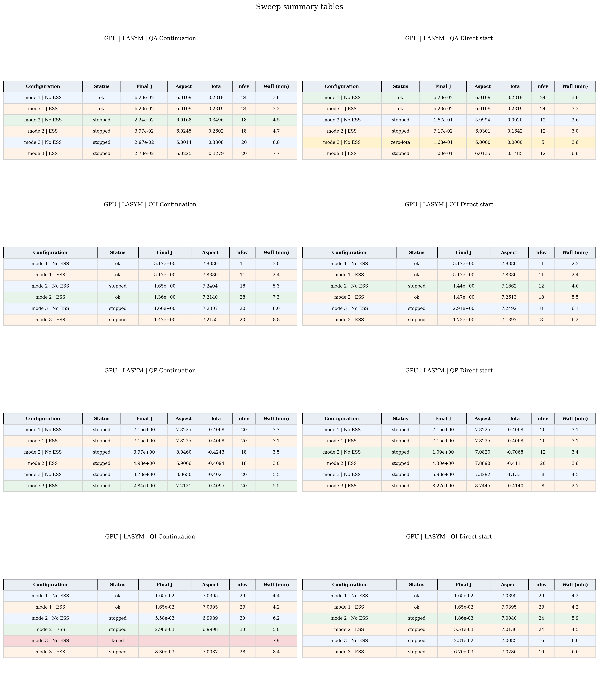

Optimization Sweep Results
==========================

This page collects the generated optimization sweep artifacts used by the
README and the main optimization guide.  The current sweep covers QA, QH, QP,
and QI targets:

- QA: aspect ratio, mean iota, and quasi-axisymmetry.
- QH: aspect ratio and quasi-helical symmetry.
- QP: aspect ratio, quasi-poloidal symmetry, and a smooth
  ``abs(mean_iota) >= 0.40`` lower bound.
- QI: aspect ratio and a differentiable smooth Boozer-space
  quasi-isodynamic residual evaluated through ``booz_xform_jax``.  The sweep
  first runs a same-mode QP preseed and then applies the QI residual, with the
  same smooth ``abs(mean_iota) >= 0.40`` lower bound retained through the QI
  stage so the final state does not remain trapped in the QH warm-start basin.

Individual Examples
-------------------

Each standalone example keeps all user controls as top-level Python variables:

.. code-block:: bash

   PYTHONPATH=. python examples/optimization/qa_fixed_resolution_jax_ess.py
   PYTHONPATH=. python examples/optimization/qh_fixed_resolution_jax.py
   PYTHONPATH=. python examples/optimization/qp_fixed_resolution_jax_ess.py
   PYTHONPATH=. python examples/optimization/qi_fixed_resolution_jax_ess.py

The QP script is quasisymmetry with ``HELICITY_M = 0``.  The QI script is a
different objective: it builds Boozer spectra with ``booz_xform_jax``, first
uses QP as a preseed, and then penalizes field-line variation in smooth
magnetic-well widths and normalized well profiles.  Install the optional
dependency set with ``python -m pip install ".[qi]"`` before running QI cases
from a source checkout.

Sweep Reproduction
------------------

Run the CPU production sweep:

.. code-block:: bash

   PYTHONPATH=. JAX_PLATFORMS=cpu python examples/optimization/generate_qs_ess_sweep.py --backend-label cpu --solver-device cpu --policy continuation --problems qa,qh,qp,qi --modes 1,2,3,4 --ess both
   PYTHONPATH=. JAX_PLATFORMS=cpu python examples/optimization/generate_qs_ess_sweep.py --backend-label cpu --solver-device cpu --policy direct --problems qa,qh,qp,qi --modes 1,2,3,4 --ess both
   PYTHONPATH=. python examples/optimization/render_qs_ess_publication_panel.py

Run the GPU production sweep on a machine with a working JAX GPU install:

.. code-block:: bash

   PYTHONPATH=. JAX_PLATFORM_NAME=gpu python examples/optimization/generate_qs_ess_sweep.py --backend-label gpu --solver-device gpu --policy continuation --problems qa,qh,qp,qi --modes 1,2,3,4 --ess both
   PYTHONPATH=. JAX_PLATFORM_NAME=gpu python examples/optimization/generate_qs_ess_sweep.py --backend-label gpu --solver-device gpu --policy direct --problems qa,qh,qp,qi --modes 1,2,3,4 --ess both
   PYTHONPATH=. python examples/optimization/render_qs_ess_publication_panel.py

The default per-case timeout is 1200 seconds.  GPU uses exact/replay callbacks
with calibrated optimizer budgets (``inner_max_iter = trial_max_iter = 180``
and ``ftol = trial_ftol = 1e-9`` for deck-controlled QA/QH cases) so production
sweeps have enough room to converge high-mode/LASYM cases while still bounding
runaway rows.  Add ``--diagnostic-budgets`` only for bounded quick-look GPU
diagnostics, and use ``--case-timeout-s 0`` only for unbounded local
diagnostics.

Run the non-stellarator-symmetric sweep by adding
``--stellarator-asymmetric``.  This sets ``LASYM = T`` in memory, includes
``RBS`` and ``ZBC`` boundary degrees of freedom, seeds initially-zero
asymmetric modes with ``1e-7``, and writes separate outputs under the
``asymmetric`` backend subdirectory.

.. code-block:: bash

   PYTHONPATH=. JAX_PLATFORMS=cpu python examples/optimization/generate_qs_ess_sweep.py --backend-label cpu --solver-device cpu --policy continuation --problems qa,qh,qp,qi --modes 1,2,3,4 --ess both --stellarator-asymmetric
   PYTHONPATH=. JAX_PLATFORMS=cpu python examples/optimization/generate_qs_ess_sweep.py --backend-label cpu --solver-device cpu --policy direct --problems qa,qh,qp,qi --modes 1,2,3,4 --ess both --stellarator-asymmetric
   PYTHONPATH=. JAX_PLATFORM_NAME=gpu python examples/optimization/generate_qs_ess_sweep.py --backend-label gpu --solver-device gpu --policy continuation --problems qa,qh,qp,qi --modes 1,2,3,4 --ess both --stellarator-asymmetric
   PYTHONPATH=. JAX_PLATFORM_NAME=gpu python examples/optimization/generate_qs_ess_sweep.py --backend-label gpu --solver-device gpu --policy direct --problems qa,qh,qp,qi --modes 1,2,3,4 --ess both --stellarator-asymmetric
   PYTHONPATH=. python examples/optimization/render_qs_ess_publication_panel.py

For NVIDIA-only JAX installations, ``JAX_PLATFORMS=cuda`` is also valid.  Do
not use ``JAX_PLATFORMS=gpu``: some JAX versions interpret that as both CUDA
and ROCm and fail if ROCm is not installed.

Objective Histories
-------------------

The all-policy panel contains every available backend/policy row.  Solid curves
met the optimizer success criterion; dashed curves reached the configured
``max_nfev`` before satisfying convergence tolerances.
Vertical dotted lines mark continuation stage boundaries.

.. image:: _static/figures/qs_ess_objective_panel_all_policies.png
   :width: 100%
   :align: center
   :alt: Full QA, QH, QP, and QI optimization policy sweep

The legacy-compatible objective panel filename is also regenerated from the
same current data, so older links no longer point at stale pre-QP/QI figures:

.. image:: _static/figures/qs_ess_objective_panel.png
   :width: 100%
   :align: center
   :alt: Legacy objective panel alias generated from current sweep data

Backend-specific objective panels:

.. image:: _static/figures/qs_ess_objective_panel_cpu_policies.png
   :width: 100%
   :align: center
   :alt: CPU optimization policy sweep

.. image:: _static/figures/qs_ess_objective_panel_gpu_policies.png
   :width: 100%
   :align: center
   :alt: GPU optimization policy sweep

Non-stellarator-symmetric LASYM objective panel:

.. image:: _static/figures/qs_ess_objective_panel_asymmetric_all_policies.png
   :width: 100%
   :align: center
   :alt: GPU LASYM optimization policy sweep

The LASYM matrix shown here is the completed GPU matrix.  All non-crashed rows
report nonzero ``RBS/ZBC`` movement relative to the deterministic ``1e-7``
asymmetric seed.  The QI continuation, ``max_mode=3``, no-ESS row is retained
as a failed row because the GPU trust-region solve produced non-finite values;
that failure is visible in the histories and summary tables instead of being
removed from the benchmark.

Final-State Atlases
-------------------

The final-state atlases show the LCFS and line contours of ``|B|`` on the LCFS.
Each 3-D panel has its own colorbar because the aspect-ratio constraint changes
the absolute ``|B|`` range.

.. image:: _static/figures/qs_ess_final_state_atlas_continuation.png
   :width: 100%
   :align: center
   :alt: CPU continuation final-state atlas

.. image:: _static/figures/qs_ess_final_state_atlas_direct.png
   :width: 100%
   :align: center
   :alt: CPU direct final-state atlas

Backend-qualified atlases:

.. image:: _static/figures/qs_ess_final_state_atlas_cpu_continuation.png
   :width: 100%
   :align: center
   :alt: CPU continuation final-state atlas

.. image:: _static/figures/qs_ess_final_state_atlas_cpu_direct.png
   :width: 100%
   :align: center
   :alt: CPU direct final-state atlas

.. image:: _static/figures/qs_ess_final_state_atlas_gpu_continuation.png
   :width: 100%
   :align: center
   :alt: GPU continuation final-state atlas

.. image:: _static/figures/qs_ess_final_state_atlas_gpu_direct.png
   :width: 100%
   :align: center
   :alt: GPU direct final-state atlas

GPU LASYM atlases:

.. image:: _static/figures/qs_ess_final_state_atlas_gpu_asymmetric_continuation.png
   :width: 100%
   :align: center
   :alt: GPU LASYM continuation final-state atlas

.. image:: _static/figures/qs_ess_final_state_atlas_gpu_asymmetric_direct.png
   :width: 100%
   :align: center
   :alt: GPU LASYM direct final-state atlas

The legacy ``geometry_atlas`` alias is regenerated from the CPU continuation
atlas:

.. image:: _static/figures/qs_ess_geometry_atlas.png
   :width: 100%
   :align: center
   :alt: Legacy geometry atlas alias generated from current sweep data

Summary Tables
--------------

The summary-table image is intended for reports and presentations.  The CSV and
JSON are better for analysis scripts.

.. image:: _static/figures/qs_ess_summary_tables_all_policies.png
   :width: 100%
   :align: center
   :alt: Full optimization sweep summary tables

.. image:: _static/figures/qs_ess_summary_table.png
   :width: 100%
   :align: center
   :alt: Legacy summary table alias generated from current sweep data

.. image:: _static/figures/qs_ess_summary_tables_cpu_policies.png
   :width: 100%
   :align: center
   :alt: CPU optimization sweep summary tables

.. image:: _static/figures/qs_ess_summary_tables_gpu_policies.png
   :width: 100%
   :align: center
   :alt: GPU optimization sweep summary tables

Downloadable summaries:

- :download:`summary_all.csv <_static/figures/qs_ess_summary_all.csv>`
- :download:`summary_all.json <_static/figures/qs_ess_summary_all.json>`

Publication Panel
-----------------

The full panel combines objective histories, final-state atlases, and summary
tables.  It is large by design and should be used for review, not as the only
README figure.

.. image:: _static/figures/qs_ess_publication_panel_full.png
   :width: 100%
   :align: center
   :alt: Full publication panel

The legacy ``publication_panel`` alias is regenerated from the same full panel:

.. image:: _static/figures/qs_ess_publication_panel.png
   :width: 100%
   :align: center
   :alt: Legacy publication panel alias generated from current sweep data

The LASYM-only publication panel combines the GPU LASYM histories, final-state
atlases, and summary table:

.. image:: _static/figures/qs_ess_publication_panel_asymmetric_full.png
   :width: 100%
   :align: center
   :alt: GPU LASYM publication panel

Current QI Snapshot
-------------------

The current CPU QI bounded sweep uses ``input.nfp4_QH_warm_start`` as the
input deck, applies a QP preseed for the requested mode/policy, and then
minimizes the QI residual on five surfaces while retaining
``abs(mean_iota) >= 0.40`` through the final QI stage.  In this run, direct
``max_mode=2`` with ESS reached ``J = 4.90e-3`` and continuation
``max_mode=3`` without ESS reached ``J = 5.49e-3``.  The final ``|B|`` panels
are no longer QH-like; the preseed moves them toward poloidally closed wells
before the QI refinement.

The GPU QI sweep is included as the accelerator matrix.  Bounded quick-look
diagnostics can still be reproduced with ``--diagnostic-budgets``, but the
default command path now uses calibrated production budgets so GPU results are not
silently capped.

Finite-beta Stage-One Examples
------------------------------

The finite-beta examples mirror the VMEC-only stage-one part of
``/Users/rogeriojorge/local/single_stage_optimization_finite_beta`` without
SIMSOPT or coils:

.. code-block:: bash

   PYTHONPATH=. python examples/optimization/qa_optimization_finite_beta.py
   PYTHONPATH=. python examples/optimization/qh_optimization_finite_beta.py
   PYTHONPATH=. python examples/optimization/qi_optimization_finite_beta.py

The input decks are bundled as:

- ``examples/data/input.nfp2_QA_finite_beta``
- ``examples/data/input.nfp4_QH_finite_beta``
- ``examples/data/input.nfp4_QI_finite_beta``

Each script builds the optimization problem explicitly: load the VMEC input,
construct ``FiniteBetaTargets``, define the global residuals for aspect ratio,
iota lower/mean/upper bounds, volume-averaged field proxy, and total beta, then
append the field-quality residual.  QA/QH use quasisymmetry residuals and QI
uses the smooth Boozer-space QI residual.  The small shared helper only keeps
the stage bookkeeping and artifact writing consistent.  The scripts save
``input.initial``, ``input.final``, ``wout_initial.nc``, ``wout_final.nc``, and
``history.json`` for each run.

All finite-beta controls are plain variables at the top of the scripts.  For
QI, ``QI_MBOZ``, ``QI_NBOZ``, ``QI_NPHI``, ``QI_NALPHA``, and
``QI_N_BOUNCE`` control the Boozer/QI residual grid.  The default QI grid is
small enough for first-run diagnostics; increase it for final
research-quality QI runs.

Mercier ``DMerc`` and Redl bootstrap-current mismatch are not yet enabled as
fully differentiable residual blocks in vmec_jax.  The finite-beta scaffolding
is structured so those terms can be added next without changing the user-facing
example workflow.
