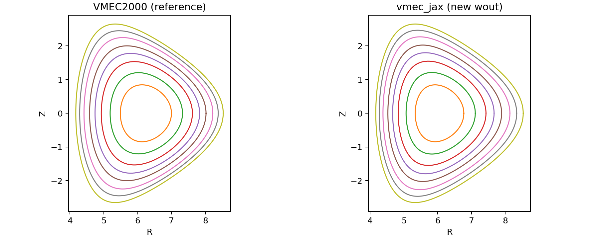
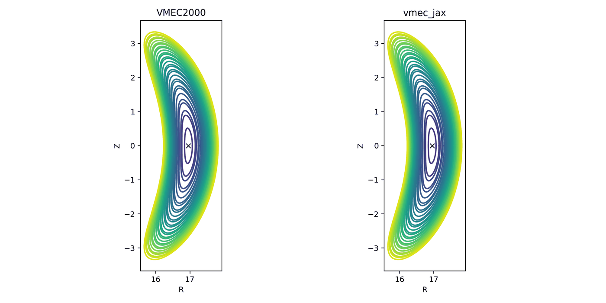
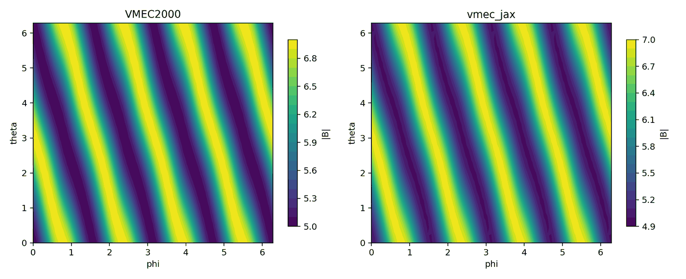

Overview
========

What is VMEC?
-------------

VMEC (Variational Moments Equilibrium Code) computes ideal-MHD equilibria in
toroidal geometry by representing flux surfaces with Fourier series and solving
a fixed-boundary equilibrium problem. The canonical public reference
implementation is **VMEC2000** (Fortran).

What is vmec-jax?
-----------------

``vmec-jax`` is a from-scratch Python package that ports VMEC2000’s equilibrium
pipeline to JAX:

- vectorized numerical kernels (``jax.numpy`` + ``jit``),
- end-to-end differentiation through equilibrium objectives and solvers,
- parity-first development against VMEC2000 ``wout_*.nc`` reference outputs.

The recommended end-to-end entrypoint is the axisymmetric showcase script:
``examples/showcase_axisym_input_to_wout.py``. It runs bundled inputs, writes
new ``wout_*.nc`` files, produces VMEC-style plots, and prints a small parity
summary against bundled VMEC2000 reference ``wout`` files.

   Example output: nested flux-surface cross-sections at ``phi=0`` for the
   bundled ``shaped_tokamak_pressure`` case.

   Side-by-side VMEC2000 vs vmec_jax cross-sections for the bundled
   ``LandremanPaul2021_QH_reactorScale_lowres`` stellarator case.

   VMEC2000 vs vmec_jax ``|B|`` on the LCFS (same VMECPlot2-style grid).

Scope (current)
---------------

The validated scope covers the full VMEC branch matrix:

- fixed-boundary and free-boundary solves,
- axisymmetric (`ntor = 0`, `nfp = 1`) and non-axisymmetric configurations,
- ``lasym=False`` and ``lasym=True`` branches.

For cancellation-limited diagnostics (notably near-axis channels and
near-zero denominators), comparisons use the standard axis mask and relaxed
interpretation documented in :doc:`validation`.

Project state snapshot (March 2026)
-----------------------------------

This section is a historical snapshot.  Use :doc:`validation`,
:doc:`performance`, and :doc:`release_checklist` for current release claims.

The project has now crossed the point where the main questions are less about
"can it run?" and more about "which path should become the long-term stable
interface?" The current state is:

- **Parity**: fixed-boundary bundled-reference parity is strong across
  axisymmetric / non-axisymmetric and ``lasym=False/True`` branches.
  Free-boundary coverage combines bundled-reference gates, convergence-only
  end-to-end tests, and optional executable-backed VMEC2000 checks.
- **Performance**: the fixed-boundary controller now has profiled CPU/GPU
  policies and lower optimization replay overhead.  Single-solve CPU runtime is
  still a mixed result versus VMEC2000, so broad runtime wins are not part of
  the current release claim.
- **Differentiability**: explicit and implicit differentiation both work
  through the public Python API. The next gap is measurement: optimization /
  gradient cost needs the same benchmark discipline that parity already has.
- **Ecosystem**: the easiest downstream integrations are now through stable
  ``wout`` output and through JAX-native Boozer inputs, not through deeper
  solver internals.

Initial guess
-------------

``vmec_jax`` initializes Fourier coefficients with VMEC-style axis regularity:
``rho = sqrt(s)`` scaling for ``m>0`` modes and a linear blend between axis and
boundary for ``m=0`` coefficients when axis inputs are provided.

When axis inputs are not provided, ``vmec_jax`` can recompute an axis guess by
searching each toroidal plane for an axis position that maximizes a minimum
Jacobian proxy on VMEC’s reduced theta grid.

Design principles
-----------------

Runtime dependencies
~~~~~~~~~~~~~~~~~~~~

The plain ``vmec-jax`` package is the supported runtime lane.  It installs the
solver, plotting stack, NetCDF I/O, and JAX-native Boozer transform dependency
used by the optimization examples:

- ``numpy``
- ``jax`` and ``jaxlib``
- ``netCDF4``
- ``matplotlib``
- ``booz_xform_jax``

The only extras are development/documentation conveniences such as ``docs`` and
``dev``; there is no separate plotting or QI extra for users to remember.

Regression-first development
~~~~~~~~~~~~~~~~~~~~~~~~~~~~

Bundled VMEC2000 ``wout_*.nc`` files are treated as ground truth for:

- Fourier mode ordering and normalization,
- Nyquist ``sqrt(g)`` and B-field coefficients,
- scalar integrals like ``wb`` and total volume,
- scalar residual measures (``fsqr/fsqz/fsql``).

Nonlinear iteration parity is tracked separately from kernel parity on reference
states (which is solver-free and therefore isolates conventions).

Ecosystem integration direction
-------------------------------

``vmec-jax`` now sits in a broader JAX plasma-tool ecosystem. The most useful
integration surfaces to preserve and document are:

- ``wout_*.nc`` compatibility for tools that consume VMEC outputs directly,
- ``booz_xform_inputs_from_state`` for file-free in-memory Boozer pipelines,
- a small public solve/result API (`run_fixed_boundary`, `FixedBoundaryRun`,
  `wout_from_fixed_boundary_run`) that downstream packages can wrap without
  importing internal solver modules.

This suggests a practical rule for future refactors:

- simplify internals aggressively,
- keep the public solve/result / `wout` / Boozer-export surfaces stable.
