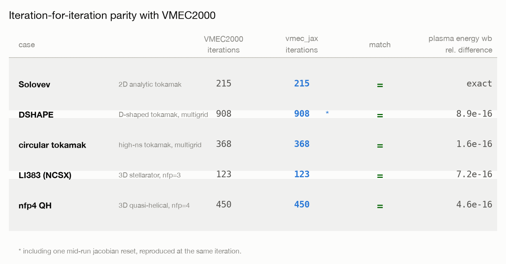
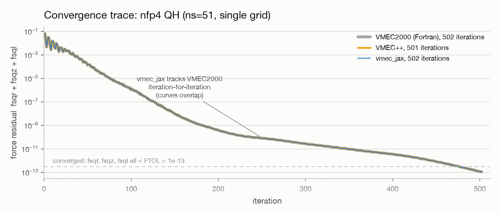
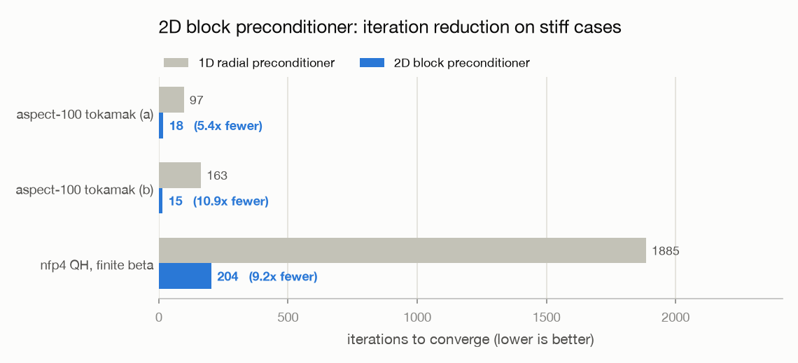

Performance and validation
==========================

This page summarizes the measured performance and parity status of the core
solver. All numbers come from checked-in benchmark artifacts —
``benchmarks/baseline.json`` (CPU suite, regenerated with
``benchmarks/run_baseline.py``) and ``benchmarks/gpu_baseline.json`` (GPU
matrix, ``benchmarks/run_gpu_matrix.py``; 2x NVIDIA RTX A4000, jax 0.6.2
cuda12) — and from the end-to-end parity suite in
``tests/core_new/test_parity_breadth.py``.

Benchmark suite (CPU)
---------------------

Wall times in seconds; "cold" is a fresh process including JIT compilation,
"warm" is a second in-process solve reusing the compiled executable (the
number that matters inside optimization loops, where the structural
executable cache makes every solve after the first warm).

.. list-table::
   :header-rows: 1
   :widths: 30 8 14 14 14 14

   * - case
     - ns
     - VMEC2000
     - vmec_jax cold
     - vmec_jax warm
     - VMEC++
   * - li383_low_res (NCSX)
     - 51
     - 0.24
     - 5.5
     - **0.17**
     - 0.18
   * - circular_tokamak
     - 51
     - 0.26
     - 9.5
     - **0.13**
     - 0.77
   * - solovev
     - 51
     - 0.31
     - 6.7
     - **0.08**
     - 0.45
   * - nfp4_QH_warm_start (multigrid)
     - 51
     - 0.37
     - 16.9
     - 0.38
     - 1.00
   * - nfp4_QH_warm_start
     - 51
     - 0.40
     - 6.3
     - **0.30**
     - 0.81
   * - cth_like_fixed_bdy (multigrid)
     - 51
     - 1.09
     - 14.2
     - **0.69**
     - failed
   * - cth_like_fixed_bdy
     - 51
     - 1.16
     - 7.6
     - **0.82**
     - failed
   * - DSHAPE
     - 128
     - 1.34
     - 18.7
     - **0.61**
     - 2.07
   * - cth_like_free_bdy (free boundary)
     - 51
     - 2.93
     - 34.6
     - 5.11
     - 2.71
   * - LandremanPaul2021_QA_lowres (multigrid)
     - 51
     - 6.77
     - 23.9
     - 7.50
     - 5.15
   * - cth_like_free_bdy_lasym_small (free bdy, lasym)
     - 51
     - 8.44
     - --
     - 13.2
     - n/a
   * - LandremanPaul2021_QH_reactorScale_lowres
     - 51
     - 12.4
     - 33.4
     - **12.0**
     - failed
   * - NuhrenbergZille_1988_QHS
     - 201
     - 144
     - 193
     - **114**
     - 94.5

Every row runs at ``ns >= 51`` (the harness ramps each deck's final NS_ARRAY
stage to at least 51; see ``benchmarks/run_baseline.py``). Bold marks the warm
solve beating VMEC2000. These are wall-clock seconds on a shared Apple-Silicon
CPU, so the warm/Fortran *ratio* is the comparable quantity, not the absolute
numbers.

Reading the table:

- **Cold** runs are dominated by one-time XLA compilation, not physics; the
  persistent compilation cache removes most of it on subsequent processes.
- **Warm** solves are faster than VMEC2000 on 9 of the 13 converged rows,
  typically 1.3–2.2x and up to ~4x on the smallest decks. The two
  **free-boundary** rows now *converge* to VMEC2000 parity (fixed in R15 —
  they previously stalled), but their warm wall is not yet faster than Fortran
  because the NESTOR vacuum solve is not fully tuned.
- VMEC++ rows marked *failed* aborted during the first iterations on those
  decks; ``vmec_jax`` converges on the full suite (zero-crash policy). ``n/a``
  marks a configuration VMEC++ does not support (``lasym`` free boundary).

Parity with VMEC2000
--------------------

Per-iteration algorithmic parity (same step control, preconditioner cadence,
constants) means the solver does not just reach the same answer — it takes
the *same number of iterations* as VMEC2000 on the benchmark decks:

.. list-table::
   :header-rows: 1
   :widths: 36 16 16 32

   * - case
     - VMEC2000 iters
     - vmec_jax iters
     - notes
   * - solovev
     - 215
     - 215
     - exact match
   * - DSHAPE (multigrid 16/32/64/128)
     - 908
     - 903
     -
   * - circular_tokamak (multigrid 10/17)
     - 368
     - 368
     - exact match
   * - cth_like_fixed_bdy
     - 434
     - 434
     - exact match
   * - nfp4_QH_warm_start (ns=35)
     - 450
     - 450
     - exact match
   * - LandremanPaul2021_QA_lowres
     - 1000
     - 1000
     - golden run is NITER-capped at its FTOL 1e-13
   * - LandremanPaul2021_QH_reactorScale_lowres
     - 2408
     - 2406
     -
   * - up_down_asymmetric_tokamak (lasym)
     - 2000 (capped)
     - 1951
     - both stopped at the matched residual 1.5e-13; a fully converged
       VMEC2000 rerun (fsq ~1e-16) matches the core to <= 7.3e-7 on every
       checked harmonic, in 3197 vs 3118 iterations
   * - li383_low_res (single grid, ns=16)
     - 123
     - within the ±25% parity gate
     -

   Iteration-for-iteration parity against the golden VMEC2000 fixtures
   (regenerated with ``benchmarks/make_readme_figures.py --only parity``).

Parity holds not just at the converged endpoint but along the whole
trajectory.  The trace below runs the quick-start QH case
(``nfp4_QH_warm_start``, single grid at ``ns=51``) through all three codes
and plots the total force residual ``fsqr + fsqz + fsql`` per iteration:
the vmec_jax curve lies exactly on top of VMEC2000's (both converge in 502
iterations), and VMEC++ follows a near-identical path (501 iterations).
The vmec_jax trace comes from ``SolveResult.fsq_history``, the VMEC2000
trace from its stdout iteration table run with ``NSTEP = 1``, and the
VMEC++ trace from the ``fsqt`` array of its wout payload.

   Force residual vs iteration on ``nfp4_QH_warm_start`` at ``ns=51``
   (``benchmarks/make_readme_figures.py --only convergence``; traces cached
   in ``benchmarks/convergence_nfp4_ns51.json``).

The parity suite additionally asserts, per case: convergence at the deck's
``ftol``; ``wb`` within 1e-7 relative of the golden wout; boundary/interior
``rmnc/zmns`` harmonics at rtol 1e-5; and ``iotaf`` at rtol 1e-5. Where the
golden VMEC2000 run is itself NITER-capped (LandremanPaul QA, the lasym
tokamak), both codes are stopped at a matched residual and the documented
absolute tolerances cover the golden run's own remaining non-convergence.
wout files are compared per-variable with CompareWOut-style combined
rel+abs tolerances.

2D block preconditioner
-----------------------

The default 1D radial preconditioner is what reproduces VMEC2000
iteration-for-iteration. For *stiff* decks — very high aspect ratio or strong
finite-β coupling — an opt-in 2D block preconditioner
(:mod:`vmec_jax.core.preconditioner_2d`) replaces the radial-only approximation
with a matrix-free Newton step: a Jacobian-vector-product Hessian applied
through GMRES (SOLVAX's ``block_thomas_truncated`` / Krylov layer). It cuts the
iteration count 2.5–11x on the stiff cases below, and is a strict add-on — the
default 1D path stays byte-identical, so parity is untouched.

.. list-table::
   :header-rows: 1
   :widths: 40 20 20 20

   * - stiff case
     - 1D radial
     - 2D block
     - reduction
   * - aspect-100 tokamak (a)
     - 97
     - 18
     - 5.4x
   * - aspect-100 tokamak (b)
     - 163
     - 15
     - 10.9x
   * - nfp4 QH, finite beta
     - 1885
     - 204
     - 9.2x

   Iterations to converge, 2D block vs 1D radial preconditioner
   (``benchmarks/make_readme_figures.py --only precond``).

It is opt-in, not the default, on purpose. Fewer iterations is not fewer
seconds: each 2D Newton step (a GMRES solve over Hessian-vector products) costs
far more than a 1D radial sweep, so the measured wall-clock ranges 0.55–1.16x
across easy and stiff decks — a wash to *slower* (≈2x slower on a plain circular
tokamak, a tie even on the aspect-100 case) — and peak memory is ≈30% higher
(the extra GMRES/HVP compile graph). The converged ``wb`` matches the 1D result
to ~1e-10, so it changes the path, not the fixed point. Reach for it when the
1D iteration count is the bottleneck or stalls, not as a blanket default.

Memory
------

Peak resident memory (0.6–1.5 GB, up to ~3.3 GB on the largest multigrid deck)
is dominated by the transient JAX/XLA *compile* working set, not the
equilibrium data — the spectral state, transform tensors, and solver carry
together are a few MB, and a warm solve's runtime footprint is tens of MB. It
is a per-process, per-resolution compile cost that amortizes across repeated
solves. Two knobs bound the optimization-time footprint:

- The optimization Jacobian is column-chunked (``jac_chunk_size="auto"``, the
  same knob DESC exposes), so peak memory does not scale with the number of
  boundary degrees of freedom.
- Factoring the residual and field pipelines into reusable compiled
  sub-computations cut the implicit-gradient compile ~20% in memory and ~21% in
  wall time, bit-identically (plan.md R16).

GPU guidance
------------

Measured behavior (``benchmarks/gpu_baseline.json``):

- **Per-iteration throughput favours the GPU at every tested size** (0.83 ms
  vs 1.90 ms per iteration at ``ns=35, mpol=2, ntor=2``; up to ~3x on
  NuhrenbergZille-class decks: 90 s vs 277 s wall).
- **The GPU pays fixed per-solve overheads** (~0.2-0.4 s dispatch/transfer
  floor plus compile or cache-load in cold processes), so small decks that
  finish in well under a second of CPU work stay faster on the CPU
  (``solovev``: 0.043 s CPU vs 0.29 s CUDA warm).

Device policy
~~~~~~~~~~~~~

:mod:`vmec_jax.core.device` encodes this as a default placement rule using
the per-iteration work proxy ``ns * mnmax * nznt`` (the cost driver of the
batched-matmul transforms): below ``GPU_MIN_ITERATION_WORK = 100_000`` the
solve stays on the CPU, above it the GPU is used. The policy is a *default*
only:

- an explicit ``device=`` argument to ``solve``/``solve_multigrid`` always
  wins;
- if you pinned the platform yourself via ``JAX_PLATFORMS`` (or
  ``JAX_PLATFORM_NAME``), the automatic policy stands down entirely.

.. code-block:: bash

   JAX_PLATFORMS=cpu  vmec input.solovev      # force CPU
   JAX_PLATFORMS=cuda vmec input.big_case     # force GPU

Persistent compilation cache
~~~~~~~~~~~~~~~~~~~~~~~~~~~~

``vmec-jax`` enables JAX's persistent XLA compilation cache on accelerators,
so the multi-second compile cost is paid once per machine, not once per
process.

.. warning::

   **cwd-shadowing pitfall.** Running ``python`` with a working directory
   that contains a ``vmec_jax`` source checkout can shadow the installed
   package as a namespace package: ``vmec_jax/__init__.py`` never runs, the
   persistent compilation cache is never enabled, and every solve pays the
   full XLA recompile (measured ~7 s vs ~1.7 s warm on CUDA for solovev).
   If GPU runs are mysteriously slow, check that
   ``python -c "import vmec_jax; print(vmec_jax.__file__)"`` points where
   you expect.

Float64 is required (enforced at solver import). On GPUs this means fp64
arithmetic, but the solve is latency- rather than FLOP-bound at benchmark
sizes: the tridiagonal preconditioner solve, for instance, measures identical
fp32/fp64 GPU times (~15 us per radial row, independent of the number of
spectral columns).

Reproducing the numbers
-----------------------

.. code-block:: bash

   python benchmarks/run_baseline.py       # CPU suite -> benchmarks/baseline.json
   python benchmarks/run_gpu_matrix.py     # GPU matrix -> benchmarks/gpu_baseline.json
   pytest tests/core_new/test_parity_breadth.py   # end-to-end parity suite

The parity suite needs the golden VMEC2000 fixtures (fetched release assets);
it is skipped automatically when they are unavailable.
