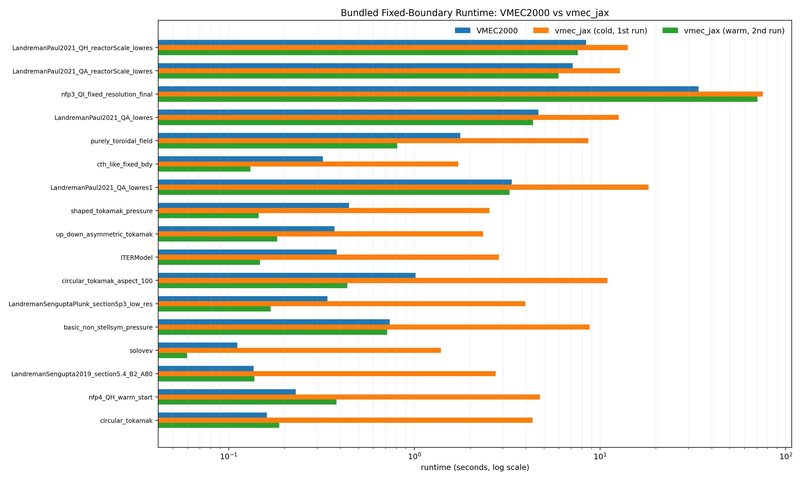

Performance notes
=================

This page describes the performance characteristics of ``vmec_jax``, the
algorithmic and implementation choices that determine them, and practical
tuning advice.

Overview: cold vs warm runtime
--------------------------------

``vmec_jax`` uses **XLA JIT compilation** (via JAX).  The first call in a
process compiles the iteration kernels; subsequent calls reuse the compiled
code:

- **Cold run**: includes XLA compilation (one-time cost per process). For
  typical fixed-boundary cases on CPU this is 10–60 s.
- **Warm run**: steady-state solve time after the kernels are in memory — the
  fair comparison against VMEC2000.

Persistent XLA compilation caching is enabled automatically for
accelerator-selected runs.  CPU cache use is opt-in because XLA:CPU persistent
cache entries are native AOT executables and can emit host-feature mismatch
errors on some JAX versions.  Compiled kernels are stored under
``~/.cache/vmec_jax/jax_cache/<machine-fingerprint>`` unless the user sets
``VMEC_JAX_COMPILATION_CACHE_DIR`` or upstream ``JAX_COMPILATION_CACHE_DIR``.
The suffix includes host CPU details plus Python/JAX/JAXLIB versions to avoid
reusing native XLA:CPU AOT executables compiled for an incompatible runtime.
Set ``VMEC_JAX_COMPILATION_CACHE=1`` to opt in for CPU runs, or
``VMEC_JAX_COMPILATION_CACHE=0`` to disable the persistent cache.

VMEC2000 is a pre-compiled Fortran binary with no JIT overhead — it is always
effectively "cold".  When benchmarking, compare ``vmec_jax`` warm runtime
against VMEC2000 runtime.

Key performance decisions
--------------------------

The following design choices explain the current performance profile.  They
reduce warm runtime and are especially useful inside differentiable
optimization workflows, but the present single-solve CPU matrix should still be
read as a mixed result rather than a broad VMEC2000 speedup claim:

**1. Single-grid default for fixed-boundary**
  The default CLI path skips staged multi-grid schedules and goes directly to
  the final grid.  VMEC2000 uses a ``NS_ARRAY`` continuation schedule; for
  many cases the intermediate stages add overhead without improving convergence.
  Pass ``--parity`` to force the VMEC2000 continuation schedule.

**2. Non-scan production fixed-boundary default**
  Public fixed-boundary API/CLI runs now default to the VMEC-control non-scan
  loop on CPU and GPU because converged May 2026 profiles were faster than the
  scan loop.  The ``jax.lax.scan`` loop remains available for differentiable
  paths and raw-throughput experiments; each scan chunk compiles to a single
  XLA program and returns only scalar convergence diagnostics to the host.

**3. Dynamic replay bucketing**
  ``VMEC_JAX_DYNAMIC_REPLAY_BUCKET`` pads nearby exact-adjoint tape lengths so
  compiled replay kernels can be reused across Jacobian calls with slightly
  different iteration counts.  The default is backend-adaptive: ``32`` on CPU
  and ``128`` on CUDA/ROCm/GPU backends.  Override it only as a profiling knob;
  larger buckets can still be slower if they pad a workload too aggressively.

**4. Preconditioner caching**
  The 1-D preconditioner (``clear_preconditioner_jit_caches``) is JIT-compiled
  once and reused.  Explicit cache clearing between Gauss-Newton Jacobian
  evaluations (``post_jacobian_callback``) releases accumulated caches without
  paying the cost of recompilation on the next call.

**5. Strict-update + no backtracking**
  The VMEC iteration algorithm uses ``strict_update=True, backtracking=False``
  to match the VMEC2000 step-accept path.  Using backtracking causes the
  adaptive step size to collapse to machine epsilon on stiff 3D geometries
  (e.g. QH stellarators), resulting in non-convergence.

**6. FFT-based spectral synthesis**
  ``vmec_jax`` uses FFT-based real-space synthesis (``vmec_tomnsp.py``) for
  the R/Z/λ transforms, replacing the matrix–vector approach of VMEC2000.
  This reduces transform cost from O(N_modes × N_real) to O(N_real log N_real).

**7. Relaxed trial residuals in optimisation line search**
  The Gauss-Newton line search uses a *relaxed* forward solve (fewer iterations,
  looser ftol) for trial step evaluations.  The tight solve is only run for
  accepted steps and Jacobian builds.  This roughly halves the per-iteration
  wall time in optimisation loops.

**8. Discrete-adjoint Jacobian (exact, not finite differences)**
  For optimisation, the Jacobian is computed via discrete-adjoint replay
  (``build_residual_checkpoint_tape_direct`` + ``checkpoint_tape_state_jvp_columns``).
  This gives a machine-precision Jacobian without finite differences.  The
  cost scales with the number of boundary degrees of freedom because all
  parameter tangent columns must be propagated through the converged VMEC
  iteration tape.

**9. Cached quasisymmetry angular grids**
  QS optimisation callbacks reuse the same angular quadrature grid and
  trigonometric tables across residual and Jacobian calls.  The public
  ``quasisymmetry_ratio_residual_from_wout`` API still builds these arrays on
  demand, but ``make_qs_residuals_fn`` / ``make_qh_residuals_fn`` precompute
  them once for the fixed optimisation problem.  This reduces cold
  residual/Jacobian trace overhead without changing the residual values.

**10. Minimal history in optimisation loops**
  The ``light_history=True`` flag suppresses the full per-step diagnostic record
  during optimisation solves, reducing host/device traffic and memory pressure.

**11. On-disk XLA kernel cache**
  The persistent XLA compilation cache is enabled by default for repeated
  cold-process accelerator runs, including jobs that expose GPUs through
  ``CUDA_VISIBLE_DEVICES`` or the ROCm equivalents before import. CPU cache use
  remains opt-in to avoid XLA:CPU AOT host-feature mismatch warnings. Set
  ``VMEC_JAX_COMPILATION_CACHE=1`` to enable it for CPU runs,
  ``VMEC_JAX_COMPILATION_CACHE=0`` to disable it, or
  ``VMEC_JAX_COMPILATION_CACHE_DIR`` to choose the cache location.

**12. GPU demand allocation**
  Before importing JAX, vmec_jax defaults
  ``XLA_PYTHON_CLIENT_PREALLOCATE=false`` unless the user already configured
  the allocator.  This keeps GPU memory available for worker/profiling
  processes and improved the exact-Jacobian replay profile on ``office``.
  Set ``XLA_PYTHON_CLIENT_PREALLOCATE=true`` or
  ``VMEC_JAX_GPU_PREALLOCATE=1`` before import to keep JAX's preallocation
  default.

**13. Tape exact default**
  Accepted-point exact optimizer callbacks use the discrete-adjoint tape path by
  default on both CPU and GPU.  The scan exact path is still available through
  ``VMEC_JAX_OPT_EXACT_PATH=scan`` for targeted profiling and parity studies, but
  it is not the GPU default.

**14. Scan trial residuals**
  Relaxed trial residual solves in optimization loops use the trace-compatible
  scan forward path by default on CPU.  Cold GPU mode-2 trial profiles were
  faster on the older non-scan path, so GPU trial residuals default to non-scan
  unless ``VMEC_JAX_OPT_TRIAL_SCAN=1`` is set.  Set
  ``VMEC_JAX_OPT_TRIAL_SCAN=0`` to force the non-scan path on any backend.

**15. Fused accelerator update step**
  The exact optimizer's strict fixed-boundary accepted-point solve uses a
  cached JIT helper for the velocity/state update on non-CPU backends.  This
  removes many small eager GPU dispatches per VMEC iteration while leaving the
  CPU host-update path unchanged.  Set ``VMEC_JAX_JIT_STRICT_UPDATE=0`` only
  for diagnostics.

**16. Residual-derived accepted-point history**
  For standard QS residual factories, accepted-point Jacobian callbacks
  reconstruct aspect-ratio and QS history metrics directly from the cached
  residual vector.  This avoids a second accepted-point solve after every
  Jacobian callback.  The conservative state-backed path is still used for
  custom residuals and histories that request an explicit ``iota_fn``.

**17. JVP-only exact tapes are experimental**
  ``VMEC_JAX_OPT_JVP_ONLY_EXACT_TAPE=1`` and the diagnostics flag
  ``--jvp-only-exact-tape`` omit reverse-mode base-carry storage from accepted
  exact tapes when only JVP columns are needed.  This is intentionally off by
  default.  A 2026-05-22 QH mode-2 exact-callback profile on ``office`` showed a
  modest CPU total-time improvement but higher RSS, while the original GPU
  JVP-only replay regressed sharply.  A guarded follow-up with
  ``VMEC_JAX_JVP_ONLY_EXACT_TAPE_BASEPOINT_CARRIES=1`` restored the GPU replay
  path to near-full-tape performance by preserving the dynamic basepoint carries
  needed for the basepoint scan runner.  Treat both flags as profiling probes
  until larger mode and optimizer-trajectory matrices confirm the tradeoff.

  .. list-table:: QH mode-2 accepted Jacobian profile, ``office``, 2026-05-22
     :header-rows: 1

     * - Device
       - JVP-only
       - Total
       - Tape build
       - Replay
       - RSS growth
     * - CPU
       - off
       - 31.373 s
       - 6.635 s
       - 11.246 s
       - 1934.6 MiB
     * - CPU
       - on
       - 28.199 s
       - 3.432 s
       - 18.724 s
       - 2760.3 MiB
     * - GPU
       - off
       - 20.356 s
       - 8.395 s
       - 5.543 s
       - 922.4 MiB
     * - GPU
       - on
       - 56.347 s
       - 8.043 s
       - 41.794 s
       - 1378.2 MiB
     * - GPU
       - on + basepoint carries
       - 24.249 s
       - 11.069 s
       - 6.461 s
       - 922.2 MiB

  A follow-up bounded QH mode-2 cold-Jacobian profile
  (``inner_max_iter=60``, one perturbed callback, replay synchronization
  enabled) showed that JVP-only plus basepoint carries can reduce one GPU replay
  microcase, but the broader CPU/GPU matrix did not support making it a default:
  the latest one-callback full-tape totals were ``16.6 s`` on CPU and ``16.0 s``
  on GPU, while JVP-only plus basepoint carries measured ``19.5 s`` on CPU and
  ``16.5 s`` on GPU.  The flags remain profiling-only until a larger mode/case
  matrix shows a consistent end-to-end optimizer win.

**18. NumPy multigrid interpolation for ordinary stage transfers**
  Non-differentiated ``NS_ARRAY`` stage transfers now use the host NumPy path
  for radial VMEC interpolation, while traced/autodiff calls stay on the JAX
  implementation.  This avoids one-time XLA dispatch during ordinary
  multigrid startup without changing the interpolation convention or the final
  residual.

**19. NumPy initialization fast path for ordinary CPU solves**
  Public CPU performance-mode fixed-boundary runs now build non-traced initial
  guesses under the same NumPy compatibility shim used by the CPU force loop.
  Differentiated/traced calls and explicit JAX/GPU paths still use the JAX
  implementation.  The pure-NumPy VMEC axis recompute scan is also vectorized.
  On the finite-beta QH multigrid profile above this kept the converged
  residual at ``5.6e-13`` while reducing local wall time to about ``21.5 s`` on
  the development Mac; the next major CPU target remains force assembly
  (``vmec_bcovar_half_mesh_from_wout`` / ``vmec_forces_rz_from_wout``).

CPU/GPU profiling playbook
--------------------------

Use the diagnostics scripts from the repository root.  Always record whether a
timing is cold or warm, the selected JAX backend, JAX/JAXLIB versions, input
deck, ``max_mode`` or iteration budget, and whether the command is measuring
raw solver throughput or optimization callback overhead.
For sweep and matrix outputs, do not infer the runtime backend from an output
directory or ``--backend-label`` alone.  Use the JSON/CSV provenance fields
(``jax_backend``, ``jax_device_kind``, ``solver_device``, ``jax_platforms``)
and the profiler ``runtime`` block when comparing CPU/GPU results.

For optimization work, keep three measurements separate:

- raw fixed-boundary throughput, measured with ``profile_fixed_boundary.py``;
- accepted-point exact optimizer callbacks, measured with
  ``profile_exact_optimizer.py`` or ``gpu_cpu_performance_matrix.py``;
- QI Boozer/residual cost, measured with ``profile_qi_boozer_gpu.py`` before
  attributing a slow QI run to VMEC replay or SciPy trust-region behavior.

For CPU-only timings, force a CPU process with ``JAX_PLATFORMS=cpu`` or an
explicit ``--solver-device cpu``.  For GPU timings, use
``JAX_PLATFORM_NAME=gpu`` plus ``--solver-device gpu``.  On NVIDIA-only JAX
installs, ``JAX_PLATFORMS=cuda`` is also valid; avoid ``JAX_PLATFORMS=gpu`` on
mixed CUDA/ROCm installations because some JAX versions try to initialize both
backends.

Raw fixed-boundary throughput:

.. code-block:: bash

   JAX_PLATFORMS=cpu JAX_ENABLE_X64=1 PYTHONPATH=. python tools/diagnostics/profile_fixed_boundary.py \
     --input examples/data/input.nfp4_QH_warm_start \
     --iters 20 \
     --simple-profile \
     --no-multigrid \
     --no-auto-cli-policy \
     --solver-mode accelerated \
     --use-scan \
     --solver-device cpu \
     --json-out /tmp/vmec_jax_qh20_raw_cpu.json

   JAX_PLATFORM_NAME=gpu JAX_ENABLE_X64=1 PYTHONPATH=. python tools/diagnostics/profile_fixed_boundary.py \
     --input examples/data/input.nfp4_QH_warm_start \
     --iters 20 \
     --simple-profile \
     --no-multigrid \
     --no-auto-cli-policy \
     --solver-mode accelerated \
     --use-scan \
     --solver-device gpu \
     --json-out /tmp/vmec_jax_qh20_raw_gpu.json

Short exact-optimizer runs:

.. code-block:: bash

   JAX_PLATFORMS=cpu PYTHONPATH=. python tools/diagnostics/profile_exact_optimizer.py \
     --problem qh --max-mode 3 --max-nfev 2 --run-repeats 3 \
     --inner-max-iter 120 --trial-max-iter 120 --solver-device cpu \
     --json-out /tmp/vmec_jax_qh_m3_cpu.json

   JAX_PLATFORM_NAME=gpu PYTHONPATH=. python tools/diagnostics/profile_exact_optimizer.py \
     --problem qh --max-mode 3 --max-nfev 2 --run-repeats 3 \
     --inner-max-iter 120 --trial-max-iter 120 --solver-device gpu \
     --vmec-timing --json-out /tmp/vmec_jax_qh_m3_gpu.json

Accepted-point Jacobian callback cost at realistic new optimizer points:

.. code-block:: bash

   JAX_PLATFORMS=cpu PYTHONPATH=. python tools/diagnostics/profile_exact_optimizer.py \
     --problem qh --max-mode 2 --callback jacobian --repeats 3 \
     --perturb-scale 1e-4 --inner-max-iter 80 --trial-max-iter 40 \
     --solver-device cpu --vmec-timing --json-out /tmp/qh_m2_cpu_jacobian.json

   JAX_PLATFORM_NAME=gpu PYTHONPATH=. python tools/diagnostics/profile_exact_optimizer.py \
     --problem qh --max-mode 2 --callback jacobian --repeats 3 \
     --perturb-scale 1e-4 --inner-max-iter 80 --trial-max-iter 40 \
     --solver-device gpu --vmec-timing --json-out /tmp/qh_m2_gpu_jacobian.json

Compare the JSON reports before launching a full sweep or a long GPU run:

.. code-block:: bash

   PYTHONPATH=. python tools/diagnostics/compare_profile_reports.py \
     /tmp/qh_m2_cpu_jacobian.json /tmp/qh_m2_gpu_jacobian.json \
     --label cpu --label gpu \
     --json-out /tmp/qh_m2_cpu_gpu_comparison.json

The comparison summary exposes exact optimizer phases separately:
``exact_tape_build_s``, ``exact_tape_build_unattributed_s``,
``initial_tangents_s``, ``initial_projection_s``, ``residual_tangents_s``,
``trial_solve_s``, and ``exact_solve_s``.  Use these fields before changing
solver kernels: in recent GPU runs the dominant cost has been accepted-point
tape/replay and tangent construction, not VMEC force assembly.
The same tool also prints an "Exact optimizer patch targets" section that
ignores enclosing timers such as ``jacobian_total`` and
``exact_solve_with_tape_total``.  Treat that row as the next concrete profiling
target when a total timer is largest; it points at leaf-like accepted-point
work such as ``*_tape_replay``, ``exact_tape_build_unattributed``,
``*_initial_vjp``, or ``*_residual_tangents``.

QI Boozer/residual isolation:

.. code-block:: bash

   JAX_PLATFORMS=cpu PYTHONPATH=. python tools/diagnostics/profile_qi_boozer_gpu.py \
     --solver-device cpu --repeat 2 --jit-booz \
     --output results/diagnostics/qi_boozer_cpu.json

   JAX_PLATFORM_NAME=gpu PYTHONPATH=. python tools/diagnostics/profile_qi_boozer_gpu.py \
     --solver-device gpu --repeat 2 --jit-booz \
     --output results/diagnostics/qi_boozer_gpu.json

The user-facing QI optimization helpers default to the jitted Boozer path
(``QuasiIsodynamicOptions(jit_booz=True)``).  Keep the non-jitted profiler mode
available for parity isolation; use ``--jit-booz`` for production-like QI
timings.

May 2026 QI Boozer/GPU split
~~~~~~~~~~~~~~~~~~~~~~~~~~~~

On the bundled ``input.nfp2_QI`` low-resolution diagnostic
(``mpol=ntor=mboz=nboz=3``, one Boozer surface, ``repeat=3``), ``--jit-booz``
improved the QI/Boozer phase on both backends:

- CPU: total profiler time ``20.17 s`` without Boozer JIT and ``18.73 s`` with
  Boozer JIT; first QI/Boozer call improved from ``8.38 s`` to ``6.78 s``.
- ``office`` GPU: total profiler time ``27.39 s`` without Boozer JIT and
  ``20.88 s`` with Boozer JIT; first QI/Boozer call improved from ``11.01 s``
  to ``4.98 s``.

The remaining gap in this small case comes from the VMEC solve, not from the QI
residual itself.  A raw 80-iteration fixed-boundary ``input.nfp2_QI`` profile
with the accelerated single-grid path measured ``0.65 s`` on CPU and ``3.11 s``
on GPU; forcing the scan path measured ``0.55 s`` on CPU and ``3.35 s`` on GPU.
The next GPU work should therefore target fixed-boundary force/update kernel
launch and tape structure, while keeping Boozer JIT enabled for QI production
runs.

A bounded QH warm-start non-scan profile on 2026-05-23
(``input.nfp4_QH_warm_start``, 20 iterations, ``--no-warmup``) measured
``9.70 s`` total on local CPU and ``7.48 s`` total on ``office`` GPU.  The GPU
was faster end-to-end in that cold profile, but the VMEC phase timers still
showed slower accelerator micro-kernels: ``compute_forces`` was ``1.03 s`` on
GPU versus ``0.094 s`` on CPU, and ``update`` was ``0.133 s`` on GPU versus
``0.008 s`` on CPU.  This supports the current priority order: keep full-tape
GPU exact callbacks as the production default while using JVP-only/basepoint
carry as an explicit profiling probe, then target raw fixed-boundary GPU
force/update fusion and launch-count reduction.

A follow-up ``LASYM=true`` finite-beta fixed-boundary profile on ``office``
(``input.basic_non_stellsym_pressure``, 20 iterations, non-scan production
path, no warmup) measured ``21.38 s`` profile time on CPU and ``26.15 s`` on
GPU.  GPU force assembly was faster (``1.29 s`` versus ``2.31 s``), but GPU
preconditioner time was slower (``2.48 s`` versus ``1.09 s``), so the next raw
GPU solve target for this lane is preconditioner/update launch structure rather
than the force kernel alone.  Forcing the scan path was slower on both devices
in the same case: ``35.76 s`` CPU and ``44.96 s`` GPU profile time.

The next ``office`` pass isolated the preconditioner piece: enabling
precomputed Thomas coefficients for the same raw LASYM GPU profile reduced
wrapper time from ``30.50 s`` to ``11.33 s`` and detailed preconditioner time
from ``2.66 s`` to ``0.74 s``.  Short VMEC2000 trace parity was then checked for
the LASYM finite-pressure case and the QH warm-start case.  The public
production policy now enables this path automatically only for non-scan,
performance-mode accelerator LASYM solves; CPU, scan, and non-LASYM fixed
boundary solves keep the legacy environment-controlled default.  Set
``VMEC_JAX_TRIDI_PRECOMPUTE=0`` to disable this narrow GPU/LASYM default during
diagnostics, or ``=1`` to force it in lower-level experiments.

The same commit was profiled with a one-callback QH mode-2 exact Jacobian
matrix on ``office`` (``inner_max_iter=40``, ``trial_max_iter=20``,
``--sync-replay-timing``).  The GPU profile was faster end-to-end than CPU
(``15.45 s`` versus ``29.88 s``), with GPU accepted exact solve ``7.20 s``,
tape build ``5.45 s``, replay ``6.16 s``, and initial tangent construction
``2.09 s``.  CPU spent ``11.02 s`` in the exact solve, ``7.16 s`` in tape build,
``6.72 s`` in replay, ``8.19 s`` in initial tangents, and ``3.95 s`` in
residual tangents.  This keeps the current GPU optimization target focused on
cold accepted-point tape/replay/tangent construction; forcing scan for GPU is
not justified by these profiles.
A matched run with ``--jvp-only-exact-tape --jvp-only-basepoint-carries`` was
nearly neutral: CPU profile time was ``29.97 s`` and GPU profile time was
``14.95 s``.  That is a small GPU win for this one callback, but not enough to
change the default without larger mode and full optimizer-trajectory coverage.

A 2026-05-23 GPU sidecar pass on ``office`` at ``4d61eab`` used one QH mode-2
cold Jacobian callback (``inner_max_iter=20``, ``trial_max_iter=20``,
``--sync-replay-timing``) plus matched trial and raw-LASYM probes.  Full-tape
exact took ``13.29 s`` on CPU and ``36.81 s`` on GPU; the GPU regression was
the accepted replay dispatch bucket (``21.10 s`` dispatch, ``0.00 s`` ready),
not tangent construction (GPU initial/residual tangents ``2.04 s``/``2.46 s``).
The same GPU callback with
``--jvp-only-exact-tape --jvp-only-basepoint-carries`` dropped to ``14.48 s``
and replay to ``3.62 s``, but the matched CPU JVP-only callback regressed to
``27.86 s`` with ``8.96 s`` in initial tangents.  Treat this as a GPU-only
candidate that needs mode-3 and full-trajectory validation before changing
defaults.

The same sidecar confirmed the trial-scan policy.  Forced scan trial solves
spent ``6.76 s`` in the CPU scan block and ``11.68 s`` in the GPU scan block;
the GPU device bucket was almost entirely dispatch/compile-like
(``10.24 s`` dispatch, ``0.001 s`` ready).  Disabling scan reduced the trial
profiles to ``4.46 s`` on CPU and ``6.76 s`` on GPU, so cold GPU trial
callbacks should stay on the non-scan path unless a warm-cache sweep shows a
different result.

For raw ``LASYM=true`` ``input.basic_non_stellsym_pressure`` non-scan solves
(``20`` iterations, single-grid, no warmup, detailed timing), the same pass
measured ``7.98 s`` on CPU and ``8.84 s`` on GPU.  Force assembly was comparable
(``1.29 s`` CPU, ``1.27 s`` GPU), GPU update was faster (``0.14 s`` versus
``0.41 s``), and GPU preconditioner apply remained slower (``0.44 s`` versus
``0.27 s``).  The raw LASYM target remains preconditioner/apply launch
structure and residual wrapper overhead rather than force assembly alone.

A larger QH mode-3 exact-Jacobian callback on ``office`` then showed that the
projected-replay residual path was the wrong default for GPU.  With projected
replay enabled the one-callback profile took ``69.06 s`` wall time
(``63.53 s`` profile time, ``33.40 s`` replay, ``10.00 s`` projected residual
tangents).  The same callback with projected replay disabled took ``21.59 s``
wall time (``16.29 s`` profile time, ``4.29 s`` replay, ``2.38 s`` residual
tangents).  ``VMEC_JAX_OPT_PROJECTED_REPLAY_RESIDUALS=1`` is therefore an
explicit diagnostic probe; production GPU exact callbacks use the standard full
replay path unless a future profile matrix reverses this result.

For raw ``input.nfp2_QI`` follow-up profiling, keep the production-like scan
measurement separate from phase attribution.  The scan path is best inspected
with XProf traces because the force/preconditioner/update work is inside one
``lax.scan`` program.  The non-scan path supports lightweight JSON phase timing
with ``--vmec-timing``:

.. code-block:: bash

   PYTHONPATH=. python tools/diagnostics/gpu_cpu_performance_matrix.py \
     --mode fixed-boundary --backend cpu --backend gpu --keep-going \
     --input examples/data/input.nfp2_QI \
     --iters 80 \
     --solver-mode accelerated \
     --single-grid \
     --raw-solver-policy \
     --use-scan \
     --outdir outputs/performance_profiles/qi_raw_scan80

   JAX_PLATFORMS=cpu JAX_ENABLE_X64=1 PYTHONPATH=. python tools/diagnostics/profile_fixed_boundary.py \
     --input examples/data/input.nfp2_QI \
     --iters 20 \
     --simple-profile \
     --no-warmup \
     --no-multigrid \
     --no-auto-cli-policy \
     --solver-mode accelerated \
     --solver-device cpu \
     --vmec-timing \
     --vmec-timing-detail \
     --json-out outputs/performance_profiles/qi_raw_cpu_phase20.json

   JAX_PLATFORM_NAME=gpu JAX_ENABLE_X64=1 PYTHONPATH=. python tools/diagnostics/profile_fixed_boundary.py \
     --input examples/data/input.nfp2_QI \
     --iters 20 \
     --simple-profile \
     --no-warmup \
     --no-multigrid \
     --no-auto-cli-policy \
     --solver-mode accelerated \
     --solver-device gpu \
     --vmec-timing \
     --vmec-timing-detail \
     --json-out outputs/performance_profiles/qi_raw_gpu_phase20.json

The fixed-boundary raw-solve source path is:
``vmec_jax/driver.py::run_fixed_boundary`` for accelerated/single-grid policy,
``vmec_jax/solve.py::solve_fixed_boundary_residual_iter`` for the VMEC loop and
``_run_vmec2000_scan`` scan runner, ``vmec_jax/solve.py::_compute_forces`` for
per-iteration force assembly and residual norms,
``vmec_jax/vmec_forces.py::vmec_forces_rz_from_wout`` and
``vmec_residual_internal_from_kernels`` for bcovar/force/tomnsps assembly, and
``vmec_jax/vmec_tomnsp.py::tomnsps_rzl`` for the Fourier transform hot kernel.
The fixed-boundary profiler now keeps any ``diagnostics.timing`` block in its
JSON, and ``compare_profile_reports.py`` / ``gpu_cpu_performance_matrix.py``
surface ``vmec_compute_forces_s``, ``vmec_preconditioner_s``, and
``vmec_update_s`` when those timings exist.

The comparison table reports ratios for total runtime, compile/replay/cache
time when those timings exist, callback count, observed RSS peak, solve count,
accepted-point replay count, and cache growth.  The JSON output is stable enough
for CI dashboards or follow-up scripts that track whether a GPU regression is
coming from tape replay, extra callbacks, cache retention, or a cold
compile-like phase.
It also emits a cheap ``bottleneck_hint`` for each report by selecting the
largest exposed phase timing (QI/Boozer first call, VMEC force assembly,
preconditioner/update, accepted-point replay, compile, or cache).  Treat this
as a triage pointer only: it cannot identify work hidden inside a fused
``lax.scan`` unless the source profile exported phase timings.

For repeatable CPU/GPU matrix launches, use the wrapper below.  Its default
``--backend auto`` does not set ``JAX_PLATFORMS`` or ``JAX_PLATFORM_NAME``; the
child process inherits the user's active JAX/GPU selection.  Add explicit
``--backend cpu`` or ``--backend gpu`` only when the comparison should launch
separate CPU/GPU processes.

.. code-block:: bash

   PYTHONPATH=. python tools/diagnostics/gpu_cpu_performance_matrix.py \
     --mode fixed-boundary \
     --backend auto \
     --input examples/data/input.nfp4_QH_warm_start \
     --iters 20 \
     --outdir outputs/performance_profiles/qh20_auto

   PYTHONPATH=. python tools/diagnostics/gpu_cpu_performance_matrix.py \
     --mode exact-callback \
     --backend cpu --backend gpu --keep-going \
     --problem qh --max-mode 2 --callback jacobian --repeats 3 \
     --perturb-scale 1e-4 --inner-max-iter 80 --trial-max-iter 40 \
     --method scipy_matrix_free --dynamic-replay-mode whole_scan \
     --vmec-timing \
     --outdir outputs/performance_profiles/qh_m2_cpu_gpu

The wrapper delegates to ``profile_fixed_boundary.py`` or
``profile_exact_optimizer.py`` and writes one child JSON per backend plus a
matrix JSON.  The printed table reports wrapper wall time, child profile wall
time, and replay time when the child report exposes it.  The matrix JSON embeds
the normalized ``compare_profile_reports.py`` summary, so dashboards can track
``total_runtime_s``, ``replay_time_s``, ``accepted_point_replay_count``,
``cache_entry_growth``, and RSS peak without parsing profiler-specific output
shapes.  Each child process also writes ``*.stdout.log`` and ``*.stderr.log``
files next to its JSON report so failed GPU jobs can be diagnosed without
rerunning the matrix.

Use ``--dry-run`` before scheduling cluster jobs; it prints and records the
exact child commands and backend environment overrides without importing JAX in
the child.  Use ``--replay-column-chunk`` or
``--dynamic-replay-bucket`` to make tape/replay tuning explicit in the report.
Use ``--dynamic-replay-mode`` and ``--method`` to compare accepted-point replay
paths and dense/matrix-free optimizer behavior under the same child-launch
policy.
For cold exact-callback bucket audits, start with one perturbed callback and a
small iteration budget before launching larger GPU sweeps:

.. code-block:: bash

   PYTHONPATH=. python tools/diagnostics/gpu_cpu_performance_matrix.py \
     --mode exact-callback \
     --backend cpu --backend gpu --keep-going \
     --problem qh --max-mode 2 --callback jacobian --repeats 1 \
     --perturb-scale 1e-4 --inner-max-iter 20 --trial-max-iter 20 \
     --method scipy_matrix_free --vmec-timing --sync-replay-timing \
     --outdir outputs/performance_profiles/qh_m2_cold_bucket_smoke

The matrix table surfaces ``exact_s``, ``tape_build_s``,
``tape_unattr_s``, ``replay_s``, ``replay_dispatch_s``,
``replay_ready_s``, ``init_tangent_s``, ``resid_tangent_s``, ``callbacks``,
and ``replays`` when the child exact-callback report exposes those metrics.
When the child reports contain the detailed buckets, the wrapper also prints
separate ``Trial scan timing``, ``Scan cache details``, and
``Projected replay / JVP details`` tables and embeds the same sections in the
matrix JSON.  Use those sections to distinguish scan-cache misses from
projected-replay residual tangent cost before changing solver kernels.
Use ``--sync-replay-timing`` only for targeted cold-bucket diagnostics: it
adds ``block_until_ready`` synchronization so dispatch and device-ready buckets
are attributable, but that synchronization is not representative of production
sweep throughput.
Malformed ``VMEC_JAX_REPLAY_COLUMN_CHUNK`` values now fall back to the automatic
replay memory guard rather than aborting the Jacobian callback; set
``VMEC_JAX_REPLAY_COLUMN_CHUNK=off`` or ``0`` only when chunking should be
disabled for a targeted profiling run.  The optimizer-specific
``VMEC_JAX_LASYM_REPLAY_COLUMN_CHUNK`` override follows the same safe parsing
policy, so malformed values fall back to the backend/input auto heuristic.

Use ``--trace-outdir`` for TensorBoard/XProf traces and
``--device-memory-profile-out`` for JAX device-memory snapshots when GPU memory
or launch overhead is the bottleneck.  Use ``--no-auto-cli-policy`` only when
you want raw solver throughput; omit it when measuring the public
``run_fixed_boundary`` policy that users see through the CLI/API.

Exact optimizer profiling
-------------------------

Use ``tools/diagnostics/profile_exact_optimizer.py`` to time the exact
optimization callback stack:

.. code-block:: bash

   PYTHONPATH=. python tools/diagnostics/profile_exact_optimizer.py \
     --problem qa --max-mode 2 --max-nfev 2 \
     --trial-max-iter 300 --trial-ftol 1e-10

The callback profile reports separate timings for relaxed trial solves, exact
tape construction, checkpoint-tape JVP replay, residual tangent projection, and
``wout`` writing.  The profiler does not compute initial aspect/QS metrics by
default because that requires an exact solve that is immediately cleared before
the measured callback/run; add ``--initial-metrics`` only when you want that
sanity check and do not need cold-start timing purity.  On the current
exact-adjoint implementation, the dominant
term for ``max_mode=2`` and ``max_mode=3`` is
``jacobian_tape_replay``.  Ordinary fixed-boundary solves can benefit from GPU
``lax.scan`` after warmup.  For exact optimization, accepted-point Jacobians use
the discrete-adjoint tape path on both CPU and GPU by default.  May 2026
``office`` RTX A4000 profiling showed that forced scan accepted-point Jacobians
are still useful for parity/profiling experiments but can be much slower than
tape on production-like cold GPU callbacks.  Set
``VMEC_JAX_OPT_EXACT_PATH=tape`` or ``VMEC_JAX_OPT_EXACT_PATH=scan`` to force
one accepted-point path for parity or profiling.  Relaxed trial residuals use
the trace-compatible scan forward path by default on CPU.  The May 2026 bounded
QH mode-2 matrix measured ``8.19 s`` for CPU scan trials versus ``7.23 s`` for
CPU non-scan trials, but the GPU default-scan trial took ``15.58 s`` versus
``8.43 s`` with scan disabled.  The production policy therefore keeps CPU on
the scan-compatible path and defaults GPU/CUDA/ROCm trial residuals to non-scan.
Set ``VMEC_JAX_OPT_TRIAL_SCAN=1`` or ``0`` to force either path for diagnostics.
``solver_device=None``, ``"auto"``, and ``"default"`` inherit JAX's active
backend; pass ``solver_device="cpu"`` or ``"gpu"`` only when you want an explicit
override.

An experimental forward-only tape mode is available for profiling with
``VMEC_JAX_OPT_JVP_ONLY_EXACT_TAPE=1``.  It omits reverse-replay base carries
from accepted-point tapes used only for JVP column replay.  May 2026 profiling
showed a modest CPU total-time improvement but higher RSS and replay cost, while
the original GPU path regressed sharply.  Set
``VMEC_JAX_JVP_ONLY_EXACT_TAPE_BASEPOINT_CARRIES=1`` as an additional opt-in to
preserve enough dynamic basepoint state for the fast basepoint replay path on
the profiled GPU case.  It is deliberately not a default because larger mode and
full optimizer trajectory matrices still need review.  The diagnostics wrappers
expose the pair as ``--jvp-only-exact-tape --jvp-only-basepoint-carries`` so
CPU/GPU matrices can record the exact environment without hand-written shell
exports.  The latest bounded matrix keeps this path experimental rather than a
GPU default because it did not beat the full tape end-to-end on the tested
mode-2 QH callback.

Representative May 2026 callback timings after the backend-adaptive replay
bucket, scalar-gradient tangent-cache, and GPU replay-chunk changes were:

.. list-table::
   :header-rows: 1

   * - Case
     - Device/path
     - Budget
     - Wall time
   * - QH ``max_mode=1`` dense Jacobian callback
     - ``office`` RTX A4000, tape exact
     - ``inner_max_iter=20``, one cold callback
     - ``9.29 s``
   * - QH ``max_mode=1`` dense Jacobian callback
     - same ``office`` host CPU/JAX stack, tape exact
     - ``inner_max_iter=20``, one cold callback
     - ``16.97 s``
   * - QH ``max_mode=2`` dense Jacobian callbacks
     - ``office`` RTX A4000, tape exact
     - ``inner_max_iter=80``, two perturbed callbacks
     - ``16.48 s``
   * - QH ``max_mode=2`` dense Jacobian callbacks
     - local CPU, tape exact
     - ``inner_max_iter=80``, two perturbed callbacks
     - ``10.34 s``
   * - QH ``max_mode=1`` dense Jacobian callback
     - local CPU, tape exact
     - ``inner_max_iter=20``, one cold callback
     - ``16.115 s`` total; ``7.428 s`` exact solve/tape, ``3.644 s`` replay,
       ``2.736 s`` initial tangents, ``2.295 s`` residual tangents

These short cases show that GPU is now competitive or faster on some cold
callbacks, but not uniformly faster for production-like mode-2 dense
Jacobians.  The production default is therefore still the tape exact path on
GPU, while CPU remains the conservative recommendation for small dense
least-squares optimizations.  Forced scan exact remains available through
``VMEC_JAX_OPT_EXACT_PATH=scan`` for targeted diagnostics; a mode-2 forced-scan
GPU probe was stopped after the cold compile exceeded the practical profiling
budget, so it is not a production default.  The remaining exact-callback
bottleneck is still split across accepted-point solve/tape construction,
checkpoint-tape replay, initial tangent construction, and residual tangent
projection; further speedups should target reuse/fusion across those stages
rather than raw force-kernel throughput alone.

For same-process warmup studies, repeat a callback at the same point or repeat
the whole short optimizer run while keeping compiled executables warm:

.. code-block:: bash

   JAX_PLATFORM_NAME=gpu PYTHONPATH=. python tools/diagnostics/profile_exact_optimizer.py \
     --problem qh --max-mode 2 --callback jacobian --repeats 2 \
     --inner-max-iter 80 --trial-max-iter 40 --solver-device gpu

   JAX_PLATFORM_NAME=gpu PYTHONPATH=. python tools/diagnostics/profile_exact_optimizer.py \
     --problem qh --max-mode 3 --max-nfev 2 --run-repeats 3 \
     --inner-max-iter 120 --trial-max-iter 120 --solver-device gpu

For realistic accepted-point studies, perturb the parameter vector on each
repeat.  This keeps compiled helper shapes warm while forcing a new equilibrium
tape/state at each point, matching the cost structure of a real optimizer
trajectory more closely than same-point repeats:

.. code-block:: bash

   JAX_PLATFORM_NAME=gpu PYTHONPATH=. python tools/diagnostics/profile_exact_optimizer.py \
     --problem qh --max-mode 2 --callback jacobian --repeats 3 \
     --perturb-scale 1e-4 --inner-max-iter 80 --trial-max-iter 40 \
     --solver-device gpu --vmec-timing --json-out qh_m2_gpu_new_points.json

With ``--vmec-timing``, the callback profile also splits
``exact_tape_build`` into solver compute-force, preconditioner, update, and
unattributed tape-building overhead terms.  Add ``--vmec-timing-detail`` when
the preconditioner bucket is the bottleneck; it further reports
``exact_tape_solver_preconditioner_apply`` and
``exact_tape_solver_preconditioner_mode_scale``.  The detailed mode adds extra
synchronization and should be used for targeted diagnostics, not production
sweeps.
Add ``--sync-replay-timing`` when the question is whether a cold callback is
spending time in replay dispatch/compile-like overhead or in device-ready
execution.  This exposes ``*_tape_replay_dispatch``,
``*_tape_replay_ready``, ``*_initial_tangents_vmap_dispatch``, and
``*_initial_tangents_vmap_ready`` buckets in the JSON profile.  Keep it off for
normal CPU/GPU comparison sweeps because the explicit synchronization changes
the measured workload.

For production cache-growth audits, use the same accepted-point callback mode
with JSON output and explicit budgets.  The report records per-repeat phase
deltas, optimizer/global JIT cache cardinalities before and after each repeat,
RSS growth, cumulative callback profile, and a ``budget_status`` block.  A
budget breach exits with status ``2`` by default; pass ``--budget-action warn``
to keep the run informational:

.. code-block:: bash

   JAX_PLATFORMS=cpu PYTHONPATH=. python tools/diagnostics/profile_exact_optimizer.py \
     --problem qh --max-mode 2 --callback jacobian --repeats 3 \
     --perturb-scale 1e-4 --inner-max-iter 80 --trial-max-iter 40 \
     --solver-device cpu --vmec-timing \
     --budget-total-wall-s 45 --budget-repeat-wall-s 20 \
     --budget-tape-build-wall-s 20 --budget-replay-wall-s 15 \
     --budget-residual-tangent-wall-s 10 --budget-accepted-replays 3 \
     --budget-cache-entry-growth 12 --budget-rss-growth-mb 1024 \
     --json-out /tmp/qh_m2_cpu_callback_cache.json

   JAX_PLATFORM_NAME=gpu PYTHONPATH=. python tools/diagnostics/profile_exact_optimizer.py \
     --problem qh --max-mode 2 --callback jacobian --repeats 3 \
     --perturb-scale 1e-4 --inner-max-iter 80 --trial-max-iter 40 \
     --solver-device gpu --vmec-timing \
     --budget-total-wall-s 90 --budget-repeat-wall-s 45 \
     --budget-tape-build-wall-s 45 --budget-replay-wall-s 30 \
     --budget-residual-tangent-wall-s 20 --budget-accepted-replays 3 \
     --budget-cache-entry-growth 12 --budget-rss-growth-mb 4096 \
     --json-out /tmp/qh_m2_gpu_callback_cache.json

Use ``--callback accepted`` when you only want the accepted-point residual/tape
build without dense Jacobian replay.  Keep ``--clear-between-repeats`` off for
cache-growth audits; enabling it intentionally drops optimizer/JIT caches
between repeats and measures cold callback behavior instead.  Malformed
``VMEC_JAX_DYNAMIC_REPLAY_BUCKET`` values fall back to the backend-adaptive
default instead of forcing the CPU-sized bucket on GPU diagnostics.  The
``--budget-tape-build-wall-s``, ``--budget-replay-wall-s``,
``--budget-residual-tangent-wall-s``, and ``--budget-accepted-replays`` limits
are intended for regression guards around the accepted-point tape/replay lane:
they catch extra tape replays or dense residual-tangent projection regressions
even when total callback wall time is noisy.

For the standalone sweep scripts, worker subprocesses also inherit the parent
JAX backend by default.  Use ``JAX_PLATFORMS=cpu`` or
``--worker-jax-platforms cpu`` only when an explicit CPU-only worker process is
desired.

After each accepted-point Jacobian, the optimizer drops the heavy adjoint tape
but keeps a single solved-state cache entry.  This keeps RSS bounded while
avoiding a duplicate exact VMEC replay for final objective evaluation and
``wout`` writing.  The SciPy callback path also reuses this solved-state cache
when it asks for a residual at a point whose exact Jacobian was just built,
avoiding an otherwise unnecessary relaxed forward replay.  If
``save_wout(..., state=result["_state_final"])`` is used immediately after
``run()``, no additional equilibrium solve is performed.

The tape Jacobian callback also returns the residual primal from the same
``jax.linearize`` used for residual tangent projection.  History recording and
the custom Gauss-Newton gradient path reuse that residual instead of evaluating
the accepted-point residual block a second time after every dense exact
Jacobian.

SciPy can also revisit the same rejected trust-region trial point.  The
optimizer therefore keeps a small residual-only LRU cache for relaxed trial
callbacks.  The cache stores NumPy residual vectors, not VMEC states or JAX
tapes, so it removes repeated forward solves without retaining large XLA
buffers.  To audit the exact callback sequence, run the diagnostic script with
``--trace-callbacks``; the JSON history then includes a ``callback_trace`` block
that labels each residual/Jacobian callback as an exact-state cache hit, a
trial-residual cache hit, a fresh trial solve, or an exact tape replay.

The lowest accepted-point callback count currently comes from the custom
``method="gauss_newton"`` loop: it uses relaxed residuals only for line-search
trial points and one exact Jacobian per accepted point.  The SciPy trust-region
path remains more robust for the documented full QA/QH continuation examples,
but it may request additional Jacobians around trust-region updates.  A bounded
CPU diagnostic on QH ``max_mode=1`` with ``inner_max_iter=trial_max_iter=80``
and ``max_nfev=2`` gave:

.. list-table::
   :header-rows: 1
   :widths: 24 18 18 28

   * - Method
     - Wall time
     - Jacobian calls
     - Notes
   * - ``scipy``
     - ``6.55 s``
     - 2
     - one cached exact-state residual hit
   * - ``gauss_newton``
     - ``4.42 s``
     - 1
     - same first accepted step, fewer exact callbacks

GPU exact-optimizer diagnostics
~~~~~~~~~~~~~~~~~~~~~~~~~~~~~~~

The current GPU bottleneck is the exact Jacobian replay path, not ordinary
fixed-boundary force evaluation.  The replay is a long sequence of
linearized VMEC iteration steps, and cold GPU processes pay heavy XLA compile
costs.  For GPU profiling, always separate the first run from cache-warm runs:

.. code-block:: bash

   JAX_PLATFORM_NAME=gpu python tools/diagnostics/profile_exact_optimizer.py \
     --problem qa --max-mode 1 --inner-max-iter 20 \
     --trial-max-iter 20 --solver-device default --max-nfev 1 \
     --trace-callbacks --json-out gpu_trace.json

April 2026 callback diagnostics for the full input-deck QH ``max_mode=1`` case
show where the GPU path loses today.  Local CPU used JAX 0.9.2 on an Apple
workstation; ``office`` used JAX 0.6.2 on an NVIDIA RTX A4000 host.

.. list-table::
   :header-rows: 1
   :widths: 26 18 18 30

   * - Callback / process
     - Wall time
     - Backend
     - Dominant terms
   * - Trial residual, local CPU
     - ``3.35 s``
     - CPU
     - trial solve ``2.08 s``, residual ``1.16 s``
   * - Trial residual, forced GPU
     - ``18.32 s``
     - GPU
     - trial solve ``17.43 s``
   * - Exact residual/tape, local CPU
     - ``10.70 s``
     - CPU
     - tape build ``9.47 s``
   * - Exact residual/tape, forced GPU
     - ``93.92 s``
     - GPU
     - tape build ``93.06 s``
   * - Exact residual/tape, GPU process with CPU device
     - ``65.44 s``
     - GPU process, CPU device
     - tape build ``63.16 s``
   * - Exact residual/tape, CPU-only process on ``office``
     - ``28.47 s``
     - CPU
     - tape build ``28.00 s``
   * - Dense Jacobian, local CPU
     - ``18.48 s``
     - CPU
     - tape build ``7.49 s``, replay ``9.46 s``
   * - Dense Jacobian, forced GPU
     - ``136.65 s``
     - GPU
     - tape build ``96.53 s``, replay ``32.14 s``
   * - Dense Jacobian, GPU with demand allocation, inner-10 QH smoke
     - ``7.54 s``
     - GPU
     - replay ``3.72 s``; faster than same-host CPU smoke
   * - Full QH ``max_mode=1`` optimizer, forced GPU
     - ``676 s``
     - GPU
     - ``nfev=9``; still much slower than the CPU sweep case

This makes the present conclusion narrower and more actionable: the exact
optimizer is not GPU-ready just because the fixed-boundary force kernels are in
JAX.  The bottleneck is the accepted-point tape build/replay path.  A CPU
``jax.default_device`` context inside a GPU-initialized process is still much
slower than a CPU-only process, but vmec_jax does not force CPU execution for
GPU-enabled users.  Use explicit CPU-only workers for controlled CPU studies,
and explicit GPU backends for GPU profiling.

A follow-up QH ``max_mode=2`` GPU trace with ``max_nfev=4`` and
``inner_max_iter=trial_max_iter=120`` showed the same bottleneck.  The warm
run spent about ``74 s`` total: four accepted-point Jacobian callbacks consumed
about ``49 s`` end-to-end, while three relaxed trial solves consumed about
``24 s``.  The trace contained one exact-state residual cache hit and no
repeated trial residuals, so the next GPU optimization lane is reducing
accepted-point tape build/replay cost rather than adding more residual caching.

The perturbed accepted-point profiler separates same-tape cache hits from real
new optimizer points.  On ``office`` with QH ``max_mode=2``,
``inner_max_iter=80``, ``trial_max_iter=40``, and ``--perturb-scale 1e-4``, the
default tape path gave three GPU dense-Jacobian callbacks of about
``13.8 s``, ``7.8 s``, and ``6.9 s``.  The mean profile was dominated by exact
tape construction (``5.4 s`` per point), with tape replay around ``2.1 s`` per
point.  The same CPU run gave about ``9.3 s``, ``5.8 s``, and ``5.6 s``.  The
scan exact path remained unsuitable for this workload: the first perturbed GPU
scan Jacobian took about ``118 s``.

After adding solver-phase timing to the same perturbed callback, the GPU
accepted-point tape build split into about ``3.0 s`` of VMEC update work,
``1.3 s`` of preconditioner work, ``1.4 s`` of unattributed trace/build
overhead, and only ``0.10 s`` of force evaluation per new point.  The matching
CPU tape build was about ``2.0 s`` per point and was instead dominated by force
evaluation (``1.26 s`` per point).  This identifies the next GPU target more
precisely: reduce host-dispatched update/preconditioner/tape bookkeeping and
replay overhead, not the already-fast GPU force kernels.

The first mitigation keeps dynamic exact-tape trace arrays on device until the
compact replay payload is assembled.  On the warm ``office`` GPU QH
``max_mode=2`` profile above, that reduced mean tape-build time from about
``5.75 s`` to ``5.32 s`` per accepted point and update bookkeeping from about
``3.02 s`` to ``2.70 s``.  It does not solve the main GPU gap; it narrows the
next target to the update/preconditioner replay graph itself.

Splitting the update timer confirmed that conclusion: on the same QH
``max_mode=2`` GPU profile, ``exact_tape_solver_update_state`` accounted for
essentially all of ``exact_tape_solver_update`` (about ``2.7 s`` per accepted
point), while trace-build/finalize bookkeeping was below ``1 ms`` per point.
The next implementation target is therefore fusing or scanning the primal
state-update/replay work, not further reducing Python trace dictionary overhead.

The next production patch skips the ``update_rms`` reduction when it is not
consumed.  Exact optimizer dynamic-tape solves run with light history, no update
clipping, and non-verbose output, so that reduction was wasted work.  On the QH
``max_mode=2`` GPU profile, this reduced mean tape-build time further to about
``4.74 s`` per accepted point and update-state time to about ``2.30 s``.  The
largest remaining per-point GPU costs are now replay (about ``2.67 s``),
state update (about ``2.30 s``), and preconditioner work (about ``1.10 s``).
Dynamic replay payload stacking is backend-aware: GPU uses on-device JAX stacks
to avoid unnecessary host materialization, while CPU keeps the lower-overhead
NumPy stack path.  This avoids the CPU replay regression seen with unconditional
device stacking.

The next accepted-point GPU fix fuses the strict fixed-boundary velocity/state
update into one cached JIT helper for accelerator backends.  On ``office`` for
the same QH ``max_mode=2`` perturbed dense-Jacobian profile
(``inner_max_iter=80``, ``trial_max_iter=40``), two new accepted-point
callbacks dropped from roughly ``20--22 s`` to ``16.5 s``.  The measured
solver-update component dropped from about ``2.6 s`` per accepted point to
about ``0.22 s`` per accepted point; tape replay is now again the largest
remaining GPU term.  Explicit replay column chunks of 8 or 12 were much slower
on this 24-DOF case because they segmented the replay into multiple GPU
launch/compile groups; full-column replay remained best.

The next smaller accepted-point cleanup caches the initial-state tangent matrix
for each VMEC theta-flip branch.  With the magnetic-axis branch frozen by the
accepted-point tape, the initial guess is affine in the boundary coefficients,
so repeated Jacobian callbacks do not need to re-linearize that graph unless
the discrete flip branch changes.  On the same QH ``max_mode=2`` GPU profile,
three perturbed dense-Jacobian callbacks moved from about ``20.7 s`` total to
about ``19.9 s`` total, with matching Jacobian norms.  Two attempted GPU replay
shortcuts were rejected as broad defaults at that point: precomputed
tridiagonal coefficients were correctness-tested but workload-dependent, and
stopping gradients through solver time-control scalars nearly doubled replay
time.

May 2026 follow-up profiling used Python 3.11.15, JAX 0.10.0, and
``jax[cuda13]`` on the same ``office`` RTX A4000 host.  The GPU backend is
working, but it is still not a clear win for these small/medium exact
optimization callbacks.  The important split is raw fixed-boundary throughput
versus accepted-point optimization replay:

.. list-table::
   :header-rows: 1
   :widths: 30 16 16 30

   * - Callback / case
     - CPU warm
     - GPU warm
     - Dominant GPU terms
   * - Raw QH fixed-boundary, 100 iterations
     - ``0.93 s``
     - ``2.06 s``
     - fixed launch/compile overhead dominates
   * - QA ``max_mode=1`` dense Jacobian, 8 DOFs
     - ``2.92 s``
     - ``3.94 s``
     - replay and residual tangent projection
   * - QA ``max_mode=1`` scalar gradient, 8 DOFs
     - ``2.56 s``
     - ``4.56 s``
     - cached scalar cotangent and replay
   * - QA ``max_mode=3`` dense Jacobian, 48 DOFs
     - ``4.12 s``
     - ``3.80 s``
     - replay and residual tangent projection
   * - QA ``max_mode=3`` scalar gradient, 48 DOFs
     - ``1.73 s``
     - ``3.03 s``
     - cached scalar cotangent and replay

Those numbers are perturbed accepted-point repeats with warm compiled helper
shapes, ``inner_max_iter`` of 40--80, relaxed ``ftol`` appropriate for
profiling, and the default tape exact path unless explicitly marked otherwise.
They are not full production optimization timings.  The scalar reverse-adjoint
gradient now uses a cached JIT scalar-objective cotangent hook
for the built-in QS residual factories rather than VJP-ing the full residual
vector from Python on every callback.  That reduced the QA ``max_mode=1`` GPU
gradient callback from about ``9.8 s`` to ``4.6 s`` after warmup, and reduced
the QA ``max_mode=3`` GPU gradient callback from about ``5.8 s`` to ``3.0 s``.
Dense Jacobians remain competitive at low DOF counts; the scalar-adjoint path is
now the better candidate for higher-mode or memory-limited optimizations.

After caching the fixed quasisymmetry angular quadrature grid, the same
``office`` QH ``max_mode=2`` accepted-point callback profile gave two perturbed
GPU dense-Jacobian callbacks of about ``11.8 s`` and ``4.3 s`` with the default
dynamic replay bucket.  Forcing ``VMEC_JAX_DYNAMIC_REPLAY_BUCKET=1024`` made the
same profile much worse (about ``53.9 s`` and ``7.2 s``).  The production
optimizer therefore no longer sets a coarse replay bucket automatically; use
large buckets only for controlled experiments on workloads where recompilation
dominates replay execution.

The next optimization keeps a cached JIT residual evaluator for
non-differentiating optimizer callbacks and avoids recomputing the QS objective
when the residual vector is already available.  On the same ``office`` GPU QH
``max_mode=2`` short production path (``max_nfev=2``), wall time dropped from
about ``15.3 s`` to ``11.2 s``.  This does not change the discrete-adjoint
Jacobian path, which still linearizes the raw residual function where
derivatives are required.

The accepted-point exact tape path now enables precomputed Thomas coefficients
for small-DOF accelerator tapes only.  This is intentionally not applied to
trial scan solves: the same switch made cold GPU trial scans slower.  On
``office`` with JAX 0.6.2 and one RTX A4000, two perturbed QA ``max_mode=1``
dense Jacobian callbacks dropped from ``88.9 s`` total to ``72.6 s`` total,
while the Jacobian Frobenius norms matched to about ``7.5e-11`` relative
difference.  A later QH ``max_mode=2`` profile with 24 boundary DOFs showed the
opposite tradeoff: replaying the larger tape outweighed the preconditioner
savings.  The default therefore enables this optimization only up to 12
optimization DOFs.  Set ``VMEC_JAX_OPT_EXACT_TRIDI_PRECOMPUTE=0`` to disable
this accepted-point optimization for diagnostics, ``=1`` to force it on a
specific backend, or ``VMEC_JAX_OPT_EXACT_TRIDI_PRECOMPUTE_MAX_DOFS`` to adjust
the automatic small-DOF threshold.

Fixed-boundary GPU diagnostics
~~~~~~~~~~~~~~~~~~~~~~~~~~~~~~

For fixed-boundary inputs, the GPU force kernels are fast, but the scan solver
is not automatically the best end-to-end policy once the solve is required to
converge to the VMEC input tolerance.  May 2026 ``office`` diagnostics on an
NVIDIA RTX A4000 showed that the VMEC-control non-scan loop was faster than the
scan loop for the representative QH, QA, QI, and LASYM fixed-boundary cases.
The public auto-selected CPU/GPU policy therefore uses the non-scan loop for
ordinary fixed-boundary production solves.  Explicit fast-mode requests still
use scan so developers can compare or profile it directly.

A later 2026-05-23 ``office`` pass removed per-iteration host placeholder
allocations from the accelerator R/Z preconditioner-apply wrapper.  On the
same RTX A4000 stack, ``input.nfp4_QH_warm_start`` dropped from about
``22.9 s`` to ``13.9 s`` with identical convergence, while
``input.nfp4_QH_finite_beta`` dropped from about ``93.0 s`` to ``58.6 s``.
The follow-up fused preconditioner payload pass combined accelerator-side
lambda scaling, mode weighting, and preconditioned residual diagnostics.  In a
fresh no-warmup profile this kept the warm-start case at about ``13.5 s`` and
reduced ``input.nfp4_QH_finite_beta`` to about ``50.2 s``.  The detailed timer
still attributes most remaining GPU time to ``precond_apply`` (about ``17.0 s``
on the finite-beta final stage), so the next GPU target remains restructuring
the radial tridiagonal preconditioner itself rather than the already-fast force
assembly kernels.

Converged QH public default, ``max_iter=500``:

.. list-table::
   :header-rows: 1
   :widths: 28 20 20 20

   * - Backend
     - Policy
     - Wall time
     - Final total residual
   * - CPU
     - default, non-scan
     - ``16.65 s``
     - ``1.11e-13``
   * - GPU
     - accelerated, non-scan
     - ``16.03 s``
     - ``1.11e-13``

GPU scan/non-scan comparison, same host:

.. list-table::
   :header-rows: 1
   :widths: 36 16 16 18

   * - Case
     - Scan
     - Non-scan
     - Result
   * - ``input.nfp4_QH_warm_start``
     - ``33.10 s``
     - ``17.85 s``
     - non-scan faster
   * - ``input.LandremanPaul2021_QA_lowres``
     - ``149.27 s``
     - ``69.32 s``
     - non-scan faster
   * - ``input.up_down_asymmetric_tokamak``
     - ``164.57 s``
     - ``140.69 s``
     - non-scan faster
   * - ``input.nfp2_QI``
     - ``108.67 s``
     - ``50.78 s``
     - non-scan faster

The finish policy also distinguishes production input-deck runs from
explicit low-budget diagnostics.  When the user explicitly supplies
``max_iter``, all accelerated/parity finish attempts combined are capped at
twice that budget and the run reports non-convergence if the cap is exhausted.
This avoids spending many hidden extra iteration blocks in profiling or sweep
scripts.  When ``max_iter`` is not overridden, VMEC input-deck budgets retain
the robust finish behavior needed for parity-oriented production solves.
On ``office``, the explicit ``max_iter=100`` QH GPU diagnostic now stops after
two finish blocks (``[100, 100]``) and reports non-convergence at the cap; the
same low-budget diagnostic previously spent five finish blocks and took about
``56.2 s``, while the capped source-tree run took about ``42.9 s``.

Earlier April 2026 diagnostics with the scan-heavy GPU policy are retained
below for historical context:

.. list-table::
   :header-rows: 1
   :widths: 34 18 18 18 18

   * - Case
     - CPU
     - CPU warm cache
     - GPU empty cache
     - GPU warm cache
   * - ``input.nfp4_QH_warm_start``
     - ``13.9 s``
     - ``7.5 s``
     - ``69.4 s``
     - ``12.1 s``
   * - ``input.up_down_asymmetric_tokamak``
     - ``19.9 s``
     - ``7.8 s``
     - ``40.6 s``
     - ``15.0 s``
   * - ``input.basic_non_stellsym_pressure``
     - ``73.5 s``
     - ``46.5 s``
     - ``73.1 s``
     - ``43.3 s``

The current practical policy is therefore:

- use the non-scan VMEC-control loop for auto-selected production fixed-boundary
  solves on CPU and GPU,
- keep GPU scan available for explicit fast-mode experiments and profiler
  comparisons,
- keep the persistent cache enabled by default so repeated GPU processes are
  not dominated by recompilation,
- expose ``--solver-device cpu`` / ``solver_device="cpu"`` for users who want
  to force CPU execution inside a GPU-enabled process,
- do not treat raw scan throughput as production performance unless the run also
  converges to the requested VMEC tolerance.

Raw solver throughput vs public policy overhead
^^^^^^^^^^^^^^^^^^^^^^^^^^^^^^^^^^^^^^^^^^^^^^^

The fixed-boundary profiler can now separate the requested raw solver path from
the public CLI-style policy.  This matters because public defaults may add
dynamic scan probes, staged follow-up, or finish attempts around the requested
iteration budget.  The profiler imports ``vmec_jax`` before importing JAX
directly so GPU allocator defaults and the persistent compilation-cache policy
match normal API/CLI runs.  To benchmark the raw accelerated scan path, use:

.. code-block:: bash

   JAX_ENABLE_X64=1 python tools/diagnostics/profile_fixed_boundary.py \
     --input examples/data/input.nfp4_QH_warm_start \
     --iters 20 \
     --simple-profile \
     --no-multigrid \
     --no-auto-cli-policy \
     --solver-mode accelerated \
     --use-scan \
     --solver-device gpu \
     --json-out /tmp/vmec_jax_qh20_raw_gpu.json

May 2026 raw-path diagnostics showed:

.. list-table::
   :header-rows: 1
   :widths: 34 16 16 16 16

   * - Case
     - Device
     - Iterations
     - Timing
     - Notes
   * - ``input.nfp4_QH_warm_start``
     - local CPU, JAX 0.9.2
     - 20
     - ``4.43 s`` cold, ``0.31 s`` warm
     - raw accelerated scan
   * - ``input.nfp4_QH_warm_start``
     - ``office`` GPU, JAX 0.6.2
     - 20
     - ``12.1 s`` cold, ``1.70 s`` warm
     - old Python 3.10/JAX stack
   * - ``input.nfp4_QH_warm_start``
     - ``office`` CPU, JAX 0.6.2
     - 100
     - ``0.97 s`` warm
     - same host as GPU
   * - ``input.nfp4_QH_warm_start``
     - ``office`` GPU, JAX 0.6.2
     - 100
     - ``1.77 s`` warm
     - fixed overhead dominates
   * - ``input.LandremanPaul2021_QA_lowres``
     - ``office`` CPU/GPU, JAX 0.6.2
     - 20
     - ``1.29 s`` CPU, ``1.87 s`` GPU
     - warmed raw path
   * - ``input.nfp2_QI``
     - ``office`` CPU/GPU, JAX 0.6.2
     - 20
     - ``0.99 s`` CPU, ``1.65 s`` GPU
     - warmed raw path

The conclusion is narrower than “GPU is slow”: raw force iterations are fast
once warmed, but the available ``office`` stack still has high GPU fixed
overhead and uses Python 3.10 / JAX 0.6.2.  The next GPU lane should use a
Python 3.11+ environment with current JAX, then target the remaining
compile/launch/replay overhead rather than changing physics tolerances or
forcing CPU fallback.

For high-mode runs, also profile the experimental reverse-adjoint scalar
gradient callback:

.. code-block:: bash

   python tools/diagnostics/profile_exact_optimizer.py \
     --problem qa --max-mode 3 --inner-max-iter 300 \
     --gradient-only --check-gradient

This path computes the gradient of ``0.5 * ||r||^2`` with one reverse replay
through the VMEC tape instead of propagating one tangent column per boundary
degree of freedom.  It is exposed through
``FixedBoundaryExactOptimizer.objective_and_gradient_fun`` and the opt-in
``method="lbfgs_adjoint"`` / ``method="scalar_trust"`` optimizers.  These are
currently profiling/experimental lanes, not the default QA/QH production path,
because the current reverse products are comparable to, but not consistently
faster than, the dense vectorized column replay for the present
``max_mode <= 3`` parameter counts.
The ``lbfgs_adjoint`` wrapper now enforces a hard scalar-gradient callback
budget because SciPy's internal L-BFGS-B line search can otherwise exceed the
requested ``max_nfev``.  It also uses a conservative default trust box
(``lbfgs_step_bound=0.01`` in scaled parameter space) because unbounded L-BFGS-B
can probe extremely distorted boundaries on the first line search.
``scalar_trust`` uses the same scalar-adjoint gradient but accepts only
monotone trust-region steps with a hard callback budget; this makes profiling
predictable even when L-BFGS-B line searches are ineffective.  A May 2026 QH
``max_mode=1`` diagnostic confirms the budget is respected, but the
scalar-adjoint optimizers remain slower and less effective than dense exact
least-squares on that small case.  The next useful step is therefore better
matrix-free/scalar trust-region behavior, not switching the default
least-squares path.

The accepted-point exact path uses the discrete-adjoint tape path by default on
both CPU and GPU.  April and May 2026 diagnostics showed that a naive cold scan
exact Jacobian can be very slow, so scan remains an explicit
``VMEC_JAX_OPT_EXACT_PATH=scan`` diagnostic path rather than the GPU default.
The production optimizer now avoids redundant residual-only exact executables,
uses scan trial residuals, and reconstructs standard QS history metrics from
cached accepted-point residuals instead of re-solving the accepted state after
every Jacobian.  In a fresh May 2026 ``office`` RTX A4000 profile of QH
``max_mode=1`` with ``inner_max_iter=trial_max_iter=20``, forced scan took
``102.9 s`` for one dense Jacobian callback while forced tape took ``36.7 s``;
the same local CPU-style QA ``max_mode=2`` tape callback was ``9.5 s``.  CPU
therefore remains faster for the small/medium diagnostics, so production runs
still document both CPU and GPU timings rather than claiming blanket GPU
speedups.  GPU sweep production runs use calibrated optimizer budgets
(currently ``inner_max_iter =
trial_max_iter = 120`` and ``ftol = trial_ftol = 1e-8`` for deck-controlled
QA/QH cases), rather than the old four-evaluation diagnostic caps.  Final
standalone verification runs can still use the VMEC input-deck ``NITER_ARRAY`` /
``FTOL_ARRAY``.

Replay and preconditioner JIT helper caches are retained across accepted points
and LRU-bounded.  ``VMEC_JAX_SCAN_RUNNER_CACHE_SIZE`` and
``VMEC_JAX_COMPUTE_FORCES_CACHE_SIZE`` default to ``32`` entries;
``VMEC_JAX_STRICT_UPDATE_CACHE_SIZE`` defaults to ``16`` entries.  Set any of
these to ``0`` to disable in-process retention when profiling RSS growth.  Call
``FixedBoundaryExactOptimizer.clear_caches()`` to release compiled replay
helpers explicitly after a long optimization batch.  The optimizer still clears
heavyweight exact tapes between SciPy callbacks where needed to avoid RSS
growth.

The same exact ``Jv``/``J.Tv`` products can be used in SciPy's trust-region
least-squares solver with ``method="scipy_matrix_free"``:

.. code-block:: bash

   python tools/diagnostics/profile_exact_optimizer.py \
     --problem qa --max-mode 3 --inner-max-iter 300 \
     --method scipy_matrix_free --lsmr-maxiter 4 --max-nfev 2

This matrix-free trust-region lane is useful for profiling, memory-pressure
fallbacks, and larger parameter-count cases, but it is not a global default
because it is problem dependent.  Use ``method="auto"`` as an opt-in,
device-preserving policy rather than as a promise of the fastest wall time for
every case.  The current automatic policy may select matrix-free LSMR for
high-mode, stellarator-symmetric QA on CPU/default CPU, where cold-process and
memory-pressure profiles motivated the lane, but it keeps QH, LASYM cases, and
explicit GPU runs on the dense SciPy path until case-specific matrix-free
profiles show a benefit.  The retained benchmark table below is a useful
counterexample: on that warm QA run, dense SciPy is still faster.  Validate the
case you care about with the profiling commands before promoting production
timings.  The trial residual path can be compared explicitly with
``profile_exact_optimizer.py --trial-scan auto|on|off``.

A 2026-05-20 matrix-free cleanup removed one redundant initialization AD pass:
``residual_linear_operator`` now obtains the frozen-axis initial-state
transpose from the already-created ``jax.linearize`` object instead of tracing a
second ``jax.vjp`` through the same initial-state graph.  A cold QA
``max_mode=1`` CPU smoke with ``inner_max_iter=trial_max_iter=4`` reported
``linear_operator_initial_transpose = 0.78 s`` and selected
``exact_tape_build_solve_call`` as the next patch target, confirming that
remaining first-call cost is in the accepted VMEC tape solve/replay path rather
than duplicated initial-state autodiff.

The follow-up patch attacks the repeated initial-state construction inside that
accepted-point path.  ``FixedBoundaryExactOptimizer`` now lazily JITs the
parameter-to-packed-initial-state map (disable with
``VMEC_JAX_OPT_JIT_INITIAL_STATE=0`` for diagnostics).  On the same QA
``max_mode=1`` two-point CPU callback profile, enabling this helper reduced
total exact callback wall time from ``7.99 s`` to ``6.94 s`` and lowered peak
RSS from about ``1593 MiB`` to ``1456 MiB``.  The next hot bucket after this
change is the unattributed compiled work inside the accepted VMEC iteration
loop, not initialization.

April 2026 local CPU diagnostics with ``inner_max_iter=trial_max_iter=300`` and
``max_nfev=2``:

.. list-table::
   :header-rows: 1
   :widths: 30 20 20 20

   * - Case
     - Method
     - Wall time
     - Notes
   * - QA ``max_mode=3``
     - dense exact LSQ
     - ``34.2 s`` warm
     - ``14.3 s`` mean Jacobian
   * - QA ``max_mode=3``
     - matrix-free LSQ, ``lsmr_maxiter=2``
     - ``49.2 s`` warm
     - same objective as dense, slower wall time
   * - QH ``max_mode=3``
     - dense exact LSQ
     - ``39.1 s`` warm
     - ``16.4 s`` mean Jacobian
   * - QA ``max_mode=3``
     - reverse scalar gradient
     - ``~14--19 s`` per callback
     - experimental; current L-BFGS wrapper needs optimizer work

The same QA dense run took ``110.6 s`` in a cold process, so benchmark reports
must identify cold and warm timings separately.

Before using this lane for production results, validate the products on the
case of interest:

.. code-block:: bash

   python tools/diagnostics/profile_exact_optimizer.py \
     --problem qa --max-mode 1 --inner-max-iter 20 \
     --check-linear-operator

The forward product ``Jv`` is covered by the same dynamic replay path as the
dense exact Jacobian.  The reverse product ``J.Tv`` uses split residual-block
transposes so inactive aspect/iota/QS blocks are not differentiated with zero
cotangents through singular axis branches.  On current diagnostics,
``Jv`` and ``J @ X`` match dense to near roundoff; QA ``J.Tv`` matches to
about ``1e-6`` relative error because current-driven iota still needs
axis-gauge cotangent cleanup, while QH ``J.Tv`` matches to near roundoff.

Current performance (representative benchmarks)
-----------------------------------------------

The README-facing fixed-boundary CPU matrix is generated from
``docs/_static/figures/readme_runtime_compare.csv`` and visualized in:

The current data should be read as a performance reality check, not as a broad
single-solve speedup claim.  On the current local matrix, warm ``vmec_jax``
beats VMEC2000 on 1 of 16 bundled fixed-boundary rows
(``circular_tokamak_aspect_100``, about ``1.33x`` faster).  The median warm
single-solve row is still about ``4.4x`` slower than VMEC2000 on this host.
Cold runs are slower because they include XLA compilation and runtime setup.

This does not contradict the optimization motivation: the exact-adjoint
optimization path can avoid the many finite-difference VMEC subprocess columns
that SIMSOPT+VMEC2000 needs.  It does mean that single-solve CPU/GPU runtime
remains an active performance lane before claiming broad VMEC2000 runtime wins.

Finite-beta CPU profile: May 2026
~~~~~~~~~~~~~~~~~~~~~~~~~~~~~~~~~

The ``examples/data/input.nfp4_QH_finite_beta`` case is a useful stress test
because it combines finite pressure/current profiles, ``mpol=5``, ``ntor=5``,
and a two-stage ``NS_ARRAY=[5, 51]`` schedule.  On the local Apple CPU host,
VMEC2000 converges this case in about ``3.3 s``.  Before the May 2026 profile
cleanup, the public ``vmec_jax`` CPU path took about ``25.3 s`` cold for the
same converged multigrid run.  After moving concrete profile evaluation and the
CPU force helper post-processing out of residual JAX dispatch fragments, the
same diagnostic run takes about ``20.6 s`` cold while preserving the final
residual (``~5.6e-13``).

A later pass moved ordinary, non-differentiated multigrid interpolation through
the NumPy host path while keeping traced/autodiff interpolation on the JAX path.
On the same diagnostic command this reduced the local cold time to about
``20.1 s`` and preserved the final residual (``~5.6e-13``).  It also avoids
unnecessary one-time JAX dispatch during the radial ``NS_ARRAY`` stage transfer.

With an explicit CPU persistent cache
(``VMEC_JAX_COMPILATION_CACHE=1`` and an isolated
``VMEC_JAX_COMPILATION_CACHE_DIR``), the second fresh-process run of the same
case drops to about ``12.7 s`` on this host.  This is useful for repeated local
profiling, but CPU cache use remains opt-in because XLA:CPU cache entries are
native AOT executables and can emit host-feature mismatch warnings if reused
across incompatible machines or JAX/JAXLIB versions.

The current bottleneck is therefore no longer the cubic current/pressure
profile helper itself.  The remaining gap is dominated by many small
XLA:CPU compile/dispatch fragments and host-side setup around the
VMEC-control loop.  Future single-solve CPU work should target fewer JAX
entry points per iteration and a less fragmented cold-start setup path before
claiming VMEC2000-competitive finite-beta runtime.

The figure rows and provenance are available as:

- :download:`readme_runtime_compare.csv <_static/figures/readme_runtime_compare.csv>`
- :download:`readme_runtime_compare.json <_static/figures/readme_runtime_compare.json>`

Regenerate the current fixed-boundary plot after a runtime sweep with:

.. code-block:: bash

   python tools/diagnostics/readme_runtime_compare.py \
     --cpu-summary outputs/fixed_runtime_accel_cpu_bundle_20260406_r2/summary.json \
     --figure-kind fixed --plot-mode runtime \
     --figure-out docs/_static/figures/readme_runtime_compare.png \
     --csv-out docs/_static/figures/readme_runtime_compare.csv \
     --json-out docs/_static/figures/readme_runtime_compare.json

When a same-host GPU sweep is available, add one or more ``--gpu-summary``
paths from the matching run.  The generated CSV/JSON/table then retain
separate CPU and GPU ``vmec_jax`` cold/warm runtime and memory columns, which
keeps the README plot from silently dropping GPU comparison data.

Profiling and diagnostics

Enable float64
--------------

VMEC2000 is float64-first. For parity, enable x64 in JAX::

  export JAX_ENABLE_X64=1

JIT boundaries and compile latency
----------------------------------

On CPU, compilation can dominate runtime for moderate problem sizes. ``vmec-jax`` uses:

- a jitted geometry kernel (``eval_geom``),
- non-jitted solver gradients by default (to reduce compile latency).

Solver functions accept ``jit_grad=True`` to trade longer compile time for faster
iterations.

To reduce initial compilation overhead during startup, you can disable JIT for
the **initial guess** phase by setting::

  export VMEC_JAX_DISABLE_JIT_INIT=1

This keeps the solver kernel JIT-compiled, but avoids compiling the initial
boundary->state projection path (useful for short runs or rapid profiling).

To reduce per-iteration latency spikes in multigrid runs, ``vmec-jax`` can
precompile the force kernel at the start of each stage. This is enabled by
default when ``jit_forces=True``; you can override it with::

  export VMEC_JAX_JIT_PRECOMPILE=0

If you prefer to run a few iterations without JIT before compiling, set::

  export VMEC_JAX_JIT_WARMUP_ITERS=2

Scan-mode iteration (fast path)
-------------------------------

The scan-based loop lifts the VMEC2000 iteration into ``jax.lax.scan`` to reduce
Python overhead.  It is now an explicit fast/diagnostic path rather than the
public default.  Public fixed-boundary defaults use the profiled VMEC-control
non-scan policy unless scan is explicitly requested.  You can enable scan with:

- ``--fast`` on the CLI,
- ``use_scan=True`` in ``run_fixed_boundary``,
- or ``VMEC_JAX_USE_SCAN=1``.

**Important**: scan parity is case-dependent on difficult large-``ns`` stages.
Use scan when profiling a case where the scan loop has been validated. You can
always force the conservative path with ``--parity``.

For LASYM fixed-boundary stages in explicit scan mode, the selector can use:

- a timed scan/non-scan probe on CPU backends,
- a short parity-only probe on accelerator backends.

This keeps explicit GPU scan experiments from paying the full warmed non-scan
timing cost while still rejecting scan when the short parity probe disagrees.

Controls:

- ``VMEC_JAX_DYNAMIC_SCAN_TIMED=1``: force a timed probe even on accelerators.
- ``VMEC_JAX_DYNAMIC_SCAN_TIMED=0``: force parity-only probing.
- ``VMEC_JAX_DYNAMIC_SCAN_ITERS=<int>``: override the probe window
  (defaults to ``10`` on CPU, ``3`` on accelerators).

For quiet accelerator scans, ``vmec-jax`` also increases the default scan chunk
target and caps each chunk to the remaining iteration budget. This reduces
host/device launch overhead without changing the in-scan hold semantics.

Controls:

- ``VMEC_JAX_SCAN_CHUNK_SIZE=<int>``: override the chunk target explicitly.

Debug dump env vars are incompatible with scan mode.

Experimental accelerated mode
-----------------------------

``vmec-jax`` now exposes an explicit experimental solver policy for the
non-parity performance track:

- Python API: ``run_fixed_boundary(..., solver_mode="accelerated")``
- CLI: ``vmec_jax input.name --solver-mode accelerated``

Current behavior of this first slice:

- auto-selected public fixed-boundary API/CLI runs use the profiled non-scan
  VMEC-control loop unless an explicit scan/fast request is made,
- explicit ``solver_mode="accelerated"`` callers keep the historical scan
  default unless ``use_scan=False`` is supplied,
- ordinary non-scan production runs skip the parity-oriented scan-selection
  probes; use the dynamic scan controls below only for targeted diagnostics,
- when the caller does not explicitly request multigrid, accelerated
  fixed-boundary runs now default to a single final-grid stage. This avoids
  per-stage interpolation and recompilation overhead that was dominating the
  heavy bundled fixed-boundary cases,
- accelerated fixed-boundary stages still use a scalar total-residual target
  derived from the input ``ftol`` budget as a cheap *in-block* early-stop:
  ``fsq_total_target = ftol * 3`` for the three VMEC residual channels
  (``fsqr``, ``fsqz``, ``fsql``). However, the returned accelerated
  fixed-boundary run now accepts convergence only when the final-stage
  per-channel rule is satisfied, matching the requested ``FTOL`` literally on
  ``fsqr``, ``fsqz``, and ``fsql``,
- the experimental solver controls no longer rely on fixed absolute
  convergence thresholds. By default:

  - gradient-based stopping derives ``grad_tol`` from the initial gradient
    scale and machine precision,
  - the Gauss-Newton path derives its CG tolerance from the current residual
    progress against the same ``ftol`` budget,
  - the Gauss-Newton damping seed is derived from the local normal-equation
    curvature scale instead of a fixed literal damping floor,
  - residual-objective ``m=1`` release thresholds now default to ``ftol``
    instead of hardcoded residual cutoffs,
- accelerated runs now request compact histories and a minimal resume payload
  by default, so the result object does not carry the full parity-era
  momentum/preconditioner cache unless the caller explicitly asks for it,
- the CLI executable now has an extra fixed-boundary-only policy layer on top
  of accelerated mode:

  - the first attempt is the same fast final-grid solve used by the optimized
    Python API path,
  - if a staged input provides explicit ``NS_ARRAY`` / ``NITER_ARRAY`` and the
    fast final-grid attempt misses the target, the CLI replays that staged
    schedule automatically (accelerated coarse stages, strict parity final
    stage),
  - if the input is staged but does not provide ``NITER_ARRAY`` and the user
    explicitly forces accelerated mode, the CLI falls back to a reduced
    warm-start multigrid budget derived from the coarsest-to-finest ``ns``
    ratio,
  - strict parity finish blocks then continue from state only, without reusing
    the parity-era nonlinear-controller caches,
- free-boundary cases currently stay on the existing robust path; accelerated
  free-boundary control is not implemented yet,
- the mode is intended to reduce control overhead while preserving final
  residual quality, not to reproduce the VMEC2000 iteration trace.

Use the dedicated comparison harness to evaluate it against the current default
solver policy:

.. code-block:: bash

  python tools/diagnostics/benchmark_accelerated_mode.py \
    --baseline-mode default \
    --candidate-mode accelerated \
    --candidate-cli-fixed-boundary-mode \
    --kind fixed \
    --jax-platforms cpu

The harness reports:

- cold and warm runtime,
- peak process memory,
- final ``fsq_total``,
- convergence flags,
- reference-``wout`` relRMS metrics when bundled references are available.

Early March 2026 smoke results on the local CPU host:

- ``input.up_down_asymmetric_tokamak``: about ``4.1x`` warm speedup with a
  materially smaller memory footprint than the current default path,
- ``input.circular_tokamak``: approximately neutral in runtime, with good
  final quality (``~1.2e-5`` reference-``wout`` relRMS),
- ``input.LandremanPaul2021_QA_lowres``: approximately neutral with the
  current ftol-derived total target,
- free-boundary accelerated mode is currently a control-path alias for the
  robust baseline, not a new fast free-boundary controller.

Serial fixed-boundary follow-up measurements from
``outputs/accelerated_fixed_boundary_reassessment_20260309/summary.json``
show why the single-grid default is now the accelerated fixed-boundary policy:

- ``input.LandremanSenguptaPlunk_section5p3_low_res``:
  ``45.48s`` current default vs ``0.198s`` accelerated single-grid and
  ``0.232s`` accelerated explicit multigrid; the accelerated single-grid route
  converges and is dramatically faster than both,
- ``input.LandremanPaul2021_QA_lowres``:
  ``8.18s`` current default vs ``7.31s`` accelerated single-grid and
  ``8.10s`` accelerated explicit multigrid; the accelerated single-grid route
  now carries the full staged iteration budget and converges at
  ``~3.0e-13``,
- ``input.LandremanPaul2021_QA_reactorScale_lowres``:
  ``21.15s`` warmed on the optimized CLI track versus ``43.20s`` for VMEC2000
  on the current bundled CPU benchmark, showing the same controller policy
  carries over to a heavier reactor-scale 3D case.

The fixed-boundary CLI path is now best understood as a controller stack,
not a single algorithm:

- easy inputs stay on the fast final-grid optimized path,
- staged inputs can automatically escalate into their input-defined stage
  schedule before paying the cost of parity finish blocks,
- only the genuinely hard cases should reach the final strict continuation
  phase.

The last pre-PR cleanup on ``codex/nonparity-performance`` did not change the
controller policy again. Instead, it trimmed overhead around the existing fast
path:

- performance-oriented non-verbose staged runs now default to the lighter
  history footprint, not just the explicitly accelerated subset,
- ordinary free-boundary runs now skip extra axis syntheses that were only
  needed for ``VMEC_JAX_DUMP_SCALPOT`` diagnostics,
- the VMEC-like dense free-boundary solve path now reuses cached LU
  factorizations when SciPy is available, with a NumPy fallback otherwise.

For an up-to-date side-by-side comparison on your machine, use the bundled
driver example:

.. code-block:: bash

  python examples/fixed_boundary_driver_tracks.py \
    examples/data/input.circular_tokamak \
    --quiet --json

On the current branch, that example produced the following local CPU smoke
result for ``input.circular_tokamak``:

- parity track: ``28.863s`` with ``fsq_total ~2.04e-14``,
- optimized CLI-style track: ``3.445s`` with ``fsq_total ~2.85e-14``.

That example uses the same public Python driver entry point as library users,
but it enables ``cli_fixed_boundary_mode=True`` on the optimized path so the
controller matches the executable behavior exactly.

Latest serial bundled fixed-boundary reassessment (April 2026)
~~~~~~~~~~~~~~~~~~~~~~~~~~~~~~~~~~~~~~~~~~~~~~~~~~~~~~~~~~~~~~

Historical note: this April 2026 accelerated-branch snapshot is retained to
explain why the optimized controller exists, but it is not the current public
VMEC2000 comparison.  Use the README-facing CSV/JSON in the previous section
for current release claims.  This snapshot used NS=151 single-grid inputs
(``examples_single_grid/data/``) and compared
``solver_mode="accelerated"`` warm runtimes against VMEC2000.
Results are in ``outputs/bench_accel_20260413/summary.json``.

**vmec_jax accelerated mode (warm) vs VMEC2000 on NS=151 single-grid:**

- ``ITERModel``: ``0.44s`` vs ``1.72s`` — **3.9x faster**
- ``up_down_asymmetric_tokamak``: ``1.62s`` vs ``7.03s`` — **4.3x faster**
- ``B2_A80``: ``0.16s`` vs ``0.81s`` — **5.1x faster**
- ``LandremanSenguptaPlunk_section5p3_low_res``: ``0.23s`` vs ``1.00s`` — **4.3x faster**
- ``circular_tokamak``: ``0.62s`` vs ``1.50s`` — **2.4x faster**
- ``shaped_tokamak_pressure``: ``0.77s`` vs ``1.99s`` — **2.6x faster**
- ``solovev``: ``0.26s`` vs ``1.23s`` — **4.7x faster**
- ``nfp4_QH_warm_start``: ``0.96s`` vs ``1.71s`` — **1.8x faster**
- ``basic_non_stellsym_pressure``: ``3.61s`` vs ``8.38s`` — **2.3x faster**
- ``circular_tokamak_aspect_100``: ``0.43s`` vs ``0.84s`` — **2.0x faster**
- ``purely_toroidal_field``: ``1.44s`` vs ``1.37s`` — roughly neutral
- ``LandremanPaul2021_QA_lowres``: ``57.26s`` vs ``35.18s`` — 1.6x slower
- ``LandremanPaul2021_QA_reactorScale_lowres``: ``53.81s`` vs ``34.57s`` — 1.6x slower
- ``LandremanPaul2021_QH_reactorScale_lowres``: ``51.14s`` vs ``32.98s`` — 1.6x slower
- ``LandremanPaul2021_QA_lowres1``: ``32.33s`` vs ``16.03s`` — 2.0x slower
- ``cth_like_fixed_bdy``: ``23.66s`` vs ``4.19s`` — 5.7x slower

**11 of 16 cases** are faster in warm accelerated mode than VMEC2000.
The 5 slower cases (QA/QH reactor-scale and cth_like) are the main
Phase 2 targets.

Note: cold (first-run) times include XLA compilation and are
5–30x the warm times. Cold compilation is a one-time cost per
JIT-distinct input configuration.

Earlier reassessments from March 2026:

- results recorded in
  ``outputs/accelerated_cli_fixed_boundary_full_20260311_r2/summary.json``
- all 16 bundled fixed-boundary cases converge on both the baseline and
  optimized paths,
- the optimized path is now faster on 13 of 16 cases and roughly neutral on
  the remaining 3,
- the earlier runtime-regression blocker on the bundled CPU matrix is gone.

Final-``wout`` accuracy is a separate gate from residual convergence. The
earlier full fixed-boundary audit is recorded in
``outputs/fixed_wout_audit_20260310_r3/summary.json``, and the later staged-3D
controller fixes improved several non-axisymmetric cases materially:

- strong final-``wout`` agreement on the current shipped showcase cases:
  ``ITERModel`` (max relRMS ``6.01e-06``),
  ``shaped_tokamak_pressure`` (``1.55e-07``),
  ``circular_tokamak`` (``1.03e-05``),
- targeted staged non-axisymmetric follow-up fixes then brought the reactor
  QA/QH Fourier-channel errors down to the branch target range on direct
  comparisons:
  ``LandremanPaul2021_QA_lowres`` now reaches about
  ``rmnc 5.83e-05``, ``zmns 2.83e-04``, ``lmns 4.75e-03``;
  ``LandremanPaul2021_QA_reactorScale_lowres`` reaches about
  ``rmnc 2.49e-05``, ``zmns 1.61e-04``, ``lmns 2.86e-03``;

Optimization and gradient benchmarking
--------------------------------------

For optimization workflows, runtime alone is not the right metric. The project
needs to track at least four numbers per case:

- primal solve time,
- explicit-gradient time,
- implicit-gradient time,
- peak memory for each of the above.

The current repo already has the pieces needed to build this:

- explicit-diff and implicit-diff examples in ``examples/optimization/``,
- implicit solver support in ``vmec_jax/implicit.py``,
- profiling hooks in ``tools/diagnostics/``.

What is still missing is a canonical benchmark matrix and reporting format. The
recommended first benchmark set is:

- ``circular_tokamak`` for small axisymmetric behavior,
- ``ITERModel`` for a larger axisymmetric case,
- ``LandremanPaul2021_QA_lowres`` for a representative 3D case.

For each case, record:

- backend,
- primal runtime,
- explicit-gradient runtime,
- implicit-gradient runtime,
- peak memory,
- final objective / residual quality.

This will tell us where the real optimization bottlenecks are, and it will
also guide downstream integration work for ``booz_xform_jax`` and ``neo_jax``.

- the runtime picture is now favorable on the bundled CPU matrix, but the
  branch remains experimental because the non-parity scope and GPU/default
  policy questions are broader than this one fixed-boundary CPU result.
- a later ``wout`` audit found that much of the remaining QA/QH benchmark
  error was coming from symmetry-forbidden geometry channels being exported
  for ``lasym=False``:
  zeroing ``rmns`` and ``zmnc`` in ``wout`` for symmetric runs reduced the
  bundled 3D quality metric from about ``3.37e-01`` to ``4.19e-02`` on
  ``LandremanPaul2021_QA_lowres``, from ``3.56e+00`` to ``3.14e-02`` on
  ``LandremanPaul2021_QA_reactorScale_lowres``, and from ``4.61e+00`` to
  ``2.22e-02`` on ``LandremanPaul2021_QH_reactorScale_lowres`` in
  ``outputs/fixed_wout_3d_audit_20260311_r1/summary.json``,
- the next narrowed audit then focused on the staged current-driven 3D
  continuation policy itself:
  for 3-stage ``lasym=True`` current-driven runs, the first attempt used a
  mixed controller that kept the entry/final stages conservative and
  accelerated only the interior stage,
- that same audit kept the remaining QH reactor-scale parity error bounded:
  ``LandremanPaul2021_QH_reactorScale_lowres`` reached about
  ``rmnc 6.12e-05``, ``zmns 2.60e-04``, ``lmns 9.97e-03``,
- that change materially reduced the remaining non-axisymmetric lambda drift:
  ``basic_non_stellsym_pressure`` improved from about ``3.46e-01`` to
  ``3.46e-02`` max relRMS while still running faster than baseline
  (about ``23.69s`` baseline vs ``19.36s`` optimized in the targeted audit),
  and the QA/QH reactor-scale cases held at about ``3.14e-02`` and
  ``2.22e-02`` with large runtime wins,
- the remaining bundled 3D quality gap is therefore much narrower and now
  mostly a lambda-field accuracy question rather than a broad geometry or
  force-balance mismatch,
- a final targeted controller split closed most of that remaining gap:
  ``lasym=False`` current-driven 3D CLI runs now go straight to staged
  multigrid on the conservative non-scan residual path,
- with that split, the latest targeted audit reached:
  ``LandremanPaul2021_QA_lowres`` about ``4.20e-03`` max relRMS at
  about ``100.6s`` warmed runtime,
  ``LandremanPaul2021_QA_reactorScale_lowres`` about ``6.42e-04`` at
  about ``125.1s``,
  ``LandremanPaul2021_QH_reactorScale_lowres`` about ``6.00e-05`` at
  about ``180.2s``,
  while ``basic_non_stellsym_pressure`` remained the last branch-specific
  lambda outlier,
- the follow-on strict-``FTOL`` pass removed that branch-specific regression by
  keeping ``lasym=True`` current-driven 3D staged runs fully on the
  conservative controller:
  ``basic_non_stellsym_pressure`` now lands back at about ``2.98e-02`` max
  relRMS, matching the current baseline quality instead of worsening it, with
  essentially neutral warmed runtime (about ``22.24s`` baseline vs ``22.31s``
  optimized),
- a subsequent CPU-focused profiling pass showed that the next avoidable cost
  was not force balance itself but controller-side JAX overhead:
  moving ``ptau`` sign-change detection to a host NumPy implementation removed
  it from the hot list, and a follow-on host update-assembly path for
  accelerated ``lasym=False`` CPU CLI solves moved the next hotspot out of the
  repeated signed-mode conversion path. On the targeted reassessment artifact
  ``outputs/host_updates_benchmark_20260312/summary.json``,
  ``LandremanPaul2021_QA_lowres`` improved from about ``34.83s`` baseline vs
  ``38.64s`` optimized before the host update path to about ``34.83s`` baseline
  vs ``31.17s`` optimized after it, while keeping about ``4.20e-03`` max
  relRMS against the VMEC2000 reference. The sensitive
  ``basic_non_stellsym_pressure`` case also held baseline-level quality and
  remained slightly faster (about ``9.12s`` baseline vs ``8.95s`` optimized),
- rerunning the full warmed bundled ``lasym=False`` fixed-boundary CPU matrix
  on that new head produced the cleanest branch-level fixed-boundary result so
  far: all 13 bundled ``lasym=False`` cases converged on both paths, and the
  optimized CLI controller was faster on all 13. Representative rows from
  ``outputs/fixed_lasym_false_matrix_20260312/summary.json`` include
  ``LandremanPaul2021_QA_reactorScale_lowres`` (``51.31s`` baseline vs
  ``38.56s`` optimized), ``LandremanPaul2021_QH_reactorScale_lowres``
  (``60.10s`` vs ``46.33s``), ``ITERModel`` (``12.73s`` vs ``5.00s``), and
  ``cth_like_fixed_bdy`` (``4.71s`` vs ``0.97s``),
- the README-facing VMEC2000 comparison was then rerun separately on the same
  host in
  ``outputs/readme_fixed_runtime_vmec2000_accel_cpu_20260312/summary.json``:
  all 13 bundled ``lasym=False`` fixed-boundary cases converged, but the
  optimized branch is still faster than VMEC2000 on only the smallest shipped
  cases (``solovev`` and ``circular_tokamak_aspect_100``). The reactor-scale
  QA/QH cases are now close enough to compare honestly on one plot, but they
  still run somewhat slower than VMEC2000 on CPU,
- carrying the same “reduce host-controlled overhead” approach into
  ``lasym=False`` free-boundary showed the next safe win: batching the
  boundary real-space syntheses in
  ``vmec_jax/free_boundary.py:_sample_external_boundary_arrays`` cut the
  representative ``input.cth_like_free_bdy`` cProfile total from about
  ``60.41s`` to about ``58.21s`` while keeping the NESTOR reuse tests green,
- the next free-boundary profile then showed that
  ``_vmec_nonsingular_terms_from_bexni`` and
  ``_vmec_nonsingular_gsource_from_bexni`` were still rebuilding basis-only
  helper tables on every call; caching those tables on the free-boundary basis
  cut the same representative cProfile total further to about ``32.67s`` and
  brought the direct warmed CPU benchmark for ``cth_like_free_bdy`` to about
  ``11.25s`` in ``outputs/freeb_cth_runtime_20260312/summary.json`` while
  preserving convergence.
- one more pass then removed six separate second-derivative boundary synthesis
  calls from ``_sample_external_boundary_arrays`` and replaced them with two
  stacked batched syntheses. On the same representative free-boundary case,
  that moved the cProfile total further to about ``31.04s`` and improved the
  warmed CPU benchmark to about ``10.41s`` in
  ``outputs/freeb_cth_runtime_20260312_r2/summary.json`` while keeping the
  direct NESTOR reuse tests green.
- the next step replaced the remaining JAX-backed boundary synthesis in that
  host-only external-sampling path with a cached NumPy phase-stack helper.
  That keeps the same VMEC trig algebra but removes more JAX lowering/indexing
  overhead from ``_sample_external_boundary_arrays`` itself. On the same
  representative case, the cProfile total dropped again to about ``30.20s``
  with ``_sample_external_boundary_arrays`` down to about ``5.78s``, and the
  warmed CPU benchmark improved further to about ``9.86s`` in
  ``outputs/freeb_cth_runtime_20260312_r4/summary.json``.
- a deeper 2026-03-13 profiling pass then combined full ``pytest -q`` /
  Sphinx validation with kernel-level auditing:

  - the accelerated fixed-boundary HLO dump for
    ``input.LandremanPaul2021_QA_lowres`` showed the bcovar kernel still
    contains a large gather/scatter footprint (roughly ``96`` gathers and
    ``55`` scatters in the dumped HLO), which means the next fixed-boundary
    wins are more likely to come from refactoring bcovar/state-enforcement
    kernels than from controller tweaks,
  - cProfile on the representative free-boundary case
    ``input.cth_like_free_bdy`` showed the remaining dominant host-side cost
    was still inside ``free_boundary.py``:
    ``_sample_external_boundary_arrays`` plus JAX-backed parity conversions
    and the full-profile ``currents_from_bcovar`` path used only to recover
    the edge ``ctor`` scalar for NESTOR,
  - replacing those host-only parity conversions with pure NumPy helpers in
    ``vmec_parity.py`` and adding a specialized
    ``vmec_lforbal.plascur_edge_from_bcovar`` helper cut the same warmed
    200-iteration ``input.cth_like_free_bdy`` benchmark from about ``8.00s``
    to about ``3.45s`` on the same CPU host while keeping the free-boundary
    regression tests green,
  - after that change, the same cProfile run dropped from about ``8.00s`` to
    about ``6.06s`` total Python-side wall time, and the remaining dominant
    CPU hotspots became the update/preconditioner side
    (``_apply_vmec_scale_m1_precond_rhs``,
    ``_enforce_fixed_boundary_and_axis``, and the free-boundary update block)
    rather than the old external-boundary sampling path itself.

Full same-host readiness sweep
~~~~~~~~~~~~~~~~~~~~~~~~~~~~~~

After the targeted free-boundary optimizations, the branch was rerun on the
full shipped example matrix plus the external DIII-D axisymmetric
free-boundary references. The freshest final-head artifacts are:

- fixed-boundary optimized CLI / automatic Python readiness matrix:
  ``outputs/readiness_fixed_all_20260313/summary.json``
- fixed-boundary VMEC2000-vs-optimized warmed runtime matrix:
  ``outputs/fixed_runtime_vmec2000_accel_cpu_warm_20260313/summary.json``
- free-boundary VMEC2000-vs-default warmed runtime matrix:
  ``outputs/free_runtime_vmec2000_cpu_warm_20260313/summary.json``

Current state:

- fixed-boundary: all 16 rows converged on the optimized branch path,
- fixed-boundary accelerated/default comparison: faster on 13 rows, roughly
  neutral on 1, slower on 2, with all 16 satisfying the requested final-stage
  ``FTOL``,
- free-boundary: all 5 rows now converge on the shipped default path,
- the previous shipped holdout ``cth_like_free_bdy_lasym_small`` was replaced
  with a convergent ``lasym=True`` CTH-like fixture built from the stable
  bundled free-boundary case,
- the free-boundary DIII-D rows remain the main runtime blockers, but the
  latest axisymmetric CPU pass reduced ``input.DIII-D_lasym_false`` from about
  ``173.82s`` warmed earlier in the branch to about ``113.78s`` warmed in the
  final runtime matrix on the same host,
- the full 21-case CPU matrix is still slower than VMEC2000 on this host, so
  the performance story is now “better vmec_jax defaults and broader
  convergence,” not “broad CPU wins over VMEC2000.”

So the branch is useful and now converges across the shipped 21-case matrix,
but any merge/default decision should be framed around vmec_jax usability and
coverage rather than raw same-host VMEC2000 CPU speed.

- boundary ``R/Z`` synthesis and first-derivative synthesis in
  ``_sample_external_boundary_arrays`` cut the representative
  ``input.cth_like_free_bdy`` profile from about ``60.41s`` total wall time to
  about ``58.21s`` while keeping the direct NESTOR regression tests green,
- a follow-on experiment that added a final-grid parity polish to the
  staged 3D accelerated path was rejected because it raised runtime
  substantially without improving those benchmarked quality numbers.

Representative warmed CPU baseline-vs-optimized points from the current full
matrix:

- ``ITERModel``: ``8.86s`` baseline vs ``4.48s`` optimized,
- ``LandremanPaul2021_QA_lowres``:
  ``29.65s`` baseline vs ``35.02s`` optimized, with
  ``quality_max_rel_rms ~ 4.20e-03``,
- ``LandremanPaul2021_QA_reactorScale_lowres``:
  ``47.17s`` baseline vs ``45.52s`` optimized, with
  ``quality_max_rel_rms ~ 6.42e-04``,
- ``LandremanPaul2021_QH_reactorScale_lowres``:
  ``53.28s`` baseline vs ``53.05s`` optimized, with
  ``quality_max_rel_rms ~ 6.00e-05``,
- ``LandremanSenguptaPlunk_section5p3_low_res``:
  ``15.86s`` baseline vs ``7.48s`` optimized,
- ``up_down_asymmetric_tokamak``:
  ``24.58s`` baseline vs ``2.97s`` optimized.

Representative warmed CPU VMEC2000-vs-``vmec_jax`` points from that historical
readiness matrix:

- ``solovev``: VMEC2000 ``0.61s`` vs ``vmec_jax`` ``0.09s``,
- ``circular_tokamak_aspect_100``: ``2.99s`` vs ``0.59s``,
- ``cth_like_fixed_bdy``: ``1.34s`` vs ``1.04s``,
- ``LandremanPaul2021_QA_reactorScale_lowres``: ``39.27s`` vs ``44.48s``,
- ``LandremanPaul2021_QH_reactorScale_lowres``: ``46.34s`` vs ``53.93s``,
- ``DIII-D_lasym_false``: ``19.80s`` vs ``113.78s``,
- ``cth_like_free_bdy``: ``1.79s`` vs ``6.96s``.

Same-host CPU/GPU reassessment on a reference GPU workstation is now complete
for the same 16-case bundled fixed-boundary set:

- both CPU and GPU converge on all 16 cases,
- GPU is already faster on the heavier 3D cases
  (``LandremanPaul2021_QA_lowres``,
  ``LandremanPaul2021_QA_lowres1``,
  ``LandremanPaul2021_QA_reactorScale_lowres``,
  ``LandremanPaul2021_QH_reactorScale_lowres``,
  ``cth_like_fixed_bdy``),
- CPU still wins on the remaining 11 smaller or more launch-latency-dominated
  cases.

Representative same-host CPU/GPU warmed comparisons:

- ``LandremanPaul2021_QA_reactorScale_lowres``:
  CPU ``23.72s`` vs GPU ``13.06s``,
- ``LandremanPaul2021_QH_reactorScale_lowres``:
  CPU ``31.39s`` vs GPU ``16.56s``,
- ``cth_like_fixed_bdy``:
  CPU ``1.45s`` vs GPU ``0.89s``,
- ``circular_tokamak``:
  CPU ``0.70s`` vs GPU ``1.97s``,
- ``solovev``:
  CPU ``0.16s`` vs GPU ``0.55s``.

That makes the current branch state clearer than the earlier stress-case
benchmark story:

- the optimized fixed-boundary CLI path is a mixed but useful warmed CPU result:
  faster on 13 of 16 rows versus the prior/default branch path, roughly neutral
  on 1, and slower on 2,
- relative to VMEC2000, the current README-facing CPU matrix still wins on only
  1 of 16 bundled fixed-boundary rows,
- the GPU path is functional and convergent on the same bundled matrix, but is
  faster only on selected heavier 3D rows; do not claim uniform GPU superiority.

Exact-optimizer replay profiling on ``f0225ff``
~~~~~~~~~~~~~~~~~~~~~~~~~~~~~~~~~~~~~~~~~~~~~~~

The exact optimizer has a different performance profile from a standalone
fixed-boundary solve because accepted-point Jacobians replay a differentiated
VMEC tape for every active boundary direction.  A fresh 2026-05-12 QH
``max_mode=2`` profile used
``tools/diagnostics/profile_exact_optimizer.py --callback jacobian --repeats 2
--perturb-scale 1e-4`` on CPU and on an RTX A4000 GPU, then compared the JSON
reports with ``tools/diagnostics/compare_profile_reports.py``.

The local CPU report took ``11.29 s`` for two new Jacobian points.  The GPU
report took ``54.83 s`` for the same two points, with the first GPU point
dominated by cold accepted-point setup and the second warm point taking
``4.44 s``.  The GPU/CPU ratio was ``4.86x`` overall and ``4.87x`` for replay
time; RSS was similar.  The largest profile terms were:

- CPU: ``jacobian_tape_replay`` ``4.89 s`` (``43%``),
  ``jacobian_initial_tangents`` ``2.75 s`` (``24%``),
  ``jacobian_residual_tangents`` ``2.21 s`` (``20%``).
- GPU: ``jacobian_tape_replay`` ``23.79 s`` (``43%``),
  ``exact_solve_with_tape_total`` ``12.89 s`` (``24%``),
  ``exact_tape_build`` ``11.34 s`` (``21%``).

This narrows the GPU lane: optimizing residual convergence alone will not fix
optimization runtime.  The next GPU work should target accepted-point tape
replay and tangent batching/reuse, while keeping the CPU exact path unchanged.

Backend-adaptive replay bucketing
~~~~~~~~~~~~~~~~~~~~~~~~~~~~~~~~~

The first concrete GPU fix from that profile is backend-adaptive dynamic tape
bucketing.  CPU replay remains fastest with the previous bucket size ``32``.
On the ``office`` RTX A4000, the same dense exact-Jacobian profile is much
faster when GPU replay pads dynamic tapes to bucket size ``128``.  This is now
the default for CUDA/ROCm/GPU backends; users can still override it with
``VMEC_JAX_DYNAMIC_REPLAY_BUCKET`` for experiments.

Validation used the same QH ``max_mode=2`` accepted-point profile as above:

- previous GPU default: ``54.83 s`` for two perturbed Jacobian points,
  ``jacobian_tape_replay=23.79 s``;
- backend-adaptive GPU default: ``15.79 s`` for two perturbed Jacobian points,
  ``jacobian_tape_replay=5.43 s``;
- CPU baseline remains ``11.29 s`` for the same profile, so the optimized GPU
  profile is now about ``1.40x`` CPU overall and ``1.11x`` CPU in replay time.

This does not make GPU universally faster yet.  It removes the largest replay
regression for small/medium exact optimizations and leaves tape construction,
residual tangent projection, and accepted-point replay fusion as the next GPU
targets.

Follow-up profiling on 2026-05-12 confirmed the same bottleneck split.  A tiny
cold fixed-boundary smoke case on ``office`` still favored CPU
(``13.80 s`` CPU versus ``68.86 s`` GPU), so cold single solves remain a CPU
use case.  A local CPU exact-Jacobian smoke spent about ``96%`` of callback time
in replay/tangent work: ``jacobian_tape_replay`` ``3.34 s``,
``jacobian_initial_tangents`` ``2.85 s``, and
``jacobian_residual_tangents`` ``2.75 s`` out of a ``9.31 s`` callback.  The
next GPU and CPU target is therefore accepted-point tangent fusion/reuse, not
ordinary force-kernel optimization.

The 2026-05-18 scalar-gradient patch narrows the initial tangent/projection
cost without changing the dense least-squares Jacobian path:
``objective_and_gradient_fun`` now projects reverse tape cotangents through an
initial-state VJP on tangent-cache misses, caches that VJP by the same
shape/flip-branch key, and still reuses the dense tangent map when a previous
Jacobian callback already built it.  On a local CPU QH ``max_mode=2`` bounded
profile with two perturbed gradient callbacks
(``inner_max_iter=40``, ``trial_max_iter=20``), total callback time dropped from
``20.47 s`` to ``18.68 s``; the warm repeat dropped from ``0.69 s`` to
``0.56 s``.  A bounded QH ``max_mode=1`` check with ``inner_max_iter=8``
matched the dense reference gradient (``||g_adj - J.T r|| = 2.10e-12``,
relative ``7.21e-14``).

Additional controller finding from March 2026:

- the existing fully non-VMEC scan path was re-probed as a possible next
  accelerated controller, but it is not yet robust enough to become the
  default accelerated path: on representative fixed-boundary cases it is much
  faster, but it can diverge badly in ``fsq_total`` and final ``wout`` quality.
  The current accelerated mode therefore stays on the masked VMEC-control scan
  until a more stable device-resident controller is in place.

If you want an automatic parity probe when using scan, set::

  export VMEC_JAX_SCAN_PARITY_GUARD=1

This runs a short scan-vs-non-scan probe at the start of each stage and falls
back to the non-scan loop if a mismatch is detected. It is **off by default**
because it adds extra compilation and iteration overhead.

Scan chunking (fixed NSTEP blocks)
----------------------------------

To avoid retracing for variable tail lengths, the scan loop executes in fixed
chunks of length ``NSTEP`` (the VMEC input parameter). Iterations beyond
``NITER`` are masked by the in-scan hold condition, so the extra work is a
no-op and does not affect parity.

Controls:

- ``VMEC_JAX_VMEC2000_CHUNKED=1`` (default): enable chunked scan.
- ``VMEC_JAX_SCAN_CHUNK_SIZE=<int>``: override chunk length (defaults to
  ``NSTEP``).

This reduces compilation cache misses when the stage transition changes
``NITER`` but keeps the same ``NSTEP`` cadence.

Live NSTEP printing (debug callback)
------------------------------------

VMEC2000-style iteration rows (scan and non-scan) are printed using a JAX debug
callback by default. This keeps the output VMEC-like without inserting extra
Python-side synchronization on every step.

Defaults:

- Live printing is **enabled** when ``verbose`` and ``vmec2000_control`` are on.
- The VMEC2000-control scan path defaults to ``debug_callback`` for ordered
  host-side row formatting.  ``debug_print`` remains available for simpler
  device-side debug printing.

Disable live printing with:

::

  export VMEC_JAX_SCAN_PRINT=0

If you want to reduce any remaining host-callback overhead, increase ``NSTEP``
in the input file. Fewer prints means fewer callbacks.

Quiet scan runs (``--quiet`` / ``verbose=False``) automatically switch to a
minimal history mode: only ``fsqr/fsqz/fsql`` (and therefore ``w_history``) are
kept. Per-iteration print scalars (``r00``, ``w_mhd``) and time-step histories
are skipped to reduce host/device traffic. Override with::

  export VMEC_JAX_SCAN_MINIMAL=0   # keep full scan diagnostics
  export VMEC_JAX_SCAN_MINIMAL=1   # force minimal histories

In fast mode (``performance_mode=True`` / ``--fast``), ``scan_minimal`` is the
default for **quiet** runs (``verbose=False``) unless explicitly overridden by
``VMEC_JAX_SCAN_MINIMAL``. When ``verbose=True``, scan keeps the extra scalar
histories needed for VMEC-style printing.

Advanced knobs (not required for normal use):

- ``VMEC_JAX_SCAN_PRINT_MODE=debug_callback`` (default for VMEC2000-control scan)
- ``VMEC_JAX_SCAN_PRINT_MODE=debug_print`` (device-side debug printing)
- ``VMEC_JAX_SCAN_PRINT_ORDERED=1`` to force ordered prints (may reduce parallelism)

DFT tomnsps (GEMM path)
-----------------------

VMEC2000's ``tomnsps`` analysis transform is now implemented as a two-stage
DFT using the precomputed ``fixaray`` trig/weight tables:

- theta stage: multiply by ``cosmui/sinmui`` (endpoint-weighted + ``mscale``),
- zeta stage: multiply by ``cosnv/sinnv`` (with ``nscale`` and ``n*NFP`` in
  ``cosnvn/sinnvn`` for derivative terms).

The core contractions are done with batched ``dot_general`` calls so XLA can
lower them into GEMM kernels. This follows the VMEC++ basis approach (see
References [5-6]) while keeping VMEC2000 parity.

Recent updates to the DFT path:

- **Stacked theta contractions**: multiple force kernels are concatenated into
  a single cosine and sine projection per iteration, reducing the number of
  ``dot_general`` launches.
- **Derivative-factor fusion**: the :math:`n\,\mathrm{NFP}` factor for
  ``cosnvn/sinnvn`` is applied *after* the zeta contraction, so the same
  ``cosnv/sinnv`` basis can be reused for derivative blocks.
- **Stacked zeta contractions**: cosine- and sine-basis transforms for the
  derivative and non-derivative blocks are grouped to reduce kernel dispatches.

An FFT-based path remains available for experiments:

- ``VMEC_JAX_TOMNSPS_FFT=1`` enables the FFT implementation (not default).

Preconditioner weight caching
-----------------------------

The 1D radial preconditioner uses angular weights
:math:`w_i=\mathrm{cosmui3}_{i,0}/\mathrm{mscale}_0` on the VMEC internal grid.
These weights are now cached in the trig table as ``wint3_precond`` and reused
whenever the preconditioner diagonal is refreshed. This avoids rebuilding the
same weight tensor in every refresh call and keeps the preconditioner refresh
path purely algebraic in ``bsq``, ``r12``, ``sqrtg``, ``ru12``, and ``zu12``.

Free-boundary WP1 micro-benchmark
---------------------------------

For free-boundary staging, use the dedicated benchmark script:

.. code-block:: bash

  python tools/benchmarks/bench_free_boundary_wp1.py \
    --input examples/data/input.DIII-D_lasym_false \
    --interp-points 20000 \
    --interp-repeats 5

This reports:

- metadata validation/load time,
- full mgrid tensor load time,
- interpolation throughput and sampled ``|B_ext|`` stats.

Solver note: this benchmark isolates external-field staging cost. The sampling
toggle below is diagnostic-only; it does not describe overall free-boundary
solver maturity. You can disable that sampling with:

.. code-block:: bash

  export VMEC_JAX_FREEB_SAMPLE_EXTERNAL=0

WP2 free-boundary runtime controls
----------------------------------

Current free-boundary coupling defaults to the VMEC2000-aligned dense vacuum
operator described in :doc:`free_boundary_plan`.  The earlier lightweight
spectral solve remains useful for historical context and debugging, but it is
not the promoted parity path.  To keep dense-coupling runtime bounded:

- mgrid field tensors are cached by path in-process (avoids per-iteration
  NetCDF reloads),
- Poisson spectral denominators are stage-static,
- ``ivacskip`` reuses prior potential (skip solve) when ``ivac != 1``.

Control flags:

.. code-block:: bash

  export VMEC_JAX_FREEB_COUPLE_EDGE=1         # default: on
  export VMEC_JAX_FREEB_SAMPLE_EXTERNAL=1     # default: on

If profiling free-boundary solver-only cost, disable sampling diagnostics:

.. code-block:: bash

  export VMEC_JAX_FREEB_SAMPLE_EXTERNAL=0

Historical bundled example runtime/memory matrix (March 2026)
-------------------------------------------------------------

For repeatable runtime/memory sweeps across the bundled inputs, use:

.. code-block:: bash

  python tools/diagnostics/example_runtime_memory_matrix.py \
    --backend both \
    --vmec-exec /path/to/xvmec2000

Recent artifacts from this tool:

- ``outputs/example_runtime_memory_matrix_cpu_20260306/summary.json``:
  all bundled examples on a reference CPU host, including VMEC2000 timings.
- ``outputs/example_runtime_memory_matrix_gpu_20260306_summary.json``:
  all bundled examples on a reference CUDA host (CUDA JAX).
- ``outputs/example_runtime_memory_matrix_gpu_freeb_20260306_rerun_summary.json``:
  corrected GPU rerun for the bundled free-boundary cases after staging bundled
  ``mgrid`` files in the benchmark clone.

Historical snapshot highlights from this March 2026 matrix:

- Fixed-boundary scan performance on the reference GPU host improved materially
  after the accelerator-aware scan probe and quiet-scan chunking changes:

  - ``input.circular_tokamak`` now runs in about ``13.8s`` / ``1.97 GiB``.
  - ``input.LandremanPaul2021_QA_lowres`` now runs in about ``33.9s`` /
    ``2.66 GiB``.
  - ``input.up_down_asymmetric_tokamak`` now runs in about ``16.5s`` /
    ``1.60 GiB``.
  - ``input.basic_non_stellsym_pressure`` now runs in about ``141.1s`` /
    ``3.68 GiB``.
  - ``input.LandremanSenguptaPlunk_section5p3_low_res`` now runs in about
    ``77.1s`` / ``2.13 GiB``.

- Fixed-boundary ``lasym=True`` on the reference CPU host remains:

  - ``input.up_down_asymmetric_tokamak`` about ``6.7s`` / ``0.89 GiB`` versus
    VMEC2000 about ``0.74s``.
  - ``input.basic_non_stellsym_pressure`` about ``29.7s`` / ``3.22 GiB``
    versus VMEC2000 about ``2.02s``.
  - ``input.LandremanSenguptaPlunk_section5p3_low_res`` about ``46.8s`` /
    ``4.07 GiB`` versus VMEC2000 about ``0.69s``.

- Bundled free-boundary cases remain the dominant default-path outliers:

  - ``input.DIII-D_lasym_false``:
    about ``428.2s`` / ``7.36 GiB`` on the reference CPU host,
    about ``1602.3s`` / ``6.23 GiB`` on the reference GPU host,
    versus VMEC2000 about ``14.4s``.
  - ``input.cth_like_free_bdy``:
    about ``41.8s`` / ``1.64 GiB`` on the reference CPU host,
    about ``155.8s`` / ``2.30 GiB`` on the reference GPU host,
    versus VMEC2000 about ``2.48s``.
  - ``input.cth_like_free_bdy_lasym_small``:
    about ``37.6s`` / ``1.47 GiB`` on the reference CPU host,
    about ``103.5s`` / ``1.97 GiB`` on the reference GPU host,
    versus VMEC2000 about ``0.63s``.

- Recent parity-path free-boundary GPU work narrowed the large-``ns``
  force-kernel overhead:

  - deferring non-scan scalar-history materialization was effectively neutral
    on the smaller ``input.cth_like_free_bdy`` case
    (about ``111.3s`` warm on ``70fc418`` versus about ``111.4s`` warm on
    ``f35ce44``).
  - passing only the free-boundary ``bsqvac`` edge slice into the force kernel
    instead of rebuilding a mostly-zero ``(ns, ntheta, nzeta)`` array every
    iteration materially improves the heavy axisymmetric case. On the reference
    GPU host, a parity-path ``max_iter=10`` probe of
    ``input.DIII-D_lasym_false`` dropped:

    - ``compute_forces`` from about ``5.79s`` total
      (``0.579s/iter`` on ``70fc418``) to about ``2.58s`` total
      (``0.258s/iter`` on ``f35ce44``),
    - ``preconditioner`` from about ``0.675s`` to about ``0.324s``,
    - ``update`` from about ``0.914s`` to about ``0.535s``.

- The current GPU path is not yet a universal speedup:

  - same-host CPU/GPU benchmarking shows GPU is already faster on the heavier
    QA/QH reactor-scale cases, but not yet on the smallest axisymmetric cases,
  - the current mixed result is now backend-selection limited rather than
    convergence limited: all 16 bundled fixed-boundary cases converge on both
    CPU and GPU.

Why the GPU can still be slower than the CPU
--------------------------------------------

This is a consequence of the current solver architecture, not a statement that
VMEC-like equilibria are fundamentally better suited to CPUs. The short
version is:

- the **fast** path is the scan-lifted path, where JAX can keep long stretches
  of work on-device,
- the **parity** path is still a host-controlled VMEC2000-style iteration,
- many of the slowest benchmark rows are exactly those parity-path solves,
  especially free-boundary cases.

In more detail:

1. VMEC2000 parity requires a host-controlled nonlinear loop

   The conservative path preserves VMEC2000-style semantics such as:

   - Garabedian time-step control,
   - Jacobian sign checks,
   - same-iteration restarts,
   - free-boundary ``ivac/ivacskip/nvacskip`` cadence,
   - per-iteration diagnostics and VMEC-style tables,
   - stage transitions and cache refresh rules.

   In the current implementation, those decisions still happen in Python on the
   host. Each iteration therefore launches several short JAX kernels, waits for
   scalar decisions, then launches the next block. CPUs tolerate that control
   pattern much better than GPUs because the launch/synchronization cost is
   smaller.

2. The kernels are mostly moderate-size float64 kernels, not giant batched GPU kernels

   For parity we run in float64, matching VMEC2000 numerics. On many of the
   shipped examples the per-iteration grids are only moderate in size, so the
   GPU never reaches the kind of occupancy that would amortize launch overhead.
   The work is also heavy in transforms, synthesis, and tensor assembly
   (`bcovar`, `tomnsps`, force kernels), which are often memory-traffic bound
   rather than one large dense GEMM.

   The result is that the CPU can look surprisingly competitive, because it is
   executing the same float64 algebra with lower orchestration overhead and
   without paying for many small host->device transitions.

3. Free-boundary parity is the worst case for the current GPU stack

   Free-boundary adds more than just one extra kernel. It adds:

   - external/vacuum field staging,
   - extra edge-force coupling,
   - free-boundary reuse/refresh cadence,
   - more restart-sensitive control flow,
   - larger edge/state tensors on some axisymmetric cases.

   The timing probes in this repo show that on the current parity free-boundary
   GPU path, ``compute_forces`` dominates. For example, on the reference GPU
   host:

   - ``input.cth_like_free_bdy`` with ``performance_mode=False`` spends about
     ``0.278s/iter`` in ``compute_forces``, while preconditioning and update are
     much smaller.
   - ``input.DIII-D_lasym_false`` is even more sensitive to force-path data
     movement because of its large ``ns``.

4. Data movement and edge-coupling details matter a lot on large free-boundary cases

   Recent profiling made this explicit. Passing only the free-boundary
   ``bsqvac`` edge slice into the force kernel, instead of rebuilding a mostly
   zero ``(ns, ntheta, nzeta)`` array each iteration, was nearly neutral on the
   smaller ``input.cth_like_free_bdy`` case but materially improved the large
   axisymmetric case. On a parity-path ``max_iter=10`` probe of
   ``input.DIII-D_lasym_false`` on the reference GPU host:

   - ``compute_forces`` dropped from about ``0.579s/iter`` to about ``0.258s/iter``,
   - ``preconditioner`` dropped from about ``0.067s/iter`` to about ``0.032s/iter``,
   - ``update`` dropped from about ``0.091s/iter`` to about ``0.054s/iter``.

   That is a good example of the current situation: the GPU is not losing
   because of the physics model itself, but because the parity path still
   contains control-flow and data-shaping patterns that are cheap on CPU and
   expensive on GPU.

5. Compilation and warmup amplify the gap on short runs

   JAX/XLA compile cost is front-loaded. On short solves, or on runs that only
   execute a small number of iterations per stage, compile and cache warmup can
   dominate the wall time. This hurts accelerator results more than CPU results
   because the GPU path has higher startup overhead and stricter sensitivity to
   retracing/recompilation.

6. Differentiability and parity constraints limit aggressive GPU-only shortcuts

   ``vmec-jax`` is not trying to be a separate non-parity GPU solver. We are
   preserving:

   - end-to-end differentiability,
   - VMEC2000-compatible iteration behavior where parity is required,
   - VMEC-style outputs and diagnostics.

   That rules out some easy GPU wins that would change ordering, skip
   diagnostics, or replace the parity controller with a different nonlinear
   algorithm. The current performance work is therefore focused on moving more
   of the existing algorithm into longer device-resident regions without
   changing the numerical contract.

7. When the GPU already helps today

   The GPU story is already much better when the solve can remain on the fast
   scan path, or when repeated runs can amortize compile cost. That is why the
   fixed-boundary scan cases improved materially after:

   - accelerator-aware scan probing,
   - larger quiet-scan chunks,
   - reduced launch overhead in the scan path.

   The next large gains on GPU are therefore expected to come from the same
   direction on the parity/free-boundary side: keeping more of the
   force/residual/control pipeline on-device for longer stretches, and reducing
   per-iteration host orchestration.

Fused tridiagonal solver (scan only)
------------------------------------

The scan preconditioner can use XLA's fused tridiagonal solver with
pretransposed coefficients (``dl/d/du``).  Current bounded profiles show this
is the fastest measured CPU scan path, while GPU optimization-trial callbacks
still prefer the older scan path.  The default therefore follows the backend:
CPU uses fused scan, GPU keeps the older scan path while the exact-callback
replay and launch-count lanes are still being optimized.  Keep the explicit env
overrides for parity/perf bisection:

- ``VMEC_JAX_SCAN_PRECOND_LAXTRIDI=0``: force the older Thomas scan path.
- ``VMEC_JAX_SCAN_PRECOND_LAXTRIDI=1``: explicitly request the fused scan path.

Boundary decomposition cache + JAX-friendly initial guess
---------------------------------------------------------

``boundary_from_indata`` now caches the boundary decomposition across runs
using the input file path + mtime (or a coefficient fingerprint when the path
is unavailable). This trims repeated host work in workflows that solve the same
input file multiple times in a single process.

The initial-guess path also supports a fully JAX-backed boundary flip and
constraint application, which reduces Python-side overhead and keeps the path
JAX-friendly for future JIT staging. Control this with:

- ``VMEC_JAX_INIT_GUESS_JAX=1`` (default): use JAX boundary flip path.
- ``VMEC_JAX_INIT_GUESS_JAX=0``: fall back to NumPy/Python boundary flips.

Implementation map (performance-critical paths)
------------------------------------------------

- ``vmec_jax/vmec_tomnsp.py``: VMEC ``fixaray`` tables + DFT-based ``tomnsps``.
- ``vmec_jax/init_guess.py``: initial guess, axis blending, JAX boundary flip.
- ``vmec_jax/boundary.py``: input boundary decomposition + cache.
- ``vmec_jax/static.py``: cached grids, phase stacks, and per-solve constants.

Recent profiling snapshot (QA, 3 iterations on CPU)
---------------------------------------------------

- Default loop: ~0.26s total wall time (post-warmup).
- Scan loop: ~0.083s total wall time (~3x faster for this short run).

Longer runs benefit more because Python control-flow overhead scales with the
iteration count in the non-scan path.

VMEC++ bad-progress restarts (optional)
-----------------------------------------------

VMEC++ introduces a "bad progress" restart policy that detects large residuals
on refined grids and restarts the time-step controller more aggressively. This
is now available in ``vmec_jax`` behind an explicit flag so the VMEC2000 parity
path remains unchanged by default.

The VMEC++-style trigger follows the VMEC++ criteria:

- ``iter2 - iter1 > k_preconditioner_update_interval / 2``
- ``iter2 > 2 * k_preconditioner_update_interval``
- ``fsqr + fsqz > 1e-2`` (physical residual on the full grid)

When triggered, the restart path reduces ``delt`` by ``1/1.03`` (the VMEC++
"bad progress" factor) and resets the cached preconditioner state.

Enable it with:

- ``run_fixed_boundary(..., vmecpp_restart=True)``

Note: the VMEC++ restart flag is currently wired to the VMEC2000-control path.
When scan is active, it takes effect on fallback segments that execute in the
non-scan parity controller.

Static precomputation
---------------------

Use ``VMECStatic`` to avoid rebuilding:

- mode tables,
- angle grids,
- Fourier basis tensors,
- radial grid.

VMEC phase-stack cache
----------------------

The VMEC real-space synthesis path builds full ``(m,n)`` phase tables from the
``fixaray`` trig tables. This is correct but expensive to repeat inside the JIT
kernel. ``VMECStatic`` now precomputes and caches stacked phase tensors for the
VMEC grid (including ``dtheta``/``dzeta`` variants) and attaches them to the
cached trig tables. The precompute uses NumPy on the host to avoid extra JAX
compilation work. This reduces both runtime and compilation work because the
kernel no longer rebuilds the phase tables from scratch every iteration.

Control this behavior with:

- ``VMEC_JAX_CACHE_VMEC_PHASE=1`` (default): precompute phase stacks in
  ``build_static`` for fastest execution.
- ``VMEC_JAX_CACHE_VMEC_PHASE=0``: skip the extra cached tensors to save memory.

Compilation cache
-----------------

JAX can persist compiled executables to disk. ``vmec_jax`` enables this
automatically for accelerator-selected runs because cold-start compilation
dominates short fixed-boundary and optimization diagnostics, especially on GPU.
CPU cache use is explicit opt-in with ``VMEC_JAX_COMPILATION_CACHE=1`` because
XLA:CPU AOT cache hits can emit host-feature mismatch errors on some JAX
versions.  By default, the cache directory is machine/CPU-feature/Python/JAX
scoped so shared home directories do not reuse incompatible CPU AOT artifacts
across different hosts or runtime versions. Use
``VMEC_JAX_COMPILATION_CACHE_DIR=/path/to/cache`` (or the upstream
``JAX_COMPILATION_CACHE_DIR``) to choose the cache location, or set
``VMEC_JAX_COMPILATION_CACHE=0`` to disable it.

If XLA prints a message such as ``Loading XLA:CPU AOT result`` followed by a
target-machine feature mismatch, it means an existing persistent-cache entry was
compiled for another CPU. Do not suppress that message blindly: clear the old
cache directory or rerun once with ``VMEC_JAX_COMPILATION_CACHE=0``. Current
``vmec_jax`` defaults avoid enabling the CPU persistent cache unless the user
opts in explicitly or provides a cache directory.

CLI profiling (pre-iteration overhead)
--------------------------------------

To capture a JAX trace for the VMEC2000-style CLI path, set
``VMEC_JAX_PROFILE_DIR`` before invoking ``vmec_jax``. By default the CLI also
emits a Perfetto-compatible trace (``perfetto_trace.json.gz``); disable that
extra file by setting ``VMEC_JAX_PROFILE_PERFETTO=0``. The trace is written in
TensorBoard/Chrome trace format::

  VMEC_JAX_PROFILE_DIR=/tmp/vmec_jax_trace \\
    vmec_jax examples/data/input.ITERModel --max-iter 3 --no-multigrid --no-use-input-niter --quiet

For tighter windows (e.g., pre-iteration or iter-1 only), set
``VMEC_JAX_PROFILE_WINDOW=pre`` (or ``iter1`` / ``iterN``) and optionally start
a profiler server for XProf inspection::

  VMEC_JAX_PROFILE_DIR=/tmp/vmec_jax_trace \\
  VMEC_JAX_PROFILE_WINDOW=pre \\
  VMEC_JAX_PROFILE_SERVER=1 VMEC_JAX_PROFILE_SERVER_PORT=9999 \\
    vmec_jax examples/data/input.ITERModel --max-iter 3 --no-multigrid --quiet

With ``VMEC_JAX_PROFILE_SERVER=1`` you can also capture a tight window using
``python -m jax.collect_profile`` from another terminal (see the JAX profiling
guide for the exact invocation).

Recent traces show that the pre-iteration time is dominated by JIT
compilation/cache misses (``pjit cache_miss`` + backend compile) rather than
the nonlinear iteration itself. This is expected for short runs on CPU.
For repeated CPU or GPU runs, the default compilation cache can significantly
reduce this overhead once the cache is warm. Set
``VMEC_JAX_COMPILATION_CACHE=0`` to disable it.

Persistent compilation cache tuning
-----------------------------------

JAX's persistent cache can be made more aggressive via ``vmec_jax`` environment
variables:

- ``VMEC_JAX_CACHE_MIN_COMPILE_TIME_SECS`` (default: 0)
- ``VMEC_JAX_CACHE_MIN_ENTRY_SIZE_BYTES`` (default: -1)
- ``VMEC_JAX_COMPILATION_CACHE_MAX_SIZE`` (optional)

These map to JAX's persistent cache configuration and allow caching more (or
fewer) compiled executables to reduce repeat-start latency for stable shapes.
Enable cache-miss diagnostics by setting
``VMEC_JAX_EXPLAIN_CACHE_MISSES=1``; JAX will log a short summary whenever a
cache miss triggers a compilation.

Batched radial smoothing
------------------------

The scan path now batches the radial tridiagonal smoother across the R/Z
components (and separately for lambda) so the solver does fewer tridi solves per
iteration. This reduces kernel count and Python overhead while preserving the
VMEC update math.

Batched VMEC real-space synthesis
---------------------------------

The VMEC-grid synthesis path now batches base + derivative (dtheta/dzeta)
evaluations into a single stacked ``einsum`` call. This reduces kernel count in
the pre-iteration setup (especially the bcovar/realspace pipeline) while
preserving the original algebra and parity outputs.

Vectorized multigrid conversion
-------------------------------

Multigrid staging now uses the vectorized signed↔(m,n) conversion helpers from
``vmec_parity`` instead of Python loops. In the current path the signed→(m,n)
conversion uses precomputed dense maps (matmul) to avoid repeated gather-heavy
indexing. This trims host-side overhead during grid transitions, which shows up
prominently in short profiling traces.

Multigrid interpolation caches
------------------------------

Radial interpolation now caches the ``(j1,j2,xint)`` weights and ``scalxc``
profiles for reuse across multigrid stages. This reduces host-side setup costs
when multiple grids are visited in a single solve.

Precomputed (m,n)→signed maps
-----------------------------

The fixed-boundary update now builds dense mapping matrices once per solve to
convert ``(m,n>=0)`` force blocks into signed Fourier updates via matmul. This
reduces scatter-heavy updates inside the iteration loop and keeps the JIT graph
more regular.

Batched sin conversions
-----------------------

The scan update now batches the Z/L ``(m,n)`` sin-block conversions into a
single matmul-based mapping, reducing kernel count compared to converting each
field independently.

Scatter-free boundary/axis enforcement
--------------------------------------

The fixed-boundary/axis enforcement step now uses concatenation instead of
scatter updates for the edge and axis rows. This trims scatter-heavy kernels in
the scan loop without changing the VMEC constraints.
Axis m=0 masks are now reused from ``VMECStatic`` to avoid per-iteration mask
construction.

Lambda gauge masking
--------------------

The (m,n)=(0,0) lambda gauge constraint now uses a boolean mask instead of a
scatter update, trimming another small scatter kernel from the iteration loop.

Concatenation-based mode updates
--------------------------------

The current optimized branch also replaces several remaining scatter-style
fixed-boundary hot-path updates with concatenation-based helpers:

- zeroing the lambda gauge coefficient column,
- replacing or scaling a single ``m``-mode slice in the preconditioned force
  blocks,
- and enforcing axis/edge constraints on the R/Z/L state fields.

This keeps the same constraints and algebra, but reduces the number of
scatter-heavy kernels created inside the iteration loop. On the representative
accelerated reactor-scale QA case
(``input.LandremanPaul2021_QA_reactorScale_lowres``), the warmed CPU runtime
improved from about ``12.00s`` to about ``11.04s`` on the same host. The same
pass also nudged the representative free-boundary warmed CPU benchmark
(``input.cth_like_free_bdy``) from about ``3.11s`` to about ``3.07s`` while
keeping the full test suite green.

Skip asymmetric updates when ``lasym=False``
--------------------------------------------

Several fixed/free-boundary update paths previously computed the asymmetric
``Rsin/Zcos/Lcos`` signed-coefficient updates even for ``lasym=False`` cases,
then immediately zeroed them. The current branch now skips those conversions
entirely on the symmetric path.

This is a clean win for the shipped ``lasym=False`` workloads:

- ``input.cth_like_free_bdy`` improved from about ``3.07s`` to about
  ``2.91s`` on the same warmed CPU benchmark,
- ``input.DIII-D_lasym_false`` with ``max_iter=20`` improved from about
  ``0.262s`` to about ``0.262s`` (effectively neutral but not worse),
- the representative ``lasym=True`` fixed-boundary smoke
  (``input.basic_non_stellsym_pressure``) stayed on the same runtime and
  convergence profile because the asymmetric path is still fully active there.

Vectorized axis blending
------------------------

Initial-guess axis blending now updates all ``m=0`` Fourier columns in one
vectorized scatter instead of looping over toroidal modes. This reduces
index-heavy overhead during startup.

Cached mode scaling
-------------------

``VMECStatic`` now caches the per-mode internal scaling factors
``1/(mscale*nscale)`` so initial-guess construction avoids repeated gathers
from the trig tables.

Historical free-boundary cache note
-----------------------------------

A May 2026 free-boundary cleanup pass cached more of the static
external-boundary sampling setup on the host:

- phase-independent second-derivative mode factors,
- angular ``phi`` grids for the sampled boundary mesh,
- even-``m`` masks used by the axis-parity shortcut,
- VMEC angular ``wint`` weights for the sampled mesh,
- and the optional SciPy LU helpers used by the VMEC-like dense solve path.

That keeps the vacuum-step loop focused on state-dependent work instead of
rebuilding static sampling metadata. On the representative
``input.cth_like_free_bdy`` path, the warmed CPU runtime improved from about
``8.00s`` to about ``7.88s`` on the same host while preserving the same final
residuals and free-boundary sampling test coverage.

Avoid Python objects in jitted functions
----------------------------------------

JAX ``jit`` requires inputs to be arrays or PyTrees. ``vmec-jax`` makes the key
containers PyTrees:

- ``VMECState``
- ``HelicalBasis``
- ``Geom``

If you build your own containers, follow the same approach.

Memory considerations
---------------------

The current Fourier implementation stores ``(K, ntheta, nzeta)`` basis tensors
for cos/sin phases. This is acceptable for low-resolution validation cases, but
will become heavy for larger ``mpol/ntor``.

Planned upgrades (post-parity):

- factorized DFTs (theta/phi separable) using precomputed trig/weight tables,
- FFT-based angular transforms only if they reproduce VMEC scaling and weights,
- chunked evaluation in ``theta``/``zeta`` to reduce peak memory.
